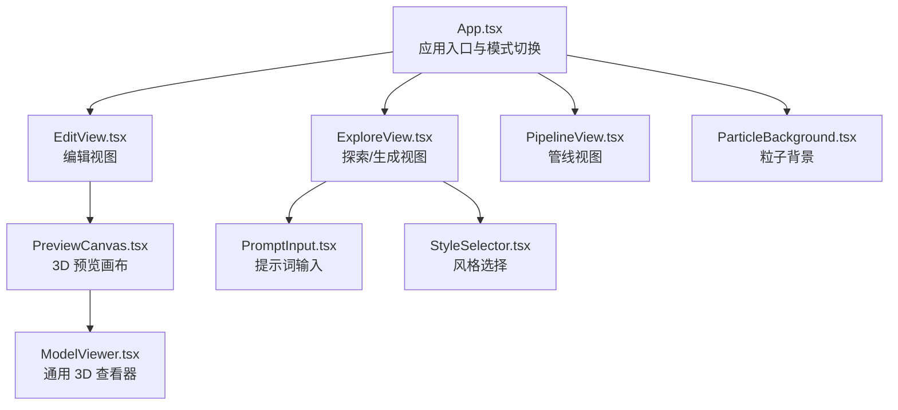
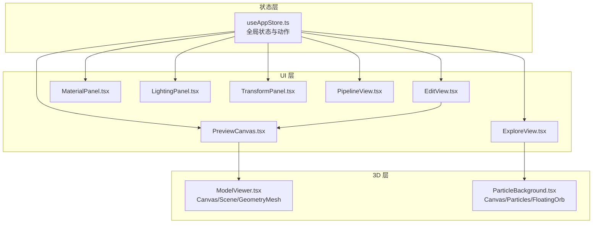
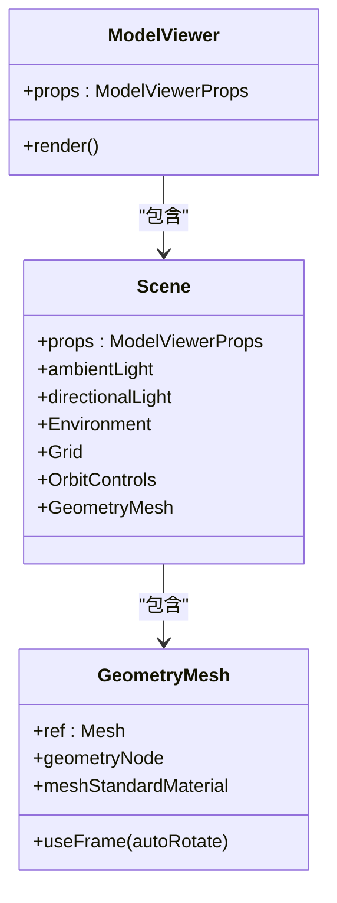
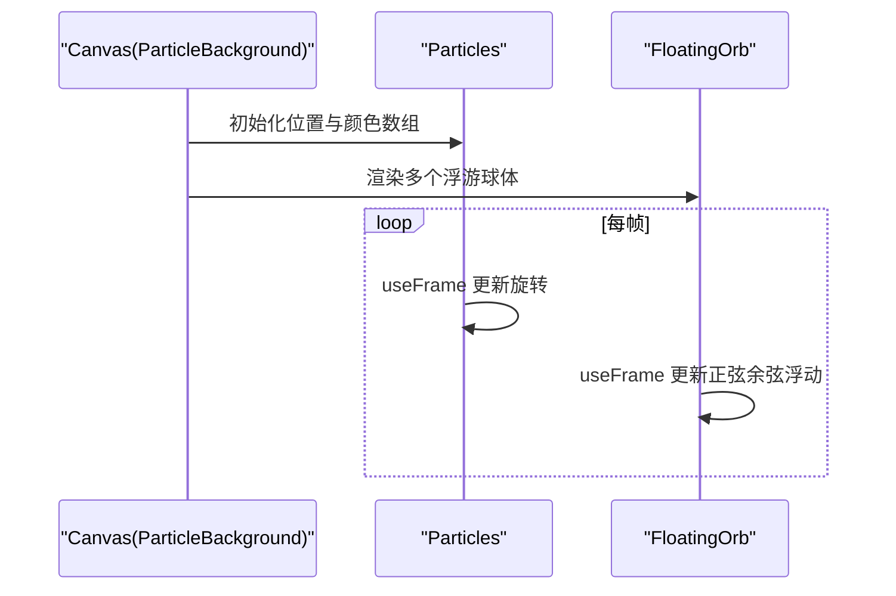
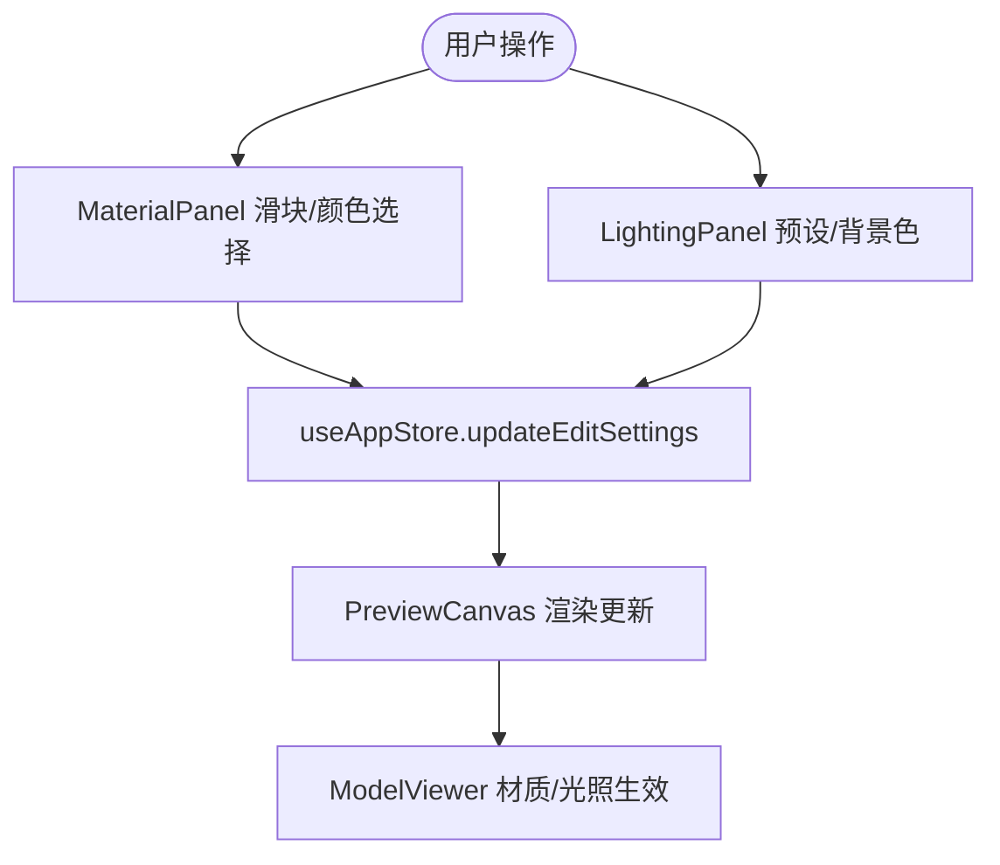
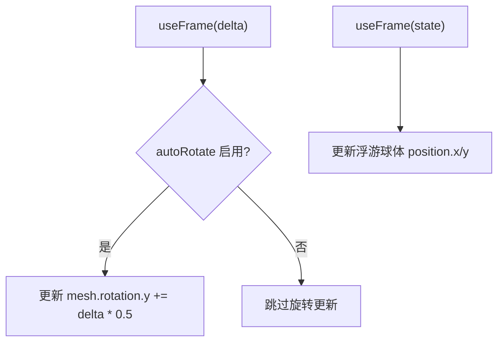
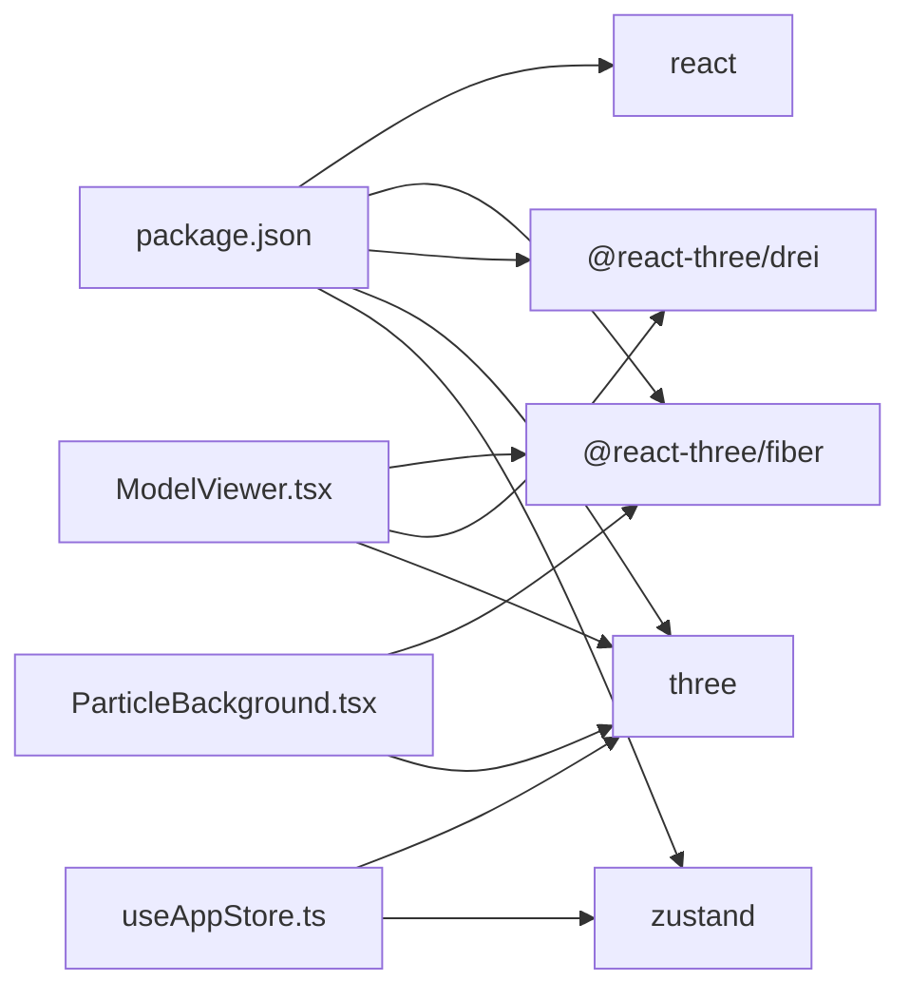

# 3D渲染系统

<cite>
**本文引用的文件**
- [App.tsx](file://src/App.tsx)
- [main.tsx](file://src/main.tsx)
- [ModelViewer.tsx](file://src/components/Shared/ModelViewer.tsx)
- [ParticleBackground.tsx](file://src/components/Background/ParticleBackground.tsx)
- [PreviewCanvas.tsx](file://src/components/Edit/PreviewCanvas.tsx)
- [MaterialPanel.tsx](file://src/components/Edit/MaterialPanel.tsx)
- [LightingPanel.tsx](file://src/components/Edit/LightingPanel.tsx)
- [TransformPanel.tsx](file://src/components/Edit/TransformPanel.tsx)
- [EditView.tsx](file://src/components/Edit/EditView.tsx)
- [ExploreView.tsx](file://src/components/Explore/ExploreView.tsx)
- [PipelineView.tsx](file://src/components/Pipeline/PipelineView.tsx)
- [PromptInput.tsx](file://src/components/Explore/PromptInput.tsx)
- [StyleSelector.tsx](file://src/components/Explore/StyleSelector.tsx)
- [useAppStore.ts](file://src/store/useAppStore.ts)
- [mockData.ts](file://src/utils/mockData.ts)
- [types/index.ts](file://src/types/index.ts)
- [package.json](file://package.json)
</cite>

## 目录
1. [简介](#简介)
2. [项目结构](#项目结构)
3. [核心组件](#核心组件)
4. [架构总览](#架构总览)
5. [详细组件分析](#详细组件分析)
6. [依赖关系分析](#依赖关系分析)
7. [性能考量](#性能考量)
8. [故障排查指南](#故障排查指南)
9. [结论](#结论)
10. [附录](#附录)

## 简介
本技术文档围绕基于 Three.js 与 @react-three/fiber 的 3D 渲染系统进行深入解析，涵盖场景管理、材质系统、光照设置、动画控制、ModelViewer 组件设计与实现、粒子背景系统、3D 性能优化策略、自定义材质与着色器使用示例，以及 3D 模型加载、渲染与交互的技术细节，并提供常见 3D 渲染问题的解决方案。

## 项目结构
该应用采用 React + Vite 构建，Three.js 生态通过 @react-three/fiber 与 @react-three/drei 提供声明式 3D 场景与辅助工具。核心 3D 组件集中在 components/Shared 与 components/Edit 下，状态管理由 Zustand 的 useAppStore 负责，类型定义位于 types/index.ts，示例数据在 utils/mockData.ts 中。

图表来源
- [App.tsx:10-32](file://src/App.tsx#L10-L32)
- [ExploreView.tsx:11-263](file://src/components/Explore/ExploreView.tsx#L11-L263)
- [EditView.tsx:9-159](file://src/components/Edit/EditView.tsx#L9-L159)
- [PipelineView.tsx:9-168](file://src/components/Pipeline/PipelineView.tsx#L9-L168)
- [PreviewCanvas.tsx:5-53](file://src/components/Edit/PreviewCanvas.tsx#L5-L53)
- [ModelViewer.tsx:136-156](file://src/components/Shared/ModelViewer.tsx#L136-L156)
- [ParticleBackground.tsx:88-107](file://src/components/Background/ParticleBackground.tsx#L88-L107)
- [PromptInput.tsx:8-161](file://src/components/Explore/PromptInput.tsx#L8-L161)
- [StyleSelector.tsx:11-61](file://src/components/Explore/StyleSelector.tsx#L11-L61)

章节来源
- [App.tsx:10-32](file://src/App.tsx#L10-L32)
- [main.tsx:7-13](file://src/main.tsx#L7-L13)

## 核心组件
- ModelViewer：基于 @react-three/fiber 的通用 3D 查看器，支持几何体切换、材质参数、光照预设、网格显示、轨道控制器与自动旋转。
- ParticleBackground：基于 Points 的粒子背景系统，包含可动浮游球体与渐变遮罩。
- PreviewCanvas：编辑视图中的 3D 预览容器，绑定全局编辑设置。
- 材质面板、光照面板、变换面板：通过 Zustand 状态驱动实时更新材质与场景参数。
- 探索视图与管线视图：提供生成流程与参数配置界面。

章节来源
- [ModelViewer.tsx:1-156](file://src/components/Shared/ModelViewer.tsx#L1-L156)
- [ParticleBackground.tsx:1-108](file://src/components/Background/ParticleBackground.tsx#L1-L108)
- [PreviewCanvas.tsx:1-54](file://src/components/Edit/PreviewCanvas.tsx#L1-L54)
- [MaterialPanel.tsx:1-209](file://src/components/Edit/MaterialPanel.tsx#L1-L209)
- [LightingPanel.tsx:1-78](file://src/components/Edit/LightingPanel.tsx#L1-L78)
- [TransformPanel.tsx:1-102](file://src/components/Edit/TransformPanel.tsx#L1-L102)
- [EditView.tsx:1-159](file://src/components/Edit/EditView.tsx#L1-L159)
- [ExploreView.tsx:1-263](file://src/components/Explore/ExploreView.tsx#L1-L263)
- [PipelineView.tsx:1-168](file://src/components/Pipeline/PipelineView.tsx#L1-L168)

## 架构总览
系统采用“声明式 3D 场景 + 全局状态驱动”的架构：
- 使用 Canvas 包裹场景，Scene 内部组合光源、环境贴图、几何体与材质。
- 通过 useFrame 实现每帧动画逻辑（如自动旋转、浮游球体运动）。
- 通过 useAppStore 将编辑设置与生成任务状态集中管理，驱动 UI 与 3D 视图联动。

图表来源
- [useAppStore.ts:100-311](file://src/store/useAppStore.ts#L100-L311)
- [EditView.tsx:9-159](file://src/components/Edit/EditView.tsx#L9-L159)
- [PreviewCanvas.tsx:5-53](file://src/components/Edit/PreviewCanvas.tsx#L5-L53)
- [MaterialPanel.tsx:71-209](file://src/components/Edit/MaterialPanel.tsx#L71-L209)
- [LightingPanel.tsx:14-78](file://src/components/Edit/LightingPanel.tsx#L14-L78)
- [TransformPanel.tsx:29-102](file://src/components/Edit/TransformPanel.tsx#L29-L102)
- [ExploreView.tsx:11-263](file://src/components/Explore/ExploreView.tsx#L11-L263)
- [PipelineView.tsx:9-168](file://src/components/Pipeline/PipelineView.tsx#L9-L168)
- [ModelViewer.tsx:82-126](file://src/components/Shared/ModelViewer.tsx#L82-L126)
- [ParticleBackground.tsx:88-107](file://src/components/Background/ParticleBackground.tsx#L88-L107)

## 详细组件分析

### ModelViewer 组件设计与实现
ModelViewer 是一个高度可配置的 3D 查看器，支持：
- 几何体切换：盒体、球体、环面、圆柱、圆锥、环面结。
- 材质参数：基础颜色、金属度、粗糙度、自发光颜色与强度。
- 光照预设：影棚、户外、戏剧、中性四种环境贴图预设。
- 辅助网格与轨道控制器：便于观察与交互。
- 自动旋转：通过 useFrame 在每帧更新旋转角度。
- 相机与渲染参数：根据紧凑模式调整相机位置与视野。

图表来源
- [ModelViewer.tsx:6-21](file://src/components/Shared/ModelViewer.tsx#L6-L21)
- [ModelViewer.tsx:82-126](file://src/components/Shared/ModelViewer.tsx#L82-L126)
- [ModelViewer.tsx:32-80](file://src/components/Shared/ModelViewer.tsx#L32-L80)

章节来源
- [ModelViewer.tsx:1-156](file://src/components/Shared/ModelViewer.tsx#L1-L156)

### 粒子背景系统
粒子背景通过 Points 实现，包含：
- 大量点阵列（位置与颜色数组），使用 BufferGeometry 与 BufferAttribute。
- useFrame 实现整体旋转动画。
- 浮游球体（FloatingOrb）通过正弦余弦函数模拟浮动轨迹。
- 透明混合与深度写入关闭以实现叠加发光效果。

图表来源
- [ParticleBackground.tsx:5-68](file://src/components/Background/ParticleBackground.tsx#L5-L68)
- [ParticleBackground.tsx:70-86](file://src/components/Background/ParticleBackground.tsx#L70-L86)
- [ParticleBackground.tsx:88-107](file://src/components/Background/ParticleBackground.tsx#L88-L107)

章节来源
- [ParticleBackground.tsx:1-108](file://src/components/Background/ParticleBackground.tsx#L1-L108)

### 材质系统与光照设置
- 材质面板：提供基础颜色、金属度、粗糙度、自发光颜色与强度、法线贴图强度等滑块控件，通过 useAppStore.updateEditSettings 实时更新。
- 光照面板：提供四种光照预设（影棚/户外/戏剧/中性），并允许设置背景色。
- 编辑视图：在简单模式与专业模式下分别提供基础控件与完整面板。

图表来源
- [MaterialPanel.tsx:71-209](file://src/components/Edit/MaterialPanel.tsx#L71-L209)
- [LightingPanel.tsx:14-78](file://src/components/Edit/LightingPanel.tsx#L14-L78)
- [PreviewCanvas.tsx:5-53](file://src/components/Edit/PreviewCanvas.tsx#L5-L53)
- [ModelViewer.tsx:82-126](file://src/components/Shared/ModelViewer.tsx#L82-L126)

章节来源
- [MaterialPanel.tsx:1-209](file://src/components/Edit/MaterialPanel.tsx#L1-L209)
- [LightingPanel.tsx:1-78](file://src/components/Edit/LightingPanel.tsx#L1-L78)
- [EditView.tsx:1-159](file://src/components/Edit/EditView.tsx#L1-L159)

### 动画控制与交互
- 自动旋转：GeometryMesh 使用 useFrame 按时间增量更新 Y 轴旋转。
- 浮游球体：FloatingOrb 使用三角函数在 X/Y 方向产生周期性位移。
- 轨道控制器：OrbitControls 提供缩放、平移与视角控制；在紧凑模式下禁用部分交互。
- 相机设置：根据 compact 模式调整相机位置与视野。

图表来源
- [ModelViewer.tsx:45-49](file://src/components/Shared/ModelViewer.tsx#L45-L49)
- [ParticleBackground.tsx:73-78](file://src/components/Background/ParticleBackground.tsx#L73-L78)
- [ModelViewer.tsx:119-123](file://src/components/Shared/ModelViewer.tsx#L119-L123)
- [ModelViewer.tsx:138-144](file://src/components/Shared/ModelViewer.tsx#L138-L144)

章节来源
- [ModelViewer.tsx:1-156](file://src/components/Shared/ModelViewer.tsx#L1-L156)
- [ParticleBackground.tsx:1-108](file://src/components/Background/ParticleBackground.tsx#L1-L108)

### 3D 模型加载、渲染与交互
- 加载与渲染：当前仓库未包含外部模型加载逻辑，ModelViewer 默认使用内置几何体与材质参数。若需加载外部模型，可在 Scene 或 GeometryMesh 中引入模型资源（例如通过 @react-three/drei 的 GLTF 组件或原生 Three.js 加载器）。
- 交互：通过 OrbitControls 提供鼠标/触摸交互；可通过属性开关启用/禁用缩放与平移。
- 环境与光照：Environment 提供多种光照预设；可结合 DirectionalLight/AmbientLight 进行精细调节。

章节来源
- [ModelViewer.tsx:82-126](file://src/components/Shared/ModelViewer.tsx#L82-L126)

### 生成与管线视图
- 探索视图：PromptInput 支持智能建议与快捷提示；StyleSelector 提供风格预设；生成过程中显示进度与 Agent 步骤详情。
- 管线视图：提供线性步骤列表与节点图两种模式，支持参数面板与运行控制。

章节来源
- [ExploreView.tsx:1-263](file://src/components/Explore/ExploreView.tsx#L1-L263)
- [PipelineView.tsx:1-168](file://src/components/Pipeline/PipelineView.tsx#L1-L168)
- [PromptInput.tsx:1-161](file://src/components/Explore/PromptInput.tsx#L1-L161)
- [StyleSelector.tsx:1-61](file://src/components/Explore/StyleSelector.tsx#L1-L61)

## 依赖关系分析
- 核心依赖：React、@react-three/fiber、@react-three/drei、three、zustand。
- 类型与状态：types/index.ts 定义 EditSettings、GenerationTask 等类型；useAppStore.ts 提供全局状态与动作。
- 示例数据：mockData.ts 提供默认编辑设置与风格预设。

图表来源
- [package.json:11-22](file://package.json#L11-L22)
- [useAppStore.ts:100-311](file://src/store/useAppStore.ts#L100-L311)
- [ModelViewer.tsx:1-4](file://src/components/Shared/ModelViewer.tsx#L1-L4)
- [ParticleBackground.tsx:1-3](file://src/components/Background/ParticleBackground.tsx#L1-L3)

章节来源
- [package.json:1-35](file://package.json#L1-L35)
- [types/index.ts:84-99](file://src/types/index.ts#L84-L99)
- [mockData.ts:14-27](file://src/utils/mockData.ts#L14-L27)

## 性能考量
- 渲染参数
  - 开启抗锯齿与透明背景，确保视觉质量但可能影响性能。
  - 在移动端或低端设备上可考虑降低分辨率或关闭透明度混合。
- 几何与材质
  - 控制几何细分参数，避免过度细分导致顶点数量爆炸。
  - 合理设置金属度与粗糙度范围，减少不必要的反射计算。
- 动画与帧率
  - useFrame 中的计算应尽量轻量，避免每帧进行昂贵的数学运算。
  - 对于大量粒子，优先使用 InstancedBufferGeometry 或 GPU 计算。
- 环境与光照
  - 环境贴图会增加采样成本，必要时可使用更小尺寸或关闭背景。
  - 减少光源数量与阴影计算，或在低端设备上禁用阴影。
- 交互与相机
  - 在不需要交互时禁用 OrbitControls，减少事件监听开销。
  - 合理设置相机视野与近远裁剪面，避免无效深度绘制。

## 故障排查指南
- 3D 场景不显示
  - 检查 Canvas 的 gl 参数与背景色是否正确设置。
  - 确认 Scene 内存在光源与几何体。
- 材质不生效
  - 确认材质参数传入路径正确，且未被后续渲染覆盖。
  - 检查环境贴图与光照是否与材质类型匹配（如 StandardMaterial）。
- 动画异常
  - useFrame 中的时间增量单位为秒，注意与期望速度一致。
  - 若出现卡顿，检查每帧计算复杂度与对象数量。
- 交互失效
  - 确认 OrbitControls 的启用状态与相机参数。
  - 检查是否有其他元素遮挡导致事件无法传递。

## 结论
本系统通过 @react-three/fiber 与 @react-three/drei 实现了声明式的 3D 场景构建，配合 Zustand 状态管理，提供了从材质、光照到动画与交互的完整编辑体验。粒子背景系统增强了视觉层次，生成与管线视图则扩展了工作流能力。未来可在模型加载、GPU 加速与性能监控方面进一步优化。

## 附录
- 自定义材质与着色器使用示例
  - 基础材质：使用 Standard/Phong/MeshPhysicalMaterial 并设置颜色、金属度、粗糙度、自发光等参数。
  - 自定义着色器：通过 ShaderMaterial 或 NodeMaterial 扩展片段/顶点着色器，适用于特殊效果（如法线动画、体积光照）。
  - 注意事项：确保材质属性与渲染管线兼容，避免过度复杂的着色器导致性能下降。
- 常见 3D 渲染问题与解决方案
  - 闪烁/走样：开启抗锯齿、提高采样率或使用 FXAA。
  - 透明度错乱：合理排序或使用混合模式，避免深度写入冲突。
  - 性能瓶颈：减少多光源、简化几何、使用 LOD 与批处理。