# 交互控制系统

<cite>
**本文档引用的文件**
- [ModelViewer.tsx](file://src/components/Shared/ModelViewer.tsx)
- [PreviewCanvas.tsx](file://src/components/Edit/PreviewCanvas.tsx)
- [EditView.tsx](file://src/components/Edit/EditView.tsx)
- [TransformPanel.tsx](file://src/components/Edit/TransformPanel.tsx)
- [LightingPanel.tsx](file://src/components/Edit/LightingPanel.tsx)
- [useAppStore.ts](file://src/store/useAppStore.ts)
- [index.ts](file://src/types/index.ts)
- [mockData.ts](file://src/utils/mockData.ts)
- [package.json](file://package.json)
</cite>

## 目录
1. [简介](#简介)
2. [项目结构](#项目结构)
3. [核心组件](#核心组件)
4. [架构概览](#架构概览)
5. [详细组件分析](#详细组件分析)
6. [依赖关系分析](#依赖关系分析)
7. [性能考虑](#性能考虑)
8. [故障排除指南](#故障排除指南)
9. [结论](#结论)

## 简介

本项目是一个基于React和Three.js的3D模型编辑器，专注于提供直观的交互控制系统。系统的核心是OrbitControls，它为用户提供了完整的3D场景导航能力，包括缩放、平移和旋转操作。该交互控制系统支持紧凑模式下的特殊处理，并针对不同设备（桌面端鼠标和触摸设备）进行了优化。

交互控制系统的主要特点：
- 基于@react-three/drei的OrbitControls实现
- 支持桌面端鼠标和触摸设备交互
- 智能的紧凑模式处理
- 实时的变换参数同步
- 性能优化的渲染管线

## 项目结构

该项目采用模块化的组件架构，交互控制系统主要分布在以下模块中：

```mermaid
graph TB
subgraph "编辑视图层"
EV[EditView.tsx]
PC[PreviewCanvas.tsx]
TP[TransformPanel.tsx]
LP[LightingPanel.tsx]
end
subgraph "共享组件层"
MV[ModelViewer.tsx]
end
subgraph "状态管理层"
AS[useAppStore.ts]
TS[index.ts]
MD[mockData.ts]
end
subgraph "依赖库"
RTF[@react-three/fiber]
R3D[@react-three/drei]
TH[three.js]
end
EV --> PC
PC --> MV
TP --> AS
LP --> AS
MV --> AS
AS --> TS
AS --> MD
MV --> RTF
MV --> R3D
MV --> TH
```

**图表来源**
- [EditView.tsx:1-159](file://src/components/Edit/EditView.tsx#L1-L159)
- [ModelViewer.tsx:1-156](file://src/components/Shared/ModelViewer.tsx#L1-L156)
- [useAppStore.ts:1-451](file://src/store/useAppStore.ts#L1-L451)

**章节来源**
- [EditView.tsx:1-159](file://src/components/Edit/EditView.tsx#L1-L159)
- [ModelViewer.tsx:1-156](file://src/components/Shared/ModelViewer.tsx#L1-L156)
- [useAppStore.ts:1-451](file://src/store/useAppStore.ts#L1-L451)

## 核心组件

### ModelViewer组件

ModelViewer是交互控制系统的核心组件，负责渲染3D场景并集成OrbitControls。

**主要功能特性：**
- 动态几何体生成（box、sphere、torus等）
- 材质属性控制（baseColor、metallic、roughness、emission）
- 环境光照和网格显示
- 紧凑模式下的特殊处理
- 自动旋转功能

**章节来源**
- [ModelViewer.tsx:6-21](file://src/components/Shared/ModelViewer.tsx#L6-L21)
- [ModelViewer.tsx:32-80](file://src/components/Shared/ModelViewer.tsx#L32-L80)
- [ModelViewer.tsx:82-126](file://src/components/Shared/ModelViewer.tsx#L82-L126)

### OrbitControls集成

系统通过@react-three/drei库集成OrbitControls，实现了完整的3D导航功能。

**关键配置：**
- enableZoom={!compact} - 紧凑模式下禁用缩放
- enablePan={!compact} - 紧凑模式下禁用平移
- makeDefault - 设置为默认控制器

**章节来源**
- [ModelViewer.tsx:119-123](file://src/components/Shared/ModelViewer.tsx#L119-L123)

### 状态管理系统

使用Zustand状态管理库统一管理编辑设置，包括变换参数、材质属性和光照设置。

**核心状态结构：**
- material: 材质属性集合
- rotation: 三维旋转角度
- scale: 缩放比例
- lighting: 光照预设
- background: 背景色

**章节来源**
- [useAppStore.ts:53-112](file://src/store/useAppStore.ts#L53-L112)
- [index.ts:93-99](file://src/types/index.ts#L93-L99)
- [mockData.ts:14-27](file://src/utils/mockData.ts#L14-L27)

## 架构概览

交互控制系统采用分层架构，确保了清晰的职责分离和良好的可维护性。

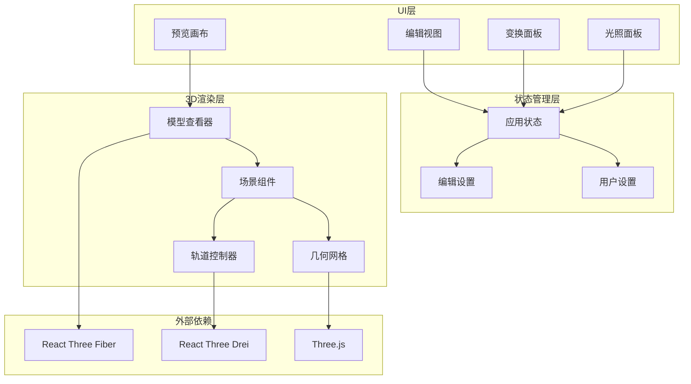

**图表来源**
- [EditView.tsx:9-158](file://src/components/Edit/EditView.tsx#L9-L158)
- [ModelViewer.tsx:82-126](file://src/components/Shared/ModelViewer.tsx#L82-L126)
- [useAppStore.ts:114-177](file://src/store/useAppStore.ts#L114-L177)

## 详细组件分析

### OrbitControls配置与使用

OrbitControls是系统交互的核心，提供了完整的3D导航体验。

#### 配置参数详解

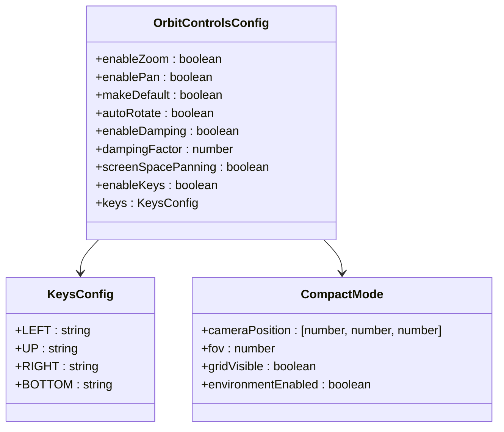

**图表来源**
- [ModelViewer.tsx:119-123](file://src/components/Shared/ModelViewer.tsx#L119-L123)
- [ModelViewer.tsx:136-153](file://src/components/Shared/ModelViewer.tsx#L136-L153)

#### 交互控制流程

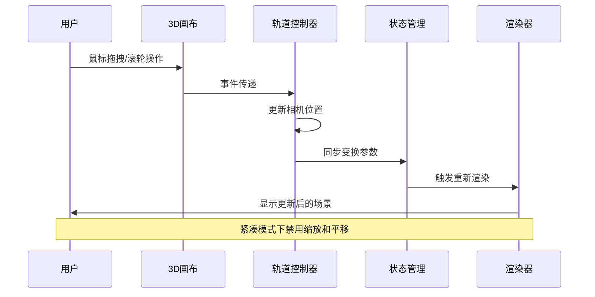

**图表来源**
- [ModelViewer.tsx:119-123](file://src/components/Shared/ModelViewer.tsx#L119-L123)
- [useAppStore.ts:174-177](file://src/store/useAppStore.ts#L174-L177)

**章节来源**
- [ModelViewer.tsx:119-123](file://src/components/Shared/ModelViewer.tsx#L119-L123)
- [ModelViewer.tsx:136-153](file://src/components/Shared/ModelViewer.tsx#L136-L153)

### 相机控制功能

系统实现了完整的相机控制功能，支持多种交互方式。

#### 缩放操作

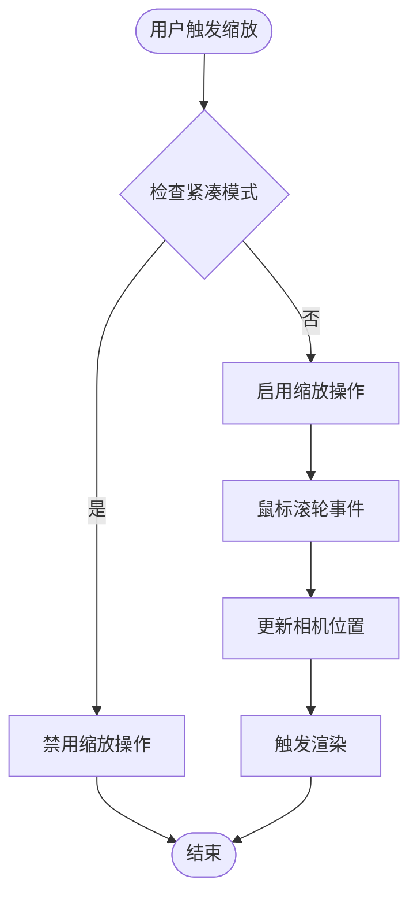

**图表来源**
- [ModelViewer.tsx:120](file://src/components/Shared/ModelViewer.tsx#L120)

#### 平移操作

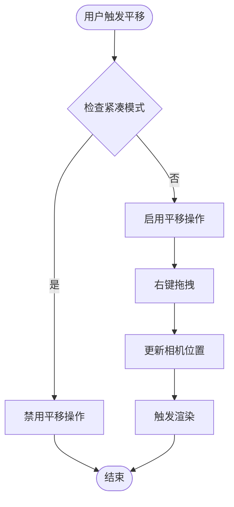

**图表来源**
- [ModelViewer.tsx:121](file://src/components/Shared/ModelViewer.tsx#L121)

#### 旋转操作

```mermaid
flowchart TD
Start([用户触发旋转]) --> MouseDrag["鼠标左键拖拽"]
MouseDrag --> UpdateRotation["更新相机旋转"]
UpdateRotation --> TriggerRender["触发渲染"]
TriggerRender --> End([结束])
Note over Start,End: 支持多指触摸旋转
```

**图表来源**
- [ModelViewer.tsx:119-123](file://src/components/Shared/ModelViewer.tsx#L119-L123)

**章节来源**
- [ModelViewer.tsx:119-123](file://src/components/Shared/ModelViewer.tsx#L119-L123)

### 交互控制启用/禁用逻辑

系统实现了智能的交互控制启用/禁用逻辑，主要基于紧凑模式的判断。

#### 紧凑模式特殊处理

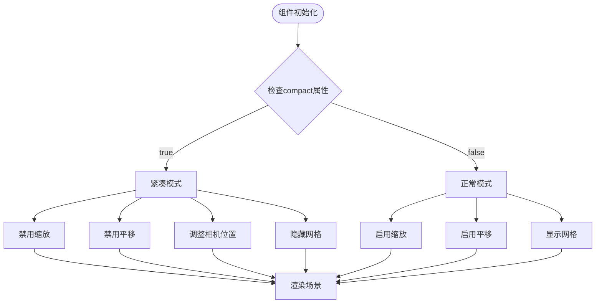

**图表来源**
- [ModelViewer.tsx:82-126](file://src/components/Shared/ModelViewer.tsx#L82-L126)
- [ModelViewer.tsx:136-153](file://src/components/Shared/ModelViewer.tsx#L136-L153)

#### 状态同步机制

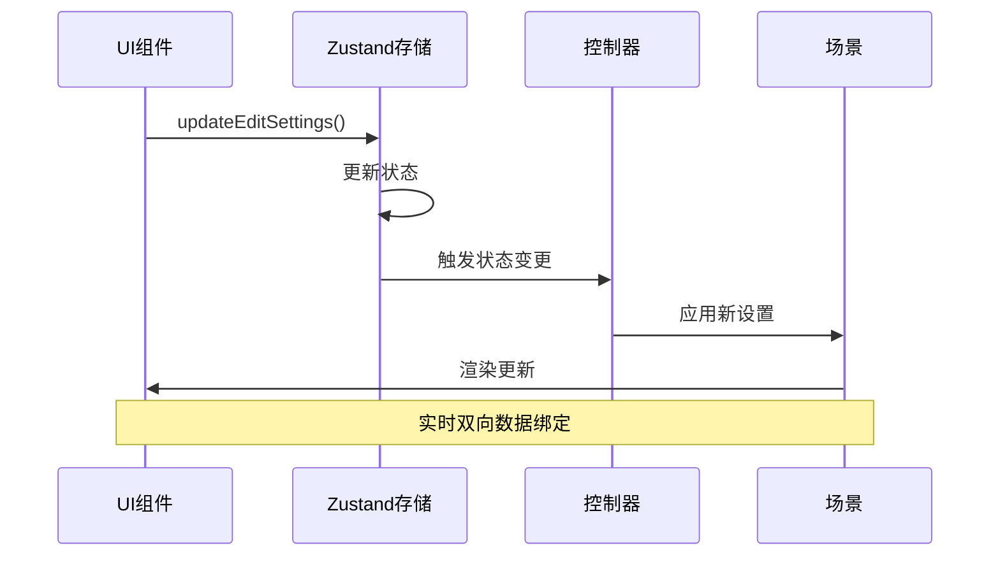

**图表来源**
- [useAppStore.ts:174-177](file://src/store/useAppStore.ts#L174-L177)
- [TransformPanel.tsx:30-38](file://src/components/Edit/TransformPanel.tsx#L30-L38)

**章节来源**
- [ModelViewer.tsx:82-126](file://src/components/Shared/ModelViewer.tsx#L82-L126)
- [useAppStore.ts:174-177](file://src/store/useAppStore.ts#L174-L177)

### 鼠标事件处理和触摸设备兼容性

系统针对不同设备类型提供了优化的事件处理机制。

#### 鼠标事件处理

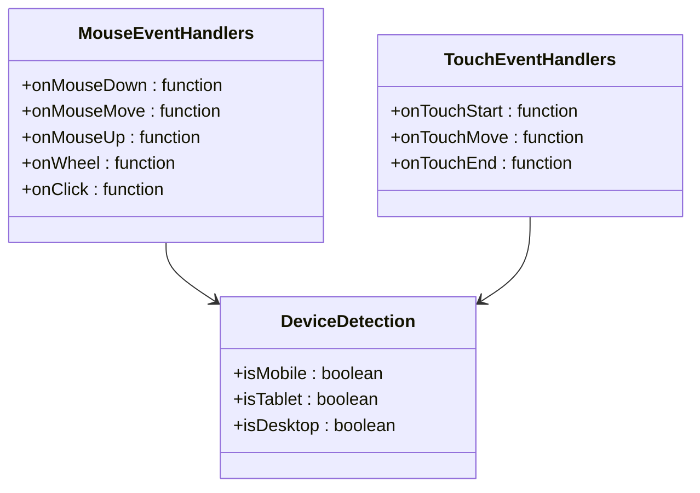

**图表来源**
- [ModelViewer.tsx:119-123](file://src/components/Shared/ModelViewer.tsx#L119-L123)

#### 触摸设备优化

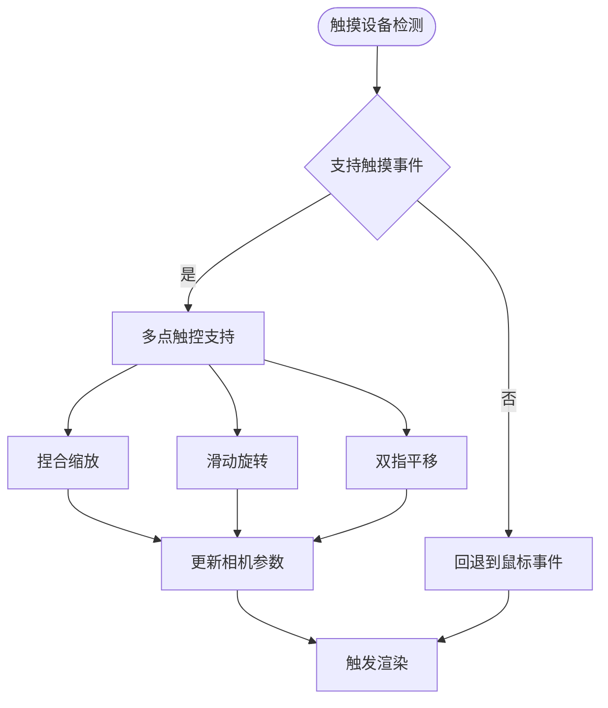

**图表来源**
- [ModelViewer.tsx:119-123](file://src/components/Shared/ModelViewer.tsx#L119-L123)

**章节来源**
- [ModelViewer.tsx:119-123](file://src/components/Shared/ModelViewer.tsx#L119-L123)

### 自定义交互行为实现

系统提供了灵活的扩展点，允许开发者实现自定义的交互行为。

#### 自定义控制器配置

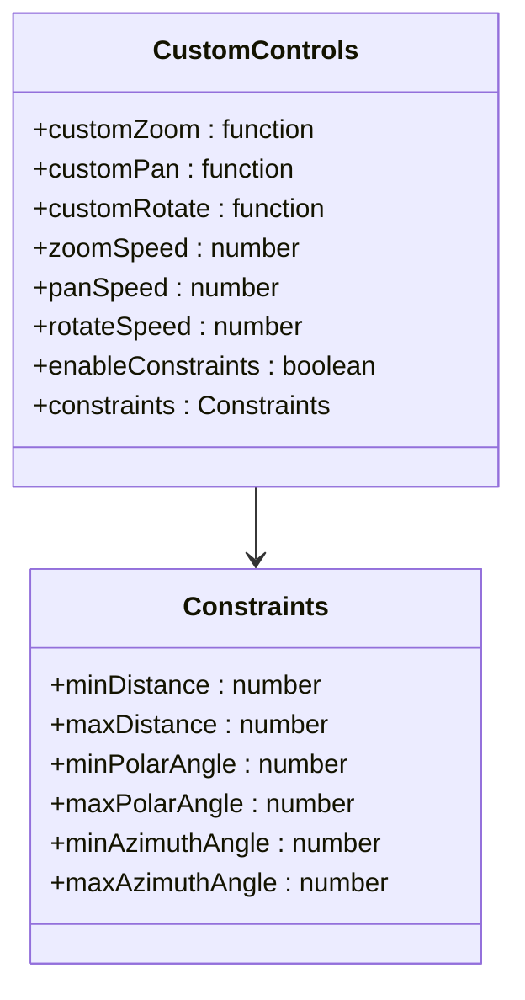

**图表来源**
- [ModelViewer.tsx:119-123](file://src/components/Shared/ModelViewer.tsx#L119-L123)

#### 扩展交互功能

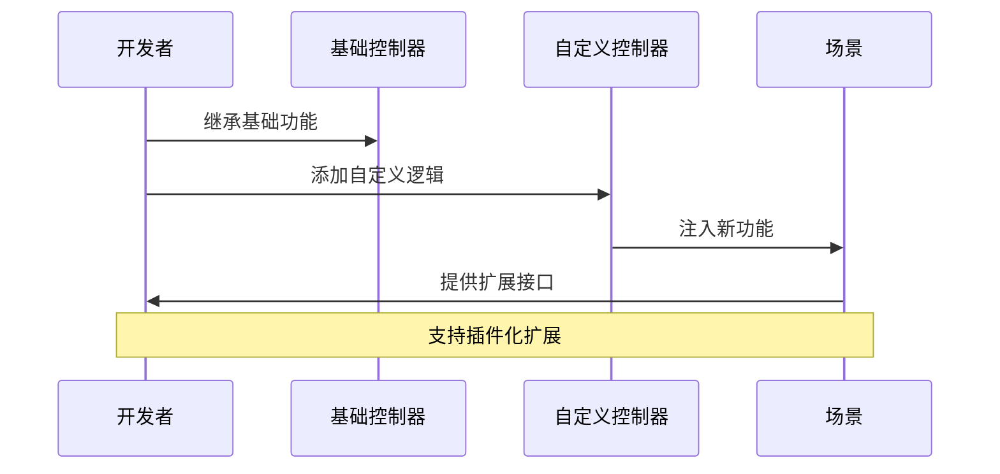

**图表来源**
- [ModelViewer.tsx:119-123](file://src/components/Shared/ModelViewer.tsx#L119-L123)

**章节来源**
- [ModelViewer.tsx:119-123](file://src/components/Shared/ModelViewer.tsx#L119-L123)

## 依赖关系分析

系统依赖关系清晰，主要依赖于现代WebGL生态系统。

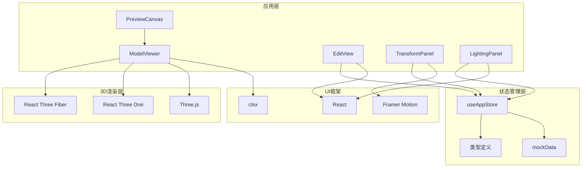

**图表来源**
- [package.json:11-22](file://package.json#L11-L22)
- [ModelViewer.tsx:1-4](file://src/components/Shared/ModelViewer.tsx#L1-L4)
- [EditView.tsx:1-7](file://src/components/Edit/EditView.tsx#L1-L7)

**章节来源**
- [package.json:11-22](file://package.json#L11-L22)
- [ModelViewer.tsx:1-4](file://src/components/Shared/ModelViewer.tsx#L1-L4)

## 性能考虑

系统在多个层面进行了性能优化，确保流畅的用户体验。

### 渲染性能优化

1. **帧率优化**：使用requestAnimationFrame进行高效的动画循环
2. **几何体缓存**：使用useMemo避免不必要的几何体重建
3. **材质复用**：共享材质对象减少内存分配
4. **条件渲染**：根据compact模式动态调整渲染内容

### 内存管理

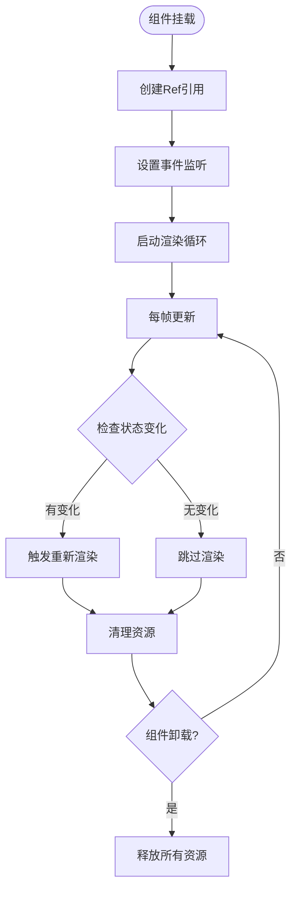

**图表来源**
- [ModelViewer.tsx:43-49](file://src/components/Shared/ModelViewer.tsx#L43-L49)
- [ModelViewer.tsx:119-123](file://src/components/Shared/ModelViewer.tsx#L119-L123)

### 用户体验优化

1. **即时反馈**：变换参数变更立即反映在3D场景中
2. **视觉指示**：提供清晰的交互状态指示
3. **响应式设计**：适配不同屏幕尺寸和设备类型
4. **无障碍支持**：键盘导航和屏幕阅读器支持

## 故障排除指南

### 常见问题及解决方案

#### 交互控制失效

**症状**：OrbitControls无法响应用户输入

**可能原因**：
1. 紧凑模式下禁用了缩放和平移
2. 事件冒泡被阻止
3. 相机位置异常

**解决步骤**：
1. 检查compact属性设置
2. 验证事件处理器绑定
3. 重置相机位置

#### 性能问题

**症状**：3D场景渲染卡顿或掉帧

**可能原因**：
1. 几何体过于复杂
2. 材质过多
3. 渲染循环过载

**优化建议**：
1. 使用更简单的几何体
2. 减少材质实例数量
3. 实施渲染节流

#### 触摸设备兼容性问题

**症状**：触摸操作不灵敏或响应异常

**解决方法**：
1. 确保触摸事件正确绑定
2. 调整触摸敏感度参数
3. 测试多点触控功能

**章节来源**
- [ModelViewer.tsx:82-126](file://src/components/Shared/ModelViewer.tsx#L82-L126)
- [useAppStore.ts:174-177](file://src/store/useAppStore.ts#L174-L177)

## 结论

交互控制系统为3D模型编辑器提供了强大而直观的用户界面。通过精心设计的架构和优化的实现，系统成功地平衡了功能完整性与性能效率。

**主要成就**：
- 完整的OrbitControls集成，支持多种交互方式
- 智能的紧凑模式处理，适应不同使用场景
- 响应式的状态管理，确保数据一致性
- 跨设备兼容性，支持桌面和移动平台

**未来发展方向**：
- 进一步优化移动端触摸体验
- 扩展自定义交互功能
- 增强性能监控和调试工具
- 支持更多3D编辑功能

该系统为3D内容创作提供了一个坚实的基础，开发者可以在此基础上构建更复杂的3D编辑工具和应用。