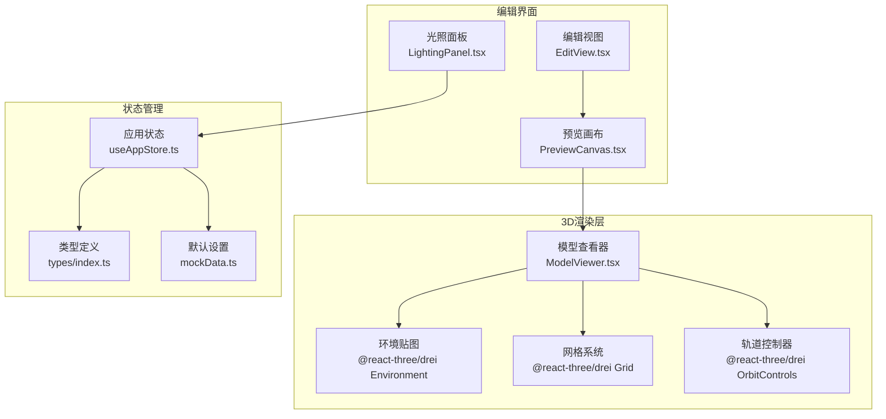
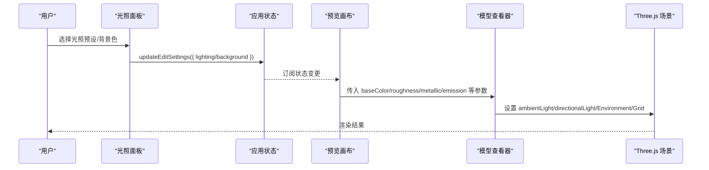
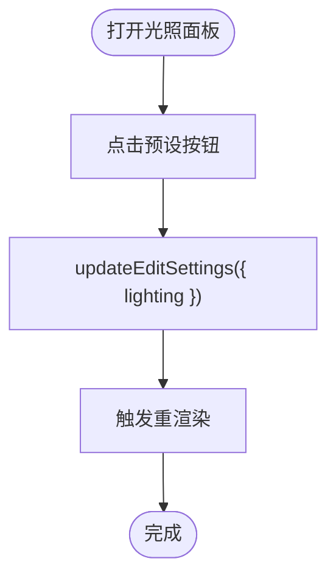
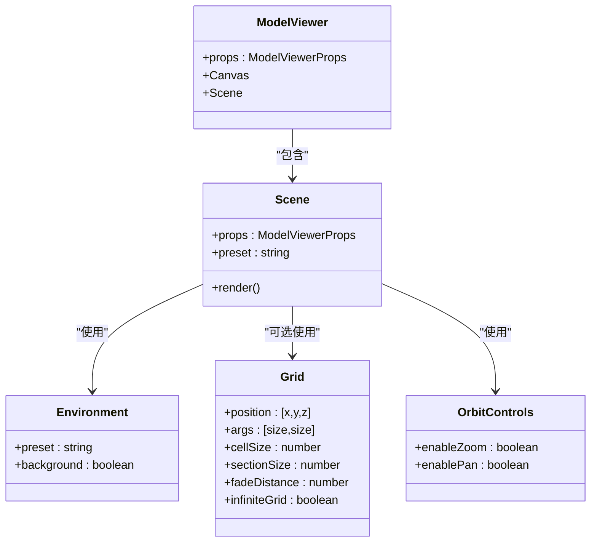
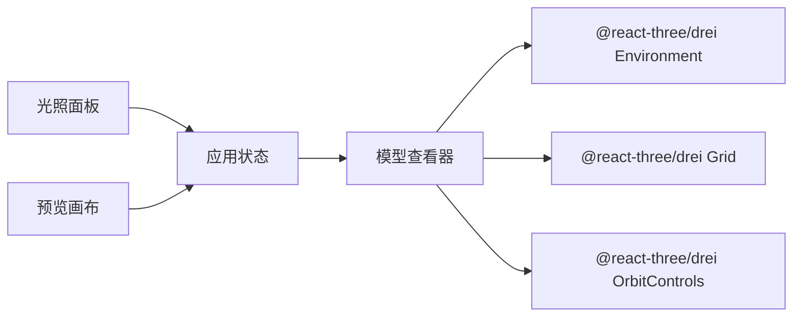

# 光照与环境系统

<cite>
**本文档引用的文件**
- [LightingPanel.tsx](file://src/components/Edit/LightingPanel.tsx)
- [ModelViewer.tsx](file://src/components/Shared/ModelViewer.tsx)
- [PreviewCanvas.tsx](file://src/components/Edit/PreviewCanvas.tsx)
- [EditView.tsx](file://src/components/Edit/EditView.tsx)
- [useAppStore.ts](file://src/store/useAppStore.ts)
- [index.ts](file://src/types/index.ts)
- [mockData.ts](file://src/utils/mockData.ts)
</cite>

## 目录
1. [简介](#简介)
2. [项目结构](#项目结构)
3. [核心组件](#核心组件)
4. [架构总览](#架构总览)
5. [详细组件分析](#详细组件分析)
6. [依赖关系分析](#依赖关系分析)
7. [性能考量](#性能考量)
8. [故障排查指南](#故障排查指南)
9. [结论](#结论)
10. [附录：自定义光照场景最佳实践](#附录自定义光照场景最佳实践)

## 简介
本文件聚焦于项目中的光照与环境系统，涵盖三种光照预设（studio、outdoor、dramatic、neutral）的配置与应用场景，环境贴图的加载与应用、背景设置，方向光与环境光的组合使用方式，网格系统的配置与视觉效果，并提供光照优化策略与性能考虑，以及自定义光照场景的实现示例与最佳实践。

## 项目结构
光照与环境系统主要由以下模块构成：
- 编辑视图中的光照面板，提供预设选择与背景色设置
- 预览画布，将编辑状态传递给3D渲染器
- 3D模型查看器，负责实际的光照、环境贴图与网格渲染
- 应用状态管理，保存光照与背景等编辑设置
- 类型定义，约束光照预设与编辑设置的数据结构

图表来源
- [LightingPanel.tsx:14-77](file://src/components/Edit/LightingPanel.tsx#L14-L77)
- [EditView.tsx:9-158](file://src/components/Edit/EditView.tsx#L9-L158)
- [PreviewCanvas.tsx:5-25](file://src/components/Edit/PreviewCanvas.tsx#L5-L25)
- [ModelViewer.tsx:82-126](file://src/components/Shared/ModelViewer.tsx#L82-L126)
- [useAppStore.ts:160-163](file://src/store/useAppStore.ts#L160-L163)
- [index.ts:93-99](file://src/types/index.ts#L93-L99)
- [mockData.ts:14-27](file://src/utils/mockData.ts#L14-L27)

章节来源
- [LightingPanel.tsx:1-78](file://src/components/Edit/LightingPanel.tsx#L1-L78)
- [ModelViewer.tsx:1-156](file://src/components/Shared/ModelViewer.tsx#L1-L156)
- [PreviewCanvas.tsx:1-54](file://src/components/Edit/PreviewCanvas.tsx#L1-L54)
- [EditView.tsx:1-159](file://src/components/Edit/EditView.tsx#L1-L159)
- [useAppStore.ts:160-163](file://src/store/useAppStore.ts#L160-L163)
- [index.ts:93-99](file://src/types/index.ts#L93-L99)
- [mockData.ts:14-27](file://src/utils/mockData.ts#L14-L27)

## 核心组件
- 光照面板：提供四种光照预设（studio、outdoor、dramatic、neutral）的选择入口，并支持背景色选择。
- 模型查看器：在Scene中组合环境贴图、方向光、环境光、网格与轨道控制器；根据预设映射选择合适的环境贴图。
- 预览画布：从应用状态读取当前光照与背景设置，传递给模型查看器。
- 应用状态：维护编辑设置（包括光照与背景），并提供更新方法。
- 类型定义：约束光照预设枚举与编辑设置结构。

章节来源
- [LightingPanel.tsx:7-12](file://src/components/Edit/LightingPanel.tsx#L7-L12)
- [ModelViewer.tsx:25-30](file://src/components/Shared/ModelViewer.tsx#L25-L30)
- [ModelViewer.tsx:95-96](file://src/components/Shared/ModelViewer.tsx#L95-L96)
- [PreviewCanvas.tsx:12-24](file://src/components/Edit/PreviewCanvas.tsx#L12-L24)
- [useAppStore.ts:160-163](file://src/store/useAppStore.ts#L160-L163)
- [index.ts:97](file://src/types/index.ts#L97)

## 架构总览
光照与环境系统采用“UI面板 -> 状态管理 -> 渲染器”的分层架构。光照面板通过状态更新改变编辑设置，预览画布将这些设置传入模型查看器，模型查看器在Scene中组合光源与环境贴图，最终渲染到Canvas中。

图表来源
- [LightingPanel.tsx:44-50](file://src/components/Edit/LightingPanel.tsx#L44-L50)
- [useAppStore.ts:160-163](file://src/store/useAppStore.ts#L160-L163)
- [PreviewCanvas.tsx:12-24](file://src/components/Edit/PreviewCanvas.tsx#L12-L24)
- [ModelViewer.tsx:95-103](file://src/components/Shared/ModelViewer.tsx#L95-L103)

## 详细组件分析

### 光照面板（LightingPanel）
- 功能：提供四种光照预设按钮与背景色选择器，支持展开/收起动画。
- 数据流：点击预设后调用状态更新函数，将新的光照模式写入编辑设置。
- 视觉反馈：当前选中项具有高亮边框与阴影效果。

图表来源
- [LightingPanel.tsx:44-50](file://src/components/Edit/LightingPanel.tsx#L44-L50)
- [useAppStore.ts:160-163](file://src/store/useAppStore.ts#L160-L163)

章节来源
- [LightingPanel.tsx:14-77](file://src/components/Edit/LightingPanel.tsx#L14-L77)

### 模型查看器（ModelViewer）
- 环境贴图映射：通过预设映射表将UI预设映射到Three.js环境贴图名称。
- 光源组合：固定添加环境光与方向光，再按需加载环境贴图。
- 网格系统：在非紧凑模式下显示网格，支持尺寸、厚度、颜色与衰减参数。
- 背景设置：通过Canvas与容器样式支持背景色。

图表来源
- [ModelViewer.tsx:82-126](file://src/components/Shared/ModelViewer.tsx#L82-L126)
- [ModelViewer.tsx:25-30](file://src/components/Shared/ModelViewer.tsx#L25-L30)
- [ModelViewer.tsx:95-103](file://src/components/Shared/ModelViewer.tsx#L95-L103)
- [ModelViewer.tsx:104-118](file://src/components/Shared/ModelViewer.tsx#L104-L118)
- [ModelViewer.tsx:119-123](file://src/components/Shared/ModelViewer.tsx#L119-L123)

章节来源
- [ModelViewer.tsx:25-30](file://src/components/Shared/ModelViewer.tsx#L25-L30)
- [ModelViewer.tsx:95-103](file://src/components/Shared/ModelViewer.tsx#L95-L103)
- [ModelViewer.tsx:104-118](file://src/components/Shared/ModelViewer.tsx#L104-L118)
- [ModelViewer.tsx:119-123](file://src/components/Shared/ModelViewer.tsx#L119-L123)

### 预览画布（PreviewCanvas）
- 将编辑设置（材质、光照、背景、几何体等）传递给模型查看器。
- 提供基础的视口控制按钮占位（缩放、旋转、最大化等）。

章节来源
- [PreviewCanvas.tsx:12-24](file://src/components/Edit/PreviewCanvas.tsx#L12-L24)

### 编辑视图（EditView）
- 在专业模式下展示材质、变换与光照面板。
- 在简单模式下提供基础颜色与变换控件。

章节来源
- [EditView.tsx:105-112](file://src/components/Edit/EditView.tsx#L105-L112)
- [EditView.tsx:30-104](file://src/components/Edit/EditView.tsx#L30-L104)

### 应用状态与类型定义
- 应用状态：维护编辑设置并提供更新方法；默认光照为studio，背景色为深色。
- 类型定义：限定光照预设枚举与编辑设置字段。

章节来源
- [useAppStore.ts:160-163](file://src/store/useAppStore.ts#L160-L163)
- [index.ts:97](file://src/types/index.ts#L97)
- [mockData.ts:25](file://src/utils/mockData.ts#L25)

## 依赖关系分析
- 光照面板依赖应用状态以更新编辑设置。
- 预览画布依赖应用状态以读取当前编辑设置。
- 模型查看器依赖Three.js与@react-three/drei进行渲染。
- 环境贴图通过预设映射表与Scene组合使用。

图表来源
- [LightingPanel.tsx:15](file://src/components/Edit/LightingPanel.tsx#L15)
- [PreviewCanvas.tsx:6](file://src/components/Edit/PreviewCanvas.tsx#L6)
- [ModelViewer.tsx:3](file://src/components/Shared/ModelViewer.tsx#L3)

章节来源
- [LightingPanel.tsx:15](file://src/components/Edit/LightingPanel.tsx#L15)
- [PreviewCanvas.tsx:6](file://src/components/Edit/PreviewCanvas.tsx#L6)
- [ModelViewer.tsx:3](file://src/components/Shared/ModelViewer.tsx#L3)

## 性能考量
- 环境贴图加载：环境贴图作为场景全局光照的一部分，建议在需要时才启用，避免不必要的资源开销。
- 网格渲染：网格在非紧凑模式下启用，可通过参数调节衰减距离与强度，减少远距离网格的绘制成本。
- 光源数量：场景中固定使用环境光与方向光，保持光源数量稳定有助于性能一致性。
- 抗锯齿与透明背景：Canvas启用了抗锯齿与透明背景，注意在低端设备上的性能表现，必要时可关闭透明背景或降低抗锯齿级别。
- 自动旋转：仅在需要时启用自动旋转，避免不必要的帧更新。

[本节为通用性能指导，不直接分析具体文件]

## 故障排查指南
- 环境贴图未生效：确认Scene中是否正确传入预设映射值，且Environment组件的preset与background参数正确。
- 光照预设无效：检查光照面板的updateEditSettings调用是否成功写入状态，以及预览画布是否将最新设置传递给模型查看器。
- 网格显示异常：检查Grid组件的参数（位置、尺寸、衰减距离等）是否合理，确保在非紧凑模式下启用。
- 背景色不生效：确认Canvas与容器样式是否正确设置背景色，避免被其他元素覆盖。

章节来源
- [ModelViewer.tsx:97-102](file://src/components/Shared/ModelViewer.tsx#L97-L102)
- [ModelViewer.tsx:104-118](file://src/components/Shared/ModelViewer.tsx#L104-L118)
- [PreviewCanvas.tsx:21](file://src/components/Edit/PreviewCanvas.tsx#L21)

## 结论
该光照与环境系统通过简洁的UI面板与状态驱动的方式，实现了对环境贴图、光源与网格的统一管理。预设映射与默认设置保证了易用性，同时保留了扩展空间。在性能方面，通过合理的光源数量与网格参数控制，可在不同设备上获得稳定的渲染体验。

[本节为总结性内容，不直接分析具体文件]

## 附录：自定义光照场景最佳实践

### 三种光照预设的应用场景
- 影棚（studio）：适用于产品展示与需要均匀照明的场景，强调细节与质感。
- 室外（outdoor）：模拟自然日光环境，适合户外场景与自然风格模型。
- 戏剧（dramatic）：强调强对比与高光，适合需要突出轮廓与氛围的场景。
- 中性（neutral）：无偏色灯光，适合作为基准场景或需要中性色彩参考的场合。

章节来源
- [LightingPanel.tsx:8-11](file://src/components/Edit/LightingPanel.tsx#L8-L11)
- [ModelViewer.tsx:25-30](file://src/components/Shared/ModelViewer.tsx#L25-L30)

### 环境贴图的加载、应用与背景设置
- 加载与应用：通过Scene中的Environment组件加载对应预设，背景参数设置为false以避免背景覆盖。
- 背景设置：通过Canvas与容器样式设置背景色，确保与预设环境光协调一致。

章节来源
- [ModelViewer.tsx:97-102](file://src/components/Shared/ModelViewer.tsx#L97-L102)
- [PreviewCanvas.tsx:21](file://src/components/Edit/PreviewCanvas.tsx#L21)

### 方向光与环境光的组合使用
- 固定光源：场景中固定添加环境光与方向光，确保基础光照覆盖。
- 环境贴图：在Scene中按需加载环境贴图，增强全局光照与反射效果。
- 组合策略：优先使用环境贴图提供柔和的全局光照，方向光用于塑造明暗对比与立体感。

章节来源
- [ModelViewer.tsx:95-96](file://src/components/Shared/ModelViewer.tsx#L95-L96)
- [ModelViewer.tsx:97-102](file://src/components/Shared/ModelViewer.tsx#L97-L102)

### 网格系统的配置与视觉效果
- 启用条件：在非紧凑模式下启用网格，便于观察模型与场景比例。
- 参数配置：通过cellSize、cellThickness、sectionSize、sectionThickness、fadeDistance、fadeStrength等参数控制网格的密度、粗细与衰减。
- 颜色与位置：网格颜色与位置可根据场景主题调整，提升视觉一致性。

章节来源
- [ModelViewer.tsx:104-118](file://src/components/Shared/ModelViewer.tsx#L104-L118)

### 光照优化策略与性能考虑
- 控制光源数量：保持环境光与方向光的数量稳定，避免过多光源导致性能下降。
- 网格参数优化：根据场景复杂度调整网格密度与衰减，减少远距离网格的绘制。
- 环境贴图选择：在不需要时禁用环境贴图，或选择轻量级预设。
- 抗锯齿与透明背景：在低端设备上可考虑关闭透明背景或降低抗锯齿级别以提升帧率。

[本节为通用优化建议，不直接分析具体文件]

### 自定义光照场景的实现示例
- 步骤一：在光照面板中选择目标预设，或通过状态更新函数设置自定义光照模式。
- 步骤二：在预览画布中将编辑设置传递给模型查看器。
- 步骤三：在Scene中组合环境贴图、光源与网格，确保参数符合预期。
- 步骤四：根据场景需求调整背景色与网格参数，验证渲染效果。

章节来源
- [LightingPanel.tsx:44-50](file://src/components/Edit/LightingPanel.tsx#L44-L50)
- [PreviewCanvas.tsx:12-24](file://src/components/Edit/PreviewCanvas.tsx#L12-L24)
- [ModelViewer.tsx:95-103](file://src/components/Shared/ModelViewer.tsx#L95-L103)