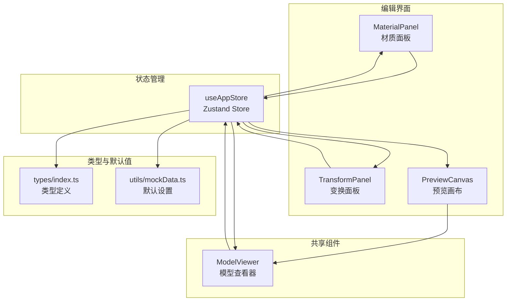
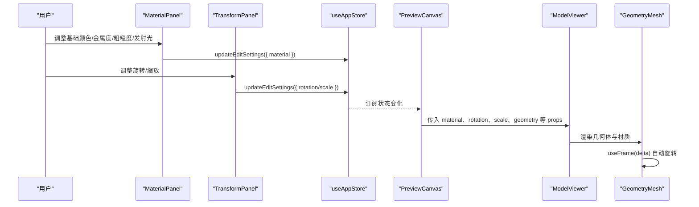
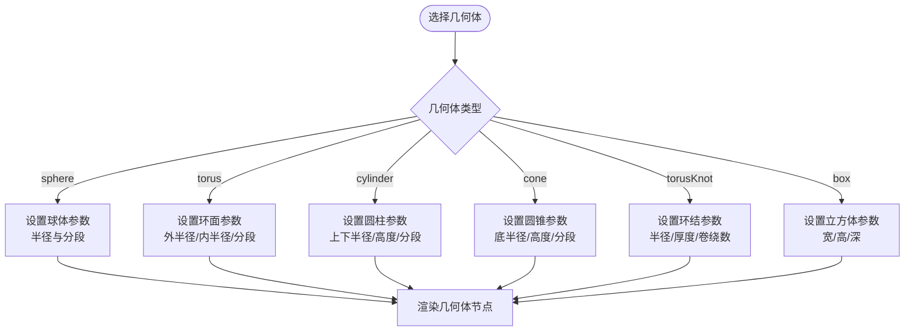
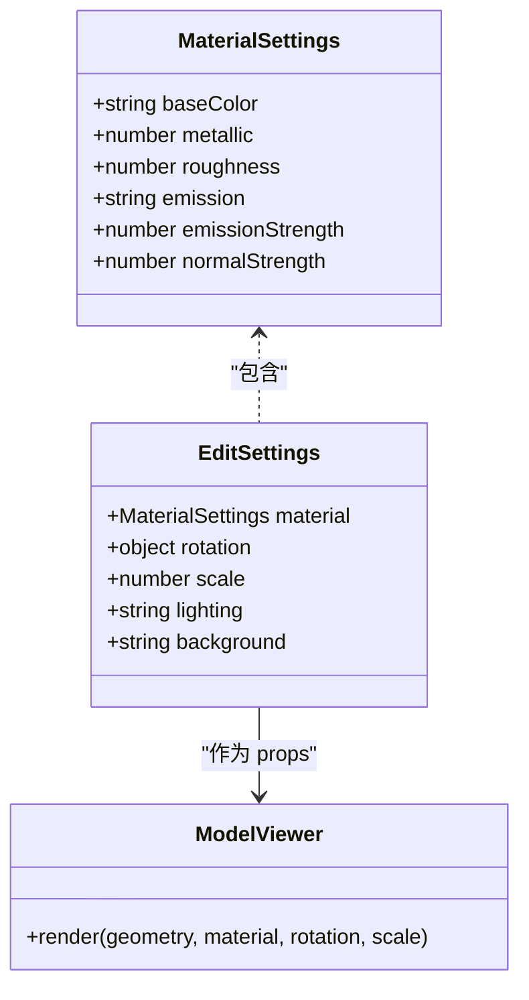
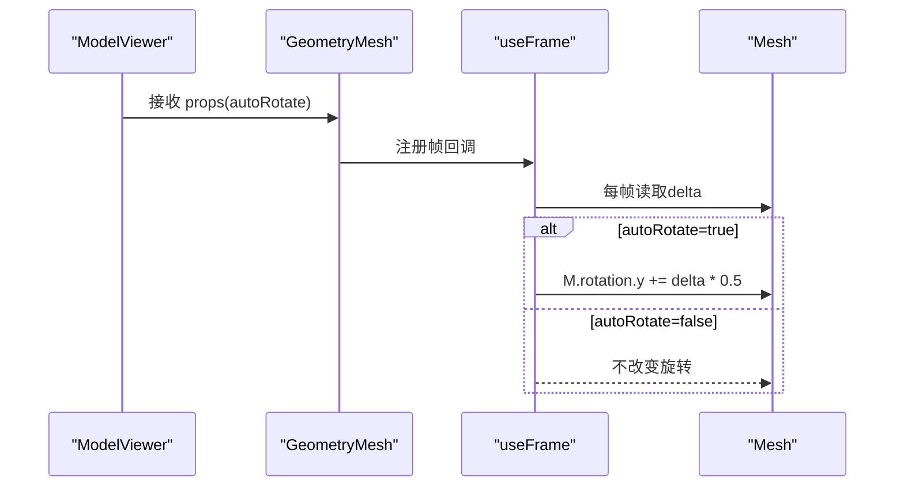
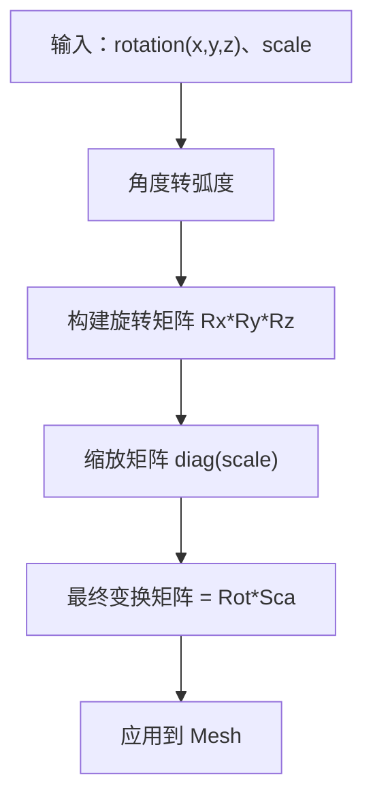
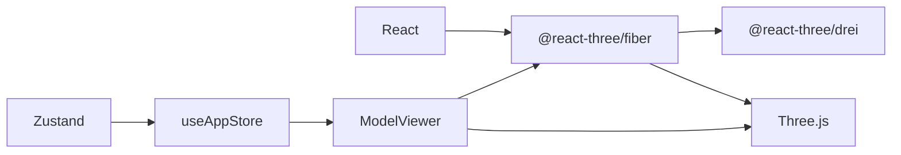

# 几何体与材质系统

<cite>
**本文档引用的文件**
- [ModelViewer.tsx](file://src/components/Shared/ModelViewer.tsx)
- [MaterialPanel.tsx](file://src/components/Edit/MaterialPanel.tsx)
- [PreviewCanvas.tsx](file://src/components/Edit/PreviewCanvas.tsx)
- [TransformPanel.tsx](file://src/components/Edit/TransformPanel.tsx)
- [EditView.tsx](file://src/components/Edit/EditView.tsx)
- [useAppStore.ts](file://src/store/useAppStore.ts)
- [mockData.ts](file://src/utils/mockData.ts)
- [index.ts](file://src/types/index.ts)
- [ResultCard.tsx](file://src/components/Explore/ResultCard.tsx)
- [package.json](file://package.json)
</cite>

## 目录
1. [简介](#简介)
2. [项目结构](#项目结构)
3. [核心组件](#核心组件)
4. [架构总览](#架构总览)
5. [详细组件分析](#详细组件分析)
6. [依赖关系分析](#依赖关系分析)
7. [性能考量](#性能考量)
8. [故障排查指南](#故障排查指南)
9. [结论](#结论)
10. [附录](#附录)

## 简介
本技术文档围绕几何体与材质系统进行深入解析，涵盖以下内容：
- 各种几何体类型的创建与参数配置（box、sphere、torus、cylinder、cone、torusKnot）
- 材质属性设置（基础颜色、金属度、粗糙度、发射光等）
- useFrame 动画循环与自动旋转实现
- 几何体变换、缩放与旋转的数学原理
- 材质优化与性能考虑
- 自定义几何体与材质的实现示例

## 项目结构
该系统基于 React + Three.js + @react-three/fiber 构建，采用组件化与状态管理分离的设计模式：
- 几何体与材质渲染：位于共享组件 ModelViewer
- 编辑面板：MaterialPanel、TransformPanel、LightingPanel
- 预览画布：PreviewCanvas
- 全局状态：useAppStore（Zustand）
- 类型定义：types/index.ts
- 默认编辑设置：utils/mockData.ts

图表来源
- [ModelViewer.tsx:1-156](file://src/components/Shared/ModelViewer.tsx#L1-L156)
- [MaterialPanel.tsx:1-209](file://src/components/Edit/MaterialPanel.tsx#L1-L209)
- [TransformPanel.tsx:1-101](file://src/components/Edit/TransformPanel.tsx#L1-L101)
- [PreviewCanvas.tsx:1-54](file://src/components/Edit/PreviewCanvas.tsx#L1-L54)
- [useAppStore.ts:1-368](file://src/store/useAppStore.ts#L1-L368)
- [mockData.ts:1-189](file://src/utils/mockData.ts#L1-L189)
- [index.ts:84-99](file://src/types/index.ts#L84-L99)

章节来源
- [ModelViewer.tsx:1-156](file://src/components/Shared/ModelViewer.tsx#L1-L156)
- [MaterialPanel.tsx:1-209](file://src/components/Edit/MaterialPanel.tsx#L1-L209)
- [TransformPanel.tsx:1-101](file://src/components/Edit/TransformPanel.tsx#L1-L101)
- [PreviewCanvas.tsx:1-54](file://src/components/Edit/PreviewCanvas.tsx#L1-L54)
- [useAppStore.ts:160-163](file://src/store/useAppStore.ts#L160-L163)
- [mockData.ts:14-27](file://src/utils/mockData.ts#L14-L27)
- [index.ts:84-99](file://src/types/index.ts#L84-L99)

## 核心组件
- ModelViewer：负责几何体选择、材质应用、光照与网格显示、自动旋转、相机与渲染配置
- MaterialPanel：提供基础颜色、金属度、粗糙度、发射光强度与法线贴图强度的交互式调节
- TransformPanel：提供旋转（X/Y/Z）与缩放的滑块控件，并支持重置
- PreviewCanvas：将全局编辑设置映射到 ModelViewer 的预览容器
- useAppStore：集中管理编辑设置（material、rotation、scale、lighting、background），并提供更新方法
- 类型定义与默认值：确保材料参数与编辑设置的类型安全与初始值一致

章节来源
- [ModelViewer.tsx:32-80](file://src/components/Shared/ModelViewer.tsx#L32-L80)
- [MaterialPanel.tsx:71-208](file://src/components/Edit/MaterialPanel.tsx#L71-L208)
- [TransformPanel.tsx:29-101](file://src/components/Edit/TransformPanel.tsx#L29-L101)
- [PreviewCanvas.tsx:5-25](file://src/components/Edit/PreviewCanvas.tsx#L5-L25)
- [useAppStore.ts:160-163](file://src/store/useAppStore.ts#L160-L163)
- [index.ts:84-99](file://src/types/index.ts#L84-L99)

## 架构总览
系统采用“状态驱动渲染”的架构：
- 全局状态通过 Zustand 管理，MaterialPanel 与 TransformPanel 通过 updateEditSettings 更新状态
- PreviewCanvas 将状态映射为 ModelViewer 的 props
- ModelViewer 内部根据 geometry 选择几何体，应用材质参数，并在 useFrame 中实现自动旋转

图表来源
- [MaterialPanel.tsx:76-80](file://src/components/Edit/MaterialPanel.tsx#L76-L80)
- [TransformPanel.tsx:33-38](file://src/components/Edit/TransformPanel.tsx#L33-L38)
- [useAppStore.ts:161-163](file://src/store/useAppStore.ts#L161-L163)
- [PreviewCanvas.tsx:12-24](file://src/components/Edit/PreviewCanvas.tsx#L12-L24)
- [ModelViewer.tsx:32-80](file://src/components/Shared/ModelViewer.tsx#L32-L80)

## 详细组件分析

### 几何体系统与参数配置
- 支持的几何体类型：box、sphere、torus、cylinder、cone、torusKnot
- 参数配置：
  - sphere：半径与分段数
  - torus：外半径、内半径、管段数、圆环段数
  - cylinder：上下底半径、高度、分段数
  - cone：底半径、高度、分段数
  - torusKnot：半径、厚度、卷绕数、横截面细分
  - box：宽、高、深
- 默认几何体：box（1.4 × 1.4 × 1.4）

图表来源
- [ModelViewer.tsx:51-60](file://src/components/Shared/ModelViewer.tsx#L51-L60)

章节来源
- [ModelViewer.tsx:51-60](file://src/components/Shared/ModelViewer.tsx#L51-L60)

### 材质系统与属性设置
- 基础颜色：baseColor（十六进制字符串）
- 金属度：metallic（0~1）
- 粗糙度：roughness（0~1）
- 发射光：emission（十六进制字符串）+ emissionStrength（强度）
- 法线贴图强度：normalStrength（0~2）
- 材质类型：meshStandardMaterial（物理渲染材质）

图表来源
- [index.ts:84-99](file://src/types/index.ts#L84-L99)
- [ModelViewer.tsx:32-80](file://src/components/Shared/ModelViewer.tsx#L32-L80)

章节来源
- [MaterialPanel.tsx:120-191](file://src/components/Edit/MaterialPanel.tsx#L120-L191)
- [ModelViewer.tsx:71-77](file://src/components/Shared/ModelViewer.tsx#L71-L77)
- [index.ts:84-99](file://src/types/index.ts#L84-L99)

### useFrame 动画循环与自动旋转
- 使用 @react-three/fiber 的 useFrame 在每帧接收时间步长 delta
- 当 autoRotate 为 true 时，以 delta 时间步长累加 Y 轴旋转角速度
- 旋转速度：约 0.5 弧度/秒（与 delta 相乘）

图表来源
- [ModelViewer.tsx:45-49](file://src/components/Shared/ModelViewer.tsx#L45-L49)

章节来源
- [ModelViewer.tsx:45-49](file://src/components/Shared/ModelViewer.tsx#L45-L49)

### 几何体变换、缩放与旋转的数学原理
- 旋转：使用欧拉角（X/Y/Z）并转换为弧度（角度 × π/180）
- 缩放：统一缩放因子 scale 应用于 XYZ
- 变换顺序：先旋转再缩放（Three.js 默认矩阵乘法顺序）
- 位移：当前未暴露直接位移参数，可通过外部容器或相机控制实现

图表来源
- [ModelViewer.tsx:67-68](file://src/components/Shared/ModelViewer.tsx#L67-L68)

章节来源
- [ModelViewer.tsx:67-68](file://src/components/Shared/ModelViewer.tsx#L67-L68)

### 材质优化与性能考虑
- 几何体细分：球体、环面、圆柱、圆锥、环结的分段数影响顶点数量与渲染开销
- 材质参数范围：
  - 金属度与粗糙度建议在 0~1 区间
  - 发射光强度可调至 5，但需注意过强会破坏真实感
- 性能建议：
  - 降低细分以减少多边形数量
  - 使用较低分辨率纹理
  - 合理使用自动旋转，避免不必要的持续计算
  - 在复杂场景中禁用自动旋转或降低旋转速度

章节来源
- [ModelViewer.tsx:53-58](file://src/components/Shared/ModelViewer.tsx#L53-L58)
- [MaterialPanel.tsx:147-164](file://src/components/Edit/MaterialPanel.tsx#L147-L164)
- [MaterialPanel.tsx:181-189](file://src/components/Edit/MaterialPanel.tsx#L181-L189)

### 自定义几何体与材质的实现示例
- 自定义几何体：在 GeometryMesh 的几何体选择逻辑中添加新的分支，传入自定义参数数组
- 自定义材质：在 MaterialPanel 中新增参数项，通过 updateEditSettings 更新全局状态
- 示例路径参考：
  - 几何体选择与渲染：[ModelViewer.tsx:51-60](file://src/components/Shared/ModelViewer.tsx#L51-L60)
  - 材质参数更新：[MaterialPanel.tsx:76-80](file://src/components/Edit/MaterialPanel.tsx#L76-L80)
  - 全局状态更新：[useAppStore.ts:161-163](file://src/store/useAppStore.ts#L161-L163)

章节来源
- [ModelViewer.tsx:51-60](file://src/components/Shared/ModelViewer.tsx#L51-L60)
- [MaterialPanel.tsx:76-80](file://src/components/Edit/MaterialPanel.tsx#L76-L80)
- [useAppStore.ts:161-163](file://src/store/useAppStore.ts#L161-L163)

## 依赖关系分析
- 运行时依赖：React、Three.js、@react-three/fiber、@react-three/drei、Framer Motion、Lucide、clsx
- 状态管理：Zustand 提供轻量级全局状态
- 类型安全：通过 TypeScript 类型定义保证编辑设置与材料参数的一致性

图表来源
- [package.json:11-22](file://package.json#L11-L22)
- [useAppStore.ts:100-103](file://src/store/useAppStore.ts#L100-L103)

章节来源
- [package.json:11-22](file://package.json#L11-L22)
- [useAppStore.ts:100-103](file://src/store/useAppStore.ts#L100-L103)

## 性能考量
- 几何体细分与多边形数量：球体、环面、圆柱、圆锥、环结的分段数越高，顶点越多，渲染越昂贵
- 材质参数范围：金属度与粗糙度限制在 0~1；发射光强度可调至 5，但应谨慎使用
- 动画循环：useFrame 每帧执行，自动旋转仅在启用时生效
- 环境与网格：环境贴图与网格在非紧凑模式下启用，可能增加渲染负担

章节来源
- [ModelViewer.tsx:53-58](file://src/components/Shared/ModelViewer.tsx#L53-L58)
- [ModelViewer.tsx:97-118](file://src/components/Shared/ModelViewer.tsx#L97-L118)
- [MaterialPanel.tsx:147-164](file://src/components/Edit/MaterialPanel.tsx#L147-L164)
- [MaterialPanel.tsx:181-189](file://src/components/Edit/MaterialPanel.tsx#L181-L189)

## 故障排查指南
- 几何体不显示或异常
  - 检查 geometry 参数是否正确传递至 ModelViewer
  - 确认几何体参数数组与 Three.js 构造函数参数一致
- 材质无效果
  - 检查 material 参数是否通过 useAppStore 更新
  - 确认 meshStandardMaterial 的 color、metalness、roughness、emissive、emissiveIntensity 是否正确传入
- 自动旋转无效
  - 确认 autoRotate 为 true
  - 检查 useFrame 回调是否注册且未被覆盖
- 变换无效
  - 检查 rotation 与 scale 是否通过 updateEditSettings 更新
  - 确认 ModelViewer 的 mesh rotation 与 scale 属性是否正确应用

章节来源
- [ModelViewer.tsx:51-60](file://src/components/Shared/ModelViewer.tsx#L51-L60)
- [ModelViewer.tsx:71-77](file://src/components/Shared/ModelViewer.tsx#L71-L77)
- [ModelViewer.tsx:45-49](file://src/components/Shared/ModelViewer.tsx#L45-L49)
- [PreviewCanvas.tsx:12-24](file://src/components/Edit/PreviewCanvas.tsx#L12-L24)

## 结论
本系统通过清晰的组件划分与状态管理，实现了从几何体选择、材质配置到动画与变换的完整工作流。开发者可在现有基础上扩展自定义几何体与材质参数，同时遵循性能优化建议以获得更佳的渲染体验。

## 附录
- 默认编辑设置与类型定义可参考：
  - [mockData.ts:14-27](file://src/utils/mockData.ts#L14-L27)
  - [index.ts:84-99](file://src/types/index.ts#L84-L99)
- 实际使用示例：
  - 预览画布中的几何体与材质映射：[PreviewCanvas.tsx:12-24](file://src/components/Edit/PreviewCanvas.tsx#L12-L24)
  - 探索视图中的随机几何体演示：[ResultCard.tsx:13-34](file://src/components/Explore/ResultCard.tsx#L13-L34)