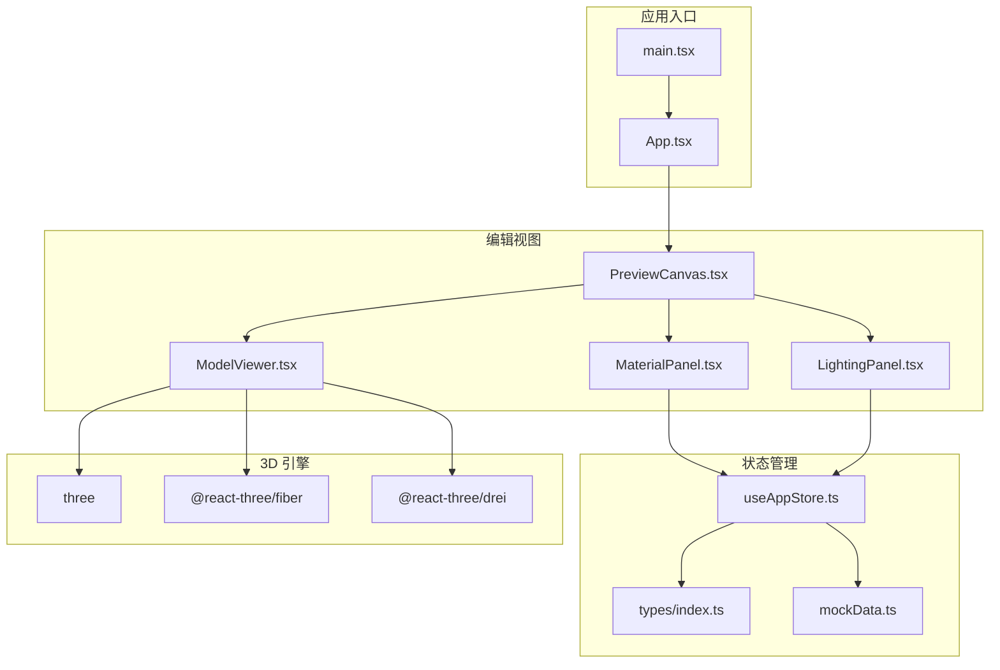
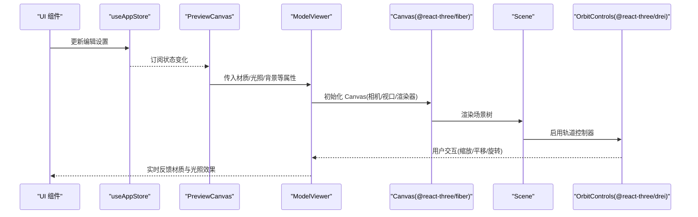
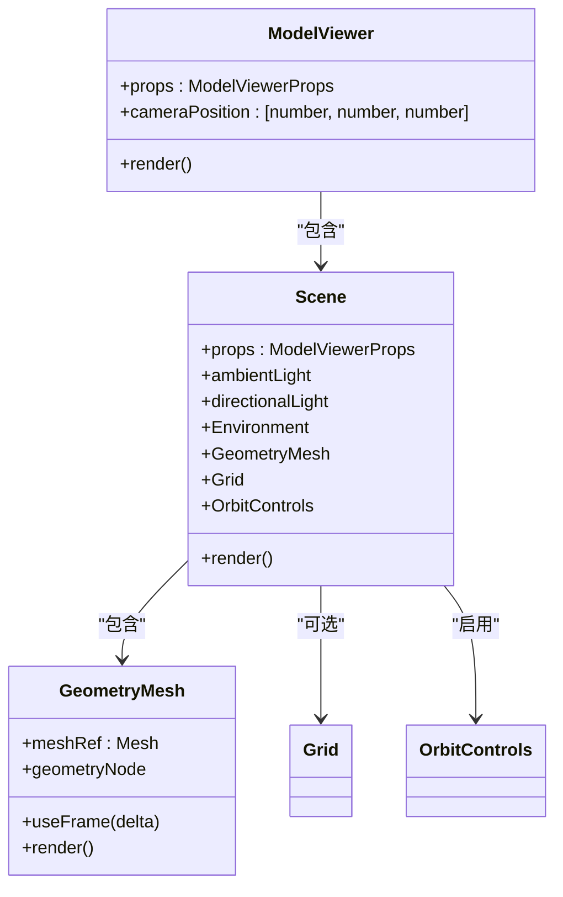
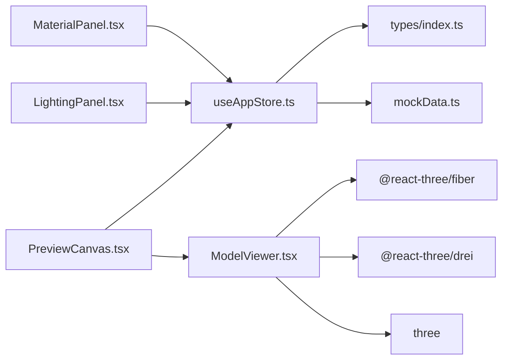

# 场景管理系统

<cite>
**本文档引用的文件**
- [src/components/Shared/ModelViewer.tsx](file://src/components/Shared/ModelViewer.tsx)
- [src/components/Edit/PreviewCanvas.tsx](file://src/components/Edit/PreviewCanvas.tsx)
- [src/components/Edit/MaterialPanel.tsx](file://src/components/Edit/MaterialPanel.tsx)
- [src/components/Edit/LightingPanel.tsx](file://src/components/Edit/LightingPanel.tsx)
- [src/store/useAppStore.ts](file://src/store/useAppStore.ts)
- [src/types/index.ts](file://src/types/index.ts)
- [src/utils/mockData.ts](file://src/utils/mockData.ts)
- [package.json](file://package.json)
- [src/main.tsx](file://src/main.tsx)
</cite>

## 目录
1. [简介](#简介)
2. [项目结构](#项目结构)
3. [核心组件](#核心组件)
4. [架构总览](#架构总览)
5. [详细组件分析](#详细组件分析)
6. [依赖关系分析](#依赖关系分析)
7. [性能考虑](#性能考虑)
8. [故障排除指南](#故障排除指南)
9. [结论](#结论)
10. [附录](#附录)

## 简介
本文件系统性地阐述基于 Three.js 的场景管理系统，涵盖场景创建、配置与管理机制，Canvas 组件的使用方法与配置选项，场景初始化流程、相机设置与视口管理，环境贴图的加载与应用方式，场景层级结构、对象管理与渲染循环的技术细节，并提供场景配置的最佳实践与性能优化建议。该系统采用 React + @react-three/fiber + @react-three/drei 构建，通过 Zustand 管理全局状态，支持材质参数、光照预设与背景色的实时编辑。

## 项目结构
项目采用按功能分层的组织方式：
- 组件层：编辑视图中的预览画布、材质面板、光照面板等
- 存储层：Zustand 全局状态管理（编辑设置、任务状态等）
- 类型定义：统一的数据类型与接口规范
- 工具层：默认编辑设置与模拟数据
- 依赖层：Three.js、@react-three/fiber、@react-three/drei 等

图表来源
- [src/main.tsx:1-14](file://src/main.tsx#L1-L14)
- [src/components/Edit/PreviewCanvas.tsx:1-54](file://src/components/Edit/PreviewCanvas.tsx#L1-L54)
- [src/components/Shared/ModelViewer.tsx:1-156](file://src/components/Shared/ModelViewer.tsx#L1-L156)
- [src/components/Edit/MaterialPanel.tsx:1-209](file://src/components/Edit/MaterialPanel.tsx#L1-L209)
- [src/components/Edit/LightingPanel.tsx:1-78](file://src/components/Edit/LightingPanel.tsx#L1-L78)
- [src/store/useAppStore.ts:1-368](file://src/store/useAppStore.ts#L1-L368)
- [src/types/index.ts:1-160](file://src/types/index.ts#L1-L160)
- [src/utils/mockData.ts:1-189](file://src/utils/mockData.ts#L1-L189)
- [package.json:11-22](file://package.json#L11-L22)

章节来源
- [src/main.tsx:1-14](file://src/main.tsx#L1-L14)
- [package.json:11-22](file://package.json#L11-L22)

## 核心组件
- ModelViewer：封装 Canvas、Scene、GeometryMesh、环境与控件，负责场景初始化、相机与视口管理、网格与控件开关、自动旋转等
- PreviewCanvas：编辑视图中的预览容器，传递编辑设置给 ModelViewer，并提供视口控制按钮与信息覆盖层
- MaterialPanel：材质参数面板，支持基础色、金属度、粗糙度、自发光颜色与强度、法线贴图强度的实时调整
- LightingPanel：光照与环境面板，提供多种光照预设与背景色选择
- useAppStore：Zustand 状态存储，集中管理编辑设置、任务状态、用户偏好等

章节来源
- [src/components/Shared/ModelViewer.tsx:1-156](file://src/components/Shared/ModelViewer.tsx#L1-L156)
- [src/components/Edit/PreviewCanvas.tsx:1-54](file://src/components/Edit/PreviewCanvas.tsx#L1-L54)
- [src/components/Edit/MaterialPanel.tsx:1-209](file://src/components/Edit/MaterialPanel.tsx#L1-L209)
- [src/components/Edit/LightingPanel.tsx:1-78](file://src/components/Edit/LightingPanel.tsx#L1-L78)
- [src/store/useAppStore.ts:100-163](file://src/store/useAppStore.ts#L100-L163)

## 架构总览
系统以 React 组件树承载场景逻辑，@react-three/fiber 提供渲染上下文，@react-three/drei 提供常用 3D 助手（环境、网格、轨道控制器等）。全局状态通过 Zustand 驱动 UI 与场景参数联动。

图表来源
- [src/components/Edit/PreviewCanvas.tsx:5-25](file://src/components/Edit/PreviewCanvas.tsx#L5-L25)
- [src/components/Shared/ModelViewer.tsx:136-153](file://src/components/Shared/ModelViewer.tsx#L136-L153)
- [src/store/useAppStore.ts:160-163](file://src/store/useAppStore.ts#L160-L163)

## 详细组件分析

### ModelViewer 组件分析
ModelViewer 是场景管理的核心组件，负责：
- Canvas 初始化：设置相机位置、视野、抗锯齿与透明背景
- Scene 组装：环境贴图、光源、几何体网格、网格辅助、轨道控制器
- 几何体与材质：根据几何类型动态生成几何节点，应用基础色、金属度、粗糙度、自发光
- 自动旋转：在 useFrame 中按时间步长更新旋转
- 视口与网格：根据 compact 模式切换相机与网格显示

图表来源
- [src/components/Shared/ModelViewer.tsx:6-21](file://src/components/Shared/ModelViewer.tsx#L6-L21)
- [src/components/Shared/ModelViewer.tsx:82-126](file://src/components/Shared/ModelViewer.tsx#L82-L126)
- [src/components/Shared/ModelViewer.tsx:32-80](file://src/components/Shared/ModelViewer.tsx#L32-L80)

章节来源
- [src/components/Shared/ModelViewer.tsx:136-153](file://src/components/Shared/ModelViewer.tsx#L136-L153)
- [src/components/Shared/ModelViewer.tsx:82-126](file://src/components/Shared/ModelViewer.tsx#L82-L126)
- [src/components/Shared/ModelViewer.tsx:32-80](file://src/components/Shared/ModelViewer.tsx#L32-L80)

### Canvas 组件使用与配置
- 相机设置：根据 compact 模式选择不同初始位置与视野；默认开启抗锯齿与透明背景
- 视口管理：通过父容器尺寸控制 Canvas 尺寸，实现响应式布局
- 渲染器配置：开启 alpha 以支持透明背景，便于与 UI 背景色融合

章节来源
- [src/components/Shared/ModelViewer.tsx:143-147](file://src/components/Shared/ModelViewer.tsx#L143-L147)
- [src/components/Edit/PreviewCanvas.tsx:9-25](file://src/components/Edit/PreviewCanvas.tsx#L9-L25)

### 场景初始化流程
- AmbientLight 与 DirectionalLight 提供基础光照
- Environment 根据光照预设加载 IBL 环境贴图，支持背景关闭
- GeometryMesh 根据几何类型生成几何体并应用材质
- Grid 在非紧凑模式下显示网格辅助
- OrbitControls 默认启用，支持缩放与平移（紧凑模式禁用）

章节来源
- [src/components/Shared/ModelViewer.tsx:95-123](file://src/components/Shared/ModelViewer.tsx#L95-L123)

### 材质与光照面板
- MaterialPanel：通过滑块与颜色选择器实时调整基础色、金属度、粗糙度、自发光颜色与强度、法线贴图强度
- LightingPanel：提供四种光照预设（影棚、室外、戏剧、中性）与背景色选择

章节来源
- [src/components/Edit/MaterialPanel.tsx:71-209](file://src/components/Edit/MaterialPanel.tsx#L71-L209)
- [src/components/Edit/LightingPanel.tsx:14-78](file://src/components/Edit/LightingPanel.tsx#L14-L78)

### 全局状态驱动
- useAppStore 管理 editSettings（材质、旋转、缩放、光照、背景），updateEditSettings 支持部分更新
- 默认编辑设置由 mockData 提供，包含材质参数与光照预设

章节来源
- [src/store/useAppStore.ts:160-163](file://src/store/useAppStore.ts#L160-L163)
- [src/utils/mockData.ts:14-27](file://src/utils/mockData.ts#L14-L27)

## 依赖关系分析
- 运行时依赖：three、@react-three/fiber、@react-three/drei
- 状态管理：zustand
- UI 动画：framer-motion
- 图标与工具：lucide-react、clsx

图表来源
- [src/components/Shared/ModelViewer.tsx:1-4](file://src/components/Shared/ModelViewer.tsx#L1-L4)
- [src/components/Edit/PreviewCanvas.tsx:1-3](file://src/components/Edit/PreviewCanvas.tsx#L1-L3)
- [src/components/Edit/MaterialPanel.tsx:1-5](file://src/components/Edit/MaterialPanel.tsx#L1-L5)
- [src/components/Edit/LightingPanel.tsx:1-5](file://src/components/Edit/LightingPanel.tsx#L1-L5)
- [src/store/useAppStore.ts:1-15](file://src/store/useAppStore.ts#L1-L15)
- [src/utils/mockData.ts:1-1](file://src/utils/mockData.ts#L1-L1)
- [package.json:11-22](file://package.json#L11-L22)

章节来源
- [package.json:11-22](file://package.json#L11-L22)

## 性能考虑
- 渲染器配置：开启 alpha 与抗锯齿提升视觉质量，但会增加 GPU 开销；在低端设备上可考虑关闭 alpha 或降低抗锯齿
- 几何体复杂度：默认几何体分辨率适中，若需更高精度可增大细分参数，但会显著增加顶点数量
- 环境贴图：IBL 环境贴图会占用显存，建议在移动端或低端设备上减少贴图分辨率或关闭背景
- 自动旋转：useFrame 每帧更新旋转角度，若不需要可关闭 autoRotate 以节省 CPU/GPU
- 网格显示：Grid 在非紧凑模式下启用，紧凑模式关闭网格可减少绘制调用
- 控制器行为：紧凑模式禁用缩放与平移，减少不必要的交互计算

## 故障排除指南
- 场景不显示或黑屏
  - 检查 Canvas 的背景色与透明度设置是否正确
  - 确认相机位置与视野范围是否合理
- 材质参数无效
  - 确认 editSettings 是否通过 updateEditSettings 正确更新
  - 检查材质属性映射是否与 Three.js 材质一致
- 光照预设不生效
  - 确认 lightingPresetMap 映射是否正确
  - 检查 Environment 组件的 preset 参数
- 网格与控件异常
  - 确认 compact 模式下的网格与控件开关逻辑
  - 检查 OrbitControls 的 enableZoom 与 enablePan 设置

章节来源
- [src/components/Shared/ModelViewer.tsx:143-147](file://src/components/Shared/ModelViewer.tsx#L143-L147)
- [src/components/Shared/ModelViewer.tsx:95-123](file://src/components/Shared/ModelViewer.tsx#L95-L123)
- [src/store/useAppStore.ts:160-163](file://src/store/useAppStore.ts#L160-L163)

## 结论
该场景管理系统以 React + Three.js 为核心，通过清晰的组件职责划分与全局状态驱动，实现了从场景初始化、相机与视口管理、环境贴图应用到材质与光照实时编辑的完整闭环。借助 @react-three/fiber 与 @react-three/drei，系统在保持开发效率的同时提供了良好的扩展性与性能表现。建议在生产环境中结合设备能力进行渲染器与几何体参数的动态调整，以获得最佳的用户体验。

## 附录

### 场景层级结构与对象管理
- Canvas：渲染根容器
- Scene：场景根节点，包含光源、环境、网格与控件
- GeometryMesh：可旋转的网格对象，包含几何体与材质
- Grid：辅助网格，仅在非紧凑模式显示
- OrbitControls：交互控制器，默认启用

章节来源
- [src/components/Shared/ModelViewer.tsx:82-126](file://src/components/Shared/ModelViewer.tsx#L82-L126)
- [src/components/Shared/ModelViewer.tsx:32-80](file://src/components/Shared/ModelViewer.tsx#L32-L80)

### 渲染循环与帧更新
- 使用 useFrame 在每帧更新网格旋转
- 通过 Suspense 处理异步加载与回退提示
- 通过 memo 包装避免不必要的重渲染

章节来源
- [src/components/Shared/ModelViewer.tsx:45-49](file://src/components/Shared/ModelViewer.tsx#L45-L49)
- [src/components/Shared/ModelViewer.tsx:128-134](file://src/components/Shared/ModelViewer.tsx#L128-L134)
- [src/components/Shared/ModelViewer.tsx:136-153](file://src/components/Shared/ModelViewer.tsx#L136-L153)