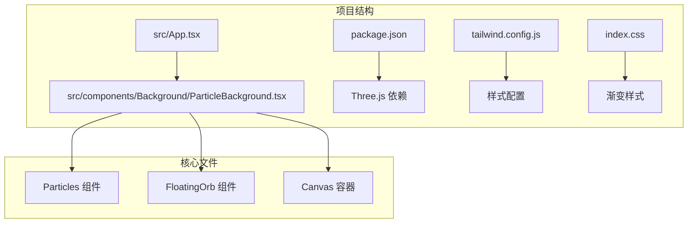
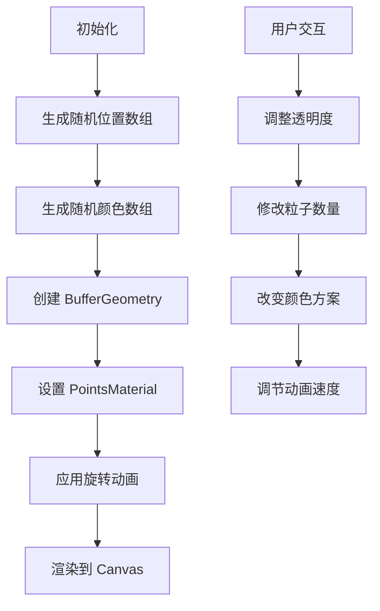
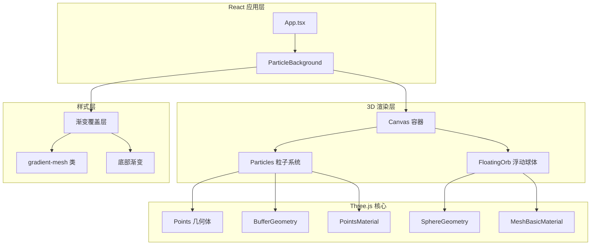
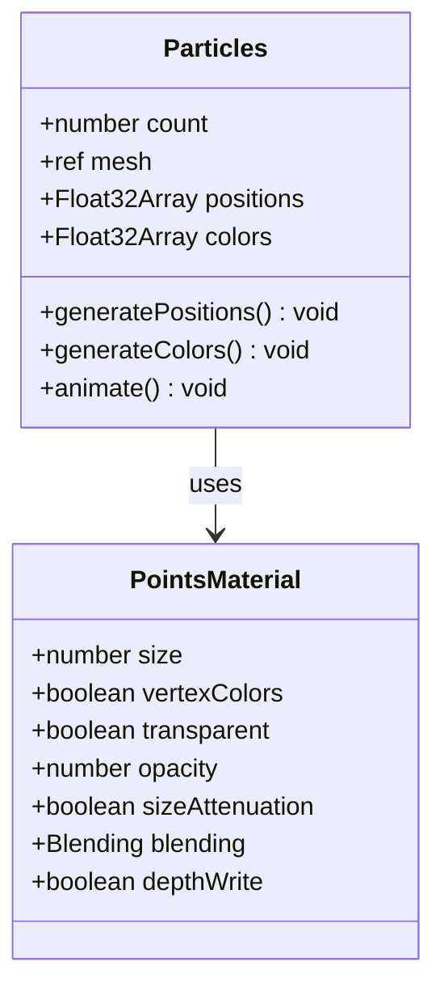
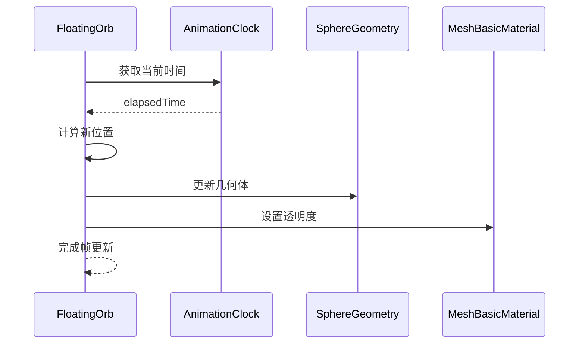
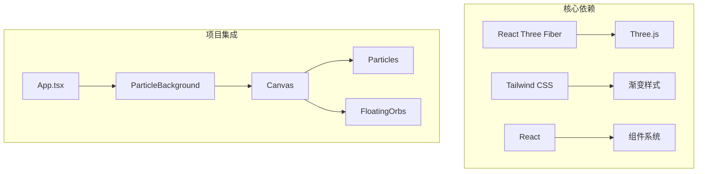
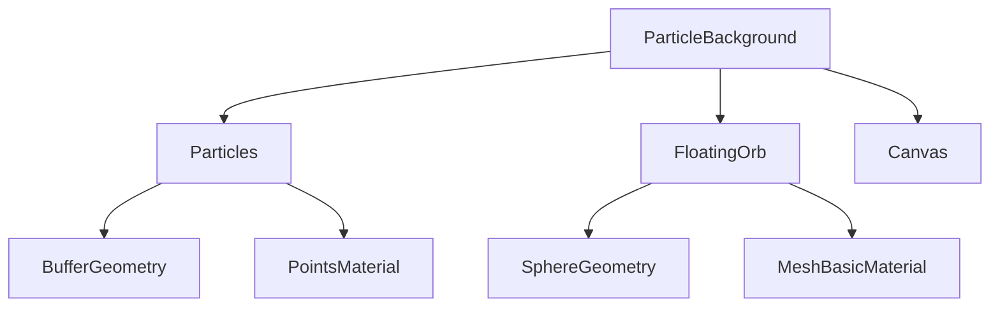
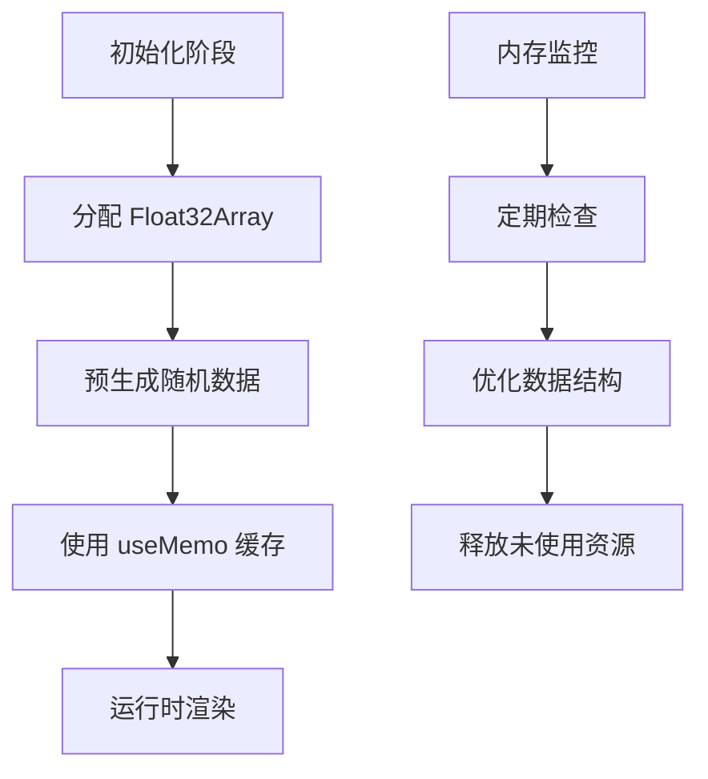

# 粒子背景系统

<cite>
**本文档引用的文件**
- [ParticleBackground.tsx](file://src/components/Background/ParticleBackground.tsx)
- [App.tsx](file://src/App.tsx)
- [package.json](file://package.json)
- [index.css](file://src/index.css)
- [tailwind.config.js](file://tailwind.config.js)
- [ModelViewer.tsx](file://src/components/Shared/ModelViewer.tsx)
</cite>

## 目录
1. [简介](#简介)
2. [项目结构](#项目结构)
3. [核心组件](#核心组件)
4. [架构概览](#架构概览)
5. [详细组件分析](#详细组件分析)
6. [依赖关系分析](#依赖关系分析)
7. [性能考虑](#性能考虑)
8. [故障排除指南](#故障排除指南)
9. [结论](#结论)

## 简介

粒子背景系统是一个基于 Three.js 和 React Three Fiber 构建的 3D 粒子效果系统。该系统实现了动态的粒子云效果，结合渐变背景和浮动球体，为用户提供沉浸式的视觉体验。系统采用高性能的 WebGL 渲染，支持实时动画和交互式视觉效果。

## 项目结构

粒子背景系统位于项目的背景组件目录中，与主应用入口点集成：



**图表来源**
- [App.tsx:14-16](file://src/App.tsx#L14-L16)
- [ParticleBackground.tsx:88-107](file://src/components/Background/ParticleBackground.tsx#L88-L107)

**章节来源**
- [App.tsx:1-33](file://src/App.tsx#L1-L33)
- [package.json:1-35](file://package.json#L1-L35)

## 核心组件

### 主要组件架构

粒子背景系统由三个核心组件构成：

1. **Particles 组件** - 实现 3D 粒子云效果
2. **FloatingOrb 组件** - 创建浮动的透明球体
3. **ParticleBackground 容器** - 整合所有元素的主容器

### 数据流分析



**图表来源**
- [ParticleBackground.tsx:9-32](file://src/components/Background/ParticleBackground.tsx#L9-L32)
- [ParticleBackground.tsx:34-39](file://src/components/Background/ParticleBackground.tsx#L34-L39)

**章节来源**
- [ParticleBackground.tsx:1-108](file://src/components/Background/ParticleBackground.tsx#L1-L108)

## 架构概览

### 系统架构图



**图表来源**
- [ParticleBackground.tsx:88-107](file://src/components/Background/ParticleBackground.tsx#L88-L107)
- [ParticleBackground.tsx:41-67](file://src/components/Background/ParticleBackground.tsx#L41-L67)

### 性能架构设计

系统采用以下性能优化策略：

1. **WebGL 直接渲染** - 避免 JavaScript 动画的性能开销
2. **GPU 加速** - 利用 GPU 处理粒子变换和混合
3. **内存优化** - 使用 Float32Array 存储顶点数据
4. **批量渲染** - 单次绘制多个粒子对象

## 详细组件分析

### Particles 组件详解

#### 粒子系统实现

Particles 组件是整个粒子系统的核心，负责管理 500 个粒子的生成、定位和动画：



**图表来源**
- [ParticleBackground.tsx:5-68](file://src/components/Background/ParticleBackground.tsx#L5-L68)

#### 粒子配置参数

| 参数名称 | 默认值 | 描述 | 调整范围 |
|---------|--------|------|----------|
| 粒子数量 | 500 | 粒子总数 | 100-2000 |
| 粒子大小 | 0.05 | 粒子半径 | 0.01-0.2 |
| 透明度 | 0.6 | 整体透明度 | 0.1-1.0 |
| 混合模式 | AdditiveBlending | 渲染混合 | Additive/Normal |
| 缓存策略 | useMemo | 数据缓存 | useMemo/useRef |

**章节来源**
- [ParticleBackground.tsx:6-68](file://src/components/Background/ParticleBackground.tsx#L6-L68)

### FloatingOrb 组件分析

#### 浮动球体实现

FloatingOrb 组件创建四个不同颜色和尺寸的透明球体，每个球体都有独特的动画轨迹：



**图表来源**
- [ParticleBackground.tsx:70-86](file://src/components/Background/ParticleBackground.tsx#L70-L86)

#### 球体配置参数

| 参数 | 值 | 作用 | 视觉效果 |
|------|-----|------|----------|
| 位置 | [-5, 2, -5] | 球体坐标 | 左上区域 |
| 颜色 | #4fc3f7 | 青蓝色 | 蓝绿色光泽 |
| 尺寸 | 2 | 缩放比例 | 中等大小 |
| 透明度 | 0.08 | 透明程度 | 微弱可见 |

**章节来源**
- [ParticleBackground.tsx:97-100](file://src/components/Background/ParticleBackground.tsx#L97-L100)

### Canvas 容器配置

#### 渲染环境设置

Canvas 容器提供了完整的 3D 渲染环境配置：

```mermaid
flowchart LR
A[Canvas 容器] --> B[Camera 设置]
A --> C[GL 上下文]
A --> D[样式配置]
B --> E[位置: [0, 0, 15]]
B --> F[视野: 60度]
C --> G[Alpha: true]
C --> H[抗锯齿: true]
D --> I[背景: transparent]
```

**图表来源**
- [ParticleBackground.tsx:91-95](file://src/components/Background/ParticleBackground.tsx#L91-L95)

**章节来源**
- [ParticleBackground.tsx:88-107](file://src/components/Background/ParticleBackground.tsx#L88-L107)

## 依赖关系分析

### 外部依赖关系



**图表来源**
- [package.json:11-22](file://package.json#L11-L22)
- [App.tsx:3-4](file://src/App.tsx#L3-L4)

### 内部组件依赖

系统内部组件之间的依赖关系清晰且解耦：



**图表来源**
- [ParticleBackground.tsx:88-107](file://src/components/Background/ParticleBackground.tsx#L88-L107)

**章节来源**
- [package.json:1-35](file://package.json#L1-L35)

## 性能考虑

### 性能优化策略

#### GPU 加速渲染

系统充分利用 GPU 进行粒子渲染，避免了 CPU 的密集计算：

1. **顶点着色器优化** - 使用 GPU 处理粒子位置和颜色
2. **混合模式优化** - AdditiveBlending 提供高效的叠加效果
3. **深度测试优化** - 关闭深度写入减少不必要的计算

#### 内存管理



#### 动画性能

系统采用高效的动画循环机制：

1. **useFrame Hook** - React Three Fiber 提供的优化动画循环
2. **单帧更新** - 每帧只进行必要的计算
3. **时间同步** - 使用统一的时间源确保动画流畅

### 性能基准

| 操作类型 | 性能特征 | 优化建议 |
|----------|----------|----------|
| 粒子渲染 | GPU 加速 | 保持在 500-1000 粒子范围内 |
| 动画更新 | 时间同步 | 使用 useFrame 替代 setInterval |
| 材质切换 | 状态缓存 | 避免频繁创建新材质 |
| 几何体更新 | 内存复用 | 使用现有缓冲区而非重新创建 |

## 故障排除指南

### 常见问题及解决方案

#### 粒子不显示问题

**症状**: 粒子系统完全不可见
**可能原因**:
1. WebGL 不支持或禁用
2. 透明度设置错误
3. 相机位置不当

**解决步骤**:
1. 检查浏览器 WebGL 支持
2. 验证透明度设置 (opacity > 0)
3. 调整相机位置和视野

#### 性能问题

**症状**: 页面卡顿或帧率下降
**可能原因**:
1. 粒子数量过多
2. 材质复杂度过高
3. 动画频率过高

**优化方案**:
1. 减少粒子数量到 500-800
2. 简化材质属性
3. 降低动画更新频率

#### 样式冲突

**症状**: 渐变效果异常或颜色不正确
**解决方法**:
1. 检查 Tailwind CSS 配置
2. 验证 CSS 类名拼写
3. 确认颜色变量定义

**章节来源**
- [ParticleBackground.tsx:91-107](file://src/components/Background/ParticleBackground.tsx#L91-L107)

## 结论

粒子背景系统通过精心设计的架构和优化策略，成功实现了高性能的 3D 粒子效果。系统的主要优势包括：

1. **高性能渲染**: 利用 WebGL 和 GPU 加速，确保流畅的动画效果
2. **模块化设计**: 清晰的组件分离便于维护和扩展
3. **灵活配置**: 支持多种参数调整满足不同需求
4. **优雅降级**: 在低性能设备上仍能提供良好的用户体验

该系统为 3D 模型展示应用提供了优秀的视觉基础，可以作为其他 3D 场景的参考实现。通过进一步的优化和扩展，可以支持更复杂的粒子效果和交互功能。