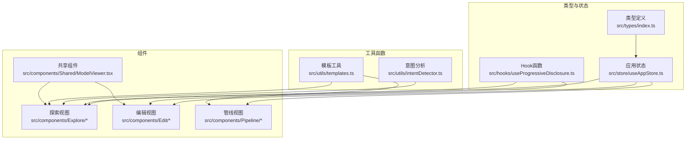
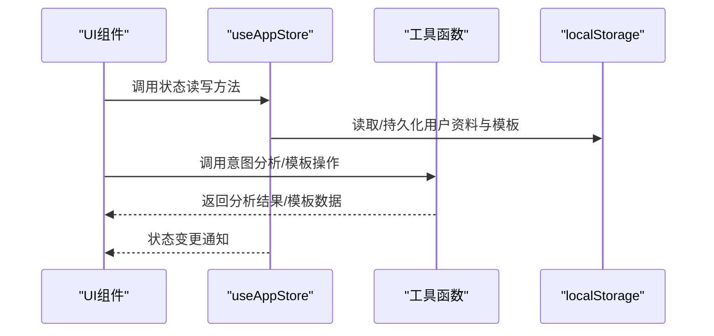
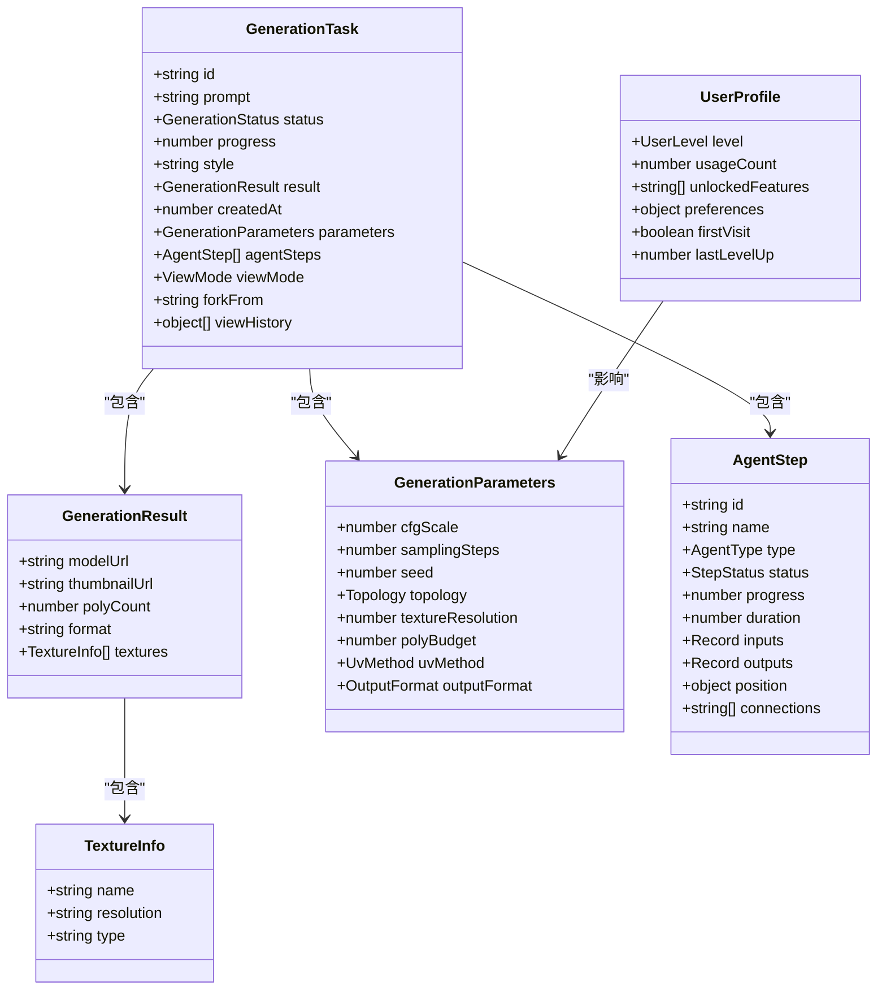
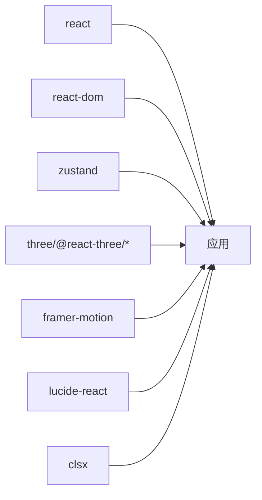

# API参考文档

<cite>
**本文档引用的文件**
- [src/types/index.ts](file://src/types/index.ts)
- [src/store/useAppStore.ts](file://src/store/useAppStore.ts)
- [src/hooks/useProgressiveDisclosure.ts](file://src/hooks/useProgressiveDisclosure.ts)
- [src/utils/intentDetector.ts](file://src/utils/intentDetector.ts)
- [src/utils/templates.ts](file://src/utils/templates.ts)
- [src/components/Explore/ExploreView.tsx](file://src/components/Explore/ExploreView.tsx)
- [src/components/Explore/PromptInput.tsx](file://src/components/Explore/PromptInput.tsx)
- [src/components/Explore/StyleSelector.tsx](file://src/components/Explore/StyleSelector.tsx)
- [src/components/Edit/EditView.tsx](file://src/components/Edit/EditView.tsx)
- [src/components/Edit/MaterialPanel.tsx](file://src/components/Edit/MaterialPanel.tsx)
- [src/components/Edit/LightingPanel.tsx](file://src/components/Edit/LightingPanel.tsx)
- [src/components/Edit/TransformPanel.tsx](file://src/components/Edit/TransformPanel.tsx)
- [src/components/Pipeline/PipelineView.tsx](file://src/components/Pipeline/PipelineView.tsx)
- [src/components/Shared/ModelViewer.tsx](file://src/components/Shared/ModelViewer.tsx)
- [package.json](file://package.json)
</cite>

## 目录
1. [简介](#简介)
2. [项目结构](#项目结构)
3. [核心组件](#核心组件)
4. [架构总览](#架构总览)
5. [详细组件分析](#详细组件分析)
6. [依赖关系分析](#依赖关系分析)
7. [性能考虑](#性能考虑)
8. [故障排除指南](#故障排除指南)
9. [结论](#结论)
10. [附录](#附录)

## 简介
本API参考文档面向开发者与集成者，系统性梳理项目中的公共接口、组件属性、Hook函数与工具函数的API规范，涵盖TypeScript类型定义、使用示例路径、错误处理与异常情况说明，并提供版本兼容性与稳定性策略指导。

## 项目结构
项目采用按功能域分层的组织方式：类型定义集中于types目录，全局状态通过Zustand管理，业务逻辑以工具函数形式提供，UI组件按模块拆分，便于独立维护与复用。

图表来源
- [src/types/index.ts:1-160](file://src/types/index.ts#L1-L160)
- [src/store/useAppStore.ts:1-368](file://src/store/useAppStore.ts#L1-L368)
- [src/hooks/useProgressiveDisclosure.ts:1-136](file://src/hooks/useProgressiveDisclosure.ts#L1-L136)
- [src/utils/intentDetector.ts:1-148](file://src/utils/intentDetector.ts#L1-L148)
- [src/utils/templates.ts:1-115](file://src/utils/templates.ts#L1-L115)
- [src/components/Explore/ExploreView.tsx:1-263](file://src/components/Explore/ExploreView.tsx#L1-L263)
- [src/components/Edit/EditView.tsx:1-159](file://src/components/Edit/EditView.tsx#L1-L159)
- [src/components/Pipeline/PipelineView.tsx:1-168](file://src/components/Pipeline/PipelineView.tsx#L1-L168)
- [src/components/Shared/ModelViewer.tsx:1-156](file://src/components/Shared/ModelViewer.tsx#L1-L156)

章节来源
- [src/types/index.ts:1-160](file://src/types/index.ts#L1-L160)
- [src/store/useAppStore.ts:1-368](file://src/store/useAppStore.ts#L1-L368)
- [src/hooks/useProgressiveDisclosure.ts:1-136](file://src/hooks/useProgressiveDisclosure.ts#L1-L136)
- [src/utils/intentDetector.ts:1-148](file://src/utils/intentDetector.ts#L1-L148)
- [src/utils/templates.ts:1-115](file://src/utils/templates.ts#L1-L115)
- [src/components/Explore/ExploreView.tsx:1-263](file://src/components/Explore/ExploreView.tsx#L1-L263)
- [src/components/Edit/EditView.tsx:1-159](file://src/components/Edit/EditView.tsx#L1-L159)
- [src/components/Pipeline/PipelineView.tsx:1-168](file://src/components/Pipeline/PipelineView.tsx#L1-L168)
- [src/components/Shared/ModelViewer.tsx:1-156](file://src/components/Shared/ModelViewer.tsx#L1-L156)

## 核心组件
本节概述应用的核心数据类型与状态管理API，帮助快速定位关键接口。

- 应用模式与状态
  - AppMode: 'explore' | 'edit' | 'pipeline'
  - GenerationStatus: 'idle' | 'parsing' | 'generating' | 'refining' | 'complete' | 'error'

- 生成任务与结果
  - GenerationTask: 包含任务ID、提示词、状态、进度、风格、结果、参数、代理步骤、视图模式等字段
  - GenerationResult: 模型URL、缩略图URL、面数、格式、纹理列表
  - TextureInfo: 纹理名称、分辨率、类型
  - GenerationParameters: CFG强度、采样步数、种子、拓扑、纹理分辨率、面数预算、UV方法、输出格式
  - AgentStep: 代理步骤ID、名称、类型、状态、进度、时长、输入输出、位置、连接
  - AgentType: 代理类型枚举集合

- 用户与权限
  - UserProfile: 用户级别、使用次数、解锁特性、偏好设置、首次访问标记、升级时间
  - UserLevel: 'beginner' | 'intermediate' | 'expert'
  - ViewMode: 'simple' | 'professional'
  - FeatureGate: 功能门禁配置
  - LevelUpNotification: 升级通知

- 意图分析与模板
  - IntentAnalysis: 检测到的用户级别、关键词、建议模式、建议视图模式、置信度、自动参数
  - TaskTemplate: 模板ID、名称、描述、创建者、创建时间、参数、代理步骤、预览图、标签、使用次数

章节来源
- [src/types/index.ts:1-160](file://src/types/index.ts#L1-L160)

## 架构总览
应用采用“类型驱动 + Zustand状态 + Hook封装 + 工具函数”的架构模式，UI组件通过Hook读取状态并调用工具函数实现业务逻辑。

图表来源
- [src/store/useAppStore.ts:1-368](file://src/store/useAppStore.ts#L1-L368)
- [src/utils/intentDetector.ts:1-148](file://src/utils/intentDetector.ts#L1-L148)
- [src/utils/templates.ts:1-115](file://src/utils/templates.ts#L1-L115)

## 详细组件分析

### 类型系统与状态模型

图表来源
- [src/types/index.ts:13-160](file://src/types/index.ts#L13-L160)

章节来源
- [src/types/index.ts:1-160](file://src/types/index.ts#L1-L160)

### 状态管理API（useAppStore）
- 模式与生成
  - 属性: mode: AppMode, currentTask: GenerationTask | null, taskHistory: GenerationTask[]
  - 方法: setMode(mode), startGeneration(prompt, style?), updateTaskStatus(status, progress), completeTask()

- 编辑与视图
  - 属性: editSettings: EditSettings, selectedNode: string | null, sidebarOpen: boolean
  - 方法: updateEditSettings(settings), setSelectedNode(nodeId), toggleSidebar(), setViewMode(mode)

- 用户档案与等级
  - 属性: userProfile: UserProfile, viewMode: ViewMode, intentAnalysis: IntentAnalysis | null, levelUpNotification: LevelUpNotification | null
  - 方法: incrementUsage(), unlockFeature(featureId), checkLevelUp(): LevelUpNotification | null, setUserLevel(level), dismissFirstVisit(), setIntentAnalysis(analysis), setLevelUpNotification(n), dismissLevelUpNotification()

- 模板管理
  - 属性: templates: TaskTemplate[]
  - 方法: addTemplate(template), removeTemplate(id), updateTemplate(id, updates)

- 内部模拟生成流程
  - 函数: simulateGeneration(set, get) 按阶段推进任务状态与代理步骤

章节来源
- [src/store/useAppStore.ts:50-311](file://src/store/useAppStore.ts#L50-L311)

### Hook函数API（useProgressiveDisclosure）
- 功能: 基于用户使用次数与级别，判断功能可用性、可访问模式、升级进度与最近解锁项
- 返回对象键值:
  - currentLevel: UserLevel
  - isFeatureAvailable(featureId): boolean
  - canAccessMode(mode): boolean
  - availableModes: AppMode[]
  - shouldShowLevelUpPrompt: boolean
  - nextLevelProgress: number
  - nextLevelRequirement: number
  - recentlyUnlocked: string[]
  - skipToLevel(level): void

章节来源
- [src/hooks/useProgressiveDisclosure.ts:48-135](file://src/hooks/useProgressiveDisclosure.ts#L48-L135)

### 工具函数API

#### 意图分析（intentDetector）
- 关键词库
  - PROFESSIONAL_KEYWORDS_HIGH/MEDIUM/LOW: 专业/中等/基础关键词数组
  - CASUAL_PATTERNS: 通俗表达模式数组
- 函数
  - extractAutoParams(prompt): Partial<GenerationParameters>
    - 功能: 从提示词中抽取输出格式、纹理分辨率、拓扑、面数预算等参数建议
    - 返回: 参数部分对象
  - analyzeIntent(prompt, userProfile): IntentAnalysis
    - 功能: 综合关键词命中与用户级别，计算检测级别、建议模式/视图、置信度与自动参数
    - 返回: 意图分析对象

章节来源
- [src/utils/intentDetector.ts:37-147](file://src/utils/intentDetector.ts#L37-L147)

#### 模板工具（templates）
- 函数
  - createTemplateFromTask(task, name, description, creator): TaskTemplate
    - 功能: 从当前任务创建模板，复制参数与代理步骤，生成标签
    - 返回: 新模板对象
  - applyTemplate(template): { parameters, agentSteps? }
    - 功能: 应用模板生成参数与可选代理步骤
    - 返回: 参数与步骤副本
  - filterTemplates(templates, query): TaskTemplate[]
    - 功能: 按名称/描述/标签模糊搜索模板
    - 返回: 过滤后的模板数组
  - DEFAULT_TEMPLATES: 预置模板集合

章节来源
- [src/utils/templates.ts:4-114](file://src/utils/templates.ts#L4-L114)

### 组件API

#### Explore 视图（ExploreView）
- 功能: 探索模式主界面，支持提示词输入、风格选择、高级参数面板（专业模式）、生成进度与结果展示
- 关键交互
  - 生成状态切换: idle/parsing/generating/refining/complete/error
  - 专业模式显示代理步骤与技术细节
- 使用示例路径
  - [Explore 视图:11-263](file://src/components/Explore/ExploreView.tsx#L11-L263)

章节来源
- [src/components/Explore/ExploreView.tsx:11-263](file://src/components/Explore/ExploreView.tsx#L11-L263)

#### PromptInput（提示词输入）
- 功能: 输入提示词，防抖触发意图分析，智能建议切换视图与模式，一键生成
- 关键行为
  - 防抖分析: 500ms延迟
  - 建议展示: 置信度≥0.6且视图不同时显示
  - 首次访问处理: 自动关闭引导
- 使用示例路径
  - [提示词输入:8-161](file://src/components/Explore/PromptInput.tsx#L8-L161)

章节来源
- [src/components/Explore/PromptInput.tsx:8-161](file://src/components/Explore/PromptInput.tsx#L8-L161)

#### StyleSelector（风格选择器）
- 功能: 展示风格预设卡片，支持选择与视觉反馈
- Props
  - onSelect(styleId): void
  - selected: string | null
- 使用示例路径
  - [风格选择器:6-61](file://src/components/Explore/StyleSelector.tsx#L6-L61)

章节来源
- [src/components/Explore/StyleSelector.tsx:6-61](file://src/components/Explore/StyleSelector.tsx#L6-L61)

#### Edit 视图（EditView）
- 功能: 编辑模式主界面，包含3D预览画布与控制面板（简单/专业两种视图）
- 专业模式特性: 材质、变换、光照面板
- 使用示例路径
  - [编辑视图:9-159](file://src/components/Edit/EditView.tsx#L9-L159)

章节来源
- [src/components/Edit/EditView.tsx:9-159](file://src/components/Edit/EditView.tsx#L9-L159)

#### MaterialPanel（材质面板）
- 功能: 专业模式下的材质调节面板，支持基础色、金属度、粗糙度、自发光、法线强度等
- 使用示例路径
  - [材质面板:71-209](file://src/components/Edit/MaterialPanel.tsx#L71-209)

章节来源
- [src/components/Edit/MaterialPanel.tsx:71-209](file://src/components/Edit/MaterialPanel.tsx#L71-L209)

#### TransformPanel（变换面板）
- 功能: 专业模式下的旋转与缩放控制，支持重置
- 使用示例路径
  - [变换面板:29-102](file://src/components/Edit/TransformPanel.tsx#L29-102)

章节来源
- [src/components/Edit/TransformPanel.tsx:29-102](file://src/components/Edit/TransformPanel.tsx#L29-L102)

#### LightingPanel（光照面板）
- 功能: 专业模式下的光照预设与背景色选择
- 使用示例路径
  - [光照面板:14-78](file://src/components/Edit/LightingPanel.tsx#L14-78)

章节来源
- [src/components/Edit/LightingPanel.tsx:14-78](file://src/components/Edit/LightingPanel.tsx#L14-L78)

#### Pipeline 视图（PipelineView）
- 功能: 管线模式视图，简单模式显示线性步骤，专业模式显示节点图与参数面板
- 使用示例路径
  - [管线视图:9-168](file://src/components/Pipeline/PipelineView.tsx#L9-168)

章节来源
- [src/components/Pipeline/PipelineView.tsx:9-168](file://src/components/Pipeline/PipelineView.tsx#L9-L168)

#### ModelViewer（3D模型查看器）
- 功能: 基于React Three Fiber的3D场景查看器，支持几何体切换、材质参数、光照预设、网格显示、自动旋转、背景色等
- Props
  - baseColor?: string
  - metallic?: number
  - roughness?: number
  - emission?: string
  - emissionStrength?: number
  - rotation?: { x: number; y: number; z: number }
  - scale?: number
  - lighting?: 'studio' | 'outdoor' | 'dramatic' | 'neutral'
  - showGrid?: boolean
  - autoRotate?: boolean
  - backgroundColor?: string
  - geometry?: 'box' | 'sphere' | 'torus' | 'cylinder' | 'cone' | 'torusKnot'
  - className?: string
  - compact?: boolean
- 使用示例路径
  - [模型查看器:6-156](file://src/components/Shared/ModelViewer.tsx#L6-L156)

章节来源
- [src/components/Shared/ModelViewer.tsx:6-156](file://src/components/Shared/ModelViewer.tsx#L6-L156)

## 依赖关系分析
- 外部依赖
  - react, react-dom: UI框架
  - zustand: 状态管理
  - three, @react-three/fiber, @react-three/drei: 3D渲染
  - framer-motion: 动画
  - lucide-react: 图标
  - clsx: 类名合并
- 开发依赖
  - @types/*, typescript, vite, tailwindcss等

图表来源
- [package.json:11-33](file://package.json#L11-L33)

章节来源
- [package.json:1-35](file://package.json#L1-L35)

## 性能考虑
- 状态持久化
  - 用户资料与模板通过订阅写入localStorage，避免频繁IO，注意序列化失败的容错处理
- 生成流程模拟
  - 使用定时器分阶段推进，避免阻塞主线程；在任务完成时批量更新状态
- 组件渲染
  - 使用React.memo与Suspense加载占位，减少无效重渲染
- 3D场景
  - 合理设置抗锯齿与相机参数，根据compact模式调整复杂度

## 故障排除指南
- 本地存储读写异常
  - 现象: 用户资料或模板未保存
  - 排查: 检查localStorage可用性与JSON序列化/反序列化错误
  - 参考: [状态持久化订阅:313-325](file://src/store/useAppStore.ts#L313-L325)
- 生成流程卡顿
  - 现象: 任务状态推进缓慢或不更新
  - 排查: 检查定时器队列与状态更新频率，确认currentTask存在
  - 参考: [模拟生成流程:327-367](file://src/store/useAppStore.ts#L327-L367)
- 意图分析不准确
  - 现象: 建议模式/视图不符合预期
  - 排查: 检查关键词命中数量与置信度计算逻辑，确认用户级别影响
  - 参考: [意图分析:77-147](file://src/utils/intentDetector.ts#L77-L147)
- 模板应用失败
  - 现象: 应用模板后参数未生效
  - 排查: 确认applyTemplate返回的参数副本是否正确传递至状态
  - 参考: [模板应用:24-33](file://src/utils/templates.ts#L24-L33)

章节来源
- [src/store/useAppStore.ts:313-367](file://src/store/useAppStore.ts#L313-L367)
- [src/utils/intentDetector.ts:77-147](file://src/utils/intentDetector.ts#L77-L147)
- [src/utils/templates.ts:24-33](file://src/utils/templates.ts#L24-L33)

## 结论
本项目通过清晰的类型定义、集中化的状态管理、可复用的Hook与工具函数，以及模块化的组件结构，提供了完整的3D模型生成与编辑能力。API设计遵循单一职责与可扩展原则，便于后续迭代与维护。

## 附录

### 版本兼容性与迁移指南
- 当前版本: 1.0.0
- 迁移建议
  - 类型变更: 若新增GenerationParameters字段，请同步更新模板与任务创建逻辑
  - 状态变更: 新增状态字段需提供默认值并确保向后兼容
  - 组件Props: 新增可选Props时保持默认行为不变
  - 工具函数: 不破坏现有签名的前提下增加可选参数

### 稳定性保证与废弃策略
- 稳定性
  - 核心类型与状态接口保持稳定，遵循语义化版本控制
- 废弃策略
  - 弃用旧接口时，保留兼容实现并标注@deprecated，提供替代方案与迁移路径
  - 在下一大版本中移除弃用接口