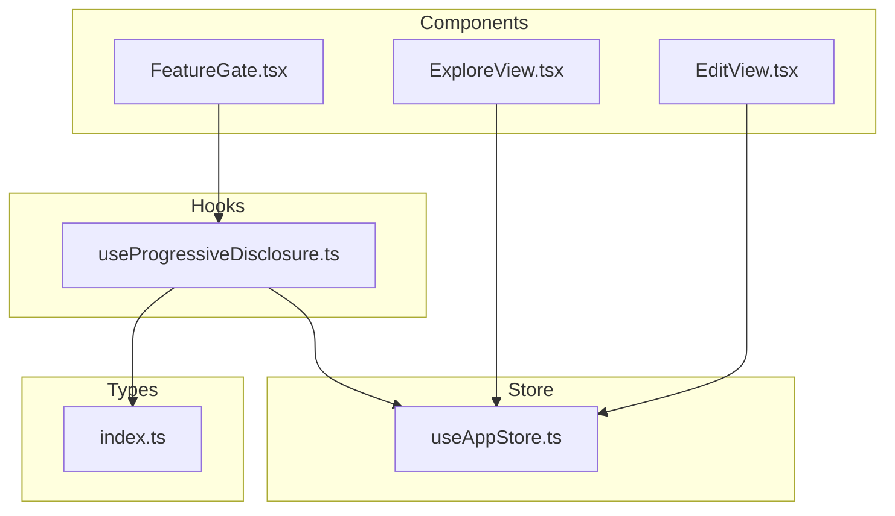
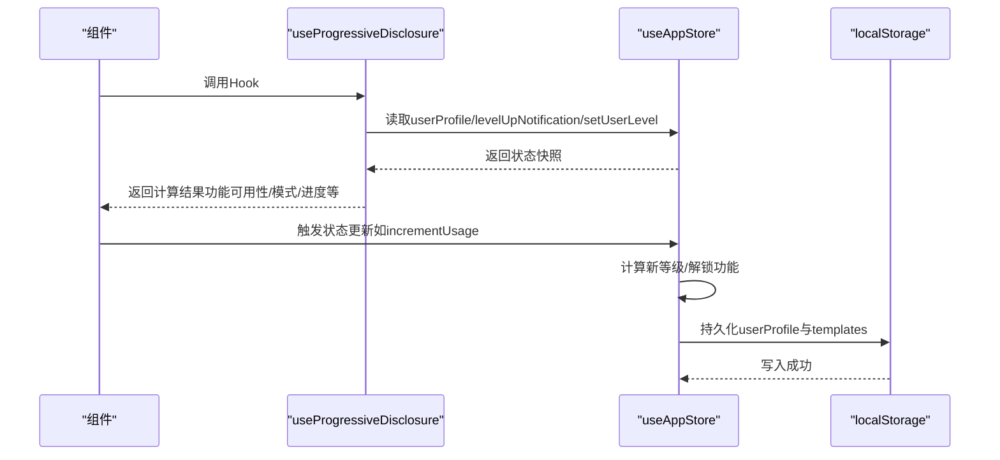
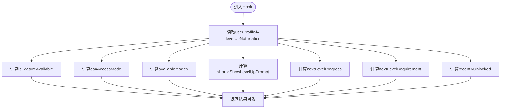
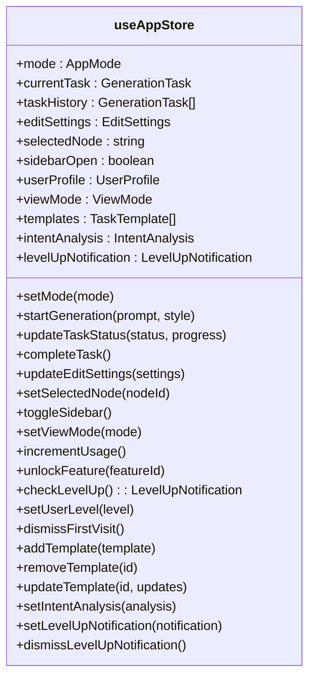
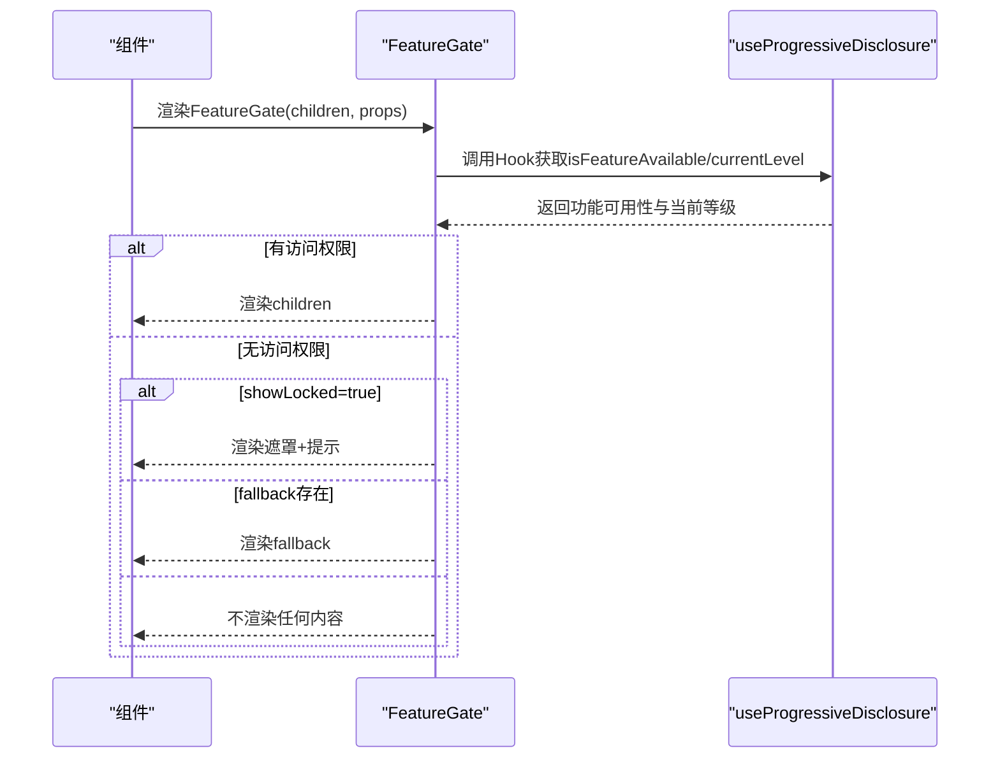
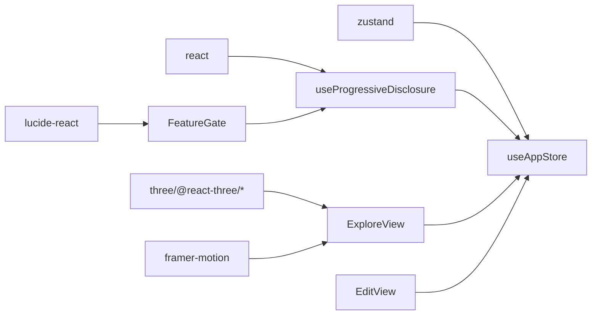

# Hook API

<cite>
**本文引用的文件**
- [useProgressiveDisclosure.ts](file://src/hooks/useProgressiveDisclosure.ts)
- [useAppStore.ts](file://src/store/useAppStore.ts)
- [index.ts](file://src/types/index.ts)
- [FeatureGate.tsx](file://src/components/Shared/FeatureGate.tsx)
- [ExploreView.tsx](file://src/components/Explore/ExploreView.tsx)
- [EditView.tsx](file://src/components/Edit/EditView.tsx)
- [package.json](file://package.json)
</cite>

## 目录
1. [简介](#简介)
2. [项目结构](#项目结构)
3. [核心组件](#核心组件)
4. [架构总览](#架构总览)
5. [详细组件分析](#详细组件分析)
6. [依赖关系分析](#依赖关系分析)
7. [性能考量](#性能考量)
8. [故障排查指南](#故障排查指南)
9. [结论](#结论)
10. [附录](#附录)

## 简介
本文件系统性梳理项目中的自定义Hook与状态管理API，重点覆盖以下内容：
- useProgressiveDisclosure：渐进式披露与功能门控Hook，用于基于用户等级与使用次数控制功能可见性与访问权限。
- useAppStore：Zustand状态管理API，涵盖状态读取、状态更新与异步操作方法。
- Hook的调用示例与最佳实践、依赖关系与性能考虑、错误处理与边界情况、版本兼容性与迁移指南。

## 项目结构
本项目采用按功能域分层的组织方式，Hooks位于src/hooks目录，状态管理位于src/store，类型定义位于src/types，UI组件位于src/components。关键文件如下：
- Hooks：useProgressiveDisclosure.ts
- Store：useAppStore.ts
- 类型：index.ts
- 组件示例：FeatureGate.tsx、ExploreView.tsx、EditView.tsx
- 依赖：package.json

图表来源
- [useProgressiveDisclosure.ts:1-136](file://src/hooks/useProgressiveDisclosure.ts#L1-L136)
- [useAppStore.ts:1-368](file://src/store/useAppStore.ts#L1-L368)
- [index.ts:1-160](file://src/types/index.ts#L1-L160)
- [FeatureGate.tsx:1-87](file://src/components/Shared/FeatureGate.tsx#L1-L87)
- [ExploreView.tsx:1-263](file://src/components/Explore/ExploreView.tsx#L1-L263)
- [EditView.tsx:1-159](file://src/components/Edit/EditView.tsx#L1-L159)

章节来源
- [useProgressiveDisclosure.ts:1-136](file://src/hooks/useProgressiveDisclosure.ts#L1-L136)
- [useAppStore.ts:1-368](file://src/store/useAppStore.ts#L1-L368)
- [index.ts:1-160](file://src/types/index.ts#L1-L160)
- [FeatureGate.tsx:1-87](file://src/components/Shared/FeatureGate.tsx#L1-L87)
- [ExploreView.tsx:1-263](file://src/components/Explore/ExploreView.tsx#L1-L263)
- [EditView.tsx:1-159](file://src/components/Edit/EditView.tsx#L1-L159)

## 核心组件
本节概述两个核心模块：渐进式披露Hook与应用状态管理Store。

- 渐进式披露Hook（useProgressiveDisclosure）
  - 功能：根据用户等级与使用次数判断功能是否可用、可访问模式、提示升级、进度计算与最近解锁项等。
  - 返回值：包含当前等级、功能可用性检查、模式访问能力、可用模式列表、升级提示、下一级进度、下一等级阈值、最近解锁功能、跳级设置等。
  - 依赖：useAppStore（读取用户资料、升级通知、设置等级）。

- 应用状态管理（useAppStore）
  - 功能：集中管理应用状态，包括模式切换、生成任务生命周期、编辑设置、管线节点选择、UI状态、用户资料、模板、意图分析、升级通知等。
  - 提供：状态读取器、状态更新器、异步模拟生成流程、持久化订阅等。

章节来源
- [useProgressiveDisclosure.ts:48-135](file://src/hooks/useProgressiveDisclosure.ts#L48-L135)
- [useAppStore.ts:50-311](file://src/store/useAppStore.ts#L50-L311)

## 架构总览
useProgressiveDisclosure通过useAppStore读取用户资料与升级通知，并在内部进行计算与缓存，以减少不必要的重渲染；useAppStore基于Zustand提供全局状态与异步流程模拟，同时通过subscribe实现本地持久化。

图表来源
- [useProgressiveDisclosure.ts:60-135](file://src/hooks/useProgressiveDisclosure.ts#L60-L135)
- [useAppStore.ts:177-215](file://src/store/useAppStore.ts#L177-L215)
- [useAppStore.ts:313-325](file://src/store/useAppStore.ts#L313-L325)

## 详细组件分析

### useProgressiveDisclosure 详解
- 参数
  - 无显式输入参数。内部通过useAppStore读取用户资料与升级通知。
- 返回值
  - currentLevel: 当前用户等级
  - isFeatureAvailable(featureId): 判断某功能是否已解锁
  - canAccessMode(mode): 判断当前等级是否可访问某模式
  - availableModes: 当前等级允许访问的模式集合
  - shouldShowLevelUpPrompt: 是否应显示升级提示
  - nextLevelProgress: 当前等级向下一等级的进度百分比
  - nextLevelRequirement: 达到下一级所需的使用次数
  - recentlyUnlocked: 最近一次升级解锁的功能列表
  - skipToLevel(level): 跳转到指定等级（通过useAppStore.setUserLevel）
- 使用场景
  - 控制UI元素的可见性与交互能力（如按钮、面板、菜单项）。
  - 在功能门控组件中统一校验访问权限。
  - 展示升级进度条与提示信息。
- 配置与映射
  - 功能等级映射：FEATURE_LEVEL_MAP
  - 等级顺序与阈值：LEVEL_ORDER、LEVEL_THRESHOLDS
  - 模式所需等级：MODE_LEVEL_MAP
  - 等级可访问模式：LEVEL_MODES
  - 等级升级解锁功能：LEVEL_UNLOCK_MAP
- 性能与依赖
  - 使用useMemo对计算结果进行缓存，避免每次渲染都重新计算。
  - 依赖数组包含unlockedFeatures、level、usageCount、lastLevelUp等关键字段。
- 错误处理与边界情况
  - 已升级到最高等级时，nextLevelProgress固定为1。
  - 升级提示窗口在短时间内不重复弹出（基于lastLevelUp时间窗口）。
  - canAccessMode对未知模式的安全处理（通过映射表）。

图表来源
- [useProgressiveDisclosure.ts:60-135](file://src/hooks/useProgressiveDisclosure.ts#L60-L135)

章节来源
- [useProgressiveDisclosure.ts:5-135](file://src/hooks/useProgressiveDisclosure.ts#L5-L135)
- [FeatureGate.tsx:30-86](file://src/components/Shared/FeatureGate.tsx#L30-L86)

### useAppStore 状态管理API
- 状态读取
  - 模式：mode（只读），setMode（写）
  - 生成任务：currentTask、taskHistory（只读），startGeneration、updateTaskStatus、completeTask（写）
  - 编辑设置：editSettings（只读），updateEditSettings（写）
  - 管线节点：selectedNode（只读），setSelectedNode（写）
  - UI状态：sidebarOpen（只读），toggleSidebar（写）
  - 用户资料：userProfile（只读），setViewMode、incrementUsage、unlockFeature、checkLevelUp、setUserLevel、dismissFirstVisit（写）
  - 模板：templates（只读），addTemplate、removeTemplate、updateTemplate（写）
  - 意图分析：intentAnalysis（只读），setIntentAnalysis（写）
  - 升级通知：levelUpNotification（只读），setLevelUpNotification、dismissLevelUpNotification（写）
- 异步操作方法
  - startGeneration：创建任务并启动模拟生成流程。
  - simulateGeneration：按阶段推进任务状态与进度，最终触发completeTask与incrementUsage。
  - completeTask：完成任务并加入历史，自动增加使用计数。
  - incrementUsage：根据使用次数与等级阈值自动升级并生成升级通知。
- 数据持久化
  - subscribe监听userProfile与templates变化，写入localStorage。
- 类型与常量
  - UserProfile、UserLevel、AppMode、GenerationTask、GenerationStatus等类型定义。
  - 默认用户资料与默认编辑设置。

图表来源
- [useAppStore.ts:50-311](file://src/store/useAppStore.ts#L50-L311)
- [index.ts:101-159](file://src/types/index.ts#L101-L159)

章节来源
- [useAppStore.ts:50-311](file://src/store/useAppStore.ts#L50-L311)
- [index.ts:101-159](file://src/types/index.ts#L101-L159)

### 功能门控组件 FeatureGate
- 作用：在UI中对特定功能或组件进行门控，依据useProgressiveDisclosure的结果决定是否渲染子节点、回退节点或显示锁定遮罩。
- 关键逻辑
  - 支持按featureId或requiredLevel两种方式校验。
  - 当showLocked为true时，渲染半透明遮罩与锁图标提示。
  - fallback存在时优先渲染回退节点。
- 典型用法
  - 将需要门控的子树包裹在FeatureGate内，传入featureId或requiredLevel。
  - 对于需要视觉反馈的场景，开启showLocked以提供友好的提示。

图表来源
- [FeatureGate.tsx:30-86](file://src/components/Shared/FeatureGate.tsx#L30-L86)
- [useProgressiveDisclosure.ts:60-76](file://src/hooks/useProgressiveDisclosure.ts#L60-L76)

章节来源
- [FeatureGate.tsx:30-86](file://src/components/Shared/FeatureGate.tsx#L30-L86)

### 组件中的Hook使用示例
- ExploreView
  - 读取currentTask与viewMode，配合useAppStore的生成流程与视图模式展示不同UI。
  - 专业模式下展示Agent步骤与技术细节。
- EditView
  - 读取userProfile与viewMode，根据用户等级动态显示“查看生成流程”按钮。
  - 通过updateEditSettings实时更新编辑设置。

章节来源
- [ExploreView.tsx:11-263](file://src/components/Explore/ExploreView.tsx#L11-L263)
- [EditView.tsx:9-159](file://src/components/Edit/EditView.tsx#L9-L159)

## 依赖关系分析
- 外部依赖
  - react：React Hooks与组件体系。
  - zustand：轻量级状态管理库。
  - three、@react-three/fiber、@react-three/drei：3D渲染相关。
  - framer-motion：动画与过渡效果。
  - lucide-react：图标库。
- 内部依赖
  - useProgressiveDisclosure依赖useAppStore提供的用户资料与升级通知。
  - FeatureGate依赖useProgressiveDisclosure进行门控判断。
  - ExploreView与EditView依赖useAppStore进行状态读取与更新。

图表来源
- [package.json:11-22](file://package.json#L11-L22)
- [useProgressiveDisclosure.ts:1-2](file://src/hooks/useProgressiveDisclosure.ts#L1-L2)
- [useAppStore.ts:1-1](file://src/store/useAppStore.ts#L1-L1)
- [FeatureGate.tsx:1-3](file://src/components/Shared/FeatureGate.tsx#L1-L3)
- [ExploreView.tsx:1-9](file://src/components/Explore/ExploreView.tsx#L1-L9)
- [EditView.tsx:1-7](file://src/components/Edit/EditView.tsx#L1-L7)

章节来源
- [package.json:11-22](file://package.json#L11-L22)

## 性能考量
- useMemo缓存
  - useProgressiveDisclosure对isFeatureAvailable、canAccessMode、availableModes、shouldShowLevelUpPrompt、nextLevelProgress、nextLevelRequirement、recentlyUnlocked等进行缓存，依赖数组仅包含必要字段，避免不必要的重计算。
- 状态粒度
  - useAppStore将状态按功能域拆分，组件仅订阅所需字段，降低重渲染范围。
- 异步流程
  - simulateGeneration使用setTimeout分阶段推进，避免阻塞主线程；completeTask完成后自动incrementUsage，确保状态一致性。
- 持久化策略
  - subscribe仅在userProfile或templates变化时写入localStorage，减少IO开销。

章节来源
- [useProgressiveDisclosure.ts:67-118](file://src/hooks/useProgressiveDisclosure.ts#L67-L118)
- [useAppStore.ts:313-325](file://src/store/useAppStore.ts#L313-L325)
- [useAppStore.ts:327-367](file://src/store/useAppStore.ts#L327-L367)

## 故障排查指南
- 功能未解锁但应解锁
  - 检查incrementUsage是否被正确触发（例如任务完成时会自动incrementUsage）。
  - 确认unlockedFeatures是否包含目标featureId。
- 升级提示不出现
  - 检查usageCount是否达到阈值且未处于5秒内重复弹窗窗口。
  - 确认levelUpNotification是否存在且未被dismiss。
- 模式不可访问
  - 检查MODE_LEVEL_MAP与当前等级的映射关系。
  - 确认canAccessMode的依赖数组是否包含当前等级。
- 状态未持久化
  - 检查localStorage写入异常捕获与subscribe回调。
  - 确认USER_PROFILE_KEY与TEMPLATES_KEY对应的键名一致。
- 动画或渲染异常
  - 检查useMemo依赖数组是否遗漏关键字段。
  - 确认组件是否正确订阅useAppStore的必要字段。

章节来源
- [useProgressiveDisclosure.ts:80-94](file://src/hooks/useProgressiveDisclosure.ts#L80-L94)
- [useAppStore.ts:177-215](file://src/store/useAppStore.ts#L177-L215)
- [useAppStore.ts:313-325](file://src/store/useAppStore.ts#L313-L325)

## 结论
本项目通过useProgressiveDisclosure与useAppStore实现了清晰的功能门控与状态管理：
- useProgressiveDisclosure以最小依赖提供功能可用性与模式访问能力，结合useMemo优化性能。
- useAppStore以模块化方式管理复杂业务状态，支持异步流程与本地持久化。
- 组件层通过FeatureGate等封装实现一致的门控体验，提升可维护性与扩展性。

## 附录

### Hook调用示例与最佳实践
- 使用useProgressiveDisclosure
  - 在需要门控的组件中直接调用，避免在父组件中重复计算。
  - 对频繁使用的布尔判断（如isFeatureAvailable）进行缓存复用。
- 使用useAppStore
  - 仅订阅必要的字段，避免全量状态订阅导致的重渲染。
  - 异步操作建议通过startGeneration等封装方法触发，保持状态更新的一致性。
- 组件集成
  - 使用FeatureGate统一处理功能门控，减少重复逻辑。
  - 在专业模式下展示更多细节，通过viewMode与userProfile联动控制。

章节来源
- [FeatureGate.tsx:30-86](file://src/components/Shared/FeatureGate.tsx#L30-L86)
- [ExploreView.tsx:11-263](file://src/components/Explore/ExploreView.tsx#L11-L263)
- [EditView.tsx:9-159](file://src/components/Edit/EditView.tsx#L9-L159)

### 版本兼容性与迁移指南
- 依赖版本
  - React：18.3.1
  - Zustand：4.5.2
  - Three.js及相关包：0.164.x
  - Framer Motion：11.2.10
  - Lucide React：0.378.0
- 迁移建议
  - 如需升级React版本，注意useMemo依赖数组的稳定性与useRef的替代方案。
  - 升级Zustand时关注create语法变更与中间件兼容性。
  - Three.js升级可能影响材质与渲染管线，需逐项验证。
  - 若引入TypeScript 5.5+，注意严格模式下的类型推断变化，完善类型注解。

章节来源
- [package.json:11-35](file://package.json#L11-L35)