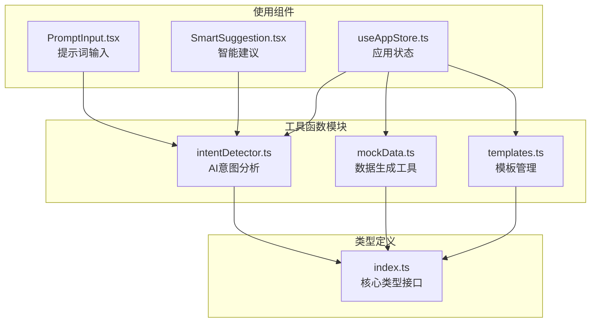
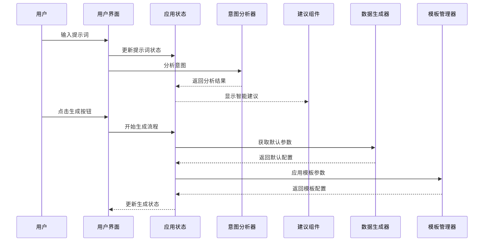
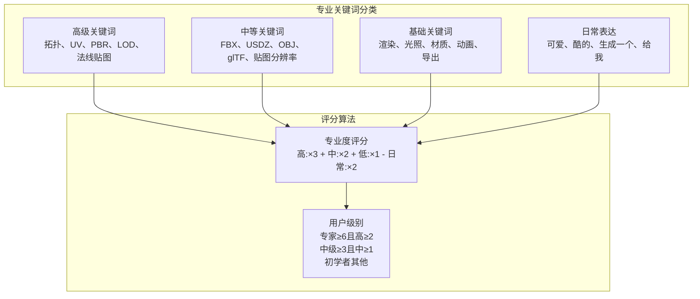
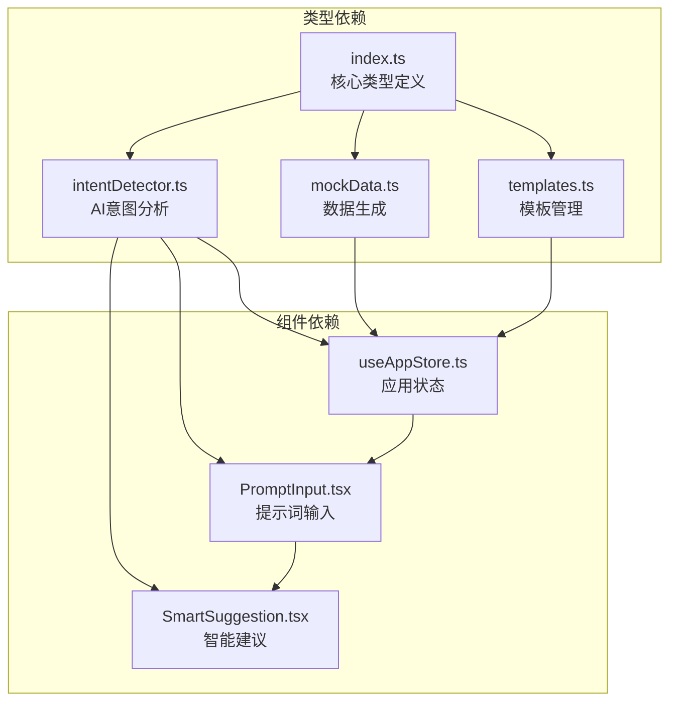

# 工具函数API

<cite>
**本文档引用的文件**
- [intentDetector.ts](file://src/utils/intentDetector.ts)
- [mockData.ts](file://src/utils/mockData.ts)
- [templates.ts](file://src/utils/templates.ts)
- [index.ts](file://src/types/index.ts)
- [PromptInput.tsx](file://src/components/Explore/PromptInput.tsx)
- [SmartSuggestion.tsx](file://src/components/Shared/SmartSuggestion.tsx)
- [useAppStore.ts](file://src/store/useAppStore.ts)
</cite>

## 目录
1. [简介](#简介)
2. [项目结构](#项目结构)
3. [核心组件](#核心组件)
4. [架构概览](#架构概览)
5. [详细组件分析](#详细组件分析)
6. [依赖关系分析](#依赖关系分析)
7. [性能考虑](#性能考虑)
8. [故障排除指南](#故障排除指南)
9. [结论](#结论)

## 简介

本文件为3D模型生成平台的工具函数API文档，涵盖三个核心工具模块：AI意图分析工具、数据生成工具和模板管理工具。这些工具函数为整个应用提供了智能化的用户体验、丰富的测试数据支持和高效的模板复用机制。

## 项目结构

工具函数位于`src/utils/`目录下，与类型定义紧密配合，形成完整的工具函数生态系统：



**图表来源**
- [intentDetector.ts:1-148](file://src/utils/intentDetector.ts#L1-L148)
- [mockData.ts:1-189](file://src/utils/mockData.ts#L1-L189)
- [templates.ts:1-115](file://src/utils/templates.ts#L1-L115)
- [index.ts:1-206](file://src/types/index.ts#L1-L206)

**章节来源**
- [intentDetector.ts:1-148](file://src/utils/intentDetector.ts#L1-L148)
- [mockData.ts:1-189](file://src/utils/mockData.ts#L1-L189)
- [templates.ts:1-115](file://src/utils/templates.ts#L1-L115)
- [index.ts:1-206](file://src/types/index.ts#L1-L206)

## 核心组件

### AI意图分析工具 (intentDetector)

AI意图分析工具通过分析用户输入的提示词，识别用户的技能水平并提供相应的界面建议和参数配置。

**主要功能特性：**
- 关键词匹配和专业度评分
- 用户级别检测和界面推荐
- 自动参数提取和配置建议
- 置信度计算和智能建议

**章节来源**
- [intentDetector.ts:77-147](file://src/utils/intentDetector.ts#L77-L147)

### 数据生成工具 (mockData)

数据生成工具提供完整的测试数据支持，包括默认参数配置、编辑设置和风格预设。

**主要功能特性：**
- 默认生成参数配置
- 编辑设置模板
- 风格预设集合
- 代理步骤模拟数据

**章节来源**
- [mockData.ts:3-189](file://src/utils/mockData.ts#L3-L189)

### 模板管理工具 (templates)

模板管理工具提供任务模板的创建、应用、搜索和过滤功能，支持高效的任务复用。

**主要功能特性：**
- 从任务创建模板
- 模板参数应用
- 预置模板集合
- 模板搜索过滤

**章节来源**
- [templates.ts:4-115](file://src/utils/templates.ts#L4-L115)

## 架构概览

工具函数在整个应用中的集成架构如下：



**图表来源**
- [PromptInput.tsx:27-50](file://src/components/Explore/PromptInput.tsx#L27-L50)
- [SmartSuggestion.tsx:13-35](file://src/components/Shared/SmartSuggestion.tsx#L13-L35)
- [useAppStore.ts:121-136](file://src/store/useAppStore.ts#L121-L136)

## 详细组件分析

### AI意图分析工具详解

#### 函数签名和参数说明

**analyzeIntent函数**
- **函数签名**: `analyzeIntent(prompt: string, userProfile: UserProfile): IntentAnalysis`
- **参数说明**:
  - `prompt`: 用户输入的提示词字符串
  - `userProfile`: 用户档案对象，包含用户级别信息
- **返回值**: `IntentAnalysis` 对象，包含检测结果和建议

**extractAutoParams函数**
- **函数签名**: `extractAutoParams(prompt: string): Partial<GenerationParameters>`
- **参数说明**: `prompt`: 用户输入的提示词字符串
- **返回值**: 部分生成参数对象，包含自动提取的配置项

#### 关键词分类体系

工具函数采用多层次的专业关键词分类：



**图表来源**
- [intentDetector.ts:3-28](file://src/utils/intentDetector.ts#L3-L28)
- [intentDetector.ts:77-147](file://src/utils/intentDetector.ts#L77-L147)

#### 置信度计算机制

置信度计算综合考虑多个因素：
- 关键词命中数量和类型
- 用户历史级别加成
- 当前检测级别与用户级别的匹配度
- 关键词总数阈值

**章节来源**
- [intentDetector.ts:77-147](file://src/utils/intentDetector.ts#L77-L147)

### 数据生成工具详解

#### 默认参数配置

**defaultParameters对象**
- **用途**: 提供生成模型的标准默认配置
- **关键参数**:
  - `cfgScale`: 7.5 (控制生成质量)
  - `samplingSteps`: 50 (采样步数)
  - `seed`: 42 (随机种子)
  - `textureResolution`: 2048 (贴图分辨率)
  - `polyBudget`: 30000 (面数预算)

**defaultEditSettings对象**
- **用途**: 提供编辑界面的默认设置
- **关键设置**:
  - 材质属性 (基础颜色、金属度、粗糙度)
  - 旋转和缩放参数
  - 灯光和背景配置

#### 风格预设系统

**stylePresets数组**
- 包含6种预设风格：
  - 写实风格 (PBR、高精度)
  - 风格化 (卡通、Low-poly)
  - 游戏资产 (LOD、优化)
  - 概念设计 (快速、迭代)
  - 建筑/场景 (模块化)
  - 角色模型 (骨骼、动画)

**章节来源**
- [mockData.ts:3-72](file://src/utils/mockData.ts#L3-L72)
- [mockData.ts:74-189](file://src/utils/mockData.ts#L74-L189)

### 模板管理工具详解

#### 模板创建和应用

**createTemplateFromTask函数**
- **功能**: 从现有生成任务创建模板
- **输入**: 任务对象、模板名称、描述、创建者
- **输出**: 完整的任务模板对象

**applyTemplate函数**
- **功能**: 将模板应用到新的生成任务
- **输入**: 模板对象
- **输出**: 包含参数和可选代理步骤的对象

#### 预置模板集合

**DEFAULT_TEMPLATES数组**
- 包含3个系统预置模板：
  - 游戏资产（低面数）
  - 影视级高品质
  - 3D打印优化

每个模板都包含完整的参数配置和使用统计信息。

**章节来源**
- [templates.ts:4-43](file://src/utils/templates.ts#L4-L43)
- [templates.ts:46-104](file://src/utils/templates.ts#L46-L104)

### 使用示例和集成方式

#### AI意图分析集成示例

在提示词输入组件中集成意图分析：

```typescript
// 在组件中使用
const analysis = analyzeIntent(prompt, userProfile)
setIntentAnalysis(analysis)

// 根据分析结果调整界面
if (analysis.confidence >= 0.6 && analysis.suggestedViewMode !== viewMode) {
  setShowSuggestion(true)
}
```

#### 数据生成工具集成示例

在应用状态管理中使用默认数据：

```typescript
// 获取默认参数
const task = {
  id: `task-${Date.now()}`,
  prompt,
  status: 'parsing',
  progress: 0,
  style,
  createdAt: Date.now(),
  parameters: { ...defaultParameters },
  agentSteps: createMockAgentSteps(),
}
```

#### 模板管理集成示例

在模板管理中应用模板：

```typescript
// 应用模板到新任务
const { parameters, agentSteps } = applyTemplate(template)
const newTask = {
  ...template,
  id: `task-${Date.now()}`,
  parameters,
  agentSteps,
  createdAt: Date.now(),
}
```

**章节来源**
- [PromptInput.tsx:27-50](file://src/components/Explore/PromptInput.tsx#L27-L50)
- [useAppStore.ts:121-136](file://src/store/useAppStore.ts#L121-L136)
- [templates.ts:24-33](file://src/utils/templates.ts#L24-L33)

## 依赖关系分析

工具函数之间的依赖关系和使用模式：



**图表来源**
- [index.ts:118-138](file://src/types/index.ts#L118-L138)
- [PromptInput.tsx:5-6](file://src/components/Explore/PromptInput.tsx#L5-L6)
- [SmartSuggestion.tsx:4](file://src/components/Shared/SmartSuggestion.tsx#L4)

**章节来源**
- [index.ts:118-138](file://src/types/index.ts#L118-L138)
- [PromptInput.tsx:5-6](file://src/components/Explore/PromptInput.tsx#L5-L6)
- [SmartSuggestion.tsx:4](file://src/components/Shared/SmartSuggestion.tsx#L4)

## 性能考虑

### AI意图分析性能特性

**时间复杂度**: O(n + m + k)
- n: 提示词长度
- m: 关键词库大小
- k: 用户级别数量

**空间复杂度**: O(m + k)
- 主要存储关键词库和中间结果

**性能优化策略**:
- 关键词匹配使用预编译正则表达式
- 缓存用户级别信息减少重复计算
- 阈值判断避免不必要的深度分析

### 数据生成工具性能特性

**内存使用**: 
- 默认参数对象占用固定内存
- 风格预设数组大小固定
- 代理步骤数据结构简单

**初始化开销**: 
- 模板创建时的深拷贝操作
- 参数应用时的对象合并

### 模板管理性能特性

**搜索复杂度**: O(t × s)
- t: 模板数量
- s: 模板字段数量

**优化建议**:
- 实现模板索引系统
- 添加缓存机制
- 支持增量更新

## 故障排除指南

### AI意图分析常见问题

**问题**: 关键词匹配不准确
- **原因**: 关键词库不完整或正则表达式过于严格
- **解决方案**: 扩展关键词库，调整匹配逻辑

**问题**: 置信度计算不合理
- **原因**: 评分权重设置不当
- **解决方案**: 调整权重系数，增加用户反馈机制

**问题**: 用户级别判断错误
- **原因**: 历史数据不足或评分算法偏差
- **解决方案**: 增加样本量，优化算法参数

### 数据生成工具常见问题

**问题**: 默认参数不符合预期
- **原因**: 参数值设置过保守或过于激进
- **解决方案**: 根据使用场景调整默认值

**问题**: 风格预设缺失
- **原因**: 新增风格未添加到预设列表
- **解决方案**: 扩展stylePresets数组

### 模板管理常见问题

**问题**: 模板应用失败
- **原因**: 模板参数与当前版本不兼容
- **解决方案**: 实现版本兼容性检查

**问题**: 模板搜索性能差
- **原因**: 未实现索引或过滤优化
- **解决方案**: 添加全文搜索索引

**章节来源**
- [intentDetector.ts:77-147](file://src/utils/intentDetector.ts#L77-L147)
- [mockData.ts:3-72](file://src/utils/mockData.ts#L3-L72)
- [templates.ts:107-114](file://src/utils/templates.ts#L107-L114)

## 结论

工具函数API为3D模型生成平台提供了强大的技术支持，涵盖了从用户意图理解到数据生成和模板管理的完整工具链。这些工具函数具有以下特点：

**统一性**: 所有工具函数都遵循相同的类型定义和接口规范，确保了系统的整体一致性。

**可扩展性**: 模块化的架构设计使得每个工具函数都可以独立扩展和维护。

**易用性**: 清晰的函数签名和详细的类型注释使得开发者能够轻松理解和使用这些工具函数。

**性能优化**: 合理的时间和空间复杂度设计确保了工具函数在大规模应用中的高效运行。

通过合理使用这些工具函数，开发者可以快速构建功能丰富、用户体验优秀的3D模型生成应用。