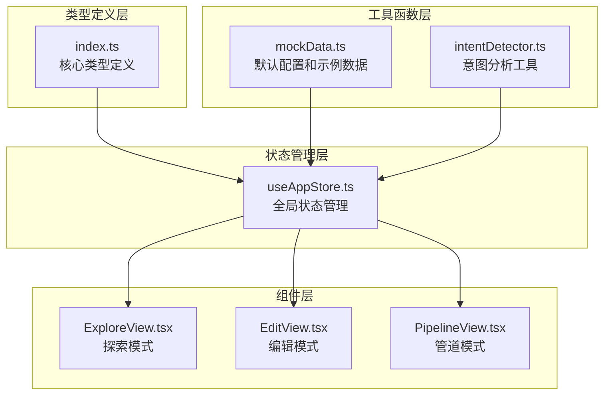
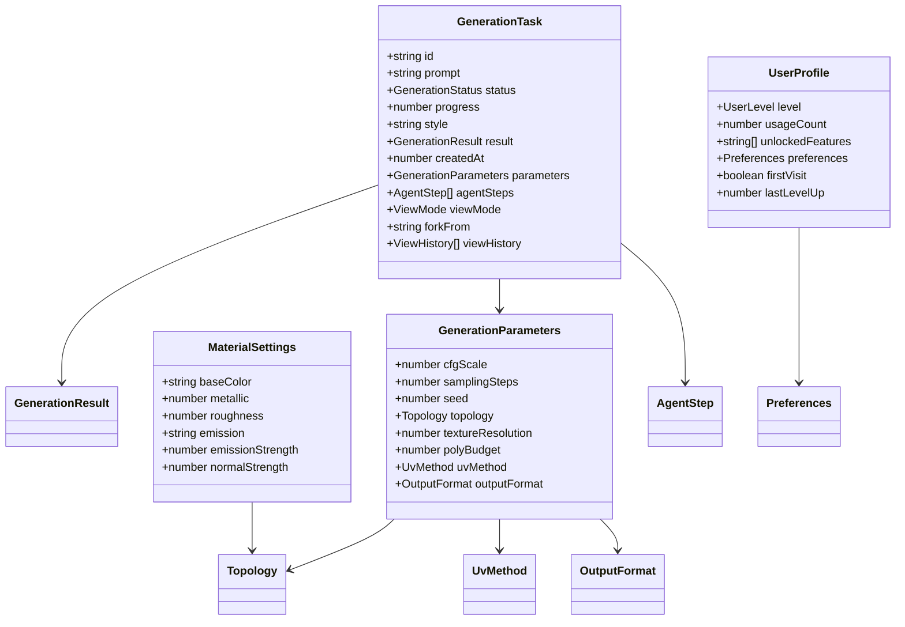
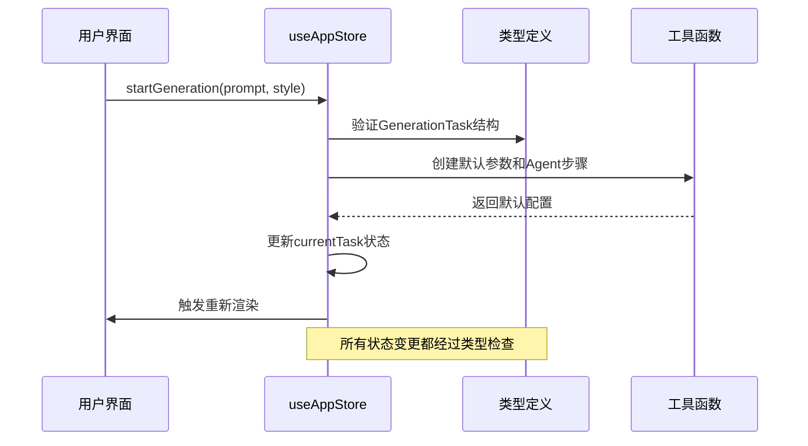
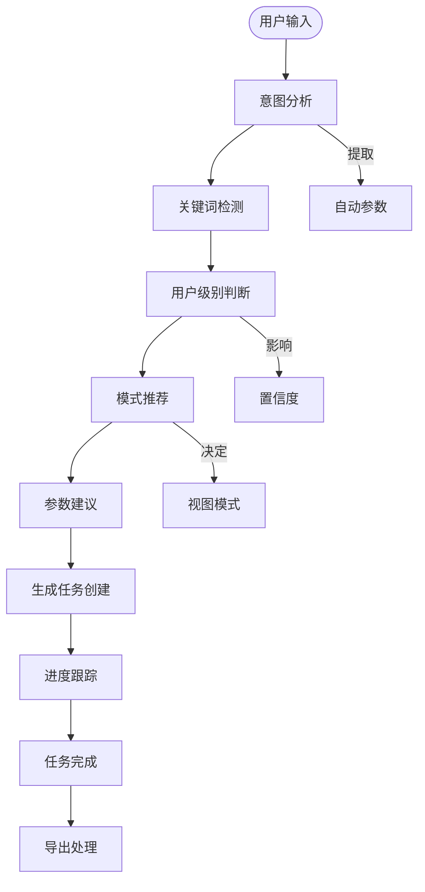
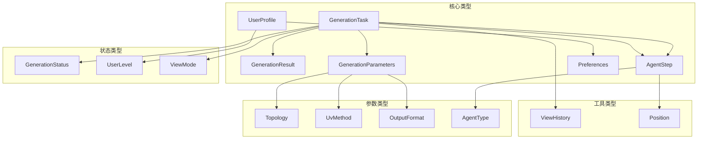
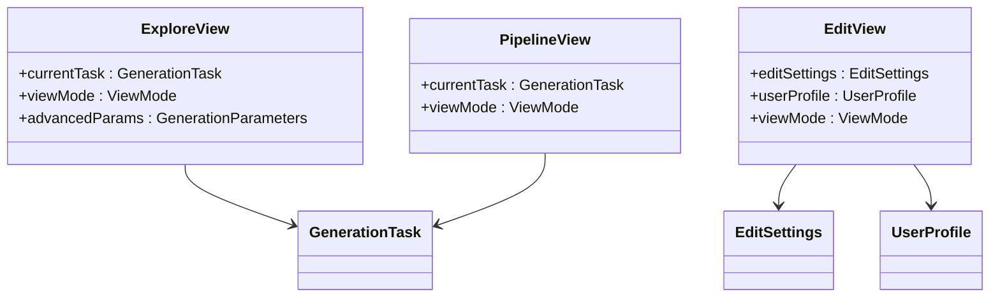

# 类型定义

<cite>
**本文档引用的文件**
- [src/types/index.ts](file://src/types/index.ts)
- [src/store/useAppStore.ts](file://src/store/useAppStore.ts)
- [src/utils/mockData.ts](file://src/utils/mockData.ts)
- [src/utils/intentDetector.ts](file://src/utils/intentDetector.ts)
- [src/components/Explore/ExploreView.tsx](file://src/components/Explore/ExploreView.tsx)
- [src/components/Edit/EditView.tsx](file://src/components/Edit/EditView.tsx)
- [src/components/Pipeline/PipelineView.tsx](file://src/components/Pipeline/PipelineView.tsx)
- [package.json](file://package.json)
</cite>

## 目录
1. [简介](#简介)
2. [项目结构](#项目结构)
3. [核心类型系统](#核心类型系统)
4. [架构概览](#架构概览)
5. [详细类型分析](#详细类型分析)
6. [依赖关系分析](#依赖关系分析)
7. [性能考虑](#性能考虑)
8. [故障排除指南](#故障排除指南)
9. [结论](#结论)

## 简介

本项目是一个基于React和TypeScript构建的3D模型生成代理应用。该应用提供了三种工作模式：探索模式（Explore）、编辑模式（Edit）和管道模式（Pipeline），支持从文本提示生成3D模型，并提供专业的编辑和参数调整功能。

项目的核心类型系统定义在[src/types/index.ts](file://src/types/index.ts)中，涵盖了从基础数据结构到复杂业务逻辑的所有类型定义。这些类型不仅定义了数据结构，更重要的是通过TypeScript的类型系统确保了应用在编译时的类型安全性和运行时的可靠性。

## 项目结构

项目采用模块化的TypeScript架构，主要分为以下几个层次：



**图表来源**
- [src/types/index.ts:1-206](file://src/types/index.ts#L1-L206)
- [src/store/useAppStore.ts:1-451](file://src/store/useAppStore.ts#L1-L451)

**章节来源**
- [src/types/index.ts:1-206](file://src/types/index.ts#L1-L206)
- [src/store/useAppStore.ts:1-451](file://src/store/useAppStore.ts#L1-L451)

## 核心类型系统

### 类型分类概述

项目中的类型系统主要分为以下几类：

1. **字面量类型（Literal Types）**：用于定义固定的字符串值集合
2. **接口类型（Interfaces）**：定义复杂的数据结构和对象形状
3. **联合类型（Union Types）**：表示多种可能的类型值
4. **工具类型（Utility Types）**：如Partial、Record等
5. **枚举类型（Enums）**：虽然项目中没有直接使用TypeScript枚举，但通过联合类型实现了类似的功能

### 主要类型族系



**图表来源**
- [src/types/index.ts:13-116](file://src/types/index.ts#L13-L116)
- [src/types/index.ts:42-91](file://src/types/index.ts#L42-L91)

**章节来源**
- [src/types/index.ts:1-206](file://src/types/index.ts#L1-L206)

## 架构概览

### 类型驱动的状态管理

应用采用Zustand进行状态管理，所有状态都严格遵循类型定义：



**图表来源**
- [src/store/useAppStore.ts:121-136](file://src/store/useAppStore.ts#L121-L136)
- [src/utils/mockData.ts:3-12](file://src/utils/mockData.ts#L3-L12)

### 数据流架构



**图表来源**
- [src/utils/intentDetector.ts:77-147](file://src/utils/intentDetector.ts#L77-L147)
- [src/store/useAppStore.ts:121-172](file://src/store/useAppStore.ts#L121-L172)

**章节来源**
- [src/store/useAppStore.ts:1-451](file://src/store/useAppStore.ts#L1-L451)
- [src/utils/intentDetector.ts:1-148](file://src/utils/intentDetector.ts#L1-L148)

## 详细类型分析

### GenerationTask - 核心任务类型

GenerationTask是整个应用的核心数据结构，代表一次完整的3D模型生成任务。

#### 字段详细说明

| 字段名 | 类型 | 必填 | 默认值 | 描述 |
|--------|------|------|--------|------|
| id | string | 是 | - | 任务唯一标识符 |
| prompt | string | 是 | - | 用户的文本提示 |
| status | GenerationStatus | 是 | - | 任务执行状态 |
| progress | number | 是 | - | 任务完成百分比 (0-100) |
| style | string | 否 | - | 风格预设ID |
| result | GenerationResult | 否 | - | 生成结果数据 |
| createdAt | number | 是 | - | 任务创建时间戳 |
| parameters | GenerationParameters | 是 | - | 生成参数配置 |
| agentSteps | AgentStep[] | 是 | - | Agent步骤列表 |
| viewMode | ViewMode | 否 | - | 当前视图模式 |
| forkFrom | string | 否 | - | 来源任务ID（用于派生） |
| viewHistory | ViewHistory[] | 否 | - | 视图切换历史 |

#### 约束条件

- progress必须在0-100范围内
- createdAt应为Unix时间戳格式
- agentSteps至少包含9个标准Agent步骤
- parameters必须符合GenerationParameters的约束

**章节来源**
- [src/types/index.ts:13-26](file://src/types/index.ts#L13-L26)

### UserProfile - 用户档案类型

UserProfile定义了用户的个人资料和偏好设置。

#### 字段详细说明

| 字段名 | 类型 | 必填 | 默认值 | 描述 |
|--------|------|------|--------|------|
| level | UserLevel | 是 | - | 用户级别 (beginner/intermediate/expert) |
| usageCount | number | 是 | - | 使用次数统计 |
| unlockedFeatures | string[] | 是 | - | 解锁的功能列表 |
| preferences | Preferences | 是 | - | 用户偏好设置 |
| firstVisit | boolean | 是 | - | 是否首次访问 |
| lastLevelUp | number | 否 | - | 最后升级时间戳 |

#### Preferences子结构

| 字段名 | 类型 | 必填 | 默认值 | 描述 |
|--------|------|------|--------|------|
| defaultViewMode | ViewMode | 是 | - | 默认视图模式 |
| defaultStyle | string | 否 | - | 默认风格预设 |
| autoSuggest | boolean | 是 | - | 是否启用自动建议 |

**章节来源**
- [src/types/index.ts:105-116](file://src/types/index.ts#L105-L116)

### MaterialSettings - 材质设置类型

MaterialSettings定义了3D模型的材质属性。

#### 字段详细说明

| 字段名 | 类型 | 必填 | 范围 | 描述 |
|--------|------|------|------|------|
| baseColor | string | 是 | 十六进制颜色值 | 基础颜色 |
| metallic | number | 是 | 0.0-1.0 | 金属度属性 |
| roughness | number | 是 | 0.0-1.0 | 粗糙度属性 |
| emission | string | 是 | 十六进制颜色值 | 自发光颜色 |
| emissionStrength | number | 是 | 0.0-∞ | 自发光强度 |
| normalStrength | number | 是 | 0.0-∞ | 法线贴图强度 |

#### 约束条件

- 所有数值属性应在合理范围内
- baseColor和emission必须为有效的十六进制颜色值
- metallic和roughness应为0-1之间的浮点数

**章节来源**
- [src/types/index.ts:84-91](file://src/types/index.ts#L84-L91)

### GenerationParameters - 生成参数类型

GenerationParameters定义了3D模型生成过程中的各种参数。

#### 字段详细说明

| 字段名 | 类型 | 必填 | 范围 | 默认值 | 描述 |
|--------|------|------|------|--------|------|
| cfgScale | number | 是 | 1.0-20.0 | 7.5 | CFG缩放系数 |
| samplingSteps | number | 是 | 10-100 | 50 | 采样步数 |
| seed | number | 是 | -1或正整数 | 42 | 随机种子 (-1表示随机) |
| topology | Topology | 是 | - | 'auto' | 拓扑类型 |
| textureResolution | number | 是 | 1024/2048/4096 | 2048 | 贴图分辨率 |
| polyBudget | number | 是 | 1000-100000 | 30000 | 多边形预算 |
| uvMethod | UvMethod | 是 | - | 'auto' | UV展开方法 |
| outputFormat | OutputFormat | 是 | - | 'glb' | 输出格式 |

#### 枚举类型定义

**Topology (拓扑类型)**
- 'auto' - 自动选择
- 'quad' - 四边面网格
- 'tri' - 三角面网格

**UvMethod (UV展开方法)**
- 'auto' - 自动展开
- 'smart' - 智能展开
- 'manual' - 手动展开

**OutputFormat (输出格式)**
- 'glb' - GL Transmission Format Binary
- 'fbx' - Autodesk FBX
- 'obj' - Wavefront OBJ
- 'usdz' - USD Zipped

**章节来源**
- [src/types/index.ts:42-51](file://src/types/index.ts#L42-L51)
- [src/utils/mockData.ts:3-12](file://src/utils/mockData.ts#L3-L12)

### AgentStep - Agent步骤类型

AgentStep定义了生成流水线中的单个处理步骤。

#### 字段详细说明

| 字段名 | 类型 | 必填 | 描述 |
|--------|------|------|------|
| id | string | 是 | 步骤唯一标识符 |
| name | string | 是 | 步骤名称 |
| type | AgentType | 是 | 步骤类型 |
| status | StepStatus | 是 | 执行状态 |
| progress | number | 是 | 进度百分比 (0-100) |
| duration | number | 否 | 执行时长 (毫秒) |
| inputs | Record<string, any> | 是 | 输入参数 |
| outputs | Record<string, any> | 是 | 输出结果 |
| position | Position | 是 | 在画布中的位置 |
| connections | string[] | 是 | 连接的下游步骤ID |

#### AgentType枚举

**AgentType (Agent类型)**
- 'intent-parser' - 意图解析
- 'concept-generator' - 概念生成
- 'structure-generator' - 结构生成
- 'detail-refiner' - 细节精修
- 'topology-optimizer' - 拓扑优化
- 'uv-unwrapper' - UV展开
- 'texture-generator' - 材质生成
- 'quality-checker' - 质量检查
- 'format-converter' - 格式转换

**章节来源**
- [src/types/index.ts:53-64](file://src/types/index.ts#L53-L64)
- [src/types/index.ts:66-76](file://src/types/index.ts#L66-L76)

### 枚举类型完整列表

项目中使用的枚举类型（通过联合类型实现）：

1. **AppMode** - 应用模式
   - 'explore' - 探索模式
   - 'edit' - 编辑模式
   - 'pipeline' - 管道模式

2. **GenerationStatus** - 生成状态
   - 'idle' - 空闲
   - 'parsing' - 解析中
   - 'generating' - 生成中
   - 'refining' - 精修中
   - 'complete' - 完成
   - 'error' - 错误

3. **UserLevel** - 用户级别
   - 'beginner' - 初学者
   - 'intermediate' - 中级用户
   - 'expert' - 专家用户

4. **ViewMode** - 视图模式
   - 'simple' - 简单模式
   - 'professional' - 专业模式

5. **MessageRole** - 消息角色
   - 'user' - 用户
   - 'assistant' - 助手
   - 'system' - 系统

6. **MessageContentType** - 消息内容类型
   - 'text' - 文本
   - 'model-preview' - 模型预览
   - 'progress' - 进度
   - 'action-card' - 操作卡片
   - 'parameters' - 参数
   - 'edit-confirm' - 编辑确认

**章节来源**
- [src/types/index.ts:1-103](file://src/types/index.ts#L1-L103)
- [src/types/index.ts:163-198](file://src/types/index.ts#L163-L198)

### 泛型类型使用

项目中使用了以下泛型类型：

1. **Partial<T>** - 将所有属性变为可选
   - 用途：用于部分更新操作
   - 示例：`Partial<GenerationParameters>`

2. **Record<string, any>** - 通用键值对映射
   - 用途：Agent步骤的输入输出参数
   - 特点：允许任意类型的值存储

3. **Array<T>** - 数组类型
   - 用途：存储多个相同类型的对象
   - 示例：`AgentStep[]`、`string[]`

**章节来源**
- [src/types/index.ts:124-124](file://src/types/index.ts#L124-L124)
- [src/types/index.ts:60-60](file://src/types/index.ts#L60-L60)

## 依赖关系分析

### 类型间依赖关系



**图表来源**
- [src/types/index.ts:13-116](file://src/types/index.ts#L13-L116)

### 组件与类型的关系



**图表来源**
- [src/components/Explore/ExploreView.tsx:11-25](file://src/components/Explore/ExploreView.tsx#L11-L25)
- [src/components/Edit/EditView.tsx:9-12](file://src/components/Edit/EditView.tsx#L9-L12)
- [src/components/Pipeline/PipelineView.tsx:9-12](file://src/components/Pipeline/PipelineView.tsx#L9-L12)

**章节来源**
- [src/components/Explore/ExploreView.tsx:1-200](file://src/components/Explore/ExploreView.tsx#L1-L200)
- [src/components/Edit/EditView.tsx:1-159](file://src/components/Edit/EditView.tsx#L1-L159)
- [src/components/Pipeline/PipelineView.tsx:1-168](file://src/components/Pipeline/PipelineView.tsx#L1-L168)

## 性能考虑

### 类型系统的性能优势

1. **编译时优化**：TypeScript在编译时进行类型检查，避免运行时类型错误
2. **智能补全**：IDE能够提供准确的代码补全和错误提示
3. **内存效率**：严格的类型定义有助于减少不必要的数据存储

### 运行时性能优化

1. **Partial类型使用**：减少不必要的对象深拷贝
2. **联合类型优化**：编译器能够更好地优化联合类型的分支
3. **接口继承**：通过接口组合减少重复定义

## 故障排除指南

### 常见类型错误及解决方案

1. **类型不匹配错误**
   - 症状：编译时报错，提示类型不兼容
   - 解决方案：检查字段类型定义，确保赋值类型正确

2. **可选属性访问错误**
   - 症状：访问可能为undefined的属性时报错
   - 解决方案：使用类型守卫或可选链操作符

3. **联合类型分支不完整**
   - 症状：switch语句缺少某些联合类型的分支
   - 解决方案：添加缺失的分支或使用never类型

### 类型安全最佳实践

1. **使用Partial进行部分更新**
   ```typescript
   // 推荐
   updateEditSettings({ material: { baseColor: '#ff0000' } })
   
   // 不推荐
   const newSettings = { ...editSettings }
   newSettings.material.baseColor = '#ff0000'
   ```

2. **接口组合优于继承**
   - 使用接口组合实现复杂的对象结构
   - 避免深层的类继承层次

3. **类型守卫的使用**
   - 对于联合类型，使用类型守卫进行安全转换
   - 利用TypeScript的内置类型守卫函数

**章节来源**
- [src/store/useAppStore.ts:174-177](file://src/store/useAppStore.ts#L174-L177)
- [src/types/index.ts:124-124](file://src/types/index.ts#L124-L124)

## 结论

本项目的类型系统设计体现了现代TypeScript开发的最佳实践：

1. **完整性**：涵盖了从基础数据结构到复杂业务逻辑的所有类型需求
2. **安全性**：通过严格的类型定义确保了应用的类型安全
3. **可维护性**：清晰的类型层次结构便于代码维护和扩展
4. **性能**：编译时类型检查提高了运行时性能

类型系统的设计充分考虑了3D模型生成应用的特殊需求，包括复杂的参数配置、多阶段的生成流程、用户级别的差异化功能等。通过合理的类型抽象和组合，为整个应用提供了坚实的技术基础。

未来的发展方向包括：
- 进一步细化类型定义，增加更多的约束和验证
- 考虑引入更高级的类型特性，如条件类型和模板字面量类型
- 建立类型测试框架，确保类型定义的正确性和一致性