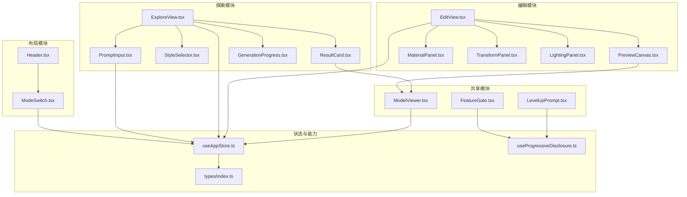
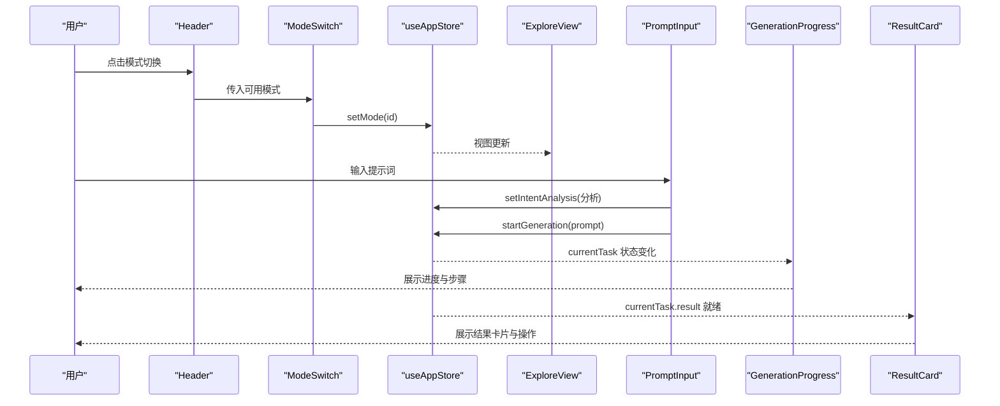
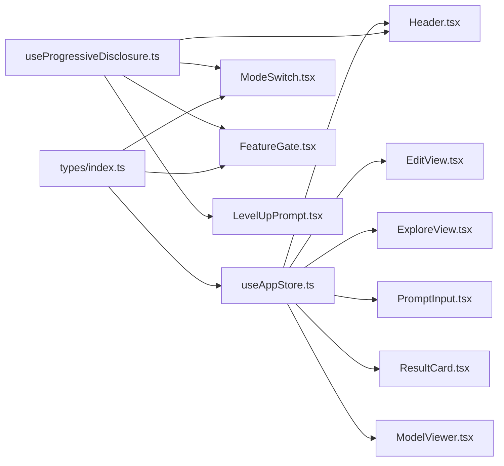

# 组件API

<cite>
**本文引用的文件**
- [EditView.tsx](file://src/components/Edit/EditView.tsx)
- [PreviewCanvas.tsx](file://src/components/Edit/PreviewCanvas.tsx)
- [MaterialPanel.tsx](file://src/components/Edit/MaterialPanel.tsx)
- [TransformPanel.tsx](file://src/components/Edit/TransformPanel.tsx)
- [LightingPanel.tsx](file://src/components/Edit/LightingPanel.tsx)
- [ExploreView.tsx](file://src/components/Explore/ExploreView.tsx)
- [PromptInput.tsx](file://src/components/Explore/PromptInput.tsx)
- [StyleSelector.tsx](file://src/components/Explore/StyleSelector.tsx)
- [ResultCard.tsx](file://src/components/Explore/ResultCard.tsx)
- [GenerationProgress.tsx](file://src/components/Explore/GenerationProgress.tsx)
- [Header.tsx](file://src/components/Layout/Header.tsx)
- [ModeSwitch.tsx](file://src/components/Layout/ModeSwitch.tsx)
- [ModelViewer.tsx](file://src/components/Shared/ModelViewer.tsx)
- [FeatureGate.tsx](file://src/components/Shared/FeatureGate.tsx)
- [LevelUpPrompt.tsx](file://src/components/Shared/LevelUpPrompt.tsx)
- [useAppStore.ts](file://src/store/useAppStore.ts)
- [useProgressiveDisclosure.ts](file://src/hooks/useProgressiveDisclosure.ts)
- [index.ts](file://src/types/index.ts)
</cite>

## 目录
1. [简介](#简介)
2. [项目结构](#项目结构)
3. [核心组件](#核心组件)
4. [架构总览](#架构总览)
5. [详细组件分析](#详细组件分析)
6. [依赖关系分析](#依赖关系分析)
7. [性能考量](#性能考量)
8. [故障排查指南](#故障排查指南)
9. [结论](#结论)
10. [附录](#附录)

## 简介
本文件为“3D模型代理”项目的组件API文档，覆盖编辑、探索、布局与共享组件的Props接口、事件回调、状态管理方法、生命周期与渲染行为、组件间通信与数据流、样式定制与主题支持、性能优化与内存管理建议等。目标是帮助开发者快速理解各组件的职责边界、使用方式与最佳实践。

## 项目结构
项目采用按功能域分层的目录组织：编辑(Edit)、探索(Explore)、布局(Layout)、管道(Pipeline)、共享(Shared)，以及全局状态(store)、类型(types)、钩子(hooks)与工具(utils)。组件通过全局状态(useAppStore)与用户能力门禁(useProgressiveDisclosure)进行跨组件通信与权限控制。

图表来源
- [EditView.tsx:1-159](file://src/components/Edit/EditView.tsx#L1-L159)
- [PreviewCanvas.tsx:1-54](file://src/components/Edit/PreviewCanvas.tsx#L1-L54)
- [MaterialPanel.tsx:1-209](file://src/components/Edit/MaterialPanel.tsx#L1-L209)
- [TransformPanel.tsx:1-102](file://src/components/Edit/TransformPanel.tsx#L1-L102)
- [LightingPanel.tsx:1-78](file://src/components/Edit/LightingPanel.tsx#L1-L78)
- [ExploreView.tsx:1-263](file://src/components/Explore/ExploreView.tsx#L1-L263)
- [PromptInput.tsx:1-161](file://src/components/Explore/PromptInput.tsx#L1-L161)
- [StyleSelector.tsx:1-61](file://src/components/Explore/StyleSelector.tsx#L1-L61)
- [ResultCard.tsx:1-129](file://src/components/Explore/ResultCard.tsx#L1-L129)
- [GenerationProgress.tsx:1-131](file://src/components/Explore/GenerationProgress.tsx#L1-L131)
- [Header.tsx:1-78](file://src/components/Layout/Header.tsx#L1-L78)
- [ModeSwitch.tsx:1-82](file://src/components/Layout/ModeSwitch.tsx#L1-L82)
- [ModelViewer.tsx:1-156](file://src/components/Shared/ModelViewer.tsx#L1-L156)
- [FeatureGate.tsx:1-87](file://src/components/Shared/FeatureGate.tsx#L1-L87)
- [LevelUpPrompt.tsx:1-128](file://src/components/Shared/LevelUpPrompt.tsx#L1-L128)
- [useAppStore.ts](file://src/store/useAppStore.ts)
- [useProgressiveDisclosure.ts](file://src/hooks/useProgressiveDisclosure.ts)
- [index.ts](file://src/types/index.ts)

章节来源
- [EditView.tsx:1-159](file://src/components/Edit/EditView.tsx#L1-L159)
- [ExploreView.tsx:1-263](file://src/components/Explore/ExploreView.tsx#L1-L263)
- [Header.tsx:1-78](file://src/components/Layout/Header.tsx#L1-L78)
- [ModelViewer.tsx:1-156](file://src/components/Shared/ModelViewer.tsx#L1-L156)
- [useAppStore.ts](file://src/store/useAppStore.ts)
- [useProgressiveDisclosure.ts](file://src/hooks/useProgressiveDisclosure.ts)
- [index.ts](file://src/types/index.ts)

## 核心组件
本节概述关键组件的职责、Props接口、事件回调与状态管理要点，并给出使用示例与最佳实践。

- 全局状态与能力门禁
  - useAppStore：集中管理应用模式(mode)、视图模式(viewMode)、用户资料(userProfile)、当前任务(currentTask)、编辑设置(editSettings)、意图分析(intentAnalysis)、升级通知(levelUpNotification)等；提供更新编辑设置(updateEditSettings)、开始生成(startGeneration)、切换模式(setMode)、切换视图(setViewMode)、设置意图分析(setIntentAnalysis)、首次访问处理(dismissFirstVisit)、升级通知处理(dismissLevelUpNotification)等方法。
  - useProgressiveDisclosure：根据用户使用次数与等级计算可访问模式与特性，提供 canAccessMode/isFeatureAvailable/currentLevel 等能力查询。
  - types/index.ts：定义 AppMode、ViewMode、UserLevel、Task、TaskStep 等类型。

- 编辑视图 EditView
  - 职责：根据视图模式渲染简洁或专业模式的编辑界面，左侧3D预览，右侧控制面板，底部操作栏。
  - 关键Props：无（内部通过useAppStore读取/写入状态）
  - 事件回调：无（按钮点击直接调用useAppStore方法）
  - 状态管理：读取 editSettings、viewMode、userProfile；通过 updateEditSettings 更新材质、变换、光照、背景等；根据用户等级显示“查看生成流程”按钮。
  - 使用示例：在根组件中直接引入并渲染。
  - 最佳实践：避免在组件内重复订阅全局状态，统一通过 useAppStore 的方法更新；注意视图模式切换时的面板开合动画与布局自适应。

- 材质面板 MaterialPanel
  - 职责：提供材质基础色、金属度、粗糙度、自发光颜色与强度、法线贴图强度等参数调节。
  - 关键Props：无（内部通过useAppStore读取/写入）
  - 事件回调：onChange(v) -> updateMaterial(key, v)
  - 状态管理：维护本地展开状态 isOpen；通过 updateEditSettings 批量更新 material 子对象。
  - 使用示例：在 EditView 中按需渲染。
  - 最佳实践：滑条组件 NeonSlider 自绘渐变与阴影，注意浏览器兼容性与移动端触摸体验。

- 变换面板 TransformPanel
  - 职责：提供旋转(X/Y/Z)、缩放参数与重置按钮。
  - 关键Props：无（内部通过useAppStore读取/写入）
  - 事件回调：onChange(v) -> updateEditSettings({ rotation/scale })
  - 状态管理：维护本地展开状态 open；resetTransform 重置为初始值。
  - 使用示例：在 EditView 中按需渲染。
  - 最佳实践：滑条步进(step)与精度匹配数值范围；重置按钮提供一键恢复。

- 光照面板 LightingPanel
  - 职责：提供光照预设与背景色选择。
  - 关键Props：无（内部通过useAppStore读取/写入）
  - 事件回调：无（点击即更新）
  - 状态管理：维护本地展开状态 open；通过 updateEditSettings 更新 lighting 与 background。
  - 使用示例：在 EditView 中按需渲染。
  - 最佳实践：预设图标与标签清晰表达场景氛围；颜色输入与十六进制显示联动。

- 预览画布 PreviewCanvas
  - 职责：承载3D模型预览与基本视图控制。
  - 关键Props：无（内部通过useAppStore读取）
  - 事件回调：无（按钮为占位交互）
  - 状态管理：读取 editSettings 并传递给 ModelViewer。
  - 使用示例：在 EditView 左侧区域渲染。
  - 最佳实践：视口控制按钮可扩展为实际操作；信息遮罩层用于展示模型元数据。

- 探索视图 ExploreView
  - 职责：输入提示词、选择风格、展示生成进度与结果卡片。
  - 关键Props：无（内部通过useAppStore读取/写入）
  - 事件回调：selectedStyle/onSelect、advancedOpen/setAdvancedOpen、advancedParams 状态管理
  - 状态管理：根据 currentTask 状态切换输入/生成/结果三阶段；专业模式下展示 Agent 步骤与技术详情。
  - 使用示例：在根组件中直接引入并渲染。
  - 最佳实践：专业参数仅在专业模式可见；结果卡片提供多通道导航入口。

- 提示词输入 PromptInput
  - 职责：输入提示词、智能建议、快捷建议、意图分析与生成触发。
  - 关键Props：无（内部通过useAppStore读取/写入）
  - 事件回调：handleSubmit/onAcceptSuggestion/onInputFocus
  - 状态管理：防抖分析用户意图；根据置信度与建议视图模式决定是否弹出建议；首次访问时自动关闭引导。
  - 使用示例：在 ExploreView 中渲染。
  - 最佳实践：Enter 键提交；禁用态防止并发生成；建议面板可复用 SmartSuggestion 组件。

- 风格选择器 StyleSelector
  - 职责：风格预设选择与视觉反馈。
  - 关键Props：
    - onSelect(styleId: string): 回调函数
    - selected: string | null
  - 事件回调：onClick -> onSelect(preset.id)
  - 状态管理：无（纯受控组件）
  - 使用示例：在 ExploreView 中渲染。
  - 最佳实践：选中态使用 layoutId 动画过渡；标签截断展示前两个关键词。

- 结果卡片 ResultCard
  - 职责：展示生成结果的统计信息、纹理列表与操作按钮。
  - 关键Props：无（内部通过useAppStore读取）
  - 事件回调：无（按钮点击直接调用useAppStore方法）
  - 状态管理：读取 currentTask.result；提供“编辑/下载/重置/跨模式导航”等动作。
  - 使用示例：在 ExploreView 的完成态渲染。
  - 最佳实践：紧凑模式下的自动旋转与几何体随机化提升预览效果。

- 生成进度 GenerationProgress
  - 职责：展示圆形进度环、状态文本与步骤指示。
  - 关键Props：无（内部通过useAppStore读取）
  - 事件回调：无
  - 状态管理：读取 currentTask.progress/status/agentSteps；计算圆弧描边偏移。
  - 使用示例：在 ExploreView 的生成态渲染。
  - 最佳实践：状态标签映射表清晰表达阶段含义；步骤点按状态着色。

- 头部 Header
  - 职责：Logo、模式切换、视图模式切换、积分与消息徽章、用户头像。
  - 关键Props：无（内部通过useAppStore与useProgressiveDisclosure读取/写入）
  - 事件回调：无（按钮点击直接调用）
  - 状态管理：根据用户等级显示视图模式切换；ModeSwitch 传入可用模式集合。
  - 使用示例：在根组件顶部固定渲染。
  - 最佳实践：视图模式切换使用 layoutId 动画；积分与消息徽章增强交互反馈。

- 模式切换 ModeSwitch
  - 职责：探索/编辑/管线三种模式的切换与解锁提示。
  - 关键Props：
    - availableModes: AppMode[]
  - 事件回调：onClick -> setMode(id)
  - 状态管理：无（纯受控组件）
  - 使用示例：在 Header 中渲染。
  - 最佳实践：锁定态显示 tooltip；激活态使用 layoutId 动画高亮。

- 模型查看器 ModelViewer
  - 职责：基于 @react-three/fiber 的3D渲染容器，支持多种几何体、材质参数、光照与网格。
  - 关键Props：
    - baseColor?: string
    - metallic?: number
    - roughness?: number
    - emission?: string
    - emissionStrength?: number
    - rotation?: { x: number; y: number; z: number }
    - scale?: number
    - lighting?: 'studio' | 'outdoor' | 'dramatic' | 'neutral'
    - showGrid?: boolean
    - autoRotate?: boolean
    - backgroundColor?: string
    - geometry?: 'box' | 'sphere' | 'torus' | 'cylinder' | 'cone' | 'torusKnot'
    - className?: string
    - compact?: boolean
  - 事件回调：无（内部使用 useFrame 动画）
  - 状态管理：无（纯渲染组件）
  - 使用示例：在 PreviewCanvas 与 ResultCard 中渲染。
  - 最佳实践：使用 React.memo 包装以减少重渲染；相机位置与FOV根据 compact 切换；Suspense 加载骨架。

- 能力门禁 FeatureGate
  - 职责：根据用户等级与使用次数控制组件可见性与锁定态遮罩。
  - 关键Props：
    - children: React.ReactNode
    - featureId?: string
    - requiredLevel?: UserLevel
    - fallback?: React.ReactNode
    - showLocked?: boolean
  - 事件回调：无
  - 状态管理：无（纯渲染组件）
  - 使用示例：包裹需要权限保护的功能区域。
  - 最佳实践：showLocked 时提供友好提示与解锁条件；必要时提供自定义 fallback。

- 升级提示 LevelUpPrompt
  - 职责：用户升级后弹出提示，引导进入新模式。
  - 关键Props：无（内部通过useAppStore与useProgressiveDisclosure读取/写入）
  - 事件回调：handleAction/handleDismiss
  - 状态管理：监听 levelUpNotification；自动隐藏与手动关闭。
  - 使用示例：在根组件中全局渲染。
  - 最佳实践：淡入淡出动画与渐变背景；区分中级与专家提示内容。

章节来源
- [EditView.tsx:1-159](file://src/components/Edit/EditView.tsx#L1-L159)
- [MaterialPanel.tsx:1-209](file://src/components/Edit/MaterialPanel.tsx#L1-L209)
- [TransformPanel.tsx:1-102](file://src/components/Edit/TransformPanel.tsx#L1-L102)
- [LightingPanel.tsx:1-78](file://src/components/Edit/LightingPanel.tsx#L1-L78)
- [PreviewCanvas.tsx:1-54](file://src/components/Edit/PreviewCanvas.tsx#L1-L54)
- [ExploreView.tsx:1-263](file://src/components/Explore/ExploreView.tsx#L1-L263)
- [PromptInput.tsx:1-161](file://src/components/Explore/PromptInput.tsx#L1-L161)
- [StyleSelector.tsx:1-61](file://src/components/Explore/StyleSelector.tsx#L1-L61)
- [ResultCard.tsx:1-129](file://src/components/Explore/ResultCard.tsx#L1-L129)
- [GenerationProgress.tsx:1-131](file://src/components/Explore/GenerationProgress.tsx#L1-L131)
- [Header.tsx:1-78](file://src/components/Layout/Header.tsx#L1-L78)
- [ModeSwitch.tsx:1-82](file://src/components/Layout/ModeSwitch.tsx#L1-L82)
- [ModelViewer.tsx:1-156](file://src/components/Shared/ModelViewer.tsx#L1-L156)
- [FeatureGate.tsx:1-87](file://src/components/Shared/FeatureGate.tsx#L1-L87)
- [LevelUpPrompt.tsx:1-128](file://src/components/Shared/LevelUpPrompt.tsx#L1-L128)
- [useAppStore.ts](file://src/store/useAppStore.ts)
- [useProgressiveDisclosure.ts](file://src/hooks/useProgressiveDisclosure.ts)
- [index.ts](file://src/types/index.ts)

## 架构总览
组件间通过全局状态与能力门禁实现解耦：头部与模式切换负责顶层导航与权限控制；探索视图负责生成流程编排；编辑视图负责材质/变换/光照的实时预览；共享组件提供通用能力与3D渲染。

图表来源
- [Header.tsx:1-78](file://src/components/Layout/Header.tsx#L1-L78)
- [ModeSwitch.tsx:1-82](file://src/components/Layout/ModeSwitch.tsx#L1-L82)
- [useAppStore.ts](file://src/store/useAppStore.ts)
- [ExploreView.tsx:1-263](file://src/components/Explore/ExploreView.tsx#L1-L263)
- [PromptInput.tsx:1-161](file://src/components/Explore/PromptInput.tsx#L1-L161)
- [GenerationProgress.tsx:1-131](file://src/components/Explore/GenerationProgress.tsx#L1-L131)
- [ResultCard.tsx:1-129](file://src/components/Explore/ResultCard.tsx#L1-L129)

## 详细组件分析

### EditView 组件
- Props 接口
  - 无（内部通过 useAppStore 访问状态）
- 事件回调
  - 无（按钮点击直接调用 useAppStore 方法）
- 状态管理
  - 读取：viewMode、editSettings、userProfile
  - 写入：updateEditSettings、setMode
- 生命周期与渲染
  - 使用 Framer Motion 进行入场/出场动画；根据 viewMode 切换面板布局；底部操作栏根据用户等级显示“查看生成流程”
- 数据流
  - 编辑设置变更 -> PreviewCanvas -> ModelViewer 实时预览
- 使用示例
  - 在根组件中直接渲染
- 最佳实践
  - 将复杂面板拆分为独立组件（Material/Transform/Lighting），保持 EditView 清晰

章节来源
- [EditView.tsx:1-159](file://src/components/Edit/EditView.tsx#L1-L159)
- [useAppStore.ts](file://src/store/useAppStore.ts)

### MaterialPanel 组件
- Props 接口
  - 无（内部通过 useAppStore 读取/写入）
- 事件回调
  - onChange(v: number) -> updateMaterial(key, v)
- 状态管理
  - 本地：isOpen（展开/收起）
  - 全局：editSettings.material
- 渲染逻辑
  - 基础色颜色选择器 + 十六进制显示联动
  - 金属度、粗糙度、自发光强度滑条
  - 法线贴图强度滑条
- 使用示例
  - 在 EditView 中按需渲染
- 最佳实践
  - 滑条自绘渐变与阴影，注意浏览器兼容性

章节来源
- [MaterialPanel.tsx:1-209](file://src/components/Edit/MaterialPanel.tsx#L1-L209)
- [useAppStore.ts](file://src/store/useAppStore.ts)

### TransformPanel 组件
- Props 接口
  - 无（内部通过 useAppStore 读取/写入）
- 事件回调
  - onChange(v: number) -> updateEditSettings({ rotation/scale })
- 状态管理
  - 本地：open（展开/收起）
  - 全局：editSettings.rotation/scale
- 渲染逻辑
  - 旋转 X/Y/Z 滑条
  - 缩放滑条
  - 重置按钮重置为初始值
- 使用示例
  - 在 EditView 中按需渲染
- 最佳实践
  - 滑条步进与精度匹配数值范围；重置按钮提供一键恢复

章节来源
- [TransformPanel.tsx:1-102](file://src/components/Edit/TransformPanel.tsx#L1-L102)
- [useAppStore.ts](file://src/store/useAppStore.ts)

### LightingPanel 组件
- Props 接口
  - 无（内部通过 useAppStore 读取/写入）
- 事件回调
  - 无（点击即更新）
- 状态管理
  - 本地：open（展开/收起）
  - 全局：editSettings.lighting/background
- 渲染逻辑
  - 光照预设网格（影棚/室外/戏剧/中性）
  - 背景色选择器
- 使用示例
  - 在 EditView 中按需渲染
- 最佳实践
  - 预设图标与标签清晰表达场景氛围；颜色输入与十六进制显示联动

章节来源
- [LightingPanel.tsx:1-78](file://src/components/Edit/LightingPanel.tsx#L1-L78)
- [useAppStore.ts](file://src/store/useAppStore.ts)

### PreviewCanvas 组件
- Props 接口
  - 无（内部通过 useAppStore 读取）
- 事件回调
  - 无（按钮为占位交互）
- 状态管理
  - 读取：editSettings
- 渲染逻辑
  - ModelViewer 承载3D预览
  - 视口控制按钮（占位）
  - 底部信息遮罩
- 使用示例
  - 在 EditView 左侧区域渲染
- 最佳实践
  - 视口控制按钮可扩展为实际操作；信息遮罩层用于展示模型元数据

章节来源
- [PreviewCanvas.tsx:1-54](file://src/components/Edit/PreviewCanvas.tsx#L1-L54)
- [ModelViewer.tsx:1-156](file://src/components/Shared/ModelViewer.tsx#L1-L156)
- [useAppStore.ts](file://src/store/useAppStore.ts)

### ExploreView 组件
- Props 接口
  - 无（内部通过 useAppStore 读取/写入）
- 事件回调
  - selectedStyle/onSelect
  - advancedOpen/setAdvancedOpen
  - advancedParams 状态管理
- 状态管理
  - 读取：currentTask、viewMode
  - 写入：setAdvancedParams、setViewMode、setMode
- 渲染逻辑
  - 三阶段：输入态、生成态、结果态
  - 专业模式：展示 Agent 步骤与技术详情
- 使用示例
  - 在根组件中直接渲染
- 最佳实践
  - 专业参数仅在专业模式可见；结果卡片提供多通道导航入口

章节来源
- [ExploreView.tsx:1-263](file://src/components/Explore/ExploreView.tsx#L1-L263)
- [useAppStore.ts](file://src/store/useAppStore.ts)

### PromptInput 组件
- Props 接口
  - 无（内部通过 useAppStore 读取/写入）
- 事件回调
  - handleSubmit/onAcceptSuggestion/onInputFocus
- 状态管理
  - 本地：prompt、showSuggestion
  - 全局：currentTask、intentAnalysis、userProfile、viewMode、mode
- 渲染逻辑
  - 防抖意图分析；智能建议面板；快捷建议
- 使用示例
  - 在 ExploreView 中渲染
- 最佳实践
  - Enter 键提交；禁用态防止并发生成；建议面板可复用 SmartSuggestion 组件

章节来源
- [PromptInput.tsx:1-161](file://src/components/Explore/PromptInput.tsx#L1-L161)
- [useAppStore.ts](file://src/store/useAppStore.ts)

### StyleSelector 组件
- Props 接口
  - onSelect(styleId: string): 回调函数
  - selected: string | null
- 事件回调
  - onClick -> onSelect(preset.id)
- 状态管理
  - 无（纯受控组件）
- 渲染逻辑
  - 风格预设网格；选中态动画过渡；标签截断展示
- 使用示例
  - 在 ExploreView 中渲染
- 最佳实践
  - 选中态使用 layoutId 动画过渡；标签截断展示前两个关键词

章节来源
- [StyleSelector.tsx:1-61](file://src/components/Explore/StyleSelector.tsx#L1-L61)

### ResultCard 组件
- Props 接口
  - 无（内部通过 useAppStore 读取）
- 事件回调
  - 无（按钮点击直接调用 useAppStore 方法）
- 状态管理
  - 读取：currentTask.result、userProfile、mode
  - 写入：setMode
- 渲染逻辑
  - 3D预览区 + 统计网格 + 纹理列表 + 操作按钮
- 使用示例
  - 在 ExploreView 的完成态渲染
- 最佳实践
  - 紧凑模式下的自动旋转与几何体随机化提升预览效果

章节来源
- [ResultCard.tsx:1-129](file://src/components/Explore/ResultCard.tsx#L1-L129)
- [ModelViewer.tsx:1-156](file://src/components/Shared/ModelViewer.tsx#L1-L156)
- [useAppStore.ts](file://src/store/useAppStore.ts)

### GenerationProgress 组件
- Props 接口
  - 无（内部通过 useAppStore 读取）
- 事件回调
  - 无
- 状态管理
  - 读取：currentTask.progress/status/agentSteps
- 渲染逻辑
  - 圆形进度环 + 状态文本 + 步骤指示
- 使用示例
  - 在 ExploreView 的生成态渲染
- 最佳实践
  - 状态标签映射表清晰表达阶段含义；步骤点按状态着色

章节来源
- [GenerationProgress.tsx:1-131](file://src/components/Explore/GenerationProgress.tsx#L1-L131)
- [useAppStore.ts](file://src/store/useAppStore.ts)

### Header 组件
- Props 接口
  - 无（内部通过 useAppStore 与 useProgressiveDisclosure 读取/写入）
- 事件回调
  - 无（按钮点击直接调用）
- 状态管理
  - 读取：viewMode、currentLevel
  - 写入：setViewMode
- 渲染逻辑
  - Logo + 模式切换 + 视图模式切换 + 积分与消息徽章 + 用户头像
- 使用示例
  - 在根组件顶部固定渲染
- 最佳实践
  - 视图模式切换使用 layoutId 动画；积分与消息徽章增强交互反馈

章节来源
- [Header.tsx:1-78](file://src/components/Layout/Header.tsx#L1-L78)
- [ModeSwitch.tsx:1-82](file://src/components/Layout/ModeSwitch.tsx#L1-L82)
- [useAppStore.ts](file://src/store/useAppStore.ts)
- [useProgressiveDisclosure.ts](file://src/hooks/useProgressiveDisclosure.ts)

### ModeSwitch 组件
- Props 接口
  - availableModes: AppMode[]
- 事件回调
  - onClick -> setMode(id)
- 状态管理
  - 无（纯受控组件）
- 渲染逻辑
  - 探索/编辑/管线三种模式；锁定态 tooltip
- 使用示例
  - 在 Header 中渲染
- 最佳实践
  - 锁定态显示 tooltip；激活态使用 layoutId 动画高亮

章节来源
- [ModeSwitch.tsx:1-82](file://src/components/Layout/ModeSwitch.tsx#L1-L82)
- [useAppStore.ts](file://src/store/useAppStore.ts)

### ModelViewer 组件
- Props 接口
  - baseColor?: string
  - metallic?: number
  - roughness?: number
  - emission?: string
  - emissionStrength?: number
  - rotation?: { x: number; y: number; z: number }
  - scale?: number
  - lighting?: 'studio' | 'outdoor' | 'dramatic' | 'neutral'
  - showGrid?: boolean
  - autoRotate?: boolean
  - backgroundColor?: string
  - geometry?: 'box' | 'sphere' | 'torus' | 'cylinder' | 'cone' | 'torusKnot'
  - className?: string
  - compact?: boolean
- 事件回调
  - 无（内部使用 useFrame 动画）
- 状态管理
  - 无（纯渲染组件）
- 渲染逻辑
  - 几何体选择、材质参数、光照环境、网格与轨道控制器
- 使用示例
  - 在 PreviewCanvas 与 ResultCard 中渲染
- 最佳实践
  - 使用 React.memo 包装以减少重渲染；相机位置与FOV根据 compact 切换；Suspense 加载骨架

章节来源
- [ModelViewer.tsx:1-156](file://src/components/Shared/ModelViewer.tsx#L1-L156)

### FeatureGate 组件
- Props 接口
  - children: React.ReactNode
  - featureId?: string
  - requiredLevel?: UserLevel
  - fallback?: React.ReactNode
  - showLocked?: boolean
- 事件回调
  - 无
- 状态管理
  - 无（纯渲染组件）
- 渲染逻辑
  - 根据 isFeatureAvailable 与 currentLevel 决定可见性；可选锁定遮罩
- 使用示例
  - 包裹需要权限保护的功能区域
- 最佳实践
  - showLocked 时提供友好提示与解锁条件；必要时提供自定义 fallback

章节来源
- [FeatureGate.tsx:1-87](file://src/components/Shared/FeatureGate.tsx#L1-L87)
- [useProgressiveDisclosure.ts](file://src/hooks/useProgressiveDisclosure.ts)

### LevelUpPrompt 组件
- Props 接口
  - 无（内部通过 useAppStore 与 useProgressiveDisclosure 读取/写入）
- 事件回调
  - handleAction/handleDismiss
- 状态管理
  - 读取：levelUpNotification、currentLevel
  - 写入：dismissLevelUpNotification、setMode
- 渲染逻辑
  - 升级后弹出提示，引导进入新模式
- 使用示例
  - 在根组件中全局渲染
- 最佳实践
  - 淡入淡出动画与渐变背景；区分中级与专家提示内容

章节来源
- [LevelUpPrompt.tsx:1-128](file://src/components/Shared/LevelUpPrompt.tsx#L1-L128)
- [useAppStore.ts](file://src/store/useAppStore.ts)
- [useProgressiveDisclosure.ts](file://src/hooks/useProgressiveDisclosure.ts)

## 依赖关系分析
- 组件耦合
  - EditView 依赖 PreviewCanvas、MaterialPanel、TransformPanel、LightingPanel 与 useAppStore
  - ExploreView 依赖 PromptInput、StyleSelector、GenerationProgress、ResultCard 与 useAppStore
  - Header 依赖 ModeSwitch、useAppStore 与 useProgressiveDisclosure
  - ModelViewer 为共享组件，被多个视图复用
- 外部依赖
  - @react-three/fiber 与 @react-three/drei 用于3D渲染
  - framer-motion 用于动画
  - lucide-react 用于图标
  - clsx 用于类名合并
- 循环依赖
  - 未发现循环依赖；组件通过全局状态单向流动

图表来源
- [useAppStore.ts](file://src/store/useAppStore.ts)
- [useProgressiveDisclosure.ts](file://src/hooks/useProgressiveDisclosure.ts)
- [index.ts](file://src/types/index.ts)
- [EditView.tsx:1-159](file://src/components/Edit/EditView.tsx#L1-L159)
- [ExploreView.tsx:1-263](file://src/components/Explore/ExploreView.tsx#L1-L263)
- [Header.tsx:1-78](file://src/components/Layout/Header.tsx#L1-L78)
- [PromptInput.tsx:1-161](file://src/components/Explore/PromptInput.tsx#L1-L161)
- [ResultCard.tsx:1-129](file://src/components/Explore/ResultCard.tsx#L1-L129)
- [ModelViewer.tsx:1-156](file://src/components/Shared/ModelViewer.tsx#L1-L156)
- [ModeSwitch.tsx:1-82](file://src/components/Layout/ModeSwitch.tsx#L1-L82)
- [FeatureGate.tsx:1-87](file://src/components/Shared/FeatureGate.tsx#L1-L87)
- [LevelUpPrompt.tsx:1-128](file://src/components/Shared/LevelUpPrompt.tsx#L1-L128)

## 性能考量
- 渲染优化
  - 使用 React.memo 包装重型渲染组件（如 ModelViewer），减少不必要的重渲染
  - 将大型面板（Material/Transform/Lighting）按需展开，避免一次性渲染过多DOM
  - 使用 Suspense 为3D加载提供骨架屏，改善感知性能
- 动画与帧率
  - Framer Motion 的入场/出场动画应避免在高频状态下同时触发动画
  - ModelViewer 的 autoRotate 使用 useFrame 控制，确保在组件卸载时清理动画
- 状态更新
  - 使用 useAppStore 的批量更新方法（如 updateEditSettings）减少多次重渲染
  - 防抖处理（PromptInput）降低意图分析频率
- 内存管理
  - 在组件卸载时清理定时器与防抖引用（PromptInput）
  - 合理使用 useMemo/useCallback 缓存计算结果（如 ResultCard 的几何体随机选择）

## 故障排查指南
- 生成流程异常
  - 检查 currentTask.status 与 progress 是否正确更新；确认 startGeneration 调用链路
  - 查看 GenerationProgress 的状态标签映射是否覆盖所有状态
- 材质/变换/光照不生效
  - 确认 EditView 读取的 editSettings 是否正确；检查 updateEditSettings 调用是否传入完整对象
  - ModelViewer 的材质参数是否按预期传入（baseColor、metallic、roughness、emission 等）
- 视图模式切换无效
  - 检查 Header 中的 setViewMode 调用；确认 useProgressiveDisclosure 返回的 availableModes 是否包含目标模式
- 权限相关问题
  - 使用 FeatureGate 校验 isFeatureAvailable 与 requiredLevel；必要时显示锁定遮罩
- 升级提示不出现
  - 检查 levelUpNotification 的 dismissed 字段与自动隐藏逻辑；确认 canAccessMode 返回值

章节来源
- [useAppStore.ts](file://src/store/useAppStore.ts)
- [useProgressiveDisclosure.ts](file://src/hooks/useProgressiveDisclosure.ts)
- [EditView.tsx:1-159](file://src/components/Edit/EditView.tsx#L1-L159)
- [ModelViewer.tsx:1-156](file://src/components/Shared/ModelViewer.tsx#L1-L156)
- [GenerationProgress.tsx:1-131](file://src/components/Explore/GenerationProgress.tsx#L1-L131)
- [FeatureGate.tsx:1-87](file://src/components/Shared/FeatureGate.tsx#L1-L87)
- [LevelUpPrompt.tsx:1-128](file://src/components/Shared/LevelUpPrompt.tsx#L1-L128)

## 结论
本项目通过清晰的模块划分与全局状态管理，实现了从探索到编辑再到管线的完整工作流。组件API设计遵循“最小暴露、最大复用”的原则，配合能力门禁与升级提示，提供了良好的用户体验与可扩展性。建议在后续迭代中进一步完善类型约束与错误边界，并持续优化3D渲染性能与动画流畅度。

## 附录
- 类型定义概览（来自 types/index.ts）
  - AppMode: 'explore' | 'edit' | 'pipeline'
  - ViewMode: 'simple' | 'professional'
  - UserLevel: 'beginner' | 'intermediate' | 'expert'
  - Task: 包含 status、progress、prompt、agentSteps、result 等字段
  - TaskStep: 包含 id、name、status、duration 等字段
- 设计规范
  - 主题色：neon-blue、neon-purple、neon-green、neon-pink
  - 边框与背景：glass-panel/glass-panel-sm/backdrop-blur-sm
  - 动画：Framer Motion 的 layoutId 与渐变过渡