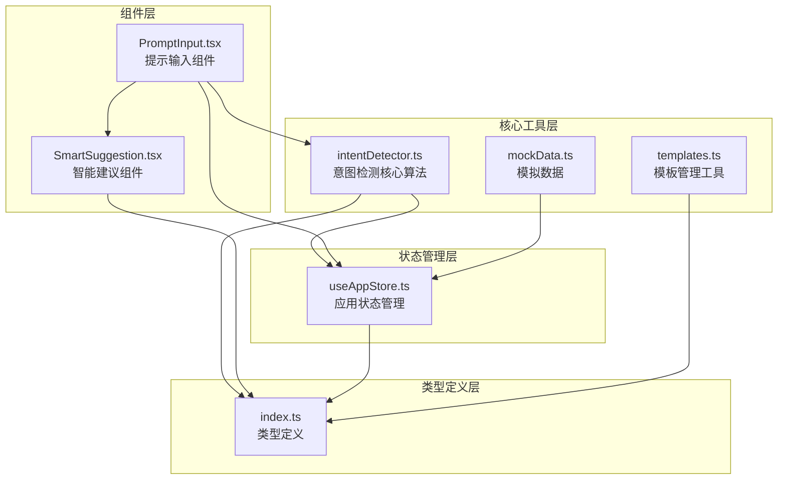
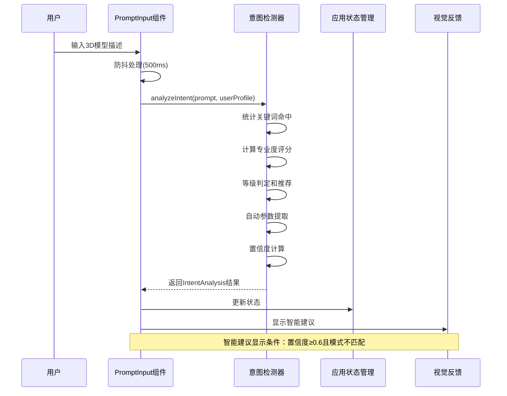
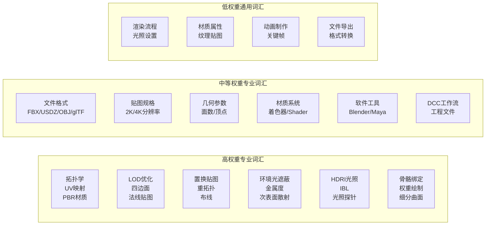
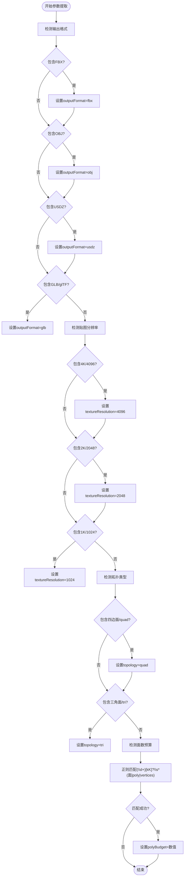
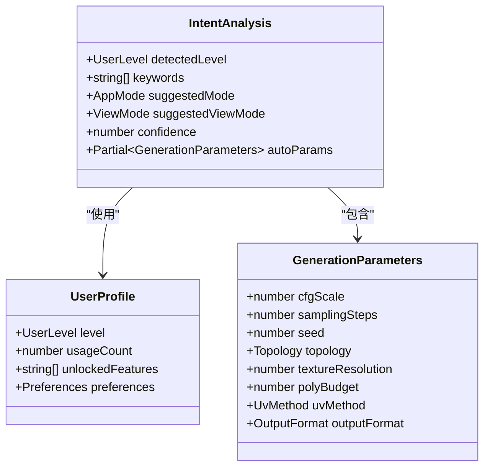
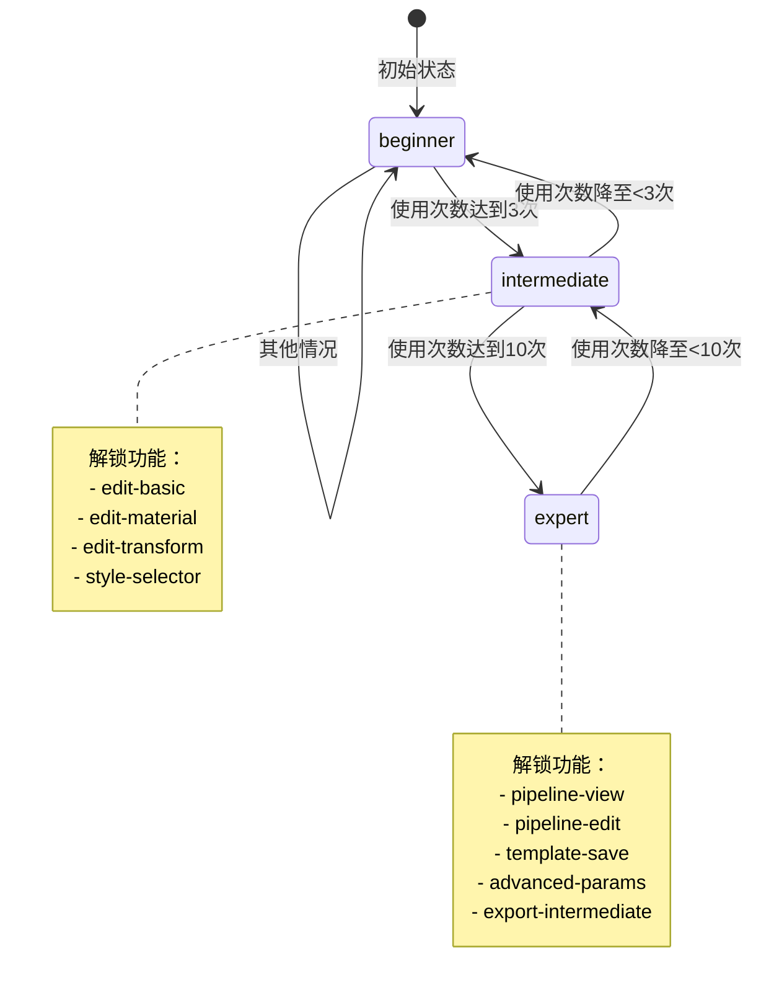
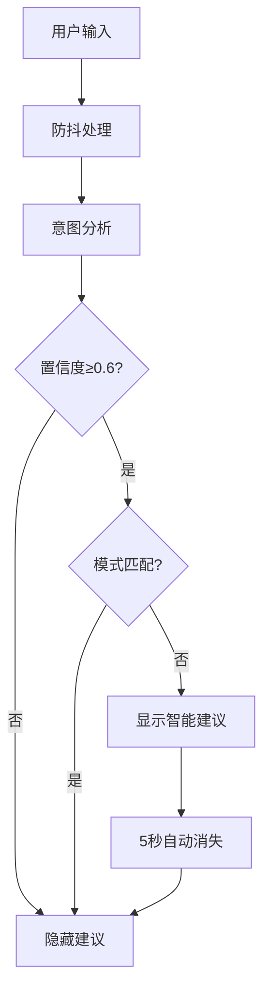
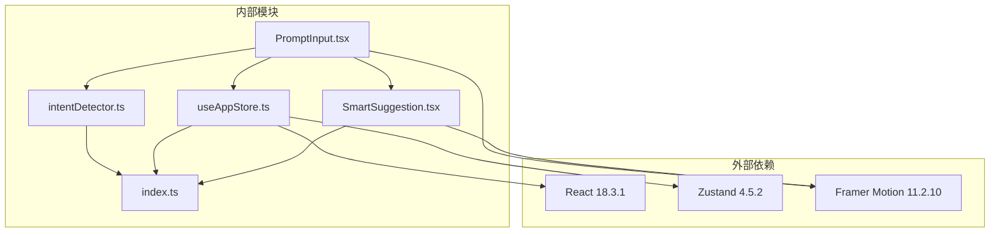

# AI意图检测系统

<cite>
**本文档引用的文件**
- [intentDetector.ts](file://src/utils/intentDetector.ts)
- [index.ts](file://src/types/index.ts)
- [useAppStore.ts](file://src/store/useAppStore.ts)
- [PromptInput.tsx](file://src/components/Explore/PromptInput.tsx)
- [SmartSuggestion.tsx](file://src/components/Shared/SmartSuggestion.tsx)
- [templates.ts](file://src/utils/templates.ts)
- [mockData.ts](file://src/utils/mockData.ts)
</cite>

## 目录
1. [简介](#简介)
2. [项目结构](#项目结构)
3. [核心组件](#核心组件)
4. [架构概览](#架构概览)
5. [详细组件分析](#详细组件分析)
6. [依赖关系分析](#依赖关系分析)
7. [性能考虑](#性能考虑)
8. [故障排除指南](#故障排除指南)
9. [结论](#结论)
10. [附录](#附录)

## 简介

AI意图检测系统是一个智能的3D模型生成平台中的核心组件，负责分析用户的自然语言提示，识别其专业程度和需求特征，并提供相应的界面推荐和参数建议。该系统通过专业的关键词库分级设计、智能的正则表达式匹配机制以及动态的用户级别集成，为用户提供个性化的创作体验。

系统的主要功能包括：
- 专业关键词库的分级识别（高、中、低权重）
- 用户专业度评分计算和等级判定
- 自动参数提取和推断
- 智能界面推荐和动态调整
- 与用户级别系统的无缝集成

## 项目结构

该项目采用React + TypeScript构建，遵循功能模块化组织原则。AI意图检测系统主要分布在以下目录结构中：



**图表来源**
- [intentDetector.ts:1-148](file://src/utils/intentDetector.ts#L1-L148)
- [index.ts:1-160](file://src/types/index.ts#L1-L160)
- [useAppStore.ts:1-368](file://src/store/useAppStore.ts#L1-L368)

**章节来源**
- [intentDetector.ts:1-148](file://src/utils/intentDetector.ts#L1-L148)
- [index.ts:1-160](file://src/types/index.ts#L1-L160)
- [useAppStore.ts:1-368](file://src/store/useAppStore.ts#L1-L368)

## 核心组件

### 专业关键词库系统

系统实现了三级专业关键词库，采用权重分级设计来准确识别用户的专业程度：

| 关键词级别 | 权重系数 | 关键词数量 | 示例 |
|------------|----------|------------|------|
| 高权重 | ×3 | 12个 | 拓扑、UV、PBR、LOD、四边面、法线贴图 |
| 中权重 | ×2 | 12个 | FBX、USDZ、OBJ、glTF、2K、4K、面数 |
| 低权重 | ×1 | 12个 | 渲染、材质、动画、导出 |
| 反向权重 | ×(-2) | 6个 | 帮我做、可爱的、酷的、好看的 |

### 意图分析核心算法

意图分析函数是整个系统的核心，它执行以下步骤：

1. **关键词统计**：对输入提示进行大小写不敏感的关键词匹配
2. **专业度评分**：基于权重系数计算综合评分
3. **用户级别加权**：结合用户历史级别提供额外加分
4. **等级判定**：根据评分阈值确定检测等级
5. **界面推荐**：为不同等级推荐合适的界面模式
6. **置信度计算**：评估分析结果的可靠性

**章节来源**
- [intentDetector.ts:77-147](file://src/utils/intentDetector.ts#L77-L147)

## 架构概览

系统采用分层架构设计，确保各组件职责清晰、耦合度低：



**图表来源**
- [PromptInput.tsx:27-50](file://src/components/Explore/PromptInput.tsx#L27-L50)
- [intentDetector.ts:77-147](file://src/utils/intentDetector.ts#L77-L147)
- [useAppStore.ts:303-305](file://src/store/useAppStore.ts#L303-L305)

## 详细组件分析

### 意图检测器核心实现

#### 专业关键词库设计

系统建立了完整的专业词汇体系，涵盖3D建模的各个专业领域：



**图表来源**
- [intentDetector.ts:4-28](file://src/utils/intentDetector.ts#L4-L28)

#### 专业度评分计算公式

系统采用加权评分机制，综合考虑关键词的专业程度和用户表达习惯：

**基础评分公式**：
```
score = Σ(高权重关键词数×3) + Σ(中权重关键词数×2) + Σ(低权重关键词数×1) - Σ(非专业表达数×2)
```

**用户级别加权**：
```
adjustedScore = score + 用户级别加成
- 专家级别：+2
- 中级级别：+1  
- 初级级别：+0
```

**等级判定逻辑**：
- 专家级：`adjustedScore ≥ 6 且 高权重关键词数 ≥ 2`
- 中级：`adjustedScore ≥ 3 且 中权重关键词数 ≥ 1`
- 初级：其他情况

#### 自动参数提取机制

系统通过正则表达式实现智能参数提取，支持多种表达方式：



**图表来源**
- [intentDetector.ts:48-75](file://src/utils/intentDetector.ts#L48-L75)

#### 置信度计算方法

系统采用多因素综合评估置信度：

**基础置信度**：
```
confidence = min(|adjustedScore| / 10, 1.0)
```

**增强因子**：
- 用户级别匹配奖励：`confidence += 0.2`（当用户当前级别与检测级别一致时）
- 关键词命中奖励：`confidence += 0.1`（当关键词命中总数 ≥ 3时）

**最终约束**：
```
confidence = clamp(confidence, 0, 1)
```

#### 意图分析返回值结构



**图表来源**
- [index.ts:118-125](file://src/types/index.ts#L118-L125)
- [index.ts:105-116](file://src/types/index.ts#L105-L116)
- [index.ts:42-51](file://src/types/index.ts#L42-L51)

**章节来源**
- [intentDetector.ts:119-147](file://src/utils/intentDetector.ts#L119-L147)
- [index.ts:118-125](file://src/types/index.ts#L118-L125)

### 用户级别系统集成

#### 动态级别提升机制

系统实现了基于使用次数的动态级别提升：



**图表来源**
- [useAppStore.ts:177-215](file://src/store/useAppStore.ts#L177-L215)

#### 级别对意图检测的影响

用户级别在意图检测中发挥重要作用：

1. **评分加权**：不同级别的用户获得不同的基础加成
2. **推荐准确性**：级别匹配时提高置信度
3. **界面适配**：根据级别推荐合适的操作界面

**章节来源**
- [intentDetector.ts:87-89](file://src/utils/intentDetector.ts#L87-L89)
- [intentDetector.ts:123-126](file://src/utils/intentDetector.ts#L123-L126)

### 智能建议系统

#### 建议触发机制

智能建议组件根据以下条件触发：



**图表来源**
- [PromptInput.tsx:27-50](file://src/components/Explore/PromptInput.tsx#L27-L50)
- [SmartSuggestion.tsx:16-25](file://src/components/Shared/SmartSuggestion.tsx#L16-L25)

#### 建议内容个性化

系统根据检测到的用户级别提供个性化的建议内容：

| 用户级别 | 建议消息 | 推荐操作 |
|----------|----------|----------|
| 专家级 | "检测到专业需求关键词，建议切换到专业模式以获得完整参数控制" | 切换到管道模式 |
| 中级 | "检测到技术参数需求，建议开启参数面板" | 开启参数面板 |
| 初级 | "建议切换视图模式以获得更好的体验" | 切换到简单模式 |

**章节来源**
- [SmartSuggestion.tsx:27-35](file://src/components/Shared/SmartSuggestion.tsx#L27-L35)

## 依赖关系分析

系统采用松耦合的设计，各组件之间的依赖关系清晰明确：



**图表来源**
- [package.json:11-22](file://package.json#L11-L22)
- [PromptInput.tsx:3](file://src/components/Explore/PromptInput.tsx#L3)
- [SmartSuggestion.tsx:4](file://src/components/Shared/SmartSuggestion.tsx#L4)

**章节来源**
- [package.json:11-35](file://package.json#L11-L35)

## 性能考虑

### 防抖优化策略

系统采用500ms防抖机制，有效避免频繁的意图分析调用：

- **输入缓冲**：减少不必要的计算开销
- **用户体验**：提供流畅的输入体验
- **资源节约**：降低CPU和内存使用

### 内存管理

- **关键词匹配**：使用一次性数组存储匹配结果
- **状态更新**：通过Zustand的状态管理避免不必要的重渲染
- **组件卸载**：及时清理定时器和事件监听器

### 扩展性设计

- **关键词库扩展**：支持动态添加新的专业词汇
- **算法优化**：可替换更复杂的NLP算法
- **缓存机制**：可添加最近分析结果的缓存

## 故障排除指南

### 常见问题及解决方案

#### 意图检测不准确

**问题症状**：检测到的用户级别与预期不符

**可能原因**：
1. 关键词库覆盖不足
2. 正则表达式匹配规则需要调整
3. 用户输入表达过于简单

**解决方法**：
1. 扩展专业关键词库
2. 优化正则表达式匹配规则
3. 提供更多示例引导用户

#### 建议不显示

**问题症状**：智能建议组件不显示

**可能原因**：
1. 置信度过低（<0.6）
2. 当前模式与建议模式相同
3. 防抖时间未到

**解决方法**：
1. 提高输入质量，增加专业词汇
2. 等待防抖完成（约500ms）
3. 手动触发分析

#### 参数提取失败

**问题症状**：自动参数提取不生效

**可能原因**：
1. 用户输入格式不符合预期
2. 正则表达式匹配失败
3. 参数冲突

**解决方法**：
1. 检查输入格式是否包含标准参数表达
2. 调整正则表达式规则
3. 手动设置参数

**章节来源**
- [PromptInput.tsx:27-50](file://src/components/Explore/PromptInput.tsx#L27-L50)
- [intentDetector.ts:48-75](file://src/utils/intentDetector.ts#L48-L75)

## 结论

AI意图检测系统通过精心设计的专业关键词库、智能的正则表达式匹配机制和动态的用户级别集成，为3D模型生成平台提供了强大的智能化能力。系统不仅能够准确识别用户的专业程度，还能提供个性化的界面推荐和参数建议，显著提升了用户体验。

系统的成功关键在于：
- **多层次的专业词汇覆盖**：从基础概念到高级技术的全面支持
- **灵活的参数提取机制**：适应多样化的用户表达方式
- **智能的级别集成**：与用户成长路径紧密结合
- **优雅的用户体验**：通过智能建议提升交互效率

未来可以进一步优化的方向包括：引入更先进的自然语言处理算法、增加机器学习模型、扩展多语言支持等。

## 附录

### 实际使用示例

#### 专家级用户示例
- 输入："创建一个PBR材质的四边面模型，使用4K贴图，LOD优化，FBX格式导出"
- 预期结果：专家级检测，建议专业模式，自动参数：outputFormat=fbx, textureResolution=4096, topology=quad

#### 中级用户示例  
- 输入："生成一个有UV映射的3D模型，面数不超过5000"
- 预期结果：中级检测，建议专业模式，自动参数：polyBudget=5000

#### 初级用户示例
- 输入："帮我做一个可爱的3D小猫"
- 预期结果：初级检测，建议简单模式

### 最佳实践指南

1. **关键词丰富性**：尽量使用专业的3D建模术语
2. **参数明确性**：明确指定所需的输出格式和质量要求
3. **渐进式复杂度**：从简单的描述开始，逐步增加技术细节
4. **反馈利用**：关注智能建议，按需调整界面模式
5. **模板复用**：保存常用的参数组合为模板