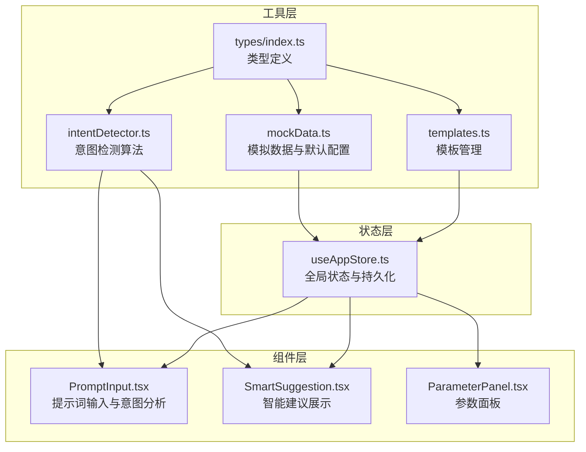
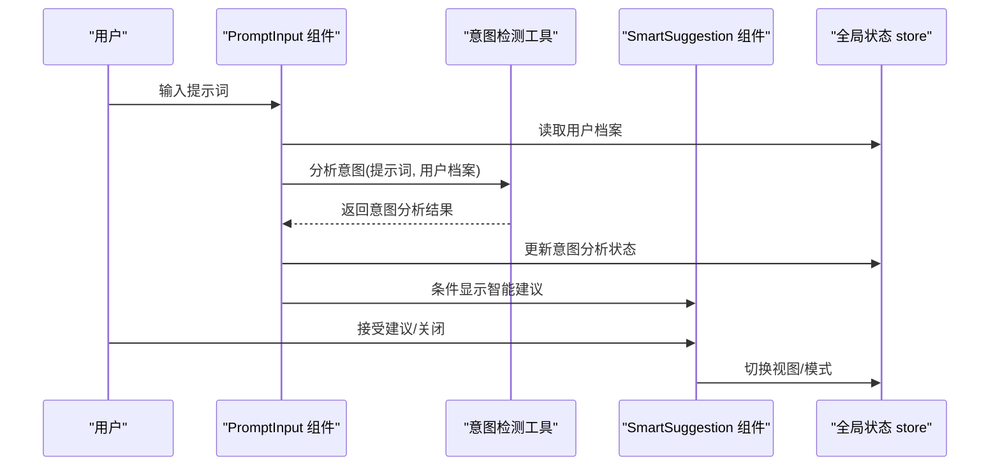
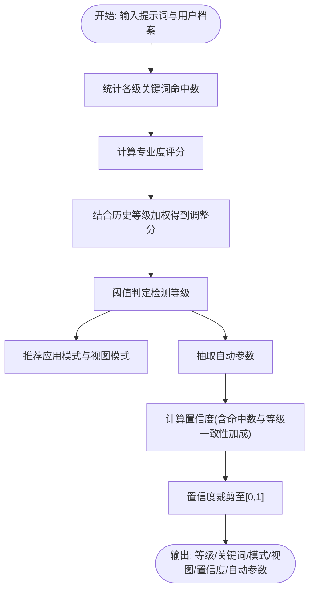
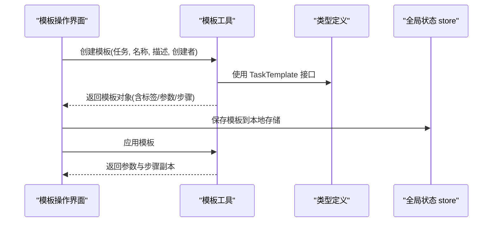
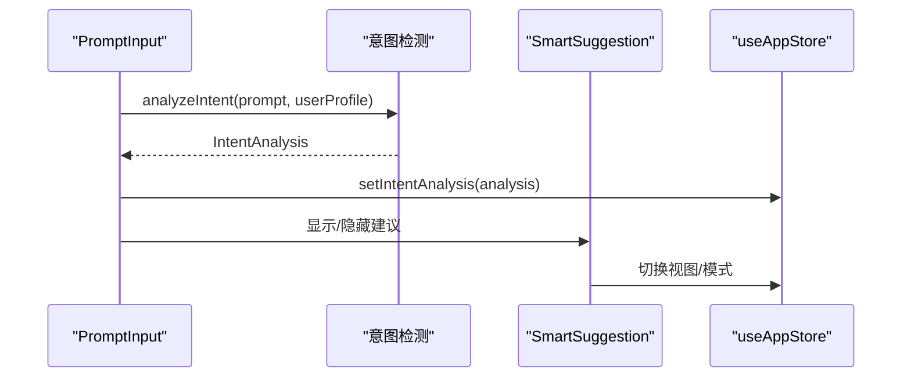
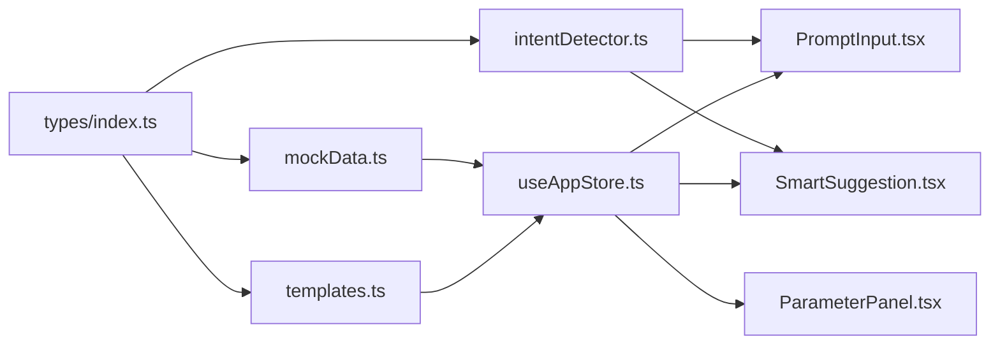

# 工具函数和辅助系统

<cite>
**本文引用的文件**
- [src/utils/intentDetector.ts](file://src/utils/intentDetector.ts)
- [src/utils/mockData.ts](file://src/utils/mockData.ts)
- [src/utils/templates.ts](file://src/utils/templates.ts)
- [src/types/index.ts](file://src/types/index.ts)
- [src/components/Explore/PromptInput.tsx](file://src/components/Explore/PromptInput.tsx)
- [src/components/Shared/SmartSuggestion.tsx](file://src/components/Shared/SmartSuggestion.tsx)
- [src/store/useAppStore.ts](file://src/store/useAppStore.ts)
- [src/components/Pipeline/ParameterPanel.tsx](file://src/components/Pipeline/ParameterPanel.tsx)
</cite>

## 目录
1. [简介](#简介)
2. [项目结构](#项目结构)
3. [核心组件](#核心组件)
4. [架构总览](#架构总览)
5. [详细组件分析](#详细组件分析)
6. [依赖关系分析](#依赖关系分析)
7. [性能考虑](#性能考虑)
8. [故障排查指南](#故障排查指南)
9. [结论](#结论)
10. [附录：API 参考与使用示例](#附录api-参考与使用示例)

## 简介
本文件系统性梳理项目中的工具函数与辅助系统，重点覆盖以下方面：
- AI 意图检测算法：关键词库、评分规则、置信度计算与模式推荐逻辑
- 模拟数据生成系统：默认参数、编辑设置、风格预设与流水线步骤模拟
- 模板管理系统：模板创建、应用、标签提取与检索过滤
- 常用工具函数：在组件与状态管理中的调用方式与最佳实践
- 数据转换与处理：参数映射、自动参数抽取、UI 展示标签生成
- 错误处理与日志记录：本地存储异常兜底、运行时告警与降级
- 性能监控与调试：防抖、进度模拟、状态持久化
- 测试策略与质量保障：可测试性设计、边界条件与覆盖率建议

## 项目结构
工具函数与辅助系统主要位于 src/utils 下，配合 src/types 定义的数据模型，在多个 UI 组件与状态管理中被广泛使用。



**图表来源**
- [src/utils/intentDetector.ts:1-148](file://src/utils/intentDetector.ts#L1-L148)
- [src/utils/mockData.ts:1-189](file://src/utils/mockData.ts#L1-L189)
- [src/utils/templates.ts:1-115](file://src/utils/templates.ts#L1-L115)
- [src/types/index.ts:1-160](file://src/types/index.ts#L1-L160)
- [src/components/Explore/PromptInput.tsx:1-161](file://src/components/Explore/PromptInput.tsx#L1-L161)
- [src/components/Shared/SmartSuggestion.tsx:1-98](file://src/components/Shared/SmartSuggestion.tsx#L1-L98)
- [src/store/useAppStore.ts:1-368](file://src/store/useAppStore.ts#L1-L368)
- [src/components/Pipeline/ParameterPanel.tsx:1-28](file://src/components/Pipeline/ParameterPanel.tsx#L1-L28)

**章节来源**
- [src/utils/intentDetector.ts:1-148](file://src/utils/intentDetector.ts#L1-L148)
- [src/utils/mockData.ts:1-189](file://src/utils/mockData.ts#L1-L189)
- [src/utils/templates.ts:1-115](file://src/utils/templates.ts#L1-L115)
- [src/types/index.ts:1-160](file://src/types/index.ts#L1-L160)
- [src/components/Explore/PromptInput.tsx:1-161](file://src/components/Explore/PromptInput.tsx#L1-L161)
- [src/components/Shared/SmartSuggestion.tsx:1-98](file://src/components/Shared/SmartSuggestion.tsx#L1-L98)
- [src/store/useAppStore.ts:1-368](file://src/store/useAppStore.ts#L1-L368)
- [src/components/Pipeline/ParameterPanel.tsx:1-28](file://src/components/Pipeline/ParameterPanel.tsx#L1-L28)

## 核心组件
- 意图检测算法：基于关键词库与正则抽取，计算专业度评分与置信度，并给出模式与视图建议，同时可提取自动参数。
- 模拟数据系统：提供默认生成参数、编辑设置、风格预设以及流水线步骤的模拟数据，支撑 UI 原型与演示。
- 模板管理系统：支持从任务创建模板、应用模板、提取标签与检索过滤，便于复用与分享工作流。
- 类型系统：统一定义任务、参数、步骤、模板等核心数据结构，确保工具函数与组件间的数据契约一致。

**章节来源**
- [src/utils/intentDetector.ts:37-147](file://src/utils/intentDetector.ts#L37-L147)
- [src/utils/mockData.ts:3-188](file://src/utils/mockData.ts#L3-L188)
- [src/utils/templates.ts:4-114](file://src/utils/templates.ts#L4-L114)
- [src/types/index.ts:13-138](file://src/types/index.ts#L13-L138)

## 架构总览
工具函数与辅助系统通过类型定义作为桥梁，连接到组件层与状态层。组件负责触发与展示，状态层负责持久化与调度，工具函数提供纯计算能力。



**图表来源**
- [src/components/Explore/PromptInput.tsx:27-76](file://src/components/Explore/PromptInput.tsx#L27-L76)
- [src/utils/intentDetector.ts:77-147](file://src/utils/intentDetector.ts#L77-L147)
- [src/components/Shared/SmartSuggestion.tsx:13-97](file://src/components/Shared/SmartSuggestion.tsx#L13-L97)
- [src/store/useAppStore.ts:303-305](file://src/store/useAppStore.ts#L303-L305)

## 详细组件分析

### AI 意图检测算法
- 关键词库分层：将专业术语按高/中/低权重分级，辅以终端用户常见表达模式，形成多维度特征向量。
- 评分与等级判定：综合加权得分与用户历史等级，采用阈值规则确定检测等级；不同等级对应不同的模式与视图建议。
- 自动参数抽取：通过正则匹配输出格式、贴图分辨率、拓扑类型与面数预算，为 UI 参数面板提供初始值。
- 置信度计算：结合得分绝对值、关键词命中数量与用户等级一致性进行归一化与裁剪，确保置信度稳定在合理区间。
- 输出结构：返回检测等级、匹配关键词、建议模式、建议视图、置信度及可选的自动参数对象。



**图表来源**
- [src/utils/intentDetector.ts:37-147](file://src/utils/intentDetector.ts#L37-L147)

**章节来源**
- [src/utils/intentDetector.ts:3-147](file://src/utils/intentDetector.ts#L3-L147)
- [src/types/index.ts:101-125](file://src/types/index.ts#L101-L125)

### 模拟数据生成系统
- 默认参数与编辑设置：提供生成流程的默认数值与材质、光照、背景等编辑参数，作为初始状态。
- 风格预设：内置多种风格标签与描述，便于快速选择与分类。
- 流水线步骤模拟：构建完整的 Agent 步骤链路，包含节点类型、位置、连接关系与状态，用于演示与交互。
- 类型标注：为 Agent 步骤类型提供标签与颜色映射，便于可视化呈现。

```mermaid
classDiagram
class GenerationParameters {
+cfgScale : number
+samplingSteps : number
+seed : number
+topology : "auto"|"quad"|"tri"
+textureResolution : number
+polyBudget : number
+uvMethod : "auto"|"smart"|"manual"
+outputFormat : "glb"|"fbx"|"obj"|"usdz"
}
class EditSettings {
+material : MaterialSettings
+rotation : {x,y,z}
+scale : number
+lighting : "studio"|"outdoor"|"dramatic"|"neutral"
+background : string
}
class MaterialSettings {
+baseColor : string
+metallic : number
+roughness : number
+emission : string
+emissionStrength : number
+normalStrength : number
}
class AgentStep {
+id : string
+name : string
+type : AgentType
+status : "pending"|"running"|"complete"|"error"
+progress : number
+inputs : Record
+outputs : Record
+position : {x,y}
+connections : string[]
}
GenerationParameters <.. EditSettings : "组合"
EditSettings <.. MaterialSettings : "组合"
```

**图表来源**
- [src/utils/mockData.ts:3-27](file://src/utils/mockData.ts#L3-L27)
- [src/types/index.ts:42-99](file://src/types/index.ts#L42-L99)

**章节来源**
- [src/utils/mockData.ts:3-188](file://src/utils/mockData.ts#L3-L188)
- [src/types/index.ts:42-99](file://src/types/index.ts#L42-L99)

### 模板管理系统
- 创建模板：从当前任务提取参数与步骤，生成可复用模板，附带标签与预览信息。
- 应用模板：将模板参数与步骤复制到新的生成任务，快速启动工作流。
- 标签提取：根据风格、输出格式、贴图分辨率与拓扑类型生成标签集合。
- 模板检索：支持按名称、描述与标签进行模糊检索，提升模板利用率。



**图表来源**
- [src/utils/templates.ts:4-33](file://src/utils/templates.ts#L4-L33)
- [src/utils/templates.ts:107-114](file://src/utils/templates.ts#L107-L114)
- [src/types/index.ts:127-138](file://src/types/index.ts#L127-L138)
- [src/store/useAppStore.ts:286-301](file://src/store/useAppStore.ts#L286-L301)

**章节来源**
- [src/utils/templates.ts:4-114](file://src/utils/templates.ts#L4-L114)
- [src/types/index.ts:127-138](file://src/types/index.ts#L127-L138)
- [src/store/useAppStore.ts:286-301](file://src/store/useAppStore.ts#L286-L301)

### 组件与状态集成
- PromptInput：对提示词变更进行防抖，调用意图检测工具生成分析结果，决定是否展示智能建议。
- SmartSuggestion：根据分析结果生成建议消息与参数标签，支持接受切换或关闭。
- useAppStore：维护用户档案、模板列表、意图分析状态与持久化逻辑；在生成流程中模拟阶段推进与状态更新。



**图表来源**
- [src/components/Explore/PromptInput.tsx:27-76](file://src/components/Explore/PromptInput.tsx#L27-L76)
- [src/components/Shared/SmartSuggestion.tsx:13-97](file://src/components/Shared/SmartSuggestion.tsx#L13-L97)
- [src/store/useAppStore.ts:303-305](file://src/store/useAppStore.ts#L303-L305)

**章节来源**
- [src/components/Explore/PromptInput.tsx:1-161](file://src/components/Explore/PromptInput.tsx#L1-L161)
- [src/components/Shared/SmartSuggestion.tsx:1-98](file://src/components/Shared/SmartSuggestion.tsx#L1-L98)
- [src/store/useAppStore.ts:100-129](file://src/store/useAppStore.ts#L100-L129)

## 依赖关系分析
- 类型依赖：工具函数与组件均依赖 types 中的接口定义，确保数据结构一致性。
- 组件依赖：PromptInput 依赖意图检测工具与状态管理；SmartSuggestion 依赖类型与状态；ParameterPanel 依赖模拟数据。
- 状态依赖：useAppStore 负责模板与用户档案的持久化，以及生成流程的状态推进。



**图表来源**
- [src/types/index.ts:1-160](file://src/types/index.ts#L1-L160)
- [src/utils/intentDetector.ts:1-148](file://src/utils/intentDetector.ts#L1-L148)
- [src/utils/mockData.ts:1-189](file://src/utils/mockData.ts#L1-L189)
- [src/utils/templates.ts:1-115](file://src/utils/templates.ts#L1-L115)
- [src/components/Explore/PromptInput.tsx:1-161](file://src/components/Explore/PromptInput.tsx#L1-L161)
- [src/components/Shared/SmartSuggestion.tsx:1-98](file://src/components/Shared/SmartSuggestion.tsx#L1-L98)
- [src/store/useAppStore.ts:1-368](file://src/store/useAppStore.ts#L1-L368)
- [src/components/Pipeline/ParameterPanel.tsx:1-28](file://src/components/Pipeline/ParameterPanel.tsx#L1-L28)

**章节来源**
- [src/types/index.ts:1-160](file://src/types/index.ts#L1-L160)
- [src/utils/intentDetector.ts:1-148](file://src/utils/intentDetector.ts#L1-L148)
- [src/utils/mockData.ts:1-189](file://src/utils/mockData.ts#L1-L189)
- [src/utils/templates.ts:1-115](file://src/utils/templates.ts#L1-L115)
- [src/components/Explore/PromptInput.tsx:1-161](file://src/components/Explore/PromptInput.tsx#L1-L161)
- [src/components/Shared/SmartSuggestion.tsx:1-98](file://src/components/Shared/SmartSuggestion.tsx#L1-L98)
- [src/store/useAppStore.ts:1-368](file://src/store/useAppStore.ts#L1-L368)
- [src/components/Pipeline/ParameterPanel.tsx:1-28](file://src/components/Pipeline/ParameterPanel.tsx#L1-L28)

## 性能考虑
- 防抖优化：PromptInput 对提示词变更进行 500ms 防抖，降低频繁分析带来的计算压力。
- 状态持久化：用户档案与模板列表通过本地存储持久化，减少重复加载成本。
- 进度模拟：生成流程采用定时器分阶段推进，避免真实网络请求与复杂计算。
- 参数面板：滑块组件动态计算百分比样式，仅在必要时重绘，保持 UI 流畅。

**章节来源**
- [src/components/Explore/PromptInput.tsx:27-50](file://src/components/Explore/PromptInput.tsx#L27-L50)
- [src/store/useAppStore.ts:313-325](file://src/store/useAppStore.ts#L313-L325)
- [src/store/useAppStore.ts:327-367](file://src/store/useAppStore.ts#L327-L367)
- [src/components/Pipeline/ParameterPanel.tsx:6-27](file://src/components/Pipeline/ParameterPanel.tsx#L6-L27)

## 故障排查指南
- 本地存储异常：用户档案与模板的序列化/反序列化在异常情况下会静默失败，需检查浏览器存储配额与数据格式。
- 意图分析不准确：若关键词命中不足或正则匹配不生效，可调整关键词库与正则表达式；提高置信度阈值以减少误判。
- 建议未显示：确认防抖时间、置信度阈值与当前视图状态；检查 setIntentAnalysis 是否正确更新。
- 模板应用无效：核对模板参数与步骤是否为空；确保模板 ID 与任务参数兼容。

**章节来源**
- [src/store/useAppStore.ts:34-48](file://src/store/useAppStore.ts#L34-L48)
- [src/store/useAppStore.ts:313-325](file://src/store/useAppStore.ts#L313-L325)
- [src/components/Explore/PromptInput.tsx:27-50](file://src/components/Explore/PromptInput.tsx#L27-L50)
- [src/utils/templates.ts:24-33](file://src/utils/templates.ts#L24-L33)

## 结论
该工具函数与辅助系统以类型安全为核心，围绕意图检测、模拟数据与模板管理三大支柱构建，有效支撑了从提示词理解到工作流复用的全流程体验。通过合理的防抖、持久化与状态推进策略，系统在保证交互流畅的同时，具备良好的可扩展性与可维护性。

## 附录：API 参考与使用示例

### 意图检测 API
- 函数：analyzeIntent(prompt: string, userProfile: UserProfile): IntentAnalysis
  - 功能：分析提示词与用户档案，返回检测等级、关键词、建议模式、建议视图、置信度与可选自动参数。
  - 典型调用：在 PromptInput 的防抖回调中调用，更新全局意图分析状态。
  - 参考路径：[src/utils/intentDetector.ts:77-147](file://src/utils/intentDetector.ts#L77-L147)，[src/components/Explore/PromptInput.tsx:37-38](file://src/components/Explore/PromptInput.tsx#L37-L38)

- 函数：extractAutoParams(prompt: string): Partial<GenerationParameters>
  - 功能：从提示词中抽取输出格式、贴图分辨率、拓扑类型与面数预算。
  - 典型调用：由 analyzeIntent 内部调用，作为自动参数建议返回。
  - 参考路径：[src/utils/intentDetector.ts:48-75](file://src/utils/intentDetector.ts#L48-L75)

- 关键词常量
  - PROFESSIONAL_KEYWORDS_HIGH/MEDIUM/LOW：专业关键词库（高/中/低权重）
  - CASUAL_PATTERNS：终端用户典型表达
  - 参考路径：[src/utils/intentDetector.ts:3-35](file://src/utils/intentDetector.ts#L3-L35)

### 模拟数据 API
- 默认参数与编辑设置
  - defaultParameters：生成参数默认值
  - defaultEditSettings：编辑设置默认值
  - 参考路径：[src/utils/mockData.ts:3-27](file://src/utils/mockData.ts#L3-L27)

- 风格预设
  - stylePresets：风格预设数组，包含 id、名称、缩略图、描述与标签
  - 参考路径：[src/utils/mockData.ts:29-72](file://src/utils/mockData.ts#L29-L72)

- 流水线步骤模拟
  - createMockAgentSteps：生成 Agent 步骤链路
  - agentTypeLabels：步骤类型标签与颜色映射
  - 参考路径：[src/utils/mockData.ts:74-188](file://src/utils/mockData.ts#L74-L188)

### 模板管理 API
- 创建模板
  - createTemplateFromTask(task, name, description, creator): TaskTemplate
  - 参考路径：[src/utils/templates.ts:4-22](file://src/utils/templates.ts#L4-L22)

- 应用模板
  - applyTemplate(template): { parameters, agentSteps? }
  - 参考路径：[src/utils/templates.ts:24-33](file://src/utils/templates.ts#L24-L33)

- 标签提取与检索
  - extractTags(task): string[]
  - filterTemplates(templates, query): TaskTemplate[]
  - 参考路径：[src/utils/templates.ts:35-43](file://src/utils/templates.ts#L35-L43)，[src/utils/templates.ts:107-114](file://src/utils/templates.ts#L107-L114)

- 默认模板
  - DEFAULT_TEMPLATES：内置默认模板集合
  - 参考路径：[src/utils/templates.ts:45-104](file://src/utils/templates.ts#L45-L104)

### 类型定义概览
- GenerationParameters：生成参数
- EditSettings/MaterialSettings：编辑与材质设置
- AgentStep/AgentType：流水线步骤与类型
- TaskTemplate：模板结构
- IntentAnalysis/UserProfile：意图分析与用户档案
- 参考路径：[src/types/index.ts:42-138](file://src/types/index.ts#L42-L138)

### 使用示例（路径指引）
- 在组件中调用意图检测
  - PromptInput 防抖分析与建议展示
  - 参考路径：[src/components/Explore/PromptInput.tsx:27-76](file://src/components/Explore/PromptInput.tsx#L27-L76)，[src/components/Shared/SmartSuggestion.tsx:13-97](file://src/components/Shared/SmartSuggestion.tsx#L13-L97)

- 在状态管理中持久化
  - 用户档案与模板列表的本地存储
  - 参考路径：[src/store/useAppStore.ts:34-48](file://src/store/useAppStore.ts#L34-L48)，[src/store/useAppStore.ts:313-325](file://src/store/useAppStore.ts#L313-L325)

- 在参数面板中应用模板
  - 复制模板参数与步骤
  - 参考路径：[src/utils/templates.ts:24-33](file://src/utils/templates.ts#L24-L33)，[src/components/Pipeline/ParameterPanel.tsx:1-28](file://src/components/Pipeline/ParameterPanel.tsx#L1-L28)