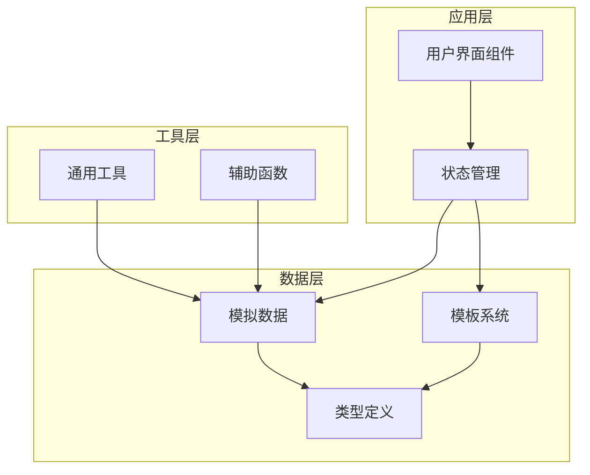
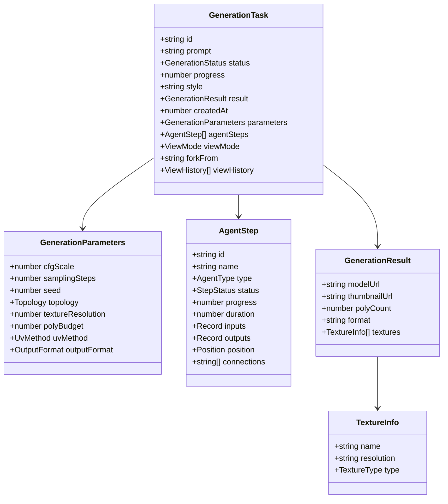
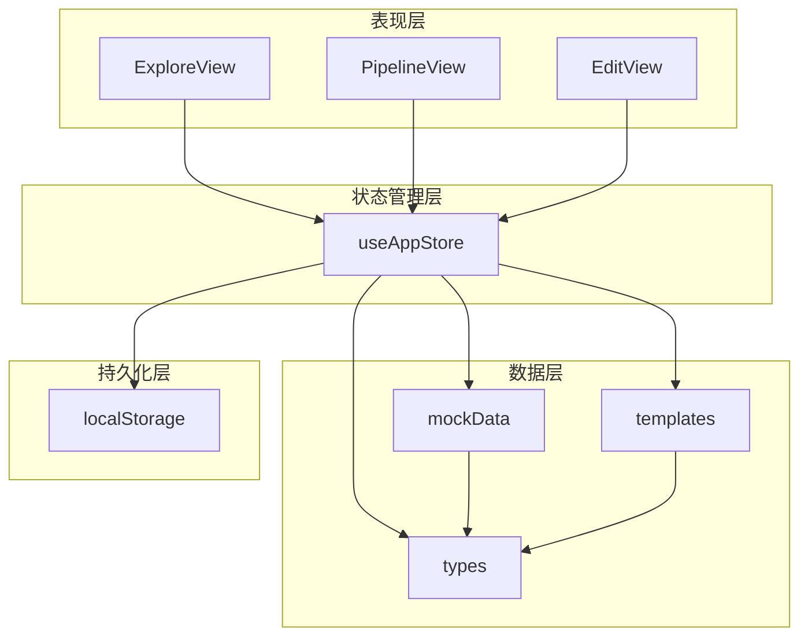
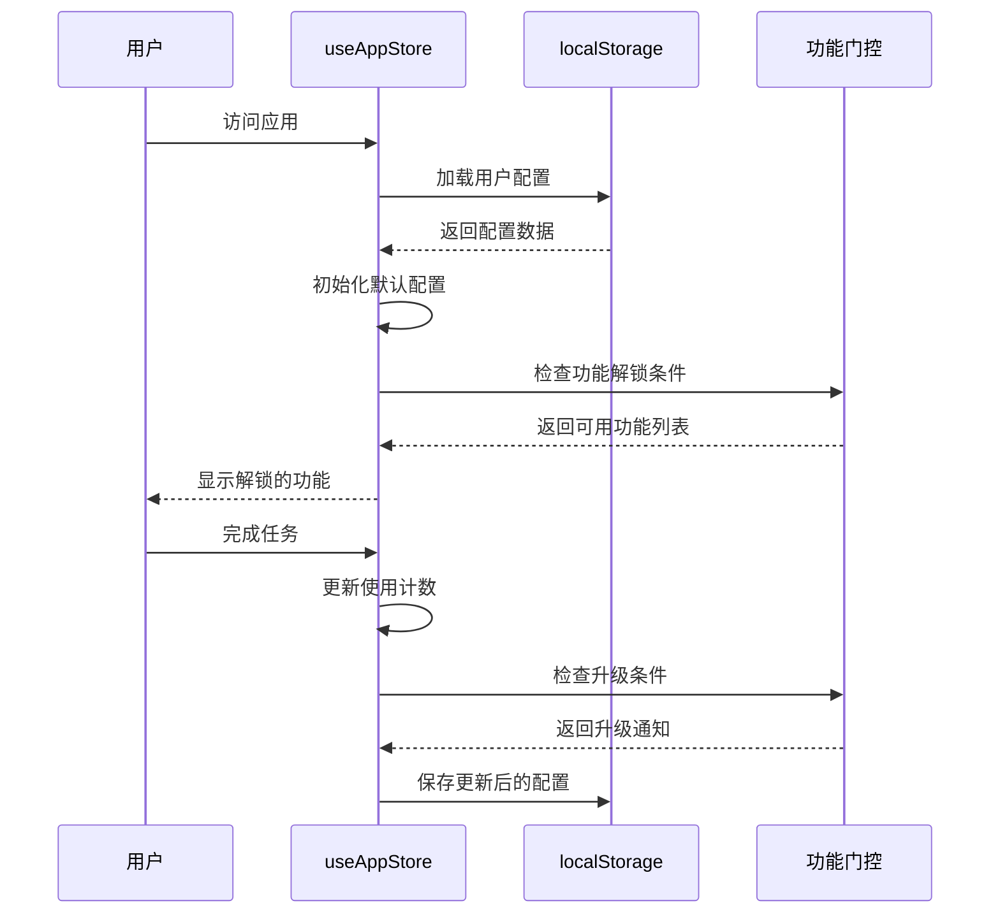
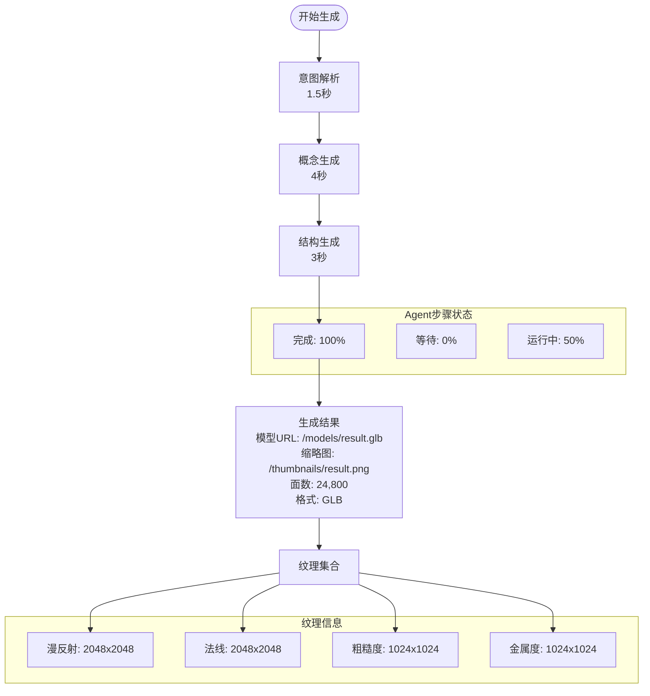
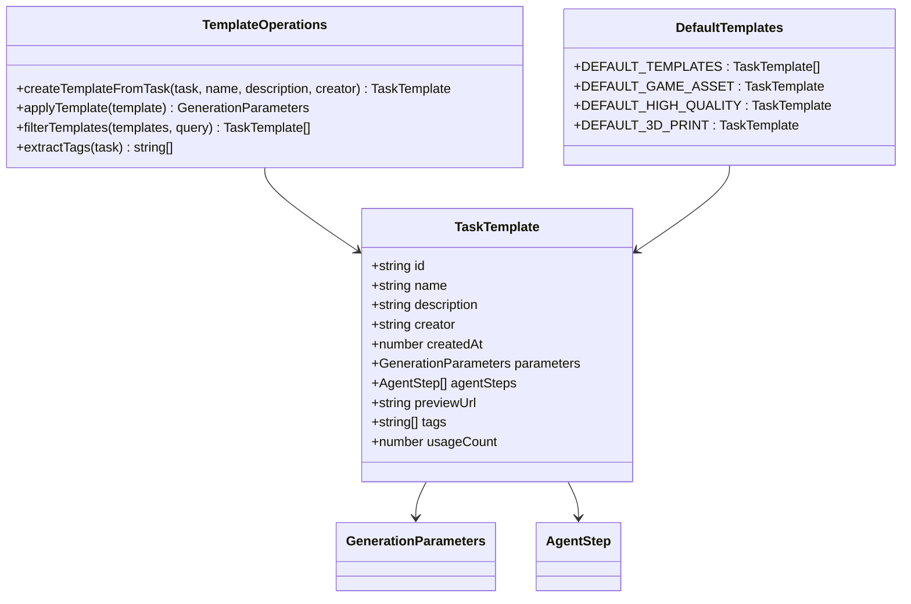
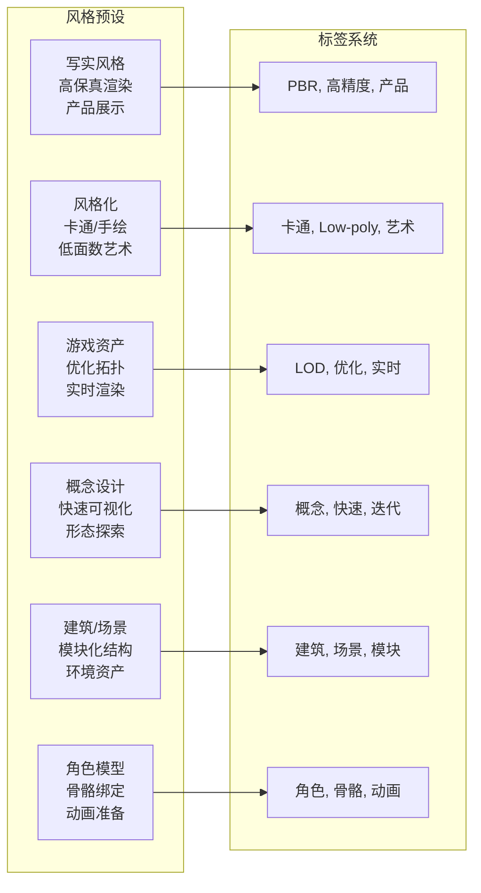

# 模拟数据生成系统

<cite>
**本文档引用的文件**
- [mockData.ts](file://src/utils/mockData.ts)
- [index.ts](file://src/types/index.ts)
- [useAppStore.ts](file://src/store/useAppStore.ts)
- [templates.ts](file://src/utils/templates.ts)
- [ExploreView.tsx](file://src/components/Explore/ExploreView.tsx)
- [PipelineView.tsx](file://src/components/Pipeline/PipelineView.tsx)
- [EditView.tsx](file://src/components/Edit/EditView.tsx)
- [package.json](file://package.json)
</cite>

## 目录
1. [简介](#简介)
2. [项目结构](#项目结构)
3. [核心组件](#核心组件)
4. [架构概览](#架构概览)
5. [详细组件分析](#详细组件分析)
6. [依赖关系分析](#依赖关系分析)
7. [性能考虑](#性能考虑)
8. [故障排除指南](#故障排除指南)
9. [结论](#结论)
10. [附录](#附录)

## 简介

本项目是一个基于React和Three.js的3D模型生成代理系统，专注于模拟数据生成策略和数据结构设计。该系统通过精心设计的模拟数据来支持开发和测试流程，涵盖用户配置、生成任务、3D模型数据等多个维度。

模拟数据生成系统的核心目标是：
- 提供一致且可预测的测试数据
- 支持不同用户级别的功能解锁
- 实现生成流程的状态管理和进度跟踪
- 支持模板化的参数配置和复用
- 确保数据生成过程的随机性和一致性平衡

## 项目结构

该项目采用模块化架构，主要分为以下几个核心模块：



**图表来源**
- [useAppStore.ts:100-122](file://src/store/useAppStore.ts#L100-L122)
- [mockData.ts:1-189](file://src/utils/mockData.ts#L1-L189)
- [templates.ts:1-115](file://src/utils/templates.ts#L1-L115)

**章节来源**
- [package.json:1-35](file://package.json#L1-L35)
- [useAppStore.ts:100-122](file://src/store/useAppStore.ts#L100-L122)

## 核心组件

### 数据类型系统

系统定义了完整的类型层次结构，确保数据的一致性和类型安全：



**图表来源**
- [index.ts:13-40](file://src/types/index.ts#L13-L40)
- [index.ts:42-51](file://src/types/index.ts#L42-L51)
- [index.ts:53-64](file://src/types/index.ts#L53-L64)
- [index.ts:28-40](file://src/types/index.ts#L28-L40)
- [index.ts:36-40](file://src/types/index.ts#L36-L40)

### 模拟数据生成器

系统提供了多种类型的模拟数据生成器，每种都有特定的应用场景：

| 生成器类型 | 用途 | 关键特性 | 应用场景 |
|------------|------|----------|----------|
| 默认参数生成器 | 基础配置模板 | 固定数值、标准化设置 | 新用户入门、默认配置 |
| 编辑设置生成器 | 材质和渲染配置 | 物理材质属性、光照设置 | 模型编辑和预览 |
| 风格预设生成器 | 不同艺术风格 | 标签系统、视觉标识 | 风格选择和分类 |
| Agent步骤生成器 | 生成流程节点 | 状态管理、连接关系 | 流水线可视化 |

**章节来源**
- [mockData.ts:3-27](file://src/utils/mockData.ts#L3-L27)
- [mockData.ts:29-72](file://src/utils/mockData.ts#L29-L72)
- [mockData.ts:74-188](file://src/utils/mockData.ts#L74-L188)

## 架构概览

系统采用分层架构设计，确保关注点分离和模块化：



**图表来源**
- [ExploreView.tsx:11-263](file://src/components/Explore/ExploreView.tsx#L11-L263)
- [PipelineView.tsx:9-168](file://src/components/Pipeline/PipelineView.tsx#L9-L168)
- [EditView.tsx:9-159](file://src/components/Edit/EditView.tsx#L9-L159)
- [useAppStore.ts:100-368](file://src/store/useAppStore.ts#L100-L368)

## 详细组件分析

### 用户配置管理系统

用户配置系统通过localStorage实现持久化存储，支持用户级别的动态解锁：



**图表来源**
- [useAppStore.ts:34-48](file://src/store/useAppStore.ts#L34-L48)
- [useAppStore.ts:177-215](file://src/store/useAppStore.ts#L177-L215)
- [useAppStore.ts:314-325](file://src/store/useAppStore.ts#L314-L325)

#### 用户级别和功能解锁机制

系统实现了渐进式功能解锁机制：

| 用户级别 | 使用次数阈值 | 解锁功能 | 特殊权限 |
|----------|-------------|----------|----------|
| 初学者 | 0-2 | 探索基础功能 | 无 |
| 中级用户 | 3-9 | 材质编辑、变换控制、风格选择 | 专业模式访问 |
| 专家用户 | 10+ | 流水线视图、模板保存、高级参数 | 导出中间结果 |

**章节来源**
- [useAppStore.ts:177-215](file://src/store/useAppStore.ts#L177-L215)
- [index.ts:101-116](file://src/types/index.ts#L101-L116)

### 生成任务管理系统

生成任务系统模拟了完整的3D模型生成流程，包含多个处理阶段：



**图表来源**
- [useAppStore.ts:327-367](file://src/store/useAppStore.ts#L327-L367)
- [useAppStore.ts:131-158](file://src/store/useAppStore.ts#L131-L158)

#### 生成流程的随机性与一致性保证

系统通过以下机制平衡随机性和一致性：

1. **种子管理**: 使用固定种子值确保可重复的结果
2. **时间戳生成**: 使用当前时间戳创建唯一任务ID
3. **进度映射**: 预定义的进度百分比确保一致的用户体验
4. **状态机**: 明确的状态转换规则防止竞态条件

**章节来源**
- [useAppStore.ts:107-122](file://src/store/useAppStore.ts#L107-L122)
- [useAppStore.ts:327-367](file://src/store/useAppStore.ts#L327-L367)

### 模板系统

模板系统支持参数化的工作流复用和定制：



**图表来源**
- [templates.ts:127-138](file://src/utils/templates.ts#L127-L138)
- [templates.ts:46-104](file://src/utils/templates.ts#L46-L104)

#### 预置模板设计

系统提供了三种预置模板以满足不同应用场景：

| 模板名称 | 应用场景 | 技术规格 | 性能特征 |
|----------|----------|----------|----------|
| 游戏资产 | 移动端游戏 | 低面数、三角拓扑 | 快速加载、低内存占用 |
| 影视级品质 | CG制作 | 高精度、四边形拓扑 | 高质量渲染、大纹理 |
| 3D打印优化 | 实体制造 | 密封水密网格 | 几何完整性、制造兼容 |

**章节来源**
- [templates.ts:46-104](file://src/utils/templates.ts#L46-L104)

### 风格预设系统

风格预设系统提供了多样化的艺术风格选择：



**图表来源**
- [mockData.ts:29-72](file://src/utils/mockData.ts#L29-L72)

**章节来源**
- [mockData.ts:29-72](file://src/utils/mockData.ts#L29-L72)

## 依赖关系分析

系统依赖关系清晰，遵循单一职责原则：

```mermaid
graph TB
subgraph "外部依赖"
React[React 18.3.1]
Zustand[Zustand 4.5.2]
Three[Three.js 0.164.1]
Fiber[@react-three/fiber 8.16.8]
Motion[Framer Motion 11.2.10]
end
subgraph "内部模块"
Types[类型定义]
Mock[模拟数据]
Store[状态管理]
UI[用户界面]
Utils[工具函数]
end
UI --> Store
Store --> Mock
Store --> Types
UI --> Types
Mock --> Types
Utils --> Mock
Utils --> Types
Store --> Zustand
UI --> React
UI --> Motion
UI --> Fiber
UI --> Three
```

**图表来源**
- [package.json:11-22](file://package.json#L11-L22)
- [useAppStore.ts:15](file://src/store/useAppStore.ts#L15)

**章节来源**
- [package.json:11-22](file://package.json#L11-L22)

## 性能考虑

### 内存优化策略

1. **惰性加载**: 仅在需要时创建和渲染组件
2. **状态压缩**: 使用最小必要的状态字段
3. **缓存机制**: localStorage持久化减少重复计算
4. **虚拟化**: 大列表使用虚拟滚动优化

### 渲染性能优化

1. **批量更新**: 使用Zustand的批量状态更新
2. **条件渲染**: 基于视图模式的条件组件渲染
3. **动画优化**: Framer Motion的硬件加速动画
4. **资源管理**: Three.js的资源池化和垃圾回收

### 数据生成性能

1. **异步处理**: 使用setTimeout模拟异步生成过程
2. **进度分段**: 将长任务分解为多个短阶段
3. **状态同步**: 确保UI状态与后台处理同步
4. **错误恢复**: 异常情况下的状态回滚机制

## 故障排除指南

### 常见问题及解决方案

| 问题类型 | 症状 | 可能原因 | 解决方案 |
|----------|------|----------|----------|
| 状态不一致 | UI显示与实际状态不符 | 状态更新竞态 | 检查状态更新顺序 |
| 数据丢失 | 刷新后配置重置 | localStorage异常 | 清除浏览器缓存 |
| 性能问题 | 页面卡顿 | 组件过多渲染 | 实施虚拟化和懒加载 |
| 功能不可用 | 专家功能无法访问 | 使用计数不足 | 完成更多任务解锁 |

### 调试技巧

1. **状态监控**: 使用浏览器开发者工具检查Zustand状态
2. **网络调试**: 监控模拟API调用和响应
3. **性能分析**: 使用React DevTools Profiler
4. **本地存储检查**: 验证localStorage数据完整性

**章节来源**
- [useAppStore.ts:314-325](file://src/store/useAppStore.ts#L314-L325)

## 结论

本模拟数据生成系统通过精心设计的数据结构和生成策略，成功实现了：

1. **完整的数据生命周期管理**：从用户配置到生成结果的全流程覆盖
2. **灵活的扩展机制**：支持自定义参数、模板和风格预设
3. **可靠的性能保障**：通过异步处理和状态管理确保流畅体验
4. **良好的可维护性**：模块化设计和清晰的类型系统

系统特别适用于3D模型生成领域的开发和测试场景，为后续集成真实AI生成服务奠定了坚实基础。

## 附录

### 最佳实践建议

1. **数据一致性**: 始终使用类型定义确保数据结构正确
2. **状态管理**: 合理划分状态粒度，避免过度订阅
3. **性能监控**: 定期检查组件渲染性能和内存使用
4. **错误处理**: 实现完善的异常捕获和用户反馈机制

### 扩展指南

1. **添加新的生成参数**: 在GenerationParameters中添加字段
2. **自定义Agent步骤**: 扩展AgentType枚举和步骤逻辑
3. **新增风格预设**: 添加新的StylePreset配置
4. **模板定制**: 创建领域特定的TaskTemplate模板