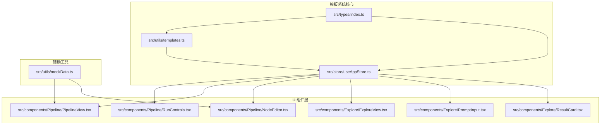
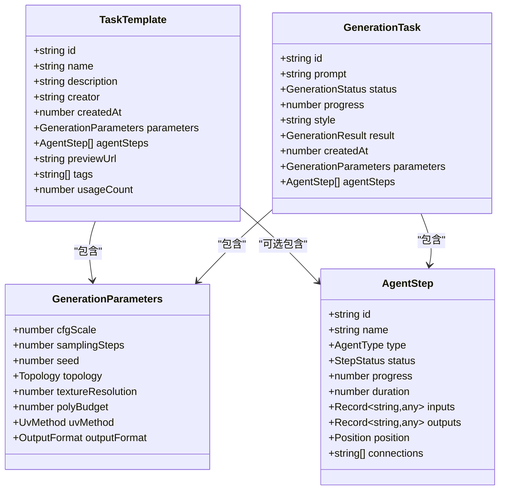
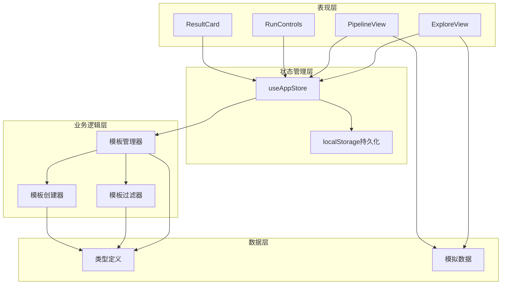
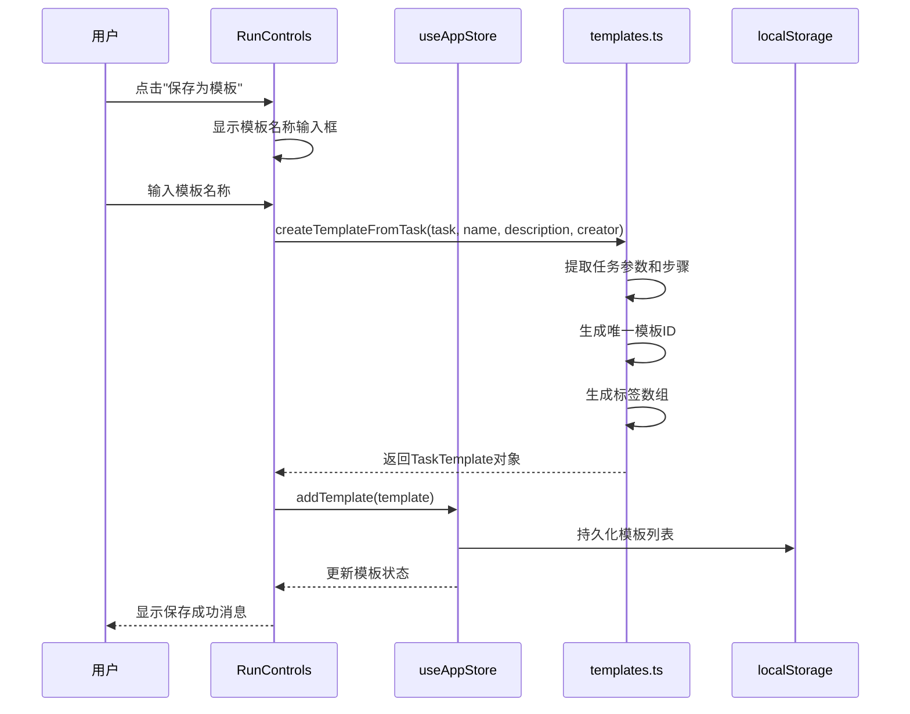
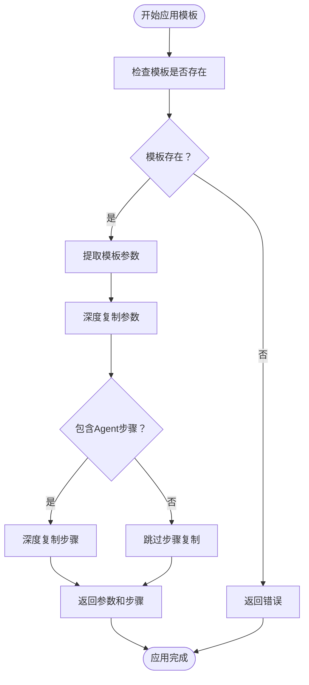
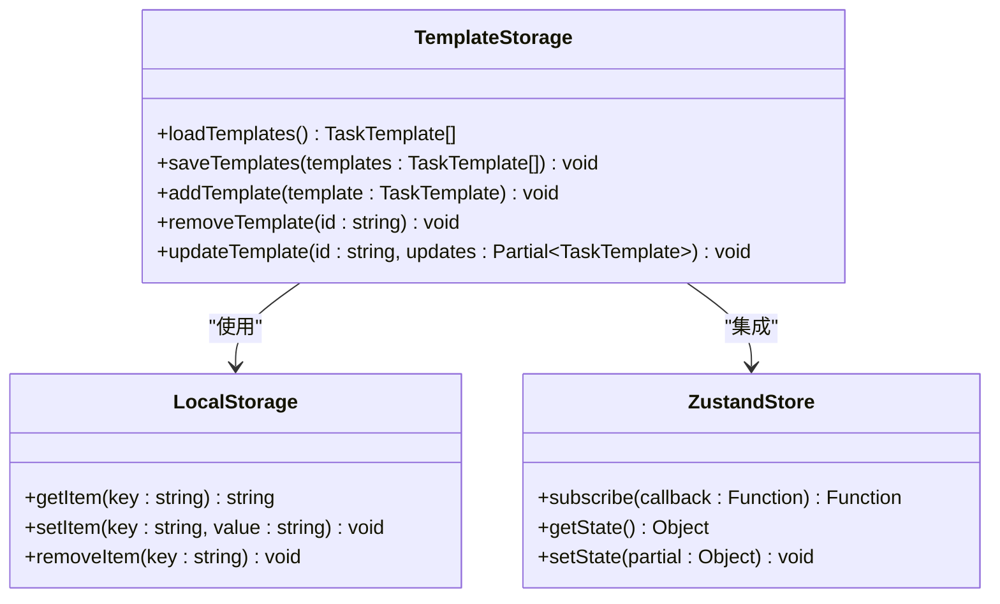
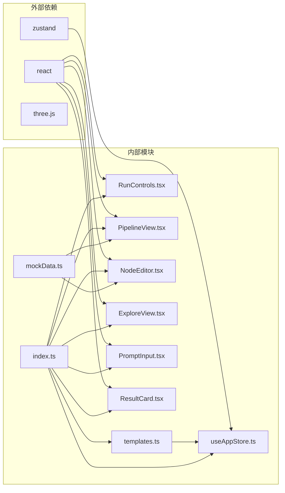

# 模板管理系统

<cite>
**本文档引用的文件**
- [templates.ts](file://src/utils/templates.ts)
- [index.ts](file://src/types/index.ts)
- [useAppStore.ts](file://src/store/useAppStore.ts)
- [RunControls.tsx](file://src/components/Pipeline/RunControls.tsx)
- [PipelineView.tsx](file://src/components/Pipeline/PipelineView.tsx)
- [NodeEditor.tsx](file://src/components/Pipeline/NodeEditor.tsx)
- [ExploreView.tsx](file://src/components/Explore/ExploreView.tsx)
- [PromptInput.tsx](file://src/components/Explore/PromptInput.tsx)
- [mockData.ts](file://src/utils/mockData.ts)
- [ResultCard.tsx](file://src/components/Explore/ResultCard.tsx)
</cite>

## 目录
1. [简介](#简介)
2. [项目结构](#项目结构)
3. [核心组件](#核心组件)
4. [架构概览](#架构概览)
5. [详细组件分析](#详细组件分析)
6. [依赖关系分析](#依赖关系分析)
7. [性能考虑](#性能考虑)
8. [故障排除指南](#故障排除指南)
9. [结论](#结论)

## 简介

模板管理系统是3D模型代理应用中的核心功能模块，负责管理用户创建和使用的生成模板。该系统支持模板的创建、存储、检索、管理和版本控制，为用户提供了一套完整的AI生成工作流模板解决方案。

系统采用React + TypeScript构建，使用Zustand进行状态管理，通过localStorage实现本地持久化存储。模板系统集成了AI生成流程，支持从任务创建模板、应用模板参数以及模板的生命周期管理。

## 项目结构

模板管理系统主要分布在以下目录结构中：

**图表来源**
- [templates.ts:1-115](file://src/utils/templates.ts#L1-L115)
- [useAppStore.ts:1-368](file://src/store/useAppStore.ts#L1-L368)

**章节来源**
- [templates.ts:1-115](file://src/utils/templates.ts#L1-L115)
- [useAppStore.ts:1-368](file://src/store/useAppStore.ts#L1-L368)

## 核心组件

### 数据类型定义

模板系统的核心数据结构包括以下关键类型：

**图表来源**
- [index.ts:127-138](file://src/types/index.ts#L127-L138)
- [index.ts:42-51](file://src/types/index.ts#L42-L51)
- [index.ts:13-26](file://src/types/index.ts#L13-L26)
- [index.ts:53-64](file://src/types/index.ts#L53-L64)

### 模板管理器

模板管理器提供了完整的模板生命周期管理功能：

**章节来源**
- [templates.ts:1-115](file://src/utils/templates.ts#L1-L115)

## 架构概览

模板管理系统采用分层架构设计，确保了良好的模块分离和可维护性：

**图表来源**
- [useAppStore.ts:100-311](file://src/store/useAppStore.ts#L100-L311)
- [templates.ts:1-115](file://src/utils/templates.ts#L1-L115)

## 详细组件分析

### 模板创建机制

模板创建过程支持从现有任务直接创建模板，确保用户能够快速保存和复用生成配置：

**图表来源**
- [RunControls.tsx:67-74](file://src/components/Pipeline/RunControls.tsx#L67-L74)
- [templates.ts:4-22](file://src/utils/templates.ts#L4-L22)
- [useAppStore.ts:289-291](file://src/store/useAppStore.ts#L289-L291)

### 模板应用机制

模板应用过程实现了参数的深度复制，确保模板使用时不会影响原始模板：

**图表来源**
- [templates.ts:25-33](file://src/utils/templates.ts#L25-L33)

**章节来源**
- [templates.ts:25-33](file://src/utils/templates.ts#L25-L33)

### 模板存储机制

模板存储采用localStorage实现，支持模板的本地持久化：

**图表来源**
- [useAppStore.ts:42-48](file://src/store/useAppStore.ts#L42-L48)
- [useAppStore.ts:314-325](file://src/store/useAppStore.ts#L314-L325)

**章节来源**
- [useAppStore.ts:17-48](file://src/store/useAppStore.ts#L17-L48)
- [useAppStore.ts:286-301](file://src/store/useAppStore.ts#L286-L301)

### 模板搜索和过滤

模板搜索功能支持按名称、描述和标签进行多维度搜索：

**章节来源**
- [templates.ts:107-114](file://src/utils/templates.ts#L107-L114)

## 依赖关系分析

模板系统各组件之间的依赖关系如下：

**图表来源**
- [package.json:11-22](file://package.json#L11-L22)
- [templates.ts](file://src/utils/templates.ts#L1)
- [useAppStore.ts:1-15](file://src/store/useAppStore.ts#L1-L15)

**章节来源**
- [package.json:1-35](file://package.json#L1-L35)

## 性能考虑

### 内存优化策略

1. **模板深度复制**: 使用浅拷贝避免不必要的内存分配
2. **状态订阅优化**: 仅在模板列表变化时触发localStorage更新
3. **组件渲染优化**: 使用React.memo减少不必要的重渲染

### 存储性能优化

1. **批量操作**: 模板添加、删除、更新采用批量处理
2. **延迟序列化**: 使用订阅机制延迟localStorage写入
3. **数据压缩**: 模板数据采用JSON序列化存储

### 搜索性能优化

1. **预处理标签**: 模板创建时预先生成标签数组
2. **大小写缓存**: 查询字符串转换为小写后缓存
3. **索引优化**: 按标签进行快速过滤

## 故障排除指南

### 常见问题及解决方案

**模板无法保存**
- 检查localStorage是否可用
- 验证模板名称是否为空
- 确认用户权限级别是否支持模板保存

**模板加载失败**
- 检查localStorage数据格式
- 验证模板ID格式
- 确认模板数据完整性

**模板应用异常**
- 检查模板参数完整性
- 验证Agent步骤连接关系
- 确认模板版本兼容性

**章节来源**
- [useAppStore.ts:314-325](file://src/store/useAppStore.ts#L314-L325)
- [templates.ts:4-22](file://src/utils/templates.ts#L4-L22)

## 结论

模板管理系统为3D模型代理应用提供了完整的模板生命周期管理解决方案。系统采用模块化设计，支持模板的创建、存储、检索、应用和版本管理。

### 主要优势

1. **完整的生命周期管理**: 从创建到应用的全流程支持
2. **灵活的参数系统**: 支持复杂的生成参数配置
3. **智能标签系统**: 基于任务特征的自动标签生成
4. **用户友好界面**: 与AI生成流程无缝集成
5. **高性能实现**: 优化的存储和搜索机制

### 技术特色

1. **类型安全**: 全面的TypeScript类型定义
2. **状态管理**: 基于Zustand的状态管理方案
3. **本地存储**: localStorage持久化方案
4. **响应式设计**: 与AI生成流程的深度集成
5. **可扩展性**: 模块化的架构设计

该模板系统为用户提供了高效、可靠的3D模型生成工作流管理能力，是整个3D模型代理应用的重要组成部分。