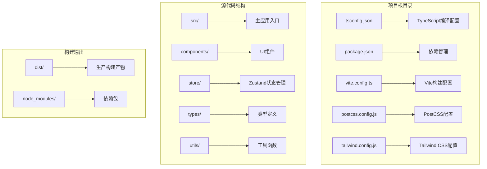
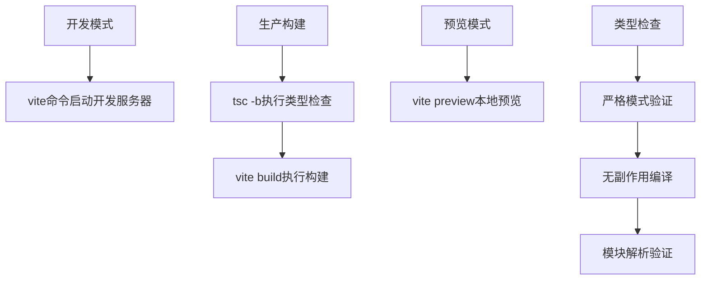
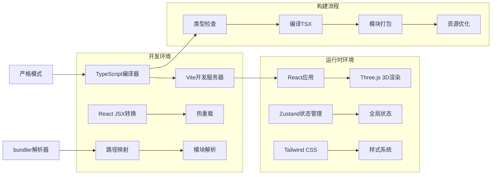
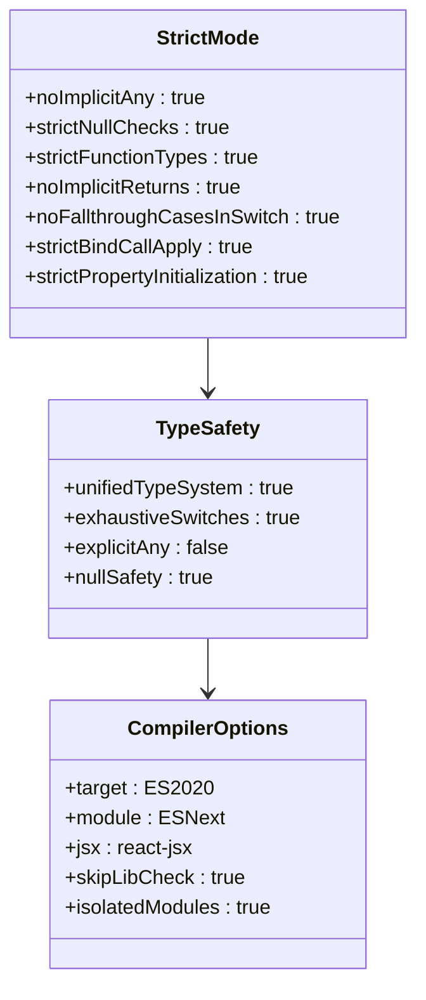
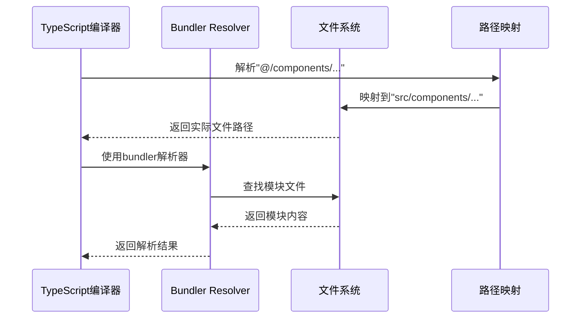
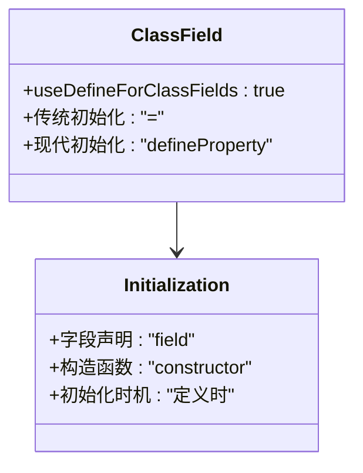
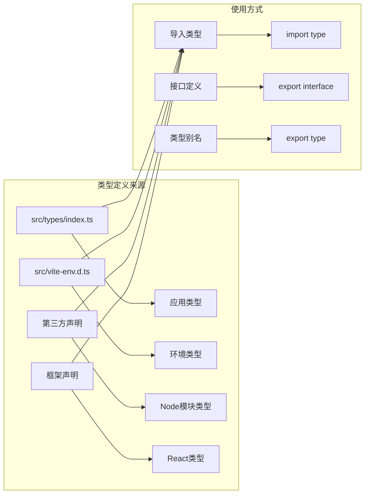
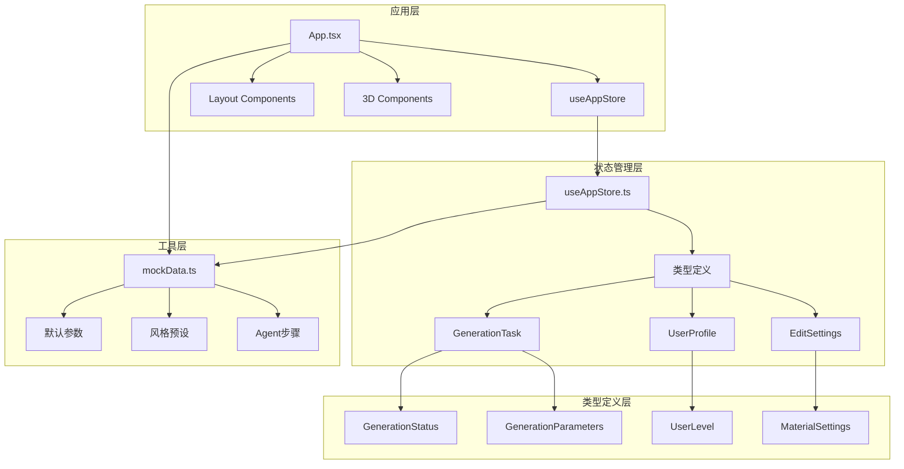

# TypeScript配置

<cite>
**本文档引用的文件**
- [tsconfig.json](file://tsconfig.json)
- [package.json](file://package.json)
- [vite.config.ts](file://vite.config.ts)
- [src/vite-env.d.ts](file://src/vite-env.d.ts)
- [src/types/index.ts](file://src/types/index.ts)
- [src/store/useAppStore.ts](file://src/store/useAppStore.ts)
- [src/main.tsx](file://src/main.tsx)
- [src/App.tsx](file://src/App.tsx)
- [src/components/Explore/ExploreView.tsx](file://src/components/Explore/ExploreView.tsx)
- [src/utils/mockData.ts](file://src/utils/mockData.ts)
- [postcss.config.js](file://postcss.config.js)
- [tailwind.config.js](file://tailwind.config.js)
</cite>

## 目录
1. [简介](#简介)
2. [项目结构](#项目结构)
3. [核心配置组件](#核心配置组件)
4. [架构概览](#架构概览)
5. [详细组件分析](#详细组件分析)
6. [依赖关系分析](#依赖关系分析)
7. [性能考虑](#性能考虑)
8. [故障排除指南](#故障排除指南)
9. [结论](#结论)

## 简介

本项目是一个基于React和TypeScript构建的3D模型生成应用，采用现代化的前端开发工具链。本文档深入解析了项目的TypeScript编译配置，包括严格模式、模块解析策略、路径映射、React特定配置以及与Vite构建系统的集成方式。

该项目使用Vite作为构建工具，配合TypeScript进行类型检查和编译，实现了高效的开发体验和生产级的构建输出。配置重点体现了现代前端开发的最佳实践，特别是在TypeScript严格模式下的类型安全保证。

## 项目结构

项目采用标准的React + TypeScript项目结构，主要特点如下：



**图表来源**
- [tsconfig.json:1-25](file://tsconfig.json#L1-L25)
- [package.json:1-35](file://package.json#L1-L35)
- [vite.config.ts:1-12](file://vite.config.ts#L1-L12)

**章节来源**
- [tsconfig.json:1-25](file://tsconfig.json#L1-L25)
- [package.json:1-35](file://package.json#L1-L35)
- [vite.config.ts:1-12](file://vite.config.ts#L1-L12)

## 核心配置组件

### 编译器选项详解

项目的核心TypeScript配置集中在`tsconfig.json`文件中，以下是各项配置的详细说明：

#### 基础编译目标设置
- **目标版本**: ES2020 - 支持现代JavaScript特性，确保在最新浏览器中的兼容性
- **模块系统**: ESNext - 与Vite的原生ES模块支持完美结合
- **库文件**: ES2020, DOM, DOM.Iterable - 提供完整的Web API类型支持

#### 严格模式配置
- **严格模式**: 启用完整严格模式，提供最强的类型安全保障
- **未使用局部变量**: 关闭检查，允许未使用的局部变量存在
- **未使用参数**: 关闭检查，减少样板代码
- **switch语句穷举检查**: 启用防止遗漏case分支

#### 模块解析策略
- **模块解析器**: bundler - 专门为打包器优化的解析策略
- **导入TS扩展名**: 允许直接导入`.ts`和`.tsx`文件
- **JSON模块解析**: 启用JSON模块导入支持

#### JSX处理配置
- **JSX语法**: react-jsx - 使用新的React JSX转换
- **定义字段**: 使用`defineProperty`而非`=`初始化类字段

#### 路径映射配置
- **基础路径**: `.`
- **路径映射**: `"@/*": ["src/*"]` - 实现绝对路径导入

**章节来源**
- [tsconfig.json:2-22](file://tsconfig.json#L2-L22)

### 构建脚本配置

项目通过`package.json`中的脚本实现开发和生产构建流程：



**图表来源**
- [package.json:6-10](file://package.json#L6-L10)

**章节来源**
- [package.json:6-10](file://package.json#L6-L10)

## 架构概览

项目采用现代化的前端架构，TypeScript配置与构建工具深度集成：



**图表来源**
- [tsconfig.json:3-13](file://tsconfig.json#L3-L13)
- [vite.config.ts:4-11](file://vite.config.ts#L4-L11)

**章节来源**
- [tsconfig.json:3-22](file://tsconfig.json#L3-L22)
- [vite.config.ts:4-11](file://vite.config.ts#L4-L11)

## 详细组件分析

### TypeScript编译配置分析

#### 严格模式实现
项目启用了完整的TypeScript严格模式，提供了以下安全保障：



**图表来源**
- [tsconfig.json:14-17](file://tsconfig.json#L14-L17)
- [tsconfig.json:3-6](file://tsconfig.json#L3-L6)

#### 模块解析策略
项目采用了针对现代打包器优化的模块解析策略：



**图表来源**
- [tsconfig.json:8](file://tsconfig.json#L8)
- [tsconfig.json:19-21](file://tsconfig.json#L19-L21)
- [vite.config.ts:6-10](file://vite.config.ts#L6-L10)

**章节来源**
- [tsconfig.json:8](file://tsconfig.json#L8)
- [tsconfig.json:19-21](file://tsconfig.json#L19-L21)
- [vite.config.ts:6-10](file://vite.config.ts#L6-L10)

### React特定配置

#### JSX处理设置
项目配置了现代化的React JSX处理方式：

```mermaid
flowchart TD
A[TSX文件] --> B[JSX转换器]
B --> C[React JSX转换]
C --> D[createElement调用]
D --> E[虚拟DOM树]
F[配置选项] --> G[jsx: "react-jsx"]
G --> H[新的JSX语法]
H --> I[更好的开发体验]
```

**图表来源**
- [tsconfig.json:13](file://tsconfig.json#L13)

#### 类字段定义
使用`useDefineForClassFields`确保类字段的正确初始化：



**图表来源**
- [tsconfig.json:4](file://tsconfig.json#L4)

**章节来源**
- [tsconfig.json:13](file://tsconfig.json#L13)
- [tsconfig.json:4](file://tsconfig.json#L4)

### 路径映射配置

#### 绝对路径导入
项目实现了灵活的路径映射系统：

```mermaid
graph TB
subgraph "配置映射"
A["@/*"] --> B["src/*"]
C["components/*"] --> D["src/components/*"]
E["store/*"] --> F["src/store/*"]
G["types/*"] --> H["src/types/*"]
end
subgraph "使用示例"
I[相对导入] --> J[./components/Button]
K[绝对导入] --> L[@/components/Button]
M[类型导入] --> N[@/types/User]
end
A -.-> K
B -.-> L
H -.-> N
```

**图表来源**
- [tsconfig.json:19-21](file://tsconfig.json#L19-L21)

**章节来源**
- [tsconfig.json:19-21](file://tsconfig.json#L19-L21)

### 类型声明文件管理

#### 全局类型定义
项目通过多种方式管理类型声明：



**图表来源**
- [src/types/index.ts:1-160](file://src/types/index.ts#L1-L160)
- [src/vite-env.d.ts:1](file://src/vite-env.d.ts#L1)

**章节来源**
- [src/types/index.ts:1-160](file://src/types/index.ts#L1-L160)
- [src/vite-env.d.ts:1](file://src/vite-env.d.ts#L1)

### 开发与生产环境差异

#### 开发环境配置
- **类型检查**: 严格模式，提供完整的类型安全保障
- **模块解析**: 使用bundler解析器，支持现代打包器特性
- **路径映射**: 配置完整的绝对路径支持
- **JSX处理**: 使用新的React JSX转换

#### 生产环境配置
- **编译输出**: 通过Vite进行优化打包
- **类型检查**: 在构建前进行严格的类型检查
- **模块系统**: 输出优化的ES模块格式
- **资源处理**: 自动优化图片、字体等静态资源

**章节来源**
- [tsconfig.json:1-25](file://tsconfig.json#L1-L25)
- [package.json:6-10](file://package.json#L6-L10)

## 依赖关系分析

### TypeScript配置依赖图

```mermaid
graph TB
subgraph "核心配置"
A[tsconfig.json] --> B[compilerOptions]
A --> C[include]
B --> D[target: ES2020]
B --> E[module: ESNext]
B --> F[jsx: react-jsx]
end
subgraph "构建工具集成"
G[vite.config.ts] --> H[plugin-react]
G --> I[alias配置]
I --> J['@': '/src']
K[package.json] --> L[scripts]
L --> M[dev/build/preview]
end
subgraph "类型系统"
N[src/types/index.ts] --> O[应用类型定义]
P[src/vite-env.d.ts] --> Q[环境声明]
R[第三方类型] --> S[React/Three.js等]
end
A --> G
A --> N
A --> P
G --> N
```

**图表来源**
- [tsconfig.json:2-24](file://tsconfig.json#L2-L24)
- [vite.config.ts:1-12](file://vite.config.ts#L1-L12)
- [package.json:6-10](file://package.json#L6-L10)

### 模块依赖关系

项目中的类型依赖关系体现了清晰的分层架构：



**图表来源**
- [src/App.tsx:1-33](file://src/App.tsx#L1-L33)
- [src/store/useAppStore.ts:1-368](file://src/store/useAppStore.ts#L1-L368)
- [src/types/index.ts:1-160](file://src/types/index.ts#L1-L160)
- [src/utils/mockData.ts:1-189](file://src/utils/mockData.ts#L1-L189)

**章节来源**
- [src/App.tsx:1-33](file://src/App.tsx#L1-L33)
- [src/store/useAppStore.ts:1-368](file://src/store/useAppStore.ts#L1-L368)
- [src/types/index.ts:1-160](file://src/types/index.ts#L1-L160)
- [src/utils/mockData.ts:1-189](file://src/utils/mockData.ts#L1-L189)

## 性能考虑

### 编译性能优化

项目配置在保证类型安全的同时，也考虑了编译性能：

- **跳过库检查**: `skipLibCheck: true` - 大幅提升编译速度
- **隔离模块**: `isolatedModules: true` - 支持增量编译和更快的编辑体验
- **目标平台**: ES2020 - 利用现代JavaScript特性，减少polyfill需求

### 运行时性能优化

- **模块解析**: 使用bundler解析器，避免不必要的文件系统查询
- **路径映射**: 减少深层相对路径，提高模块解析效率
- **JSX转换**: 新的React JSX语法，提供更好的开发体验

## 故障排除指南

### 常见配置问题

#### 类型检查失败
当遇到类型检查错误时，检查以下配置：
- 确认严格模式设置是否符合预期
- 验证模块解析配置是否正确
- 检查路径映射是否完整

#### JSX转换错误
如果JSX转换出现问题：
- 确认`jsx`选项设置为`react-jsx`
- 验证React版本兼容性
- 检查文件扩展名是否正确

#### 模块解析问题
当模块导入失败时：
- 检查`moduleResolution`设置
- 验证路径映射配置
- 确认文件存在且命名正确

**章节来源**
- [tsconfig.json:14-17](file://tsconfig.json#L14-L17)
- [tsconfig.json:8](file://tsconfig.json#L8)
- [tsconfig.json:19-21](file://tsconfig.json#L19-L21)

## 结论

本项目的TypeScript配置展现了现代前端开发的最佳实践。通过精心设计的编译选项、严格的类型检查和高效的模块解析策略，项目实现了：

1. **强类型安全保障**: 完整的严格模式配置确保代码质量
2. **高效开发体验**: 现代化的构建工具链提供快速反馈
3. **灵活的模块系统**: 支持绝对路径导入和现代打包器特性
4. **可维护的架构**: 清晰的类型分层和模块依赖关系

该配置方案为类似规模的React + TypeScript项目提供了优秀的参考模板，既保证了开发效率，又确保了代码质量和运行性能。