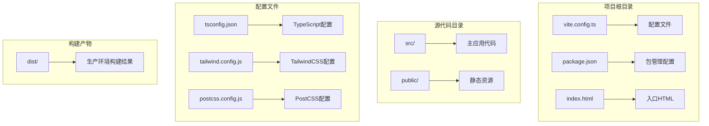
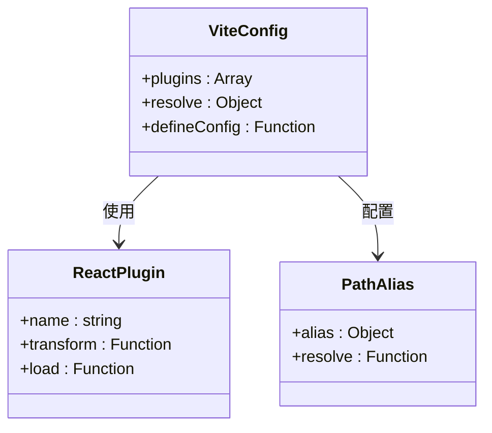
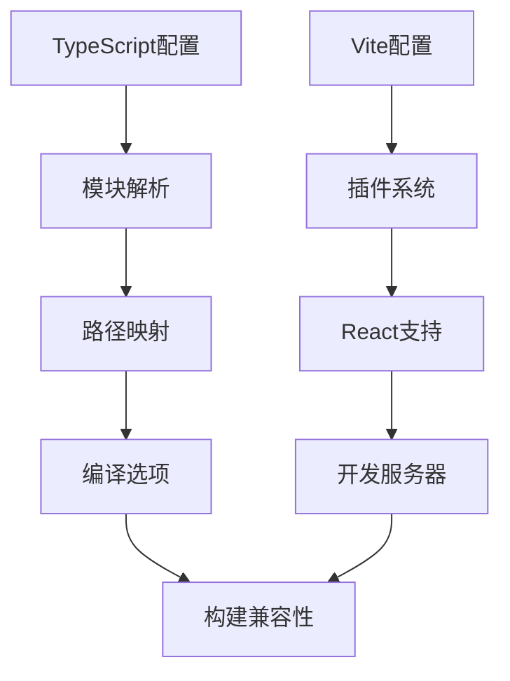
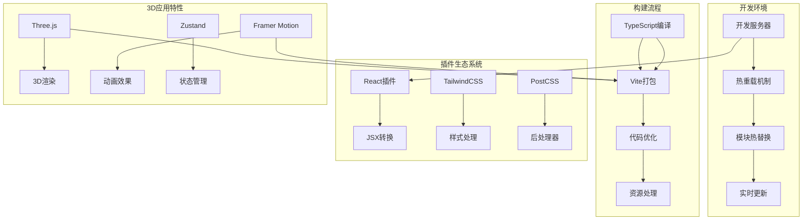
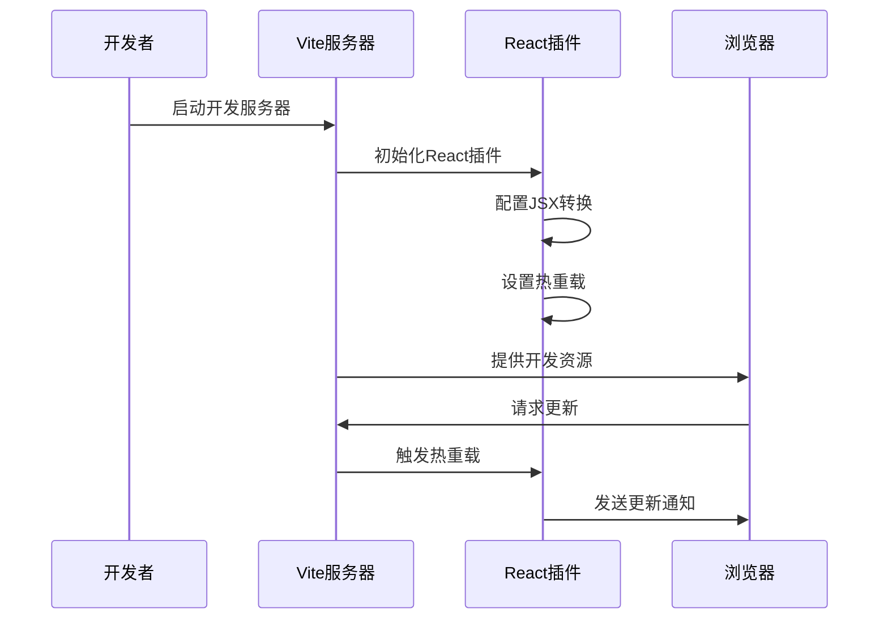
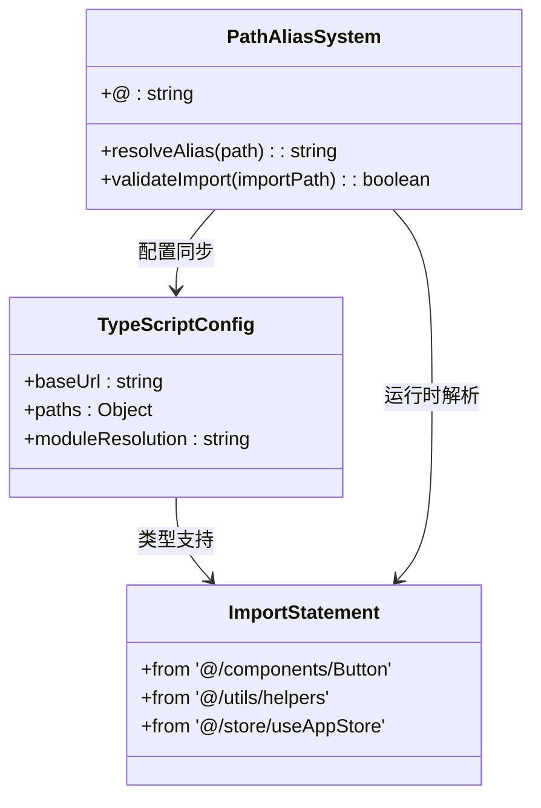
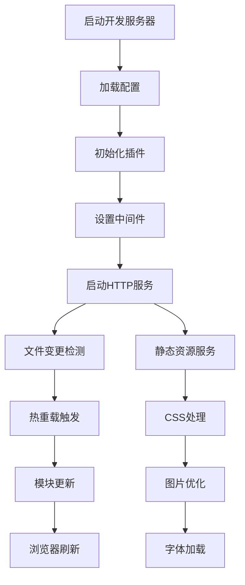
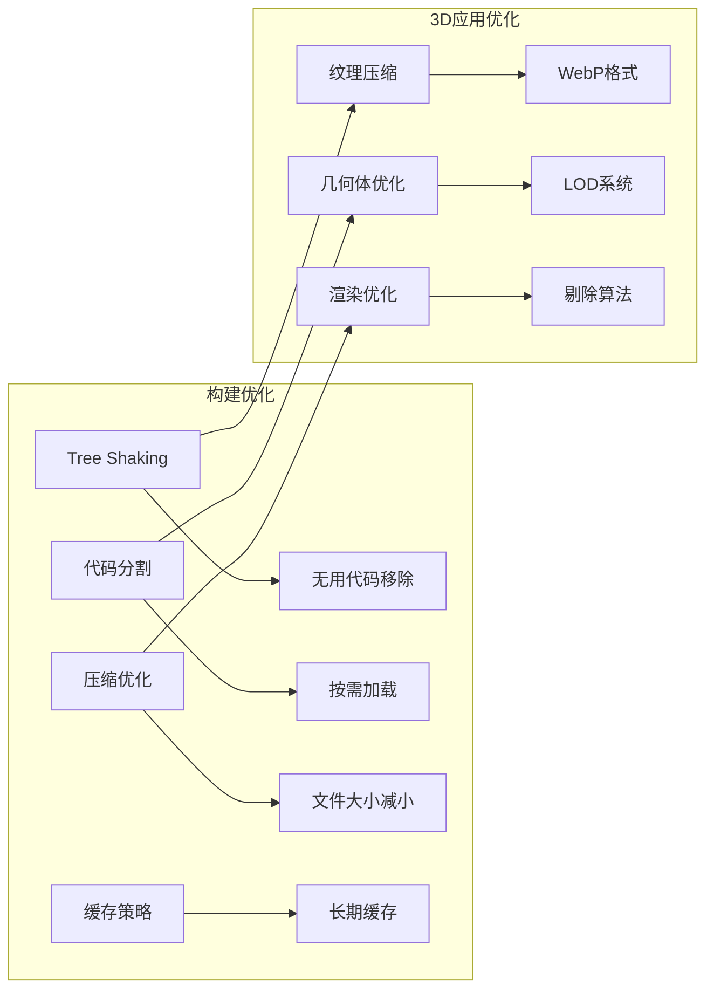

# Vite构建配置

<cite>
**本文档引用的文件**
- [vite.config.ts](file://vite.config.ts)
- [package.json](file://package.json)
- [tsconfig.json](file://tsconfig.json)
- [postcss.config.js](file://postcss.config.js)
- [tailwind.config.js](file://tailwind.config.js)
- [index.html](file://index.html)
- [src/main.tsx](file://src/main.tsx)
- [src/App.tsx](file://src/App.tsx)
- [src/vite-env.d.ts](file://src/vite-env.d.ts)
</cite>

## 目录
1. [简介](#简介)
2. [项目结构概览](#项目结构概览)
3. [核心配置组件](#核心配置组件)
4. [架构总览](#架构总览)
5. [详细组件分析](#详细组件分析)
6. [依赖关系分析](#依赖关系分析)
7. [性能考虑](#性能考虑)
8. [故障排除指南](#故障排除指南)
9. [结论](#结论)

## 简介

本项目采用Vite作为构建工具，结合TypeScript、React 18、TailwindCSS和Three.js等现代前端技术栈。Vite提供了极快的开发体验和高效的构建流程，特别适合复杂的3D应用开发场景。

该项目是一个AI驱动的3D模型生成平台，需要处理大量的3D资源和复杂的交互逻辑，因此对构建工具的性能和功能有较高要求。

## 项目结构概览

项目采用标准的Vite + React + TypeScript项目结构，主要目录组织如下：



**图表来源**
- [vite.config.ts:1-12](file://vite.config.ts#L1-L12)
- [package.json:1-35](file://package.json#L1-L35)
- [tsconfig.json:1-25](file://tsconfig.json#L1-L25)

**章节来源**
- [vite.config.ts:1-12](file://vite.config.ts#L1-L12)
- [package.json:1-35](file://package.json#L1-L35)
- [tsconfig.json:1-25](file://tsconfig.json#L1-L25)

## 核心配置组件

### Vite配置文件分析

Vite的核心配置文件采用了最小化但功能完整的配置方案：



**图表来源**
- [vite.config.ts:4-11](file://vite.config.ts#L4-L11)

配置特点：
- **React插件集成**：通过`@vitejs/plugin-react`实现React JSX转换和开发时热重载
- **路径别名**：使用`@`符号指向`src`目录，简化导入路径
- **最小化配置**：保持配置简洁，避免过度定制

**章节来源**
- [vite.config.ts:1-12](file://vite.config.ts#L1-L12)

### TypeScript配置集成

TypeScript配置与Vite配置形成互补：



**图表来源**
- [tsconfig.json:19-21](file://tsconfig.json#L19-L21)
- [vite.config.ts:6-10](file://vite.config.ts#L6-L10)

**章节来源**
- [tsconfig.json:1-25](file://tsconfig.json#L1-L25)
- [vite.config.ts:1-12](file://vite.config.ts#L1-L12)

## 架构总览

整个构建系统的架构设计体现了现代化前端开发的最佳实践：



**图表来源**
- [package.json:11-21](file://package.json#L11-L21)
- [vite.config.ts:4-11](file://vite.config.ts#L4-L11)

## 详细组件分析

### React插件集成配置

React插件是Vite配置的核心组件，负责处理React相关的构建需求：



**图表来源**
- [vite.config.ts:2](file://vite.config.ts#L2)
- [package.json:27](file://package.json#L27)

React插件的主要功能包括：
- **JSX语法转换**：自动处理React JSX语法
- **开发时热重载**：支持组件级别的热更新
- **优化编译**：针对React进行代码优化
- **类型检查**：与TypeScript集成进行类型检查

**章节来源**
- [vite.config.ts:1-12](file://vite.config.ts#L1-L12)
- [package.json:27](file://package.json#L27)

### 路径别名配置与使用

路径别名系统为项目提供了清晰的模块导入结构：



**图表来源**
- [vite.config.ts:7-9](file://vite.config.ts#L7-L9)
- [tsconfig.json:18-21](file://tsconfig.json#L18-L21)

路径别名配置的关键点：
- **统一前缀**：使用`@`作为所有内部导入的统一前缀
- **目录映射**：`@`指向`src`目录根路径
- **类型安全**：TypeScript配置确保IDE智能提示和类型检查
- **开发体验**：简化长路径导入，提高代码可读性

**章节来源**
- [vite.config.ts:6-10](file://vite.config.ts#L6-L10)
- [tsconfig.json:18-21](file://tsconfig.json#L18-L21)

### 开发服务器配置

开发服务器提供了完整的开发环境支持：



开发服务器的核心特性：
- **快速启动**：利用ES模块原生支持实现超快冷启动
- **热重载**：支持组件级别的热更新，无需整页刷新
- **多端口支持**：可配置不同的开发端口
- **代理配置**：支持API请求代理到后端服务

**章节来源**
- [package.json:7](file://package.json#L7)

### 构建优化策略

构建优化策略确保生产环境的性能表现：



优化策略包括：
- **Tree Shaking**：自动移除未使用的代码
- **代码分割**：按路由和功能模块进行代码分割
- **资源压缩**：CSS、JavaScript和图片资源压缩
- **缓存策略**：生成带内容哈希的文件名以优化缓存

**章节来源**
- [package.json:8](file://package.json#L8)

## 依赖关系分析

项目依赖关系展现了现代化前端技术栈的完整生态：

```mermaid
graph TB
subgraph "核心框架"
A[React 18] --> B[React DOM]
B --> C[React Router DOM]
end
subgraph "3D渲染"
D[Three.js] --> E[@react-three/fiber]
E --> F[@react-three/drei]
end
subgraph "UI和样式"
G[Framer Motion] --> H[动画系统]
I[TailwindCSS] --> J[原子化CSS]
K[Lucide React] --> L[图标库]
end
subgraph "状态管理"
M[Zustand] --> N[轻量级状态管理]
end
subgraph "构建工具"
O[Vite] --> P[开发服务器]
Q[TypeScript] --> R[类型检查]
S[PostCSS] --> T[CSS处理]
end
A --> O
D --> O
I --> O
M --> O
```

**图表来源**
- [package.json:11-21](file://package.json#L11-L21)
- [package.json:23-32](file://package.json#L23-L32)

**章节来源**
- [package.json:1-35](file://package.json#L1-L35)

## 性能考虑

### 开发性能优化

Vite在开发阶段提供了卓越的性能表现：

- **ES模块原生支持**：利用浏览器原生ESM，避免传统打包开销
- **按需编译**：只编译当前页面使用的模块
- **快速热重载**：毫秒级的模块更新时间
- **并行处理**：多线程并行处理多个任务

### 生产性能优化

生产构建阶段的优化策略：

- **代码分割**：自动分析依赖关系进行代码分割
- **资源内联**：小资源直接内联到JavaScript中
- **压缩优化**：使用Terser进行JavaScript压缩
- **CSS提取**：将CSS提取到独立文件中

### 3D应用特殊优化

针对3D应用的性能优化：

- **纹理优化**：支持多种纹理格式以平衡质量与体积
- **几何体优化**：减少不必要的顶点和面片
- **渲染优化**：使用剔除算法减少渲染调用
- **内存管理**：合理管理Three.js对象的生命周期

## 故障排除指南

### 常见问题及解决方案

**问题1：路径别名无法识别**
- 检查TypeScript配置中的路径映射
- 确认Vite配置中的别名设置
- 验证IDE是否正确加载配置

**问题2：热重载不工作**
- 检查React插件是否正确安装
- 确认开发服务器正在运行
- 验证文件保存是否触发监听

**问题3：构建失败**
- 检查TypeScript编译错误
- 确认依赖版本兼容性
- 清理node_modules重新安装

**问题4：3D资源加载问题**
- 检查资源路径是否正确
- 确认文件扩展名匹配
- 验证资源格式支持

**章节来源**
- [vite.config.ts:1-12](file://vite.config.ts#L1-L12)
- [tsconfig.json:1-25](file://tsconfig.json#L1-L25)

## 结论

本项目的Vite配置展现了现代前端构建工具的最佳实践。通过合理的配置选择和优化策略，实现了开发效率和生产性能的平衡。

关键优势包括：
- **开发体验优秀**：快速的启动时间和热重载机制
- **配置简洁**：最小化的配置文件，易于维护
- **功能完整**：涵盖了现代前端开发的所有需求
- **性能优异**：针对3D应用进行了专门优化

对于类似的3D应用或复杂前端项目，建议参考本项目的配置模式，在保证功能完整性的同时，持续优化构建性能和开发体验。