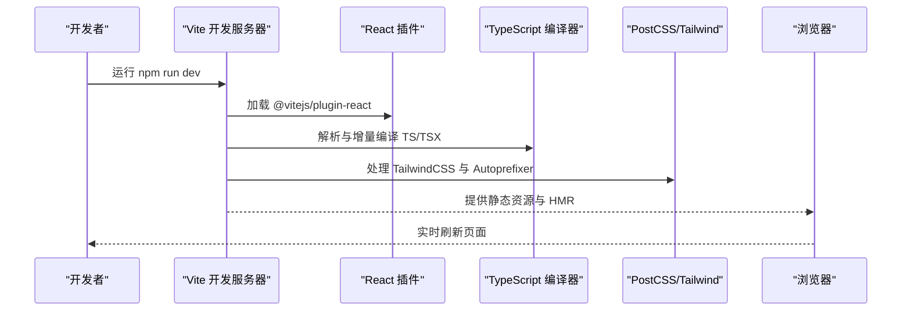
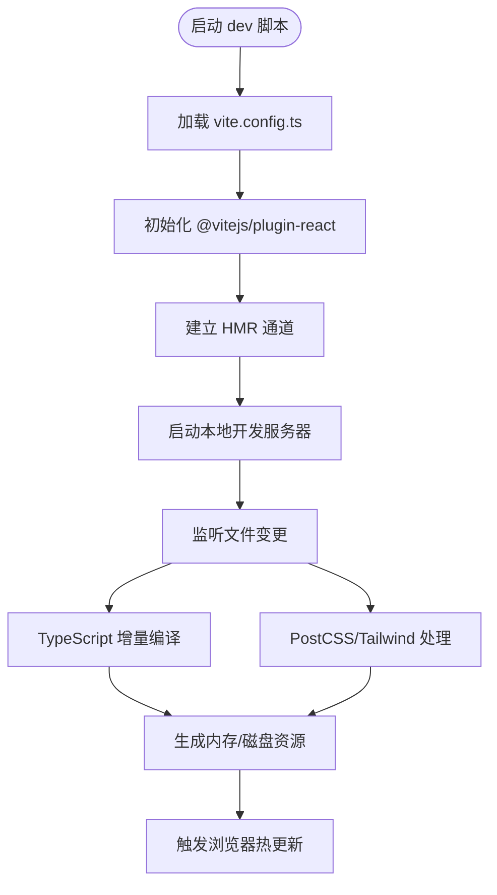
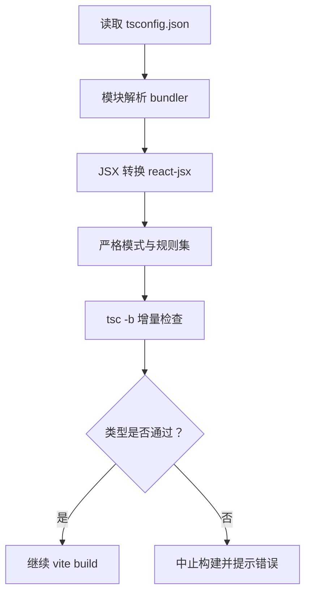
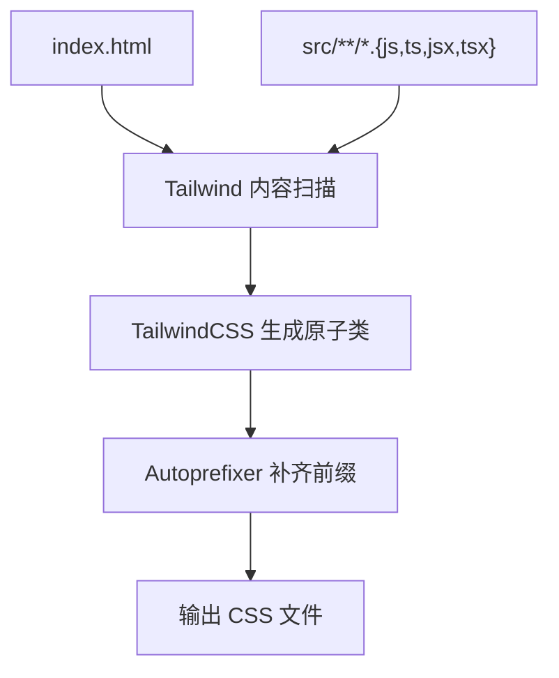
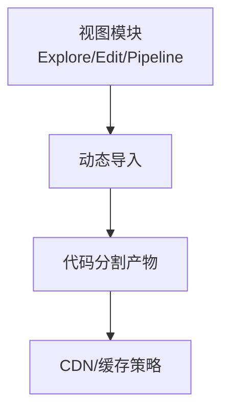
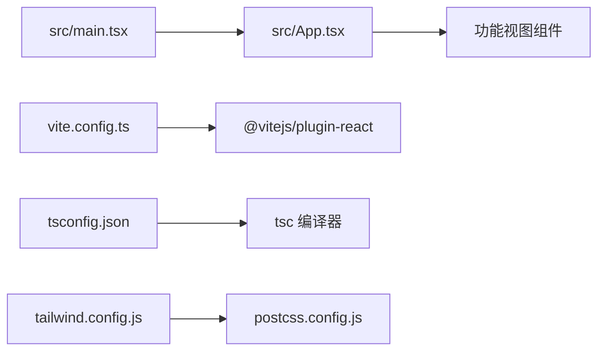

# 开发工具和配置

<cite>
**本文引用的文件**
- [vite.config.ts](file://vite.config.ts)
- [tsconfig.json](file://tsconfig.json)
- [package.json](file://package.json)
- [tailwind.config.js](file://tailwind.config.js)
- [postcss.config.js](file://postcss.config.js)
- [index.html](file://index.html)
- [src/main.tsx](file://src/main.tsx)
- [src/App.tsx](file://src/App.tsx)
</cite>

## 目录
1. [简介](#简介)
2. [项目结构](#项目结构)
3. [核心组件](#核心组件)
4. [架构总览](#架构总览)
5. [详细组件分析](#详细组件分析)
6. [依赖关系分析](#依赖关系分析)
7. [性能考量](#性能考量)
8. [故障排查指南](#故障排查指南)
9. [结论](#结论)
10. [附录](#附录)

## 简介
本文件系统性梳理本项目的开发工具与配置，覆盖以下主题：
- Vite 构建工具的配置与优化策略
- TypeScript 编译配置与类型检查设置
- 开发服务器配置、热重载机制与构建产物
- 代码分割与打包优化思路
- 开发与生产环境差异
- ESLint 与 Prettier 的集成与代码规范
- 调试工具与性能分析
- CI/CD 流程与自动化部署（现状与建议）

## 项目结构
项目采用 Vite + React + TypeScript + TailwindCSS 技术栈，核心目录与文件如下：
- 配置层：vite.config.ts、tsconfig.json、tailwind.config.js、postcss.config.js、package.json
- 源码层：src 下按功能域划分组件、页面与工具模块，入口为 src/main.tsx
- 入口 HTML：index.html
- 样式：通过 TailwindCSS 与 PostCSS 驱动

```mermaid
graph TB
A["index.html<br/>应用入口"] --> B["src/main.tsx<br/>根节点挂载"]
B --> C["src/App.tsx<br/>路由与布局容器"]
C --> D["src/components/*<br/>功能组件"]
C --> E["src/store/*<br/>状态管理"]
C --> F["src/hooks/*<br/>自定义钩子"]
G["vite.config.ts<br/>Vite 插件与别名"] --> H["开发服务器/构建"]
I["tsconfig.json<br/>TypeScript 编译选项"] --> J["类型检查/编译"]
K["tailwind.config.js<br/>样式配置"] --> L["PostCSS 处理"]
M["postcss.config.js"] --> L
N["package.json<br/>脚本与依赖"] --> H
N --> J
N --> L
```

图表来源
- [index.html:1-14](file://index.html#L1-L14)
- [src/main.tsx:1-14](file://src/main.tsx#L1-L14)
- [src/App.tsx:1-33](file://src/App.tsx#L1-L33)
- [vite.config.ts:1-12](file://vite.config.ts#L1-L12)
- [tsconfig.json:1-25](file://tsconfig.json#L1-L25)
- [tailwind.config.js:1-61](file://tailwind.config.js#L1-L61)
- [postcss.config.js:1-7](file://postcss.config.js#L1-L7)
- [package.json:1-35](file://package.json#L1-L35)

章节来源
- [index.html:1-14](file://index.html#L1-L14)
- [src/main.tsx:1-14](file://src/main.tsx#L1-L14)
- [src/App.tsx:1-33](file://src/App.tsx#L1-L33)
- [vite.config.ts:1-12](file://vite.config.ts#L1-L12)
- [tsconfig.json:1-25](file://tsconfig.json#L1-L25)
- [tailwind.config.js:1-61](file://tailwind.config.js#L1-L61)
- [postcss.config.js:1-7](file://postcss.config.js#L1-L7)
- [package.json:1-35](file://package.json#L1-L35)

## 核心组件
- Vite 配置与插件
  - 使用 @vitejs/plugin-react 快速启用 React 与 JSX 支持
  - 路径别名 @ 指向 src，便于统一导入路径
- TypeScript 配置
  - 目标 ES2020，严格模式开启，禁用未使用本地变量与参数检查
  - 模块解析采用 bundler，支持 TS 扩展名与 JSON 模块
  - JSX 使用 react-jsx，baseUrl 与 paths 配合 @ 别名
- TailwindCSS 与 PostCSS
  - Tailwind 内容扫描范围覆盖 src 与 index.html
  - PostCSS 启用 tailwindcss 与 autoprefixer 插件
- 包管理与脚本
  - dev、build、preview 三类脚本，构建前先执行 tsc -b

章节来源
- [vite.config.ts:1-12](file://vite.config.ts#L1-L12)
- [tsconfig.json:1-25](file://tsconfig.json#L1-L25)
- [tailwind.config.js:1-61](file://tailwind.config.js#L1-L61)
- [postcss.config.js:1-7](file://postcss.config.js#L1-L7)
- [package.json:1-35](file://package.json#L1-L35)

## 架构总览
下图展示从开发到构建的关键流程与组件交互。

图表来源
- [vite.config.ts:1-12](file://vite.config.ts#L1-L12)
- [tsconfig.json:1-25](file://tsconfig.json#L1-L25)
- [tailwind.config.js:1-61](file://tailwind.config.js#L1-L61)
- [postcss.config.js:1-7](file://postcss.config.js#L1-L7)
- [package.json:1-35](file://package.json#L1-L35)

## 详细组件分析

### Vite 构建与开发服务器配置
- 插件与别名
  - 插件：@vitejs/plugin-react
  - 路径别名：@ → src，简化导入路径
- 开发服务器特性
  - 基于 Vite 默认行为，支持 HMR（热模块替换）
  - 无需额外配置即可实现快速启动与热更新
- 构建产物
  - 使用 vite build 输出静态资源，配合 tsc -b 先进行类型检查

图表来源
- [vite.config.ts:1-12](file://vite.config.ts#L1-L12)
- [package.json:1-35](file://package.json#L1-L35)

章节来源
- [vite.config.ts:1-12](file://vite.config.ts#L1-L12)
- [package.json:1-35](file://package.json#L1-L35)

### TypeScript 编译与类型检查
- 编译目标与模块系统
  - 目标：ES2020；模块：ESNext；模块解析：bundler
- 严格性与检查策略
  - 严格模式开启；未使用本地变量/参数检查关闭
  - 禁止贯穿开关开启，提升分支健壮性
- JSX 与路径映射
  - JSX：react-jsx；baseUrl 与 paths 映射 @/* → src/*
- 类型检查流程
  - 构建前通过 tsc -b 进行增量编译与类型检查
  - 无 emit（不输出 JS），仅做类型校验

图表来源
- [tsconfig.json:1-25](file://tsconfig.json#L1-L25)
- [package.json:1-35](file://package.json#L1-L35)

章节来源
- [tsconfig.json:1-25](file://tsconfig.json#L1-L25)
- [package.json:1-35](file://package.json#L1-L35)

### 样式体系：TailwindCSS 与 PostCSS
- Tailwind 配置要点
  - content 扫描范围：index.html 与 src/**/*.{js,ts,jsx,tsx}
  - 自定义颜色、渐变、阴影、动画与模糊等扩展
- PostCSS 配置
  - 启用 tailwindcss 与 autoprefixer 插件
- 生产建议
  - 可结合 purge 或 content 精准控制，减少产物体积

图表来源
- [tailwind.config.js:1-61](file://tailwind.config.js#L1-L61)
- [postcss.config.js:1-7](file://postcss.config.js#L1-L7)
- [index.html:1-14](file://index.html#L1-L14)

章节来源
- [tailwind.config.js:1-61](file://tailwind.config.js#L1-L61)
- [postcss.config.js:1-7](file://postcss.config.js#L1-L7)
- [index.html:1-14](file://index.html#L1-L14)

### 代码分割与打包优化（策略建议）
当前仓库未显式配置代码分割与产物优化策略。基于现有技术栈，可采用以下通用策略（概念性说明）：
- 动态导入与路由级分割：对 Explore/Edit/Pipeline 等视图采用动态导入，实现按需加载
- Vite 插件生态：可引入压缩与体积分析插件，辅助优化
- Tree Shaking：确保模块化写法与 ESModule 导出，提升摇树效果
- 静态资源处理：合理配置资源大小阈值与哈希命名策略

（本图为概念示意，不对应具体源码文件）

## 依赖关系分析
- 组件耦合
  - src/main.tsx 作为根节点挂载点，依赖 src/App.tsx
  - src/App.tsx 依赖各功能视图与共享组件
- 工具链依赖
  - Vite 依赖 @vitejs/plugin-react
  - TypeScript 依赖 tsc 与 bundler 模式
  - 样式依赖 TailwindCSS 与 PostCSS

图表来源
- [src/main.tsx:1-14](file://src/main.tsx#L1-L14)
- [src/App.tsx:1-33](file://src/App.tsx#L1-L33)
- [vite.config.ts:1-12](file://vite.config.ts#L1-L12)
- [tsconfig.json:1-25](file://tsconfig.json#L1-L25)
- [tailwind.config.js:1-61](file://tailwind.config.js#L1-L61)
- [postcss.config.js:1-7](file://postcss.config.js#L1-L7)

章节来源
- [src/main.tsx:1-14](file://src/main.tsx#L1-L14)
- [src/App.tsx:1-33](file://src/App.tsx#L1-L33)
- [vite.config.ts:1-12](file://vite.config.ts#L1-L12)
- [tsconfig.json:1-25](file://tsconfig.json#L1-L25)
- [tailwind.config.js:1-61](file://tailwind.config.js#L1-L61)
- [postcss.config.js:1-7](file://postcss.config.js#L1-L7)

## 性能考量
- 开发阶段
  - Vite 默认启用 HMR，减少全量刷新开销
  - TypeScript 增量编译降低 IDE/终端等待时间
- 构建阶段
  - 当前未配置产物优化，建议后续引入体积分析与压缩插件
  - 合理拆分第三方库与业务代码，提升缓存命中率
- 样式层面
  - TailwindCSS 在开发期按需生成，生产期可通过内容扫描最小化

（本节为通用指导，不直接分析具体文件）

## 故障排查指南
- 开发服务器无法启动或端口冲突
  - 检查本地端口占用，必要时在 Vite 配置中调整端口
  - 确认 @vitejs/plugin-react 正常安装与加载
- 类型检查失败
  - 确保 tsc -b 能正常运行，修正类型错误后再执行构建
  - 检查 tsconfig.json 中的严格性与路径映射
- 样式未生效
  - 确认 tailwind.config.js 的 content 范围包含相关文件
  - 检查 PostCSS 插件顺序与版本兼容性
- 构建产物异常
  - 确认 package.json 中 build 脚本顺序：先 tsc -b 再 vite build
  - 如需进一步优化，可在 vite.config.ts 中添加产物分析与压缩插件

章节来源
- [vite.config.ts:1-12](file://vite.config.ts#L1-L12)
- [tsconfig.json:1-25](file://tsconfig.json#L1-L25)
- [tailwind.config.js:1-61](file://tailwind.config.js#L1-L61)
- [postcss.config.js:1-7](file://postcss.config.js#L1-L7)
- [package.json:1-35](file://package.json#L1-L35)

## 结论
本项目以 Vite + React + TypeScript + TailwindCSS 为基础，配置简洁、职责清晰。开发体验由 Vite 的 HMR 与 React 插件保障，类型安全通过 tsc -b 与严格模式实现，样式体系由 TailwindCSS 与 PostCSS 驱动。建议后续在构建阶段引入代码分割与产物优化策略，并完善 ESLint/Prettier 规范与 CI/CD 流程，以进一步提升质量与交付效率。

## 附录

### 开发与生产环境差异说明
- 开发环境
  - 使用 Vite 默认开发服务器，启用 HMR，便于快速迭代
  - TypeScript 以增量方式参与，保证编辑器与命令行一致
- 生产环境
  - 通过 vite build 产出静态资源，建议配合体积分析与压缩插件
  - TailwindCSS 在生产期建议结合内容扫描，确保仅生成所需样式

（本节为通用指导，不直接分析具体文件）

### ESLint 与 Prettier 集成与代码规范
- ESLint
  - 建议新增 .eslintrc.* 配置，结合 @typescript-eslint 与 react-hooks 规则
  - 在 package.json 中添加 lint 脚本，CI 中执行
- Prettier
  - 新增 .prettierrc 或 prettier.config.js
  - 配合 VSCode/Prettier 插件实现保存自动格式化
  - 可在 Git Hooks 中集成 pre-commit 校验

（本节为通用指导，不直接分析具体文件）

### 调试工具与性能分析
- 调试
  - React DevTools：检查组件树与状态
  - 浏览器性能面板：分析渲染与网络请求
- 性能分析
  - 构建后使用浏览器性能面板与 Lighthouse
  - 可引入 Vite 分析插件，识别大包与重复依赖

（本节为通用指导，不直接分析具体文件）

### CI/CD 流程与自动化部署
- 现状
  - 仓库未包含 CI/CD 配置文件
- 建议流程
  - 触发条件：push 到主分支或创建标签
  - 步骤：安装依赖 → 类型检查 → 单元测试（如有） → 构建 → 上传制品
  - 部署：将 dist 目录部署至静态站点或 CDN
- 平台选择
  - GitHub Actions、GitLab CI、Azure Pipelines 等均可实现上述流程

（本节为通用指导，不直接分析具体文件）