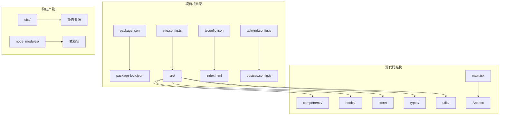
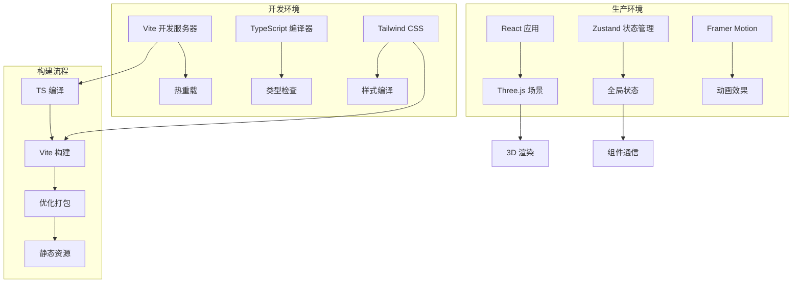
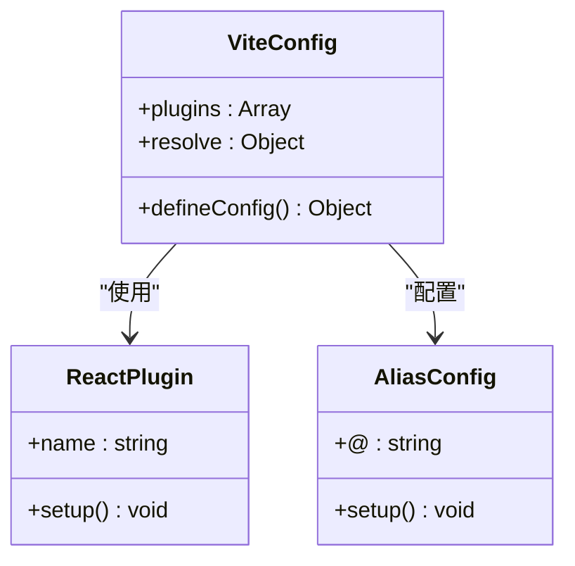
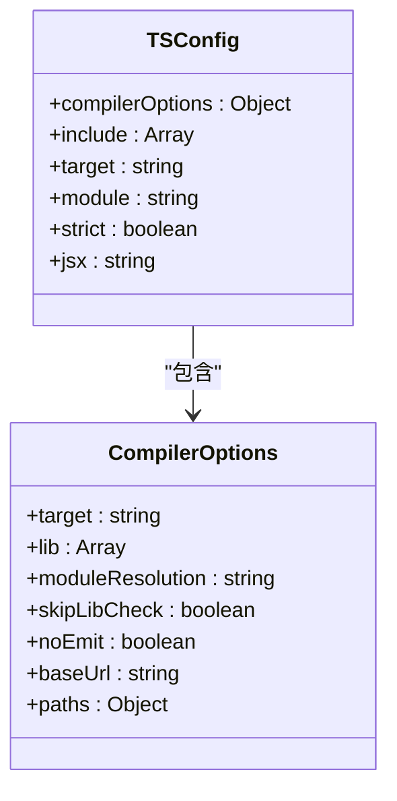
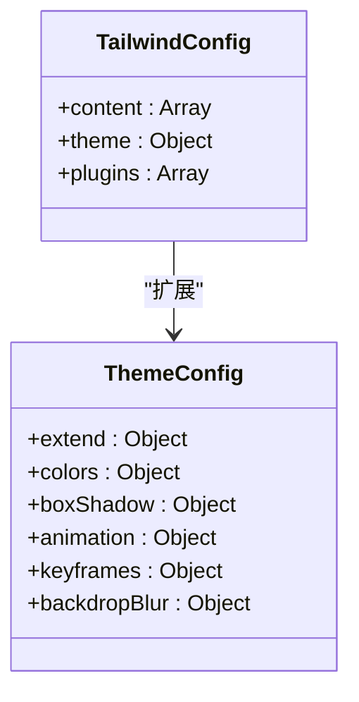
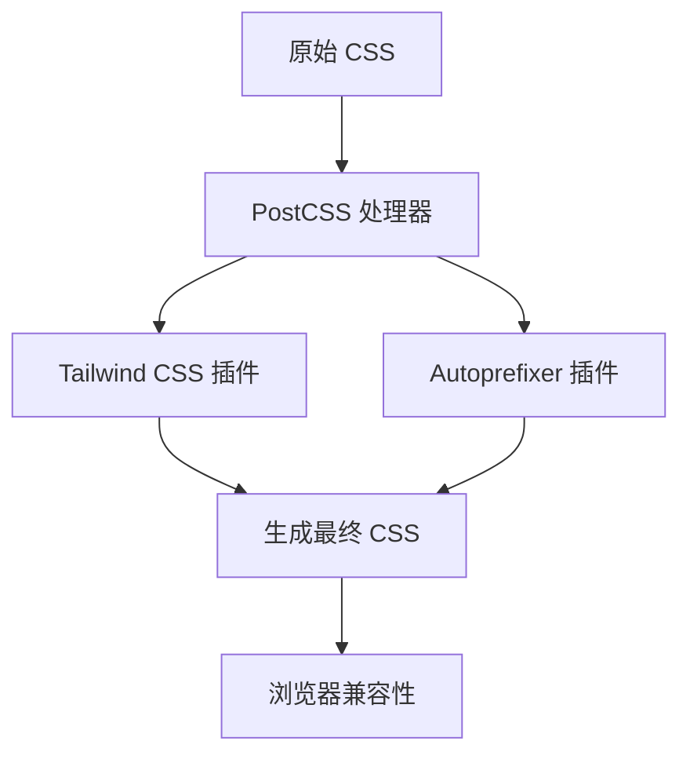

# 项目依赖和脚本

<cite>
**本文档引用的文件**
- [package.json](file://package.json)
- [vite.config.ts](file://vite.config.ts)
- [tsconfig.json](file://tsconfig.json)
- [postcss.config.js](file://postcss.config.js)
- [tailwind.config.js](file://tailwind.config.js)
- [index.html](file://index.html)
- [src/main.tsx](file://src/main.tsx)
- [src/App.tsx](file://src/App.tsx)
- [package-lock.json](file://package-lock.json)
</cite>

## 目录
1. [简介](#简介)
2. [项目结构](#项目结构)
3. [核心组件](#核心组件)
4. [架构概览](#架构概览)
5. [详细组件分析](#详细组件分析)
6. [依赖分析](#依赖分析)
7. [性能考虑](#性能考虑)
8. [故障排除指南](#故障排除指南)
9. [结论](#结论)

## 简介

本项目是一个基于 React 和 Three.js 的 3D 模型生成平台，采用现代化的前端技术栈构建。项目使用 Vite 作为构建工具，TypeScript 进行类型检查，Tailwind CSS 进行样式管理，并集成了 Framer Motion 实现流畅的动画效果。

该项目的核心目标是提供一个 AI 驱动的 3D 模型生成平台，支持探索、编辑和管道三种工作模式，具有沉浸式的太空主题视觉设计。

## 项目结构

项目采用标准的现代前端项目结构，主要包含以下关键目录和文件：



**图表来源**
- [package.json:1-35](file://package.json#L1-L35)
- [vite.config.ts:1-12](file://vite.config.ts#L1-L12)
- [tsconfig.json:1-25](file://tsconfig.json#L1-L25)

**章节来源**
- [package.json:1-35](file://package.json#L1-L35)
- [vite.config.ts:1-12](file://vite.config.ts#L1-L12)
- [tsconfig.json:1-25](file://tsconfig.json#L1-L25)

## 核心组件

### 包管理配置

项目使用 npm 作为包管理器，通过 package.json 统一管理所有依赖关系。配置文件采用了模块化的方式，明确区分了生产依赖和开发依赖。

**生产依赖（运行时必需）**：
- React 生态系统：react、react-dom、react-router-dom
- 3D 渲染：three、@react-three/fiber、@react-three/drei
- 状态管理：zustand
- 动画库：framer-motion
- 图标库：lucide-react
- 工具函数：clsx

**开发依赖（构建时必需）**：
- 类型定义：@types/react、@types/react-dom、@types/three
- 构建工具：@vitejs/plugin-react、vite
- 样式处理：postcss、autoprefixer、tailwindcss
- 类型检查：typescript

### 脚本配置

项目提供了三个核心 NPM 脚本：

1. **开发服务器**：`npm run dev` - 启动 Vite 开发服务器
2. **构建应用**：`npm run build` - 先执行 TypeScript 编译，再进行 Vite 构建
3. **预览构建**：`npm run preview` - 预览生产构建结果

**章节来源**
- [package.json:6-10](file://package.json#L6-L10)
- [package.json:11-33](file://package.json#L11-L33)

## 架构概览

项目采用前后端分离的架构模式，前端使用 React + TypeScript 构建，通过 Vite 进行开发和构建。



**图表来源**
- [vite.config.ts:4-11](file://vite.config.ts#L4-L11)
- [tsconfig.json:2-22](file://tsconfig.json#L2-L22)
- [tailwind.config.js:1-61](file://tailwind.config.js#L1-L61)

## 详细组件分析

### Vite 配置分析

Vite 作为构建工具，提供了快速的开发体验和高效的构建性能。



**图表来源**
- [vite.config.ts:1-12](file://vite.config.ts#L1-L12)

配置特点：
- 使用 React 插件进行 JSX 处理
- 设置路径别名 `@` 指向 `src` 目录
- 支持 TypeScript 文件导入

**章节来源**
- [vite.config.ts:1-12](file://vite.config.ts#L1-L12)

### TypeScript 配置分析

TypeScript 配置确保了代码的类型安全性和开发体验。



**图表来源**
- [tsconfig.json:1-25](file://tsconfig.json#L1-L25)

配置特点：
- ES2020 目标环境
- 使用 bundler 模块解析
- 启用严格模式
- 配置路径映射 `@/*` 到 `src/*`

**章节来源**
- [tsconfig.json:1-25](file://tsconfig.json#L1-L25)

### Tailwind CSS 配置分析

Tailwind CSS 提供了实用优先的样式解决方案，特别适合现代前端开发。



**图表来源**
- [tailwind.config.js:1-61](file://tailwind.config.js#L1-L61)

配置特点：
- 自定义颜色系统（太空主题）
- 几何渐变背景
- 发光效果动画
- 玻璃拟态效果

**章节来源**
- [tailwind.config.js:1-61](file://tailwind.config.js#L1-L61)

### PostCSS 配置分析

PostCSS 作为 CSS 后处理器，提供了强大的插件生态系统。



**图表来源**
- [postcss.config.js:1-7](file://postcss.config.js#L1-L7)

**章节来源**
- [postcss.config.js:1-7](file://postcss.config.js#L1-L7)

## 依赖分析

### 依赖层次结构

项目依赖分为多个层次，从底层基础库到上层功能模块：

```mermaid
graph TB
subgraph "基础层"
A[React 18.3.1] --> B[React DOM]
A --> C[React Router DOM]
end
subgraph "3D 渲染层"
D[Three.js 0.164.1] --> E[@react-three/fiber]
E --> F[@react-three/drei]
end
subgraph "状态管理层"
G[Zustand 4.5.2] --> H[全局状态]
end
subgraph "UI 层"
I[Framer Motion 11.2.10] --> J[动画效果]
K[Lucide React 0.378.0] --> L[图标系统]
M[clsx 2.1.1] --> N[条件类名]
end
subgraph "构建工具层"
O[Vite 5.2.13] --> P[开发服务器]
Q[TypeScript 5.4.5] --> R[类型检查]
S[Tailwind CSS 3.4.4] --> T[样式编译]
end
A --> U[应用层]
D --> U
G --> U
I --> U
O --> U
```

**图表来源**
- [package.json:11-33](file://package.json#L11-L33)

### 版本管理策略

项目采用了语义化版本控制策略，使用 Caret (^) 符号允许次要版本和补丁版本的自动更新：

- **主要版本**：手动更新，需要充分测试
- **次要版本**：自动更新，通常包含新功能但保持向后兼容
- **补丁版本**：自动更新，修复已知问题

这种策略平衡了安全性与便利性，确保项目能够及时获得安全更新和 bug 修复。

**章节来源**
- [package.json:11-33](file://package.json#L11-L33)

### 开发依赖与生产依赖的区别

| 依赖类型 | 用途 | 更新策略 | 安全考虑 |
|---------|------|----------|----------|
| **生产依赖** | 运行时必需 | 自动更新次要版本 | 高优先级，影响用户体验 |
| **开发依赖** | 构建和开发必需 | 自动更新次要版本 | 中等优先级，影响开发效率 |

**章节来源**
- [package.json:11-33](file://package.json#L11-L33)

## 性能考虑

### 构建优化

项目在构建过程中采用了多种优化策略：

1. **Tree Shaking**：通过 ES 模块导入导出实现无用代码消除
2. **代码分割**：利用 Vite 的动态导入实现按需加载
3. **压缩优化**：生产环境自动进行代码压缩和优化
4. **缓存策略**：利用浏览器缓存机制提升加载速度

### 运行时性能

- **虚拟 DOM**：React 的高效更新机制
- **状态管理**：Zustand 的轻量级状态管理
- **3D 渲染优化**：Three.js 的渲染优化技术
- **动画性能**：Framer Motion 的硬件加速动画

## 故障排除指南

### 常见问题及解决方案

#### 依赖安装问题

**问题**：依赖安装失败或版本冲突
**解决方案**：
1. 清理 node_modules 和 package-lock.json
2. 使用 `npm ci` 进行干净安装
3. 检查网络连接和 npm 镜像配置

#### 构建错误

**问题**：TypeScript 编译错误
**解决方案**：
1. 检查 tsconfig.json 配置
2. 验证类型定义文件完整性
3. 确认模块解析配置正确

#### 开发服务器问题

**问题**：Vite 开发服务器无法启动
**解决方案**：
1. 检查端口占用情况
2. 验证配置文件语法
3. 确认依赖安装完整

**章节来源**
- [package-lock.json:1-200](file://package-lock.json#L1-L200)

### 安全更新和漏洞扫描

建议定期执行以下安全检查：

1. **依赖审计**：使用 `npm audit` 检查已知漏洞
2. **安全更新**：及时更新高危和中危漏洞的依赖
3. **依赖审查**：定期审查不再维护的依赖包
4. **许可证合规**：确保使用的依赖符合项目许可证要求

## 结论

本项目展示了现代前端项目的最佳实践，包括：

1. **清晰的依赖分层**：合理区分生产依赖和开发依赖
2. **高效的构建工具链**：Vite + TypeScript + Tailwind CSS 的组合
3. **现代化的技术栈**：React + Three.js + Zustand 的应用架构
4. **完善的配置体系**：从开发到生产的完整配置覆盖

项目在保证功能完整性的同时，也注重了性能优化、安全性和可维护性。通过合理的依赖管理和版本控制策略，为后续的功能扩展和维护奠定了良好的基础。