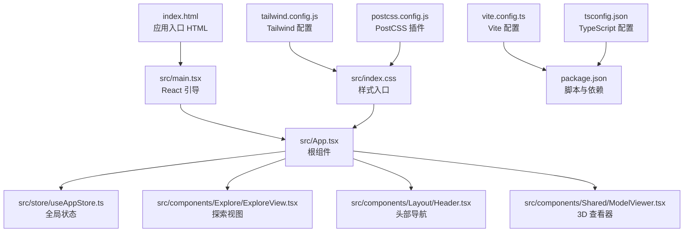
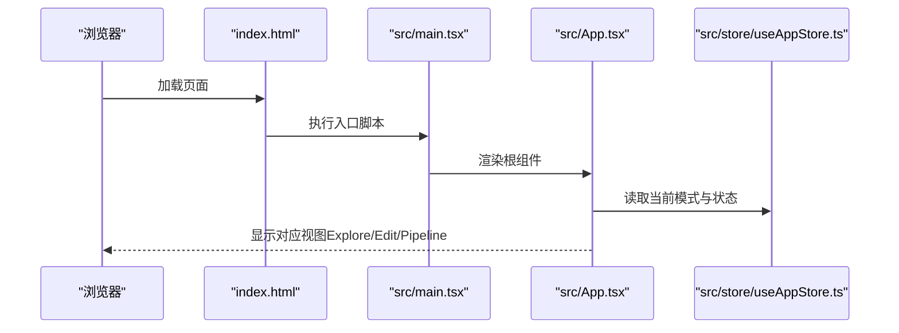

# 快速开始

<cite>
**本文引用的文件**
- [package.json](file://package.json)
- [vite.config.ts](file://vite.config.ts)
- [tsconfig.json](file://tsconfig.json)
- [tailwind.config.js](file://tailwind.config.js)
- [postcss.config.js](file://postcss.config.js)
- [index.html](file://index.html)
- [src/main.tsx](file://src/main.tsx)
- [src/App.tsx](file://src/App.tsx)
- [src/store/useAppStore.ts](file://src/store/useAppStore.ts)
- [src/types/index.ts](file://src/types/index.ts)
- [src/utils/mockData.ts](file://src/utils/mockData.ts)
- [src/components/Explore/ExploreView.tsx](file://src/components/Explore/ExploreView.tsx)
- [src/components/Layout/Header.tsx](file://src/components/Layout/Header.tsx)
- [src/components/Shared/ModelViewer.tsx](file://src/components/Shared/ModelViewer.tsx)
- [src/index.css](file://src/index.css)
</cite>

## 目录
1. [简介](#简介)
2. [系统要求与前置条件](#系统要求与前置条件)
3. [项目结构概览](#项目结构概览)
4. [安装与环境准备](#安装与环境准备)
5. [启动开发服务器](#启动开发服务器)
6. [构建与预览](#构建与预览)
7. [Hello World 示例](#hello-world-示例)
8. [常见问题与解决方案](#常见问题与解决方案)
9. [架构与核心组件](#架构与核心组件)
10. [性能与优化建议](#性能与优化建议)
11. [故障排查指南](#故障排查指南)
12. [结语](#结语)

## 简介
本指南面向希望快速搭建“3D 模型代理”项目开发环境的开发者。项目基于 Vite + React + TypeScript 构建，使用 Three.js、@react-three/fiber 和 @react-three/drei 实现 3D 场景渲染，配合 Zustand 进行全局状态管理，TailwindCSS 提供样式体系。通过本指南，你将完成从克隆仓库、安装依赖、启动开发服务器，到构建与预览的完整流程，并能通过一个简单示例验证环境是否正确配置。

## 系统要求与前置条件
- Node.js 版本：建议使用 LTS 版本（如 18.x 或 20.x），确保与现代前端工具链兼容。
- 包管理器：推荐使用 npm（与 package.json 脚本一致）。
- 硬件：具备可运行现代浏览器的桌面或笔记本电脑；若需在移动设备上调试，请确保浏览器支持 WebGL。
- 浏览器：Chrome/Firefox/Safari 最新版均可；首次加载时会进行 WebGL 初始化，若不支持将无法显示 3D 内容。

## 项目结构概览
项目采用“按功能域分层 + 组件化”的组织方式，核心目录如下：
- src：源代码根目录
  - components：页面级与可复用 UI 组件（Explore/Edit/Pipeline/Layout/Shared）
  - store：Zustand 全局状态定义与逻辑
  - types：TypeScript 类型声明
  - utils：工具函数与模拟数据
  - main.tsx：应用入口
  - App.tsx：根组件
  - index.css：样式入口
- 配置文件：vite.config.ts、tsconfig.json、tailwind.config.js、postcss.config.js、package.json
- 根目录 HTML：index.html

图表来源
- [index.html](file://index.html)
- [src/main.tsx](file://src/main.tsx)
- [src/App.tsx](file://src/App.tsx)
- [src/store/useAppStore.ts](file://src/store/useAppStore.ts)
- [src/components/Explore/ExploreView.tsx](file://src/components/Explore/ExploreView.tsx)
- [src/components/Layout/Header.tsx](file://src/components/Layout/Header.tsx)
- [src/components/Shared/ModelViewer.tsx](file://src/components/Shared/ModelViewer.tsx)
- [src/index.css](file://src/index.css)
- [vite.config.ts](file://vite.config.ts)
- [tsconfig.json](file://tsconfig.json)
- [tailwind.config.js](file://tailwind.config.js)
- [postcss.config.js](file://postcss.config.js)
- [package.json](file://package.json)

章节来源
- [package.json](file://package.json)
- [vite.config.ts](file://vite.config.ts)
- [tsconfig.json](file://tsconfig.json)
- [tailwind.config.js](file://tailwind.config.js)
- [postcss.config.js](file://postcss.config.js)
- [index.html](file://index.html)
- [src/main.tsx](file://src/main.tsx)
- [src/App.tsx](file://src/App.tsx)
- [src/index.css](file://src/index.css)

## 安装与环境准备
- 克隆仓库后进入项目根目录，执行依赖安装：
  - 使用 npm：npm install
- 安装完成后，确认以下文件存在：
  - package.json、vite.config.ts、tsconfig.json、tailwind.config.js、postcss.config.js、index.html、src/main.tsx、src/App.tsx、src/index.css
- 若需要使用其他包管理器（如 yarn/pnpm），请确保其与项目配置兼容，但本指南以 npm 为准。

章节来源
- [package.json](file://package.json)
- [vite.config.ts](file://vite.config.ts)
- [tsconfig.json](file://tsconfig.json)
- [tailwind.config.js](file://tailwind.config.js)
- [postcss.config.js](file://postcss.config.js)
- [index.html](file://index.html)
- [src/main.tsx](file://src/main.tsx)
- [src/App.tsx](file://src/App.tsx)
- [src/index.css](file://src/index.css)

## 启动开发服务器
- 在项目根目录执行：
  - npm run dev
- 默认开发服务器地址通常为 http://localhost:5173（由 Vite 分配）。打开浏览器访问该地址即可看到应用首页。
- 若端口被占用，Vite 会自动尝试下一个可用端口；可在 Vite 配置中调整端口或主机绑定策略。

章节来源
- [package.json](file://package.json)
- [vite.config.ts](file://vite.config.ts)

## 构建与预览
- 构建生产包：
  - npm run build
  - 构建产物默认输出至 dist/ 目录
- 本地预览构建结果：
  - npm run preview
  - 预览服务默认在 http://localhost:4173（由 Vite 提供）

章节来源
- [package.json](file://package.json)

## Hello World 示例
为验证开发环境是否正确配置，你可以创建一个最小可运行示例：

- 在 src 下新增一个文件：src/hello.tsx
- 在该文件中编写一个最简 React 组件并导出，例如：
  - 导出一个名为 Hello 的函数组件，返回一个包含文本“Hello, 3D Model Agent!”的 JSX 元素
- 在 src/App.tsx 中引入并渲染该组件，例如：
  - 在 App 的返回内容中添加该组件的 JSX 标签
- 保存后回到浏览器，刷新页面，若能看到“Hello, 3D Model Agent!”字样，则表示开发环境已正确配置

提示
- 该示例仅用于验证基础运行链路，不涉及 3D 渲染或状态管理，因此无需额外依赖
- 如需在现有页面中快速验证，也可直接在 App.tsx 中插入测试元素

章节来源
- [src/App.tsx](file://src/App.tsx)

## 常见问题与解决方案
- 启动失败或端口冲突
  - 现象：npm run dev 报错或无法启动
  - 处理：更换端口或关闭占用端口的进程；必要时在 Vite 配置中显式设置 port/host
  - 参考：vite.config.ts 的插件与解析别名配置
- 3D 场景空白或无内容
  - 现象：页面空白或仅显示背景，未渲染任何 3D 对象
  - 处理：检查浏览器是否支持 WebGL；确认浏览器控制台无报错；确保已正确挂载 Canvas（由 @react-three/fiber 提供）
- Tailwind/CSS 样式未生效
  - 现象：页面无样式或主题色未出现
  - 处理：确认已引入 src/index.css；检查 tailwind.config.js 的 content 路径是否覆盖到 src；确认 PostCSS 插件已启用
- TypeScript 编译错误
  - 现象：编辑器或终端提示类型错误
  - 处理：根据 tsconfig.json 的严格模式逐项修复；确保路径别名 @/* 正确映射到 src/*
- 依赖缺失或版本不匹配
  - 现象：运行时报缺少模块或运行时异常
  - 处理：执行 npm install 清理并重新安装；核对 package.json 中的依赖版本范围

章节来源
- [vite.config.ts](file://vite.config.ts)
- [tailwind.config.js](file://tailwind.config.js)
- [postcss.config.js](file://postcss.config.js)
- [tsconfig.json](file://tsconfig.json)
- [src/index.css](file://src/index.css)

## 架构与核心组件
- 应用入口与路由
  - index.html 挂载 #root 容器
  - src/main.tsx 使用 React DOM 渲染 App，并包裹在 BrowserRouter 中
- 根组件与页面切换
  - src/App.tsx 根据全局模式（explore/edit/pipeline）渲染对应视图，并集成粒子背景与提示组件
- 全局状态管理
  - src/store/useAppStore.ts 使用 Zustand 管理应用模式、生成任务、编辑设置、模板、用户等级等
- 视图与交互
  - ExploreView.tsx 提供提示输入、风格选择、生成进度与结果卡片
  - Header.tsx 提供模式切换与视图模式切换
  - ModelViewer.tsx 基于 @react-three/fiber + Three.js 提供可交互的 3D 场景
- 样式与主题
  - src/index.css 引入 Tailwind 层叠样式
  - tailwind.config.js 定义颜色、阴影、动画与渐变等主题变量

图表来源
- [index.html](file://index.html)
- [src/main.tsx](file://src/main.tsx)
- [src/App.tsx](file://src/App.tsx)
- [src/store/useAppStore.ts](file://src/store/useAppStore.ts)

章节来源
- [src/main.tsx](file://src/main.tsx)
- [src/App.tsx](file://src/App.tsx)
- [src/store/useAppStore.ts](file://src/store/useAppStore.ts)
- [src/components/Explore/ExploreView.tsx](file://src/components/Explore/ExploreView.tsx)
- [src/components/Layout/Header.tsx](file://src/components/Layout/Header.tsx)
- [src/components/Shared/ModelViewer.tsx](file://src/components/Shared/ModelViewer.tsx)
- [src/index.css](file://src/index.css)

## 性能与优化建议
- 开发阶段
  - 使用 Vite 的热更新能力提升开发体验
  - 合理拆分组件，避免不必要的重渲染
- 生产构建
  - 使用 npm run build 生成优化后的静态资源
  - TailwindCSS 在生产环境下会按需裁剪样式，确保 content 路径覆盖所有使用到的组件
- 3D 场景
  - 控制网格复杂度与贴图分辨率，避免过高的多边形数量导致帧率下降
  - 合理使用环境贴图与光照，减少昂贵的实时计算

## 故障排查指南
- 端口占用
  - 现象：端口被占用导致无法启动
  - 处理：修改 vite.config.ts 中的 server.port 或 server.host
- 浏览器不支持 WebGL
  - 现象：3D 场景不显示
  - 处理：更换现代浏览器或启用硬件加速
- 样式未生效
  - 现象：页面无主题样式
  - 处理：确认 Tailwind 已正确扫描 src/**/*.{js,ts,jsx,tsx} 并且 PostCSS 插件已启用
- TypeScript 错误
  - 现象：编译失败
  - 处理：根据 tsconfig.json 的严格选项逐项修正类型问题

章节来源
- [vite.config.ts](file://vite.config.ts)
- [tailwind.config.js](file://tailwind.config.js)
- [postcss.config.js](file://postcss.config.js)
- [tsconfig.json](file://tsconfig.json)

## 结语
至此，你已完成项目的开发环境搭建与基础验证。建议继续探索 Explore/Edit/Pipeline 三大视图与 ModelViewer 的交互能力，逐步熟悉 Zustand 状态管理与 Three.js 场景构建。如需进一步扩展功能，可参考 package.json 中的依赖与脚本，结合 Vite/Tailwind 的配置进行定制。