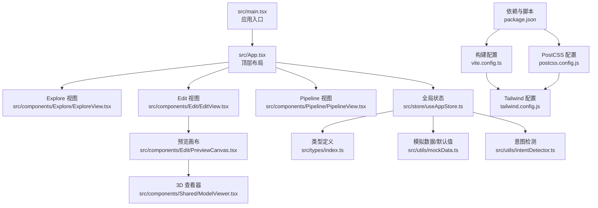
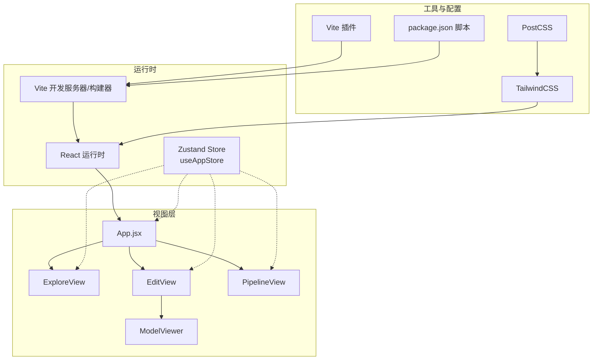
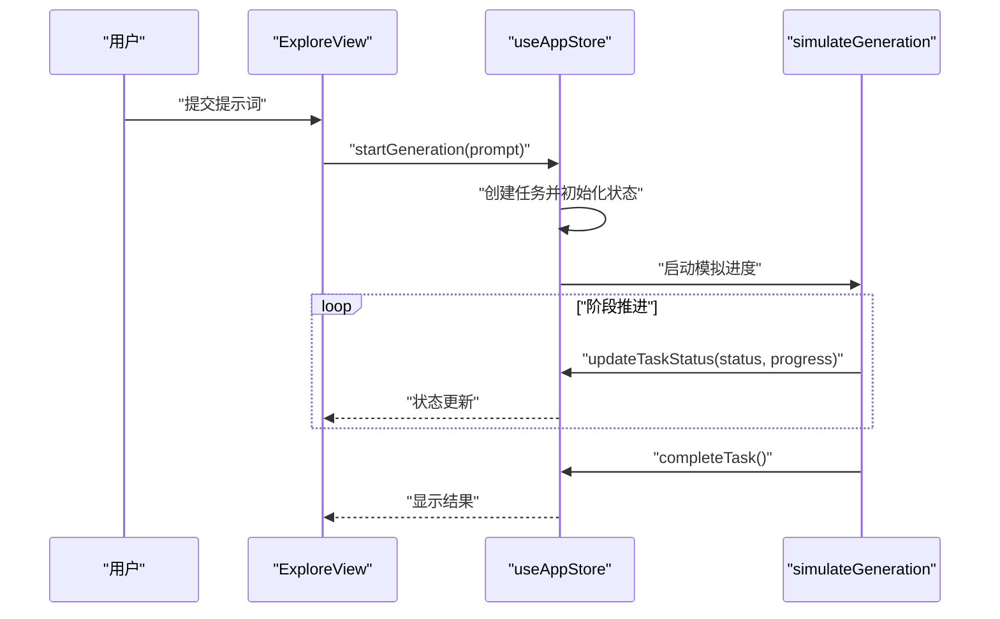
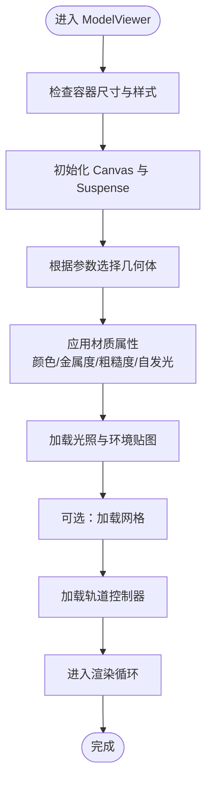
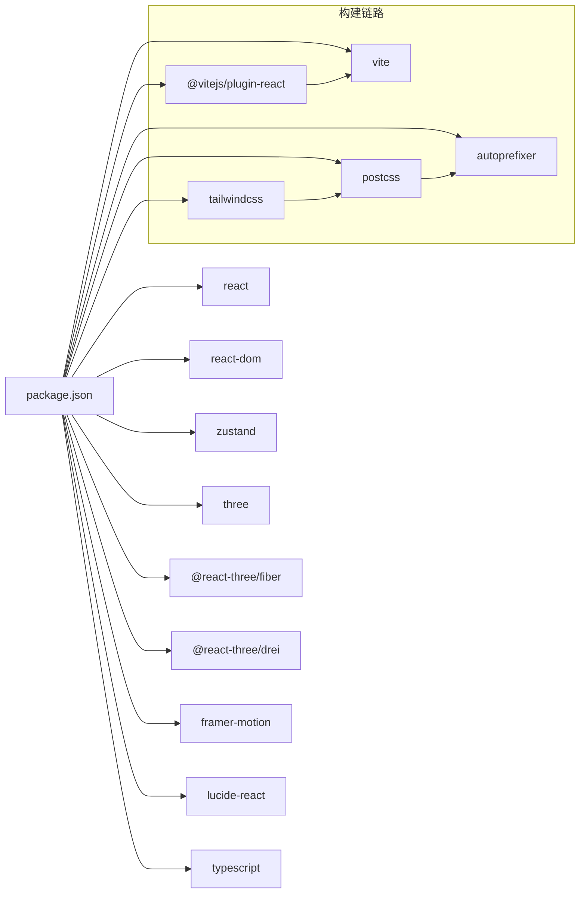
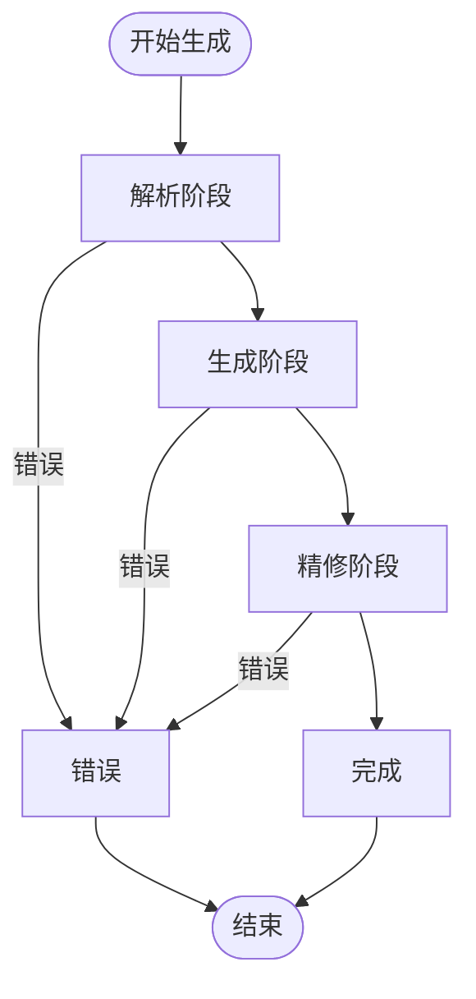
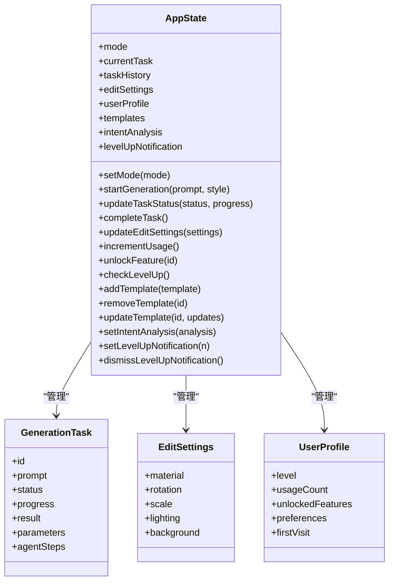

# 故障排除和FAQ

<cite>
**本文引用的文件**
- [package.json](file://package.json)
- [vite.config.ts](file://vite.config.ts)
- [src/main.tsx](file://src/main.tsx)
- [src/App.tsx](file://src/App.tsx)
- [src/store/useAppStore.ts](file://src/store/useAppStore.ts)
- [src/types/index.ts](file://src/types/index.ts)
- [src/utils/mockData.ts](file://src/utils/mockData.ts)
- [src/utils/intentDetector.ts](file://src/utils/intentDetector.ts)
- [src/components/Shared/ModelViewer.tsx](file://src/components/Shared/ModelViewer.tsx)
- [src/components/Edit/PreviewCanvas.tsx](file://src/components/Edit/PreviewCanvas.tsx)
- [src/components/Edit/EditView.tsx](file://src/components/Edit/EditView.tsx)
- [src/components/Explore/ExploreView.tsx](file://src/components/Explore/ExploreView.tsx)
- [src/components/Pipeline/PipelineView.tsx](file://src/components/Pipeline/PipelineView.tsx)
- [tailwind.config.js](file://tailwind.config.js)
- [postcss.config.js](file://postcss.config.js)
</cite>

## 目录
1. [简介](#简介)
2. [项目结构](#项目结构)
3. [核心组件](#核心组件)
4. [架构总览](#架构总览)
5. [详细组件分析](#详细组件分析)
6. [依赖关系分析](#依赖关系分析)
7. [性能考虑](#性能考虑)
8. [故障排除指南](#故障排除指南)
9. [结论](#结论)
10. [附录](#附录)

## 简介
本指南面向开发者与使用者，系统梳理本3D模型代理应用在开发、构建、部署及日常使用过程中可能遇到的常见问题与解决方案，覆盖以下主题：
- 性能问题诊断与优化
- 3D渲染相关错误与修复
- 状态管理问题排查与调试
- 浏览器兼容性问题
- 构建与部署常见错误
- 开发工具与配置问题
- 用户反馈与使用建议

## 项目结构
项目采用React + TypeScript + Vite + TailwindCSS + Zustand + Three.js生态（@react-three/fiber + @react-three/drei）的现代前端栈，核心目录与职责如下：
- src/main.tsx：应用入口，挂载BrowserRouter与根组件
- src/App.tsx：顶层布局与模式切换容器
- src/store/useAppStore.ts：全局状态（Zustand），包含生成任务、编辑设置、用户档案、模板等
- src/types/index.ts：类型定义（任务、材质、管线节点、用户等级等）
- src/components/：视图组件分层（Explore/编辑/管道/共享）
- src/utils/：工具函数（mock数据、意图检测）
- 配置：vite.config.ts、tailwind.config.js、postcss.config.js、package.json

图表来源
- [src/main.tsx:1-14](file://src/main.tsx#L1-L14)
- [src/App.tsx:1-33](file://src/App.tsx#L1-L33)
- [src/components/Explore/ExploreView.tsx:1-263](file://src/components/Explore/ExploreView.tsx#L1-L263)
- [src/components/Edit/EditView.tsx:1-159](file://src/components/Edit/EditView.tsx#L1-L159)
- [src/components/Pipeline/PipelineView.tsx:1-168](file://src/components/Pipeline/PipelineView.tsx#L1-L168)
- [src/components/Edit/PreviewCanvas.tsx:1-54](file://src/components/Edit/PreviewCanvas.tsx#L1-L54)
- [src/components/Shared/ModelViewer.tsx:1-156](file://src/components/Shared/ModelViewer.tsx#L1-L156)
- [src/store/useAppStore.ts:1-368](file://src/store/useAppStore.ts#L1-L368)
- [src/types/index.ts:1-160](file://src/types/index.ts#L1-L160)
- [src/utils/mockData.ts:1-189](file://src/utils/mockData.ts#L1-L189)
- [src/utils/intentDetector.ts:1-148](file://src/utils/intentDetector.ts#L1-L148)
- [vite.config.ts:1-12](file://vite.config.ts#L1-L12)
- [tailwind.config.js:1-61](file://tailwind.config.js#L1-L61)
- [postcss.config.js:1-7](file://postcss.config.js#L1-L7)
- [package.json:1-35](file://package.json#L1-L35)

章节来源
- [src/main.tsx:1-14](file://src/main.tsx#L1-L14)
- [src/App.tsx:1-33](file://src/App.tsx#L1-L33)
- [vite.config.ts:1-12](file://vite.config.ts#L1-L12)
- [tailwind.config.js:1-61](file://tailwind.config.js#L1-L61)
- [postcss.config.js:1-7](file://postcss.config.js#L1-L7)
- [package.json:1-35](file://package.json#L1-L35)

## 核心组件
- 全局状态（Zustand）
  - 职责：统一管理应用模式、生成任务、编辑设置、用户档案、模板、意图分析、等级通知等
  - 关键点：持久化至localStorage；状态变更时订阅更新；提供任务进度模拟与完成回调
- 3D渲染（Three.js + @react-three/fiber + @react-three/drei）
  - 职责：提供可配置的几何体、材质、光照、网格与交互控制器
  - 关键点：Canvas Suspense加载兜底；useFrame驱动自动旋转；多光照预设
- 视图与模式
  - Explore：提示词输入、风格选择、生成进度与结果卡片
  - Edit：材质/变换/光照面板，GLB导出与专家模式进入管道
  - Pipeline：简单线性步骤或专业节点图编辑
- 工具与配置
  - mockData：默认参数与示例Agent步骤
  - intentDetector：基于关键词的专业度分析与参数提取
  - Tailwind：自定义渐变、霓虹光效与毛玻璃样式

章节来源
- [src/store/useAppStore.ts:1-368](file://src/store/useAppStore.ts#L1-L368)
- [src/components/Shared/ModelViewer.tsx:1-156](file://src/components/Shared/ModelViewer.tsx#L1-L156)
- [src/components/Explore/ExploreView.tsx:1-263](file://src/components/Explore/ExploreView.tsx#L1-L263)
- [src/components/Edit/EditView.tsx:1-159](file://src/components/Edit/EditView.tsx#L1-L159)
- [src/components/Pipeline/PipelineView.tsx:1-168](file://src/components/Pipeline/PipelineView.tsx#L1-L168)
- [src/utils/mockData.ts:1-189](file://src/utils/mockData.ts#L1-L189)
- [src/utils/intentDetector.ts:1-148](file://src/utils/intentDetector.ts#L1-L148)
- [tailwind.config.js:1-61](file://tailwind.config.js#L1-L61)

## 架构总览
应用采用“状态驱动视图”的单页应用架构，路由由BrowserRouter提供，顶层通过Zustand集中管理业务状态与UI行为。

图表来源
- [src/main.tsx:1-14](file://src/main.tsx#L1-L14)
- [src/App.tsx:1-33](file://src/App.tsx#L1-L33)
- [src/store/useAppStore.ts:1-368](file://src/store/useAppStore.ts#L1-L368)
- [src/components/Shared/ModelViewer.tsx:1-156](file://src/components/Shared/ModelViewer.tsx#L1-L156)
- [tailwind.config.js:1-61](file://tailwind.config.js#L1-L61)
- [postcss.config.js:1-7](file://postcss.config.js#L1-L7)
- [vite.config.ts:1-12](file://vite.config.ts#L1-L12)
- [package.json:1-35](file://package.json#L1-L35)

## 详细组件分析

### 状态管理与持久化（Zustand）
- 设计要点
  - 使用create创建store，集中管理模式、任务、编辑设置、用户档案、模板、意图分析与等级通知
  - subscribe持久化策略：仅在userProfile或templates变化时写入localStorage，避免频繁IO
  - 任务生命周期：startGeneration -> updateTaskStatus -> completeTask，配合模拟进度推进
  - 用户成长体系：incrementUsage触发等级提升与特性解锁，并产生等级通知
- 常见问题与排查
  - 本地存储异常：JSON解析/序列化失败会静默忽略，导致用户档案或模板未保存。可通过浏览器开发者工具检查localStorage容量与键名一致性。
  - 状态不同步：确认组件是否正确使用useAppStore读取/更新状态；避免在渲染期间直接调用set。
  - 任务状态错乱：确保completeTask只在任务完成时调用，避免重复提交。

图表来源
- [src/components/Explore/ExploreView.tsx:1-263](file://src/components/Explore/ExploreView.tsx#L1-L263)
- [src/store/useAppStore.ts:107-158](file://src/store/useAppStore.ts#L107-L158)
- [src/store/useAppStore.ts:327-367](file://src/store/useAppStore.ts#L327-L367)

章节来源
- [src/store/useAppStore.ts:1-368](file://src/store/useAppStore.ts#L1-L368)
- [src/components/Explore/ExploreView.tsx:1-263](file://src/components/Explore/ExploreView.tsx#L1-L263)

### 3D渲染与交互（ModelViewer）
- 设计要点
  - Canvas Suspense兜底：避免首屏白屏，提供旋转加载指示
  - useFrame实现自动旋转；useMemo缓存几何体以减少重渲染
  - 多光照预设映射（studio/outdoor/dramatic/neutral），支持背景环境
  - 网格Grid与OrbitControls提供导航体验
- 常见问题与修复
  - 渲染空白/黑屏：检查Canvas尺寸、背景色与alpha设置；确认Suspense fallback可见
  - 几何体不显示：核对geometry参数与useMemo依赖；确保材质属性有效
  - 性能抖动：减少复杂几何或贴图分辨率；关闭非必要环境贴图；限制帧率或使用requestAnimationFrame节流
  - 移动端交互：OrbitControls在紧凑模式下禁用缩放/平移，避免误触

图表来源
- [src/components/Shared/ModelViewer.tsx:136-156](file://src/components/Shared/ModelViewer.tsx#L136-L156)
- [src/components/Shared/ModelViewer.tsx:82-126](file://src/components/Shared/ModelViewer.tsx#L82-L126)
- [src/components/Shared/ModelViewer.tsx:32-80](file://src/components/Shared/ModelViewer.tsx#L32-L80)

章节来源
- [src/components/Shared/ModelViewer.tsx:1-156](file://src/components/Shared/ModelViewer.tsx#L1-L156)

### 编辑视图与导出（EditView/PreviewCanvas）
- 设计要点
  - 简单/专业两种视图模式，动态切换控制面板数量
  - 材质面板支持基础颜色与高级材质参数；变换面板支持缩放与旋转
  - 导出按钮：分享、导出FBX、导出GLB；专家级别可进入管道视图
- 常见问题与修复
  - 颜色/材质不生效：确认MaterialSettings字段与ModelViewer属性映射一致
  - 导出按钮不可用：检查用户等级条件与视图模式
  - 预览卡顿：降低贴图分辨率或关闭环境贴图；在紧凑模式下禁用网格

章节来源
- [src/components/Edit/EditView.tsx:1-159](file://src/components/Edit/EditView.tsx#L1-L159)
- [src/components/Edit/PreviewCanvas.tsx:1-54](file://src/components/Edit/PreviewCanvas.tsx#L1-L54)

### 探索视图与生成流程（ExploreView）
- 设计要点
  - 输入区：PromptInput + StyleSelector
  - 专业模式：高级参数面板（CFG Scale、采样步数、Seed、输出格式）
  - 生成中：GenerationProgress + 专业模式下Agent步骤列表
  - 完成后：ResultCard + 技术详情（面数、格式、贴图信息）
- 常见问题与修复
  - 参数无效：确认参数范围与类型；注意seed为-1表示随机
  - 步骤状态异常：检查任务状态机与模拟进度逻辑
  - 结果为空：确认completeTask已执行且结果字段填充

章节来源
- [src/components/Explore/ExploreView.tsx:1-263](file://src/components/Explore/ExploreView.tsx#L1-L263)

### 管道视图（PipelineView）
- 设计要点
  - 简单模式：线性步骤列表，显示状态与图标
  - 专业模式：节点图编辑 + 参数面板 + 运行控制
- 常见问题与修复
  - 节点图空白：确认当前是否存在agentSteps；否则显示空状态提示
  - 参数面板不更新：确保所选节点与参数面板联动

章节来源
- [src/components/Pipeline/PipelineView.tsx:1-168](file://src/components/Pipeline/PipelineView.tsx#L1-L168)

### 类型与工具（types/index.ts / mockData.ts / intentDetector.ts）
- 类型系统：统一定义任务、材质、节点、用户等级、意图分析等核心类型
- 默认值：提供生成参数与编辑设置默认值，便于快速演示
- 意图检测：基于关键词统计与用户等级加权，推荐模式与视图模式，并提取自动参数

章节来源
- [src/types/index.ts:1-160](file://src/types/index.ts#L1-L160)
- [src/utils/mockData.ts:1-189](file://src/utils/mockData.ts#L1-L189)
- [src/utils/intentDetector.ts:1-148](file://src/utils/intentDetector.ts#L1-L148)

## 依赖关系分析
- 运行时依赖
  - react/react-dom：框架基础
  - three/@react-three/fiber/@react-three/drei：3D渲染生态
  - zustand：轻量状态管理
  - framer-motion：动画
  - lucide-react：图标
- 开发依赖
  - vite、@vitejs/plugin-react：构建与热更新
  - tailwindcss/postcss/autoprefixer：样式管线
  - typescript：类型检查
- 构建与别名
  - Vite插件链路：react() -> 构建产物
  - 路径别名@指向src，简化导入

图表来源
- [package.json:11-33](file://package.json#L11-L33)
- [vite.config.ts:1-12](file://vite.config.ts#L1-L12)
- [postcss.config.js:1-7](file://postcss.config.js#L1-L7)
- [tailwind.config.js:1-61](file://tailwind.config.js#L1-L61)

章节来源
- [package.json:1-35](file://package.json#L1-L35)
- [vite.config.ts:1-12](file://vite.config.ts#L1-L12)
- [postcss.config.js:1-7](file://postcss.config.js#L1-L7)
- [tailwind.config.js:1-61](file://tailwind.config.js#L1-L61)

## 性能考虑
- 渲染性能
  - 控制几何复杂度与贴图分辨率；在专业模式下可临时关闭环境贴图
  - 合理使用useMemo缓存几何体与材质参数
  - 避免在渲染函数中创建新对象，减少不必要的重渲染
- 状态与存储
  - Zustand订阅仅在必要字段变化时写入localStorage，避免频繁IO
  - 对高频更新的状态进行节流或防抖
- 动画与交互
  - 使用useFrame时注意delta时间与帧率；移动端可降低旋转速度
  - Framer Motion的复杂动画应按需启用，避免同时大量元素动画
- 构建与打包
  - 使用Vite的按需编译与Tree-shaking；Tailwind按需扫描content路径
  - 生产构建前清理无用样式与资源

[本节为通用指导，无需特定文件引用]

## 故障排除指南

### 一、性能问题诊断与优化
- 症状
  - 页面卡顿、掉帧、CPU占用高
- 诊断步骤
  - 打开浏览器性能面板，观察渲染耗时与重排次数
  - 检查是否存在大量useMemo未命中或重复创建对象
  - 评估3D场景复杂度：几何体面数、贴图分辨率、光照类型
- 优化建议
  - 降低贴图分辨率或切换压缩格式
  - 在专业模式下关闭环境贴图或网格
  - 将复杂计算移出渲染函数，使用缓存或worker
  - 对高频状态更新进行节流/去抖

章节来源
- [src/components/Shared/ModelViewer.tsx:1-156](file://src/components/Shared/ModelViewer.tsx#L1-L156)
- [src/store/useAppStore.ts:1-368](file://src/store/useAppStore.ts#L1-L368)

### 二、3D渲染相关常见错误与修复
- 错误：模型不显示/黑屏
  - 检查Canvas尺寸与父容器高度；确认背景透明与alpha设置
  - 核对材质属性是否合法（颜色、金属度、粗糙度、自发光）
- 错误：光照异常
  - 确认光照预设名称与映射表一致；检查环境贴图是否加载
- 错误：交互失效
  - 检查OrbitControls启用状态；移动端禁用缩放/平移时需调整相机位置
- 错误：加载长时间无响应
  - 确认Suspense fallback可见；检查网络与资源路径

章节来源
- [src/components/Shared/ModelViewer.tsx:1-156](file://src/components/Shared/ModelViewer.tsx#L1-L156)

### 三、状态管理问题排查与调试
- 症状：界面不更新、状态错乱
  - 确认组件使用useAppStore读取/更新；避免在渲染期间直接调用set
  - 检查subscribe持久化逻辑是否抛错导致写入失败
- 症状：任务状态异常
  - 检查startGeneration与completeTask调用时机；确保状态机顺序正确
- 症状：用户等级/特性未解锁
  - 核对incrementUsage与checkLevelUp触发条件；确认通知创建与dismiss逻辑

章节来源
- [src/store/useAppStore.ts:1-368](file://src/store/useAppStore.ts#L1-L368)

### 四、浏览器兼容性问题
- 症状：部分浏览器无法渲染或报错
  - 确认three与@react-three/fiber版本兼容性
  - 检查WebGL支持与权限；在隐私模式下可能禁用WebGL
- 症状：CSS动画/渐变效果异常
  - 检查Tailwind与PostCSS配置；确保autoprefixer生效
- 症状：路径别名@无效
  - 确认Vite别名配置与实际src目录一致

章节来源
- [package.json:11-33](file://package.json#L11-L33)
- [vite.config.ts:6-11](file://vite.config.ts#L6-L11)
- [tailwind.config.js:1-61](file://tailwind.config.js#L1-L61)
- [postcss.config.js:1-7](file://postcss.config.js#L1-L7)

### 五、构建与部署常见错误
- 错误：开发服务器启动失败
  - 检查端口占用；确认依赖安装完整
- 错误：生产构建失败
  - 检查TypeScript编译配置；确认Vite插件链路正常
- 错误：静态资源路径错误
  - 确认public目录与构建输出路径；检查相对/绝对路径引用

章节来源
- [package.json:6-10](file://package.json#L6-L10)
- [vite.config.ts:1-12](file://vite.config.ts#L1-L12)

### 六、开发工具与配置问题
- Vite热更新异常
  - 清理node_modules与缓存；重新安装依赖
- Tailwind样式未生效
  - 确认content扫描路径包含src；重启开发服务器
- TypeScript类型报错
  - 检查类型定义与实现一致性；避免any泛滥

章节来源
- [vite.config.ts:1-12](file://vite.config.ts#L1-L12)
- [tailwind.config.js:3-6](file://tailwind.config.js#L3-L6)
- [package.json:23-33](file://package.json#L23-L33)

### 七、用户反馈与使用建议
- 建议：新手优先使用简单视图，逐步过渡到专业视图
- 建议：导出前先在编辑视图预览材质与光照效果
- 建议：在探索视图使用风格选择器与高级参数提升生成质量
- 建议：专家用户可使用管道视图精细化控制生成流程

章节来源
- [src/components/Explore/ExploreView.tsx:1-263](file://src/components/Explore/ExploreView.tsx#L1-L263)
- [src/components/Edit/EditView.tsx:1-159](file://src/components/Edit/EditView.tsx#L1-L159)
- [src/components/Pipeline/PipelineView.tsx:1-168](file://src/components/Pipeline/PipelineView.tsx#L1-L168)

## 结论
本指南从架构、组件、状态、渲染与配置五个维度总结了常见问题与解决方案。建议在开发与运维中遵循以下原则：
- 以Zustand为中心的状态设计要保持单一事实源
- 3D场景应按需优化，避免过度复杂
- 构建与样式管线要清晰可控，便于定位问题
- 用户体验与功能迭代需同步关注

[本节为总结性内容，无需特定文件引用]

## 附录

### A. 关键流程图：生成任务状态机

图表来源
- [src/store/useAppStore.ts:327-367](file://src/store/useAppStore.ts#L327-L367)

### B. 关键类图：状态与类型关系

图表来源
- [src/store/useAppStore.ts:50-98](file://src/store/useAppStore.ts#L50-L98)
- [src/types/index.ts:13-26](file://src/types/index.ts#L13-L26)
- [src/types/index.ts:93-99](file://src/types/index.ts#L93-L99)
- [src/types/index.ts:105-116](file://src/types/index.ts#L105-L116)