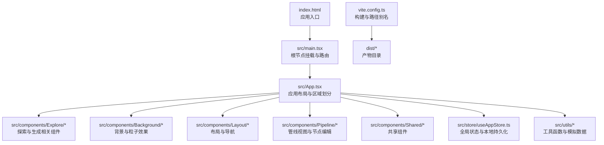
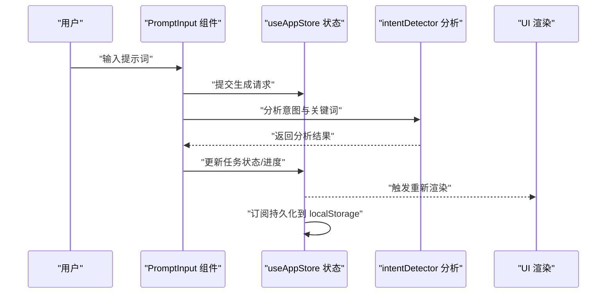
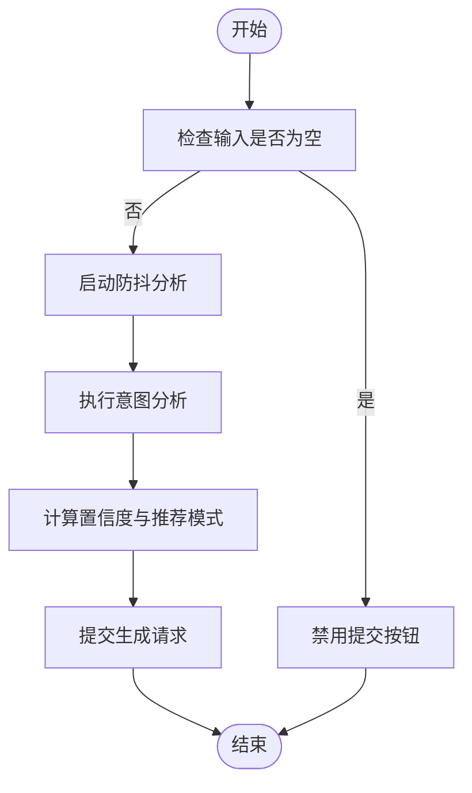
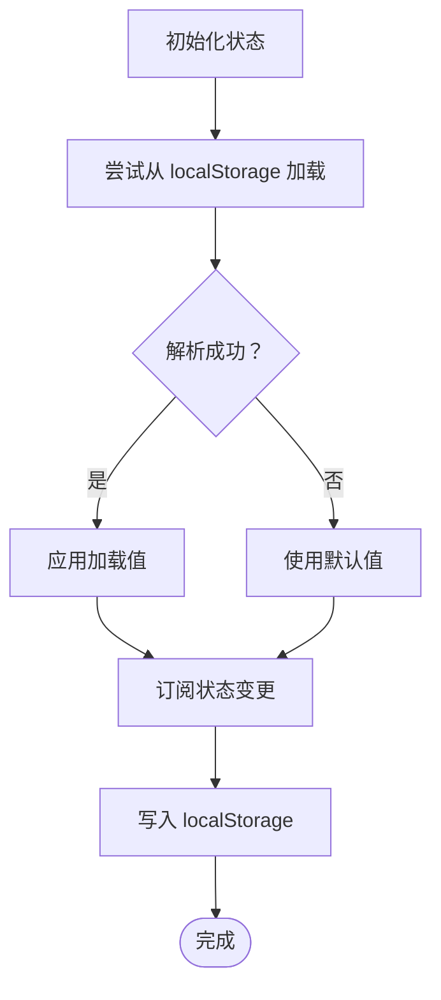
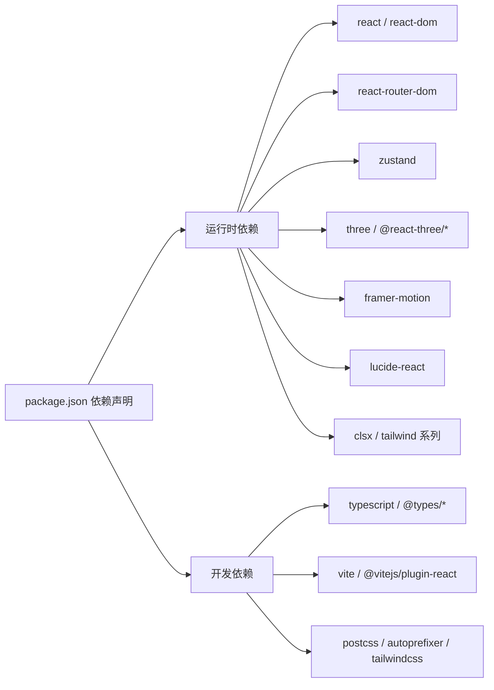

# 安全性考虑和防护

<cite>
**本文引用的文件**
- [package.json](file://package.json)
- [index.html](file://index.html)
- [vite.config.ts](file://vite.config.ts)
- [src/main.tsx](file://src/main.tsx)
- [src/App.tsx](file://src/App.tsx)
- [src/store/useAppStore.ts](file://src/store/useAppStore.ts)
- [src/components/Explore/PromptInput.tsx](file://src/components/Explore/PromptInput.tsx)
- [src/components/Explore/StyleSelector.tsx](file://src/components/Explore/StyleSelector.tsx)
- [src/utils/intentDetector.ts](file://src/utils/intentDetector.ts)
- [src/index.css](file://src/index.css)
- [src/types/index.ts](file://src/types/index.ts)
- [src/utils/mockData.ts](file://src/utils/mockData.ts)
</cite>

## 目录
1. [引言](#引言)
2. [项目结构](#项目结构)
3. [核心组件](#核心组件)
4. [架构总览](#架构总览)
5. [详细组件分析](#详细组件分析)
6. [依赖分析](#依赖分析)
7. [性能考虑](#性能考虑)
8. [故障排查指南](#故障排查指南)
9. [结论](#结论)
10. [附录](#附录)

## 引言
本指南聚焦于前端安全最佳实践，结合仓库现有代码结构，系统梳理XSS防护、CSRF保护、输入验证与数据清理、本地存储与敏感数据保护、API安全与认证授权、第三方库安全审计与依赖更新管理、内容安全策略（CSP）与安全头设置、安全漏洞检测与修复流程、用户隐私与数据合规、以及安全监控与日志记录策略。文档以渐进方式呈现，既面向技术读者也兼顾非技术读者的理解需求。

## 项目结构
该项目为基于 Vite + React + TypeScript 的前端应用，采用组件化与状态集中管理（Zustand）的组织方式。前端主要由入口脚本、路由容器、页面组件、工具函数与类型定义构成；构建与开发通过 Vite 配置进行。

图表来源
- [index.html:1-14](file://index.html#L1-L14)
- [src/main.tsx:1-14](file://src/main.tsx#L1-L14)
- [src/App.tsx:1-35](file://src/App.tsx#L1-L35)
- [vite.config.ts:1-12](file://vite.config.ts#L1-L12)

章节来源
- [index.html:1-14](file://index.html#L1-L14)
- [src/main.tsx:1-14](file://src/main.tsx#L1-L14)
- [src/App.tsx:1-35](file://src/App.tsx#L1-L35)
- [vite.config.ts:1-12](file://vite.config.ts#L1-L12)

## 核心组件
- 全局状态与本地持久化：使用 Zustand 管理用户画像、模板、任务与对话等状态，并通过订阅机制将关键状态写入 localStorage，实现跨会话持久化。
- 输入与意图分析：PromptInput 负责接收用户输入，结合 intentDetector 进行关键词匹配与意图分析，辅助推荐视图模式与参数。
- 样式与主题：通过 Tailwind/CSS 层叠与自定义样式类实现视觉一致性与交互反馈。
- 构建与开发：Vite 提供开发服务器与打包能力，支持路径别名与 React 插件。

章节来源
- [src/store/useAppStore.ts:1-451](file://src/store/useAppStore.ts#L1-L451)
- [src/components/Explore/PromptInput.tsx:1-161](file://src/components/Explore/PromptInput.tsx#L1-L161)
- [src/utils/intentDetector.ts:1-148](file://src/utils/intentDetector.ts#L1-L148)
- [src/index.css:1-108](file://src/index.css#L1-L108)
- [vite.config.ts:1-12](file://vite.config.ts#L1-L12)

## 架构总览
下图展示了前端在运行时的关键交互：用户输入经组件处理后进入状态管理，状态变更触发 UI 更新；同时，状态变更被订阅并持久化至本地存储。

图表来源
- [src/components/Explore/PromptInput.tsx:52-66](file://src/components/Explore/PromptInput.tsx#L52-L66)
- [src/utils/intentDetector.ts:77-147](file://src/utils/intentDetector.ts#L77-L147)
- [src/store/useAppStore.ts:114-136](file://src/store/useAppStore.ts#L114-L136)

## 详细组件分析

### 组件A：PromptInput 输入与意图分析
- 输入处理：防抖逻辑减少频繁分析开销；仅在回车或点击按钮时提交有效输入。
- 意图分析：调用 intentDetector 对提示词进行关键词匹配、评分与置信度计算，推荐视图模式与参数。
- 安全要点：当前未见对输入进行严格的白名单过滤或转义处理，建议在提交前进行最小权限校验与清理。

图表来源
- [src/components/Explore/PromptInput.tsx:27-50](file://src/components/Explore/PromptInput.tsx#L27-L50)
- [src/utils/intentDetector.ts:77-147](file://src/utils/intentDetector.ts#L77-L147)

章节来源
- [src/components/Explore/PromptInput.tsx:1-161](file://src/components/Explore/PromptInput.tsx#L1-L161)
- [src/utils/intentDetector.ts:1-148](file://src/utils/intentDetector.ts#L1-L148)

### 组件B：StyleSelector 风格选择
- 功能：提供风格预设选择，支持选中态视觉反馈。
- 安全要点：当前为纯前端交互，无外部输入；建议保持只读渲染，避免动态注入 HTML 或内联事件。

章节来源
- [src/components/Explore/StyleSelector.tsx:1-61](file://src/components/Explore/StyleSelector.tsx#L1-L61)

### 组件C：全局状态与本地持久化（useAppStore）
- 用户画像与模板：从 localStorage 加载初始值，异常时回退默认值；订阅状态变化并写回 localStorage。
- 安全要点：localStorage 存储用户偏好与模板，需注意以下风险与对策：
  - XSS：localStorage 本身不直接暴露给 XSS，但若 UI 直接渲染不受控数据，仍可能引发反射型 XSS。建议对所有来自状态的数据进行安全渲染。
  - CSRF：localStorage 不随同 Cookie 发送，相对更安全；但仍需确保仅在受信任上下文中读写。
  - 数据完整性：建议对序列化数据增加版本号或校验字段，防止旧版结构导致解析错误。

图表来源
- [src/store/useAppStore.ts:36-51](file://src/store/useAppStore.ts#L36-L51)
- [src/store/useAppStore.ts:396-408](file://src/store/useAppStore.ts#L396-L408)

章节来源
- [src/store/useAppStore.ts:1-451](file://src/store/useAppStore.ts#L1-L451)

### 组件D：类型与数据模型（types/index.ts）
- 角色与消息类型：明确消息角色、内容类型与元数据结构，便于统一处理与校验。
- 参数与结果：生成参数、纹理信息、任务结果等结构化数据，利于前后端契约与校验。

章节来源
- [src/types/index.ts:161-206](file://src/types/index.ts#L161-L206)
- [src/types/index.ts:42-51](file://src/types/index.ts#L42-L51)

### 组件E：工具与模拟数据（mockData.ts）
- 默认参数与编辑设置：提供合理的默认值，降低用户误操作风险。
- 风格预设：用于界面选择与演示，建议保持静态与可审计。

章节来源
- [src/utils/mockData.ts:1-189](file://src/utils/mockData.ts#L1-L189)

## 依赖分析
- 运行时依赖：React、React DOM、React Router、Zustand、Three.js 生态、Framer Motion、Lucide React、Tailwind CSS 等。
- 开发依赖：TypeScript、Vite、React 插件、PostCSS、Tailwind CSS 等。
- 安全影响：第三方库版本直接影响漏洞面；建议建立依赖审计与更新流程。

图表来源
- [package.json:11-33](file://package.json#L11-L33)

章节来源
- [package.json:1-35](file://package.json#L1-L35)

## 性能考虑
- 防抖与批处理：PromptInput 使用防抖减少分析频率，提升响应性能。
- 状态粒度：Zustand 精准更新状态，避免不必要的重渲染。
- 构建优化：Vite 提供快速热更新与生产打包能力，配合 Tailwind 去除未使用样式可减小体积。

章节来源
- [src/components/Explore/PromptInput.tsx:27-50](file://src/components/Explore/PromptInput.tsx#L27-L50)
- [src/store/useAppStore.ts:114-136](file://src/store/useAppStore.ts#L114-L136)
- [vite.config.ts:1-12](file://vite.config.ts#L1-12)

## 故障排查指南
- 输入无响应或提交失败
  - 检查输入是否为空或处于生成中状态。
  - 查看控制台是否有解析异常或网络错误。
- 意图分析不准确
  - 确认关键词库覆盖范围与提示词表达是否匹配。
  - 调整置信度阈值与推荐模式逻辑。
- 本地持久化失效
  - 检查浏览器是否禁用 localStorage。
  - 核对 JSON 序列化/反序列化是否抛出异常。
- 样式异常
  - 确认 Tailwind 类名拼写与作用域。
  - 检查 CSS 层叠与覆盖关系。

章节来源
- [src/components/Explore/PromptInput.tsx:25-66](file://src/components/Explore/PromptInput.tsx#L25-L66)
- [src/utils/intentDetector.ts:77-147](file://src/utils/intentDetector.ts#L77-L147)
- [src/store/useAppStore.ts:36-51](file://src/store/useAppStore.ts#L36-L51)
- [src/index.css:1-108](file://src/index.css#L1-L108)

## 结论
本项目在前端安全方面具备良好基础：状态集中管理、本地持久化、组件化与防抖处理。为进一步强化安全，建议补充输入验证与清理、CSP 与安全头配置、API 安全与认证授权、第三方库审计与更新、隐私与合规策略，以及安全监控与日志记录方案。这些措施将显著提升系统的整体安全性与可维护性。

## 附录

### 前端安全最佳实践清单
- XSS 防护
  - 严格限制 HTML 渲染来源，优先使用纯文本或受控组件。
  - 对用户输入进行最小权限校验与清理，避免内联事件与动态 eval。
  - 使用 CSP 限制脚本来源与内联脚本执行。
- CSRF 保护
  - 启用 SameSite Cookie、CSRF Token、Origin/Referer 校验。
  - 避免在 localStorage 中存放敏感令牌；如需，使用 HttpOnly Cookie 并配合安全属性。
- 输入验证与数据清理
  - 建立白名单与长度/字符集限制；对富文本输入进行安全净化。
  - 在提交前进行服务端二次校验与脱敏。
- 本地存储与敏感数据保护
  - localStorage 不应存储敏感信息；如必须，使用加密存储与访问控制。
  - 对模板与用户画像进行版本化与完整性校验。
- API 安全与认证授权
  - 实施强身份认证（如 OAuth 2.0/JWT），并启用多因素认证。
  - 对敏感接口进行速率限制、IP 黑名单与审计日志。
- 第三方库安全审计与依赖更新
  - 建立依赖扫描与更新策略，定期审查漏洞报告。
  - 使用锁定文件与镜像源，避免引入未知依赖。
- 内容安全策略（CSP）与安全头
  - 设置严格的 CSP，限制脚本与资源来源。
  - 配置安全头（如 X-Content-Type-Options、X-Frame-Options、Referrer-Policy）。
- 安全漏洞检测与修复流程
  - 建立自动化扫描与人工复核流程；对高危漏洞设定 SLA。
  - 修复后进行回归测试与安全验证。
- 用户隐私与数据合规
  - 明示数据收集与使用目的，提供访问、删除与导出权利。
  - 遵循适用法规（如 GDPR、CCPA），实施数据最小化与去标识化。
- 安全监控与日志记录
  - 记录登录、权限变更、敏感操作与异常行为。
  - 建立告警与联动处置机制，定期复盘与优化。