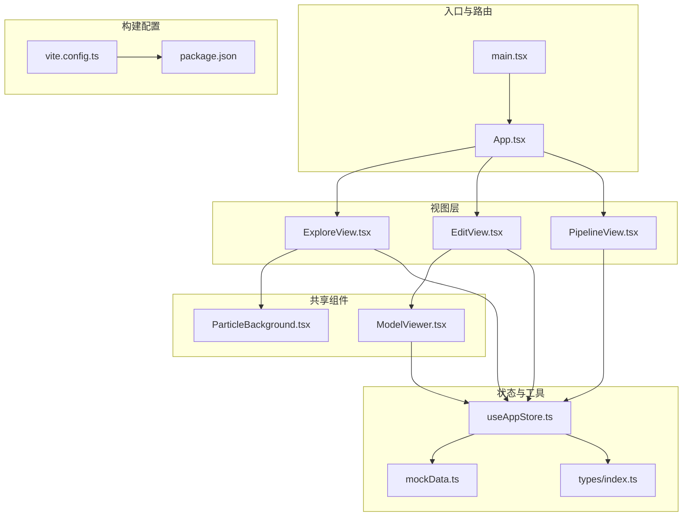
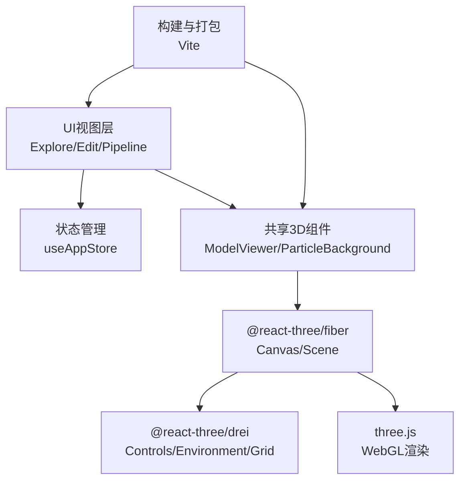
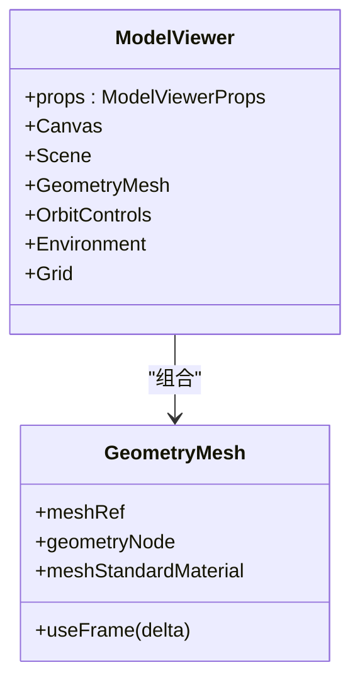
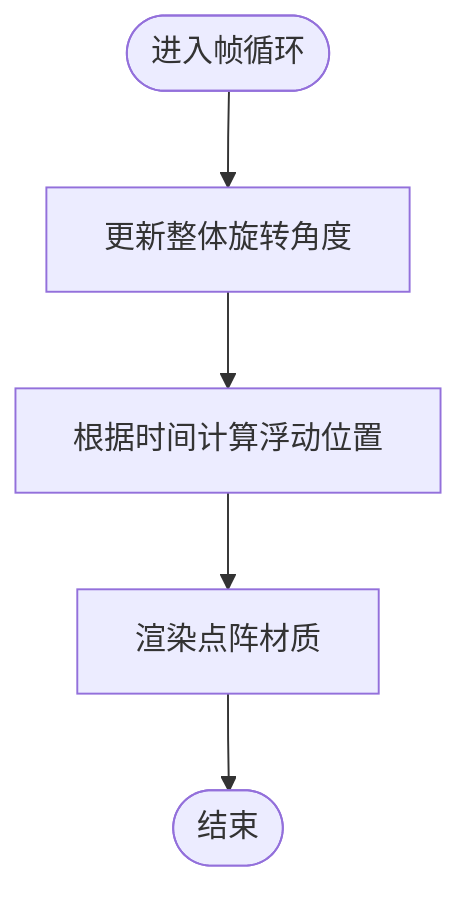
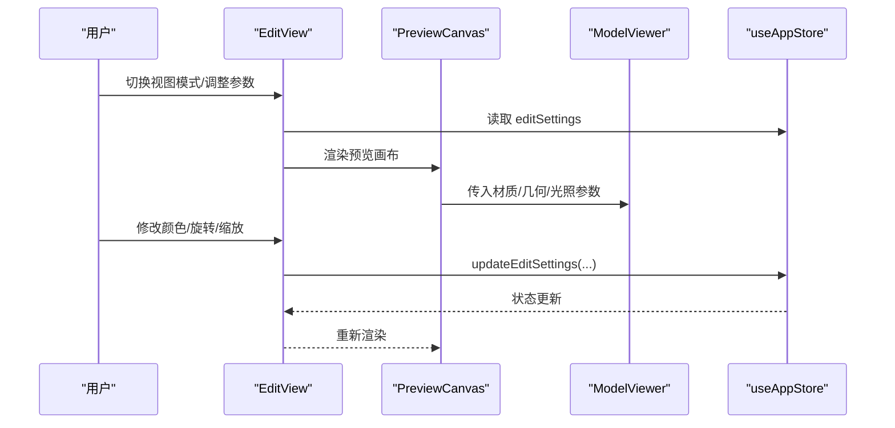
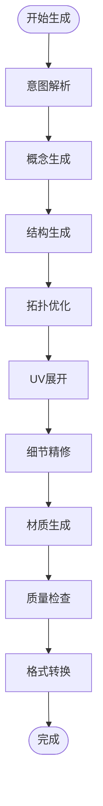
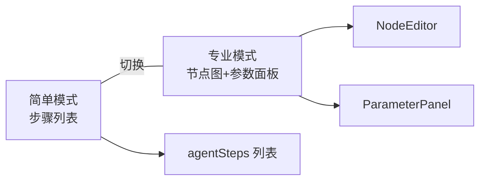
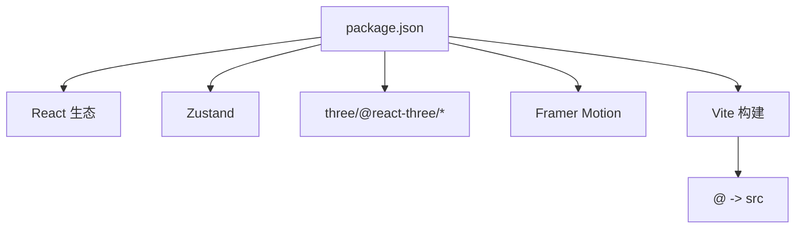

# 性能优化指南

<cite>
**本文档引用的文件**
- [main.tsx](file://src/main.tsx)
- [App.tsx](file://src/App.tsx)
- [ModelViewer.tsx](file://src/components/Shared/ModelViewer.tsx)
- [ParticleBackground.tsx](file://src/components/Background/ParticleBackground.tsx)
- [PreviewCanvas.tsx](file://src/components/Edit/PreviewCanvas.tsx)
- [MaterialPanel.tsx](file://src/components/Edit/MaterialPanel.tsx)
- [EditView.tsx](file://src/components/Edit/EditView.tsx)
- [ExploreView.tsx](file://src/components/Explore/ExploreView.tsx)
- [PipelineView.tsx](file://src/components/Pipeline/PipelineView.tsx)
- [useAppStore.ts](file://src/store/useAppStore.ts)
- [mockData.ts](file://src/utils/mockData.ts)
- [index.ts](file://src/types/index.ts)
- [vite.config.ts](file://vite.config.ts)
- [package.json](file://package.json)
</cite>

## 目录
1. [简介](#简介)
2. [项目结构](#项目结构)
3. [核心组件](#核心组件)
4. [架构总览](#架构总览)
5. [详细组件分析](#详细组件分析)
6. [依赖关系分析](#依赖关系分析)
7. [性能考量](#性能考量)
8. [故障排查指南](#故障排查指南)
9. [结论](#结论)
10. [附录](#附录)

## 简介
本指南面向3D模型生成与编辑应用的性能优化，结合项目实际实现，系统性地覆盖Three.js场景优化、材质性能调优、几何体简化策略；React组件性能优化（memoization、懒加载、代码分割）；内存管理与垃圾回收；网络请求与资源加载；动画与帧率控制；性能监控与指标分析；以及移动端适配策略。文档以渐进方式呈现，既适合初学者快速上手，也便于资深开发者深入优化。

## 项目结构
项目采用基于功能域的组织方式：按视图模块划分（Explore、Edit、Pipeline），共享组件（ModelViewer、ParticleBackground）、状态管理（Zustand）、类型定义与工具函数等。Three.js集成通过@react-three/fiber与@react-three/drei实现，UI框架基于React + Framer Motion，构建工具使用Vite。

图表来源
- [main.tsx:1-14](file://src/main.tsx#L1-L14)
- [App.tsx:1-33](file://src/App.tsx#L1-L33)
- [ExploreView.tsx:1-263](file://src/components/Explore/ExploreView.tsx#L1-L263)
- [EditView.tsx:1-159](file://src/components/Edit/EditView.tsx#L1-L159)
- [PipelineView.tsx:1-168](file://src/components/Pipeline/PipelineView.tsx#L1-L168)
- [ModelViewer.tsx:1-156](file://src/components/Shared/ModelViewer.tsx#L1-L156)
- [ParticleBackground.tsx:1-108](file://src/components/Background/ParticleBackground.tsx#L1-L108)
- [useAppStore.ts:1-451](file://src/store/useAppStore.ts#L1-L451)
- [mockData.ts:1-189](file://src/utils/mockData.ts#L1-L189)
- [index.ts:1-206](file://src/types/index.ts#L1-L206)
- [vite.config.ts:1-12](file://vite.config.ts#L1-L12)
- [package.json:1-35](file://package.json#L1-L35)

章节来源
- [main.tsx:1-14](file://src/main.tsx#L1-L14)
- [App.tsx:1-33](file://src/App.tsx#L1-L33)
- [vite.config.ts:1-12](file://vite.config.ts#L1-L12)
- [package.json:1-35](file://package.json#L1-L35)

## 核心组件
- 模型预览与编辑：ModelViewer（Three.js场景封装）、PreviewCanvas（编辑区3D画布）、MaterialPanel（材质面板）
- 场景背景：ParticleBackground（粒子背景+漂浮光球）
- 视图切换：ExploreView（探索/生成）、EditView（编辑）、PipelineView（管线）
- 状态管理：useAppStore（Zustand）集中管理任务、编辑设置、用户资料、模板等
- 类型与默认值：types/index.ts、mockData.ts

章节来源
- [ModelViewer.tsx:1-156](file://src/components/Shared/ModelViewer.tsx#L1-L156)
- [PreviewCanvas.tsx:1-54](file://src/components/Edit/PreviewCanvas.tsx#L1-L54)
- [MaterialPanel.tsx:1-209](file://src/components/Edit/MaterialPanel.tsx#L1-L209)
- [ParticleBackground.tsx:1-108](file://src/components/Background/ParticleBackground.tsx#L1-L108)
- [ExploreView.tsx:1-263](file://src/components/Explore/ExploreView.tsx#L1-L263)
- [EditView.tsx:1-159](file://src/components/Edit/EditView.tsx#L1-L159)
- [PipelineView.tsx:1-168](file://src/components/Pipeline/PipelineView.tsx#L1-L168)
- [useAppStore.ts:1-451](file://src/store/useAppStore.ts#L1-L451)
- [mockData.ts:1-189](file://src/utils/mockData.ts#L1-L189)
- [index.ts:1-206](file://src/types/index.ts#L1-L206)

## 架构总览
应用采用“视图层 + 共享3D组件 + 状态管理”的分层架构。Three.js场景在ModelViewer中统一管理，EditView通过useAppStore驱动材质、光照、几何体等参数，ExploreView负责生成流程与结果展示，PipelineView提供专业级节点图编辑能力。构建阶段由Vite处理，React生态提供UI与动画。

图表来源
- [App.tsx:10-32](file://src/App.tsx#L10-L32)
- [ModelViewer.tsx:136-153](file://src/components/Shared/ModelViewer.tsx#L136-L153)
- [ParticleBackground.tsx:88-107](file://src/components/Background/ParticleBackground.tsx#L88-L107)
- [useAppStore.ts:114-394](file://src/store/useAppStore.ts#L114-L394)
- [vite.config.ts:4-11](file://vite.config.ts#L4-L11)
- [package.json:11-21](file://package.json#L11-L21)

## 详细组件分析

### ModelViewer 组件（Three.js场景封装）
ModelViewer将几何体、材质、光照、网格、控制器等封装在一个Canvas内，支持自动旋转、多种几何体、环境贴图与网格辅助。该组件通过React.memo进行浅比较缓存，Suspense用于异步加载时的占位，useMemo避免重复创建几何体对象，useFrame按帧更新旋转。

图表来源
- [ModelViewer.tsx:136-153](file://src/components/Shared/ModelViewer.tsx#L136-L153)
- [ModelViewer.tsx:32-80](file://src/components/Shared/ModelViewer.tsx#L32-L80)
- [ModelViewer.tsx:82-126](file://src/components/Shared/ModelViewer.tsx#L82-L126)

章节来源
- [ModelViewer.tsx:1-156](file://src/components/Shared/ModelViewer.tsx#L1-L156)

### ParticleBackground 背景组件
ParticleBackground使用Points渲染大量粒子，配合useFrame实现整体旋转与单个粒子的浮动动画。通过useMemo一次性生成位置与颜色数组，减少每帧分配开销。深度写入关闭、加法混合等参数有助于视觉效果与性能平衡。

图表来源
- [ParticleBackground.tsx:34-39](file://src/components/Background/ParticleBackground.tsx#L34-L39)
- [ParticleBackground.tsx:73-78](file://src/components/Background/ParticleBackground.tsx#L73-L78)

章节来源
- [ParticleBackground.tsx:1-108](file://src/components/Background/ParticleBackground.tsx#L1-L108)

### EditView 编辑视图
EditView根据viewMode切换简单/专业模式，左侧为3D预览画布，右侧为控制面板。通过useAppStore读取与更新编辑设置（材质、旋转、缩放、光照、背景色等）。底部操作栏提供导出与分享功能。

图表来源
- [EditView.tsx:9-159](file://src/components/Edit/EditView.tsx#L9-L159)
- [PreviewCanvas.tsx:5-54](file://src/components/Edit/PreviewCanvas.tsx#L5-L54)
- [ModelViewer.tsx:136-153](file://src/components/Shared/ModelViewer.tsx#L136-L153)
- [useAppStore.ts:174-177](file://src/store/useAppStore.ts#L174-L177)

章节来源
- [EditView.tsx:1-159](file://src/components/Edit/EditView.tsx#L1-L159)
- [PreviewCanvas.tsx:1-54](file://src/components/Edit/PreviewCanvas.tsx#L1-L54)
- [useAppStore.ts:1-451](file://src/store/useAppStore.ts#L1-L451)

### ExploreView 探索视图
ExploreView负责提示输入、风格选择、生成进度与结果卡片展示。在专业模式下显示Agent步骤详情与技术参数（面数、格式、贴图信息）。通过useAppStore管理当前任务状态与参数。

图表来源
- [ExploreView.tsx:150-201](file://src/components/Explore/ExploreView.tsx#L150-L201)
- [useAppStore.ts:410-450](file://src/store/useAppStore.ts#L410-L450)

章节来源
- [ExploreView.tsx:1-263](file://src/components/Explore/ExploreView.tsx#L1-L263)
- [useAppStore.ts:114-394](file://src/store/useAppStore.ts#L114-L394)

### PipelineView 管线视图
PipelineView在简单模式下以线性步骤列表展示生成流程，在专业模式下提供节点图编辑与参数面板。通过useAppStore读取当前任务的agentSteps，支持运行控制。

图表来源
- [PipelineView.tsx:9-168](file://src/components/Pipeline/PipelineView.tsx#L9-L168)
- [useAppStore.ts:114-394](file://src/store/useAppStore.ts#L114-L394)

章节来源
- [PipelineView.tsx:1-168](file://src/components/Pipeline/PipelineView.tsx#L1-L168)
- [useAppStore.ts:114-394](file://src/store/useAppStore.ts#L114-L394)

## 依赖关系分析
- 运行时依赖：React、ReactDOM、react-router-dom、zustand、three、@react-three/fiber、@react-three/drei、framer-motion、lucide-react、clsx
- 开发依赖：@vitejs/plugin-react、tailwindcss、postcss、autoprefixer、typescript、vite
- 构建别名：@ -> src

图表来源
- [package.json:11-32](file://package.json#L11-L32)
- [vite.config.ts:6-10](file://vite.config.ts#L6-L10)

章节来源
- [package.json:1-35](file://package.json#L1-35)
- [vite.config.ts:1-12](file://vite.config.ts#L1-L12)

## 性能考量

### 3D渲染性能优化技术

- 场景优化
  - 使用useMemo缓存几何体实例，避免重复创建（如ModelViewer中的几何体节点）。
  - 合理使用环境贴图与光照，避免过多方向光源导致的阴影/反射计算开销。
  - 在非必要时禁用OrbitControls或限制交互范围，减少相机变换触发的重绘。
  - Grid网格在复杂场景中可按需显示，减少无限网格绘制成本。

- 材质性能调优
  - 优先使用基础材质（如meshStandardMaterial）而非昂贵的着色器。
  - 控制emissive强度与normalStrength，避免过高的发光与法线贴图强度。
  - 减少透明度与混合模式的使用频率，必要时开启深度写入以减少重绘。
  - 尽量复用材质与纹理，避免频繁切换材质属性。

- 几何体简化策略
  - 根据目标分辨率与设备性能选择合适的细分参数（如sphereGeometry的段数）。
  - 在移动端或低端设备上降低几何体细分，或切换为简化的几何体（box/sphere）。
  - 对于静态场景，可将几何体与材质烘焙为离线资源，减少运行时计算。

- 动画与帧率控制
  - 使用useFrame按delta时间步长更新旋转，确保不同帧率下的平滑表现。
  - 避免在每帧执行昂贵的计算（如大数组重排），将计算移到事件触发或useMemo中。
  - 对于粒子系统，合理控制粒子数量与渲染参数，避免过度绘制。

- 内存管理与垃圾回收
  - 在组件卸载时释放THREE对象引用，避免内存泄漏。
  - 合理使用BufferGeometry与BufferAttribute，避免重复分配Float32Array。
  - 使用React.memo与useMemo减少不必要的组件重渲染与对象重建。

- 网络请求与资源加载
  - 对于外部模型与纹理，使用CDN与缓存策略，减少重复下载。
  - 分批加载资源，优先加载关键资源，其余资源懒加载。
  - 使用Web Workers或后台线程处理大型数据，避免阻塞主线程。

- 移动端适配
  - 降低渲染分辨率与抗锯齿级别，启用移动端友好的环境贴图。
  - 限制同时渲染的几何体数量与材质复杂度。
  - 优化触摸交互，减少不必要的事件监听与重绘。

### React组件性能优化

- memoization
  - ModelViewer使用React.memo进行浅比较缓存，避免因父组件重渲染导致的重复挂载。
  - MaterialPanel内部使用useMemo缓存计算结果，减少子组件重渲染。
  - EditView根据viewMode切换布局，避免不必要的面板重渲染。

- 懒加载与代码分割
  - 将重型组件（如PipelineView）按需加载，减少首屏包体积。
  - 使用React.lazy与Suspense实现组件级别的懒加载。

- 状态管理优化
  - useAppStore使用Zustand，避免全局状态的深层嵌套导致的不必要重渲染。
  - 将编辑设置拆分为独立字段，仅在对应面板变化时更新，减少无关状态变更。

- 动画与过渡
  - 使用Framer Motion的AnimatePresence与motion组件，配合key切换实现流畅过渡。
  - 避免在动画过程中进行昂贵的DOM测量或样式计算。

### 性能监控与指标分析
- 帧率监控：使用浏览器开发者工具的Performance面板记录帧耗时，定位渲染瓶颈。
- 内存占用：使用Memory面板观察堆栈增长，检查是否存在未释放的THREE对象。
- 网络分析：使用Network面板分析资源加载时间与缓存命中率。
- 自定义指标：在关键路径（如生成流程）埋点，统计各阶段耗时与成功率。

### 移动端性能优化要点
- 降低几何体细分与贴图分辨率，减少GPU压力。
- 关闭或简化环境贴图与光照计算。
- 限制同时运行的动画与粒子数量。
- 使用更轻量的UI组件与动画库，减少主线程负担。

## 故障排查指南

- 模型渲染异常
  - 检查材质参数是否越界（metallic/roughness在[0,1]范围内）。
  - 确认几何体参数与细分设置合理，避免过高的顶点数。
  - 验证环境贴图与光照配置，避免过度曝光或阴影问题。

- 性能下降
  - 使用React DevTools Profiler检查组件重渲染热点。
  - 检查useFrame中的计算逻辑，避免每帧重复昂贵操作。
  - 审核粒子数量与混合模式，适当降低密度或关闭透明度。

- 内存泄漏
  - 确保在组件卸载时清理THREE对象引用与事件监听。
  - 避免在全局作用域持有组件引用。

- 网络加载缓慢
  - 检查CDN与缓存策略，确保静态资源可被缓存。
  - 分析关键路径资源，优先加载首屏所需内容。

章节来源
- [ModelViewer.tsx:136-153](file://src/components/Shared/ModelViewer.tsx#L136-L153)
- [MaterialPanel.tsx:76-80](file://src/components/Edit/MaterialPanel.tsx#L76-L80)
- [EditView.tsx:10-11](file://src/components/Edit/EditView.tsx#L10-L11)
- [ExploreView.tsx:22-24](file://src/components/Explore/ExploreView.tsx#L22-L24)
- [PipelineView.tsx:10-12](file://src/components/Pipeline/PipelineView.tsx#L10-L12)

## 结论
本指南从Three.js场景、React组件、状态管理、资源加载与移动端适配等多个维度提供了系统性的性能优化策略。结合项目现有实现（如useMemo、Suspense、React.memo、useFrame等），可在保证用户体验的同时显著提升渲染效率与交互流畅度。建议在开发过程中持续使用性能监控工具进行回归测试，确保优化措施的有效性与稳定性。

## 附录

### 关键实现参考路径
- 模型渲染与几何体缓存：[ModelViewer.tsx:51-60](file://src/components/Shared/ModelViewer.tsx#L51-L60)
- 帧更新与自动旋转：[ModelViewer.tsx:45-49](file://src/components/Shared/ModelViewer.tsx#L45-L49)
- 粒子系统与动画：[ParticleBackground.tsx:34-39](file://src/components/Background/ParticleBackground.tsx#L34-L39)
- 编辑设置与状态更新：[useAppStore.ts:174-177](file://src/store/useAppStore.ts#L174-L177)
- 生成流程模拟：[useAppStore.ts:410-450](file://src/store/useAppStore.ts#L410-L450)
- 默认参数与编辑设置：[mockData.ts:3-27](file://src/utils/mockData.ts#L3-L27)
- 类型定义与任务结构：[index.ts:13-64](file://src/types/index.ts#L13-L64)