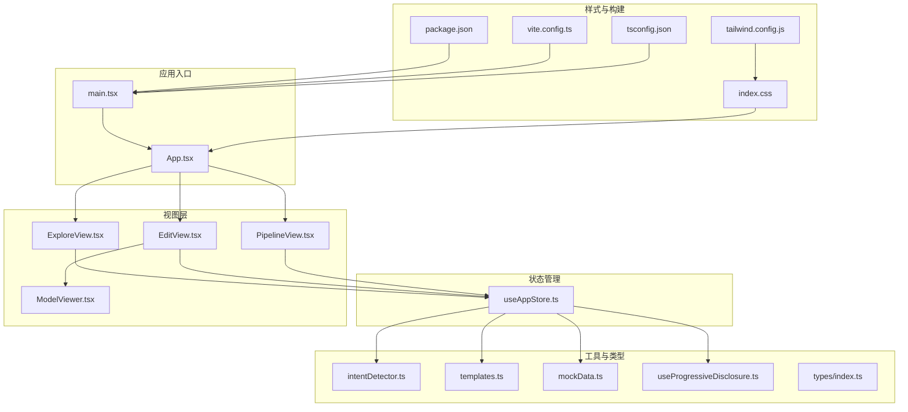
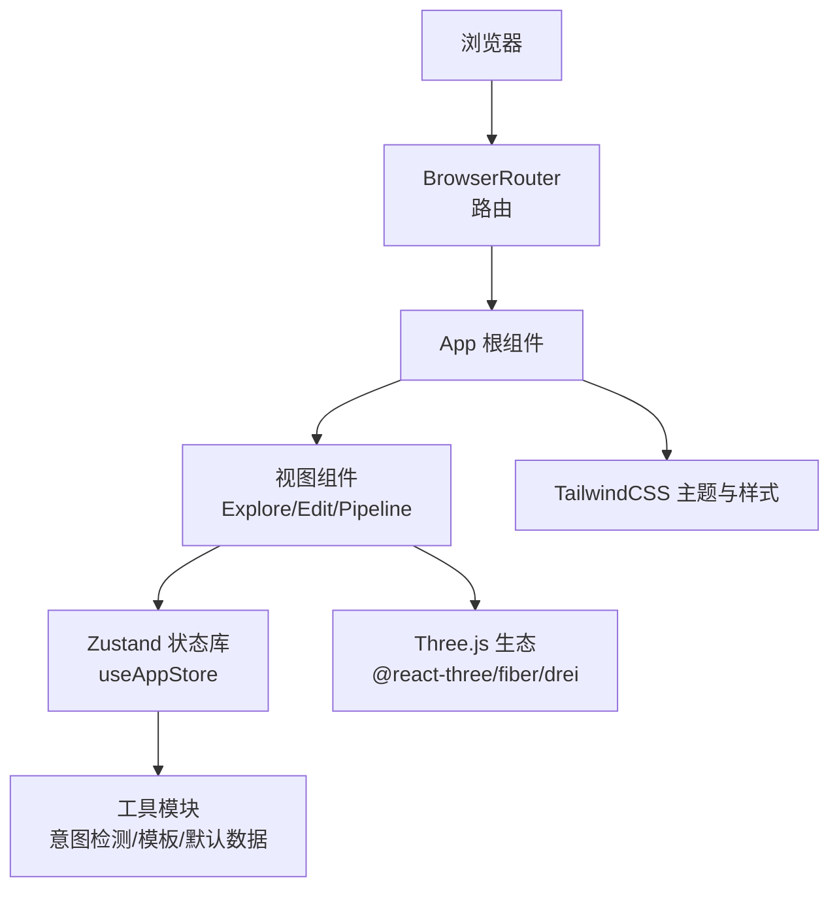
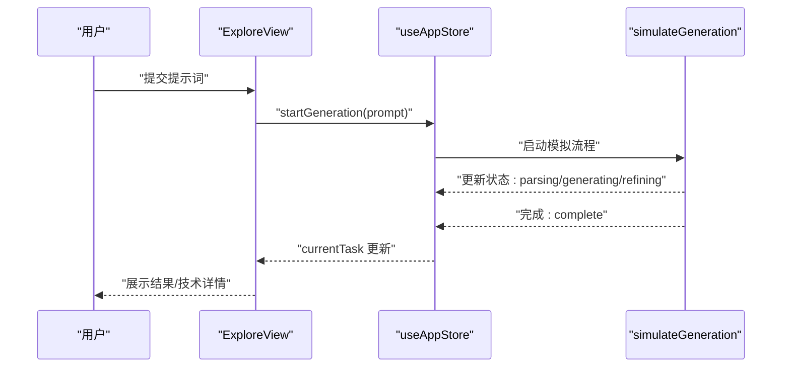
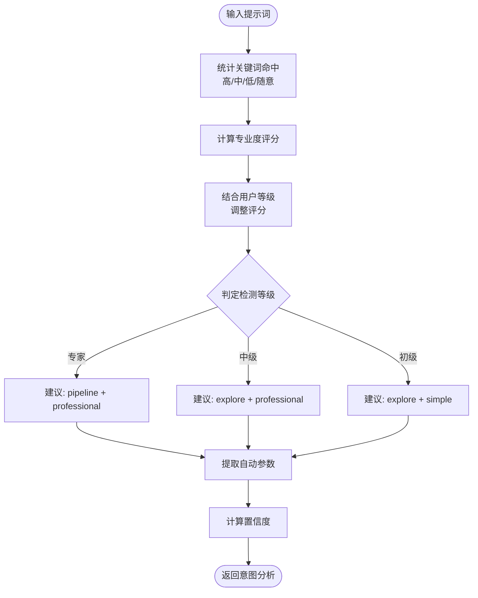
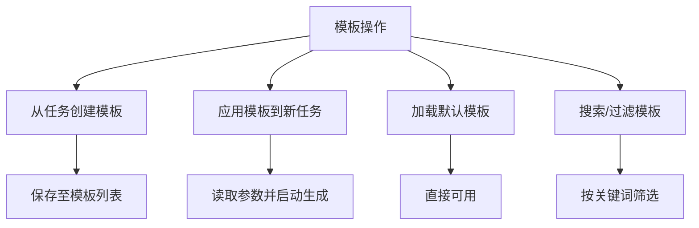
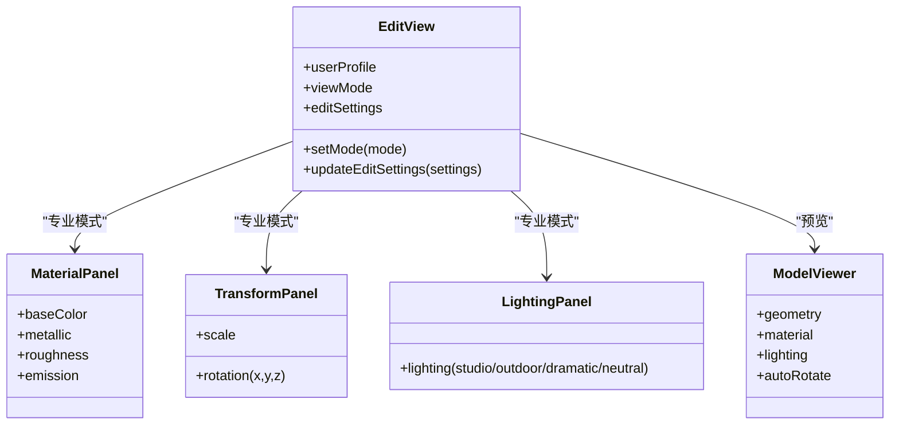
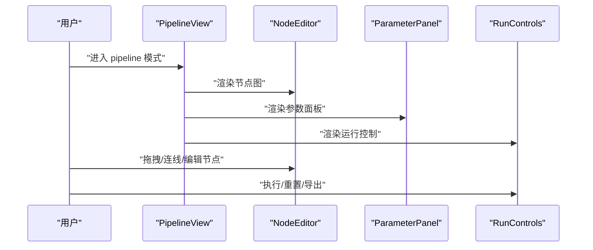
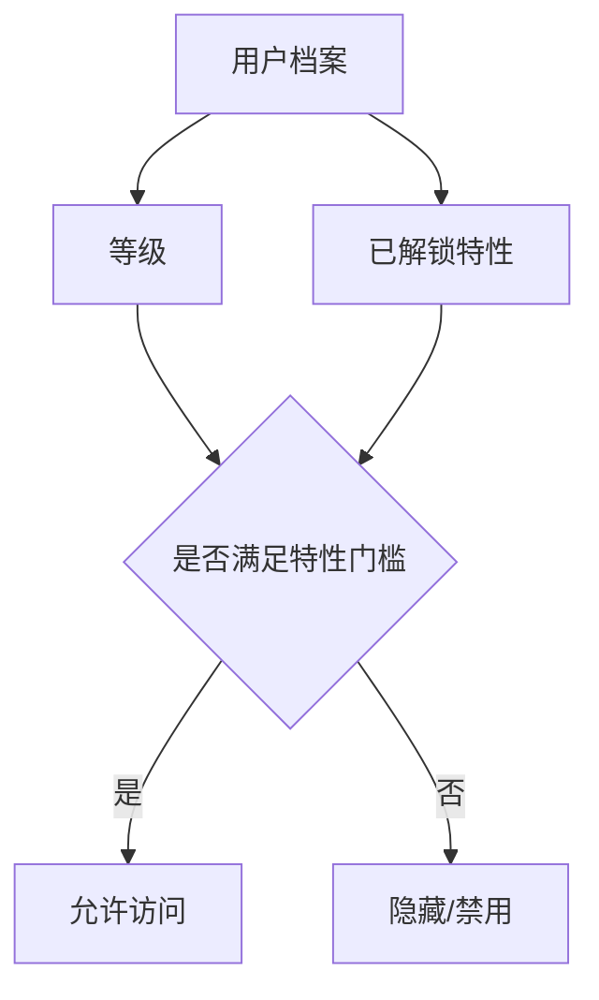
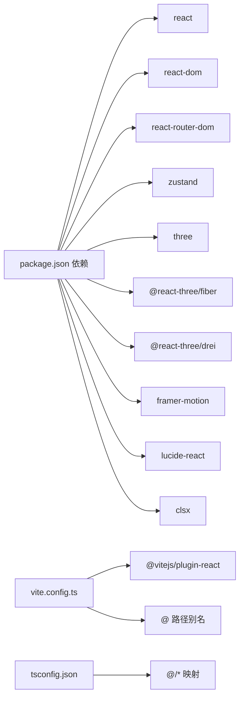

# 最佳实践和指南

<cite>
**本文引用的文件**
- [App.tsx](file://src/App.tsx)
- [main.tsx](file://src/main.tsx)
- [useAppStore.ts](file://src/store/useAppStore.ts)
- [ExploreView.tsx](file://src/components/Explore/ExploreView.tsx)
- [EditView.tsx](file://src/components/Edit/EditView.tsx)
- [PipelineView.tsx](file://src/components/Pipeline/PipelineView.tsx)
- [ModelViewer.tsx](file://src/components/Shared/ModelViewer.tsx)
- [intentDetector.ts](file://src/utils/intentDetector.ts)
- [templates.ts](file://src/utils/templates.ts)
- [mockData.ts](file://src/utils/mockData.ts)
- [useProgressiveDisclosure.ts](file://src/hooks/useProgressiveDisclosure.ts)
- [index.ts](file://src/types/index.ts)
- [index.css](file://src/index.css)
- [tailwind.config.js](file://tailwind.config.js)
- [package.json](file://package.json)
- [vite.config.ts](file://vite.config.ts)
- [tsconfig.json](file://tsconfig.json)
</cite>

## 目录
1. [简介](#简介)
2. [项目结构](#项目结构)
3. [核心组件](#核心组件)
4. [架构总览](#架构总览)
5. [详细组件分析](#详细组件分析)
6. [依赖关系分析](#依赖关系分析)
7. [性能考量](#性能考量)
8. [故障排除指南](#故障排除指南)
9. [结论](#结论)
10. [附录](#附录)

## 简介
本指南面向3D模型代理应用的开发者与使用者，系统性总结开发最佳实践、设计模式、状态管理策略、3D性能优化、用户体验设计原则、代码组织与模块化、测试与质量保障、安全注意事项以及故障排除与调试技巧。内容基于仓库现有实现进行提炼与扩展，帮助团队在保持一致性的同时提升开发效率与产品体验。

## 项目结构
项目采用以功能域为中心的目录组织方式，结合React + TypeScript + Vite + TailwindCSS的技术栈，并通过Three.js生态实现3D可视化能力。核心模块包括：
- 应用入口与路由：main.tsx、App.tsx
- 状态管理：store/useAppStore.ts（Zustand）
- 视图层：Explore/、Edit/、Pipeline/、Layout/、Shared/
- 工具与类型：utils/、hooks/、types/
- 样式与构建：index.css、tailwind.config.js、vite.config.ts、tsconfig.json

图表来源
- [main.tsx:1-14](file://src/main.tsx#L1-L14)
- [App.tsx:10-32](file://src/App.tsx#L10-L32)
- [useAppStore.ts:100-311](file://src/store/useAppStore.ts#L100-L311)
- [ExploreView.tsx:11-262](file://src/components/Explore/ExploreView.tsx#L11-L262)
- [EditView.tsx:9-158](file://src/components/Edit/EditView.tsx#L9-L158)
- [PipelineView.tsx:9-167](file://src/components/Pipeline/PipelineView.tsx#L9-L167)
- [ModelViewer.tsx:136-155](file://src/components/Shared/ModelViewer.tsx#L136-L155)
- [intentDetector.ts:77-147](file://src/utils/intentDetector.ts#L77-L147)
- [templates.ts:4-114](file://src/utils/templates.ts#L4-L114)
- [mockData.ts:3-189](file://src/utils/mockData.ts#L3-L189)
- [useProgressiveDisclosure.ts:60-135](file://src/hooks/useProgressiveDisclosure.ts#L60-L135)
- [index.ts:1-160](file://src/types/index.ts#L1-L160)
- [index.css:1-108](file://src/index.css#L1-L108)
- [tailwind.config.js:1-61](file://tailwind.config.js#L1-L61)
- [package.json:1-35](file://package.json#L1-L35)
- [vite.config.ts:1-12](file://vite.config.ts#L1-L12)
- [tsconfig.json:1-25](file://tsconfig.json#L1-L25)

章节来源
- [main.tsx:1-14](file://src/main.tsx#L1-L14)
- [App.tsx:10-32](file://src/App.tsx#L10-L32)
- [package.json:1-35](file://package.json#L1-L35)
- [vite.config.ts:1-12](file://vite.config.ts#L1-L12)
- [tsconfig.json:1-25](file://tsconfig.json#L1-L25)

## 核心组件
- 应用根组件负责根据当前模式渲染Explore/Edit/Pipeline视图，并挂载粒子背景与头部导航。
- 状态管理集中于useAppStore，涵盖模式切换、生成任务生命周期、编辑设置、用户档案、模板、意图分析与等级通知等。
- 视图层组件按功能拆分，分别处理提示词输入、风格选择、生成进度、结果卡片、编辑面板、管线节点与参数面板等。
- 3D预览由ModelViewer封装，基于@react-three/fiber与drei，支持多种几何体、材质与光照预设。
- 工具模块提供意图检测、模板管理与默认数据，辅助生成参数推断与用户引导。

章节来源
- [App.tsx:10-32](file://src/App.tsx#L10-L32)
- [useAppStore.ts:50-98](file://src/store/useAppStore.ts#L50-L98)
- [ExploreView.tsx:11-262](file://src/components/Explore/ExploreView.tsx#L11-L262)
- [EditView.tsx:9-158](file://src/components/Edit/EditView.tsx#L9-L158)
- [PipelineView.tsx:9-167](file://src/components/Pipeline/PipelineView.tsx#L9-L167)
- [ModelViewer.tsx:136-155](file://src/components/Shared/ModelViewer.tsx#L136-L155)
- [intentDetector.ts:77-147](file://src/utils/intentDetector.ts#L77-L147)
- [templates.ts:4-114](file://src/utils/templates.ts#L4-L114)
- [mockData.ts:3-189](file://src/utils/mockData.ts#L3-L189)

## 架构总览
应用采用“单页应用 + 功能域组件 + 轻量状态库”的前端架构。路由由BrowserRouter提供，模式切换通过Zustand全局状态驱动，3D渲染通过Three.js生态实现。UI采用TailwindCSS定制主题，配合动画库实现流畅过渡。

图表来源
- [main.tsx:7-13](file://src/main.tsx#L7-L13)
- [App.tsx:10-32](file://src/App.tsx#L10-L32)
- [useAppStore.ts:100-311](file://src/store/useAppStore.ts#L100-L311)
- [ExploreView.tsx:11-262](file://src/components/Explore/ExploreView.tsx#L11-L262)
- [EditView.tsx:9-158](file://src/components/Edit/EditView.tsx#L9-L158)
- [PipelineView.tsx:9-167](file://src/components/Pipeline/PipelineView.tsx#L9-L167)
- [ModelViewer.tsx:136-155](file://src/components/Shared/ModelViewer.tsx#L136-L155)
- [intentDetector.ts:77-147](file://src/utils/intentDetector.ts#L77-L147)
- [templates.ts:4-114](file://src/utils/templates.ts#L4-L114)
- [index.css:1-108](file://src/index.css#L1-L108)
- [tailwind.config.js:1-61](file://tailwind.config.js#L1-L61)

## 详细组件分析

### 状态管理与用户成长体系
- 全局状态：模式、生成任务、编辑设置、侧边栏、用户档案、模板、意图分析、等级通知。
- 用户成长：使用次数驱动等级升级，解锁特性与模式访问权限；支持手动跳级与最近解锁提示。
- 本地持久化：订阅状态变更，将用户档案与模板写入localStorage。
- 生成模拟：按阶段推进任务状态与步骤进度，最终完成并归档历史。

图表来源
- [ExploreView.tsx:11-262](file://src/components/Explore/ExploreView.tsx#L11-L262)
- [useAppStore.ts:107-122](file://src/store/useAppStore.ts#L107-L122)
- [useAppStore.ts:327-367](file://src/store/useAppStore.ts#L327-L367)

章节来源
- [useAppStore.ts:50-98](file://src/store/useAppStore.ts#L50-L98)
- [useAppStore.ts:171-215](file://src/store/useAppStore.ts#L171-L215)
- [useAppStore.ts:313-325](file://src/store/useAppStore.ts#L313-L325)
- [useAppStore.ts:327-367](file://src/store/useAppStore.ts#L327-L367)

### 意图检测与智能推荐
- 关键词库：按专业程度分级，统计命中数量与匹配关键词。
- 自动参数提取：从提示词中识别输出格式、贴图分辨率、拓扑类型与面数预算。
- 推荐模式与视图：根据检测等级与用户历史等级，给出建议模式与视图模式。
- 置信度计算：综合评分与命中数，结合用户等级进行加权。

图表来源
- [intentDetector.ts:77-147](file://src/utils/intentDetector.ts#L77-L147)

章节来源
- [intentDetector.ts:3-147](file://src/utils/intentDetector.ts#L3-L147)

### 模板系统与参数复用
- 从任务创建模板：复制参数与步骤，生成可分享/复用的模板。
- 应用模板：一键套用模板参数，快速生成相似风格模型。
- 默认模板：内置游戏资产、影视级、3D打印等常用模板，便于新手起步。
- 搜索与过滤：按名称、描述、标签检索模板。

图表来源
- [templates.ts:4-114](file://src/utils/templates.ts#L4-L114)

章节来源
- [templates.ts:4-114](file://src/utils/templates.ts#L4-L114)

### 编辑视图与材质/变换/光照面板
- 简单模式：基础颜色选择、缩放与旋转控制。
- 专业模式：完整材质、变换、光照面板，支持导出与进入管线视图。
- 预览画布：基于ModelViewer，支持多种几何体、材质属性与光照预设。

图表来源
- [EditView.tsx:9-158](file://src/components/Edit/EditView.tsx#L9-L158)
- [ModelViewer.tsx:136-155](file://src/components/Shared/ModelViewer.tsx#L136-L155)

章节来源
- [EditView.tsx:9-158](file://src/components/Edit/EditView.tsx#L9-L158)
- [ModelViewer.tsx:136-155](file://src/components/Shared/ModelViewer.tsx#L136-L155)

### 管线视图与节点编辑
- 简单模式：线性步骤列表，显示状态与进度。
- 专业模式：节点图编辑器，参数面板与运行控制分离，支持复杂工作流编排。

图表来源
- [PipelineView.tsx:9-167](file://src/components/Pipeline/PipelineView.tsx#L9-L167)

章节来源
- [PipelineView.tsx:9-167](file://src/components/Pipeline/PipelineView.tsx#L9-L167)

### 用户成长与特性门控
- 特性门控：按用户等级与使用次数解锁特性，限制对高级功能的访问。
- 模式门控：不同模式对应最低等级要求。
- 升级提示：当达到阈值时触发升级提示，展示新增特性。

图表来源
- [useProgressiveDisclosure.ts:60-135](file://src/hooks/useProgressiveDisclosure.ts#L60-L135)
- [useAppStore.ts:171-215](file://src/store/useAppStore.ts#L171-L215)

章节来源
- [useProgressiveDisclosure.ts:60-135](file://src/hooks/useProgressiveDisclosure.ts#L60-L135)
- [useAppStore.ts:171-215](file://src/store/useAppStore.ts#L171-L215)

## 依赖关系分析
- 运行时依赖：React、ReactDOM、路由、状态库、Three.js生态、动画库、图标库、工具类库。
- 开发依赖：TypeScript、Vite、TailwindCSS及相关插件。
- 构建与路径别名：Vite配置启用React插件与路径别名@指向src；TypeScript启用严格模式与路径映射。

图表来源
- [package.json:11-22](file://package.json#L11-L22)
- [vite.config.ts:1-12](file://vite.config.ts#L1-L12)
- [tsconfig.json:19-21](file://tsconfig.json#L19-L21)

章节来源
- [package.json:1-35](file://package.json#L1-L35)
- [vite.config.ts:1-12](file://vite.config.ts#L1-L12)
- [tsconfig.json:1-25](file://tsconfig.json#L1-L25)

## 性能考量
- 3D渲染优化
  - 合理设置相机与视野，避免过度放大导致几何体失真与采样噪声。
  - 使用材质属性（金属度、粗糙度、自发光强度）平衡视觉效果与GPU开销。
  - 在简单模式下减少网格复杂度与贴图分辨率，必要时启用自动旋转以降低交互成本。
  - 控制光照类型与环境贴图数量，避免过多光源造成过载。
  - 使用Suspense与渐进式加载，避免阻塞主线程。
- 状态与渲染优化
  - 将昂贵计算放入Zustand动作内部，避免重复渲染。
  - 对频繁更新的状态进行节流或防抖，如进度条与滑块输入。
  - 使用React.memo包裹重型子组件，减少无意义重渲染。
- UI与动画
  - 使用轻量动画库实现过渡，避免复杂CSS动画影响帧率。
  - 合理使用backdrop blur与阴影，注意在低端设备上的性能表现。
- 构建与资源
  - 启用Tree Shaking与按需导入，减少打包体积。
  - 使用Tailwind按需扫描，避免引入未使用样式。
  - 在生产环境开启压缩与缓存策略。

## 故障排除指南
- 3D模型不显示或渲染异常
  - 检查Canvas初始化参数（相机位置、FOV、透明度）与Suspense占位。
  - 确认材质属性范围合理（如金属度/粗糙度在[0,1]），避免无效值。
  - 若出现闪烁或卡顿，尝试降低贴图分辨率或关闭复杂光照。
- 状态不同步或丢失
  - 确认Zustand订阅已正确持久化到localStorage，检查键名与序列化逻辑。
  - 避免在动作内直接修改深层对象，使用不可变更新策略。
- 生成流程不推进
  - 检查模拟函数的时间间隔与阶段映射，确保状态字段与进度计算一致。
  - 核对任务历史归档逻辑，确认完成回调被调用。
- 意图检测不准确
  - 扩展关键词库与正则规则，提高自动参数提取的覆盖率。
  - 调整置信度计算权重，结合用户历史行为动态校准。
- 模板应用失败
  - 校验模板参数与当前版本的兼容性，必要时添加迁移逻辑。
  - 检查模板搜索与过滤逻辑，确保大小写与空格处理一致。

章节来源
- [ModelViewer.tsx:136-155](file://src/components/Shared/ModelViewer.tsx#L136-L155)
- [useAppStore.ts:313-325](file://src/store/useAppStore.ts#L313-L325)
- [useAppStore.ts:327-367](file://src/store/useAppStore.ts#L327-L367)
- [intentDetector.ts:77-147](file://src/utils/intentDetector.ts#L77-L147)
- [templates.ts:4-114](file://src/utils/templates.ts#L4-L114)

## 结论
本指南总结了项目在状态管理、3D渲染、意图检测、模板系统与用户成长等方面的实现要点与优化策略。建议在后续迭代中持续完善测试覆盖、安全审计与性能监控，以保障复杂场景下的稳定性与可维护性。

## 附录
- 开发规范与设计模式建议
  - 组件设计：单一职责、可组合、可测试；使用React.memo与细粒度状态拆分。
  - 状态管理：优先使用Zustand，避免过度嵌套；动作内聚合更新，减少订阅范围。
  - 数据流：单向数据流，事件向上冒泡，状态向下传递。
  - 设计模式：观察者（状态订阅）、策略（视图模式切换）、工厂（默认数据与模板）。
- 用户体验设计原则
  - 渐进式披露：从简单到专业的渐进式功能开放。
  - 一致性：统一的颜色、字体、间距与动效节奏。
  - 反馈：明确的加载、成功、错误状态提示。
  - 可访问性：键盘导航、语义化标签与对比度。
- 代码组织与模块化
  - 按功能域划分目录，共享组件与工具独立存放。
  - 类型定义集中管理，避免循环依赖。
  - 路径别名统一，提升可读性与可移植性。
- 测试策略与质量保证
  - 单元测试：核心算法（意图检测、模板应用、默认数据）。
  - 集成测试：组件组合与状态联动。
  - E2E测试：关键流程（提示词输入→生成→导出）。
  - 质量门禁：类型检查、代码规范、覆盖率阈值。
- 安全性考虑与防护措施
  - 输入验证：对提示词与参数进行白名单与范围校验。
  - 权限控制：基于用户等级与特性门控限制敏感操作。
  - 存储安全：仅存储必要信息，避免敏感数据落盘。
  - 依赖审计：定期更新依赖，关注安全公告。
- 故障排除与调试技巧
  - 使用浏览器开发者工具定位渲染瓶颈与内存泄漏。
  - 在Zustand中启用日志或时间旅行调试，追踪状态变化轨迹。
  - 3D场景中启用辅助网格与轴心，快速定位几何体问题。
  - 分阶段回滚：先冻结功能，再逐步排查具体模块。