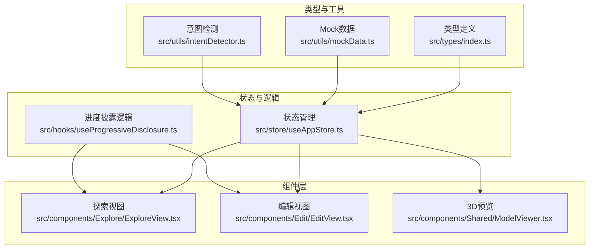
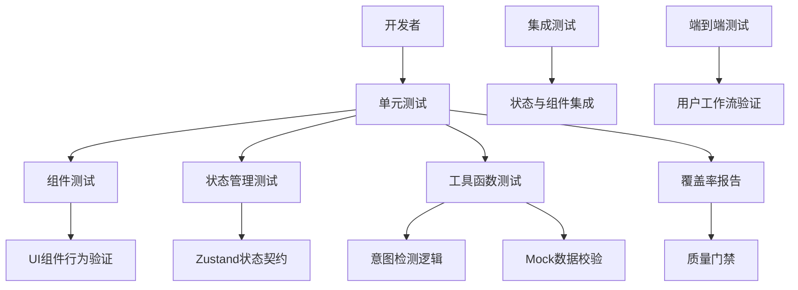
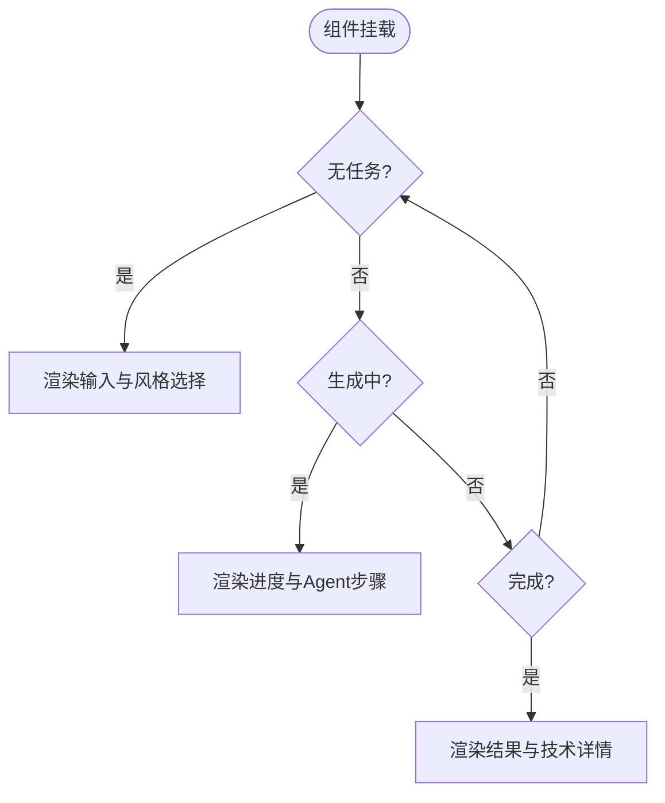
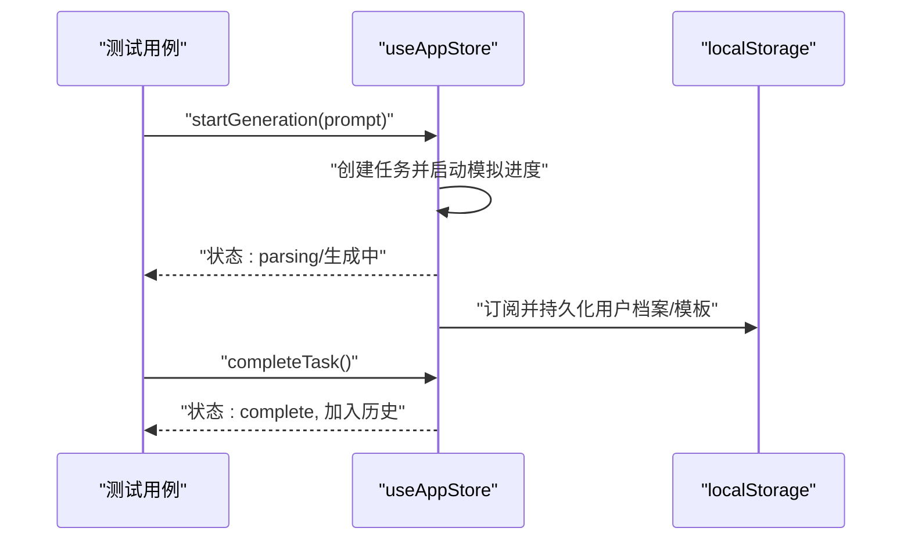
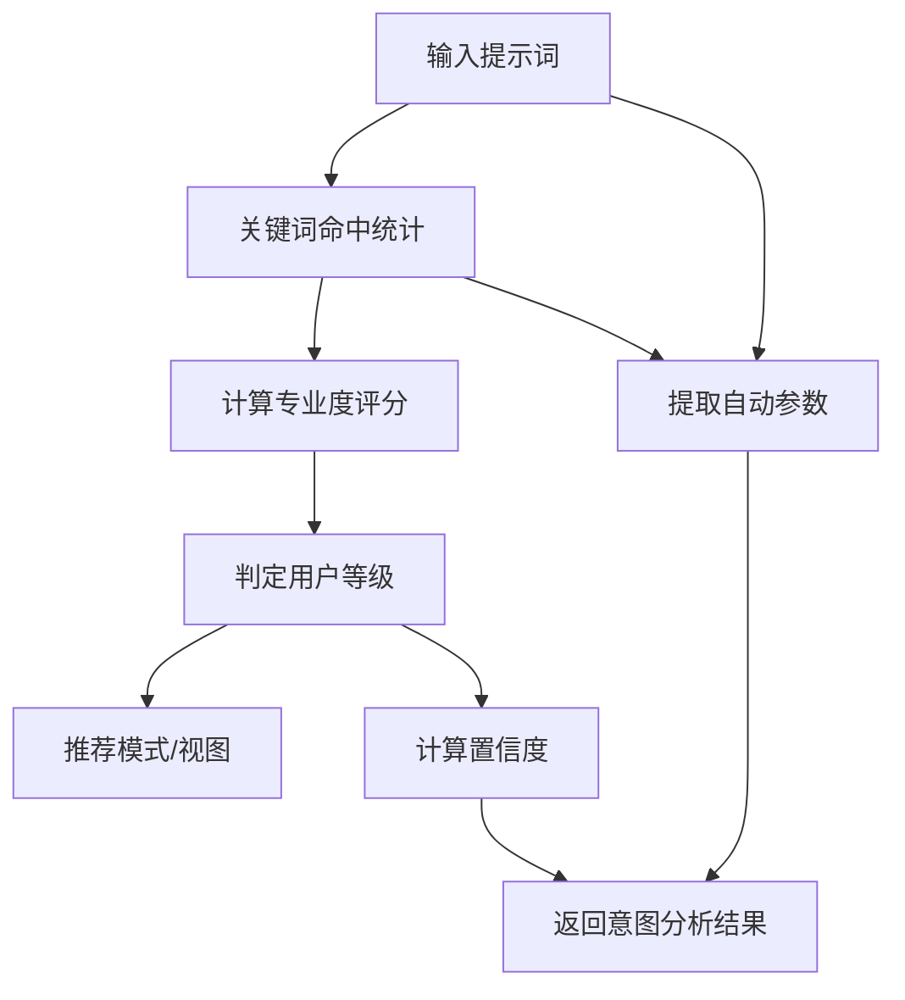
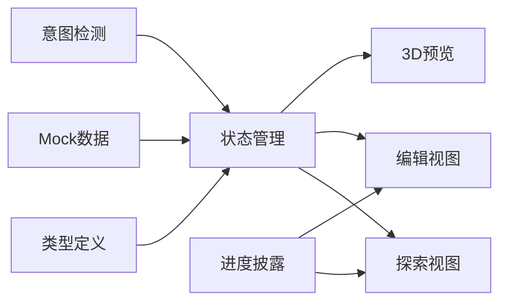

# 测试策略和质量保证

<cite>
**本文档引用的文件**
- [package.json](file://package.json)
- [vite.config.ts](file://vite.config.ts)
- [tsconfig.json](file://tsconfig.json)
- [src/types/index.ts](file://src/types/index.ts)
- [src/utils/mockData.ts](file://src/utils/mockData.ts)
- [src/utils/intentDetector.ts](file://src/utils/intentDetector.ts)
- [src/store/useAppStore.ts](file://src/store/useAppStore.ts)
- [src/hooks/useProgressiveDisclosure.ts](file://src/hooks/useProgressiveDisclosure.ts)
- [src/components/Shared/ModelViewer.tsx](file://src/components/Shared/ModelViewer.tsx)
- [src/components/Explore/ExploreView.tsx](file://src/components/Explore/ExploreView.tsx)
- [src/components/Edit/EditView.tsx](file://src/components/Edit/EditView.tsx)
</cite>

## 目录
1. [引言](#引言)
2. [项目结构](#项目结构)
3. [核心组件](#核心组件)
4. [架构总览](#架构总览)
5. [详细组件分析](#详细组件分析)
6. [依赖分析](#依赖分析)
7. [性能考虑](#性能考虑)
8. [故障排查指南](#故障排查指南)
9. [结论](#结论)
10. [附录](#附录)

## 引言
本指南面向3D模型代理前端应用，提供从单元测试、组件测试、状态管理测试到工具函数测试的完整测试策略，并扩展至集成测试与端到端测试、Mock数据与测试环境配置、代码覆盖率与质量门禁、持续集成与自动化测试流程、性能与压力测试、安全测试与漏洞扫描，以及测试数据管理与测试环境隔离等实践建议。目标是帮助团队建立可维护、可验证、可演进的质量保障体系。

## 项目结构
项目采用基于功能域的组织方式，核心模块包括：
- 类型定义：集中于类型声明与接口，确保跨层一致性
- 工具函数：Mock数据与意图检测逻辑
- 状态管理：基于Zustand的状态容器
- Hooks：业务级逻辑封装
- 组件：UI与交互层
- 构建与配置：Vite、TypeScript、Tailwind等

图表来源
- [src/types/index.ts:1-206](file://src/types/index.ts#L1-L206)
- [src/utils/mockData.ts:1-189](file://src/utils/mockData.ts#L1-L189)
- [src/utils/intentDetector.ts:1-148](file://src/utils/intentDetector.ts#L1-L148)
- [src/store/useAppStore.ts:1-451](file://src/store/useAppStore.ts#L1-L451)
- [src/hooks/useProgressiveDisclosure.ts:1-136](file://src/hooks/useProgressiveDisclosure.ts#L1-L136)
- [src/components/Explore/ExploreView.tsx:1-263](file://src/components/Explore/ExploreView.tsx#L1-L263)
- [src/components/Edit/EditView.tsx:1-159](file://src/components/Edit/EditView.tsx#L1-L159)
- [src/components/Shared/ModelViewer.tsx:1-156](file://src/components/Shared/ModelViewer.tsx#L1-L156)

章节来源
- [package.json:1-35](file://package.json#L1-L35)
- [vite.config.ts:1-12](file://vite.config.ts#L1-L12)
- [tsconfig.json:1-25](file://tsconfig.json#L1-L25)

## 核心组件
- 类型系统：统一定义应用模式、生成任务、编辑设置、用户档案、对话消息等核心类型，为测试提供稳定的契约边界
- Mock数据：提供默认参数、编辑设置、风格预设、Agent步骤等，便于组件与状态测试
- 意图检测：根据提示词与用户画像推断用户级别、建议模式、置信度与自动参数
- 状态管理：集中管理应用模式、生成任务、编辑设置、模板、用户档案、对话会话等
- 进度披露：基于用户使用次数与等级计算功能可用性与升级提示
- 视图组件：探索视图、编辑视图与3D预览组件，承载用户交互与状态展示

章节来源
- [src/types/index.ts:1-206](file://src/types/index.ts#L1-L206)
- [src/utils/mockData.ts:1-189](file://src/utils/mockData.ts#L1-L189)
- [src/utils/intentDetector.ts:1-148](file://src/utils/intentDetector.ts#L1-L148)
- [src/store/useAppStore.ts:1-451](file://src/store/useAppStore.ts#L1-L451)
- [src/hooks/useProgressiveDisclosure.ts:1-136](file://src/hooks/useProgressiveDisclosure.ts#L1-L136)
- [src/components/Explore/ExploreView.tsx:1-263](file://src/components/Explore/ExploreView.tsx#L1-L263)
- [src/components/Edit/EditView.tsx:1-159](file://src/components/Edit/EditView.tsx#L1-L159)
- [src/components/Shared/ModelViewer.tsx:1-156](file://src/components/Shared/ModelViewer.tsx#L1-L156)

## 架构总览
下图展示了测试策略在系统中的位置与职责分工：

## 详细组件分析

### 单元测试编写规范与用例设计原则
- 针对纯函数与无副作用逻辑优先进行单元测试，如意图检测函数、Mock数据构造器
- 使用最小化输入与明确期望输出，避免外部依赖耦合
- 通过参数化测试覆盖边界条件与异常路径
- 保持测试命名清晰，体现“输入-行为-期望”的三段式结构

适用范围
- 工具函数：意图检测、Mock数据构造
- 类型定义：接口一致性与边界值校验

章节来源
- [src/utils/intentDetector.ts:1-148](file://src/utils/intentDetector.ts#L1-L148)
- [src/utils/mockData.ts:1-189](file://src/utils/mockData.ts#L1-L189)
- [src/types/index.ts:1-206](file://src/types/index.ts#L1-L206)

### 组件测试策略
- 覆盖渲染分支：探索视图在空闲、生成中、完成三种状态下的不同渲染路径
- 覆盖交互事件：参数面板开关、滑块变更、按钮点击、颜色选择等
- 覆盖模式切换：简单/专业视图模式下的差异渲染
- 使用轻量快照或结构化断言，避免脆弱的视觉断言

图表来源
- [src/components/Explore/ExploreView.tsx:1-263](file://src/components/Explore/ExploreView.tsx#L1-L263)

章节来源
- [src/components/Explore/ExploreView.tsx:1-263](file://src/components/Explore/ExploreView.tsx#L1-L263)
- [src/components/Edit/EditView.tsx:1-159](file://src/components/Edit/EditView.tsx#L1-L159)

### 状态管理测试策略（Zustand）
- 行为契约：生成任务生命周期、编辑设置更新、用户档案与等级提升、模板增删改查、对话会话管理
- 并发与异步：模拟生成进度推进、完成回调、持久化订阅
- 边界与回退：非法输入、本地存储异常、空状态恢复

图表来源
- [src/store/useAppStore.ts:114-451](file://src/store/useAppStore.ts#L114-L451)

章节来源
- [src/store/useAppStore.ts:1-451](file://src/store/useAppStore.ts#L1-L451)

### 工具函数测试策略
- 意图检测：关键词命中统计、专业度评分、等级判定、模式建议、置信度计算、自动参数提取
- Mock数据：默认参数、编辑设置、风格预设、Agent步骤结构完整性与连接关系

图表来源
- [src/utils/intentDetector.ts:77-147](file://src/utils/intentDetector.ts#L77-L147)

章节来源
- [src/utils/intentDetector.ts:1-148](file://src/utils/intentDetector.ts#L1-L148)
- [src/utils/mockData.ts:1-189](file://src/utils/mockData.ts#L1-L189)

### 集成测试策略
- 状态与组件集成：验证状态变化驱动UI渲染、事件处理正确触发状态更新
- 模拟外部依赖：对localStorage读写进行Mock，避免真实持久化影响测试稳定性
- 场景驱动：生成任务全流程、编辑设置联动、对话会话交互

章节来源
- [src/store/useAppStore.ts:396-408](file://src/store/useAppStore.ts#L396-L408)
- [src/components/Explore/ExploreView.tsx:1-263](file://src/components/Explore/ExploreView.tsx#L1-L263)
- [src/components/Edit/EditView.tsx:1-159](file://src/components/Edit/EditView.tsx#L1-L159)

### 端到端测试策略
- 用户工作流：从输入提示词到生成完成的完整路径；从探索到编辑再到导出
- 关键路径：参数面板切换、风格选择、生成进度观察、结果卡片展示、导出动作
- 环境一致性：使用与生产相近的构建产物与路由配置

章节来源
- [vite.config.ts:1-12](file://vite.config.ts#L1-L12)
- [src/components/Explore/ExploreView.tsx:1-263](file://src/components/Explore/ExploreView.tsx#L1-L263)
- [src/components/Edit/EditView.tsx:1-159](file://src/components/Edit/EditView.tsx#L1-L159)

### Mock数据与测试环境配置
- Mock数据用途：默认参数、编辑设置、风格预设、Agent步骤，用于初始化与断言
- 测试环境隔离：通过独立的测试入口与别名配置，避免污染主应用上下文
- TypeScript严格性：启用严格模式与路径映射，确保类型安全

章节来源
- [src/utils/mockData.ts:1-189](file://src/utils/mockData.ts#L1-L189)
- [vite.config.ts:1-12](file://vite.config.ts#L1-L12)
- [tsconfig.json:1-25](file://tsconfig.json#L1-L25)

### 代码覆盖率与质量门禁
- 覆盖率指标建议：
  - 行覆盖率：≥80%
  - 分支覆盖率：≥70%
  - 函数覆盖率：≥85%
  - 语句覆盖率：≥80%
- 质量门禁：
  - 未达标的PR禁止合并
  - 低覆盖率文件需有合理解释或补充测试
  - 每个公共函数至少一条正向与一条反向用例

[本节为通用实践建议，无需特定文件引用]

### 持续集成与自动化测试流程
- CI流水线建议阶段：
  - 安装依赖与类型检查
  - 单元测试与覆盖率收集
  - 集成测试（可选）
  - 端到端测试（可选）
  - 代码质量扫描（ESLint/Tailwind规则）
- 缓存与并发：缓存依赖与构建产物，合理拆分测试任务并行执行
- 报告与通知：上传覆盖率报告与测试日志，失败时邮件/IM通知

[本节为通用实践建议，无需特定文件引用]

### 性能测试与压力测试
- 单元性能：对热点函数（如意图检测）进行基准测试，设定阈值
- 组件渲染：使用React Profiler测量关键组件渲染时间，识别长任务
- 状态更新：对高频状态更新（如滑块拖动）进行节流/防抖验证
- 压力场景：大量生成任务并发、复杂3D场景渲染、大量对话消息滚动

[本节为通用实践建议，无需特定文件引用]

### 安全测试与漏洞扫描
- 依赖安全：定期扫描依赖漏洞，修复高危与严重风险
- 输入验证：对用户输入进行白名单过滤与长度限制
- 权限与特性门控：基于用户等级与使用次数的特性访问控制
- 静态分析：启用TypeScript严格模式与ESLint规则，减少潜在缺陷

章节来源
- [src/hooks/useProgressiveDisclosure.ts:1-136](file://src/hooks/useProgressiveDisclosure.ts#L1-L136)

### 测试数据管理与测试环境隔离
- 测试数据：使用Mock数据作为默认输入，必要时动态生成边界数据
- 环境隔离：测试使用独立的localStorage键空间或内存存储；避免与生产数据混淆
- 清理与复位：每个测试用例前后清理状态，确保测试可重复

章节来源
- [src/store/useAppStore.ts:20-51](file://src/store/useAppStore.ts#L20-L51)
- [src/utils/mockData.ts:1-189](file://src/utils/mockData.ts#L1-L189)

## 依赖分析
- 内聚与解耦：类型定义与工具函数内聚，状态管理与组件层解耦
- 外部依赖：Zustand、Three.js、@react-three/fiber、framer-motion、lucide-react
- 潜在循环：当前结构未见直接循环依赖

图表来源
- [src/types/index.ts:1-206](file://src/types/index.ts#L1-L206)
- [src/utils/mockData.ts:1-189](file://src/utils/mockData.ts#L1-L189)
- [src/utils/intentDetector.ts:1-148](file://src/utils/intentDetector.ts#L1-L148)
- [src/store/useAppStore.ts:1-451](file://src/store/useAppStore.ts#L1-L451)
- [src/hooks/useProgressiveDisclosure.ts:1-136](file://src/hooks/useProgressiveDisclosure.ts#L1-L136)
- [src/components/Explore/ExploreView.tsx:1-263](file://src/components/Explore/ExploreView.tsx#L1-L263)
- [src/components/Edit/EditView.tsx:1-159](file://src/components/Edit/EditView.tsx#L1-L159)
- [src/components/Shared/ModelViewer.tsx:1-156](file://src/components/Shared/ModelViewer.tsx#L1-L156)

## 性能考虑
- 渲染优化：组件使用memo化与按需加载，避免不必要的重渲染
- 状态粒度：拆分细粒度状态，减少无关状态变更引发的渲染
- 动画与资源：控制动画帧率与资源加载时机，避免阻塞主线程

[本节为通用实践建议，无需特定文件引用]

## 故障排查指南
- 状态未更新：检查状态更新函数调用链与订阅逻辑
- 本地存储异常：确认序列化/反序列化与异常捕获
- 组件渲染异常：核对状态到UI的映射与条件渲染分支
- 意图检测偏差：核查关键词命中与评分阈值

章节来源
- [src/store/useAppStore.ts:396-408](file://src/store/useAppStore.ts#L396-L408)
- [src/utils/intentDetector.ts:77-147](file://src/utils/intentDetector.ts#L77-L147)

## 结论
通过将单元测试、组件测试、状态管理测试与工具函数测试相结合，并辅以集成与端到端测试，配合Mock数据与测试环境隔离、覆盖率与质量门禁、持续集成与自动化流程、性能与安全测试，可有效保障3D模型代理应用的稳定性与可维护性。建议在开发过程中持续完善测试矩阵，逐步提升覆盖率与质量门槛。

## 附录
- 测试文件命名规范：以“组件名.test.ts”或“函数名.test.ts”命名
- 快照与断言：优先结构化断言，谨慎使用快照
- Mock策略：对外部依赖进行最小化Mock，聚焦被测单元行为

[本节为通用实践建议，无需特定文件引用]