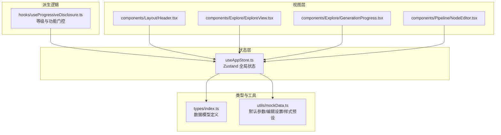
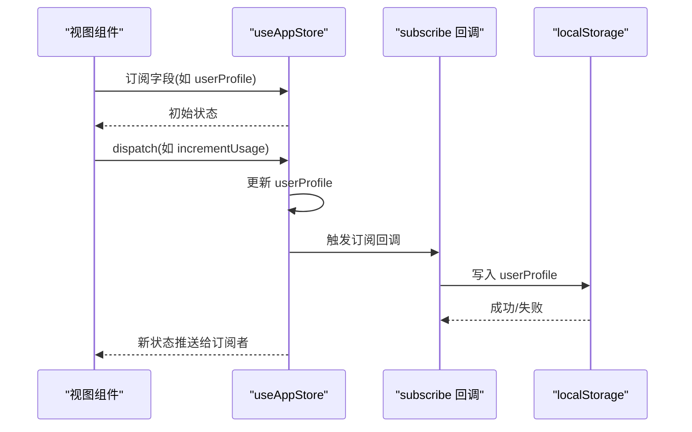
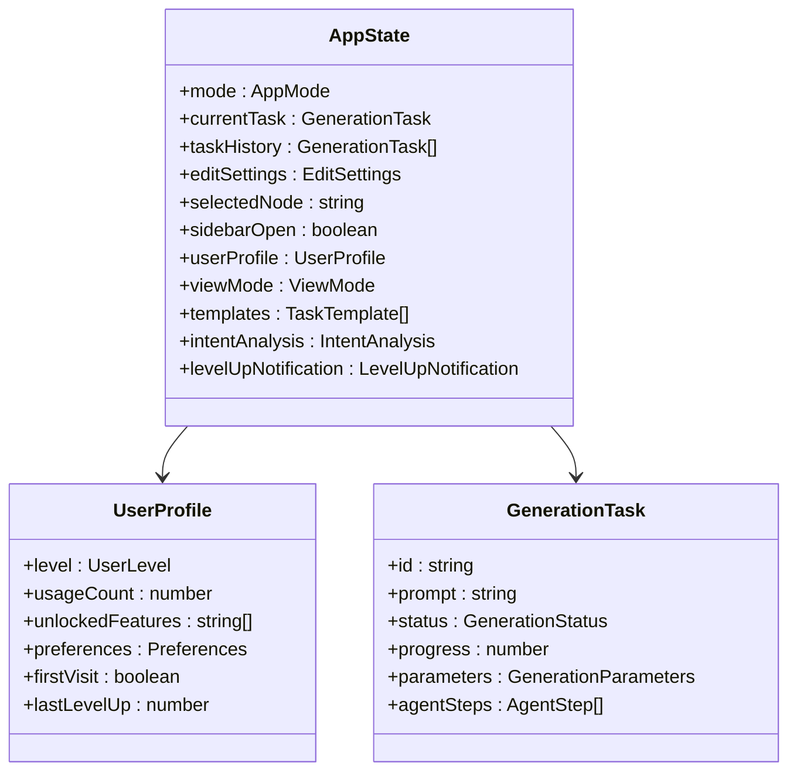
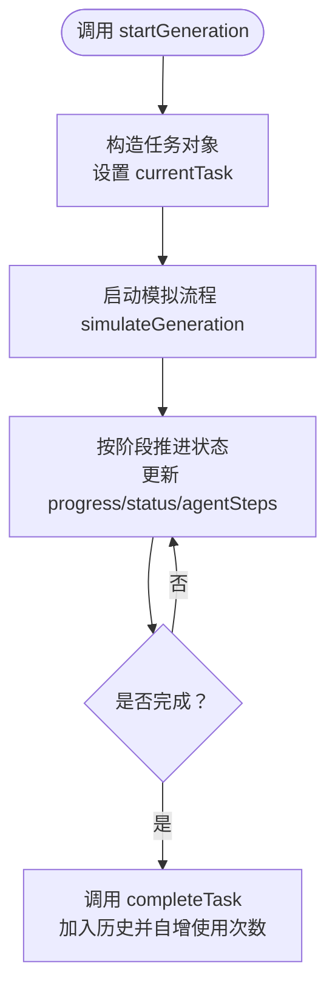
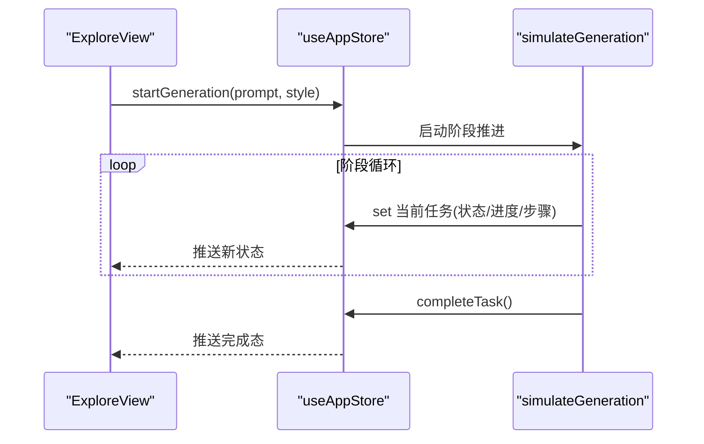
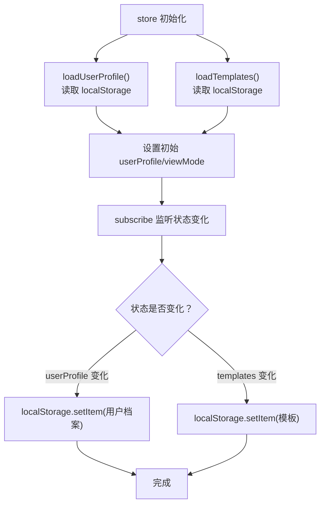
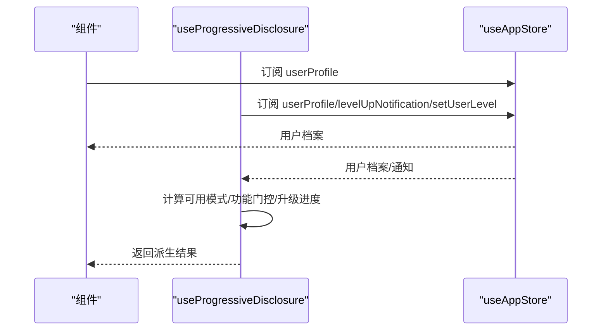
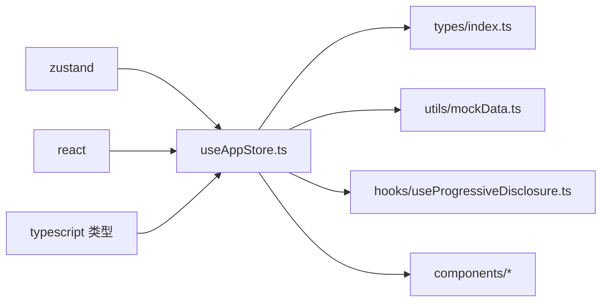

# 状态管理最佳实践

<cite>
**本文引用的文件**
- [useAppStore.ts](file://src/store/useAppStore.ts)
- [index.ts](file://src/types/index.ts)
- [mockData.ts](file://src/utils/mockData.ts)
- [useProgressiveDisclosure.ts](file://src/hooks/useProgressiveDisclosure.ts)
- [Header.tsx](file://src/components/Layout/Header.tsx)
- [ExploreView.tsx](file://src/components/Explore/ExploreView.tsx)
- [GenerationProgress.tsx](file://src/components/Explore/GenerationProgress.tsx)
- [NodeEditor.tsx](file://src/components/Pipeline/NodeEditor.tsx)
- [package.json](file://package.json)
</cite>

## 目录
1. [引言](#引言)
2. [项目结构](#项目结构)
3. [核心组件](#核心组件)
4. [架构总览](#架构总览)
5. [详细组件分析](#详细组件分析)
6. [依赖关系分析](#依赖关系分析)
7. [性能考量](#性能考量)
8. [故障排查指南](#故障排查指南)
9. [结论](#结论)
10. [附录](#附录)

## 引言
本指南围绕 Zustand 在本项目中的实际应用，系统总结状态管理最佳实践，涵盖状态结构设计、Action 组织方式、异步状态处理、持久化与 localStorage 集成、订阅与副作用、调试与性能监控、模块化与代码分割、状态迁移与版本兼容、以及错误边界与状态恢复等主题。文档以仓库现有实现为依据，结合组件与 Hook 的使用方式，给出可操作的建议与图示。

## 项目结构
本项目采用以功能域为中心的目录组织：store 定义全局状态，types 定义数据模型，utils 提供默认配置与模拟数据，hooks 封装基于 store 的派生逻辑，components 按页面/功能模块划分并消费 store。

图表来源
- [useAppStore.ts:1-368](file://src/store/useAppStore.ts#L1-L368)
- [index.ts:1-160](file://src/types/index.ts#L1-L160)
- [mockData.ts:1-189](file://src/utils/mockData.ts#L1-L189)
- [useProgressiveDisclosure.ts:1-136](file://src/hooks/useProgressiveDisclosure.ts#L1-L136)
- [Header.tsx:1-78](file://src/components/Layout/Header.tsx#L1-L78)
- [ExploreView.tsx:1-263](file://src/components/Explore/ExploreView.tsx#L1-L263)
- [GenerationProgress.tsx:1-20](file://src/components/Explore/GenerationProgress.tsx#L1-L20)
- [NodeEditor.tsx:1-141](file://src/components/Pipeline/NodeEditor.tsx#L1-L141)

章节来源
- [useAppStore.ts:1-368](file://src/store/useAppStore.ts#L1-L368)
- [index.ts:1-160](file://src/types/index.ts#L1-L160)
- [mockData.ts:1-189](file://src/utils/mockData.ts#L1-L189)
- [useProgressiveDisclosure.ts:1-136](file://src/hooks/useProgressiveDisclosure.ts#L1-L136)
- [Header.tsx:1-78](file://src/components/Layout/Header.tsx#L1-L78)
- [ExploreView.tsx:1-263](file://src/components/Explore/ExploreView.tsx#L1-L263)
- [GenerationProgress.tsx:1-20](file://src/components/Explore/GenerationProgress.tsx#L1-L20)
- [NodeEditor.tsx:1-141](file://src/components/Pipeline/NodeEditor.tsx#L1-L141)

## 核心组件
- 全局状态容器：通过 Zustand 创建，集中管理应用模式、生成任务、编辑设置、模板、用户档案、意图分析与等级提示等。
- 类型系统：统一的数据契约，确保状态结构与 Action 的一致性。
- 派生 Hook：将用户档案派生为可用功能、可访问模式、升级进度等，避免在组件内重复计算。
- 视图组件：按需订阅 store，渲染不同阶段的状态与交互。

章节来源
- [useAppStore.ts:50-98](file://src/store/useAppStore.ts#L50-L98)
- [index.ts:1-160](file://src/types/index.ts#L1-L160)
- [useProgressiveDisclosure.ts:48-135](file://src/hooks/useProgressiveDisclosure.ts#L48-L135)
- [Header.tsx:8-77](file://src/components/Layout/Header.tsx#L8-L77)
- [ExploreView.tsx:11-262](file://src/components/Explore/ExploreView.tsx#L11-L262)

## 架构总览
Zustand 作为单一真相源，通过 subscribe 订阅关键状态变更并持久化到 localStorage；组件通过选择器函数订阅所需字段，减少重渲染；派生 Hook 将复杂的状态计算外置，提升可维护性。

图表来源
- [useAppStore.ts:313-325](file://src/store/useAppStore.ts#L313-L325)

章节来源
- [useAppStore.ts:313-325](file://src/store/useAppStore.ts#L313-L325)

## 详细组件分析

### 状态结构设计
- 分区清晰：将状态划分为模式、生成、编辑、管道、UI、用户档案、模板、意图分析、等级提示等子域，便于职责分离与组合订阅。
- 默认值与加载：在 store 初始化时从 localStorage 加载用户档案与模板，保证刷新后体验连续。
- 嵌套对象与数组：如 UserProfile、GenerationTask、TaskTemplate、AgentStep 等，均通过类型约束，降低误用风险。

图表来源
- [useAppStore.ts:50-98](file://src/store/useAppStore.ts#L50-L98)
- [index.ts:105-116](file://src/types/index.ts#L105-L116)
- [index.ts:13-26](file://src/types/index.ts#L13-L26)

章节来源
- [useAppStore.ts:50-98](file://src/store/useAppStore.ts#L50-L98)
- [index.ts:105-116](file://src/types/index.ts#L105-L116)
- [index.ts:13-26](file://src/types/index.ts#L13-L26)

### Action 组织方式
- 同步更新：如切换模式、更新编辑设置、切换侧边栏等，直接 set。
- 复合更新：如开始生成、完成任务、增量更新用户使用计数与等级，使用 get 获取当前状态，再 set 合并。
- 纯函数式：部分逻辑（如级别阈值、功能门控）抽离到独立 Hook，保持 store 的简洁。

图表来源
- [useAppStore.ts:107-122](file://src/store/useAppStore.ts#L107-L122)
- [useAppStore.ts:327-367](file://src/store/useAppStore.ts#L327-L367)

章节来源
- [useAppStore.ts:107-122](file://src/store/useAppStore.ts#L107-L122)
- [useAppStore.ts:131-158](file://src/store/useAppStore.ts#L131-L158)
- [useAppStore.ts:327-367](file://src/store/useAppStore.ts#L327-L367)

### 异步状态处理
- 模拟异步：通过定时器分阶段推进任务状态与步骤进度，避免阻塞 UI。
- 真实异步：建议在真实网络请求中，先 set 空闲/解析/生成/精修等阶段状态，再根据响应 set 成功或错误，最后 completeTask 或回滚。

图表来源
- [ExploreView.tsx:11-262](file://src/components/Explore/ExploreView.tsx#L11-L262)
- [useAppStore.ts:107-122](file://src/store/useAppStore.ts#L107-L122)
- [useAppStore.ts:327-367](file://src/store/useAppStore.ts#L327-L367)

章节来源
- [ExploreView.tsx:11-262](file://src/components/Explore/ExploreView.tsx#L11-L262)
- [useAppStore.ts:107-122](file://src/store/useAppStore.ts#L107-L122)
- [useAppStore.ts:327-367](file://src/store/useAppStore.ts#L327-L367)

### 状态持久化策略与 localStorage 集成
- 关键键名：用户档案与模板分别使用独立键名，避免冲突。
- 订阅持久化：通过 subscribe 比较前后状态差异，仅在变更时写入，减少 IO。
- 异常兜底：try/catch 包裹序列化写入，防止异常中断 UI 流程。
- 初始化加载：store 创建时从 localStorage 读取，保证刷新后状态延续。

图表来源
- [useAppStore.ts:34-48](file://src/store/useAppStore.ts#L34-L48)
- [useAppStore.ts:313-325](file://src/store/useAppStore.ts#L313-L325)

章节来源
- [useAppStore.ts:34-48](file://src/store/useAppStore.ts#L34-L48)
- [useAppStore.ts:313-325](file://src/store/useAppStore.ts#L313-L325)

### 状态订阅与副作用处理
- 组件订阅：视图组件通过选择器订阅所需字段，避免整 store 重渲染。
- 派生订阅：Hook 使用选择器聚合多个字段，计算可用模式、功能门控、升级进度等。
- 副作用隔离：将副作用（如持久化、导航、通知）放在 store 的 subscribe 或组件副作用中，保持 Action 纯净。

图表来源
- [Header.tsx:8-10](file://src/components/Layout/Header.tsx#L8-L10)
- [useProgressiveDisclosure.ts:60-135](file://src/hooks/useProgressiveDisclosure.ts#L60-L135)

章节来源
- [Header.tsx:8-10](file://src/components/Layout/Header.tsx#L8-L10)
- [useProgressiveDisclosure.ts:60-135](file://src/hooks/useProgressiveDisclosure.ts#L60-L135)

### 状态调试技巧与性能监控
- 调试：利用 subscribe 输出状态快照，定位异常更新；在开发环境打印关键字段变化。
- 性能：优先使用选择器订阅，避免订阅整 store；对昂贵计算放入 useMemo/useCallback；批量更新时合并 set 调用。
- 监控：统计 Action 调用频率与耗时，识别热点路径；观察订阅回调触发次数，避免冗余写入。

（本节为通用指导，不直接分析具体文件）

### 状态模块化与代码分割策略
- 按领域拆分：将用户、生成、编辑、管道、模板等功能域拆分为独立 store 或 Hook，降低耦合。
- 代码分割：路由级懒加载配合 store 的按需初始化，避免一次性加载所有状态。
- 组合订阅：在高层组件聚合多个选择器，减少子组件订阅数量。

（本节为通用指导，不直接分析具体文件）

### 状态迁移与版本兼容
- 版本标识：在用户档案中增加版本号字段，用于迁移判断。
- 渐进迁移：在初始化时检测旧字段并迁移至新结构，保持向后兼容。
- 默认回退：对缺失字段提供安全默认值，避免初始化失败。

（本节为通用指导，不直接分析具体文件）

### 错误边界与状态恢复机制
- 错误捕获：在网络请求或本地存储异常时，捕获错误并回滚到上一稳定状态。
- 状态恢复：提供“重试”“撤销”“恢复默认”等能力，保障用户体验。
- 降级策略：当某块状态损坏时，允许局部重置而不影响整体。

（本节为通用指导，不直接分析具体文件）

## 依赖关系分析
- Zustand：状态容器与订阅机制的核心依赖。
- React：组件订阅 store 的基础。
- 类型系统：通过 TypeScript 类型约束保证状态结构正确性。

图表来源
- [package.json:11-21](file://package.json#L11-L21)
- [useAppStore.ts:1-15](file://src/store/useAppStore.ts#L1-L15)
- [index.ts:1-160](file://src/types/index.ts#L1-L160)
- [mockData.ts:1-189](file://src/utils/mockData.ts#L1-L189)
- [useProgressiveDisclosure.ts:1-3](file://src/hooks/useProgressiveDisclosure.ts#L1-L3)

章节来源
- [package.json:11-21](file://package.json#L11-L21)
- [useAppStore.ts:1-15](file://src/store/useAppStore.ts#L1-L15)
- [index.ts:1-160](file://src/types/index.ts#L1-L160)
- [mockData.ts:1-189](file://src/utils/mockData.ts#L1-L189)
- [useProgressiveDisclosure.ts:1-3](file://src/hooks/useProgressiveDisclosure.ts#L1-L3)

## 性能考量
- 减少订阅范围：仅订阅必要字段，避免整 store 订阅导致的全量重渲染。
- 合理拆分 Action：将大事务拆分为多个小 Action，便于追踪与优化。
- 批量更新：在一次事件中合并多次 set 调用，减少中间态渲染。
- 持久化节流：对频繁变更的状态，考虑去抖/节流后再写入 localStorage。

（本节为通用指导，不直接分析具体文件）

## 故障排查指南
- 状态未持久化：检查 subscribe 条件与键名是否匹配；确认 try/catch 是否吞掉异常。
- 状态不更新：确认组件是否使用选择器订阅；检查 Action 中是否正确 set。
- 性能问题：排查整 store 订阅、重复计算与不必要的重渲染；使用 React DevTools Profiler 定位热点。

章节来源
- [useAppStore.ts:313-325](file://src/store/useAppStore.ts#L313-L325)
- [useProgressiveDisclosure.ts:60-135](file://src/hooks/useProgressiveDisclosure.ts#L60-L135)

## 结论
本项目以 Zustand 为核心，结合类型系统、派生 Hook 与组件订阅，实现了清晰、可维护且具备良好扩展性的状态管理方案。通过持久化、异步模拟、订阅与副作用分离等实践，既保证了开发效率，也为后续的功能演进与性能优化打下坚实基础。

## 附录
- 关键实现参考路径
  - [useAppStore.ts:100-311](file://src/store/useAppStore.ts#L100-L311)：状态定义与 Action 实现
  - [index.ts:105-116](file://src/types/index.ts#L105-L116)：用户档案类型定义
  - [mockData.ts:3-27](file://src/utils/mockData.ts#L3-L27)：默认参数与编辑设置
  - [useProgressiveDisclosure.ts:60-135](file://src/hooks/useProgressiveDisclosure.ts#L60-L135)：功能门控与等级进度
  - [Header.tsx:8-10](file://src/components/Layout/Header.tsx#L8-L10)：视图订阅示例
  - [ExploreView.tsx:11-262](file://src/components/Explore/ExploreView.tsx#L11-L262)：生成流程与状态渲染
  - [GenerationProgress.tsx:13-20](file://src/components/Explore/GenerationProgress.tsx#L13-L20)：进度条订阅与渲染
  - [NodeEditor.tsx:9-141](file://src/components/Pipeline/NodeEditor.tsx#L9-L141)：管道视图与状态联动