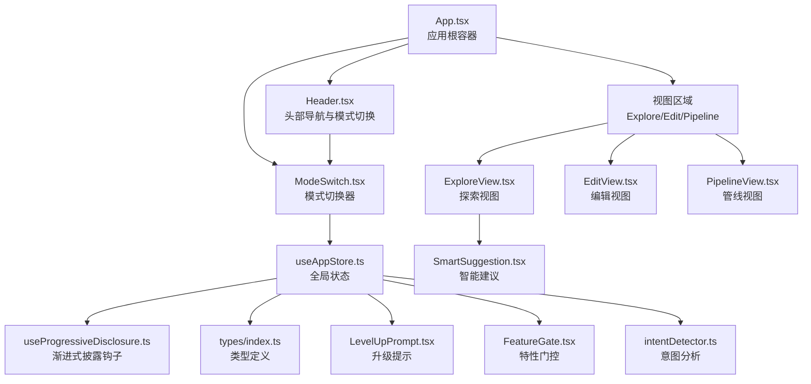
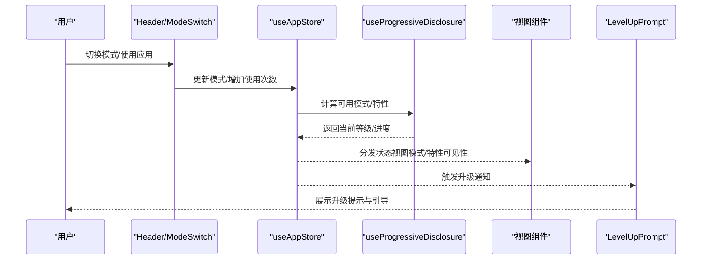
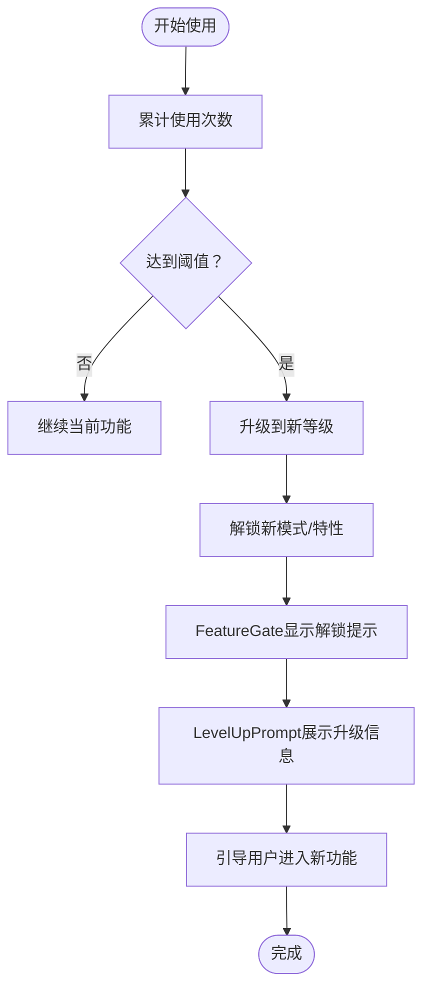
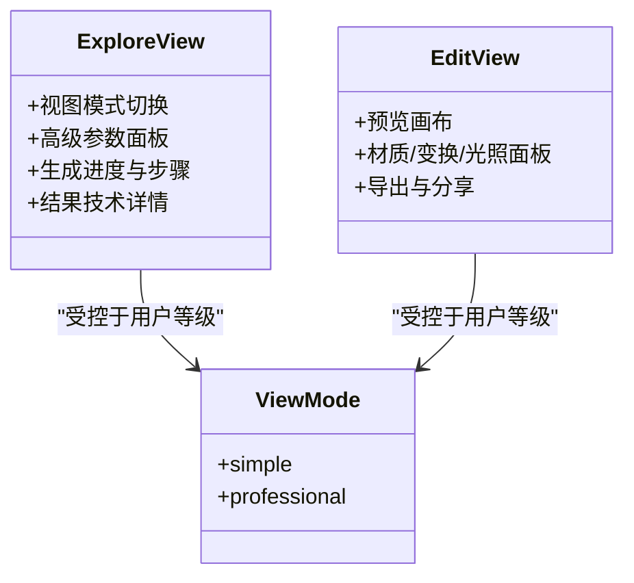
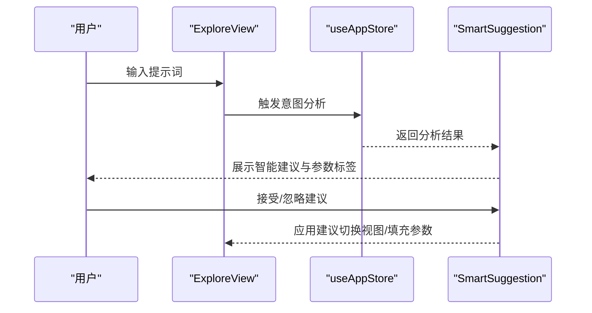
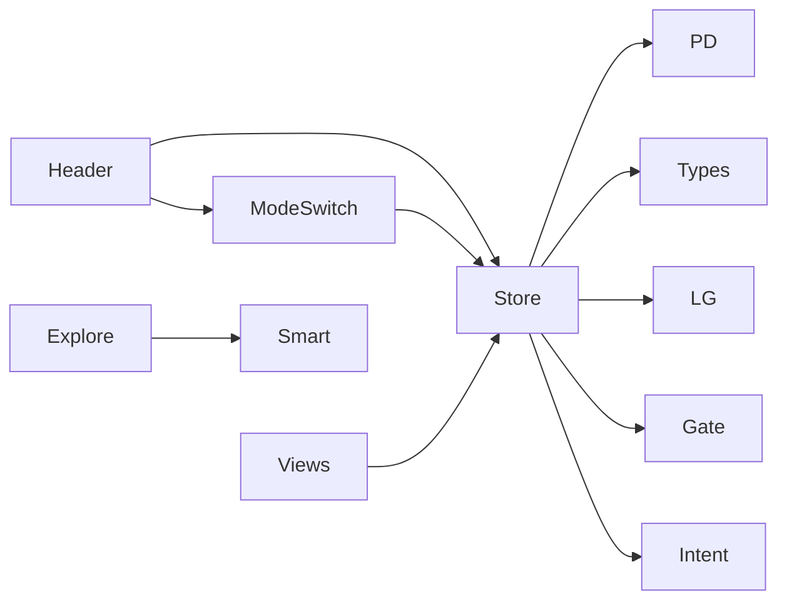

# 用户体验设计原则

<cite>
**本文档引用的文件**
- [App.tsx](file://src/App.tsx)
- [Header.tsx](file://src/components/Layout/Header.tsx)
- [ModeSwitch.tsx](file://src/components/Layout/ModeSwitch.tsx)
- [FeatureGate.tsx](file://src/components/Shared/FeatureGate.tsx)
- [useProgressiveDisclosure.ts](file://src/hooks/useProgressiveDisclosure.ts)
- [useAppStore.ts](file://src/store/useAppStore.ts)
- [index.ts](file://src/types/index.ts)
- [LevelUpPrompt.tsx](file://src/components/Shared/LevelUpPrompt.tsx)
- [ExploreView.tsx](file://src/components/Explore/ExploreView.tsx)
- [EditView.tsx](file://src/components/Edit/EditView.tsx)
- [index.css](file://src/index.css)
- [tailwind.config.js](file://tailwind.config.js)
- [package.json](file://package.json)
- [intentDetector.ts](file://src/utils/intentDetector.ts)
- [SmartSuggestion.tsx](file://src/components/Shared/SmartSuggestion.tsx)
</cite>

## 目录
1. [引言](#引言)
2. [项目结构](#项目结构)
3. [核心组件](#核心组件)
4. [架构总览](#架构总览)
5. [详细组件分析](#详细组件分析)
6. [依赖关系分析](#依赖关系分析)
7. [性能考量](#性能考量)
8. [故障排除指南](#故障排除指南)
9. [结论](#结论)
10. [附录](#附录)

## 引言
本文件围绕“渐进式功能解锁”“用户引导与学习曲线优化”“界面布局与信息架构”“响应式与移动端适配”“交互设计与反馈机制”“可访问性与无障碍”“视觉设计与品牌一致性”“用户测试与评估指标”“国际化与多语言支持”等维度，结合代码库中的实际实现，总结形成一套可操作的用户体验设计原则与指导方针。目标是帮助产品在保持技术先进性的同时，提升易用性、可发现性和可访问性。

## 项目结构
该3D模型生成应用采用模块化组件架构，围绕“探索-编辑-管线”三种视图模式组织功能，配合渐进式用户等级体系与特性门控机制，实现从新手到专家的平滑过渡。整体结构如下：

图表来源
- [App.tsx:10-32](file://src/App.tsx#L10-L32)
- [Header.tsx:8-77](file://src/components/Layout/Header.tsx#L8-L77)
- [ModeSwitch.tsx:18-81](file://src/components/Layout/ModeSwitch.tsx#L18-L81)
- [ExploreView.tsx:11-262](file://src/components/Explore/ExploreView.tsx#L11-L262)
- [EditView.tsx:9-158](file://src/components/Edit/EditView.tsx#L9-L158)
- [useAppStore.ts:114-394](file://src/store/useAppStore.ts#L114-L394)
- [useProgressiveDisclosure.ts:60-135](file://src/hooks/useProgressiveDisclosure.ts#L60-L135)
- [index.ts:101-116](file://src/types/index.ts#L101-L116)
- [LevelUpPrompt.tsx:7-127](file://src/components/Shared/LevelUpPrompt.tsx#L7-L127)
- [FeatureGate.tsx:30-86](file://src/components/Shared/FeatureGate.tsx#L30-L86)
- [SmartSuggestion.tsx:13-97](file://src/components/Shared/SmartSuggestion.tsx#L13-L97)
- [intentDetector.ts:77-147](file://src/utils/intentDetector.ts#L77-L147)

章节来源
- [App.tsx:10-32](file://src/App.tsx#L10-L32)
- [package.json:11-22](file://package.json#L11-L22)

## 核心组件
- 渐进式功能解锁与用户等级体系：通过用户使用次数驱动等级升级，解锁不同模式与特性，配合门控组件与提示组件实现平滑过渡。
- 视图模式（简单/专业）：根据用户等级与偏好动态展示不同复杂度的界面元素，降低认知负荷。
- 智能建议与意图检测：基于用户输入关键词与历史等级，推荐合适的模式与视图，并给出参数建议。
- 全局状态管理：集中管理任务状态、用户资料、模板、聊天会话等，确保跨组件一致性与可追踪性。

章节来源
- [useProgressiveDisclosure.ts:60-135](file://src/hooks/useProgressiveDisclosure.ts#L60-L135)
- [useAppStore.ts:114-394](file://src/store/useAppStore.ts#L114-L394)
- [index.ts:101-116](file://src/types/index.ts#L101-L116)
- [intentDetector.ts:77-147](file://src/utils/intentDetector.ts#L77-L147)

## 架构总览
下图展示了从用户交互到状态更新、再到界面反馈的端到端流程，体现渐进式设计与即时反馈的核心闭环。

图表来源
- [Header.tsx:8-77](file://src/components/Layout/Header.tsx#L8-L77)
- [ModeSwitch.tsx:18-81](file://src/components/Layout/ModeSwitch.tsx#L18-L81)
- [useAppStore.ts:191-229](file://src/store/useAppStore.ts#L191-L229)
- [useProgressiveDisclosure.ts:60-135](file://src/hooks/useProgressiveDisclosure.ts#L60-L135)
- [LevelUpPrompt.tsx:7-127](file://src/components/Shared/LevelUpPrompt.tsx#L7-L127)

## 详细组件分析

### 渐进式功能解锁与学习曲线优化
- 等级阈值与解锁规则：通过使用次数阈值（如3次、10次）驱动等级升级，分阶段解锁模式与特性，避免信息过载。
- 特性门控：在UI层对未解锁的功能进行遮罩与提示，引导用户通过使用达到解锁条件。
- 升级提示：在满足阈值时弹出升级提示，提供一键跳转到新功能的能力，强化正向反馈。

图表来源
- [useAppStore.ts:191-229](file://src/store/useAppStore.ts#L191-L229)
- [useProgressiveDisclosure.ts:38-42](file://src/hooks/useProgressiveDisclosure.ts#L38-L42)
- [FeatureGate.tsx:30-86](file://src/components/Shared/FeatureGate.tsx#L30-L86)
- [LevelUpPrompt.tsx:7-127](file://src/components/Shared/LevelUpPrompt.tsx#L7-L127)

章节来源
- [useProgressiveDisclosure.ts:60-135](file://src/hooks/useProgressiveDisclosure.ts#L60-L135)
- [FeatureGate.tsx:30-86](file://src/components/Shared/FeatureGate.tsx#L30-L86)
- [LevelUpPrompt.tsx:7-127](file://src/components/Shared/LevelUpPrompt.tsx#L7-L127)

### 视图模式与信息架构
- 视图模式（简单/专业）：根据用户等级与偏好动态切换，简单模式聚焦核心操作，专业模式暴露高级参数与流程细节。
- 信息架构：探索视图以“输入-生成-结果”为主线；编辑视图以“预览-参数-导出”为主线；管线视图以“节点-连接-参数”为主线。
- 面板折叠与层级：专业模式下提供可折叠的高级参数面板与技术详情区，减少默认干扰，提升可扫描性。

图表来源
- [ExploreView.tsx:11-262](file://src/components/Explore/ExploreView.tsx#L11-L262)
- [EditView.tsx:9-158](file://src/components/Edit/EditView.tsx#L9-L158)
- [index.ts:103](file://src/types/index.ts#L103)

章节来源
- [ExploreView.tsx:11-262](file://src/components/Explore/ExploreView.tsx#L11-L262)
- [EditView.tsx:9-158](file://src/components/Edit/EditView.tsx#L9-L158)
- [index.ts:103](file://src/types/index.ts#L103)

### 交互设计模式与用户反馈机制
- 即时反馈：生成过程中的状态推进、步骤可视化、进度条与颜色编码，帮助用户感知系统状态。
- 智能建议：基于关键词与历史等级，提供模式切换与参数建议，减少试错成本。
- 动效与微交互：使用Framer Motion实现平滑的显隐、切换与高亮，增强操作连贯性与愉悦感。

图表来源
- [ExploreView.tsx:11-262](file://src/components/Explore/ExploreView.tsx#L11-L262)
- [intentDetector.ts:77-147](file://src/utils/intentDetector.ts#L77-L147)
- [SmartSuggestion.tsx:13-97](file://src/components/Shared/SmartSuggestion.tsx#L13-L97)
- [useAppStore.ts:317-324](file://src/store/useAppStore.ts#L317-L324)

章节来源
- [SmartSuggestion.tsx:13-97](file://src/components/Shared/SmartSuggestion.tsx#L13-L97)
- [intentDetector.ts:77-147](file://src/utils/intentDetector.ts#L77-L147)

### 可访问性设计标准与无障碍实现
- 键盘可达性：按钮与表单控件具备焦点可见性与键盘操作路径，避免仅依赖鼠标。
- 色彩对比与语义：使用Tailwind主题色保证文本与背景对比度，语义化标签与角色明确（如按钮、面板）。
- 屏幕阅读器友好：为图标与装饰性元素提供替代文本或隐藏策略，确保读屏器正确朗读内容。
- 低电量/震动敏感场景：提供关闭动画或降低动画强度的选项（若后续扩展）。

[本节为通用指导，不直接分析具体文件]

### 视觉设计与品牌一致性
- 品牌色彩体系：以太空蓝、霓虹紫、霓虹绿为主色调，贯穿按钮、高亮、边框与阴影，形成统一的视觉语言。
- 材质与质感：通过毛玻璃、径向渐变与发光效果，营造科技感与沉浸感。
- 字体与排版：使用无衬线字体，强调信息层级与可读性；渐变文字用于品牌标识与标题。

章节来源
- [index.css:37-107](file://src/index.css#L37-L107)
- [tailwind.config.js:8-57](file://tailwind.config.js#L8-L57)

### 国际化与多语言支持
- 文本本地化：界面文案（如“探索”“编辑”“管线”“简洁”“专业”）应纳入i18n系统，支持多语言切换。
- 数字与日期格式：根据地区设置调整数字、单位与时间格式。
- 文化适配：避免使用可能在特定文化中有负面含义的图标或颜色组合。

[本节为通用指导，不直接分析具体文件]

## 依赖关系分析
- 组件耦合：Header与ModeSwitch通过全局状态联动；视图组件依赖状态与披露钩子决定可见性；升级提示与门控组件依赖状态与等级计算。
- 外部依赖：React、Zustand（状态）、Framer Motion（动效）、Lucide（图标）、Tailwind（样式）。

图表来源
- [Header.tsx:8-77](file://src/components/Layout/Header.tsx#L8-L77)
- [ModeSwitch.tsx:18-81](file://src/components/Layout/ModeSwitch.tsx#L18-L81)
- [useAppStore.ts:114-394](file://src/store/useAppStore.ts#L114-L394)
- [useProgressiveDisclosure.ts:60-135](file://src/hooks/useProgressiveDisclosure.ts#L60-L135)
- [LevelUpPrompt.tsx:7-127](file://src/components/Shared/LevelUpPrompt.tsx#L7-L127)
- [FeatureGate.tsx:30-86](file://src/components/Shared/FeatureGate.tsx#L30-L86)
- [SmartSuggestion.tsx:13-97](file://src/components/Shared/SmartSuggestion.tsx#L13-L97)
- [intentDetector.ts:77-147](file://src/utils/intentDetector.ts#L77-L147)

章节来源
- [package.json:11-22](file://package.json#L11-L22)

## 性能考量
- 渐进式加载：通过特性门控与视图模式控制初始渲染复杂度，避免一次性加载全部功能。
- 状态持久化：用户资料与模板存储于localStorage，减少重复初始化开销。
- 动效优化：合理使用CSS动画与轻量级JS动画，避免在低端设备上造成卡顿。
- 图标与资源：使用矢量图标与按需加载策略，降低首屏体积。

[本节提供一般性建议，不直接分析具体文件]

## 故障排除指南
- 升级提示不出现：检查使用次数是否达到阈值，确认升级通知状态未被重复触发。
- 模式不可切换：确认当前等级是否满足模式解锁要求，或是否处于锁定状态。
- 参数面板不显示：检查视图模式是否为“专业”，以及相关特性是否已解锁。
- 意图分析无效：确认输入关键词是否命中关键词库，或用户等级是否影响评分。

章节来源
- [useAppStore.ts:191-229](file://src/store/useAppStore.ts#L191-L229)
- [useProgressiveDisclosure.ts:71-76](file://src/hooks/useProgressiveDisclosure.ts#L71-L76)
- [SmartSuggestion.tsx:13-97](file://src/components/Shared/SmartSuggestion.tsx#L13-L97)

## 结论
本项目通过“渐进式功能解锁+智能建议+清晰的信息架构+一致的视觉语言”，构建了面向不同技能水平用户的完整体验闭环。建议在后续迭代中进一步完善国际化、可访问性与性能优化，持续以用户数据驱动体验改进。

## 附录
- 设计原则清单
  - 渐进式披露：先简单后复杂，逐步开放能力。
  - 明确反馈：状态变化、操作结果与建议及时可见。
  - 一致性：色彩、动效、布局与交互模式统一。
  - 可访问性：对比度、键盘可达性与语义化。
  - 移动优先：响应式断点与手势优化。
  - 本地化：文案与格式的多语言适配。
  - 用户测试：A/B测试、可用性评测与反馈收集。