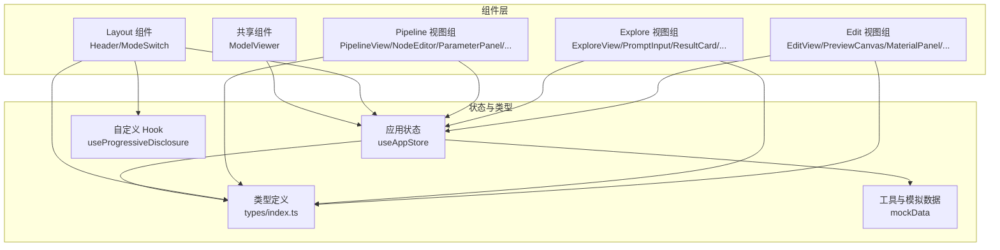
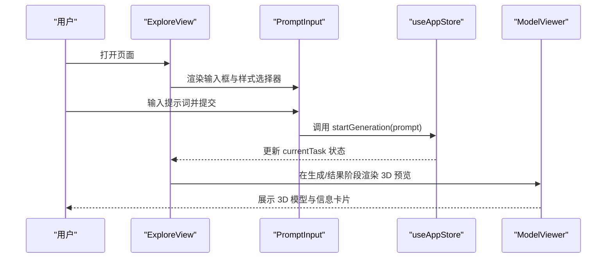
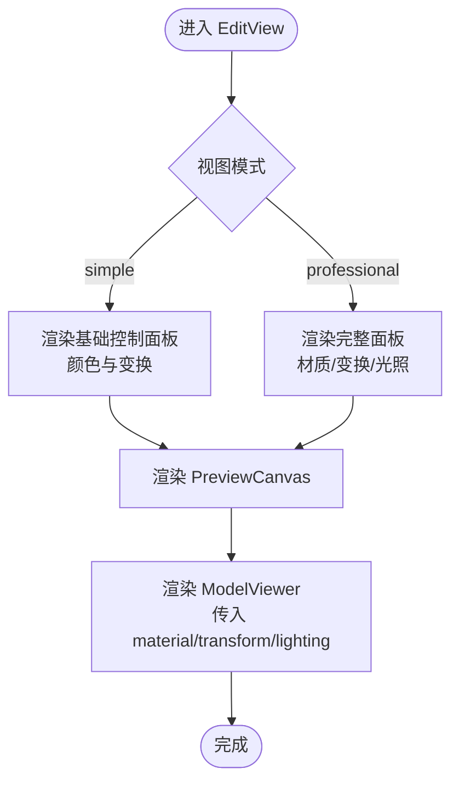
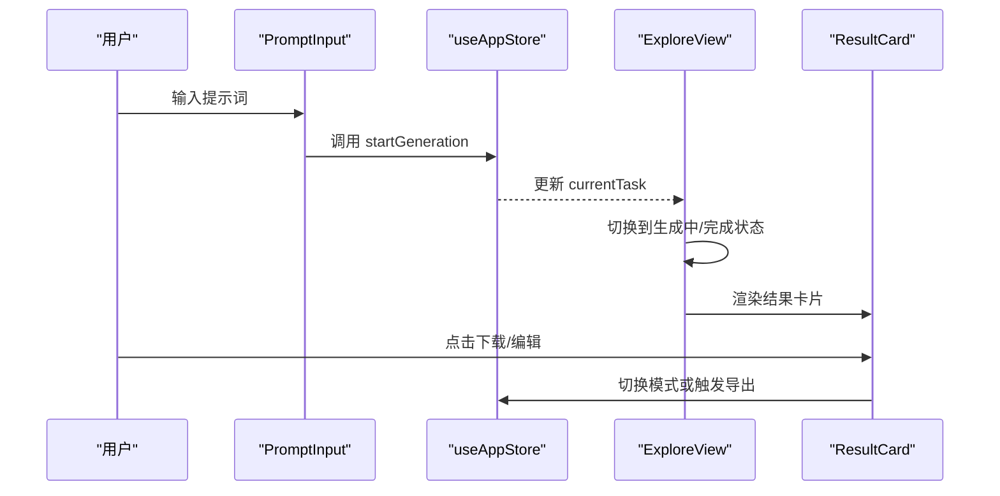
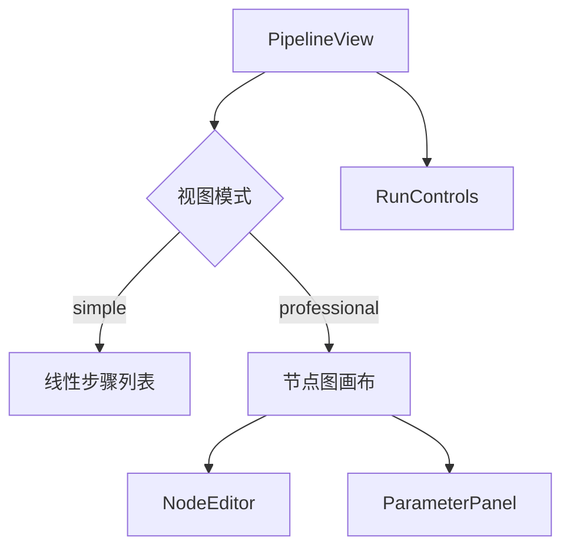
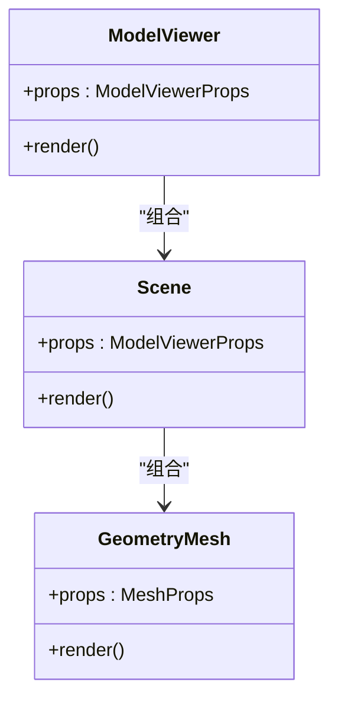
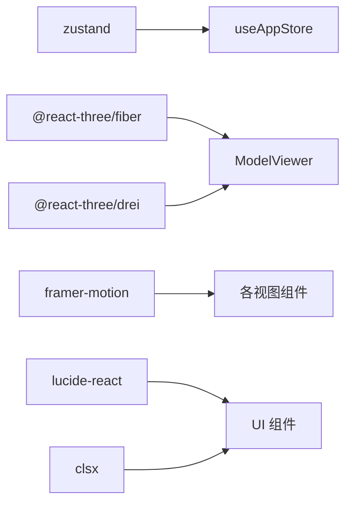

# 组件开发规范

<cite>
**本文引用的文件**
- [EditView.tsx](file://src/components/Edit/EditView.tsx)
- [ExploreView.tsx](file://src/components/Explore/ExploreView.tsx)
- [PipelineView.tsx](file://src/components/Pipeline/PipelineView.tsx)
- [Header.tsx](file://src/components/Layout/Header.tsx)
- [ModelViewer.tsx](file://src/components/Shared/ModelViewer.tsx)
- [PreviewCanvas.tsx](file://src/components/Edit/PreviewCanvas.tsx)
- [MaterialPanel.tsx](file://src/components/Edit/MaterialPanel.tsx)
- [PromptInput.tsx](file://src/components/Explore/PromptInput.tsx)
- [ResultCard.tsx](file://src/components/Explore/ResultCard.tsx)
- [useAppStore.ts](file://src/store/useAppStore.ts)
- [index.ts](file://src/types/index.ts)
- [useProgressiveDisclosure.ts](file://src/hooks/useProgressiveDisclosure.ts)
- [mockData.ts](file://src/utils/mockData.ts)
- [package.json](file://package.json)
- [tsconfig.json](file://tsconfig.json)
</cite>

## 目录
1. [引言](#引言)
2. [项目结构](#项目结构)
3. [核心组件](#核心组件)
4. [架构总览](#架构总览)
5. [详细组件分析](#详细组件分析)
6. [依赖分析](#依赖分析)
7. [性能考量](#性能考量)
8. [故障排查指南](#故障排查指南)
9. [结论](#结论)
10. [附录](#附录)

## 引言
本规范面向本项目中的 React 组件开发与设计，结合现有代码库提炼出统一的组件命名约定、props 设计模式、事件处理规范、复用与组合理念、生命周期管理与性能优化建议，并给出 TypeScript 类型定义最佳实践、组件测试策略与单元测试编写指南、可访问性与跨浏览器兼容性考虑，以及组件文档与示例代码标准。

## 项目结构
项目采用按功能域分层的目录组织方式：components 下按业务域划分 Edit、Explore、Pipeline、Layout、Shared；store 提供全局状态；types 定义类型；hooks 提供可复用逻辑；utils 提供工具与模拟数据。整体呈现“功能域优先”的组织风格，便于组件职责清晰与复用。

图表来源
- [EditView.tsx:1-159](file://src/components/Edit/EditView.tsx#L1-L159)
- [ExploreView.tsx:1-263](file://src/components/Explore/ExploreView.tsx#L1-L263)
- [PipelineView.tsx:1-168](file://src/components/Pipeline/PipelineView.tsx#L1-L168)
- [Header.tsx:1-78](file://src/components/Layout/Header.tsx#L1-L78)
- [ModelViewer.tsx:1-156](file://src/components/Shared/ModelViewer.tsx#L1-L156)
- [useAppStore.ts:1-368](file://src/store/useAppStore.ts#L1-L368)
- [index.ts:1-160](file://src/types/index.ts#L1-L160)
- [useProgressiveDisclosure.ts:1-136](file://src/hooks/useProgressiveDisclosure.ts#L1-L136)
- [mockData.ts:1-189](file://src/utils/mockData.ts#L1-L189)

章节来源
- [EditView.tsx:1-159](file://src/components/Edit/EditView.tsx#L1-L159)
- [ExploreView.tsx:1-263](file://src/components/Explore/ExploreView.tsx#L1-L263)
- [PipelineView.tsx:1-168](file://src/components/Pipeline/PipelineView.tsx#L1-L168)
- [Header.tsx:1-78](file://src/components/Layout/Header.tsx#L1-L78)
- [ModelViewer.tsx:1-156](file://src/components/Shared/ModelViewer.tsx#L1-L156)
- [useAppStore.ts:1-368](file://src/store/useAppStore.ts#L1-L368)
- [index.ts:1-160](file://src/types/index.ts#L1-L160)
- [useProgressiveDisclosure.ts:1-136](file://src/hooks/useProgressiveDisclosure.ts#L1-L136)
- [mockData.ts:1-189](file://src/utils/mockData.ts#L1-L189)

## 核心组件
- 全局状态中心：通过 Zustand 的 useAppStore 管理应用模式、生成任务、编辑设置、视图模式、用户等级与模板等。
- 视图容器：ExploreView、EditView、PipelineView 分别承载探索、编辑、管线视图的主布局与交互。
- 可复用共享组件：ModelViewer 提供 3D 场景渲染能力，支持多种几何体、材质与光照预设。
- 自定义 Hook：useProgressiveDisclosure 提供渐进式解锁与可用模式判断。
- 类型系统：集中于 types/index.ts，定义任务、材质、编辑设置、用户等级、视图模式等强类型。

章节来源
- [useAppStore.ts:1-368](file://src/store/useAppStore.ts#L1-L368)
- [ExploreView.tsx:1-263](file://src/components/Explore/ExploreView.tsx#L1-L263)
- [EditView.tsx:1-159](file://src/components/Edit/EditView.tsx#L1-L159)
- [PipelineView.tsx:1-168](file://src/components/Pipeline/PipelineView.tsx#L1-L168)
- [ModelViewer.tsx:1-156](file://src/components/Shared/ModelViewer.tsx#L1-L156)
- [useProgressiveDisclosure.ts:1-136](file://src/hooks/useProgressiveDisclosure.ts#L1-L136)
- [index.ts:1-160](file://src/types/index.ts#L1-L160)

## 架构总览
组件间通过 props 传递数据与回调，通过全局状态进行解耦；共享组件（如 ModelViewer）封装复杂渲染逻辑，上层仅需传入配置即可复用。视图模式（simple/professional）由用户等级与偏好驱动，通过 Header 中的切换控件与 useProgressiveDisclosure 协同。

图表来源
- [ExploreView.tsx:1-263](file://src/components/Explore/ExploreView.tsx#L1-L263)
- [PromptInput.tsx:1-161](file://src/components/Explore/PromptInput.tsx#L1-L161)
- [useAppStore.ts:100-170](file://src/store/useAppStore.ts#L100-L170)
- [ModelViewer.tsx:1-156](file://src/components/Shared/ModelViewer.tsx#L1-L156)

## 详细组件分析

### 组件命名约定与设计原则
- 文件命名：采用帕斯卡命名法，单文件组件以功能语义命名（如 EditView、MaterialPanel、ModelViewer）。
- 导出方式：默认导出用于页面级容器组件，具名导出用于可复用子组件或工具组件。
- 组件职责：单一职责，容器组件负责布局与状态协调，展示组件负责具体 UI 表现。
- Props 设计：以“配置对象”形式传递复杂参数（如 ModelViewer 的 props），避免过深嵌套；对可选属性提供合理默认值。
- 事件处理：统一使用小驼峰命名；回调函数通过 props 注入，避免直接操作 DOM 或全局状态。

章节来源
- [EditView.tsx:1-159](file://src/components/Edit/EditView.tsx#L1-L159)
- [MaterialPanel.tsx:1-209](file://src/components/Edit/MaterialPanel.tsx#L1-L209)
- [ModelViewer.tsx:1-156](file://src/components/Shared/ModelViewer.tsx#L1-L156)

### Edit 视图组件族
- EditView：根据视图模式（simple/professional）切换布局与控制面板；通过 useAppStore 获取编辑设置并更新。
- PreviewCanvas：基于 ModelViewer 渲染当前编辑状态的 3D 预览，提供基础视图控制与信息覆盖层。
- MaterialPanel：封装材质参数滑块与颜色选择器，使用受控组件与局部状态控制折叠展开。
- TransformPanel/LightingPanel：作为扩展面板，遵循与 MaterialPanel 相同的交互与视觉风格。

图表来源
- [EditView.tsx:1-159](file://src/components/Edit/EditView.tsx#L1-L159)
- [PreviewCanvas.tsx:1-54](file://src/components/Edit/PreviewCanvas.tsx#L1-L54)
- [MaterialPanel.tsx:1-209](file://src/components/Edit/MaterialPanel.tsx#L1-L209)
- [ModelViewer.tsx:1-156](file://src/components/Shared/ModelViewer.tsx#L1-L156)

章节来源
- [EditView.tsx:1-159](file://src/components/Edit/EditView.tsx#L1-L159)
- [PreviewCanvas.tsx:1-54](file://src/components/Edit/PreviewCanvas.tsx#L1-L54)
- [MaterialPanel.tsx:1-209](file://src/components/Edit/MaterialPanel.tsx#L1-L209)
- [ModelViewer.tsx:1-156](file://src/components/Shared/ModelViewer.tsx#L1-L156)

### Explore 视图组件族
- ExploreView：根据任务状态（空闲/生成中/完成）渲染不同内容区域；专业模式下展示 Agent 步骤与技术详情。
- PromptInput：输入提示词，集成智能意图分析与建议提示；支持快捷建议与回车提交。
- ResultCard：展示生成结果的统计信息与下载/编辑等操作；支持跨模式导航。

图表来源
- [PromptInput.tsx:1-161](file://src/components/Explore/PromptInput.tsx#L1-L161)
- [useAppStore.ts:100-170](file://src/store/useAppStore.ts#L100-L170)
- [ExploreView.tsx:1-263](file://src/components/Explore/ExploreView.tsx#L1-L263)
- [ResultCard.tsx:1-129](file://src/components/Explore/ResultCard.tsx#L1-L129)

章节来源
- [ExploreView.tsx:1-263](file://src/components/Explore/ExploreView.tsx#L1-L263)
- [PromptInput.tsx:1-161](file://src/components/Explore/PromptInput.tsx#L1-L161)
- [ResultCard.tsx:1-129](file://src/components/Explore/ResultCard.tsx#L1-L129)

### Pipeline 视图组件族
- PipelineView：简单模式下线性展示 Agent 步骤，专业模式下提供节点图与参数面板；底部运行控制条。
- NodeEditor/ParameterPanel/RunControls：作为专业模式下的子组件，分别负责节点编辑、参数面板与运行控制。

图表来源
- [PipelineView.tsx:1-168](file://src/components/Pipeline/PipelineView.tsx#L1-L168)

章节来源
- [PipelineView.tsx:1-168](file://src/components/Pipeline/PipelineView.tsx#L1-L168)

### 共享组件：ModelViewer
- 功能：基于 @react-three/fiber 与 drei 渲染 3D 场景，支持多几何体、材质参数、光照预设、网格与轨道控制器。
- 设计要点：使用 React.memo 包裹以减少重渲染；通过 Suspense 处理异步加载；内部 Scene 抽象光照与环境；GeometryMesh 封装几何体与材质。
- Props 设计：以 ModelViewerProps 作为配置入口，提供 compact/autoRotate/showGrid 等开关；默认值在组件内部设定，确保易用性。

图表来源
- [ModelViewer.tsx:1-156](file://src/components/Shared/ModelViewer.tsx#L1-L156)

章节来源
- [ModelViewer.tsx:1-156](file://src/components/Shared/ModelViewer.tsx#L1-L156)

### 布局与导航：Header
- Header：顶部导航栏，包含 Logo、模式切换（simple/professional）、积分与通知等；通过 useProgressiveDisclosure 控制可用模式与显示条件。
- 设计要点：使用 layoutId 实现切换按钮的平滑动画；根据用户等级动态显示模式切换。

章节来源
- [Header.tsx:1-78](file://src/components/Layout/Header.tsx#L1-L78)
- [useProgressiveDisclosure.ts:1-136](file://src/hooks/useProgressiveDisclosure.ts#L1-L136)

### TypeScript 类型定义最佳实践
- 使用联合类型表达枚举值（如 ViewMode、GenerationStatus、AgentType）。
- 对复杂对象使用接口（如 GenerationTask、MaterialSettings、EditSettings），并拆分到 types/index.ts 集中管理。
- 使用 Partial/Readonly 等工具类型在状态更新时保持不可变性与类型安全。
- 为 props 接口提供默认值与可选字段，避免上层调用方遗漏关键属性。

章节来源
- [index.ts:1-160](file://src/types/index.ts#L1-L160)
- [useAppStore.ts:50-98](file://src/store/useAppStore.ts#L50-L98)
- [ModelViewer.tsx:6-21](file://src/components/Shared/ModelViewer.tsx#L6-L21)

### 组件复用与组合
- 通过共享组件（如 ModelViewer）抽象复杂渲染逻辑，上层仅需传入配置。
- 通过 Hook（如 useProgressiveDisclosure）抽取业务规则，降低组件耦合度。
- 通过状态中心（useAppStore）集中管理跨组件共享的数据与行为，避免 props 钻取。

章节来源
- [ModelViewer.tsx:1-156](file://src/components/Shared/ModelViewer.tsx#L1-L156)
- [useProgressiveDisclosure.ts:1-136](file://src/hooks/useProgressiveDisclosure.ts#L1-L136)
- [useAppStore.ts:1-368](file://src/store/useAppStore.ts#L1-L368)

### 生命周期管理与性能优化
- 渲染优化：使用 React.memo 包裹重型组件（如 ModelViewer），减少不必要重渲染。
- 状态更新：使用局部状态控制可折叠面板与表单控件，避免全局状态频繁变更。
- 动画与过渡：使用 Framer Motion 进行细粒度的入场/出场动画，注意延迟与持续时间的平衡。
- 异步加载：通过 Suspense 与骨架屏提升用户体验，避免白屏。
- 计算优化：使用 useMemo 缓存计算结果（如随机几何体选择），避免重复计算。

章节来源
- [ModelViewer.tsx:136-156](file://src/components/Shared/ModelViewer.tsx#L136-L156)
- [MaterialPanel.tsx:1-209](file://src/components/Edit/MaterialPanel.tsx#L1-L209)
- [ResultCard.tsx:1-129](file://src/components/Explore/ResultCard.tsx#L1-L129)

### 组件测试策略与单元测试编写指南
- 单元测试：针对纯函数与 Hook（如 useProgressiveDisclosure）编写测试，验证返回值与边界条件。
- 组件快照：对静态组件（如 Header、ResultCard）进行快照测试，防止 UI 回退。
- 交互测试：使用测试库模拟用户交互（输入、点击、切换模式），断言状态变化与渲染差异。
- 状态测试：通过替换 useAppStore 的实现，注入 mock 数据，验证组件在不同状态下的表现。
- 性能测试：对重渲染敏感的组件（如 ModelViewer）进行渲染次数与耗时测试。

章节来源
- [useProgressiveDisclosure.ts:1-136](file://src/hooks/useProgressiveDisclosure.ts#L1-L136)
- [Header.tsx:1-78](file://src/components/Layout/Header.tsx#L1-L78)
- [ResultCard.tsx:1-129](file://src/components/Explore/ResultCard.tsx#L1-L129)

### 可访问性与跨浏览器兼容性
- 可访问性：为交互元素提供语义化标签与键盘可达性；为动画提供减少动量（prefers-reduced-motion）选项；为图片与图标提供替代文本。
- 跨浏览器：使用 PostCSS/Tailwind 的自动前缀能力；在动画与渐变中提供降级方案；对现代 API（如 CSS Grid/Flexbox）提供回退布局。

章节来源
- [package.json:1-35](file://package.json#L1-L35)
- [tsconfig.json:1-25](file://tsconfig.json#L1-L25)

### 组件文档与示例代码标准
- 文档结构：每个组件文档应包含用途、props 列表（含类型与默认值）、事件回调、使用示例与注意事项。
- 示例代码：提供最小可运行示例，展示关键 props 与交互；避免引入外部依赖，保持示例独立性。
- 类型标注：在示例中明确类型，鼓励使用 TypeScript；对复杂类型提供简要说明。

## 依赖分析
- 状态管理：Zustand 提供轻量级状态容器，集中管理应用模式、任务与用户信息。
- 3D 渲染：@react-three/fiber 与 @react-three/drei 提供声明式 3D 场景构建能力。
- 动画：Framer Motion 提供流畅的动画与过渡效果。
- 图标与工具：Lucide React 提供图标库；clsx 提供类名合并工具。

图表来源
- [package.json:11-22](file://package.json#L11-L22)
- [useAppStore.ts:1-368](file://src/store/useAppStore.ts#L1-L368)
- [ModelViewer.tsx:1-156](file://src/components/Shared/ModelViewer.tsx#L1-L156)

章节来源
- [package.json:1-35](file://package.json#L1-L35)
- [useAppStore.ts:1-368](file://src/store/useAppStore.ts#L1-L368)

## 性能考量
- 减少重渲染：对重型组件使用 memo 包裹；对频繁变化的状态使用局部状态；避免在渲染期间创建新对象。
- 渐进式加载：对 3D 场景使用 Suspense 与骨架屏；对长列表使用虚拟化或分页。
- 动画节流：限制动画频率与复杂度；在移动端适当降低动画强度。
- 状态持久化：对用户偏好与模板使用本地存储，减少初始化成本。

## 故障排查指南
- 状态未更新：确认 useAppStore 的更新方法是否被正确调用；检查 set/get 的使用是否符合预期。
- 3D 场景不渲染：检查 Canvas 的尺寸与背景色；确认 Suspense fallback 是否被意外隐藏。
- 视图模式切换异常：核对 useProgressiveDisclosure 返回的 availableModes 与当前用户等级；检查 Header 中的切换逻辑。
- 性能问题：使用 React DevTools Profiler 分析渲染热点；对重渲染组件添加 memo 与 useMemo。

章节来源
- [useAppStore.ts:1-368](file://src/store/useAppStore.ts#L1-L368)
- [useProgressiveDisclosure.ts:1-136](file://src/hooks/useProgressiveDisclosure.ts#L1-L136)
- [ModelViewer.tsx:1-156](file://src/components/Shared/ModelViewer.tsx#L1-L156)

## 结论
本规范总结了项目中组件开发的核心原则与最佳实践，涵盖命名约定、props 设计、事件处理、复用与组合、生命周期与性能优化、TypeScript 类型定义、测试策略、可访问性与兼容性，以及文档与示例标准。遵循这些规范有助于提升代码一致性、可维护性与团队协作效率。

## 附录
- 术语表：视图模式（simple/professional）、渐进式解锁、Agent 步骤、材质参数、编辑设置。
- 参考实现路径：各组件与其对应的状态与类型定义文件，便于对照学习与扩展。