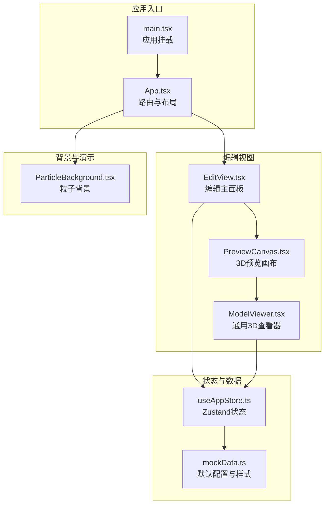
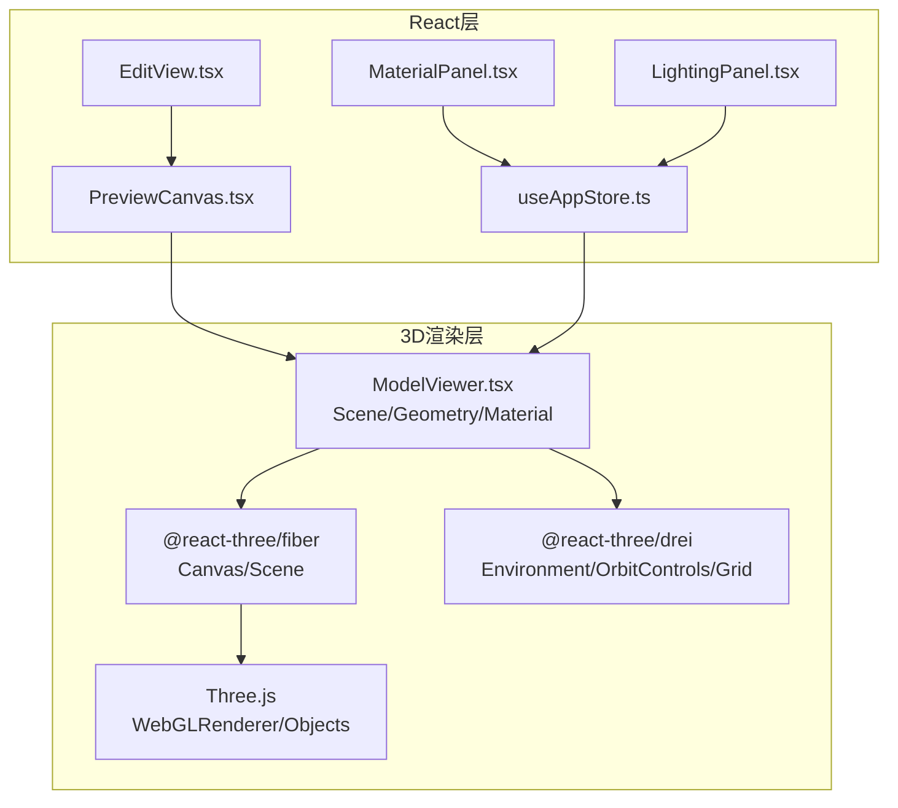
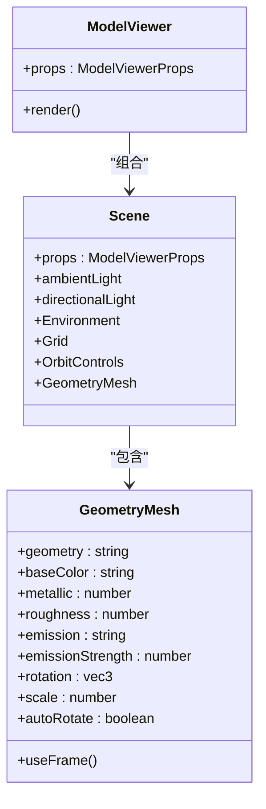
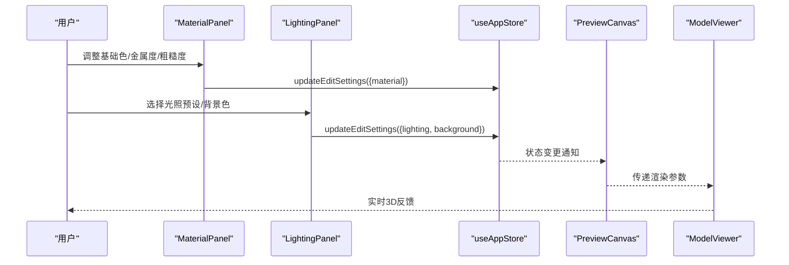
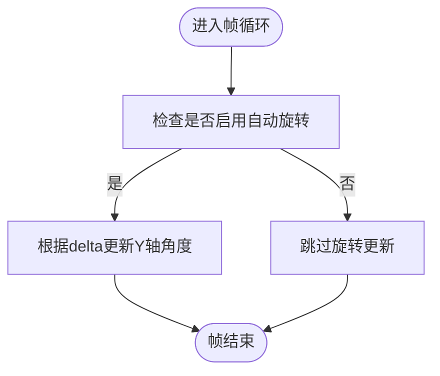
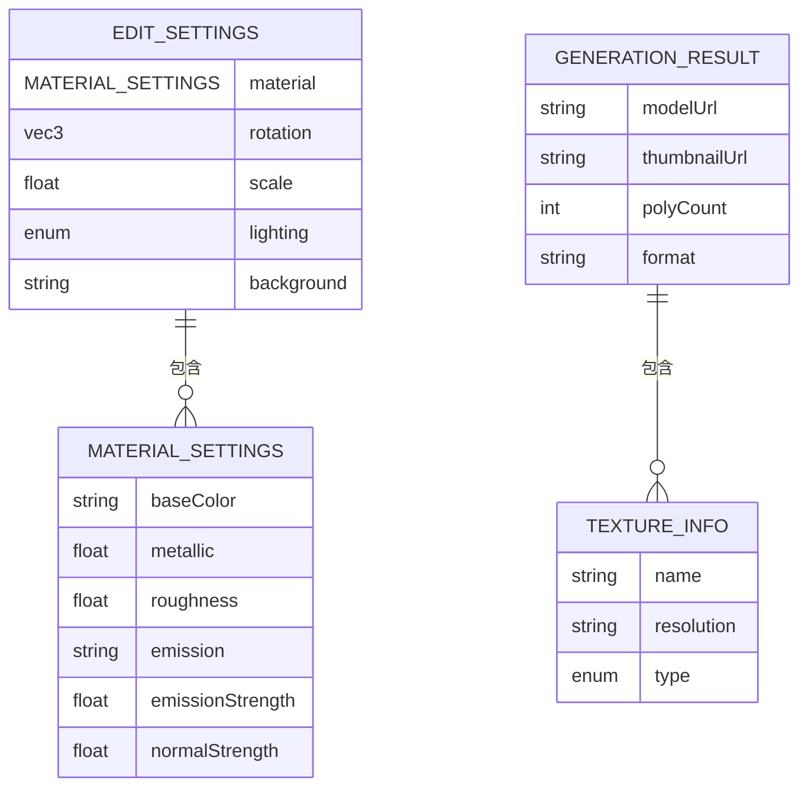
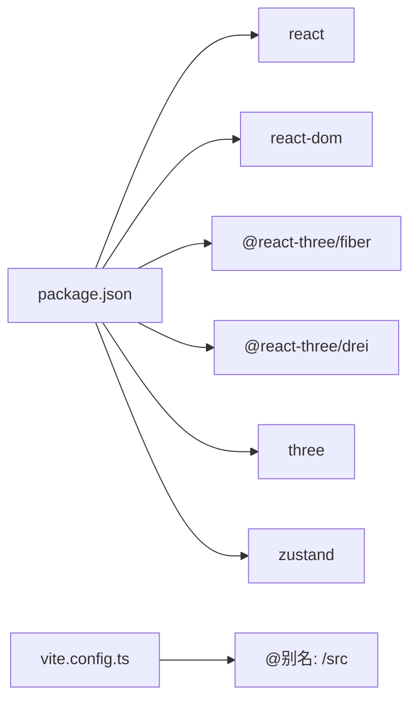

# 3D渲染集成架构

<cite>
**本文档引用的文件**
- [App.tsx](file://src/App.tsx)
- [main.tsx](file://src/main.tsx)
- [ModelViewer.tsx](file://src/components/Shared/ModelViewer.tsx)
- [PreviewCanvas.tsx](file://src/components/Edit/PreviewCanvas.tsx)
- [EditView.tsx](file://src/components/Edit/EditView.tsx)
- [MaterialPanel.tsx](file://src/components/Edit/MaterialPanel.tsx)
- [LightingPanel.tsx](file://src/components/Edit/LightingPanel.tsx)
- [ParticleBackground.tsx](file://src/components/Background/ParticleBackground.tsx)
- [ExploreView.tsx](file://src/components/Explore/ExploreView.tsx)
- [PipelineView.tsx](file://src/components/Pipeline/PipelineView.tsx)
- [useAppStore.ts](file://src/store/useAppStore.ts)
- [mockData.ts](file://src/utils/mockData.ts)
- [package.json](file://package.json)
- [vite.config.ts](file://vite.config.ts)
</cite>

## 目录
1. [引言](#引言)
2. [项目结构](#项目结构)
3. [核心组件](#核心组件)
4. [架构总览](#架构总览)
5. [详细组件分析](#详细组件分析)
6. [依赖关系分析](#依赖关系分析)
7. [性能考虑](#性能考虑)
8. [故障排除指南](#故障排除指南)
9. [结论](#结论)

## 引言
本文件面向3D模型代理项目，系统化阐述Three.js与@react-three/fiber在项目中的集成架构与设计模式。重点覆盖以下方面：
- 3D场景的初始化与管理：场景图、相机控制、光照系统
- 材质系统与纹理管理策略
- 动画系统集成与性能优化
- 渲染管线图与组件集成关系图
- 最佳实践与调试技巧

该文档旨在帮助开发者快速理解从UI到渲染层的完整链路，并提供可操作的优化建议。

## 项目结构
项目采用按功能域分层的组织方式，3D渲染相关的核心位于Shared与Edit目录，配合全局状态管理与路由切换：

**图表来源**
- [main.tsx:1-14](file://src/main.tsx#L1-L14)
- [App.tsx:10-32](file://src/App.tsx#L10-L32)
- [EditView.tsx:9-158](file://src/components/Edit/EditView.tsx#L9-L158)
- [PreviewCanvas.tsx:5-53](file://src/components/Edit/PreviewCanvas.tsx#L5-L53)
- [ModelViewer.tsx:136-155](file://src/components/Shared/ModelViewer.tsx#L136-L155)
- [ParticleBackground.tsx:88-107](file://src/components/Background/ParticleBackground.tsx#L88-L107)
- [useAppStore.ts:100-163](file://src/store/useAppStore.ts#L100-L163)
- [mockData.ts:14-27](file://src/utils/mockData.ts#L14-L27)

**章节来源**
- [main.tsx:1-14](file://src/main.tsx#L1-L14)
- [App.tsx:10-32](file://src/App.tsx#L10-L32)

## 核心组件
- ModelViewer：基于@react-three/fiber的通用3D查看器，封装几何体、材质、光照、相机与控件，支持参数化渲染与自动旋转。
- PreviewCanvas：编辑视图中的3D预览容器，连接全局状态，驱动ModelViewer的渲染参数。
- ParticleBackground：全屏粒子背景，使用Points与FloatingOrb演示Three.js基础能力与@react-three/fiber集成。
- EditView：编辑主界面，整合材质、变换、光照等控制面板，协调预览与导出功能。
- useAppStore：Zustand状态管理，集中维护编辑设置、任务状态、用户等级与模板等。

**章节来源**
- [ModelViewer.tsx:136-155](file://src/components/Shared/ModelViewer.tsx#L136-L155)
- [PreviewCanvas.tsx:5-53](file://src/components/Edit/PreviewCanvas.tsx#L5-L53)
- [EditView.tsx:9-158](file://src/components/Edit/EditView.tsx#L9-L158)
- [useAppStore.ts:100-163](file://src/store/useAppStore.ts#L100-L163)

## 架构总览
下图展示了Three.js与@react-three/fiber在项目中的集成路径，以及与React状态管理、UI组件的交互关系：

**图表来源**
- [EditView.tsx:9-158](file://src/components/Edit/EditView.tsx#L9-L158)
- [PreviewCanvas.tsx:5-53](file://src/components/Edit/PreviewCanvas.tsx#L5-L53)
- [ModelViewer.tsx:82-126](file://src/components/Shared/ModelViewer.tsx#L82-L126)
- [MaterialPanel.tsx:71-208](file://src/components/Edit/MaterialPanel.tsx#L71-L208)
- [LightingPanel.tsx:14-77](file://src/components/Edit/LightingPanel.tsx#L14-L77)
- [useAppStore.ts:100-163](file://src/store/useAppStore.ts#L100-L163)

## 详细组件分析

### ModelViewer组件分析
ModelViewer是3D渲染的核心抽象，负责：
- 场景初始化：Canvas、相机、渲染器参数（抗锯齿、透明背景）
- 几何体选择：根据传入类型动态选择Box/Sphere/Torus等
- 材质系统：基于meshStandardMaterial的PBR参数（基础色、金属度、粗糙度、自发光）
- 光照与环境：环境贴图与方向光，支持多预设
- 相机控件：OrbitControls，支持缩放、平移与默认交互
- 辅助网格：Grid用于对齐与参考

**图表来源**
- [ModelViewer.tsx:136-155](file://src/components/Shared/ModelViewer.tsx#L136-L155)
- [ModelViewer.tsx:82-126](file://src/components/Shared/ModelViewer.tsx#L82-L126)
- [ModelViewer.tsx:32-80](file://src/components/Shared/ModelViewer.tsx#L32-L80)

**章节来源**
- [ModelViewer.tsx:136-155](file://src/components/Shared/ModelViewer.tsx#L136-L155)
- [ModelViewer.tsx:82-126](file://src/components/Shared/ModelViewer.tsx#L82-L126)
- [ModelViewer.tsx:32-80](file://src/components/Shared/ModelViewer.tsx#L32-L80)

### 编辑视图与材质/光照面板
编辑视图通过MaterialPanel与LightingPanel收集用户输入，更新useAppStore中的editSettings，进而驱动ModelViewer重渲染。该模式实现了“参数化渲染”的清晰边界。

**图表来源**
- [MaterialPanel.tsx:71-208](file://src/components/Edit/MaterialPanel.tsx#L71-L208)
- [LightingPanel.tsx:14-77](file://src/components/Edit/LightingPanel.tsx#L14-L77)
- [useAppStore.ts:160-163](file://src/store/useAppStore.ts#L160-L163)
- [PreviewCanvas.tsx:5-53](file://src/components/Edit/PreviewCanvas.tsx#L5-L53)
- [ModelViewer.tsx:136-155](file://src/components/Shared/ModelViewer.tsx#L136-L155)

**章节来源**
- [EditView.tsx:9-158](file://src/components/Edit/EditView.tsx#L9-L158)
- [MaterialPanel.tsx:71-208](file://src/components/Edit/MaterialPanel.tsx#L71-L208)
- [LightingPanel.tsx:14-77](file://src/components/Edit/LightingPanel.tsx#L14-L77)
- [useAppStore.ts:160-163](file://src/store/useAppStore.ts#L160-L163)

### 动画系统与帧循环
- ModelViewer内部通过useFrame实现mesh的自动旋转，delta时间驱动保证帧率无关。
- ParticleBackground使用useFrame进行粒子与浮游球体的周期性运动，结合AdditiveBlending与depthWrite=false实现半透明叠加效果。
- @react-three/fiber的useFrame与Three.js的clock配合，形成统一的时间基准。

**图表来源**
- [ModelViewer.tsx:45-49](file://src/components/Shared/ModelViewer.tsx#L45-L49)
- [ParticleBackground.tsx:34-39](file://src/components/Background/ParticleBackground.tsx#L34-L39)
- [ParticleBackground.tsx:73-78](file://src/components/Background/ParticleBackground.tsx#L73-L78)

**章节来源**
- [ModelViewer.tsx:45-49](file://src/components/Shared/ModelViewer.tsx#L45-L49)
- [ParticleBackground.tsx:34-39](file://src/components/Background/ParticleBackground.tsx#L34-L39)
- [ParticleBackground.tsx:73-78](file://src/components/Background/ParticleBackground.tsx#L73-L78)

### 材质系统与纹理管理
- 材质参数：基础色、金属度、粗糙度、自发光颜色与强度、法线贴图强度。
- 材质类型：meshStandardMaterial，支持PBR物理正确渲染。
- 纹理信息：项目在生成结果中包含多类型贴图（漫反射、法线、粗糙度、金属度等），分辨率与类型标注清晰，便于后续导入与替换。

**图表来源**
- [types/index.ts:84-99](file://src/types/index.ts#L84-L99)
- [types/index.ts:28-40](file://src/types/index.ts#L28-L40)
- [mockData.ts:14-27](file://src/utils/mockData.ts#L14-L27)

**章节来源**
- [types/index.ts:84-99](file://src/types/index.ts#L84-L99)
- [types/index.ts:28-40](file://src/types/index.ts#L28-L40)
- [mockData.ts:14-27](file://src/utils/mockData.ts#L14-L27)

### 光照系统设计
- 环境光与方向光：提供基础均匀照明与主要光源。
- 环境贴图预设：支持studio/outdoor/dramatic/neutral四类预设，映射至@react-three/drei的Environment。
- 网格辅助：Grid用于场景对齐与比例参考，infiniteGrid提升空间感。

**章节来源**
- [ModelViewer.tsx:95-118](file://src/components/Shared/ModelViewer.tsx#L95-L118)

### 背景粒子系统
- 使用Points与BufferGeometry存储大量粒子位置与颜色，vertexColors与AdditiveBlending实现发光粒子效果。
- FloatingOrb通过正弦余弦函数模拟漂浮轨迹，增强空间层次感。

**章节来源**
- [ParticleBackground.tsx:5-68](file://src/components/Background/ParticleBackground.tsx#L5-L68)
- [ParticleBackground.tsx:70-86](file://src/components/Background/ParticleBackground.tsx#L70-L86)

## 依赖关系分析
- 运行时依赖：react、react-dom、@react-three/fiber、@react-three/drei、three、zustand。
- 开发依赖：@vitejs/plugin-react、typescript、tailwindcss等。
- 项目通过Vite构建，别名@指向src目录，便于模块化开发。

**图表来源**
- [package.json:11-22](file://package.json#L11-L22)
- [vite.config.ts:4-11](file://vite.config.ts#L4-L11)

**章节来源**
- [package.json:11-22](file://package.json#L11-L22)
- [vite.config.ts:4-11](file://vite.config.ts#L4-L11)

## 性能考虑
- 渲染器参数：Canvas启用alpha与抗锯齿，兼顾透明背景与视觉质量。
- 几何体选择：根据需求选择合适细分参数，平衡细节与性能。
- 动画优化：useFrame使用delta时间，避免固定帧率误差；仅在需要时更新属性。
- 环境与光照：合理选择Environment预设，避免过度昂贵的IBL计算。
- 纹理管理：控制贴图分辨率与数量，优先使用压缩格式；在编辑阶段可降低分辨率以提升交互流畅度。
- 批量更新：通过Zustand原子化更新editSettings，减少不必要的重渲染。

[本节为通用指导，无需特定文件引用]

## 故障排除指南
- 预览空白或黑屏
  - 检查Canvas的gl参数与背景色设置，确认透明背景与容器尺寸一致。
  - 确认useFrame未在非受控状态下访问空ref。
- 交互异常
  - 检查OrbitControls的enableZoom/enablePan与compact模式的开关。
  - 确认makeDefault与事件冲突，避免多次makeDefault。
- 性能抖动
  - 降低几何体细分或贴图分辨率；减少同时渲染对象数量。
  - 避免在useFrame中执行重型计算，尽量缓存与复用对象。
- 粒子效果不明显
  - 检查AdditiveBlending与depthWrite=false的组合；调整透明度与sizeAttenuation。

**章节来源**
- [ModelViewer.tsx:143-149](file://src/components/Shared/ModelViewer.tsx#L143-L149)
- [ModelViewer.tsx:119-123](file://src/components/Shared/ModelViewer.tsx#L119-L123)
- [ParticleBackground.tsx:57-66](file://src/components/Background/ParticleBackground.tsx#L57-L66)

## 结论
本项目以@react-three/fiber为核心，构建了参数化、可交互的3D渲染体系。通过ModelViewer抽象场景与材质，配合Zustand状态管理与UI面板，实现了从编辑到预览的一体化工作流。建议在实际工程中持续关注几何体与贴图的性能权衡，并利用useFrame的delta时间机制确保动画稳定与高效。