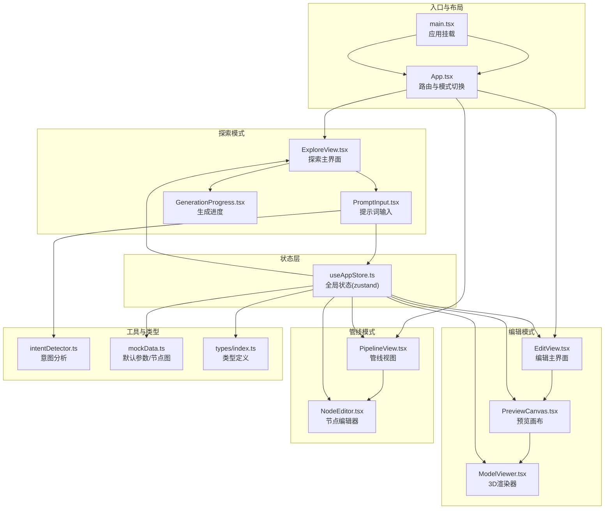
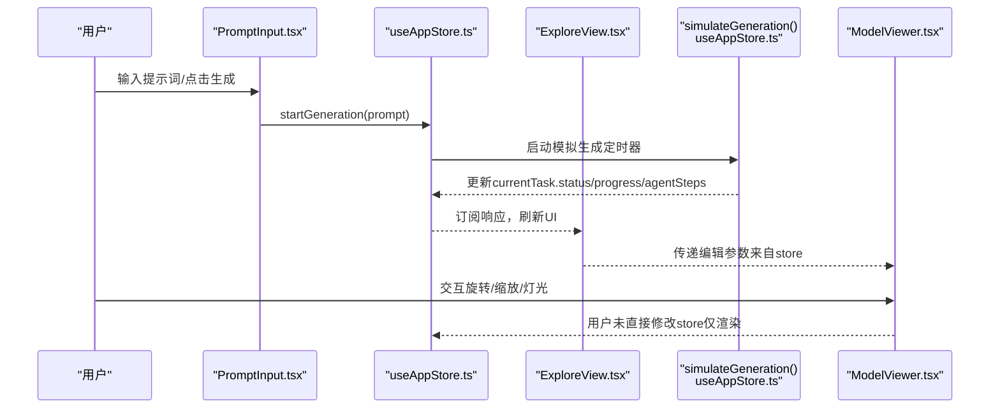
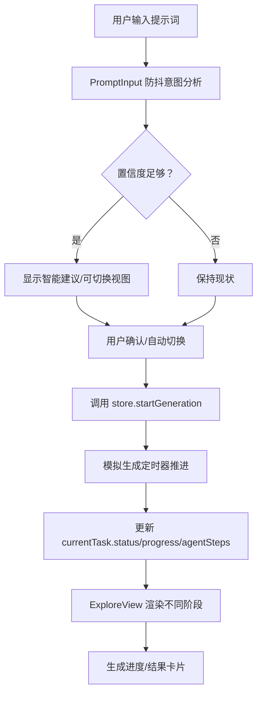
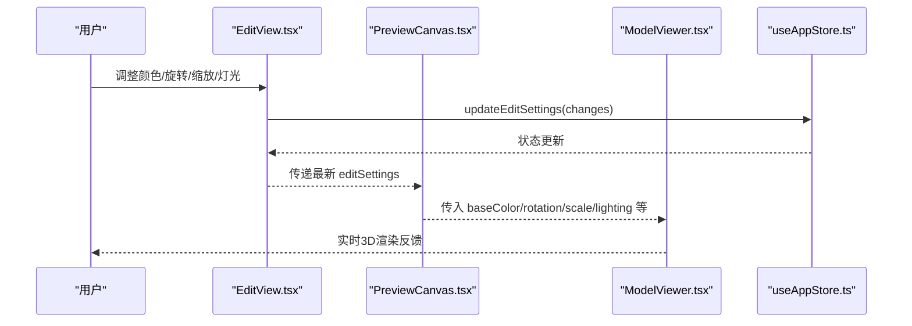
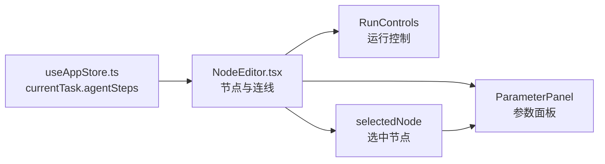
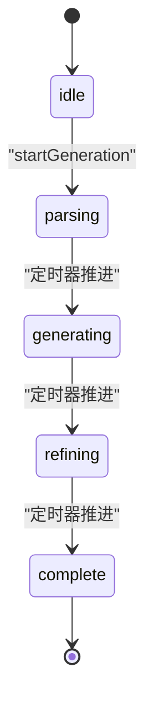
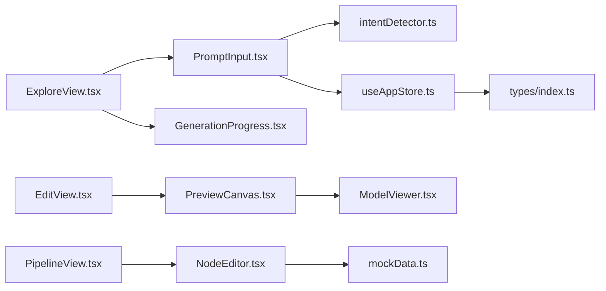
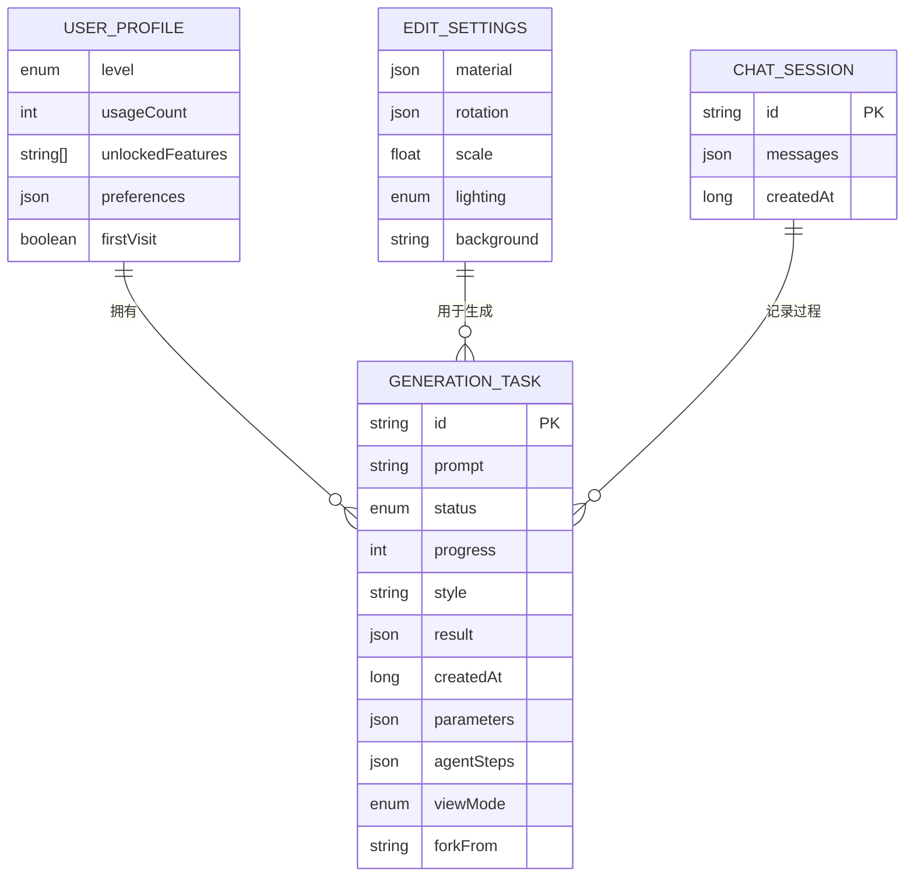

# 数据流设计

<cite>
**本文引用的文件**
- [src/App.tsx](file://src/App.tsx)
- [src/main.tsx](file://src/main.tsx)
- [src/store/useAppStore.ts](file://src/store/useAppStore.ts)
- [src/types/index.ts](file://src/types/index.ts)
- [src/components/Explore/ExploreView.tsx](file://src/components/Explore/ExploreView.tsx)
- [src/components/Explore/PromptInput.tsx](file://src/components/Explore/PromptInput.tsx)
- [src/components/Explore/GenerationProgress.tsx](file://src/components/Explore/GenerationProgress.tsx)
- [src/components/Edit/EditView.tsx](file://src/components/Edit/EditView.tsx)
- [src/components/Edit/PreviewCanvas.tsx](file://src/components/Edit/PreviewCanvas.tsx)
- [src/components/Pipeline/PipelineView.tsx](file://src/components/Pipeline/PipelineView.tsx)
- [src/components/Pipeline/NodeEditor.tsx](file://src/components/Pipeline/NodeEditor.tsx)
- [src/components/Shared/ModelViewer.tsx](file://src/components/Shared/ModelViewer.tsx)
- [src/components/Shared/SmartSuggestion.tsx](file://src/components/Shared/SmartSuggestion.tsx)
- [src/utils/intentDetector.ts](file://src/utils/intentDetector.ts)
- [src/utils/mockData.ts](file://src/utils/mockData.ts)
</cite>

## 目录
1. [引言](#引言)
2. [项目结构](#项目结构)
3. [核心组件](#核心组件)
4. [架构总览](#架构总览)
5. [详细组件分析](#详细组件分析)
6. [依赖关系分析](#依赖关系分析)
7. [性能考量](#性能考量)
8. [故障排查指南](#故障排查指南)
9. [结论](#结论)
10. [附录](#附录)

## 引言
本文件面向3D模型代理项目，聚焦“数据流设计”。文档从用户输入到3D渲染的完整路径出发，系统阐述应用中的数据流向、状态传播机制、单向数据流原则与实现方式、事件处理与状态更新触发机制，并提供数据流图与状态转换图。同时给出数据流优化与性能监控方法，以及错误处理与异常恢复策略。

## 项目结构
项目采用基于功能域的组织方式：页面视图组件位于components目录下，状态管理使用zustand集中于store，类型定义集中在types，工具函数位于utils，入口在main.tsx与App.tsx。

图表来源
- [src/main.tsx:1-14](file://src/main.tsx#L1-L14)
- [src/App.tsx:1-33](file://src/App.tsx#L1-L33)
- [src/store/useAppStore.ts:1-451](file://src/store/useAppStore.ts#L1-L451)
- [src/components/Explore/ExploreView.tsx:1-263](file://src/components/Explore/ExploreView.tsx#L1-L263)
- [src/components/Explore/PromptInput.tsx:1-161](file://src/components/Explore/PromptInput.tsx#L1-L161)
- [src/components/Explore/GenerationProgress.tsx:1-131](file://src/components/Explore/GenerationProgress.tsx#L1-L131)
- [src/components/Edit/EditView.tsx:1-159](file://src/components/Edit/EditView.tsx#L1-L159)
- [src/components/Edit/PreviewCanvas.tsx:1-54](file://src/components/Edit/PreviewCanvas.tsx#L1-L54)
- [src/components/Shared/ModelViewer.tsx:1-156](file://src/components/Shared/ModelViewer.tsx#L1-L156)
- [src/components/Pipeline/PipelineView.tsx:1-168](file://src/components/Pipeline/PipelineView.tsx#L1-L168)
- [src/components/Pipeline/NodeEditor.tsx:1-199](file://src/components/Pipeline/NodeEditor.tsx#L1-L199)
- [src/utils/intentDetector.ts:1-148](file://src/utils/intentDetector.ts#L1-L148)
- [src/utils/mockData.ts:1-189](file://src/utils/mockData.ts#L1-L189)
- [src/types/index.ts:1-206](file://src/types/index.ts#L1-L206)

章节来源
- [src/main.tsx:1-14](file://src/main.tsx#L1-L14)
- [src/App.tsx:1-33](file://src/App.tsx#L1-L33)
- [src/store/useAppStore.ts:1-451](file://src/store/useAppStore.ts#L1-L451)

## 核心组件
- 全局状态中心：useAppStore（zustand），统一管理应用模式、生成任务、编辑设置、用户画像、模板、对话会话等。
- 视图组件：ExploreView、EditView、PipelineView，分别承载探索生成、编辑调整、管线可视化与参数配置。
- 渲染层：ModelViewer（基于@react-three/fiber），将编辑态参数映射到Three.js场景。
- 工具层：intentDetector（意图分析）、mockData（默认参数与节点图）、类型定义（types）。

章节来源
- [src/store/useAppStore.ts:1-451](file://src/store/useAppStore.ts#L1-L451)
- [src/types/index.ts:1-206](file://src/types/index.ts#L1-L206)
- [src/utils/intentDetector.ts:1-148](file://src/utils/intentDetector.ts#L1-L148)
- [src/utils/mockData.ts:1-189](file://src/utils/mockData.ts#L1-L189)

## 架构总览
应用遵循单向数据流：用户输入通过组件事件进入状态中心，状态变化驱动UI更新；渲染层仅消费状态，不直接修改状态。生成流程由模拟定时器推进，状态变更通过订阅持久化至localStorage。

图表来源
- [src/components/Explore/PromptInput.tsx:52-66](file://src/components/Explore/PromptInput.tsx#L52-L66)
- [src/store/useAppStore.ts:121-136](file://src/store/useAppStore.ts#L121-L136)
- [src/store/useAppStore.ts:410-450](file://src/store/useAppStore.ts#L410-L450)
- [src/components/Explore/ExploreView.tsx:12](file://src/components/Explore/ExploreView.tsx#L12)
- [src/components/Shared/ModelViewer.tsx:136-156](file://src/components/Shared/ModelViewer.tsx#L136-L156)

## 详细组件分析

### 探索模式数据流（从输入到渲染）
- 用户输入：PromptInput接收文本，进行防抖意图分析，决定是否显示智能建议与视图模式切换。
- 生成启动：提交后调用store.startGeneration，创建任务并启动模拟生成。
- 进度展示：ExploreView根据currentTask状态切换输入/生成/结果三阶段；GenerationProgress绘制环形进度与步骤指示。
- 结果呈现：完成时展示结果卡片与技术详情（专业模式）。

图表来源
- [src/components/Explore/PromptInput.tsx:27-50](file://src/components/Explore/PromptInput.tsx#L27-L50)
- [src/components/Explore/PromptInput.tsx:52-76](file://src/components/Explore/PromptInput.tsx#L52-L76)
- [src/store/useAppStore.ts:121-136](file://src/store/useAppStore.ts#L121-L136)
- [src/store/useAppStore.ts:410-450](file://src/store/useAppStore.ts#L410-L450)
- [src/components/Explore/ExploreView.tsx:26-258](file://src/components/Explore/ExploreView.tsx#L26-L258)
- [src/components/Explore/GenerationProgress.tsx:13-131](file://src/components/Explore/GenerationProgress.tsx#L13-L131)

章节来源
- [src/components/Explore/PromptInput.tsx:1-161](file://src/components/Explore/PromptInput.tsx#L1-L161)
- [src/components/Explore/ExploreView.tsx:1-263](file://src/components/Explore/ExploreView.tsx#L1-L263)
- [src/components/Explore/GenerationProgress.tsx:1-131](file://src/components/Explore/GenerationProgress.tsx#L1-L131)
- [src/store/useAppStore.ts:121-172](file://src/store/useAppStore.ts#L121-L172)
- [src/utils/intentDetector.ts:77-147](file://src/utils/intentDetector.ts#L77-L147)

### 编辑模式数据流（参数到渲染）
- 参数来源：EditView读取store.editSettings，提供基础/专业两档控制面板。
- 实时预览：PreviewCanvas将编辑参数透传给ModelViewer，实现材质、旋转、缩放、灯光、背景等的即时反馈。
- 状态更新：用户操作通过updateEditSettings写回store，驱动后续渲染。

图表来源
- [src/components/Edit/EditView.tsx:30-112](file://src/components/Edit/EditView.tsx#L30-L112)
- [src/components/Edit/PreviewCanvas.tsx:5-25](file://src/components/Edit/PreviewCanvas.tsx#L5-L25)
- [src/components/Shared/ModelViewer.tsx:6-80](file://src/components/Shared/ModelViewer.tsx#L6-L80)
- [src/store/useAppStore.ts:174-177](file://src/store/useAppStore.ts#L174-L177)

章节来源
- [src/components/Edit/EditView.tsx:1-159](file://src/components/Edit/EditView.tsx#L1-L159)
- [src/components/Edit/PreviewCanvas.tsx:1-54](file://src/components/Edit/PreviewCanvas.tsx#L1-L54)
- [src/components/Shared/ModelViewer.tsx:1-156](file://src/components/Shared/ModelViewer.tsx#L1-L156)
- [src/store/useAppStore.ts:174-177](file://src/store/useAppStore.ts#L174-L177)

### 管线模式数据流（节点图到参数面板）
- 节点图：NodeEditor根据currentTask.agentSteps绘制节点与连接，状态驱动连线颜色与动画。
- 参数面板：ParameterPanel与NodeEditor联动，选中节点后展示对应参数。
- 控制器：RunControls负责运行/重置等操作（具体实现位于RunControls组件，此处作为流程说明）。

图表来源
- [src/store/useAppStore.ts:118-136](file://src/store/useAppStore.ts#L118-L136)
- [src/components/Pipeline/NodeEditor.tsx:9-77](file://src/components/Pipeline/NodeEditor.tsx#L9-L77)
- [src/components/Pipeline/PipelineView.tsx:9-84](file://src/components/Pipeline/PipelineView.tsx#L9-L84)

章节来源
- [src/components/Pipeline/PipelineView.tsx:1-168](file://src/components/Pipeline/PipelineView.tsx#L1-L168)
- [src/components/Pipeline/NodeEditor.tsx:1-199](file://src/components/Pipeline/NodeEditor.tsx#L1-L199)
- [src/store/useAppStore.ts:118-136](file://src/store/useAppStore.ts#L118-L136)

### 单向数据流与状态传播机制
- 单向数据流原则：事件自上而下进入状态中心，状态变更自下而上驱动UI更新；渲染层不直接写状态。
- 触发机制：用户事件（输入、点击、滑块）通过组件回调写入store；store内部定时器/计算逻辑更新状态；订阅器持久化到localStorage。
- 状态边界：AppMode、GenerationTask、EditSettings、UserProfile、Templates、ChatSession等均在store内统一管理。

章节来源
- [src/store/useAppStore.ts:114-394](file://src/store/useAppStore.ts#L114-L394)
- [src/store/useAppStore.ts:396-408](file://src/store/useAppStore.ts#L396-L408)

### 事件处理与状态更新
- 输入事件：PromptInput对输入进行防抖与意图分析，必要时建议切换视图或模式。
- 生成事件：startGeneration创建任务并启动模拟生成，逐步推进状态与进度。
- 编辑事件：EditView通过updateEditSettings更新材质/变换/灯光等参数。
- 管线事件：NodeEditor选中节点，ParameterPanel联动展示参数。

章节来源
- [src/components/Explore/PromptInput.tsx:27-82](file://src/components/Explore/PromptInput.tsx#L27-L82)
- [src/store/useAppStore.ts:121-172](file://src/store/useAppStore.ts#L121-L172)
- [src/store/useAppStore.ts:174-177](file://src/store/useAppStore.ts#L174-L177)
- [src/components/Pipeline/NodeEditor.tsx:176-194](file://src/components/Pipeline/NodeEditor.tsx#L176-L194)

### 状态转换图（生成流程）

图表来源
- [src/store/useAppStore.ts:410-450](file://src/store/useAppStore.ts#L410-L450)
- [src/types/index.ts:3](file://src/types/index.ts#L3)

## 依赖关系分析
- 组件依赖：ExploreView依赖PromptInput与GenerationProgress；EditView依赖PreviewCanvas与ModelViewer；PipelineView依赖NodeEditor。
- 状态依赖：各视图通过useAppStore读取/写入状态；NodeEditor依赖currentTask.agentSteps；PreviewCanvas依赖editSettings。
- 工具依赖：PromptInput依赖intentDetector；NodeEditor依赖mockData生成默认节点图。

图表来源
- [src/components/Explore/PromptInput.tsx:3-23](file://src/components/Explore/PromptInput.tsx#L3-L23)
- [src/utils/intentDetector.ts:1-1](file://src/utils/intentDetector.ts#L1-L1)
- [src/components/Edit/PreviewCanvas.tsx:1-3](file://src/components/Edit/PreviewCanvas.tsx#L1-L3)
- [src/components/Shared/ModelViewer.tsx:1-4](file://src/components/Shared/ModelViewer.tsx#L1-L4)
- [src/components/Pipeline/NodeEditor.tsx:4-6](file://src/components/Pipeline/NodeEditor.tsx#L4-L6)
- [src/utils/mockData.ts:1-1](file://src/utils/mockData.ts#L1-L1)
- [src/store/useAppStore.ts:1-17](file://src/store/useAppStore.ts#L1-L17)
- [src/types/index.ts:1-17](file://src/types/index.ts#L1-L17)

章节来源
- [src/components/Explore/PromptInput.tsx:1-161](file://src/components/Explore/PromptInput.tsx#L1-L161)
- [src/components/Explore/GenerationProgress.tsx:1-131](file://src/components/Explore/GenerationProgress.tsx#L1-L131)
- [src/components/Edit/EditView.tsx:1-159](file://src/components/Edit/EditView.tsx#L1-L159)
- [src/components/Edit/PreviewCanvas.tsx:1-54](file://src/components/Edit/PreviewCanvas.tsx#L1-L54)
- [src/components/Shared/ModelViewer.tsx:1-156](file://src/components/Shared/ModelViewer.tsx#L1-L156)
- [src/components/Pipeline/PipelineView.tsx:1-168](file://src/components/Pipeline/PipelineView.tsx#L1-L168)
- [src/components/Pipeline/NodeEditor.tsx:1-199](file://src/components/Pipeline/NodeEditor.tsx#L1-L199)
- [src/utils/intentDetector.ts:1-148](file://src/utils/intentDetector.ts#L1-L148)
- [src/utils/mockData.ts:1-189](file://src/utils/mockData.ts#L1-L189)
- [src/store/useAppStore.ts:1-451](file://src/store/useAppStore.ts#L1-L451)
- [src/types/index.ts:1-206](file://src/types/index.ts#L1-L206)

## 性能考量
- 渲染性能
  - 使用React.memo封装ModelViewer，避免不必要的重渲染。
  - useFrame按需更新旋转等动画，减少无关帧循环开销。
- 状态更新
  - 将大对象（如agentSteps）拆分为独立字段，降低订阅范围，减少无关组件重渲染。
  - 使用局部状态（如ExploreView内的advancedParams）隔离非关键状态，避免污染全局store。
- 动画与过渡
  - 使用AnimatePresence与framer-motion的轻量动画，注意在低端设备上可降级。
- 计算优化
  - 意图分析使用防抖（500ms），避免高频重复计算。
  - NodeEditor的连线与视窗计算使用memo化，仅在steps变化时重建。
- 存储与持久化
  - 通过store订阅将UserProfile与Templates写入localStorage，避免频繁IO。

章节来源
- [src/components/Shared/ModelViewer.tsx:136-156](file://src/components/Shared/ModelViewer.tsx#L136-L156)
- [src/components/Explore/PromptInput.tsx:27-50](file://src/components/Explore/PromptInput.tsx#L27-L50)
- [src/components/Pipeline/NodeEditor.tsx:176-194](file://src/components/Pipeline/NodeEditor.tsx#L176-L194)
- [src/store/useAppStore.ts:396-408](file://src/store/useAppStore.ts#L396-L408)

## 故障排查指南
- 生成卡死或状态不更新
  - 检查模拟生成定时器是否被中断；确认currentTask存在且状态推进逻辑正常。
  - 关注updateTaskStatus/completeTask调用链路。
- 意图分析建议不出现
  - 确认PromptInput的防抖与setIntentAnalysis调用；检查confidence阈值与viewMode差异。
- 编辑参数无效果
  - 确认EditView通过updateEditSettings写回store；检查PreviewCanvas是否正确透传参数。
- 管线节点无连线或连线颜色异常
  - 检查agentSteps的position与connections；确认NodeEditor的连线计算与状态映射。
- 错误恢复
  - 在状态中心增加错误字段与重试逻辑；在UI层提供“重试/重置”按钮，清空currentTask并重新发起生成。
  - 对localStorage持久化失败进行try/catch保护，避免阻塞主线程。

章节来源
- [src/store/useAppStore.ts:138-172](file://src/store/useAppStore.ts#L138-L172)
- [src/components/Explore/PromptInput.tsx:27-50](file://src/components/Explore/PromptInput.tsx#L27-L50)
- [src/components/Edit/EditView.tsx:105-112](file://src/components/Edit/EditView.tsx#L105-L112)
- [src/components/Pipeline/NodeEditor.tsx:38-100](file://src/components/Pipeline/NodeEditor.tsx#L38-L100)

## 结论
本项目通过zustand实现清晰的单向数据流：用户事件驱动状态变更，状态变更驱动UI与渲染更新。探索、编辑、管线三大模式围绕统一的状态中心协同工作，配合防抖、动画与持久化策略，在保证交互流畅的同时兼顾性能与可维护性。未来可在错误恢复、性能监控与更细粒度的状态切分方面持续优化。

## 附录
- 类型与数据模型概览（节选）

图表来源
- [src/types/index.ts:105-116](file://src/types/index.ts#L105-L116)
- [src/types/index.ts:13-26](file://src/types/index.ts#L13-L26)
- [src/types/index.ts:93-99](file://src/types/index.ts#L93-L99)
- [src/types/index.ts:188-193](file://src/types/index.ts#L188-L193)