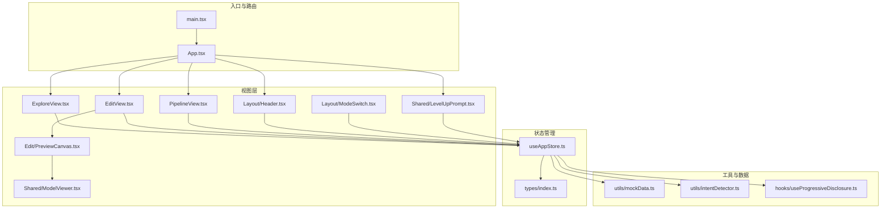
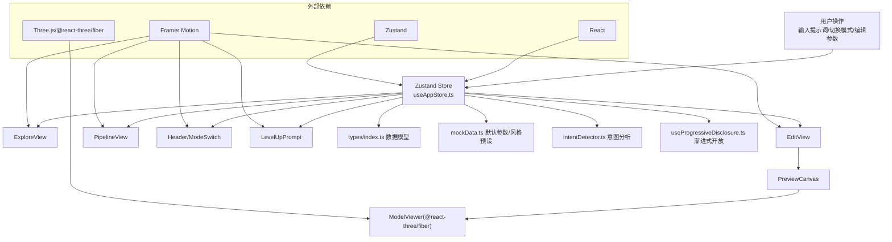
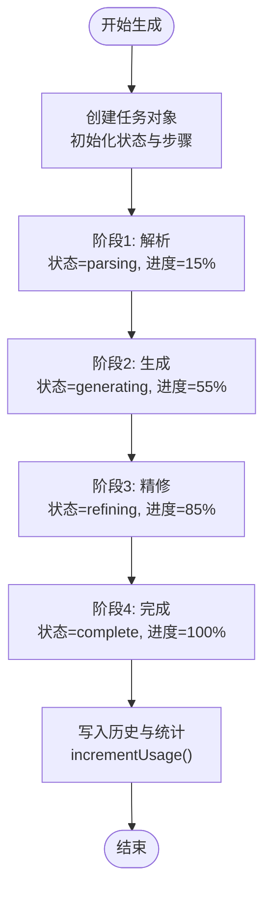
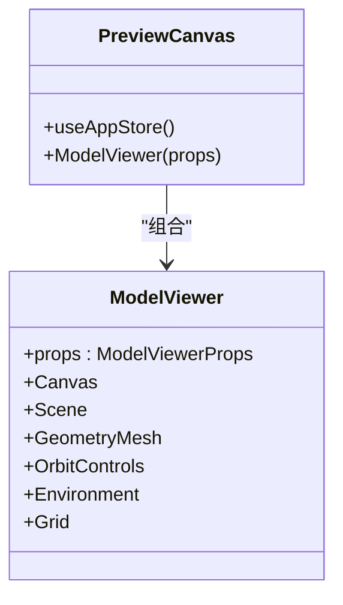
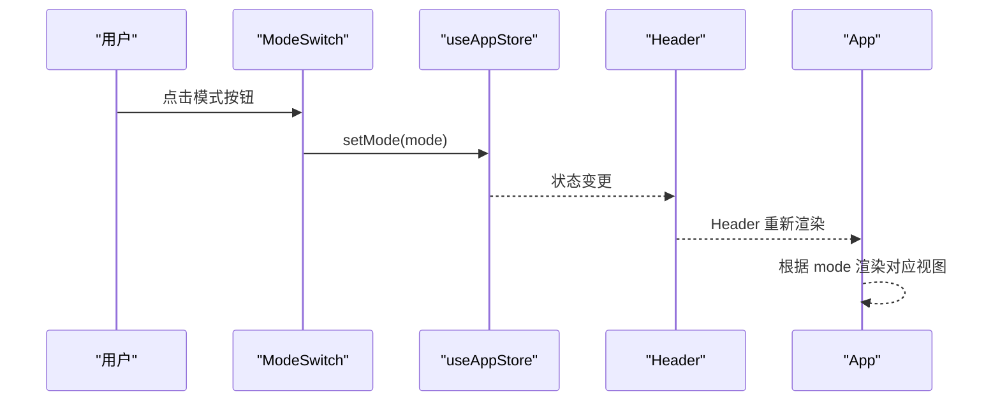
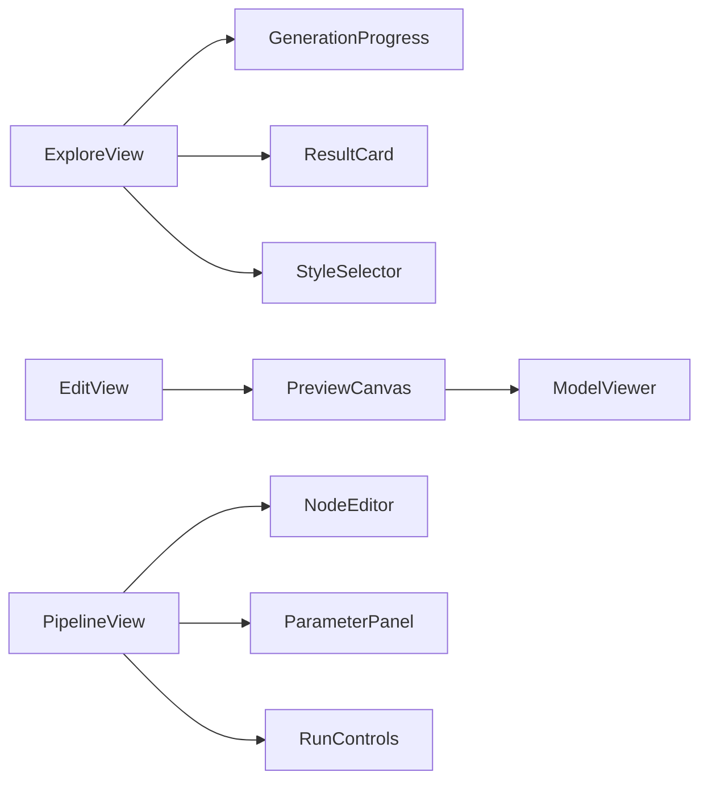
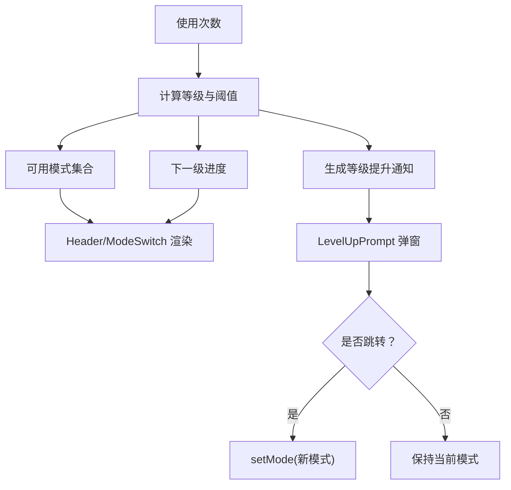
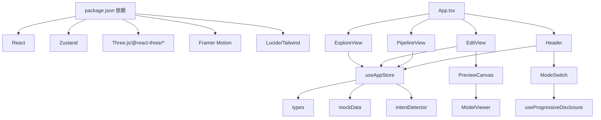

# 架构设计

<cite>
**本文引用的文件**
- [src/App.tsx](file://src/App.tsx)
- [src/main.tsx](file://src/main.tsx)
- [src/store/useAppStore.ts](file://src/store/useAppStore.ts)
- [src/types/index.ts](file://src/types/index.ts)
- [src/components/Explore/ExploreView.tsx](file://src/components/Explore/ExploreView.tsx)
- [src/components/Edit/EditView.tsx](file://src/components/Edit/EditView.tsx)
- [src/components/Pipeline/PipelineView.tsx](file://src/components/Pipeline/PipelineView.tsx)
- [src/components/Layout/Header.tsx](file://src/components/Layout/Header.tsx)
- [src/components/Layout/ModeSwitch.tsx](file://src/components/Layout/ModeSwitch.tsx)
- [src/components/Edit/PreviewCanvas.tsx](file://src/components/Edit/PreviewCanvas.tsx)
- [src/components/Shared/ModelViewer.tsx](file://src/components/Shared/ModelViewer.tsx)
- [src/components/Shared/LevelUpPrompt.tsx](file://src/components/Shared/LevelUpPrompt.tsx)
- [src/hooks/useProgressiveDisclosure.ts](file://src/hooks/useProgressiveDisclosure.ts)
- [src/utils/mockData.ts](file://src/utils/mockData.ts)
- [src/utils/intentDetector.ts](file://src/utils/intentDetector.ts)
- [package.json](file://package.json)
</cite>

## 目录
1. [引言](#引言)
2. [项目结构](#项目结构)
3. [核心组件](#核心组件)
4. [架构总览](#架构总览)
5. [详细组件分析](#详细组件分析)
6. [依赖关系分析](#依赖关系分析)
7. [性能考虑](#性能考虑)
8. [故障排查指南](#故障排查指南)
9. [结论](#结论)
10. [附录](#附录)

## 引言
本项目是一个以“3D模型代理”为核心的前端应用，围绕三大核心视图（探索、编辑、管线）构建，结合意图识别、进度模拟与状态持久化，形成从自然语言到3D模型生成的闭环体验。系统采用 Zustand 进行全局状态管理，Three.js 与 @react-three/fiber 驱动 3D 场景渲染，并通过 Framer Motion 实现流畅的过渡动画。

## 项目结构
项目采用按功能域分层的目录组织方式：
- 根入口与路由：main.tsx 负责挂载根组件，App.tsx 作为顶层容器，根据当前模式渲染不同视图。
- 组件层：components 下按功能域拆分 Explore、Edit、Pipeline、Layout、Shared 子目录，每个子目录内包含视图组件与其子组件。
- 状态层：store/useAppStore.ts 定义全局状态与动作，订阅本地存储实现持久化。
- 类型定义：types/index.ts 统一声明应用中的数据模型与枚举。
- 工具与钩子：utils 提供意图检测、默认参数与示例数据；hooks 提供渐进式开放能力计算。
- 依赖：package.json 明确了 React、Zustand、Three.js、@react-three/fiber 等核心依赖。

图表来源
- [src/main.tsx:1-14](file://src/main.tsx#L1-L14)
- [src/App.tsx:1-33](file://src/App.tsx#L1-L33)
- [src/store/useAppStore.ts:1-368](file://src/store/useAppStore.ts#L1-L368)
- [src/types/index.ts:1-160](file://src/types/index.ts#L1-L160)
- [src/components/Explore/ExploreView.tsx:1-263](file://src/components/Explore/ExploreView.tsx#L1-L263)
- [src/components/Edit/EditView.tsx:1-159](file://src/components/Edit/EditView.tsx#L1-L159)
- [src/components/Pipeline/PipelineView.tsx:1-168](file://src/components/Pipeline/PipelineView.tsx#L1-L168)
- [src/components/Layout/Header.tsx:1-78](file://src/components/Layout/Header.tsx#L1-L78)
- [src/components/Layout/ModeSwitch.tsx:1-82](file://src/components/Layout/ModeSwitch.tsx#L1-L82)
- [src/components/Edit/PreviewCanvas.tsx:1-54](file://src/components/Edit/PreviewCanvas.tsx#L1-L54)
- [src/components/Shared/ModelViewer.tsx:1-156](file://src/components/Shared/ModelViewer.tsx#L1-L156)
- [src/components/Shared/LevelUpPrompt.tsx:1-128](file://src/components/Shared/LevelUpPrompt.tsx#L1-L128)
- [src/utils/mockData.ts:1-189](file://src/utils/mockData.ts#L1-L189)
- [src/utils/intentDetector.ts:1-148](file://src/utils/intentDetector.ts#L1-L148)
- [src/hooks/useProgressiveDisclosure.ts:1-136](file://src/hooks/useProgressiveDisclosure.ts#L1-L136)

章节来源
- [src/main.tsx:1-14](file://src/main.tsx#L1-L14)
- [src/App.tsx:1-33](file://src/App.tsx#L1-L33)

## 核心组件
- 全局状态中心：Zustand Store
  - 职责：统一管理应用模式、生成任务、编辑设置、用户档案、模板、意图分析与等级提升通知等。
  - 特性：支持本地存储持久化、任务进度模拟、用户等级与功能解锁逻辑。
- 视图容器：App.tsx
  - 职责：根据当前模式渲染 Explore/Edit/Pipeline 三类视图，并承载背景与提示组件。
- 视图层：Explore/Edit/Pipeline
  - Explore：输入提示词与风格选择，展示生成进度与结果卡片，支持专业模式下的 Agent 步骤与技术细节。
  - Edit：3D 预览画布与材质/变换/光照面板，支持简单/专业两种视图模式。
  - Pipeline：线性步骤列表或专业模式下的节点图编辑与参数面板。
- 3D 渲染：ModelViewer（@react-three/fiber + Three.js）
  - 职责：基于属性驱动的几何体与材质渲染，提供轨道控制器、环境贴图与网格辅助。
- 用户体验：Header、ModeSwitch、LevelUpPrompt
  - Header：模式切换与视图模式切换；ModeSwitch：基于使用次数的渐进式解锁；LevelUpPrompt：等级提升提示与自动跳转。

章节来源
- [src/store/useAppStore.ts:1-368](file://src/store/useAppStore.ts#L1-L368)
- [src/App.tsx:1-33](file://src/App.tsx#L1-L33)
- [src/components/Explore/ExploreView.tsx:1-263](file://src/components/Explore/ExploreView.tsx#L1-L263)
- [src/components/Edit/EditView.tsx:1-159](file://src/components/Edit/EditView.tsx#L1-L159)
- [src/components/Pipeline/PipelineView.tsx:1-168](file://src/components/Pipeline/PipelineView.tsx#L1-L168)
- [src/components/Shared/ModelViewer.tsx:1-156](file://src/components/Shared/ModelViewer.tsx#L1-L156)
- [src/components/Layout/Header.tsx:1-78](file://src/components/Layout/Header.tsx#L1-L78)
- [src/components/Layout/ModeSwitch.tsx:1-82](file://src/components/Layout/ModeSwitch.tsx#L1-L82)
- [src/components/Shared/LevelUpPrompt.tsx:1-128](file://src/components/Shared/LevelUpPrompt.tsx#L1-L128)

## 架构总览
系统采用“状态驱动视图”的单向数据流：
- 外部输入（用户操作、意图分析）触发 Store 动作。
- Store 更新全局状态，驱动组件重新渲染。
- 3D 渲染由 ModelViewer 基于 Store 中的编辑设置实时更新。
- 视图层通过 Framer Motion 实现平滑的模式切换与面板展开收起。

图表来源
- [src/store/useAppStore.ts:1-368](file://src/store/useAppStore.ts#L1-L368)
- [src/components/Explore/ExploreView.tsx:1-263](file://src/components/Explore/ExploreView.tsx#L1-L263)
- [src/components/Edit/EditView.tsx:1-159](file://src/components/Edit/EditView.tsx#L1-L159)
- [src/components/Pipeline/PipelineView.tsx:1-168](file://src/components/Pipeline/PipelineView.tsx#L1-L168)
- [src/components/Edit/PreviewCanvas.tsx:1-54](file://src/components/Edit/PreviewCanvas.tsx#L1-L54)
- [src/components/Shared/ModelViewer.tsx:1-156](file://src/components/Shared/ModelViewer.tsx#L1-L156)
- [src/components/Layout/Header.tsx:1-78](file://src/components/Layout/Header.tsx#L1-L78)
- [src/components/Layout/ModeSwitch.tsx:1-82](file://src/components/Layout/ModeSwitch.tsx#L1-L82)
- [src/components/Shared/LevelUpPrompt.tsx:1-128](file://src/components/Shared/LevelUpPrompt.tsx#L1-L128)
- [src/utils/mockData.ts:1-189](file://src/utils/mockData.ts#L1-L189)
- [src/utils/intentDetector.ts:1-148](file://src/utils/intentDetector.ts#L1-L148)
- [src/hooks/useProgressiveDisclosure.ts:1-136](file://src/hooks/useProgressiveDisclosure.ts#L1-L136)
- [package.json:11-22](file://package.json#L11-L22)

## 详细组件分析

### Zustand 状态管理与数据流
- 状态切片
  - 应用模式与任务：mode、currentTask、taskHistory、startGeneration、updateTaskStatus、completeTask。
  - 编辑设置：editSettings、updateEditSettings。
  - 管线选择：selectedNode、setSelectedNode。
  - UI：sidebarOpen、toggleSidebar。
  - 用户档案与等级：userProfile、viewMode、setViewMode、incrementUsage、unlockFeature、checkLevelUp、setUserLevel、dismissFirstVisit。
  - 模板：templates、addTemplate、removeTemplate、updateTemplate。
  - 意图分析与等级提示：intentAnalysis、setIntentAnalysis、levelUpNotification、setLevelUpNotification、dismissLevelUpNotification。
- 持久化策略
  - 通过 subscribe 将 userProfile 与 templates 写入 localStorage，确保刷新不丢失。
- 生成流程模拟
  - 使用定时器推进任务状态与 Agent 步骤，最终完成并写入历史记录。
- 数据模型
  - types/index.ts 定义了 GenerationTask、GenerationParameters、EditSettings、AgentStep、UserProfile 等核心类型，保证 Store 与视图层的数据契约清晰。

图表来源
- [src/store/useAppStore.ts:107-158](file://src/store/useAppStore.ts#L107-L158)
- [src/store/useAppStore.ts:327-367](file://src/store/useAppStore.ts#L327-L367)
- [src/types/index.ts:13-64](file://src/types/index.ts#L13-L64)

章节来源
- [src/store/useAppStore.ts:1-368](file://src/store/useAppStore.ts#L1-L368)
- [src/types/index.ts:1-160](file://src/types/index.ts#L1-L160)

### Three.js 与 @react-three/fiber 集成架构
- ModelViewer 组件
  - 通过 Canvas 创建渲染上下文，Scene 组织光源、环境贴图、网格与几何体，GeometryMesh 根据属性动态更新材质与变换。
  - OrbitControls 提供交互式视角控制，Suspense 提供加载占位。
- PreviewCanvas
  - 将 Store 中的编辑设置映射为 ModelViewer 的属性，实现“所见即所得”的实时预览。
- 集成优势
  - 以 React 组件化方式管理 Three.js 场景，便于与 UI 状态解耦。
  - 使用 memo 包装减少不必要的重渲染。

图表来源
- [src/components/Shared/ModelViewer.tsx:1-156](file://src/components/Shared/ModelViewer.tsx#L1-L156)
- [src/components/Edit/PreviewCanvas.tsx:1-54](file://src/components/Edit/PreviewCanvas.tsx#L1-L54)

章节来源
- [src/components/Shared/ModelViewer.tsx:1-156](file://src/components/Shared/ModelViewer.tsx#L1-L156)
- [src/components/Edit/PreviewCanvas.tsx:1-54](file://src/components/Edit/PreviewCanvas.tsx#L1-L54)

### React 组件组织与通信机制
- 单向数据流
  - 组件通过 useAppStore 读取状态与调用动作，避免跨层级传递回调。
- 组件间通信
  - Header 与 ModeSwitch：Header 调用 ModeSwitch 并根据用户等级显示可用模式；ModeSwitch 通过 useAppStore 控制模式切换。
  - LevelUpPrompt：监听等级提升通知，提供一键跳转至新解锁模式的能力。
- 动画与过渡
  - Framer Motion 在 Explore/Edit/Pipeline 与 Header/提示组件中提供平滑的入场、出场与布局变化。

图表来源
- [src/components/Layout/ModeSwitch.tsx:18-82](file://src/components/Layout/ModeSwitch.tsx#L18-L82)
- [src/store/useAppStore.ts:100-102](file://src/store/useAppStore.ts#L100-L102)
- [src/components/Layout/Header.tsx:8-78](file://src/components/Layout/Header.tsx#L8-L78)
- [src/App.tsx:10-32](file://src/App.tsx#L10-L32)

章节来源
- [src/components/Layout/ModeSwitch.tsx:1-82](file://src/components/Layout/ModeSwitch.tsx#L1-L82)
- [src/components/Layout/Header.tsx:1-78](file://src/components/Layout/Header.tsx#L1-L78)
- [src/App.tsx:1-33](file://src/App.tsx#L1-L33)

### 视图层与功能视图
- Explore 视图
  - 输入区：PromptInput、StyleSelector。
  - 生成区：GenerationProgress 展示 Agent 步骤与进度；ResultCard 展示结果。
  - 专业模式：展示技术细节（面数、格式、贴图信息）。
- Edit 视图
  - PreviewCanvas + ModelViewer 实时预览。
  - 材质/变换/光照面板随视图模式切换。
- Pipeline 视图
  - 简洁模式：线性步骤列表。
  - 专业模式：节点图编辑与参数面板。

图表来源
- [src/components/Explore/ExploreView.tsx:1-263](file://src/components/Explore/ExploreView.tsx#L1-L263)
- [src/components/Edit/EditView.tsx:1-159](file://src/components/Edit/EditView.tsx#L1-L159)
- [src/components/Pipeline/PipelineView.tsx:1-168](file://src/components/Pipeline/PipelineView.tsx#L1-L168)
- [src/components/Edit/PreviewCanvas.tsx:1-54](file://src/components/Edit/PreviewCanvas.tsx#L1-L54)
- [src/components/Shared/ModelViewer.tsx:1-156](file://src/components/Shared/ModelViewer.tsx#L1-L156)

章节来源
- [src/components/Explore/ExploreView.tsx:1-263](file://src/components/Explore/ExploreView.tsx#L1-L263)
- [src/components/Edit/EditView.tsx:1-159](file://src/components/Edit/EditView.tsx#L1-L159)
- [src/components/Pipeline/PipelineView.tsx:1-168](file://src/components/Pipeline/PipelineView.tsx#L1-L168)

### 渐进式开放与等级系统
- 使用次数阈值解锁模式与功能，通过 useProgressiveDisclosure 计算当前等级、可用模式与下一级进度。
- LevelUpPrompt 在满足条件时弹出提示，支持一键跳转至新模式。

图表来源
- [src/hooks/useProgressiveDisclosure.ts:60-136](file://src/hooks/useProgressiveDisclosure.ts#L60-L136)
- [src/store/useAppStore.ts:177-215](file://src/store/useAppStore.ts#L177-L215)
- [src/components/Shared/LevelUpPrompt.tsx:7-128](file://src/components/Shared/LevelUpPrompt.tsx#L7-L128)

章节来源
- [src/hooks/useProgressiveDisclosure.ts:1-136](file://src/hooks/useProgressiveDisclosure.ts#L1-L136)
- [src/store/useAppStore.ts:171-215](file://src/store/useAppStore.ts#L171-L215)
- [src/components/Shared/LevelUpPrompt.tsx:1-128](file://src/components/Shared/LevelUpPrompt.tsx#L1-L128)

## 依赖关系分析
- 外部依赖
  - React 生态：React、React DOM、React Router。
  - 状态管理：Zustand。
  - 3D 渲染：Three.js、@react-three/fiber、@react-three/drei。
  - 动画：Framer Motion。
  - UI：Lucide React、TailwindCSS。
- 内部依赖
  - 所有视图组件依赖 useAppStore 获取状态与动作。
  - Edit/PreviewCanvas 依赖 ModelViewer 进行渲染。
  - Header/ModeSwitch 依赖 useProgressiveDisclosure 计算可用模式。
  - Store 依赖 types、mockData、intentDetector 提供类型、默认值与意图分析。

图表来源
- [package.json:11-22](file://package.json#L11-L22)
- [src/App.tsx:1-33](file://src/App.tsx#L1-L33)
- [src/store/useAppStore.ts:1-368](file://src/store/useAppStore.ts#L1-L368)
- [src/components/Edit/PreviewCanvas.tsx:1-54](file://src/components/Edit/PreviewCanvas.tsx#L1-L54)
- [src/components/Shared/ModelViewer.tsx:1-156](file://src/components/Shared/ModelViewer.tsx#L1-L156)
- [src/components/Layout/Header.tsx:1-78](file://src/components/Layout/Header.tsx#L1-L78)
- [src/components/Layout/ModeSwitch.tsx:1-82](file://src/components/Layout/ModeSwitch.tsx#L1-L82)
- [src/hooks/useProgressiveDisclosure.ts:1-136](file://src/hooks/useProgressiveDisclosure.ts#L1-L136)
- [src/utils/mockData.ts:1-189](file://src/utils/mockData.ts#L1-L189)
- [src/utils/intentDetector.ts:1-148](file://src/utils/intentDetector.ts#L1-L148)
- [src/types/index.ts:1-160](file://src/types/index.ts#L1-L160)

章节来源
- [package.json:11-35](file://package.json#L11-L35)
- [src/store/useAppStore.ts:1-368](file://src/store/useAppStore.ts#L1-L368)

## 性能考虑
- 渲染优化
  - ModelViewer 使用 React.memo 包装，减少重复渲染。
  - useFrame 在渲染循环中仅更新必要属性，避免全量重算。
- 状态粒度
  - Store 将状态切分为多个领域（任务、编辑、用户档案等），降低无关更新带来的重渲染。
- 动画与懒加载
  - Framer Motion 的 AnimatePresence 在切换视图时仅处理可见区域的过渡。
  - Suspense 提供 Canvas 加载占位，改善首屏体验。
- 本地存储
  - 通过 subscribe 持久化关键状态，避免频繁 IO，提高启动速度。

## 故障排查指南
- 生成流程卡在某个阶段
  - 检查 Store 中 currentTask.status 与 progress 是否被正确推进；确认模拟函数是否执行。
  - 关注 Agent 步骤数组的状态与进度更新。
- 编辑设置未生效
  - 确认 EditView 中 updateEditSettings 是否被调用；检查 PreviewCanvas 传入的属性是否来自 Store。
- 模式切换无效
  - 检查 ModeSwitch 的 isLocked 判定与 useProgressiveDisclosure 返回的 availableModes。
- 等级提升提示不出现
  - 确认 incrementUsage 是否被调用；检查 levelUpNotification 是否存在且未被关闭。
- 3D 场景空白或加载缓慢
  - 检查 Canvas 的 antialias 与 alpha 设置；确认 Suspense fallback 是否正常显示。

章节来源
- [src/store/useAppStore.ts:107-158](file://src/store/useAppStore.ts#L107-L158)
- [src/components/Edit/EditView.tsx:10-159](file://src/components/Edit/EditView.tsx#L10-L159)
- [src/components/Edit/PreviewCanvas.tsx:5-54](file://src/components/Edit/PreviewCanvas.tsx#L5-L54)
- [src/components/Layout/ModeSwitch.tsx:18-82](file://src/components/Layout/ModeSwitch.tsx#L18-L82)
- [src/hooks/useProgressiveDisclosure.ts:60-136](file://src/hooks/useProgressiveDisclosure.ts#L60-L136)
- [src/components/Shared/ModelViewer.tsx:136-156](file://src/components/Shared/ModelViewer.tsx#L136-L156)

## 结论
该架构以 Zustand 为核心，结合 Three.js 与 @react-three/fiber，实现了从自然语言到 3D 模型的可视化生成流程。通过渐进式开放与等级系统，提升了用户体验与学习曲线的可控性。组件间通过单向数据流协作，配合 Framer Motion 的动画与 Suspense 的懒加载，提供了流畅且可维护的前端体验。未来可在以下方面持续演进：
- 将生成流程与真实后端对接，替换模拟函数。
- 扩展模板系统与工作流编排能力。
- 引入更细粒度的缓存与离线能力，增强弱网场景体验。

## 附录
- 关键类型与数据模型
  - 生成任务：GenerationTask、GenerationResult、GenerationParameters、AgentStep。
  - 用户与等级：UserProfile、UserLevel、ViewMode、LevelUpNotification。
  - 编辑设置：EditSettings、MaterialSettings。
- 默认参数与风格预设
  - defaultParameters、defaultEditSettings、stylePresets、createMockAgentSteps。
- 意图分析
  - 关键词库与自动参数提取，用于推荐模式与视图模式。

章节来源
- [src/types/index.ts:1-160](file://src/types/index.ts#L1-L160)
- [src/utils/mockData.ts:1-189](file://src/utils/mockData.ts#L1-L189)
- [src/utils/intentDetector.ts:1-148](file://src/utils/intentDetector.ts#L1-L148)