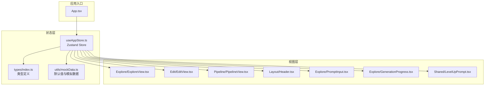
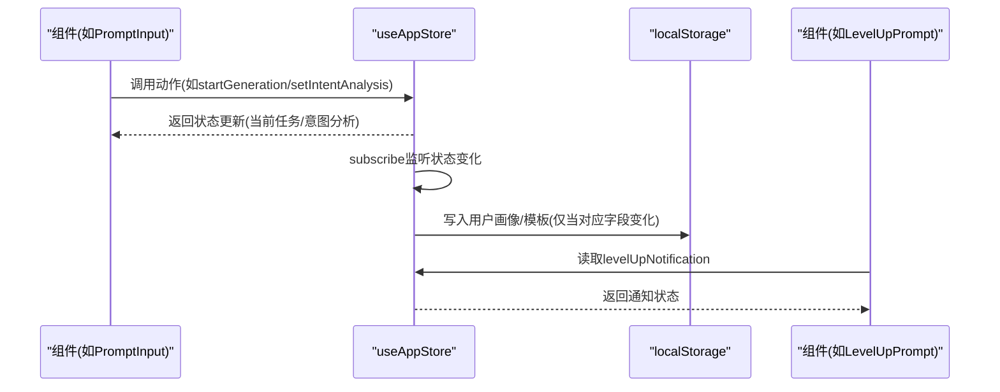
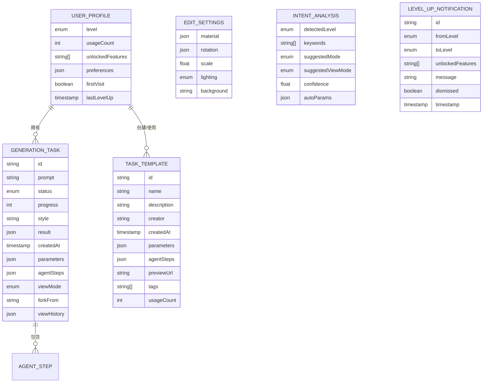
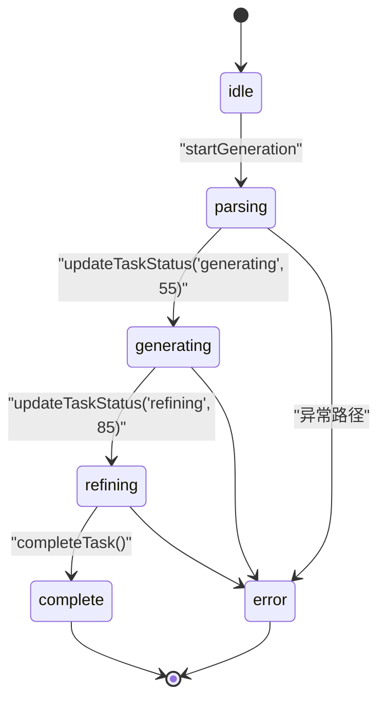
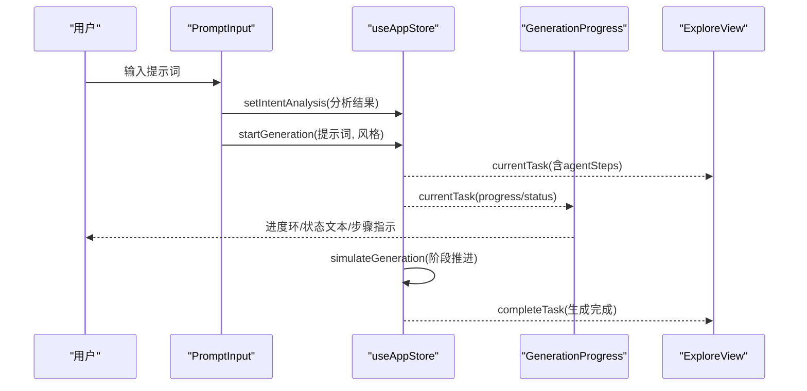
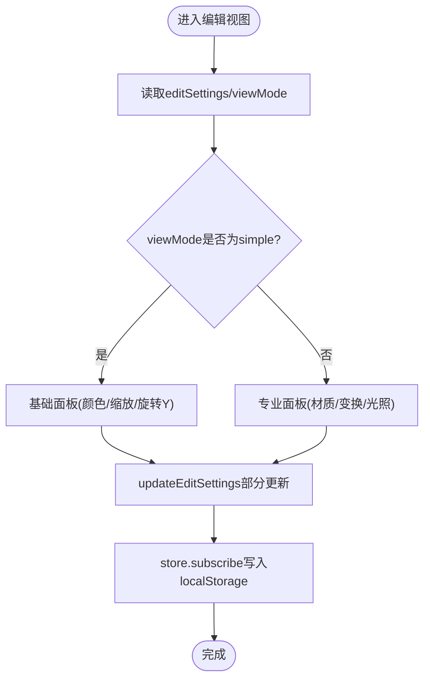
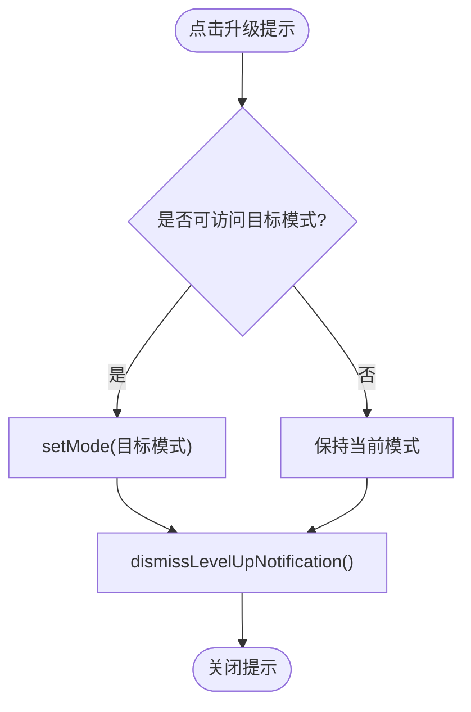
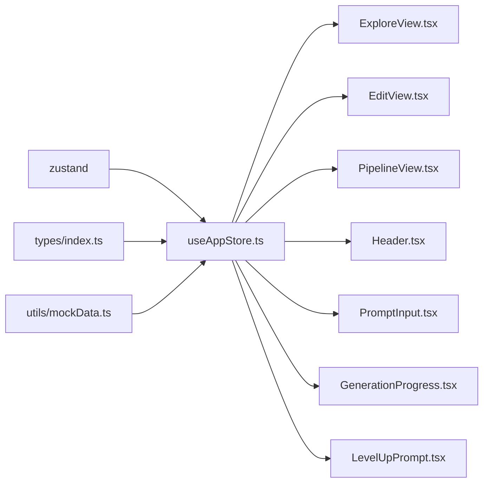

# 状态管理架构

<cite>
**本文引用的文件**
- [useAppStore.ts](file://src/store/useAppStore.ts)
- [index.ts](file://src/types/index.ts)
- [mockData.ts](file://src/utils/mockData.ts)
- [App.tsx](file://src/App.tsx)
- [Header.tsx](file://src/components/Layout/Header.tsx)
- [ExploreView.tsx](file://src/components/Explore/ExploreView.tsx)
- [PromptInput.tsx](file://src/components/Explore/PromptInput.tsx)
- [GenerationProgress.tsx](file://src/components/Explore/GenerationProgress.tsx)
- [EditView.tsx](file://src/components/Edit/EditView.tsx)
- [PipelineView.tsx](file://src/components/Pipeline/PipelineView.tsx)
- [LevelUpPrompt.tsx](file://src/components/Shared/LevelUpPrompt.tsx)
- [package.json](file://package.json)
</cite>

## 目录
1. [简介](#简介)
2. [项目结构](#项目结构)
3. [核心组件](#核心组件)
4. [架构总览](#架构总览)
5. [详细组件分析](#详细组件分析)
6. [依赖关系分析](#依赖关系分析)
7. [性能考量](#性能考量)
8. [故障排查指南](#故障排查指南)
9. [结论](#结论)
10. [附录](#附录)

## 简介
本文件系统性梳理3D模型代理项目的Zustand状态管理架构与实现，覆盖全局状态组织、响应式更新机制、订阅与持久化策略、状态流转与变更追踪，并提供最佳实践与性能优化建议。目标是帮助开发者在不直接阅读代码的情况下，也能清晰理解状态如何驱动UI与业务流程。

## 项目结构
项目采用按功能域划分的目录结构，状态管理集中在store目录下的单一Zustand Store中，类型定义集中于types目录，组件按功能域分层组织。Zustand Store通过create函数创建，内部包含完整的状态域与动作方法，配合subscribe实现本地持久化。

图表来源
- [App.tsx:10-32](file://src/App.tsx#L10-L32)
- [useAppStore.ts:100-311](file://src/store/useAppStore.ts#L100-L311)
- [index.ts:1-160](file://src/types/index.ts#L1-L160)
- [mockData.ts:1-189](file://src/utils/mockData.ts#L1-L189)

章节来源
- [App.tsx:10-32](file://src/App.tsx#L10-L32)
- [useAppStore.ts:100-311](file://src/store/useAppStore.ts#L100-L311)
- [index.ts:1-160](file://src/types/index.ts#L1-L160)
- [mockData.ts:1-189](file://src/utils/mockData.ts#L1-L189)

## 核心组件
- Zustand Store：集中管理应用全局状态与动作，包含模式切换、生成任务、编辑设置、用户画像、模板、意图分析、等级提升通知等状态域。
- 类型系统：统一定义状态结构与枚举，确保类型安全与可维护性。
- 组件订阅：各组件通过useAppStore读取状态并触发动作，形成单向数据流。
- 订阅持久化：通过store.subscribe监听状态变化，自动同步至localStorage。

章节来源
- [useAppStore.ts:50-98](file://src/store/useAppStore.ts#L50-L98)
- [index.ts:1-160](file://src/types/index.ts#L1-L160)

## 架构总览
Zustand在本项目中的定位是“轻量级全局状态容器”，不引入中间件或复杂副作用，通过create函数声明状态与动作，通过subscribe实现持久化。组件通过选择器读取所需状态片段，避免不必要的重渲染。

图表来源
- [useAppStore.ts:107-122](file://src/store/useAppStore.ts#L107-L122)
- [useAppStore.ts:313-325](file://src/store/useAppStore.ts#L313-L325)
- [PromptInput.tsx:13-23](file://src/components/Explore/PromptInput.tsx#L13-L23)
- [LevelUpPrompt.tsx:7-11](file://src/components/Shared/LevelUpPrompt.tsx#L7-L11)

## 详细组件分析

### 全局状态域与职责
- 应用模式与UI
  - 字段：mode、sidebarOpen
  - 动作：setMode、toggleSidebar
  - 用途：控制Explore/Edit/Pipeline三视图切换与侧边栏显示
- 生成任务
  - 字段：currentTask、taskHistory
  - 动作：startGeneration、updateTaskStatus、completeTask
  - 用途：管理生成流程、进度、步骤与历史记录
- 编辑设置
  - 字段：editSettings
  - 动作：updateEditSettings
  - 用途：材质、旋转、缩放、光照、背景等编辑参数
- 用户画像与等级
  - 字段：userProfile、viewMode、levelUpNotification
  - 动作：setViewMode、incrementUsage、unlockFeature、checkLevelUp、setUserLevel、dismissFirstVisit、setLevelUpNotification、dismissLevelUpNotification
  - 用途：用户级别、使用次数、功能解锁、首次访问标记与等级提升通知
- 模板
  - 字段：templates
  - 动作：addTemplate、removeTemplate、updateTemplate
  - 用途：保存与复用生成参数与Agent步骤
- 意图分析
  - 字段：intentAnalysis
  - 动作：setIntentAnalysis
  - 用途：根据用户输入推断意图与建议视图模式/模式
- 流程节点
  - 字段：selectedNode
  - 动作：setSelectedNode
  - 用途：在流程视图中选中节点

章节来源
- [useAppStore.ts:50-98](file://src/store/useAppStore.ts#L50-L98)
- [index.ts:13-138](file://src/types/index.ts#L13-L138)

### 状态组织结构与数据模型

图表来源
- [index.ts:105-138](file://src/types/index.ts#L105-L138)
- [index.ts:13-64](file://src/types/index.ts#L13-L64)

### 响应式更新机制与订阅模式
- 选择器读取：组件通过useAppStore(selector)只订阅需要的状态片段，减少重渲染。
- 动作调用：动作内部使用set/get更新状态，支持基于当前状态的计算与合并。
- 订阅持久化：store.subscribe监听状态变化，仅在相关字段变化时写入localStorage，避免频繁IO。

章节来源
- [useAppStore.ts:313-325](file://src/store/useAppStore.ts#L313-L325)
- [PromptInput.tsx:13-23](file://src/components/Explore/PromptInput.tsx#L13-L23)
- [LevelUpPrompt.tsx:7-11](file://src/components/Shared/LevelUpPrompt.tsx#L7-L11)

### 状态流转图：生成任务生命周期

图表来源
- [useAppStore.ts:107-158](file://src/store/useAppStore.ts#L107-L158)
- [useAppStore.ts:327-367](file://src/store/useAppStore.ts#L327-L367)

### 状态变更追踪机制
- 订阅回调：store.subscribe接收(state, prevState)对比差异，仅在userProfile或templates变化时写入localStorage。
- 本地恢复：启动时从localStorage加载用户画像与模板，作为默认值，保证体验连续性。
- 生成模拟：simulateGeneration按阶段推进currentTask的status与agentSteps，同时更新progress，驱动UI即时反馈。

章节来源
- [useAppStore.ts:34-48](file://src/store/useAppStore.ts#L34-L48)
- [useAppStore.ts:313-325](file://src/store/useAppStore.ts#L313-L325)
- [useAppStore.ts:327-367](file://src/store/useAppStore.ts#L327-L367)

### 状态持久化策略与本地存储集成
- 键名约定：USER_PROFILE_KEY、TEMPLATES_KEY，分别存储用户画像与模板列表。
- 加载策略：启动时尝试从localStorage解析，失败则回退到默认值。
- 写入策略：订阅回调中仅在字段发生变化时写入，捕获异常避免崩溃。
- 默认值来源：defaultParameters、defaultEditSettings来自mockData，确保初始状态一致。

章节来源
- [useAppStore.ts:17-48](file://src/store/useAppStore.ts#L17-L48)
- [useAppStore.ts:313-325](file://src/store/useAppStore.ts#L313-L325)
- [mockData.ts:3-27](file://src/utils/mockData.ts#L3-L27)

### 关键流程示例

#### 探索视图：意图分析与生成流程

图表来源
- [PromptInput.tsx:13-23](file://src/components/Explore/PromptInput.tsx#L13-L23)
- [useAppStore.ts:107-158](file://src/store/useAppStore.ts#L107-L158)
- [GenerationProgress.tsx:13-131](file://src/components/Explore/GenerationProgress.tsx#L13-L131)
- [ExploreView.tsx:11-263](file://src/components/Explore/ExploreView.tsx#L11-L263)

#### 编辑视图：编辑设置与视图模式

图表来源
- [EditView.tsx:9-159](file://src/components/Edit/EditView.tsx#L9-L159)
- [useAppStore.ts:160-163](file://src/store/useAppStore.ts#L160-L163)
- [useAppStore.ts:313-325](file://src/store/useAppStore.ts#L313-L325)

#### 等级提升与通知

图表来源
- [LevelUpPrompt.tsx:7-44](file://src/components/Shared/LevelUpPrompt.tsx#L7-L44)
- [useAppStore.ts:308-310](file://src/store/useAppStore.ts#L308-L310)

## 依赖关系分析
- 外部依赖：zustand用于状态容器；framer-motion用于动画；@react-three/fiber/@react-three/drei用于3D渲染；lucide-react提供图标。
- 内部依赖：store依赖types定义类型；store依赖mockData提供默认值；组件通过store暴露的选择器读取状态。

图表来源
- [package.json:11-21](file://package.json#L11-L21)
- [useAppStore.ts:1-15](file://src/store/useAppStore.ts#L1-L15)
- [index.ts:1-160](file://src/types/index.ts#L1-L160)
- [mockData.ts:1-189](file://src/utils/mockData.ts#L1-L189)

章节来源
- [package.json:11-21](file://package.json#L11-L21)
- [useAppStore.ts:1-15](file://src/store/useAppStore.ts#L1-L15)

## 性能考量
- 选择器订阅：组件使用选择器读取状态，避免因全局状态变化导致的全量重渲染。
- 动作内合并：updateEditSettings使用浅合并更新部分字段，降低对象重建成本。
- 订阅粒度：subscribe仅在userProfile或templates变化时写入localStorage，减少IO频率。
- 模拟生成：simulateGeneration使用setTimeout分阶段推进，避免阻塞主线程。
- 视图模式：simple/professional双模式按需渲染，减少DOM复杂度。

章节来源
- [useAppStore.ts:160-163](file://src/store/useAppStore.ts#L160-L163)
- [useAppStore.ts:313-325](file://src/store/useAppStore.ts#L313-L325)
- [useAppStore.ts:327-367](file://src/store/useAppStore.ts#L327-L367)

## 故障排查指南
- 状态未持久化
  - 检查localStorage写入异常捕获逻辑与键名一致性。
  - 确认subscribe回调在store初始化后执行。
- 生成流程卡住
  - 检查simulateGeneration阶段推进逻辑与currentTask存在性。
  - 确认updateTaskStatus与completeTask调用顺序正确。
- 视图模式切换无效
  - 检查setViewMode调用与viewMode读取逻辑。
  - 确认Header与EditView中viewMode状态一致。
- 等级提升通知不消失
  - 检查dismissLevelUpNotification调用时机与动画过渡时间。

章节来源
- [useAppStore.ts:313-325](file://src/store/useAppStore.ts#L313-L325)
- [useAppStore.ts:327-367](file://src/store/useAppStore.ts#L327-L367)
- [Header.tsx:8-12](file://src/components/Layout/Header.tsx#L8-L12)
- [LevelUpPrompt.tsx:28-33](file://src/components/Shared/LevelUpPrompt.tsx#L28-L33)

## 结论
本项目采用Zustand实现轻量、可维护的全局状态管理：以单一store承载多领域状态，通过选择器订阅与动作更新实现清晰的数据流；通过subscribe实现关键状态的本地持久化；结合类型系统确保结构一致性。该架构在3D模型生成与编辑场景下具备良好的扩展性与可维护性。

## 附录
- 最佳实践
  - 使用选择器精确订阅状态，避免过度重渲染。
  - 在动作中优先使用部分更新，减少对象重建。
  - 将默认值与类型定义集中管理，便于演进。
  - 对可能失败的IO操作进行异常捕获，保证稳定性。
- 性能优化建议
  - 对高频状态使用浅比较与memo化。
  - 合理拆分store模块，避免单个store过大。
  - 对长耗时任务使用异步与分片策略，保持UI流畅。