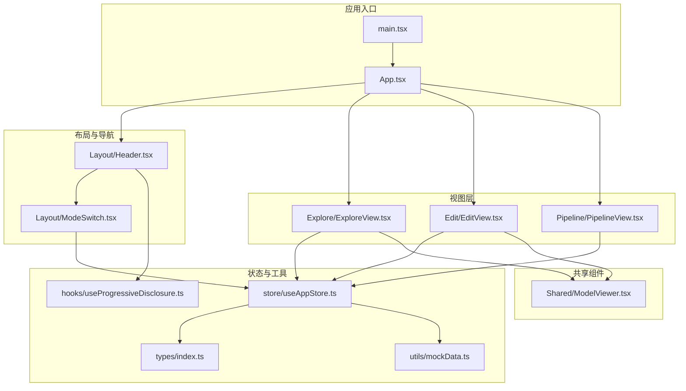
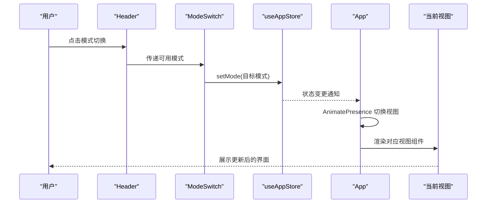
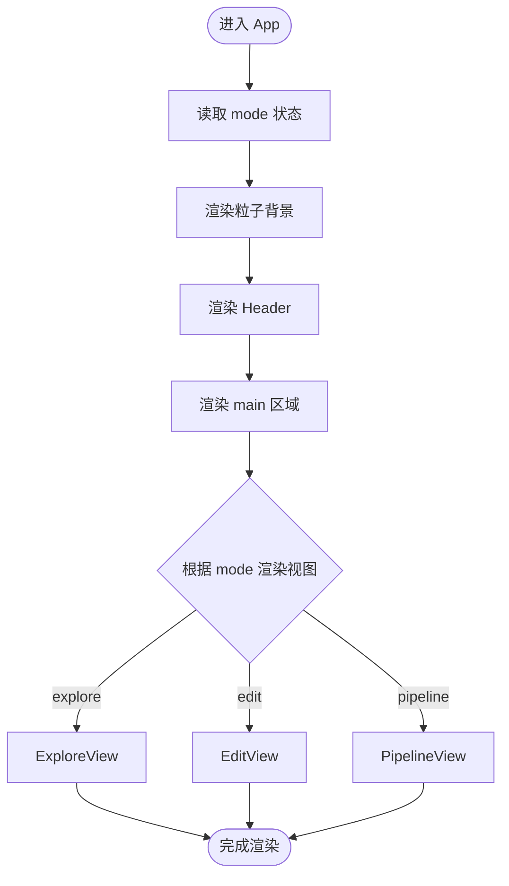
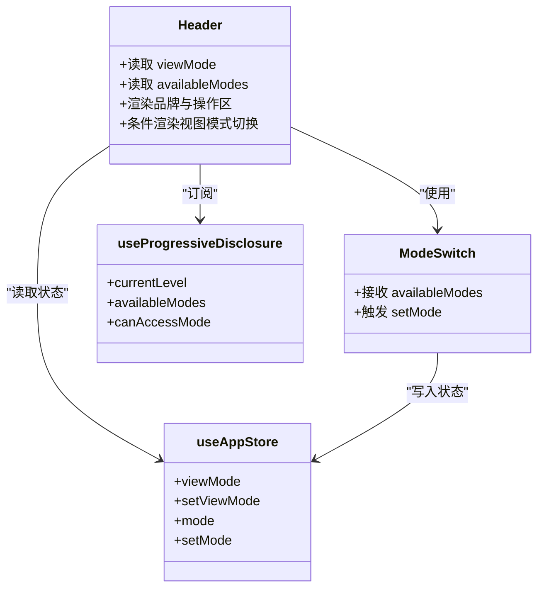
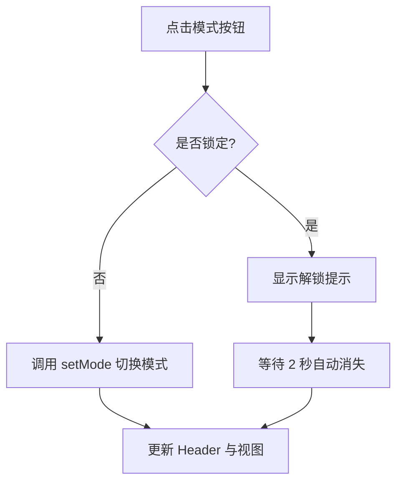
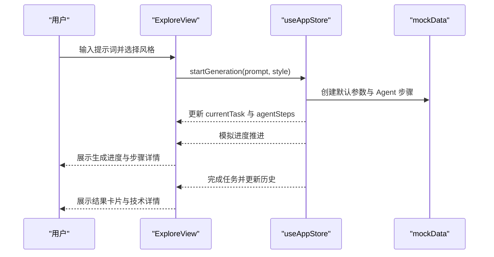
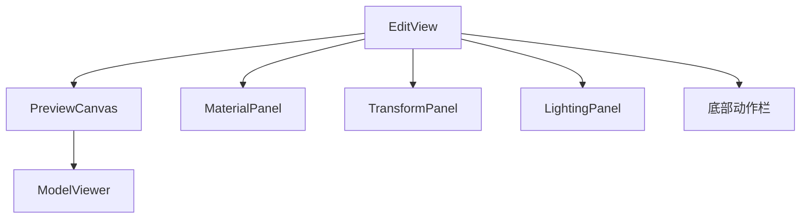
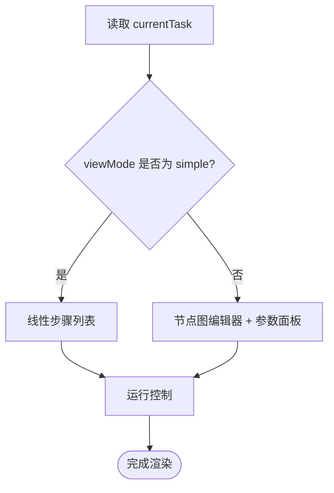
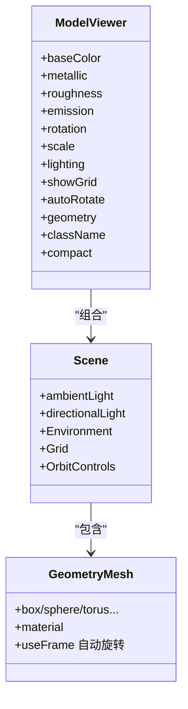
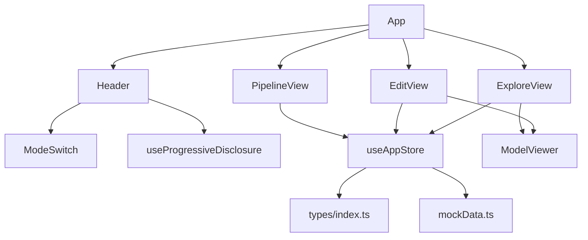

# 组件架构设计

<cite>
**本文档引用的文件**
- [src/App.tsx](file://src/App.tsx)
- [src/main.tsx](file://src/main.tsx)
- [src/components/Layout/Header.tsx](file://src/components/Layout/Header.tsx)
- [src/components/Layout/ModeSwitch.tsx](file://src/components/Layout/ModeSwitch.tsx)
- [src/hooks/useProgressiveDisclosure.ts](file://src/hooks/useProgressiveDisclosure.ts)
- [src/store/useAppStore.ts](file://src/store/useAppStore.ts)
- [src/types/index.ts](file://src/types/index.ts)
- [src/components/Explore/ExploreView.tsx](file://src/components/Explore/ExploreView.tsx)
- [src/components/Edit/EditView.tsx](file://src/components/Edit/EditView.tsx)
- [src/components/Pipeline/PipelineView.tsx](file://src/components/Pipeline/PipelineView.tsx)
- [src/components/Shared/ModelViewer.tsx](file://src/components/Shared/ModelViewer.tsx)
- [src/utils/mockData.ts](file://src/utils/mockData.ts)
- [package.json](file://package.json)
</cite>

## 目录
1. [简介](#简介)
2. [项目结构](#项目结构)
3. [核心组件](#核心组件)
4. [架构总览](#架构总览)
5. [详细组件分析](#详细组件分析)
6. [依赖关系分析](#依赖关系分析)
7. [性能考虑](#性能考虑)
8. [故障排除指南](#故障排除指南)
9. [结论](#结论)
10. [附录](#附录)

## 简介
本项目是一个基于 React 的 3D 模型代理应用，采用 Zustand 状态管理、Three.js 3D 渲染、Framer Motion 动画与 Lucide 图标库构建。系统通过“探索（生成）、编辑（微调）、管线（流程控制）”三种模式驱动用户工作流，配合渐进式功能解锁与视图模式（简洁/专业），为不同技能水平用户提供分层体验。本文档聚焦于组件架构、数据流与交互模式，帮助开发者理解组件层次、职责划分与最佳实践。

## 项目结构
项目采用按功能域分层的目录组织：
- 根组件与入口：App.tsx、main.tsx
- 布局与导航：Layout/Header.tsx、Layout/ModeSwitch.tsx
- 视图层：Explore/ExploreView.tsx、Edit/EditView.tsx、Pipeline/PipelineView.tsx
- 共享组件：Shared/ModelViewer.tsx
- 状态与类型：store/useAppStore.ts、types/index.ts
- 工具与钩子：hooks/useProgressiveDisclosure.ts、utils/mockData.ts
- 构建与依赖：package.json

图表来源
- [src/main.tsx:1-14](file://src/main.tsx#L1-L14)
- [src/App.tsx:1-33](file://src/App.tsx#L1-L33)
- [src/components/Layout/Header.tsx:1-78](file://src/components/Layout/Header.tsx#L1-L78)
- [src/components/Layout/ModeSwitch.tsx:1-82](file://src/components/Layout/ModeSwitch.tsx#L1-L82)
- [src/components/Explore/ExploreView.tsx:1-263](file://src/components/Explore/ExploreView.tsx#L1-L263)
- [src/components/Edit/EditView.tsx:1-159](file://src/components/Edit/EditView.tsx#L1-L159)
- [src/components/Pipeline/PipelineView.tsx:1-168](file://src/components/Pipeline/PipelineView.tsx#L1-L168)
- [src/components/Shared/ModelViewer.tsx:1-156](file://src/components/Shared/ModelViewer.tsx#L1-L156)
- [src/store/useAppStore.ts:1-368](file://src/store/useAppStore.ts#L1-L368)
- [src/hooks/useProgressiveDisclosure.ts:1-136](file://src/hooks/useProgressiveDisclosure.ts#L1-L136)
- [src/utils/mockData.ts:1-189](file://src/utils/mockData.ts#L1-L189)

章节来源
- [src/App.tsx:1-33](file://src/App.tsx#L1-L33)
- [src/main.tsx:1-14](file://src/main.tsx#L1-L14)

## 核心组件
- 根组件 App：负责全局背景、头部导航与主内容区的模式切换渲染，使用 AnimatePresence 实现视图过渡动画。
- 头部导航 Header：包含品牌标识、模式切换控件、视图模式切换按钮与用户操作区域；集成渐进式披露钩子以根据用户等级动态显示可用功能。
- 模式切换 ModeSwitch：根据用户使用次数与等级解锁不同模式，支持提示气泡与动画反馈。
- 探索视图 ExploreView：提供提示词输入、风格选择、生成进度与结果卡片；在专业模式下展示 Agent 步骤与技术详情。
- 编辑视图 EditView：提供 3D 预览画布与材料、变换、光照面板；简洁模式仅提供基础控件，专业模式提供完整面板。
- 管线视图 PipelineView：简洁模式展示线性步骤列表，专业模式提供节点图编辑器与参数面板。
- 共享组件 ModelViewer：基于 Three.js 的可配置 3D 查看器，支持几何体、材质、光照与网格。
- 状态管理 useAppStore：集中管理应用模式、生成任务、编辑设置、用户资料、模板与意图分析等状态。
- 渐进式披露 useProgressiveDisclosure：根据用户等级与使用次数计算可用模式、功能与升级进度。
- 类型定义 types/index.ts：统一定义 AppMode、GenerationStatus、EditSettings、AgentStep 等类型。

章节来源
- [src/App.tsx:10-32](file://src/App.tsx#L10-L32)
- [src/components/Layout/Header.tsx:8-77](file://src/components/Layout/Header.tsx#L8-L77)
- [src/components/Layout/ModeSwitch.tsx:18-81](file://src/components/Layout/ModeSwitch.tsx#L18-L81)
- [src/components/Explore/ExploreView.tsx:11-262](file://src/components/Explore/ExploreView.tsx#L11-L262)
- [src/components/Edit/EditView.tsx:9-158](file://src/components/Edit/EditView.tsx#L9-L158)
- [src/components/Pipeline/PipelineView.tsx:9-167](file://src/components/Pipeline/PipelineView.tsx#L9-L167)
- [src/components/Shared/ModelViewer.tsx:136-155](file://src/components/Shared/ModelViewer.tsx#L136-L155)
- [src/store/useAppStore.ts:50-98](file://src/store/useAppStore.ts#L50-L98)
- [src/hooks/useProgressiveDisclosure.ts:60-135](file://src/hooks/useProgressiveDisclosure.ts#L60-L135)
- [src/types/index.ts:1-160](file://src/types/index.ts#L1-L160)

## 架构总览
系统采用“单向数据流 + 响应式状态”的设计模式：
- 状态集中在 Zustand Store 中，通过 set/get 更新与派发。
- 组件通过 useAppStore 订阅所需状态片段，避免深层 props 下传。
- 渐进式披露钩子从用户资料中推导可用功能与模式，降低耦合。
- 视图组件根据模式与视图模式进行条件渲染与布局调整。

图表来源
- [src/components/Layout/Header.tsx:30-31](file://src/components/Layout/Header.tsx#L30-L31)
- [src/components/Layout/ModeSwitch.tsx:18-81](file://src/components/Layout/ModeSwitch.tsx#L18-L81)
- [src/store/useAppStore.ts:100-102](file://src/store/useAppStore.ts#L100-L102)
- [src/App.tsx:23-27](file://src/App.tsx#L23-L27)

## 详细组件分析

### 根组件 App 的设计模式
- 职责：承载全局背景与粒子动画、固定头部、主内容区的模式切换渲染。
- 数据流：从 useAppStore 读取 mode，结合 AnimatePresence 实现视图切换时的过渡动画。
- 生命周期：作为顶层容器，不直接管理复杂状态，仅协调子组件渲染。
- 单一职责：确保页面骨架与全局动画的一致性，避免在根组件中引入业务逻辑。

图表来源
- [src/App.tsx:10-32](file://src/App.tsx#L10-L32)

章节来源
- [src/App.tsx:10-32](file://src/App.tsx#L10-L32)

### 头部导航 Header 的实现
- 职责：展示品牌信息、模式切换控件、视图模式切换按钮与用户操作区。
- 功能点：
  - 使用渐进式披露钩子计算当前等级与可用模式，决定是否显示视图模式切换。
  - 通过 useAppStore 设置 viewMode，实现简洁/专业的界面差异。
  - 集成 Framer Motion 的布局动画，保证切换时的视觉连贯性。
- 单一职责：专注于导航与模式控制，不直接处理生成或编辑逻辑。

图表来源
- [src/components/Layout/Header.tsx:8-77](file://src/components/Layout/Header.tsx#L8-L77)
- [src/components/Layout/ModeSwitch.tsx:18-81](file://src/components/Layout/ModeSwitch.tsx#L18-L81)
- [src/hooks/useProgressiveDisclosure.ts:60-135](file://src/hooks/useProgressiveDisclosure.ts#L60-L135)
- [src/store/useAppStore.ts:74-82](file://src/store/useAppStore.ts#L74-L82)

章节来源
- [src/components/Layout/Header.tsx:8-77](file://src/components/Layout/Header.tsx#L8-L77)

### 模式切换 ModeSwitch 的工作机制
- 职责：根据用户等级与使用次数控制模式可用性，提供点击与悬停提示。
- 机制：
  - 内置模式列表与解锁阈值，通过 availableModes 过滤不可用项。
  - 锁定态显示提示气泡，点击时短暂提示解锁条件。
  - 使用 layoutId 实现激活态背景的平滑过渡动画。
- 单一职责：专注模式选择与解锁逻辑，不关心具体视图内容。

图表来源
- [src/components/Layout/ModeSwitch.tsx:18-81](file://src/components/Layout/ModeSwitch.tsx#L18-L81)
- [src/store/useAppStore.ts:100-102](file://src/store/useAppStore.ts#L100-L102)

章节来源
- [src/components/Layout/ModeSwitch.tsx:18-81](file://src/components/Layout/ModeSwitch.tsx#L18-L81)

### 探索视图 ExploreView 的数据流与交互
- 职责：提供提示词输入、风格选择、生成进度与结果展示；在专业模式下提供 Agent 步骤与技术详情。
- 数据流：
  - 从 useAppStore 读取 currentTask 与 viewMode，驱动 UI 分支。
  - 在专业模式下渲染 Agent 步骤列表与技术详情卡片。
  - 使用 AnimatePresence 控制输入、生成、结果三阶段的过渡。
- 单一职责：专注于生成流程的可视化与交互，不直接管理状态持久化。

图表来源
- [src/components/Explore/ExploreView.tsx:11-262](file://src/components/Explore/ExploreView.tsx#L11-L262)
- [src/store/useAppStore.ts:107-122](file://src/store/useAppStore.ts#L107-L122)
- [src/utils/mockData.ts:74-176](file://src/utils/mockData.ts#L74-L176)

章节来源
- [src/components/Explore/ExploreView.tsx:11-262](file://src/components/Explore/ExploreView.tsx#L11-L262)

### 编辑视图 EditView 的组件树与状态传递
- 职责：提供 3D 预览画布与材料、变换、光照面板；根据视图模式切换简洁/专业布局。
- 组件树：
  - 左侧：PreviewCanvas（复用 ModelViewer）
  - 右侧：MaterialPanel、TransformPanel、LightingPanel（专业模式）
  - 底部：动作栏（导出、分享、跳转管线）
- 状态传递：
  - 通过 useAppStore 读取 editSettings 并调用 updateEditSettings 更新材质与变换参数。
  - 专家级用户可直接跳转到管线模式。
- 单一职责：专注于编辑工作流的可视化与参数控制。

图表来源
- [src/components/Edit/EditView.tsx:9-158](file://src/components/Edit/EditView.tsx#L9-L158)
- [src/components/Shared/ModelViewer.tsx:136-155](file://src/components/Shared/ModelViewer.tsx#L136-L155)

章节来源
- [src/components/Edit/EditView.tsx:9-158](file://src/components/Edit/EditView.tsx#L9-L158)

### 管线视图 PipelineView 的模式分支
- 职责：在简洁模式下展示线性步骤列表，在专业模式下提供节点图编辑器与参数面板。
- 数据流：
  - 从 useAppStore 读取 currentTask 的 agentSteps，驱动步骤状态展示。
  - 专业模式下渲染 NodeEditor 与 ParameterPanel，形成完整的流程编辑体验。
- 单一职责：专注于流程可视化与控制，不直接参与生成逻辑。

图表来源
- [src/components/Pipeline/PipelineView.tsx:9-167](file://src/components/Pipeline/PipelineView.tsx#L9-L167)

章节来源
- [src/components/Pipeline/PipelineView.tsx:9-167](file://src/components/Pipeline/PipelineView.tsx#L9-L167)

### 共享组件 ModelViewer 的实现要点
- 职责：提供可配置的 3D 场景渲染，支持几何体、材质、光照与网格。
- 关键点：
  - 使用 @react-three/fiber 与 @react-three/drei 构建场景。
  - 支持自动旋转、网格显示与环境预设。
  - 通过 React.memo 优化重渲染。
- 单一职责：专注于 3D 渲染与交互，不关心上层业务逻辑。

图表来源
- [src/components/Shared/ModelViewer.tsx:136-155](file://src/components/Shared/ModelViewer.tsx#L136-L155)
- [src/components/Shared/ModelViewer.tsx:82-126](file://src/components/Shared/ModelViewer.tsx#L82-L126)
- [src/components/Shared/ModelViewer.tsx:32-80](file://src/components/Shared/ModelViewer.tsx#L32-L80)

章节来源
- [src/components/Shared/ModelViewer.tsx:136-155](file://src/components/Shared/ModelViewer.tsx#L136-L155)

## 依赖关系分析
- 组件依赖：
  - App 依赖 Header、各视图组件与粒子背景。
  - Header 依赖 ModeSwitch 与渐进式披露钩子。
  - 各视图组件依赖 useAppStore 与共享组件（如 ModelViewer）。
- 状态依赖：
  - useAppStore 提供 mode、viewMode、currentTask、editSettings 等状态。
  - useProgressiveDisclosure 依赖 userProfile 与 levelUpNotification 推导可用功能。
- 外部依赖：
  - Zustand 管理状态；Three.js 与 @react-three/* 提供 3D 渲染；Framer Motion 提供动画；Lucide 提供图标。

图表来源
- [src/App.tsx:1-33](file://src/App.tsx#L1-L33)
- [src/components/Layout/Header.tsx:1-78](file://src/components/Layout/Header.tsx#L1-L78)
- [src/components/Layout/ModeSwitch.tsx:1-82](file://src/components/Layout/ModeSwitch.tsx#L1-L82)
- [src/components/Explore/ExploreView.tsx:1-263](file://src/components/Explore/ExploreView.tsx#L1-L263)
- [src/components/Edit/EditView.tsx:1-159](file://src/components/Edit/EditView.tsx#L1-L159)
- [src/components/Pipeline/PipelineView.tsx:1-168](file://src/components/Pipeline/PipelineView.tsx#L1-L168)
- [src/components/Shared/ModelViewer.tsx:1-156](file://src/components/Shared/ModelViewer.tsx#L1-L156)
- [src/store/useAppStore.ts:1-368](file://src/store/useAppStore.ts#L1-L368)
- [src/hooks/useProgressiveDisclosure.ts:1-136](file://src/hooks/useProgressiveDisclosure.ts#L1-L136)
- [src/utils/mockData.ts:1-189](file://src/utils/mockData.ts#L1-L189)
- [src/types/index.ts:1-160](file://src/types/index.ts#L1-L160)

章节来源
- [src/store/useAppStore.ts:1-368](file://src/store/useAppStore.ts#L1-L368)
- [src/hooks/useProgressiveDisclosure.ts:1-136](file://src/hooks/useProgressiveDisclosure.ts#L1-L136)
- [package.json:11-22](file://package.json#L11-L22)

## 性能考虑
- 状态粒度：useAppStore 将状态按领域拆分（模式、生成、编辑、用户资料等），减少无关更新。
- 组件记忆化：ModelViewer 使用 React.memo 避免不必要的重渲染。
- 动画与过渡：AnimatePresence 与 Framer Motion 的 layoutId 用于平滑切换，注意控制动画复杂度。
- 3D 渲染：ModelViewer 中的 useFrame 与网格渲染需在复杂场景下评估性能，必要时启用抗锯齿开关或简化几何体。
- 渐进式披露：useProgressiveDisclosure 通过 useMemo 缓存计算结果，避免重复计算。

## 故障排除指南
- 模式切换无效：
  - 检查 ModeSwitch 的 availableModes 与用户等级是否匹配。
  - 确认 setMode 是否被正确调用。
- 视图模式切换无响应：
  - 确认 Header 中的 viewMode 切换逻辑与 useAppStore.setViewMode 是否一致。
- 生成进度不更新：
  - 检查 useAppStore.startGeneration 与模拟进度函数是否正常执行。
  - 确认 currentTask 与 agentSteps 是否正确更新。
- 3D 场景空白：
  - 检查 ModelViewer 的 Canvas 初始化与 Suspense 加载状态。
  - 确认 Three.js 依赖版本兼容性。

章节来源
- [src/components/Layout/ModeSwitch.tsx:18-81](file://src/components/Layout/ModeSwitch.tsx#L18-L81)
- [src/components/Layout/Header.tsx:36-61](file://src/components/Layout/Header.tsx#L36-L61)
- [src/store/useAppStore.ts:107-122](file://src/store/useAppStore.ts#L107-L122)
- [src/components/Shared/ModelViewer.tsx:140-152](file://src/components/Shared/ModelViewer.tsx#L140-L152)

## 结论
本项目通过清晰的组件分层与状态管理实现了“探索-编辑-管线”的完整工作流。Header 与 ModeSwitch 负责导航与模式控制，Explore/Edit/Pipeline 三大视图分别覆盖生成、微调与流程控制场景，ModelViewer 提供高性能的 3D 渲染能力。渐进式披露与视图模式确保不同技能水平的用户都能获得合适的体验。建议在后续迭代中进一步细化状态切片、优化 3D 场景性能，并完善错误边界与加载状态提示。

## 附录
- 组件开发最佳实践：
  - 遵循单一职责：每个组件只负责一个明确的功能域。
  - 状态下沉：将跨组件共享的状态放入 Zustand，避免深层 props。
  - 使用 useMemo/useCallback：对昂贵计算与回调进行缓存。
  - 动画与过渡：合理使用 Framer Motion，避免过度动画影响性能。
  - 3D 优化：在复杂场景中限制几何体复杂度与贴图分辨率。
  - 类型安全：充分利用 types/index.ts 的类型定义，确保状态与接口一致性。