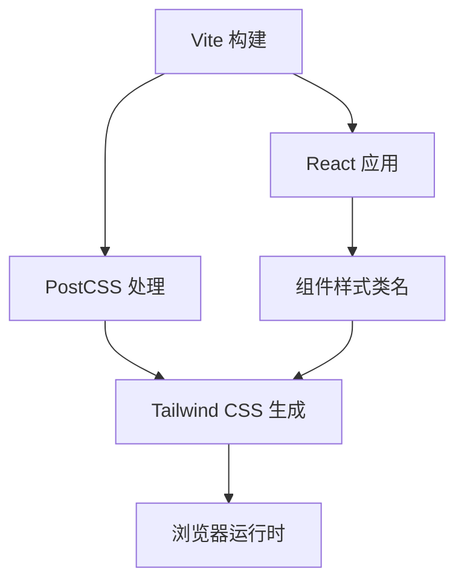
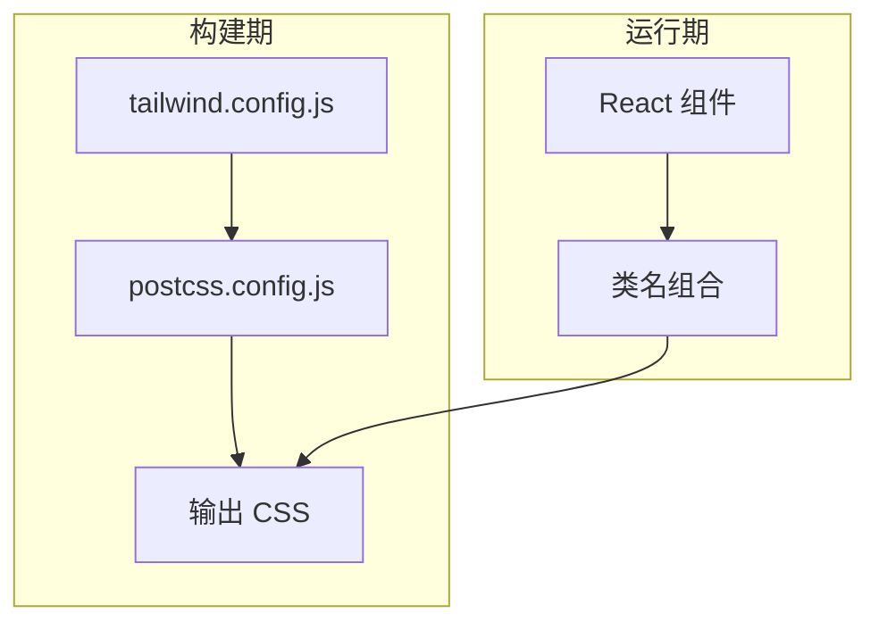
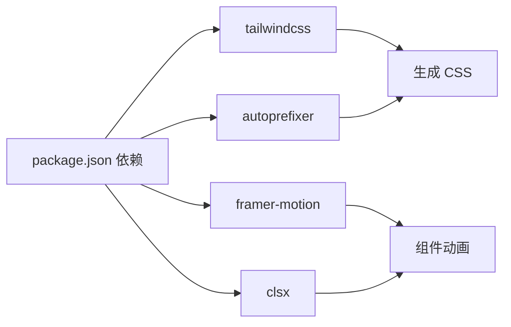

# 样式和主题系统

<cite>
**本文引用的文件**
- [tailwind.config.js](file://tailwind.config.js)
- [postcss.config.js](file://postcss.config.js)
- [src/index.css](file://src/index.css)
- [package.json](file://package.json)
- [src/components/Layout/Header.tsx](file://src/components/Layout/Header.tsx)
- [src/components/Layout/ModeSwitch.tsx](file://src/components/Layout/ModeSwitch.tsx)
- [src/components/Explore/StyleSelector.tsx](file://src/components/Explore/StyleSelector.tsx)
- [src/components/Edit/MaterialPanel.tsx](file://src/components/Edit/MaterialPanel.tsx)
- [src/components/Explore/PromptInput.tsx](file://src/components/Explore/PromptInput.tsx)
- [src/components/Explore/ResultCard.tsx](file://src/components/Explore/ResultCard.tsx)
- [src/components/Shared/ModelViewer.tsx](file://src/components/Shared/ModelViewer.tsx)
- [src/store/useAppStore.ts](file://src/store/useAppStore.ts)
- [src/types/index.ts](file://src/types/index.ts)
- [src/utils/mockData.ts](file://src/utils/mockData.ts)
</cite>

## 目录
1. [简介](#简介)
2. [项目结构](#项目结构)
3. [核心组件](#核心组件)
4. [架构总览](#架构总览)
5. [详细组件分析](#详细组件分析)
6. [依赖关系分析](#依赖关系分析)
7. [性能考量](#性能考量)
8. [故障排查指南](#故障排查指南)
9. [结论](#结论)
10. [附录](#附录)

## 简介
本文件系统性梳理并解释该项目的样式与主题系统，重点覆盖以下方面：
- Tailwind CSS 的配置与定制化扩展
- 主题色彩体系与变量管理策略
- 响应式设计与断点策略
- 动画与过渡效果的实现方式
- 组件样式的命名规范与组织结构
- 主题切换与动态样式的实现思路
- CSS 模块化与样式隔离策略
- 浏览器兼容性与性能优化建议

## 项目结构
该项目采用 Vite + React + TypeScript 构建，样式体系基于 Tailwind CSS，并通过 PostCSS 自动前缀与构建管线集成。样式入口位于全局 CSS 文件，Tailwind 配置集中于独立配置文件，组件内样式遵循原子化与语义化结合的原则。

图表来源
- [postcss.config.js:1-7](file://postcss.config.js#L1-L7)
- [tailwind.config.js:1-61](file://tailwind.config.js#L1-L61)
- [src/index.css:1-108](file://src/index.css#L1-L108)

章节来源
- [package.json:1-35](file://package.json#L1-L35)
- [postcss.config.js:1-7](file://postcss.config.js#L1-L7)
- [tailwind.config.js:1-61](file://tailwind.config.js#L1-L61)
- [src/index.css:1-108](file://src/index.css#L1-L108)

## 核心组件
- Tailwind 配置：定义内容扫描路径、主题扩展（颜色、背景、阴影、动画、关键帧、模糊等）、插件列表。
- PostCSS 配置：启用 Tailwind 与 Autoprefixer 插件。
- 全局样式：使用 Tailwind 层（base/components/utilities）组织基础重置、组件级样式与工具类。
- 组件样式：大量使用 Tailwind 原子类与自定义组件样式类，配合 Framer Motion 实现过渡与动画。

章节来源
- [tailwind.config.js:1-61](file://tailwind.config.js#L1-L61)
- [postcss.config.js:1-7](file://postcss.config.js#L1-L7)
- [src/index.css:1-108](file://src/index.css#L1-L108)

## 架构总览
Tailwind 在构建阶段根据配置生成所需 CSS，运行时由组件类名驱动样式应用；PostCSS 负责自动前缀与兼容处理；组件通过类名组合实现主题化与动画化。

图表来源
- [tailwind.config.js:1-61](file://tailwind.config.js#L1-L61)
- [postcss.config.js:1-7](file://postcss.config.js#L1-L7)
- [src/index.css:1-108](file://src/index.css#L1-L108)

## 详细组件分析

### Tailwind 主题与颜色系统
- 内容扫描范围：HTML 与 TS/TSX 源码，确保按需生成样式。
- 主题扩展：
  - 颜色：自定义“太空”、“霓虹”、“玻璃”三套配色，支持层级化与半透明变体。
  - 背景：新增径向与圆锥渐变背景函数。
  - 阴影：为不同霓虹色提供发光阴影。
  - 动画：脉冲、浮动、辉光等动画名称映射至关键帧。
  - 关键帧：浮动与辉光两种逐帧变换。
  - 背景模糊：新增超细模糊值。
- 全局样式层：
  - base：重置盒模型、滚动条样式、基础字体与背景色。
  - components：组件级样式如“玻璃面板”、“霓虹边框”、“发光文本”、“节点连接线”、“渐变网格”、“输入聚焦辉光”。
  - utilities：文本渐变工具类，复用自定义霓虹色。

章节来源
- [tailwind.config.js:1-61](file://tailwind.config.js#L1-L61)
- [src/index.css:1-108](file://src/index.css#L1-L108)

### 响应式设计与断点
- 组件中广泛使用 Tailwind 响应式前缀（如 md:、lg:），例如网格列数随屏幕尺寸变化。
- 断点策略：通过 Tailwind 默认断点（sm、md、lg、xl、2xl）与组件内类名组合实现自适应布局。

章节来源
- [src/components/Explore/StyleSelector.tsx:20-27](file://src/components/Explore/StyleSelector.tsx#L20-L27)

### 动画与过渡效果
- Tailwind 动画：pulse-slow、float、glow 三种动画名称，分别对应缓动曲线与无限循环。
- 关键帧：float（上下浮动）、glow（阴影强度交替）。
- 组件动画：Framer Motion 提供更丰富的交互动画（如按钮激活态、模式切换、风格选择高亮）。

章节来源
- [tailwind.config.js:39-53](file://tailwind.config.js#L39-L53)
- [src/components/Layout/ModeSwitch.tsx:53-60](file://src/components/Layout/ModeSwitch.tsx#L53-L60)
- [src/components/Explore/StyleSelector.tsx:48-54](file://src/components/Explore/StyleSelector.tsx#L48-L54)
- [src/components/Explore/PromptInput.tsx:107-108](file://src/components/Explore/PromptInput.tsx#L107-L108)

### 组件样式命名规范与组织
- 命名规范：
  - 语义化类名：如 glass-panel、neon-border、input-glow。
  - 颜色语义：neon-blue、neon-purple、neon-green 等。
  - 动效语义：animate-pulse、animate-float、animate-glow。
- 组织结构：
  - 基础层（base）：全局重置与通用元素样式。
  - 组件层（components）：可复用的容器与装饰样式。
  - 工具层（utilities）：高频使用的工具类（如文本渐变）。
- 组件内样式：
  - Header：使用 glass-blur、space 背景色、neon 色系与动画。
  - ModeSwitch：使用 glass-blur、neon 边框与 Framer Motion 动画。
  - StyleSelector：网格布局与选中态高亮。
  - MaterialPanel：自定义滑条与霓虹色系联动。
  - PromptInput：输入框辉光背景与渐变按钮。
  - ResultCard：信息卡片、统计网格与操作按钮。
  - ModelViewer：3D 场景中的几何体、光照与网格。

章节来源
- [src/index.css:37-107](file://src/index.css#L37-L107)
- [src/components/Layout/Header.tsx:14-76](file://src/components/Layout/Header.tsx#L14-L76)
- [src/components/Layout/ModeSwitch.tsx:22-81](file://src/components/Layout/ModeSwitch.tsx#L22-L81)
- [src/components/Explore/StyleSelector.tsx:11-60](file://src/components/Explore/StyleSelector.tsx#L11-L60)
- [src/components/Edit/MaterialPanel.tsx:71-208](file://src/components/Edit/MaterialPanel.tsx#L71-L208)
- [src/components/Explore/PromptInput.tsx:84-160](file://src/components/Explore/PromptInput.tsx#L84-L160)
- [src/components/Explore/ResultCard.tsx:7-128](file://src/components/Explore/ResultCard.tsx#L7-L128)
- [src/components/Shared/ModelViewer.tsx:64-79](file://src/components/Shared/ModelViewer.tsx#L64-L79)

### 主题切换与动态样式
- 当前实现：
  - 使用自定义颜色与工具类实现主题化外观（如 space、neon、glass）。
  - 通过组件状态与类名切换实现交互反馈（如按钮激活态、选中高亮）。
- 可扩展方案（建议）：
  - 引入 CSS 变量作为主题开关（如 --theme-mode: dark|light），在根元素或组件根上切换。
  - 将颜色映射抽象为主题对象，按主题读取对应值，避免硬编码类名。
  - 结合 Zustand 状态管理持久化主题偏好。

章节来源
- [src/store/useAppStore.ts:100-311](file://src/store/useAppStore.ts#L100-L311)
- [src/types/index.ts:101-116](file://src/types/index.ts#L101-L116)

### CSS 模块化与样式隔离
- 模块化策略：
  - Tailwind 原子类减少重复样式，提升复用性。
  - 组件层样式（components）集中定义可复用容器与装饰，降低全局污染。
- 样式隔离：
  - 使用 glass-blur、backdrop-filter 与边界类实现视觉隔离。
  - 通过容器选择器与相对定位的伪元素（::before、::after）实现局部装饰，避免全局副作用。

章节来源
- [src/index.css:37-107](file://src/index.css#L37-L107)
- [src/components/Layout/Header.tsx:14-15](file://src/components/Layout/Header.tsx#L14-L15)

### 动态样式与交互
- Framer Motion：在多个组件中用于按钮激活、模式切换、风格选择等交互动画。
- Tailwind 动画：为元素提供基础动效（脉冲、浮动、辉光）。
- 组合使用：组件通过类名与动画库协同，形成统一的动效语言。

章节来源
- [src/components/Layout/ModeSwitch.tsx:53-60](file://src/components/Layout/ModeSwitch.tsx#L53-L60)
- [src/components/Explore/StyleSelector.tsx:48-54](file://src/components/Explore/StyleSelector.tsx#L48-L54)
- [tailwind.config.js:39-53](file://tailwind.config.js#L39-L53)

## 依赖关系分析
- 构建依赖：Tailwind CSS、Autoprefixer、PostCSS。
- 运行时依赖：React、Framer Motion、clsx（条件类名合并）。
- 类名来源：Tailwind 生成的原子类与自定义组件样式类。

图表来源
- [package.json:11-32](file://package.json#L11-L32)

章节来源
- [package.json:11-32](file://package.json#L11-L32)

## 性能考量
- 按需生成：Tailwind 内容扫描仅从 HTML 与 TS/TSX 源码收集，避免生成未使用样式。
- 动画优化：使用硬件加速属性（transform、filter）与合理的关键帧数量，减少重排重绘。
- 组件动画：Framer Motion 的布局动画建议在必要时开启，避免过度复杂动画影响性能。
- 模糊与阴影：backdrop-blur 与阴影在低端设备上可能带来开销，建议在交互触发时按需启用。

## 故障排查指南
- 样式不生效
  - 检查 Tailwind 内容扫描路径是否包含目标文件。
  - 确认 PostCSS 插件顺序正确（Tailwind 在 Autoprefixer 之前）。
- 动画异常
  - 检查动画名称与关键帧是否在配置中定义一致。
  - 确认组件类名拼写与 Tailwind 版本兼容。
- 交互卡顿
  - 减少不必要的 reflow 与 repaint，优先使用 transform 与 opacity。
  - 合理使用 Framer Motion 的 layoutId 与过渡配置。

章节来源
- [tailwind.config.js:3-6](file://tailwind.config.js#L3-L6)
- [postcss.config.js:1-7](file://postcss.config.js#L1-L7)

## 结论
该样式与主题系统以 Tailwind 为核心，结合 PostCSS 自动前缀与组件级动画库，实现了统一的视觉语言与良好的交互体验。通过颜色、阴影、动画与模糊等主题扩展，以及响应式类名与组件层样式，系统在可维护性与表现力之间取得平衡。建议后续引入 CSS 变量与主题对象，进一步增强主题切换与动态样式的灵活性与可扩展性。

## 附录
- 颜色与主题
  - 自定义颜色：space（深空蓝黑）、neon（蓝/紫/粉/绿/青）、glass（轻/中/重半透）。
  - 工具类：text-gradient、text-gradient-green。
- 动画与关键帧
  - 动画：pulse-slow、float、glow。
  - 关键帧：float（上下浮动）、glow（阴影强度交替）。
- 组件样式示例
  - Header：固定头部、玻璃模糊、霓虹色徽标与徽章。
  - ModeSwitch：模式切换按钮组、锁定提示与激活高亮。
  - StyleSelector：风格网格、选中态环形高亮。
  - MaterialPanel：自定义滑条、霓虹色系联动与发光效果。
  - PromptInput：输入框辉光背景、渐变按钮与智能建议。
  - ResultCard：结果卡片、统计网格与操作按钮。
  - ModelViewer：3D 场景、光照与网格。

章节来源
- [tailwind.config.js:9-56](file://tailwind.config.js#L9-L56)
- [src/index.css:37-107](file://src/index.css#L37-L107)
- [src/components/Layout/Header.tsx:14-76](file://src/components/Layout/Header.tsx#L14-L76)
- [src/components/Layout/ModeSwitch.tsx:22-81](file://src/components/Layout/ModeSwitch.tsx#L22-L81)
- [src/components/Explore/StyleSelector.tsx:11-60](file://src/components/Explore/StyleSelector.tsx#L11-L60)
- [src/components/Edit/MaterialPanel.tsx:71-208](file://src/components/Edit/MaterialPanel.tsx#L71-L208)
- [src/components/Explore/PromptInput.tsx:84-160](file://src/components/Explore/PromptInput.tsx#L84-L160)
- [src/components/Explore/ResultCard.tsx:7-128](file://src/components/Explore/ResultCard.tsx#L7-L128)
- [src/components/Shared/ModelViewer.tsx:64-79](file://src/components/Shared/ModelViewer.tsx#L64-L79)