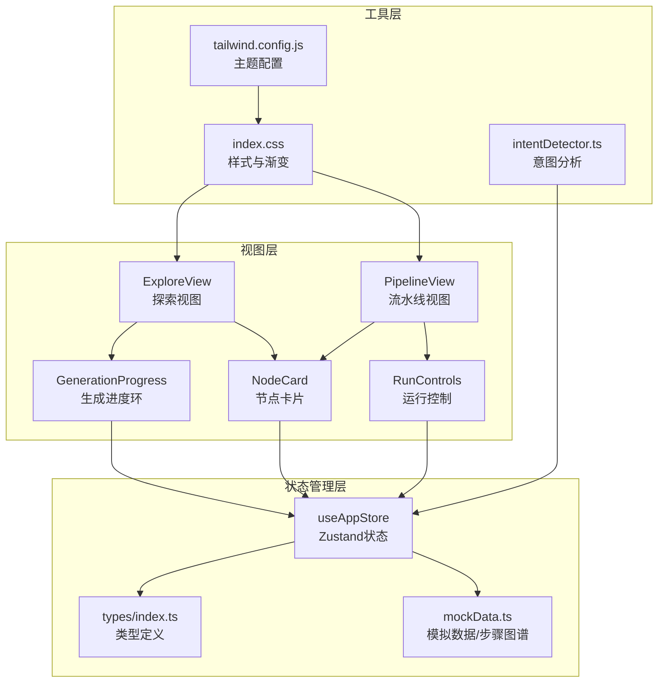
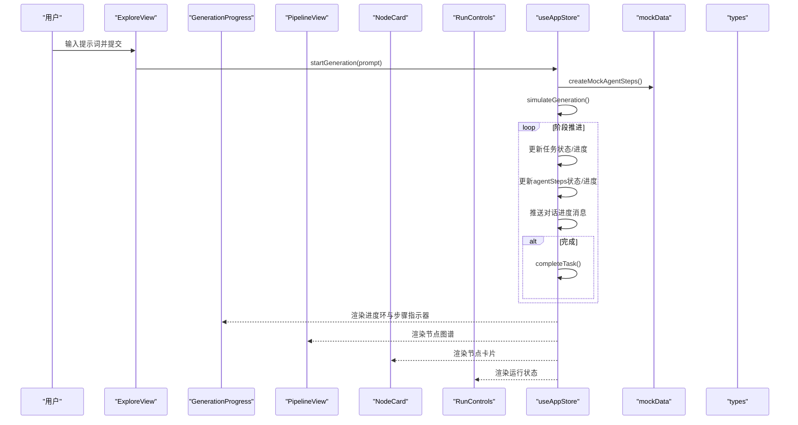
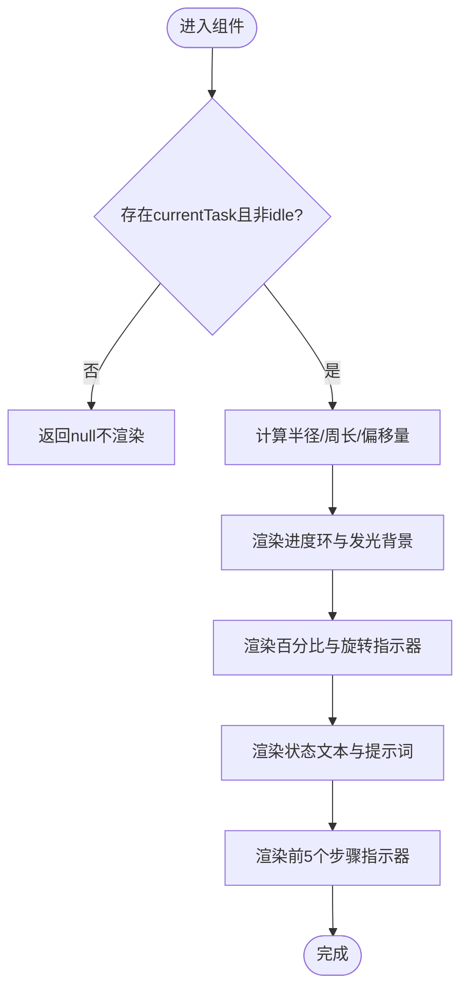
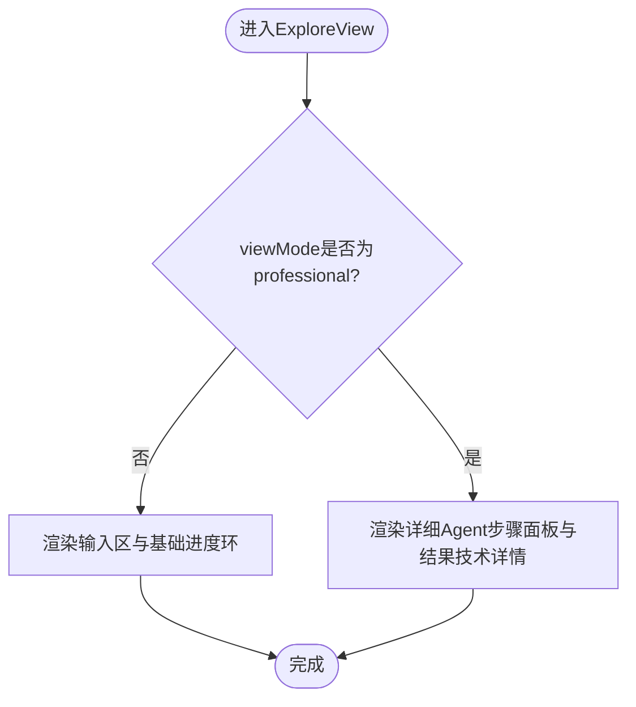
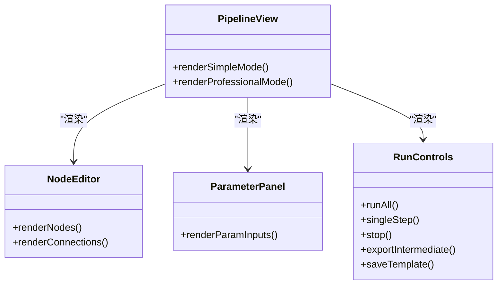
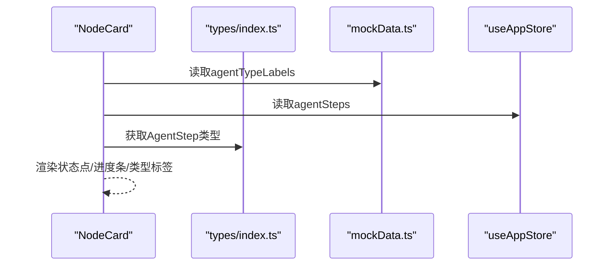
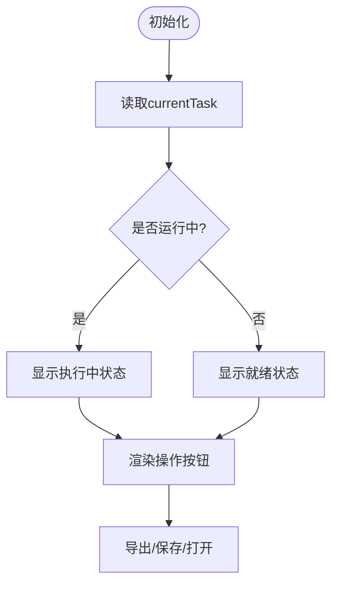
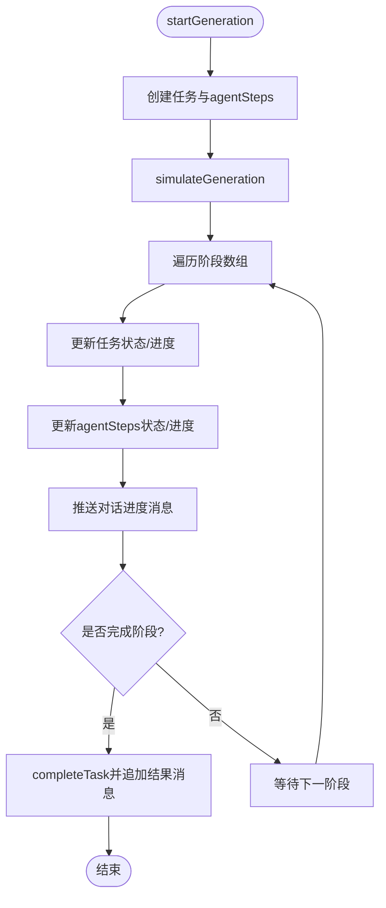
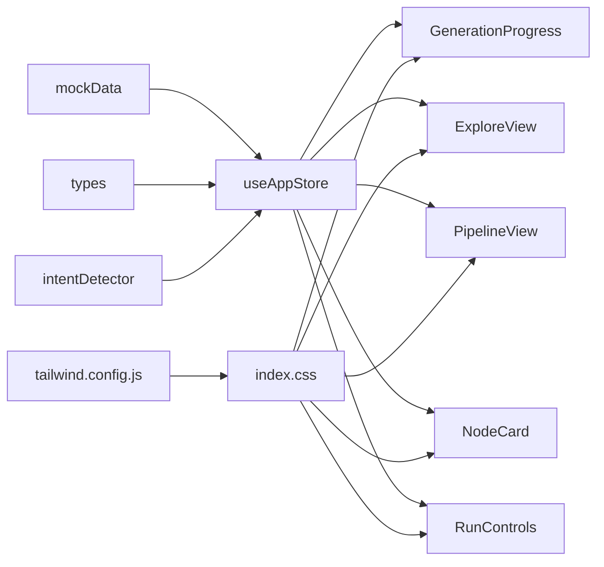

# Agent步骤可视化

<cite>
**本文档引用的文件**
- [GenerationProgress.tsx](file://src/components/Explore/GenerationProgress.tsx)
- [useAppStore.ts](file://src/store/useAppStore.ts)
- [index.ts](file://src/types/index.ts)
- [mockData.ts](file://src/utils/mockData.ts)
- [ExploreView.tsx](file://src/components/Explore/ExploreView.tsx)
- [PipelineView.tsx](file://src/components/Pipeline/PipelineView.tsx)
- [NodeCard.tsx](file://src/components/Pipeline/NodeCard.tsx)
- [RunControls.tsx](file://src/components/Pipeline/RunControls.tsx)
- [intentDetector.ts](file://src/utils/intentDetector.ts)
- [index.css](file://src/index.css)
- [tailwind.config.js](file://tailwind.config.js)
- [main.tsx](file://src/main.tsx)
</cite>

## 目录
1. [简介](#简介)
2. [项目结构](#项目结构)
3. [核心组件](#核心组件)
4. [架构总览](#架构总览)
5. [详细组件分析](#详细组件分析)
6. [依赖关系分析](#依赖关系分析)
7. [性能考虑](#性能考虑)
8. [故障排除指南](#故障排除指南)
9. [结论](#结论)
10. [附录](#附录)

## 简介
本文件面向3D模型Agent项目的Agent步骤可视化功能，深入解释AI生成过程中各个Agent步骤的状态显示与持续时间统计机制，涵盖步骤状态标识、进度动画与错误处理；阐述Agent步骤的执行顺序与相互依赖关系（如意图解析、概念生成、结构构建、细节完善等）；介绍步骤状态的颜色编码系统与动画效果设计；提供实际使用示例，展示不同生成任务的步骤流程与性能分析；解释步骤监控与调试功能的实现原理。

## 项目结构
该项目采用React + Zustand + TailwindCSS + Framer Motion的技术栈，围绕“探索视图”和“流水线视图”两大模式组织UI，并通过全局状态管理驱动生成流程与步骤状态。

图表来源
- [ExploreView.tsx:11-263](file://src/components/Explore/ExploreView.tsx#L11-L263)
- [PipelineView.tsx:9-168](file://src/components/Pipeline/PipelineView.tsx#L9-L168)
- [GenerationProgress.tsx:13-131](file://src/components/Explore/GenerationProgress.tsx#L13-L131)
- [NodeCard.tsx:13-93](file://src/components/Pipeline/NodeCard.tsx#L13-L93)
- [RunControls.tsx:6-93](file://src/components/Pipeline/RunControls.tsx#L6-L93)
- [useAppStore.ts:114-496](file://src/store/useAppStore.ts#L114-L496)
- [index.ts:1-206](file://src/types/index.ts#L1-L206)
- [mockData.ts:74-189](file://src/utils/mockData.ts#L74-L189)
- [intentDetector.ts:77-148](file://src/utils/intentDetector.ts#L77-L148)
- [index.css:1-108](file://src/index.css#L1-L108)
- [tailwind.config.js:1-61](file://src/tailwind.config.js#L1-L61)

章节来源
- [main.tsx:1-14](file://src/main.tsx#L1-L14)
- [index.css:1-108](file://src/index.css#L1-L108)
- [tailwind.config.js:1-61](file://src/tailwind.config.js#L1-L61)

## 核心组件
- 生成进度环（GenerationProgress）：以圆形进度条、百分比数字、状态文本与步骤指示器展示当前任务的总体进度与阶段状态。
- 探索视图（ExploreView）：在“探索”模式下展示生成流程与Agent步骤列表，支持专业模式下的详细状态面板。
- 流水线视图（PipelineView）：在“专业”模式下以节点图谱形式展示Agent步骤的线性或图形化执行顺序。
- 节点卡片（NodeCard）：在流水线视图中以卡片形式呈现单个Agent步骤的状态、进度与类型信息。
- 运行控制（RunControls）：提供运行全部、单步执行、停止、导出、保存模板等操作按钮及当前运行状态指示。
- 全局状态（useAppStore）：负责生成任务生命周期管理、步骤状态推进、进度计算与对话消息推送。
- 类型定义（types/index.ts）：定义GenerationTask、AgentStep、GenerationStatus等核心类型。
- 模拟数据（mockData.ts）：提供默认参数、风格预设与Agent步骤图谱（含依赖连接）。
- 意图分析（intentDetector.ts）：根据用户输入与用户级别推断生成参数与推荐模式。

章节来源
- [GenerationProgress.tsx:13-131](file://src/components/Explore/GenerationProgress.tsx#L13-L131)
- [ExploreView.tsx:11-263](file://src/components/Explore/ExploreView.tsx#L11-L263)
- [PipelineView.tsx:9-168](file://src/components/Pipeline/PipelineView.tsx#L9-L168)
- [NodeCard.tsx:13-93](file://src/components/Pipeline/NodeCard.tsx#L13-L93)
- [RunControls.tsx:6-93](file://src/components/Pipeline/RunControls.tsx#L6-L93)
- [useAppStore.ts:114-496](file://src/store/useAppStore.ts#L114-L496)
- [index.ts:13-64](file://src/types/index.ts#L13-L64)
- [mockData.ts:74-189](file://src/utils/mockData.ts#L74-L189)
- [intentDetector.ts:77-148](file://src/utils/intentDetector.ts#L77-L148)

## 架构总览
Agent步骤可视化由“视图层-状态层-工具层”三层构成：
- 视图层：负责UI渲染与交互反馈（进度环、步骤列表、节点卡片、运行控制）。
- 状态层：集中管理任务状态、步骤状态、进度与历史记录，驱动生成流程推进。
- 工具层：提供类型约束、模拟数据与意图分析，支撑状态推进与参数建议。

图表来源
- [useAppStore.ts:121-136](file://src/store/useAppStore.ts#L121-L136)
- [useAppStore.ts:410-496](file://src/store/useAppStore.ts#L410-L496)
- [mockData.ts:74-176](file://src/utils/mockData.ts#L74-L176)
- [ExploreView.tsx:150-201](file://src/components/Explore/ExploreView.tsx#L150-L201)
- [PipelineView.tsx:14-84](file://src/components/Pipeline/PipelineView.tsx#L14-L84)
- [NodeCard.tsx:13-93](file://src/components/Pipeline/NodeCard.tsx#L13-L93)
- [RunControls.tsx:6-93](file://src/components/Pipeline/RunControls.tsx#L6-L93)

## 详细组件分析

### 生成进度环（GenerationProgress）
- 功能要点
  - 圆形进度条：基于半径与周长计算strokeDashoffset，配合Framer Motion实现平滑过渡。
  - 百分比数字与状态文本：根据当前任务状态映射到中文标签，如“解析需求”、“生成3D结构”、“精修细节”、“完成!”。
  - 步骤指示器：展示前5个Agent步骤的状态（pending/running/complete），使用颜色编码与脉冲动画突出当前运行步骤。
  - 动画效果：进入/退出时的缩放与透明度变化，中心旋转的轨道点与外层发光效果。
- 数据流
  - 从useAppStore读取currentTask，包含status、progress、agentSteps与prompt。
  - 基于progress计算圆环动画偏移量，动态更新百分比数字。
  - 基于agentSteps.slice(0,5)渲染步骤指示器，颜色随状态变化。
- 错误处理
  - 当currentTask为空或状态为idle时隐藏进度环，避免无意义渲染。

图表来源
- [GenerationProgress.tsx:13-131](file://src/components/Explore/GenerationProgress.tsx#L13-L131)

章节来源
- [GenerationProgress.tsx:13-131](file://src/components/Explore/GenerationProgress.tsx#L13-L131)

### 探索视图（ExploreView）
- 功能要点
  - 在“探索”模式下展示生成流程与Agent步骤列表，支持专业模式下的详细状态面板。
  - 专业模式下展示每个Agent步骤的名称、状态点、耗时（可选）、状态标签（完成/运行中/错误/等待）。
  - 专业模式下展示生成结果的技术详情（面数、格式、贴图数量与分辨率）。
- 数据流
  - 从useAppStore读取currentTask，根据viewMode切换简单/专业模式。
  - 专业模式下遍历agentSteps渲染详细状态面板。
- 动画与交互
  - 使用AnimatePresence实现面板切换的流畅过渡。
  - 专业模式下提供高级参数面板，支持CFG Scale、采样步数、Seed与输出格式选择。

图表来源
- [ExploreView.tsx:11-263](file://src/components/Explore/ExploreView.tsx#L11-L263)

章节来源
- [ExploreView.tsx:11-263](file://src/components/Explore/ExploreView.tsx#L11-L263)

### 流水线视图（PipelineView）
- 功能要点
  - 简单模式：线性步骤列表，显示每个Agent步骤的图标、名称与状态标签。
  - 专业模式：节点图谱画布，展示步骤之间的连接关系与依赖。
- 数据流
  - 从useAppStore读取currentTask的agentSteps，渲染节点卡片与连接线。
  - 专业模式下右侧参数面板用于编辑节点参数。
- 动画与交互
  - 使用Framer Motion实现卡片入场动画与悬停缩放效果。
  - 专业模式下网格背景与模糊面板增强视觉层次。

图表来源
- [PipelineView.tsx:9-168](file://src/components/Pipeline/PipelineView.tsx#L9-L168)

章节来源
- [PipelineView.tsx:9-168](file://src/components/Pipeline/PipelineView.tsx#L9-L168)

### 节点卡片（NodeCard）
- 功能要点
  - 展示单个Agent步骤的名称、状态点、进度条、类型标签与可选耗时。
  - 根据类型映射颜色，状态点使用颜色编码与脉冲动画。
- 数据流
  - 从mockData读取agentTypeLabels，映射类型到颜色与中文标签。
  - 从useAppStore读取agentSteps，渲染对应卡片。
- 动画与交互
  - 使用Framer Motion实现宽度动画与悬停缩放。
  - 选中状态添加彩色边框与阴影效果。

图表来源
- [NodeCard.tsx:13-93](file://src/components/Pipeline/NodeCard.tsx#L13-L93)
- [mockData.ts:178-189](file://src/utils/mockData.ts#L178-L189)
- [index.ts:53-64](file://src/types/index.ts#L53-L64)

章节来源
- [NodeCard.tsx:13-93](file://src/components/Pipeline/NodeCard.tsx#L13-L93)

### 运行控制（RunControls）
- 功能要点
  - 提供“运行全部”、“单步执行”、“停止”、“导出中间产物”、“保存为模板”、“在Blender中打开”等操作。
  - 显示当前运行状态：执行中（当前运行步骤名称与整体进度）、全部完成、就绪。
- 数据流
  - 从useAppStore读取currentTask，判断是否处于运行状态。
  - 专家用户可保存当前任务为模板。
- 动画与交互
  - 使用Framer Motion实现面板淡入与状态指示的脉冲动画。

图表来源
- [RunControls.tsx:6-93](file://src/components/Pipeline/RunControls.tsx#L6-L93)

章节来源
- [RunControls.tsx:6-93](file://src/components/Pipeline/RunControls.tsx#L6-L93)

### 全局状态（useAppStore）
- 功能要点
  - 生成任务生命周期：startGeneration、updateTaskStatus、completeTask。
  - 生成流程推进：simulateGeneration按阶段推进任务状态与步骤状态，同时推送对话进度消息。
  - 任务历史：将完成的任务加入taskHistory。
  - 用户等级与功能解锁：根据使用次数与等级变化更新用户档案与通知。
- 数据流
  - startGeneration创建任务并调用simulateGeneration。
  - simulateGeneration定义阶段数组（解析、生成、精修、完成），设置各阶段持续时间与进度映射。
  - 针对每个阶段更新agentSteps状态与进度，并向对话系统推送进度消息。
  - 完成阶段触发completeTask，填充结果并自动增加使用次数。
- 错误处理
  - 在阶段推进过程中检查currentTask有效性，避免空引用。
  - 对对话消息的添加与更新进行条件判断，确保只在必要时创建或更新。

图表来源
- [useAppStore.ts:121-136](file://src/store/useAppStore.ts#L121-L136)
- [useAppStore.ts:410-496](file://src/store/useAppStore.ts#L410-L496)

章节来源
- [useAppStore.ts:114-496](file://src/store/useAppStore.ts#L114-L496)

### 类型定义（types/index.ts）
- 关键类型
  - GenerationTask：包含id、prompt、status、progress、style、createdAt、parameters、agentSteps等字段。
  - AgentStep：包含id、name、type、status、progress、inputs、outputs、position、connections等字段。
  - GenerationStatus：枚举值包括idle、parsing、generating、refining、complete、error。
- 作用
  - 为组件与状态管理提供强类型约束，确保数据结构一致性与IDE智能提示。

章节来源
- [index.ts:13-64](file://src/types/index.ts#L13-L64)

### 模拟数据（mockData.ts）
- 关键内容
  - createMockAgentSteps：定义完整的Agent步骤图谱，包含9个步骤与连接关系，覆盖意图解析、概念生成、结构生成、拓扑优化、UV展开、细节精修、材质生成、质量检查、格式转换。
  - agentTypeLabels：将Agent类型映射到中文标签与颜色，用于节点卡片与状态显示。
  - defaultParameters/defaultEditSettings/stylePresets：提供默认参数与风格预设。
- 作用
  - 为探索与流水线视图提供初始数据与颜色方案，支撑步骤状态与类型显示。

章节来源
- [mockData.ts:74-189](file://src/utils/mockData.ts#L74-L189)

### 意图分析（intentDetector.ts）
- 功能要点
  - 根据用户输入中的关键词命中情况与用户级别，推断用户等级、推荐模式与视图模式。
  - 提取自动参数建议（输出格式、贴图分辨率、拓扑类型、面数预算）。
  - 计算置信度，结合用户历史等级与关键词命中数进行加权。
- 作用
  - 为生成流程提供参数建议与模式推荐，间接影响Agent步骤的执行策略与参数配置。

章节来源
- [intentDetector.ts:77-148](file://src/utils/intentDetector.ts#L77-L148)

## 依赖关系分析
- 组件耦合
  - ExploreView与GenerationProgress高度耦合：前者根据任务状态决定是否渲染后者，后者依赖useAppStore提供的currentTask。
  - PipelineView与NodeCard、RunControls松耦合：通过useAppStore共享状态，各自独立渲染。
- 外部依赖
  - Zustand：集中管理应用状态，提供状态订阅与持久化。
  - Framer Motion：提供流畅的动画与过渡效果。
  - TailwindCSS：提供主题颜色、渐变与动画类名，统一视觉风格。
- 循环依赖
  - 未发现循环依赖：组件间通过状态管理器传递数据，未见直接互相导入。

图表来源
- [useAppStore.ts:114-496](file://src/store/useAppStore.ts#L114-L496)
- [GenerationProgress.tsx:13-131](file://src/components/Explore/GenerationProgress.tsx#L13-L131)
- [ExploreView.tsx:11-263](file://src/components/Explore/ExploreView.tsx#L11-L263)
- [PipelineView.tsx:9-168](file://src/components/Pipeline/PipelineView.tsx#L9-L168)
- [NodeCard.tsx:13-93](file://src/components/Pipeline/NodeCard.tsx#L13-L93)
- [RunControls.tsx:6-93](file://src/components/Pipeline/RunControls.tsx#L6-L93)
- [mockData.ts:74-189](file://src/utils/mockData.ts#L74-L189)
- [index.ts:1-206](file://src/types/index.ts#L1-L206)
- [intentDetector.ts:77-148](file://src/utils/intentDetector.ts#L77-L148)
- [index.css:1-108](file://src/index.css#L1-L108)
- [tailwind.config.js:1-61](file://src/tailwind.config.js#L1-L61)

章节来源
- [useAppStore.ts:114-496](file://src/store/useAppStore.ts#L114-L496)
- [index.ts:1-206](file://src/types/index.ts#L1-L206)

## 性能考虑
- 动画性能
  - 使用Framer Motion的硬件加速动画（如strokeDashoffset、scale、opacity），避免频繁重排。
  - 控制动画数量与频率：仅在状态变化时触发动画，减少不必要的渲染。
- 渲染优化
  - 使用AnimatePresence实现面板切换的高效过渡，避免同时渲染多个视图。
  - 在ExploreView中，仅在生成阶段渲染详细Agent步骤面板，其他阶段隐藏以降低DOM复杂度。
- 状态更新
  - 通过Zustand的局部状态更新，避免全量重渲染。
  - 在simulateGeneration中批量更新agentSteps与任务状态，减少多次状态订阅。
- 主题与样式
  - TailwindCSS的原子类与预设动画减少自定义CSS开销，提升构建效率。

## 故障排除指南
- 进度环不显示
  - 检查currentTask是否存在且状态非idle。
  - 确认useAppStore.startGeneration已被正确调用。
- 步骤状态不更新
  - 确认simulateGeneration阶段推进逻辑正常执行，检查阶段数组与持续时间设置。
  - 验证agentSteps的status与progress字段是否被正确更新。
- 专业模式下节点不可见
  - 确认currentTask.agentSteps已加载，检查PipelineView的视图模式判断逻辑。
- 动画异常
  - 检查TailwindCSS动画类名与Framer Motion的transition配置是否冲突。
  - 确认浏览器对Web Animations的支持与性能设置。

章节来源
- [useAppStore.ts:410-496](file://src/store/useAppStore.ts#L410-L496)
- [ExploreView.tsx:150-201](file://src/components/Explore/ExploreView.tsx#L150-L201)
- [PipelineView.tsx:14-84](file://src/components/Pipeline/PipelineView.tsx#L14-L84)

## 结论
本项目通过清晰的组件分层与强类型约束，实现了Agent步骤的可视化展示与流畅的动画反馈。生成流程由全局状态驱动，结合对话系统的消息推送，形成完整的用户体验闭环。颜色编码与动画效果提升了信息密度与交互体验，而专业模式下的节点图谱则满足了高级用户的深度定制需求。未来可在以下方面进一步优化：引入更细粒度的步骤耗时统计、增强错误状态的可视化提示、扩展模板与参数的持久化能力。

## 附录

### Agent步骤执行顺序与依赖关系
- 步骤序列
  1) 意图解析（intent-parser）
  2) 概念生成（concept-generator）
  3) 结构生成（structure-generator）
  4) 拓扑优化（topology-optimizer）
  5) UV展开（uv-unwrapper）
  6) 细节精修（detail-refiner）
  7) 材质生成（texture-generator）
  8) 质量检查（quality-checker）
  9) 格式转换（format-converter）
- 依赖关系
  - 结构生成后并行执行拓扑优化与UV展开，随后共同进入细节精修。
  - 材质生成依赖细节精修完成后的几何体。
  - 质量检查与格式转换分别作为收尾步骤，最终完成任务。

章节来源
- [mockData.ts:74-176](file://src/utils/mockData.ts#L74-L176)

### 步骤状态颜色编码系统
- pending：白色/20透明度（待定）
- running：霓虹蓝（neon-blue，带脉冲动画）
- complete：霓虹绿（neon-green）
- error：红色（red-400）

章节来源
- [GenerationProgress.tsx:115-127](file://src/components/Explore/GenerationProgress.tsx#L115-L127)
- [ExploreView.tsx:172-196](file://src/components/Explore/ExploreView.tsx#L172-L196)
- [NodeCard.tsx:47-53](file://src/components/Pipeline/NodeCard.tsx#L47-L53)

### 实际使用示例
- 示例一：基础生成任务
  - 输入提示词后，任务进入“解析需求”阶段，进度环显示15%，步骤指示器点亮第一个步骤。
  - 进入“生成3D结构”阶段，进度环升至55%，第二个步骤变为运行中并带脉冲动画。
  - 进入“精修细节”阶段，进度环升至85%，最后一个步骤变为运行中。
  - 完成阶段，进度环100%，步骤指示器全部点亮为绿色，对话系统推送结果消息。
- 示例二：专业模式调试
  - 在专业模式下，节点卡片显示每个步骤的进度条与类型标签，便于定位瓶颈。
  - 运行控制面板显示当前运行步骤名称与整体进度，支持单步执行与停止操作。

章节来源
- [useAppStore.ts:415-494](file://src/store/useAppStore.ts#L415-L494)
- [ExploreView.tsx:150-201](file://src/components/Explore/ExploreView.tsx#L150-L201)
- [RunControls.tsx:6-93](file://src/components/Pipeline/RunControls.tsx#L6-L93)