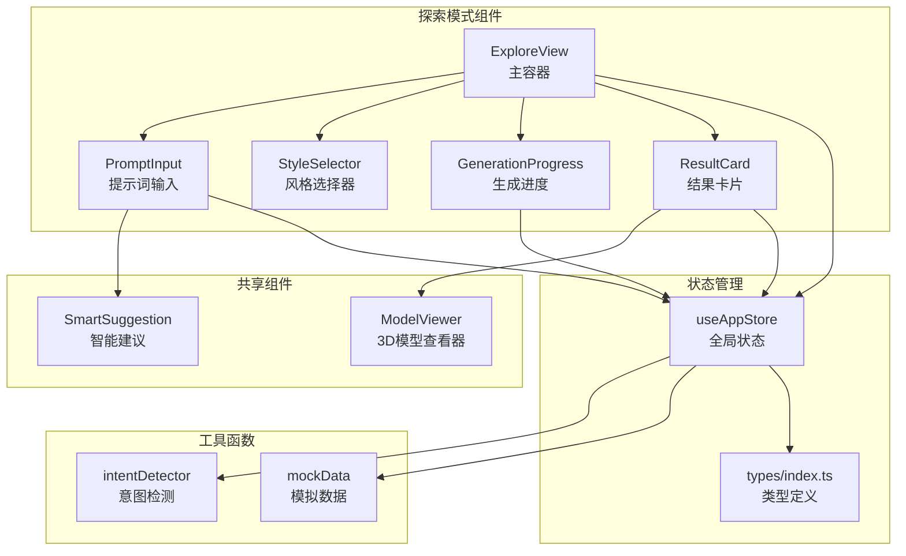
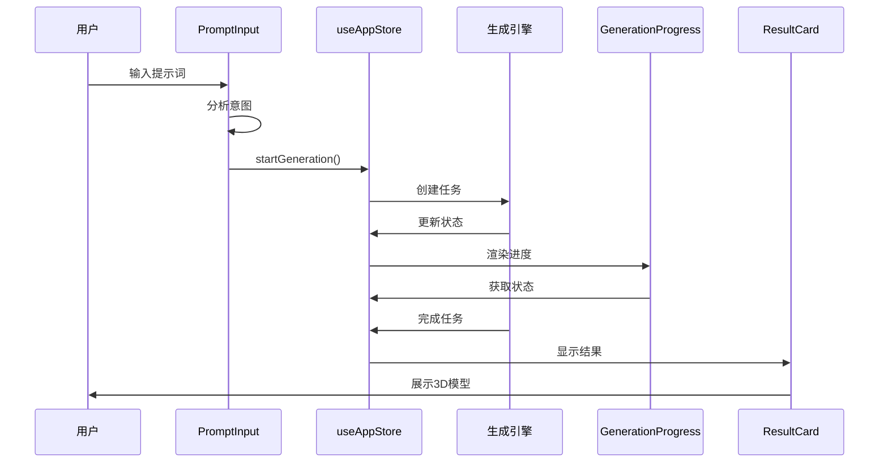
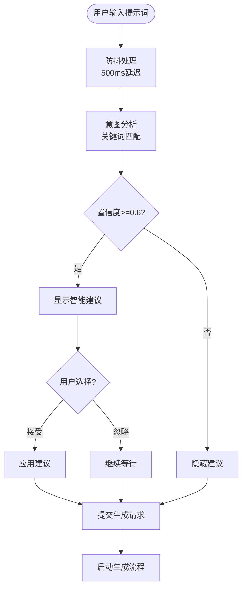
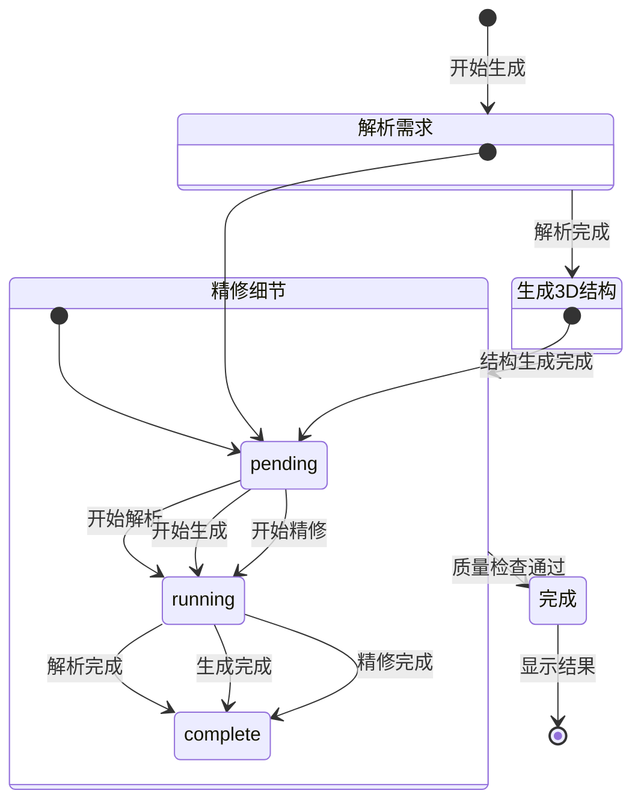
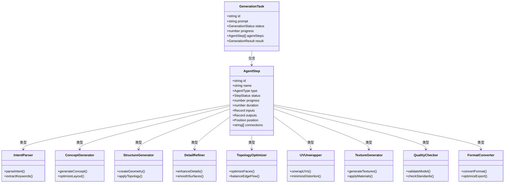
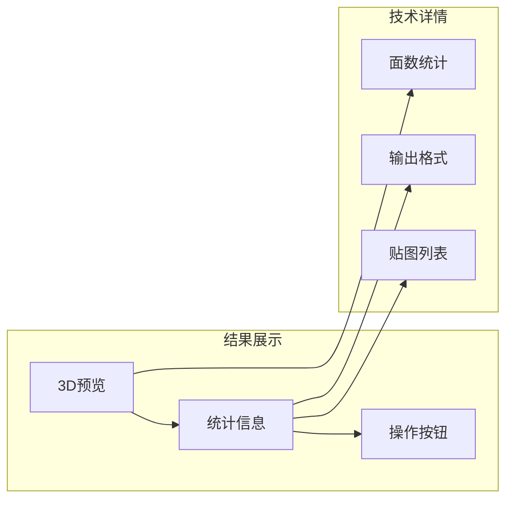

# 探索模式（AI生成）

<cite>
**本文档引用的文件**
- [ExploreView.tsx](file://src/components/Explore/ExploreView.tsx)
- [PromptInput.tsx](file://src/components/Explore/PromptInput.tsx)
- [StyleSelector.tsx](file://src/components/Explore/StyleSelector.tsx)
- [GenerationProgress.tsx](file://src/components/Explore/GenerationProgress.tsx)
- [ResultCard.tsx](file://src/components/Explore/ResultCard.tsx)
- [useAppStore.ts](file://src/store/useAppStore.ts)
- [intentDetector.ts](file://src/utils/intentDetector.ts)
- [mockData.ts](file://src/utils/mockData.ts)
- [index.ts](file://src/types/index.ts)
- [Header.tsx](file://src/components/Layout/Header.tsx)
- [ModelViewer.tsx](file://src/components/Shared/ModelViewer.tsx)
- [SmartSuggestion.tsx](file://src/components/Shared/SmartSuggestion.tsx)
- [package.json](file://package.json)
</cite>

## 目录
1. [简介](#简介)
2. [项目结构](#项目结构)
3. [核心组件](#核心组件)
4. [架构概览](#架构概览)
5. [详细组件分析](#详细组件分析)
6. [依赖关系分析](#依赖关系分析)
7. [性能考虑](#性能考虑)
8. [故障排除指南](#故障排除指南)
9. [结论](#结论)
10. [附录](#附录)

## 简介

探索模式是3D模型AI生成系统的核心功能模块，为用户提供了一个直观、智能的3D模型生成体验。该模式结合了自然语言提示词输入、风格选择机制、实时生成进度跟踪和结果展示功能，支持从基础到专业的多层次用户体验。

系统采用智能意图检测技术，能够根据用户的提示词内容自动识别其技术水平和需求复杂度，并相应地调整界面布局和功能可用性。对于专业用户，系统提供详细的Agent步骤可视化功能，展示完整的生成流程和每个阶段的执行状态。

## 项目结构

探索模式位于`src/components/Explore/`目录下，包含以下核心组件：



**图表来源**
- [ExploreView.tsx:1-263](file://src/components/Explore/ExploreView.tsx#L1-L263)
- [PromptInput.tsx:1-161](file://src/components/Explore/PromptInput.tsx#L1-L161)
- [StyleSelector.tsx:1-61](file://src/components/Explore/StyleSelector.tsx#L1-L61)
- [GenerationProgress.tsx:1-131](file://src/components/Explore/GenerationProgress.tsx#L1-L131)
- [ResultCard.tsx:1-129](file://src/components/Explore/ResultCard.tsx#L1-L129)

**章节来源**
- [ExploreView.tsx:1-263](file://src/components/Explore/ExploreView.tsx#L1-L263)
- [package.json:1-35](file://package.json#L1-L35)

## 核心组件

探索模式由五个主要组件构成，每个组件都有特定的功能职责：

### 主容器组件
- **ExploreView**: 整个探索模式的主容器，负责协调其他组件的显示和交互
- **功能特点**: 条件渲染、状态管理、专业模式可视化

### 输入处理组件
- **PromptInput**: 处理用户输入的提示词，包含智能建议功能
- **StyleSelector**: 提供风格预设选择界面
- **功能特点**: 防抖处理、意图分析、自动建议

### 进度跟踪组件
- **GenerationProgress**: 实时显示生成进度和状态
- **功能特点**: 进度环形图、状态标签、Agent步骤指示器

### 结果展示组件
- **ResultCard**: 展示最终生成的3D模型信息
- **功能特点**: 3D预览、统计信息、操作按钮

**章节来源**
- [ExploreView.tsx:11-263](file://src/components/Explore/ExploreView.tsx#L11-L263)
- [PromptInput.tsx:8-161](file://src/components/Explore/PromptInput.tsx#L8-L161)
- [StyleSelector.tsx:11-61](file://src/components/Explore/StyleSelector.tsx#L11-L61)
- [GenerationProgress.tsx:13-131](file://src/components/Explore/GenerationProgress.tsx#L13-L131)
- [ResultCard.tsx:7-129](file://src/components/Explore/ResultCard.tsx#L7-L129)

## 架构概览

探索模式采用组件化架构，通过全局状态管理实现组件间的通信和数据共享：



**图表来源**
- [PromptInput.tsx:52-66](file://src/components/Explore/PromptInput.tsx#L52-L66)
- [useAppStore.ts:107-122](file://src/store/useAppStore.ts#L107-L122)
- [GenerationProgress.tsx:13-131](file://src/components/Explore/GenerationProgress.tsx#L13-L131)
- [ResultCard.tsx:7-129](file://src/components/Explore/ResultCard.tsx#L7-L129)

系统的核心数据流包括：
1. **用户输入处理**: 提示词输入、风格选择、参数配置
2. **状态管理**: 任务状态、进度跟踪、结果存储
3. **智能分析**: 意图检测、级别识别、功能推荐
4. **可视化展示**: 进度反馈、3D预览、技术详情

**章节来源**
- [useAppStore.ts:100-368](file://src/store/useAppStore.ts#L100-L368)
- [intentDetector.ts:77-147](file://src/utils/intentDetector.ts#L77-L147)

## 详细组件分析

### 提示词输入处理系统

提示词输入组件实现了智能的用户交互体验：



**图表来源**
- [PromptInput.tsx:27-50](file://src/components/Explore/PromptInput.tsx#L27-L50)
- [intentDetector.ts:77-147](file://src/utils/intentDetector.ts#L77-L147)

关键特性：
- **防抖机制**: 避免频繁的意图分析调用
- **智能建议**: 基于关键词匹配提供功能建议
- **级别适配**: 根据用户水平调整界面复杂度

**章节来源**
- [PromptInput.tsx:1-161](file://src/components/Explore/PromptInput.tsx#L1-L161)
- [intentDetector.ts:1-148](file://src/utils/intentDetector.ts#L1-L148)

### 风格选择机制

风格选择器提供了六种不同的预设风格：

| 风格ID | 名称 | 特征 | 适用场景 |
|--------|------|------|----------|
| realistic | 写实风格 | 高保真PBR材质 | 产品展示、商业用途 |
| stylized | 风格化 | 卡通/手绘效果 | 艺术创作、概念设计 |
| game-ready | 游戏资产 | 优化拓扑结构 | 游戏开发、实时渲染 |
| concept | 概念设计 | 快速形态探索 | 设计初期、创意阶段 |
| architectural | 建筑/场景 | 模块化结构 | 建筑可视化、场景构建 |
| character | 角色模型 | 骨骼绑定准备 | 动画制作、角色设计 |

**章节来源**
- [StyleSelector.tsx:29-72](file://src/components/Explore/StyleSelector.tsx#L29-L72)
- [mockData.ts:29-72](file://src/utils/mockData.ts#L29-L72)

### 生成进度跟踪系统

生成进度组件提供了多层次的进度反馈：



**图表来源**
- [GenerationProgress.tsx:6-11](file://src/components/Explore/GenerationProgress.tsx#L6-L11)
- [useAppStore.ts:327-367](file://src/store/useAppStore.ts#L327-L367)

进度跟踪包含：
- **整体进度**: 圆形进度环显示百分比
- **阶段状态**: 文字标签显示当前阶段
- **Agent步骤**: 九个生成阶段的详细状态
- **实时更新**: 基于定时器的状态推进

**章节来源**
- [GenerationProgress.tsx:1-131](file://src/components/Explore/GenerationProgress.tsx#L1-L131)
- [useAppStore.ts:327-367](file://src/store/useAppStore.ts#L327-L367)

### 专业模式Agent步骤可视化

专业模式提供了详细的Agent步骤可视化功能：



**图表来源**
- [mockData.ts:74-176](file://src/utils/mockData.ts#L74-L176)
- [index.ts:53-76](file://src/types/index.ts#L53-L76)

专业模式的Agent步骤包括：
1. **意图解析** - 分析用户需求和上下文
2. **概念生成** - 创建初步的设计概念
3. **结构生成** - 构建3D几何基础
4. **拓扑优化** - 优化网格结构
5. **UV展开** - 创建纹理映射
6. **细节精修** - 增强表面细节
7. **材质生成** - 应用PBR材质
8. **质量检查** - 确保模型质量
9. **格式转换** - 导出最终格式

**章节来源**
- [mockData.ts:74-176](file://src/utils/mockData.ts#L74-L176)
- [ExploreView.tsx:160-199](file://src/components/Explore/ExploreView.tsx#L160-L199)

### 高级参数配置系统

高级参数配置仅在专业模式下可见，提供以下配置选项：

| 参数名称 | 默认值 | 范围 | 影响说明 |
|----------|--------|------|----------|
| CFG Scale | 7.5 | 1-20 | 控制生成与提示词的一致性程度 |
| 采样步数 | 50 | 10-100 | 影响生成质量和计算时间 |
| Seed | -1 | -1或正整数 | 控制随机性的可重复性 |
| 输出格式 | glb | glb/fbx/obj/usdz | 不同格式的兼容性和体积 |

**章节来源**
- [ExploreView.tsx:15-20](file://src/components/Explore/ExploreView.tsx#L15-L20)
- [ExploreView.tsx:77-140](file://src/components/Explore/ExploreView.tsx#L77-L140)
- [mockData.ts:3-12](file://src/utils/mockData.ts#L3-L12)

### 结果展示与技术详情

结果卡片提供了全面的模型信息展示：



**图表来源**
- [ResultCard.tsx:25-37](file://src/components/Explore/ResultCard.tsx#L25-L37)
- [ResultCard.tsx:52-74](file://src/components/Explore/ResultCard.tsx#L52-L74)
- [ResultCard.tsx:214-256](file://src/components/Explore/ResultCard.tsx#L214-L256)

**章节来源**
- [ResultCard.tsx:1-129](file://src/components/Explore/ResultCard.tsx#L1-L129)

## 依赖关系分析

探索模式的依赖关系体现了清晰的分层架构：

```mermaid
graph TB
subgraph "UI层"
ExploreView
PromptInput
StyleSelector
GenerationProgress
ResultCard
end
subgraph "状态管理层"
useAppStore
Zustand
end
subgraph "工具层"
intentDetector
mockData
SmartSuggestion
end
subgraph "3D渲染层"
ModelViewer
Three.js
React Three Fiber
end
subgraph "类型定义层"
Types
end
ExploreView --> useAppStore
PromptInput --> useAppStore
GenerationProgress --> useAppStore
ResultCard --> useAppStore
useAppStore --> intentDetector
useAppStore --> mockData
ResultCard --> ModelViewer
ModelViewer --> Three.js
ModelViewer --> React Three Fiber
useAppStore --> Types
PromptInput --> SmartSuggestion
```

**图表来源**
- [useAppStore.ts:100-368](file://src/store/useAppStore.ts#L100-L368)
- [ModelViewer.tsx:1-156](file://src/components/Shared/ModelViewer.tsx#L1-L156)
- [package.json:11-22](file://package.json#L11-L22)

**章节来源**
- [package.json:1-35](file://package.json#L1-L35)
- [useAppStore.ts:1-368](file://src/store/useAppStore.ts#L1-L368)

## 性能考虑

探索模式在性能方面采用了多项优化策略：

### 渲染性能优化
- **React.memo**: 对ModelViewer组件进行记忆化处理
- **Suspense**: 异步加载3D场景，避免阻塞主线程
- **Canvas复用**: 复用Three.js渲染上下文

### 状态管理优化
- **Zustand**: 轻量级状态管理，减少不必要的重渲染
- **局部状态**: 各组件维护自己的局部状态
- **持久化存储**: 用户偏好和模板数据本地缓存

### 网络和计算优化
- **防抖处理**: 减少意图分析的计算开销
- **渐进式加载**: 逐步显示生成进度
- **模拟数据**: 开发阶段使用模拟数据提高响应速度

## 故障排除指南

### 常见问题及解决方案

**问题1: 生成进度不更新**
- 检查浏览器控制台是否有错误
- 确认网络连接正常
- 尝试刷新页面重新开始

**问题2: 智能建议不显示**
- 确认输入的提示词长度足够
- 检查是否处于生成过程中
- 验证用户配置中的自动建议设置

**问题3: 3D模型无法显示**
- 检查浏览器是否支持WebGL
- 确认GPU驱动程序正常
- 尝试在其他浏览器中打开

**问题4: 专业模式不可用**
- 检查用户级别是否达到要求
- 确认功能权限是否已解锁
- 查看使用次数统计

**章节来源**
- [useAppStore.ts:314-325](file://src/store/useAppStore.ts#L314-L325)

## 结论

探索模式作为3D模型AI生成系统的核心功能，成功实现了从简单到复杂的多层次用户体验。通过智能意图检测、详细的Agent步骤可视化和丰富的参数配置，系统能够满足从初学者到专业用户的各种需求。

系统的主要优势包括：
- **智能化的用户引导**: 自动识别用户水平并提供相应的界面和功能
- **透明的生成过程**: 详细的Agent步骤展示让用户了解每个处理阶段
- **灵活的参数控制**: 专业模式提供全面的生成参数配置
- **优秀的性能表现**: 多层次的优化确保流畅的用户体验

未来可以考虑的功能扩展：
- 实际的AI生成引擎集成
- 更多的风格预设和自定义选项
- 社区功能和模板分享
- 更详细的质量评估指标

## 附录

### 使用示例：从输入到3D模型的完整流程

**步骤1: 输入提示词**
```
用户输入: "一个可爱的机械猫机器人，写实风格，4K贴图"
```

**步骤2: 智能分析**
- 意图检测: 识别专业关键词
- 级别判断: 中级用户
- 建议模式: 专业模式

**步骤3: 风格选择**
- 选择: 写实风格
- 预设: 高保真PBR材质

**步骤4: 参数配置**
- CFG Scale: 7.5
- 采样步数: 50
- 输出格式: GLB

**步骤5: 生成过程**
- 解析需求: 1.5秒
- 生成3D结构: 4秒
- 精修细节: 3秒
- 完成: 100%

**步骤6: 结果展示**
- 3D预览: 实时旋转查看
- 技术详情: 面数、贴图、格式
- 下载选项: 多格式导出

### 用户级别功能差异

| 功能 | 初级用户 | 中级用户 | 专家用户 |
|------|----------|----------|----------|
| 探索模式 | ✓ 基础 | ✓ 基础 | ✓ 专业 |
| 编辑模式 | ✓ 基础 | ✓ 基础 | ✓ 专业 |
| 材质编辑 | ✓ 基础 | ✓ 材质 | ✓ 材质+ |
| 变换控制 | ✓ 基础 | ✓ 变换 | ✓ 变换+ |
| 风格选择 | ✓ 基础 | ✓ 风格 | ✓ 风格+ |
| 管道视图 | ✗ | ✓ 基础 | ✓ 专业 |
| 管道编辑 | ✗ | ✗ | ✓ 专业 |
| 模板保存 | ✗ | ✗ | ✓ 专业 |
| 高级参数 | ✗ | ✓ 基础 | ✓ 专业 |
| 导出选项 | ✓ 基础 | ✓ 中级 | ✓ 专业 |

**章节来源**
- [useAppStore.ts:183-189](file://src/store/useAppStore.ts#L183-L189)
- [Header.tsx:12](file://src/components/Layout/Header.tsx#L12)