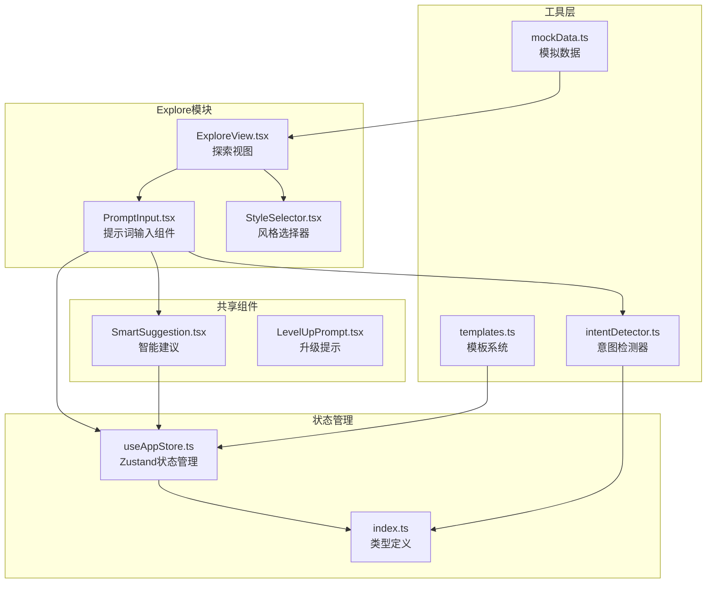
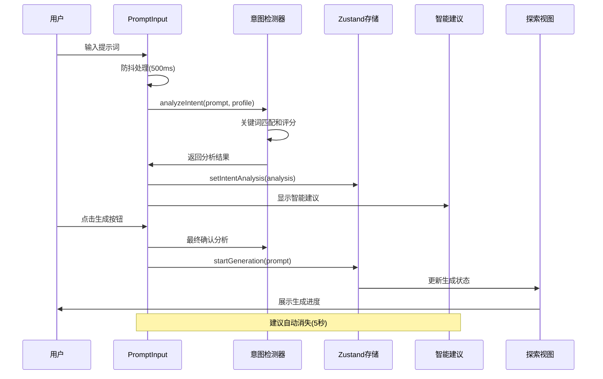
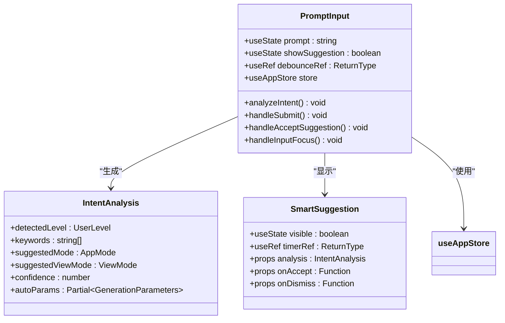
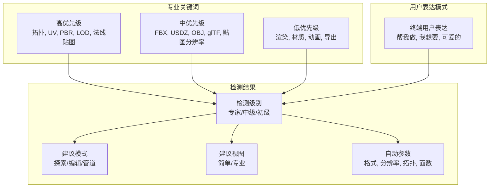
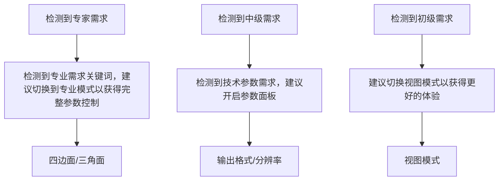
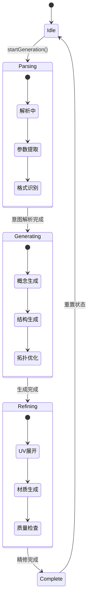
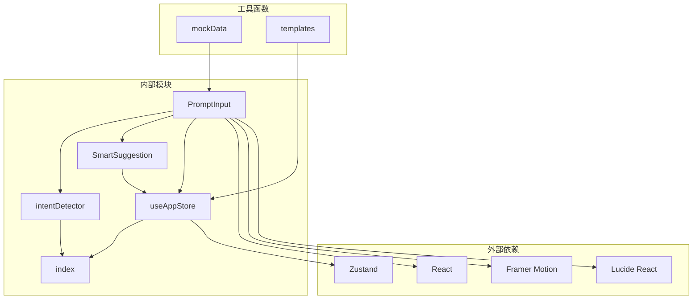

# 提示词输入组件

<cite>
**本文档引用的文件**
- [PromptInput.tsx](file://src/components/Explore/PromptInput.tsx)
- [intentDetector.ts](file://src/utils/intentDetector.ts)
- [SmartSuggestion.tsx](file://src/components/Shared/SmartSuggestion.tsx)
- [useAppStore.ts](file://src/store/useAppStore.ts)
- [index.ts](file://src/types/index.ts)
- [ExploreView.tsx](file://src/components/Explore/ExploreView.tsx)
- [StyleSelector.tsx](file://src/components/Explore/StyleSelector.tsx)
- [mockData.ts](file://src/utils/mockData.ts)
- [templates.ts](file://src/utils/templates.ts)
- [LevelUpPrompt.tsx](file://src/components/Shared/LevelUpPrompt.tsx)
</cite>

## 目录
1. [简介](#简介)
2. [项目结构](#项目结构)
3. [核心组件](#核心组件)
4. [架构概览](#架构概览)
5. [详细组件分析](#详细组件分析)
6. [依赖关系分析](#依赖关系分析)
7. [性能考虑](#性能考虑)
8. [故障排除指南](#故障排除指南)
9. [结论](#结论)
10. [附录](#附录)

## 简介

提示词输入组件是3D模型生成平台的核心交互入口，负责接收用户的自然语言描述，通过智能分析和建议系统，为用户提供个性化的生成体验。该组件集成了意图检测、智能建议、自动参数提取和用户体验优化等多重功能，旨在帮助用户更高效地生成符合预期的3D模型。

## 项目结构

提示词输入组件位于Explore模块中，采用React Hooks和TypeScript构建，结合状态管理、UI动画和智能算法，形成了完整的提示词处理生态系统。

**图表来源**
- [PromptInput.tsx:1-161](file://src/components/Explore/PromptInput.tsx#L1-L161)
- [ExploreView.tsx:1-263](file://src/components/Explore/ExploreView.tsx#L1-L263)
- [intentDetector.ts:1-148](file://src/utils/intentDetector.ts#L1-L148)

**章节来源**
- [PromptInput.tsx:1-161](file://src/components/Explore/PromptInput.tsx#L1-L161)
- [ExploreView.tsx:1-263](file://src/components/Explore/ExploreView.tsx#L1-L263)

## 核心组件

提示词输入组件由多个协同工作的部分组成，每个部分都有明确的职责和优化目标：

### 主要功能特性
- **智能意图检测**：实时分析用户输入的专业程度和需求类型
- **动态参数建议**：根据关键词自动推荐合适的生成参数
- **视图模式切换**：根据用户水平自动调整界面复杂度
- **快速样式选择**：提供预设风格模板供快速应用
- **用户体验优化**：流畅的动画过渡和响应式交互

### 技术架构特点
- **响应式设计**：支持移动端和桌面端的自适应布局
- **状态持久化**：用户偏好和生成历史自动保存
- **渐进式增强**：根据用户技能水平逐步开放功能
- **实时反馈**：生成过程中的详细进度展示

**章节来源**
- [PromptInput.tsx:8-161](file://src/components/Explore/PromptInput.tsx#L8-L161)
- [intentDetector.ts:77-148](file://src/utils/intentDetector.ts#L77-L148)

## 架构概览

提示词输入组件采用分层架构设计，从底层的数据处理到顶层的用户交互，形成了清晰的职责分离。

**图表来源**
- [PromptInput.tsx:27-50](file://src/components/Explore/PromptInput.tsx#L27-L50)
- [intentDetector.ts:77-148](file://src/utils/intentDetector.ts#L77-L148)
- [useAppStore.ts:121-136](file://src/store/useAppStore.ts#L121-L136)

## 详细组件分析

### PromptInput 组件分析

PromptInput 是整个提示词处理系统的核心组件，负责处理用户输入、触发智能分析和协调各个子组件的工作。

#### 组件架构设计

**图表来源**
- [PromptInput.tsx:8-161](file://src/components/Explore/PromptInput.tsx#L8-L161)
- [index.ts:118-125](file://src/types/index.ts#L118-L125)

#### 输入验证机制

组件实现了多层次的输入验证和处理机制：

1. **防抖处理**：500ms延迟避免频繁计算
2. **空值检查**：自动清空分析结果
3. **生成状态检查**：防止在生成过程中重复提交
4. **焦点管理**：首次访问时的引导逻辑

#### 字符计数和自动完成功能

虽然组件本身不直接实现传统意义上的自动完成，但通过以下机制提供了智能化的输入体验：

- **关键词高亮**：匹配的专业术语会自动高亮显示
- **智能建议**：基于用户输入内容提供相关选项
- **快速样式**：提供预设风格模板供一键应用

**章节来源**
- [PromptInput.tsx:27-82](file://src/components/Explore/PromptInput.tsx#L27-L82)

### 意图检测器分析

意图检测器是系统的核心算法组件，负责分析用户输入并提供专业的建议和参数推荐。

#### 关键词分类体系

**图表来源**
- [intentDetector.ts:3-28](file://src/utils/intentDetector.ts#L3-L28)
- [intentDetector.ts:77-148](file://src/utils/intentDetector.ts#L77-L148)

#### 检测算法详解

检测器采用加权评分系统，综合考虑关键词匹配、用户级别和表达模式：

1. **关键词匹配**：统计各类专业术语的出现次数
2. **评分计算**：高优先级3分，中优先级2分，低优先级1分，用户表达减2分
3. **级别判定**：根据总分和关键词分布确定用户级别
4. **参数提取**：从输入中自动识别技术参数需求

#### 自动参数提取

系统能够从用户输入中自动提取以下参数：

- **输出格式**：glb, fbx, obj, usdz
- **贴图分辨率**：1024, 2048, 4096
- **拓扑类型**：四边面, 三角面
- **面数预算**：支持k单位的面数描述

**章节来源**
- [intentDetector.ts:37-75](file://src/utils/intentDetector.ts#L37-L75)
- [intentDetector.ts:77-148](file://src/utils/intentDetector.ts#L77-L148)

### 智能建议组件分析

智能建议组件提供了用户友好的交互界面，展示检测结果并允许用户快速采纳建议。

#### 建议消息系统

**图表来源**
- [SmartSuggestion.tsx:27-46](file://src/components/Shared/SmartSuggestion.tsx#L27-L46)

#### 自动消失机制

建议组件具有智能的自动消失功能：
- **显示时长**：5秒自动隐藏
- **用户交互**：点击接受或关闭按钮立即消失
- **状态管理**：通过定时器引用确保内存安全

**章节来源**
- [SmartSuggestion.tsx:13-98](file://src/components/Shared/SmartSuggestion.tsx#L13-L98)

### 状态管理和数据流

系统采用Zustand作为状态管理解决方案，实现了全局状态的集中管理和响应式更新。

#### 状态管理模式

**图表来源**
- [useAppStore.ts:121-172](file://src/store/useAppStore.ts#L121-L172)
- [index.ts:3-4](file://src/types/index.ts#L3-L4)

#### 用户级别管理系统

系统实现了渐进式的功能解锁机制：

1. **新手级别**：基础探索功能
2. **中级级别**：解锁编辑和材质调整
3. **专家级别**：完全访问管道编辑和高级参数

**章节来源**
- [useAppStore.ts:185-293](file://src/store/useAppStore.ts#L185-L293)

## 依赖关系分析

提示词输入组件的依赖关系体现了清晰的分层架构和模块化设计。

**图表来源**
- [PromptInput.tsx:1-6](file://src/components/Explore/PromptInput.tsx#L1-L6)
- [useAppStore.ts:1-17](file://src/store/useAppStore.ts#L1-L17)

### 外部依赖分析

- **React 18.3.1**：提供组件生命周期和状态管理
- **Framer Motion 11.2.10**：实现流畅的动画效果
- **Lucide React 0.378.0**：提供现代化的图标系统
- **Zustand 4.5.2**：轻量级状态管理解决方案

### 内部模块耦合

组件间的耦合度保持在合理范围内：
- **低耦合**：各组件职责单一，接口清晰
- **高内聚**：相关功能集中在同一模块
- **可测试性**：函数式设计便于单元测试

**章节来源**
- [package.json:11-22](file://package.json#L11-L22)
- [PromptInput.tsx:1-6](file://src/components/Explore/PromptInput.tsx#L1-L6)

## 性能考虑

系统在设计时充分考虑了性能优化，采用了多种策略确保流畅的用户体验。

### 性能优化策略

1. **防抖机制**：500ms延迟避免频繁计算
2. **条件渲染**：仅在需要时渲染智能建议
3. **状态缓存**：避免重复的状态更新
4. **内存管理**：及时清理定时器和事件监听器

### 内存泄漏防护

组件实现了完善的清理机制：
- **定时器清理**：组件卸载时自动清除定时器
- **事件监听器**：使用useEffect返回清理函数
- **引用管理**：使用useRef管理DOM引用

### 用户体验优化

- **加载状态**：生成过程中的详细进度展示
- **视觉反馈**：按钮状态变化和动画效果
- **响应式设计**：适配不同屏幕尺寸
- **无障碍支持**：键盘导航和屏幕阅读器支持

## 故障排除指南

### 常见问题及解决方案

#### 意图检测不准确

**问题现象**：检测结果与预期不符
**可能原因**：
- 关键词库覆盖不足
- 用户表达过于简洁
- 特殊格式未被识别

**解决方法**：
- 扩展关键词库
- 提供更多示例
- 优化正则表达式

#### 建议不显示

**问题现象**：智能建议不出现
**可能原因**：
- 输入过短
- 生成状态冲突
- 视图模式限制

**解决方法**：
- 确保输入至少3个字符
- 检查生成状态
- 调整视图模式设置

#### 性能问题

**问题现象**：界面卡顿或响应缓慢
**可能原因**：
- 防抖时间设置不当
- 渲染频率过高
- 状态更新过多

**解决方法**：
- 调整防抖延迟
- 优化渲染逻辑
- 减少不必要的状态更新

**章节来源**
- [PromptInput.tsx:27-50](file://src/components/Explore/PromptInput.tsx#L27-L50)
- [SmartSuggestion.tsx:16-25](file://src/components/Shared/SmartSuggestion.tsx#L16-L25)

## 结论

提示词输入组件通过精心设计的架构和算法，为用户提供了智能化、个性化的3D模型生成体验。组件不仅实现了基本的输入功能，更重要的是集成了智能分析、参数提取和用户体验优化等高级特性。

### 核心优势

1. **智能化程度高**：通过意图检测和关键词分析提供精准建议
2. **用户体验优秀**：流畅的动画效果和直观的交互设计
3. **扩展性强**：模块化设计便于功能扩展和维护
4. **性能优化到位**：采用多种策略确保系统响应速度

### 应用场景

该组件适用于以下场景：
- 3D模型初学者的引导和教学
- 专业用户的高效工作流程
- 快速原型设计和概念验证
- 教育培训和技能提升

## 附录

### 使用示例和最佳实践

#### 基础使用示例
- **简单描述**："可爱的3D小猫" - 适合新手用户
- **技术参数**："四边面，2K贴图，FBX格式" - 适合中级用户
- **专业需求**："PBR材质，LOD优化，游戏资产" - 适合专家用户

#### 提示词格式要求
- **长度建议**：3-100个字符
- **关键词优先**：包含相关专业术语
- **参数明确**：指定输出格式和质量要求
- **风格描述**：明确艺术风格和应用场景

#### 不同风格下的优化策略
- **写实风格**：强调PBR材质和高分辨率贴图
- **卡通风格**：关注简化几何和明亮色彩
- **游戏资产**：注重LOD优化和实时渲染兼容性
- **概念设计**：重视形态探索和创意表达

### 数据传递机制

系统采用事件驱动的方式传递数据：
1. **用户输入** → **意图检测** → **分析结果**
2. **分析结果** → **状态管理** → **UI更新**
3. **用户操作** → **状态变更** → **功能启用**

这种机制确保了数据流的单向性和可预测性，便于调试和维护。