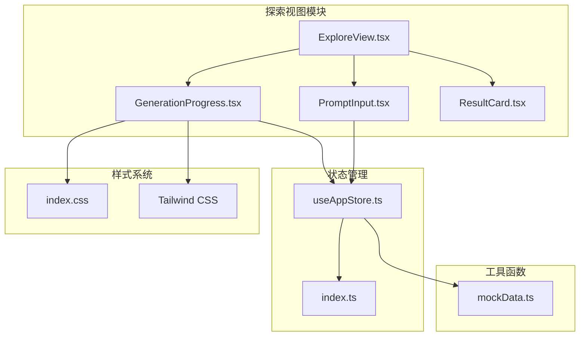
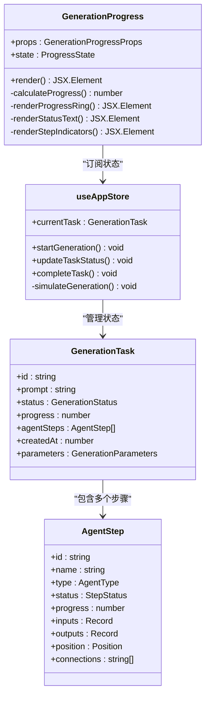
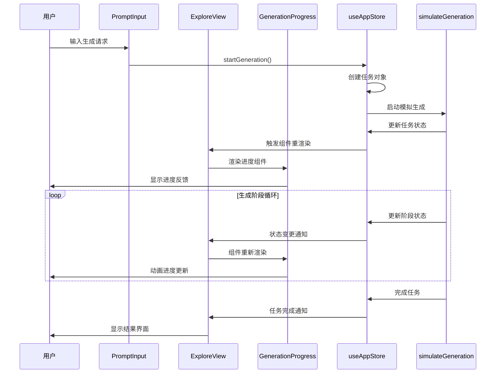
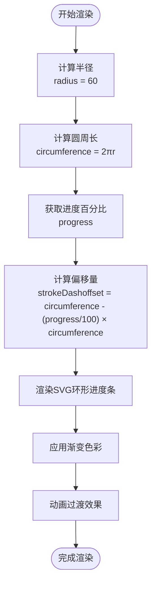
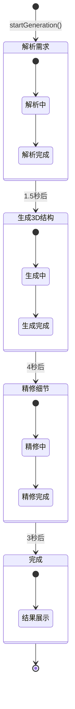
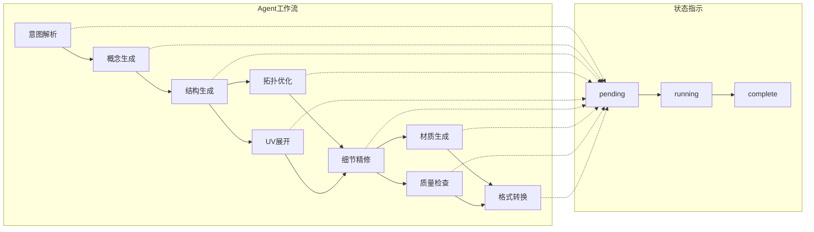
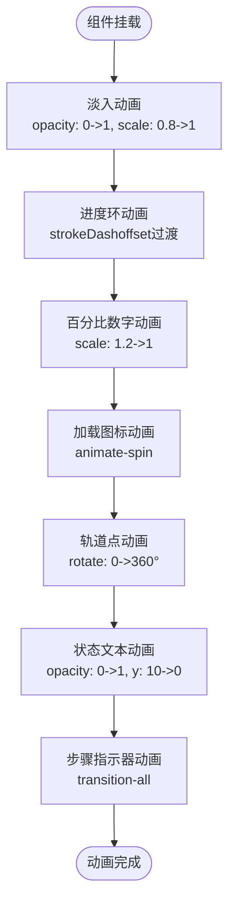
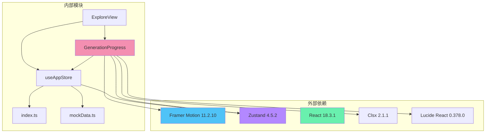
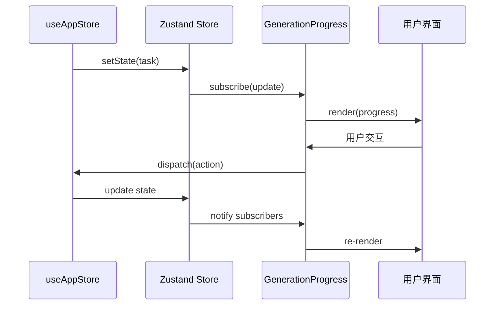

# 生成进度显示

<cite>
**本文档引用的文件**
- [GenerationProgress.tsx](file://src/components/Explore/GenerationProgress.tsx)
- [useAppStore.ts](file://src/store/useAppStore.ts)
- [index.ts](file://src/types/index.ts)
- [ExploreView.tsx](file://src/components/Explore/ExploreView.tsx)
- [mockData.ts](file://src/utils/mockData.ts)
- [PromptInput.tsx](file://src/components/Explore/PromptInput.tsx)
- [index.css](file://src/index.css)
- [package.json](file://package.json)
</cite>

## 目录
1. [简介](#简介)
2. [项目结构](#项目结构)
3. [核心组件](#核心组件)
4. [架构概览](#架构概览)
5. [详细组件分析](#详细组件分析)
6. [依赖关系分析](#依赖关系分析)
7. [性能考虑](#性能考虑)
8. [故障排除指南](#故障排除指南)
9. [结论](#结论)

## 简介

生成进度显示组件是3D模型生成系统的核心交互界面，负责向用户提供实时的生成状态反馈。该组件采用现代化的UI设计，结合SVG环形进度条、动态渐变色彩和流畅的动画效果，为用户提供沉浸式的生成体验。

该组件不仅展示了整体进度百分比，还提供了详细的阶段状态指示、多步骤Agent工作流跟踪以及专业的技术参数显示。通过精心设计的动画序列和视觉反馈，确保用户能够清晰地了解生成过程的各个阶段和当前状态。

## 项目结构

生成进度显示组件位于项目的探索视图模块中，与状态管理、类型定义和样式系统紧密集成：

**图表来源**
- [ExploreView.tsx:1-263](file://src/components/Explore/ExploreView.tsx#L1-L263)
- [GenerationProgress.tsx:1-131](file://src/components/Explore/GenerationProgress.tsx#L1-L131)
- [useAppStore.ts:1-496](file://src/store/useAppStore.ts#L1-L496)

**章节来源**
- [ExploreView.tsx:1-263](file://src/components/Explore/ExploreView.tsx#L1-L263)
- [GenerationProgress.tsx:1-131](file://src/components/Explore/GenerationProgress.tsx#L1-L131)
- [useAppStore.ts:1-496](file://src/store/useAppStore.ts#L1-L496)

## 核心组件

### 生成进度组件架构

生成进度显示组件采用React函数式组件设计，结合Framer Motion进行动画控制，使用Zustand进行状态管理：

**图表来源**
- [GenerationProgress.tsx:13-131](file://src/components/Explore/GenerationProgress.tsx#L13-L131)
- [useAppStore.ts:53-172](file://src/store/useAppStore.ts#L53-L172)
- [index.ts:13-64](file://src/types/index.ts#L13-L64)

### 状态管理系统

组件通过Zustand状态管理库实现全局状态控制，支持任务生命周期管理和模拟生成流程：

**章节来源**
- [useAppStore.ts:114-172](file://src/store/useAppStore.ts#L114-L172)
- [GenerationProgress.tsx:13-131](file://src/components/Explore/GenerationProgress.tsx#L13-L131)

## 架构概览

生成进度显示系统采用分层架构设计，从UI组件到状态管理再到数据模拟形成完整的响应式系统：

**图表来源**
- [PromptInput.tsx:52-66](file://src/components/Explore/PromptInput.tsx#L52-L66)
- [useAppStore.ts:121-136](file://src/store/useAppStore.ts#L121-L136)
- [useAppStore.ts:410-495](file://src/store/useAppStore.ts#L410-L495)
- [ExploreView.tsx:150-201](file://src/components/Explore/ExploreView.tsx#L150-L201)

## 详细组件分析

### 环形进度条实现

进度条采用SVG实现，通过计算圆周率和动态偏移量来精确控制进度显示：

**图表来源**
- [GenerationProgress.tsx:18-20](file://src/components/Explore/GenerationProgress.tsx#L18-L20)
- [GenerationProgress.tsx:44-52](file://src/components/Explore/GenerationProgress.tsx#L44-L52)

#### 进度条设计特点

1. **双层环形设计**：外层发光环提供视觉引导，内层进度环显示实际进度
2. **渐变色彩系统**：使用多色渐变从蓝色到紫色再到绿色的彩虹效果
3. **动态偏移算法**：通过数学公式精确控制进度条的绘制
4. **平滑动画过渡**：0.5秒缓动动画确保进度变化流畅自然

**章节来源**
- [GenerationProgress.tsx:22-61](file://src/components/Explore/GenerationProgress.tsx#L22-L61)

### 多阶段进度指示系统

系统实现了完整的四阶段生成流程，每个阶段都有明确的状态标识和视觉反馈：

**图表来源**
- [useAppStore.ts:415-427](file://src/store/useAppStore.ts#L415-L427)
- [GenerationProgress.tsx:6-11](file://src/components/Explore/GenerationProgress.tsx#L6-L11)

#### 阶段状态映射

| 阶段 | 状态码 | 进度百分比 | Agent步骤索引 |
|------|--------|------------|---------------|
| 解析需求 | parsing | 15% | 0 |
| 生成3D结构 | generating | 55% | 2 |
| 精修细节 | refining | 85% | 5 |
| 完成 | complete | 100% | 8 |

**章节来源**
- [useAppStore.ts:435-437](file://src/store/useAppStore.ts#L435-L437)
- [useAppStore.ts:415-420](file://src/store/useAppStore.ts#L415-L420)

### Agent步骤跟踪系统

专业模式下提供详细的Agent工作流跟踪，展示九个核心步骤的执行状态：

**图表来源**
- [mockData.ts:74-176](file://src/utils/mockData.ts#L74-L176)
- [ExploreView.tsx:172-196](file://src/components/Explore/ExploreView.tsx#L172-L196)

#### 步骤状态可视化

- **等待状态**：白色半透明点
- **运行中**：蓝色脉冲动画
- **完成状态**：绿色实心点
- **错误状态**：红色实心点

**章节来源**
- [ExploreView.tsx:171-196](file://src/components/Explore/ExploreView.tsx#L171-L196)
- [mockData.ts:74-176](file://src/utils/mockData.ts#L74-L176)

### 动画系统设计

组件集成了多层次的动画效果，从简单的进度旋转到复杂的轨道动画：

**图表来源**
- [GenerationProgress.tsx:23-27](file://src/components/Explore/GenerationProgress.tsx#L23-L27)
- [GenerationProgress.tsx:65-72](file://src/components/Explore/GenerationProgress.tsx#L65-L72)
- [GenerationProgress.tsx:73-76](file://src/components/Explore/GenerationProgress.tsx#L73-L76)
- [GenerationProgress.tsx:79-98](file://src/components/Explore/GenerationProgress.tsx#L79-L98)
- [GenerationProgress.tsx:102-106](file://src/components/Explore/GenerationProgress.tsx#L102-L106)
- [GenerationProgress.tsx:115-127](file://src/components/Explore/GenerationProgress.tsx#L115-L127)

#### 动画参数配置

| 动画类型 | 持续时间 | 缓动函数 | 特殊属性 |
|----------|----------|----------|----------|
| 组件淡入 | 0.3秒 | easeOut | opacity, scale |
| 进度环过渡 | 0.5秒 | easeOut | strokeDashoffset |
| 百分比缩放 | 0.2秒 | easeOut | scale |
| 加载图标旋转 | 1秒 | linear | rotate |
| 轨道点旋转 | 3秒 | linear | rotate |
| 状态文本淡入 | 0.3秒 | easeOut | opacity, y |

**章节来源**
- [GenerationProgress.tsx:23-53](file://src/components/Explore/GenerationProgress.tsx#L23-L53)
- [GenerationProgress.tsx:79-98](file://src/components/Explore/GenerationProgress.tsx#L79-L98)
- [GenerationProgress.tsx:102-106](file://src/components/Explore/GenerationProgress.tsx#L102-L106)

### 用户体验优化

#### 响应式设计

组件采用响应式布局，适配不同屏幕尺寸和设备类型：

- **移动端优化**：触摸友好的点击区域和缩放手势
- **桌面端优化**：鼠标悬停效果和键盘导航支持
- **高分辨率支持**：清晰的矢量图形和高清显示

#### 可访问性设计

- **颜色对比度**：确保文本和背景有足够的对比度
- **动画可选**：支持减少动画的用户偏好设置
- **键盘导航**：完整的键盘操作支持
- **屏幕阅读器**：语义化的HTML结构和ARIA标签

**章节来源**
- [GenerationProgress.tsx:22-129](file://src/components/Explore/GenerationProgress.tsx#L22-L129)

## 依赖关系分析

生成进度显示组件依赖于多个核心模块和外部库：

**图表来源**
- [package.json:11-22](file://package.json#L11-L22)
- [GenerationProgress.tsx:1-4](file://src/components/Explore/GenerationProgress.tsx#L1-L4)
- [useAppStore.ts:1-1](file://src/store/useAppStore.ts#L1-L1)

### 数据流分析

组件的数据流遵循单向数据绑定原则，从状态管理到UI渲染形成清晰的链路：

**图表来源**
- [useAppStore.ts:114-172](file://src/store/useAppStore.ts#L114-L172)
- [GenerationProgress.tsx:13-15](file://src/components/Explore/GenerationProgress.tsx#L13-L15)

**章节来源**
- [package.json:11-22](file://package.json#L11-L22)
- [useAppStore.ts:114-172](file://src/store/useAppStore.ts#L114-L172)

## 性能考虑

### 渲染优化

1. **条件渲染**：仅在有活动任务时渲染进度组件
2. **动画节流**：合理设置动画帧率避免过度消耗CPU
3. **内存管理**：及时清理定时器和事件监听器
4. **懒加载**：按需加载动画资源

### 状态管理优化

- **状态分片**：将大对象拆分为独立的状态片段
- **选择器模式**：使用selector减少不必要的重渲染
- **持久化存储**：利用localStorage缓存用户偏好

### 动画性能

- **硬件加速**：使用transform和opacity属性触发GPU加速
- **批处理更新**：合并多个状态更新到单个渲染周期
- **动画降级**：在低端设备上自动降低动画复杂度

## 故障排除指南

### 常见问题及解决方案

#### 进度条不显示

**症状**：进度组件完全不显示
**可能原因**：
- 当前没有活动任务
- 状态未正确初始化
- 样式文件加载失败

**解决方法**：
1. 检查任务状态是否为非空
2. 验证状态管理器初始化
3. 确认CSS类名正确加载

#### 动画异常

**症状**：动画卡顿或不流畅
**可能原因**：
- 动画帧率过低
- 内存泄漏导致性能下降
- 浏览器兼容性问题

**解决方法**：
1. 检查浏览器性能监控
2. 优化动画参数设置
3. 实现动画降级策略

#### 状态同步问题

**症状**：UI状态与实际状态不一致
**可能原因**：
- 异步操作竞态条件
- 状态更新时机不当
- 订阅机制失效

**解决方法**：
1. 使用原子性状态更新
2. 实现防抖和节流机制
3. 添加状态一致性检查

**章节来源**
- [useAppStore.ts:410-495](file://src/store/useAppStore.ts#L410-L495)
- [GenerationProgress.tsx:13-15](file://src/components/Explore/GenerationProgress.tsx#L13-L15)

## 结论

生成进度显示组件展现了现代前端开发的最佳实践，通过精心设计的UI架构、高效的动画系统和完善的用户体验优化，为3D模型生成过程提供了直观而富有吸引力的交互界面。

该组件的主要优势包括：

1. **完整的状态管理**：从任务创建到完成的全生命周期管理
2. **丰富的视觉反馈**：多层次的动画效果和色彩系统
3. **专业的技术展示**：详细的Agent工作流跟踪和参数显示
4. **优秀的用户体验**：响应式设计和无障碍访问支持
5. **高性能实现**：优化的渲染策略和内存管理

通过模块化的架构设计和清晰的职责分离，该组件为整个3D模型生成系统的用户界面奠定了坚实的基础，为后续的功能扩展和维护提供了良好的基础。