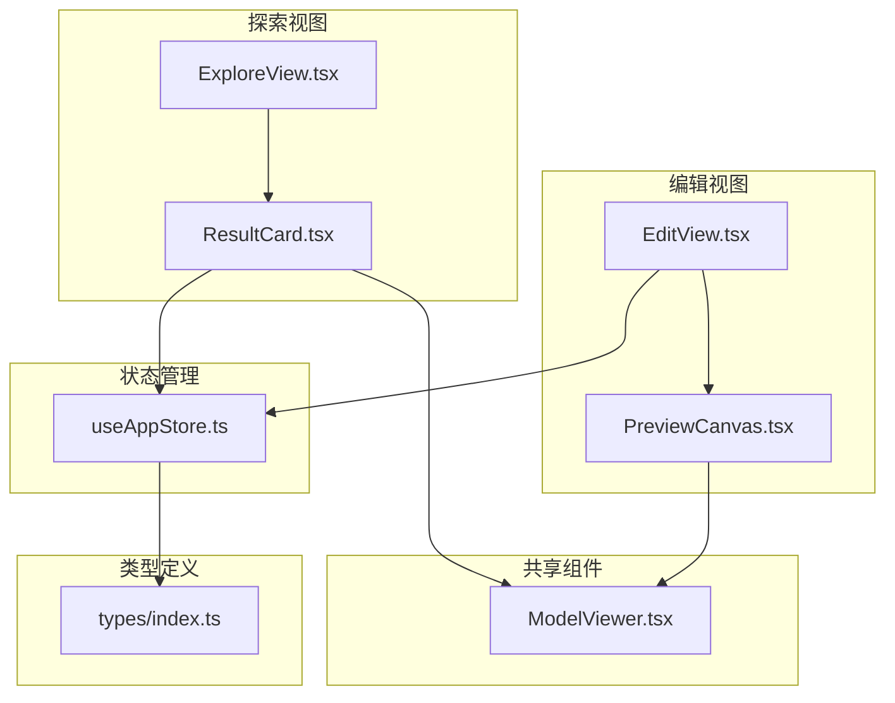
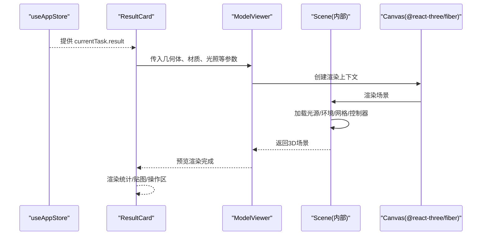
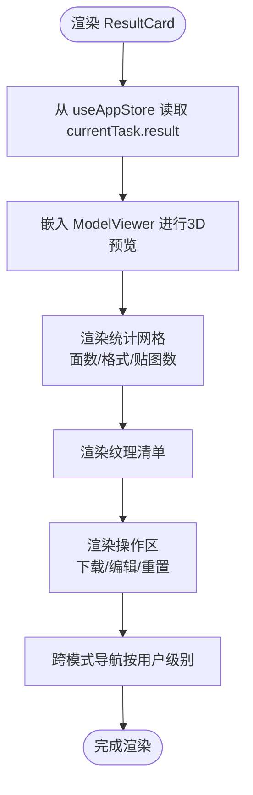
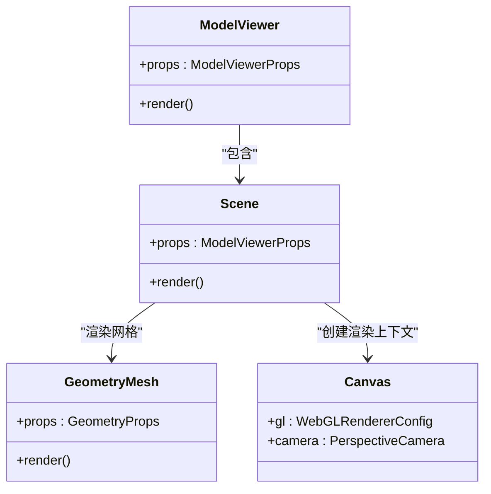
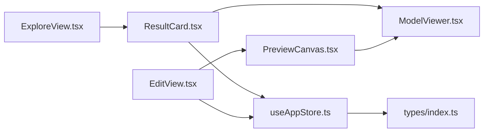
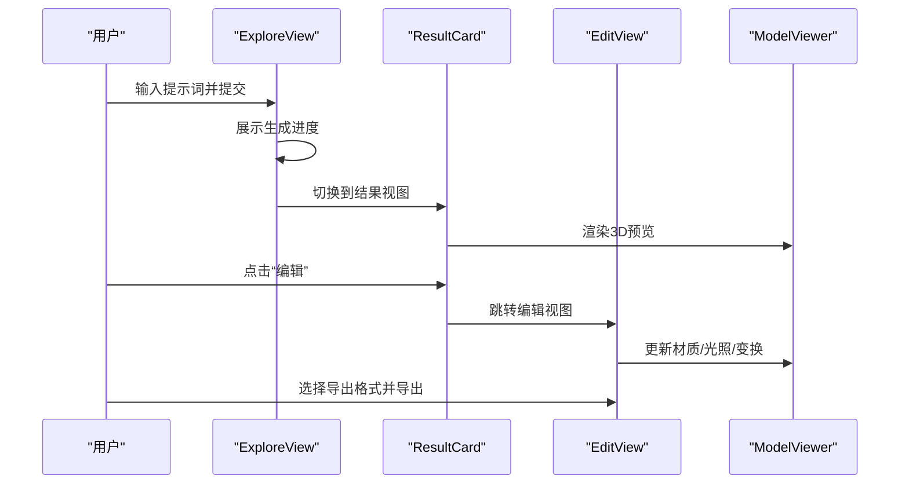

# 结果展示卡片

<cite>
**本文引用的文件列表**
- [ResultCard.tsx](file://src/components/Explore/ResultCard.tsx)
- [ModelViewer.tsx](file://src/components/Shared/ModelViewer.tsx)
- [ExploreView.tsx](file://src/components/Explore/ExploreView.tsx)
- [EditView.tsx](file://src/components/Edit/EditView.tsx)
- [PreviewCanvas.tsx](file://src/components/Edit/PreviewCanvas.tsx)
- [useAppStore.ts](file://src/store/useAppStore.ts)
- [index.ts](file://src/types/index.ts)
- [mockData.ts](file://src/utils/mockData.ts)
- [package.json](file://package.json)
</cite>

## 目录
1. [简介](#简介)
2. [项目结构](#项目结构)
3. [核心组件](#核心组件)
4. [架构总览](#架构总览)
5. [详细组件分析](#详细组件分析)
6. [依赖关系分析](#依赖关系分析)
7. [性能考量](#性能考量)
8. [故障排查指南](#故障排查指南)
9. [结论](#结论)
10. [附录](#附录)

## 简介
本文件聚焦“结果展示卡片”组件，系统性阐述其在3D模型结果展示中的设计与交互，涵盖：
- 缩略图与预览区域的组织与呈现
- 模型预览的Three.js集成、材质渲染与用户交互控制
- 下载与分享能力的现状与扩展路径
- 结果卡片的信息组织方式（模型元数据、生成参数、质量指标）
- 不同格式模型的展示效果与导出流程
- 结果缓存策略与性能优化措施

## 项目结构
该应用采用按功能域分层的组件组织方式，结果展示卡片位于探索视图（Explore）中，作为生成完成后的主要结果容器；同时，编辑视图（Edit）提供更丰富的材质、变换与光照控制，并包含导出与分享入口。

图表来源
- [ExploreView.tsx](file://src/components/Explore/ExploreView.tsx)
- [ResultCard.tsx](file://src/components/Explore/ResultCard.tsx)
- [ModelViewer.tsx](file://src/components/Shared/ModelViewer.tsx)
- [EditView.tsx](file://src/components/Edit/EditView.tsx)
- [PreviewCanvas.tsx](file://src/components/Edit/PreviewCanvas.tsx)
- [useAppStore.ts](file://src/store/useAppStore.ts)
- [index.ts](file://src/types/index.ts)

章节来源
- [ExploreView.tsx](file://src/components/Explore/ExploreView.tsx)
- [ResultCard.tsx](file://src/components/Explore/ResultCard.tsx)
- [ModelViewer.tsx](file://src/components/Shared/ModelViewer.tsx)
- [EditView.tsx](file://src/components/Edit/EditView.tsx)
- [PreviewCanvas.tsx](file://src/components/Edit/PreviewCanvas.tsx)
- [useAppStore.ts](file://src/store/useAppStore.ts)
- [index.ts](file://src/types/index.ts)

## 核心组件
- 结果展示卡片（ResultCard）：负责渲染生成完成后的3D模型预览、统计信息、贴图清单以及操作按钮（下载、编辑、重置等）。卡片内嵌入共享的ModelViewer以进行3D预览。
- 共享模型查看器（ModelViewer）：基于Three.js与@react-three/fiber构建，支持多种几何体、材质参数、光照预设、网格显示与自动旋转等。
- 探索视图（ExploreView）：作为入口视图，根据任务状态切换输入、生成进度或结果卡片视图。
- 编辑视图（EditView）：提供材质、变换、光照面板与导出/分享入口，内部同样使用ModelViewer进行预览。
- 状态管理（useAppStore）：维护当前任务、历史记录、用户级别与偏好、对话会话等，驱动结果卡片与编辑视图的数据流。

章节来源
- [ResultCard.tsx](file://src/components/Explore/ResultCard.tsx)
- [ModelViewer.tsx](file://src/components/Shared/ModelViewer.tsx)
- [ExploreView.tsx](file://src/components/Explore/ExploreView.tsx)
- [EditView.tsx](file://src/components/Edit/EditView.tsx)
- [useAppStore.ts](file://src/store/useAppStore.ts)

## 架构总览
结果展示卡片通过状态管理读取当前任务结果，将关键字段（如模型URL、缩略图URL、多边形数量、输出格式、纹理列表）映射到UI。预览区域由ModelViewer承载，内部使用Canvas渲染场景，Scene组件挂载光源、环境贴图、网格与控制器，并根据传入的材质参数与几何体动态生成网格。

图表来源
- [ResultCard.tsx](file://src/components/Explore/ResultCard.tsx)
- [ModelViewer.tsx](file://src/components/Shared/ModelViewer.tsx)
- [useAppStore.ts](file://src/store/useAppStore.ts)

## 详细组件分析

### 结果展示卡片（ResultCard）
- 数据来源：从全局状态读取当前任务的result对象，包含模型URL、缩略图URL、多边形数量、输出格式、纹理数组等。
- 预览区域：嵌入ModelViewer，传入随机几何体、基础颜色、金属度、粗糙度、光照预设与自动旋转等参数，营造“即看即用”的视觉体验。
- 信息组织：
  - 标题与状态徽章：展示提示词与生成状态。
  - 统计网格：展示面数、格式、贴图数量等关键指标。
  - 贴图清单：列出每张贴图的名称与分辨率。
- 操作区：
  - 下载模型：占位按钮，用于触发下载流程（当前未绑定具体实现）。
  - 编辑：跳转至编辑视图，进入材质/变换/光照调整。
  - 重置：重置相机视角与控制器。
  - 跨模式导航：根据用户级别显示“在编辑模式打开”“查看技术详情”等入口。

图表来源
- [ResultCard.tsx](file://src/components/Explore/ResultCard.tsx)
- [useAppStore.ts](file://src/store/useAppStore.ts)

章节来源
- [ResultCard.tsx](file://src/components/Explore/ResultCard.tsx)
- [useAppStore.ts](file://src/store/useAppStore.ts)

### 共享模型查看器（ModelViewer）
- Three.js集成：使用@react-three/fiber的Canvas创建WebGL上下文，Suspense处理加载态，支持透明背景与抗锯齿。
- 几何体与材质：支持盒体、球体、环面、圆柱、圆锥、环面结等几何体；材质参数包括基础颜色、金属度、粗糙度、自发光等。
- 光照与环境：内置多种光照预设（工作室、户外、戏剧化、中性），可选择是否启用环境贴图与背景。
- 场景与控件：默认添加环境光与方向光；可选网格辅助；OrbitControls提供旋转、缩放、平移控制；支持自动旋转。
- Compact模式：在结果卡片中以紧凑模式渲染，相机位置与FOV更贴近卡片尺寸。

图表来源
- [ModelViewer.tsx](file://src/components/Shared/ModelViewer.tsx)

章节来源
- [ModelViewer.tsx](file://src/components/Shared/ModelViewer.tsx)

### 探索视图（ExploreView）
- 视图切换：根据任务状态在“输入/样式选择”“生成进度”“结果卡片”之间切换。
- 专业模式：在专业视图下展示Agent步骤详情与技术参数面板。
- 输出格式选择：在高级参数面板中支持glb/fbx/obj/usdz格式选择（仅专业模式）。

章节来源
- [ExploreView.tsx](file://src/components/Explore/ExploreView.tsx)

### 编辑视图（EditView）与预览画布（PreviewCanvas）
- 编辑视图：提供材质、变换、光照面板与底部操作栏，包含导出与分享入口。
- 预览画布：使用ModelViewer承载3D预览，叠加视口控制按钮与信息覆盖层。
- 数据联动：编辑设置（材质、旋转、缩放、光照、背景）通过状态管理驱动预览更新。

章节来源
- [EditView.tsx](file://src/components/Edit/EditView.tsx)
- [PreviewCanvas.tsx](file://src/components/Edit/PreviewCanvas.tsx)

### 状态与类型定义
- 任务与结果：GenerationTask与GenerationResult定义了任务生命周期、进度、结果字段（模型URL、缩略图URL、多边形数量、格式、纹理列表）。
- 用户与视图：UserProfile与ViewMode影响界面可用功能与导航入口。
- 默认参数与编辑设置：defaultParameters与defaultEditSettings提供初始值，便于快速预览与编辑。

章节来源
- [index.ts](file://src/types/index.ts)
- [useAppStore.ts](file://src/store/useAppStore.ts)
- [mockData.ts](file://src/utils/mockData.ts)

## 依赖关系分析
- 外部依赖：React、Three.js、@react-three/fiber、@react-three/drei、Framer Motion、Lucide React等。
- 内部依赖：ResultCard依赖ModelViewer与useAppStore；EditView/PreviewCanvas同样依赖ModelViewer与useAppStore；ExploreView协调三者之间的状态流转。

图表来源
- [ResultCard.tsx](file://src/components/Explore/ResultCard.tsx)
- [ModelViewer.tsx](file://src/components/Shared/ModelViewer.tsx)
- [EditView.tsx](file://src/components/Edit/EditView.tsx)
- [PreviewCanvas.tsx](file://src/components/Edit/PreviewCanvas.tsx)
- [ExploreView.tsx](file://src/components/Explore/ExploreView.tsx)
- [useAppStore.ts](file://src/store/useAppStore.ts)
- [index.ts](file://src/types/index.ts)

章节来源
- [package.json](file://package.json)
- [ResultCard.tsx](file://src/components/Explore/ResultCard.tsx)
- [ModelViewer.tsx](file://src/components/Shared/ModelViewer.tsx)
- [EditView.tsx](file://src/components/Edit/EditView.tsx)
- [PreviewCanvas.tsx](file://src/components/Edit/PreviewCanvas.tsx)
- [ExploreView.tsx](file://src/components/Explore/ExploreView.tsx)
- [useAppStore.ts](file://src/store/useAppStore.ts)
- [index.ts](file://src/types/index.ts)

## 性能考量
- Three.js渲染优化
  - 抗锯齿与透明背景：Canvas配置开启抗锯齿与alpha，提升视觉质量但增加GPU负担，建议在移动端适度降级。
  - 自动旋转：仅在需要时启用，避免不必要的帧更新。
  - 网格显示：在结果卡片中使用紧凑模式关闭网格，减少几何绘制开销。
- 状态与渲染
  - 使用React.memo包裹ModelViewer，避免无关属性变化导致的重复渲染。
  - 使用useMemo在ResultCard中缓存随机几何体，降低每次渲染的计算成本。
- 动画与过渡
  - Framer Motion的入场动画与视图切换使用animatePresence，确保动画流畅且不阻塞主线程。
- 存储与持久化
  - 用户资料与模板存储于localStorage，减少重复初始化成本；注意序列化异常的容错处理。

章节来源
- [ModelViewer.tsx](file://src/components/Shared/ModelViewer.tsx)
- [ResultCard.tsx](file://src/components/Explore/ResultCard.tsx)
- [useAppStore.ts](file://src/store/useAppStore.ts)

## 故障排查指南
- 预览空白或黑屏
  - 检查Canvas配置与Suspense回退组件是否正确渲染。
  - 确认Scene中光源与环境贴图加载成功。
- 材质参数无效
  - 确认传入的baseColor、metallic、roughness、emission等参数类型与范围有效。
- 交互无响应
  - 检查OrbitControls的enableZoom/enablePan与compact模式的开关是否一致。
- 下载/分享按钮不可用
  - 当前结果卡片中的下载按钮为占位，需在业务层绑定下载逻辑；分享按钮亦需补充实现。
- 专业模式功能缺失
  - 确认用户级别与视图模式设置，专业模式才显示技术详情与Agent步骤。

章节来源
- [ModelViewer.tsx](file://src/components/Shared/ModelViewer.tsx)
- [ResultCard.tsx](file://src/components/Explore/ResultCard.tsx)
- [EditView.tsx](file://src/components/Edit/EditView.tsx)

## 结论
结果展示卡片通过简洁的信息组织与直观的3D预览，为用户提供从生成到编辑的无缝衔接。其基于Three.js的ModelViewer具备良好的扩展性，能够支撑材质、光照、几何体等多维度的交互与展示。未来可在下载与分享功能上进一步完善，并结合缓存策略与性能优化，持续提升用户体验。

## 附录

### 实际使用示例（流程示意）
- 生成阶段：在探索视图输入提示词并选择风格，进入生成进度视图。
- 结果阶段：生成完成后，ResultCard展示3D预览、统计信息与操作区。
- 编辑阶段：点击“编辑”，进入编辑视图，使用材质/变换/光照面板微调模型。
- 导出阶段：在编辑视图底部操作栏选择目标格式（glb/fbx/obj/usdz）并导出。

图表来源
- [ExploreView.tsx](file://src/components/Explore/ExploreView.tsx)
- [ResultCard.tsx](file://src/components/Explore/ResultCard.tsx)
- [EditView.tsx](file://src/components/Edit/EditView.tsx)
- [ModelViewer.tsx](file://src/components/Shared/ModelViewer.tsx)

### 结果缓存策略与性能优化建议
- 结果缓存
  - 将已完成的任务结果（含模型URL、缩略图URL、纹理列表）缓存于本地存储或内存，避免重复请求。
  - 对于大纹理资源，采用懒加载与CDN加速，减少首屏时间。
- 渲染优化
  - 在移动端或低端设备上，默认关闭网格与环境贴图，或降低分辨率。
  - 对频繁变更的材质参数使用节流/防抖，减少帧更新频率。
- 状态管理
  - 将ResultCard与ModelViewer的渲染拆分为独立的子组件，利用React.memo与useMemo避免不必要重渲染。
- 交互优化
  - 在结果卡片中提供“重置”按钮，一键恢复相机与控制器状态，提升交互效率。

章节来源
- [useAppStore.ts](file://src/store/useAppStore.ts)
- [ResultCard.tsx](file://src/components/Explore/ResultCard.tsx)
- [ModelViewer.tsx](file://src/components/Shared/ModelViewer.tsx)