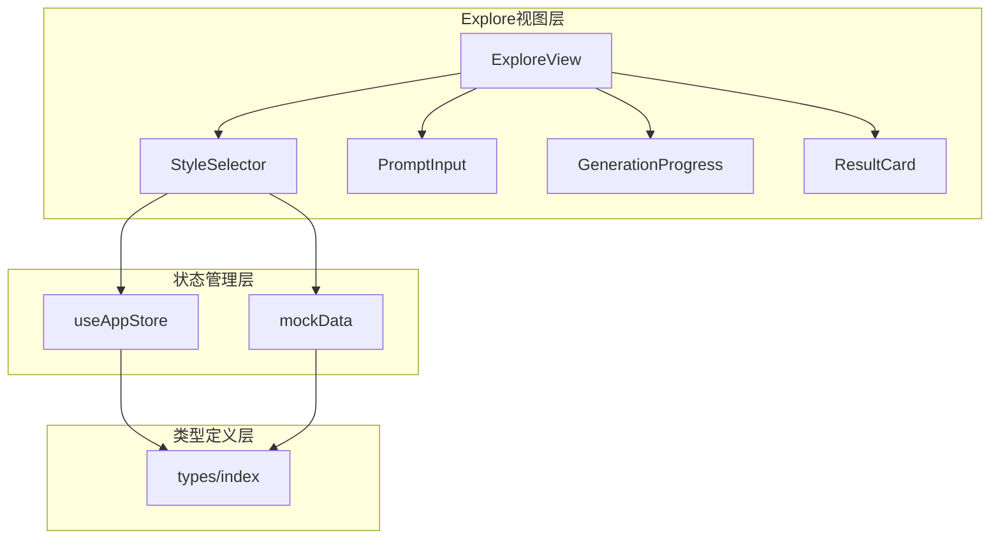
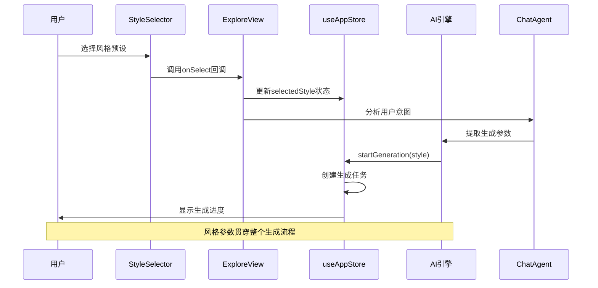
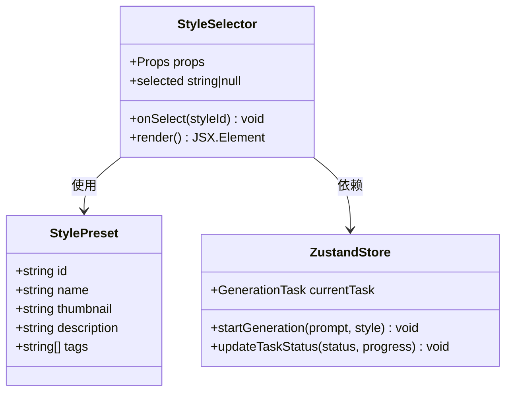
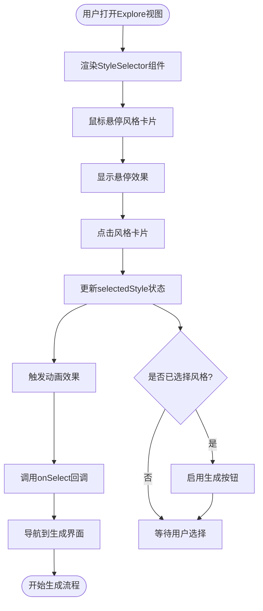
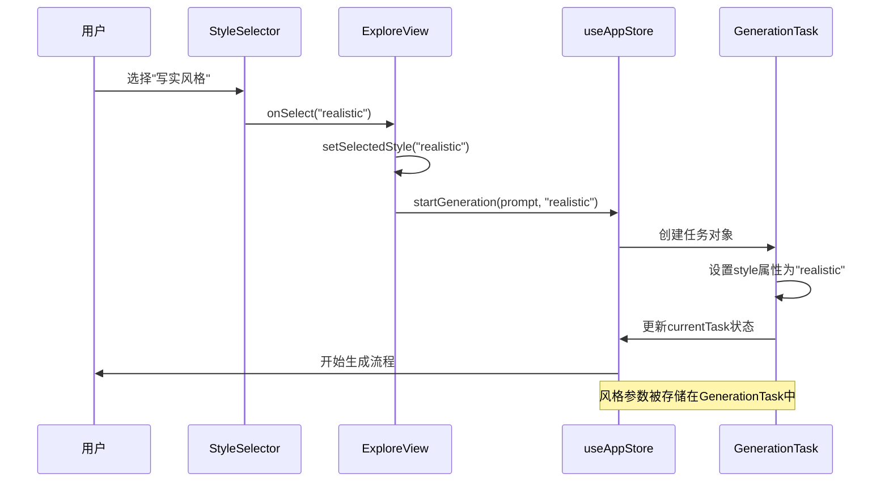
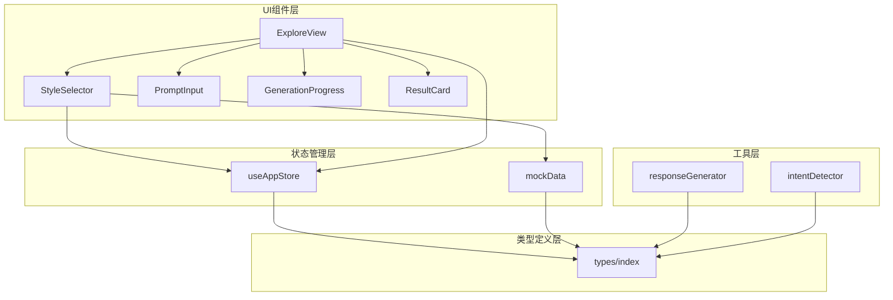

# 风格选择器

<cite>
**本文档引用的文件**
- [StyleSelector.tsx](file://src/components/Explore/StyleSelector.tsx)
- [ExploreView.tsx](file://src/components/Explore/ExploreView.tsx)
- [mockData.ts](file://src/utils/mockData.ts)
- [useAppStore.ts](file://src/store/useAppStore.ts)
- [types/index.ts](file://src/types/index.ts)
- [chatAgent.ts](file://src/engine/chatAgent.ts)
- [ChatInput.tsx](file://src/components/Chat/ChatInput.tsx)
- [intentDetector.ts](file://src/utils/intentDetector.ts)
- [responseGenerator.ts](file://src/engine/responseGenerator.ts)
</cite>

## 目录
1. [简介](#简介)
2. [项目结构](#项目结构)
3. [核心组件](#核心组件)
4. [架构概览](#架构概览)
5. [详细组件分析](#详细组件分析)
6. [依赖关系分析](#依赖关系分析)
7. [性能考虑](#性能考虑)
8. [故障排除指南](#故障排除指南)
9. [结论](#结论)
10. [附录](#附录)

## 简介

风格选择器是3D模型生成系统中的关键交互组件，负责为用户提供直观的风格预设选择界面。该组件采用卡片式布局设计，支持6种不同的3D模型风格预设，包括写实风格、卡通风格、游戏资产、概念设计、建筑/场景和角色模型。

风格选择器不仅提供视觉化的风格预览，还深度集成了AI生成流程，通过风格参数影响生成算法的执行策略。每个风格预设都包含独特的视觉特征和适用场景，为用户提供了从产品展示到创意设计的完整风格覆盖。

## 项目结构

风格选择器组件位于Explore视图中，作为生成流程的第一步交互界面。整个项目采用模块化架构，风格选择器通过状态管理与全局应用状态集成。

**图表来源**
- [ExploreView.tsx:11-263](file://src/components/Explore/ExploreView.tsx#L11-L263)
- [StyleSelector.tsx:11-61](file://src/components/Explore/StyleSelector.tsx#L11-L61)
- [useAppStore.ts:114-136](file://src/store/useAppStore.ts#L114-L136)

**章节来源**
- [ExploreView.tsx:11-263](file://src/components/Explore/ExploreView.tsx#L11-L263)
- [StyleSelector.tsx:11-61](file://src/components/Explore/StyleSelector.tsx#L11-L61)

## 核心组件

### StyleSelector组件

StyleSelector是风格选择器的核心组件，采用响应式网格布局设计，支持2-6列的自适应显示。组件具备完整的交互状态管理，包括悬停效果、选中状态和动画过渡。

组件特性：
- **响应式布局**：根据屏幕尺寸自动调整列数
- **动画效果**：使用Framer Motion实现流畅的进入和选中动画
- **状态反馈**：通过视觉元素提供即时的用户操作反馈
- **标签系统**：每个风格预设包含2个关键标签，帮助用户快速理解风格特点

### 风格预设系统

系统内置6种风格预设，每种风格都有独特的视觉标识和应用场景：

| 风格ID | 名称 | 视觉标识 | 关键标签 | 适用场景 |
|--------|------|----------|----------|----------|
| realistic | 写实风格 | 🎨 | PBR, 高精度, 产品 | 产品展示, 工业设计 |
| stylized | 风格化 | ✨ | 卡通, Low-poly, 艺术 | 游戏美术, 创意设计 |
| game-ready | 游戏资产 | 🎮 | LOD, 优化, 实时 | 游戏开发, VR应用 |
| concept | 概念设计 | 💡 | 概念, 快速, 迭代 | 设计探索, 原型制作 |
| architectural | 建筑/场景 | 🏛️ | 建筑, 场景, 模块 | 建筑可视化, 环境设计 |
| character | 角色模型 | 🧑‍🎨 | 角色, 骨骼, 动画 | 游戏角色, 影视制作 |

**章节来源**
- [StyleSelector.tsx:29-72](file://src/components/Explore/StyleSelector.tsx#L29-L72)
- [mockData.ts:29-72](file://src/utils/mockData.ts#L29-L72)

## 架构概览

风格选择器在整个AI生成系统中扮演着入口控制器的角色，连接用户界面与后端生成引擎。

**图表来源**
- [StyleSelector.tsx:27-28](file://src/components/Explore/StyleSelector.tsx#L27-L28)
- [ExploreView.tsx:13](file://src/components/Explore/ExploreView.tsx#L13)
- [useAppStore.ts:121-136](file://src/store/useAppStore.ts#L121-L136)
- [chatAgent.ts:50-82](file://src/engine/chatAgent.ts#L50-L82)

## 详细组件分析

### StyleSelector组件架构

**图表来源**
- [StyleSelector.tsx:6-9](file://src/components/Explore/StyleSelector.tsx#L6-L9)
- [types/index.ts:5-11](file://src/types/index.ts#L5-L11)
- [useAppStore.ts:58-63](file://src/store/useAppStore.ts#L58-L63)

### 风格选择交互流程

**图表来源**
- [StyleSelector.tsx:22-56](file://src/components/Explore/StyleSelector.tsx#L22-L56)
- [ExploreView.tsx:49-50](file://src/components/Explore/ExploreView.tsx#L49-L50)

### 风格参数传递机制

**图表来源**
- [StyleSelector.tsx:27](file://src/components/Explore/StyleSelector.tsx#L27)
- [ExploreView.tsx:13](file://src/components/Explore/ExploreView.tsx#L13)
- [useAppStore.ts:121-136](file://src/store/useAppStore.ts#L121-L136)
- [types/index.ts:18](file://src/types/index.ts#L18)

**章节来源**
- [StyleSelector.tsx:11-61](file://src/components/Explore/StyleSelector.tsx#L11-L61)
- [ExploreView.tsx:11-263](file://src/components/Explore/ExploreView.tsx#L11-L263)

## 依赖关系分析

### 组件间依赖关系

**图表来源**
- [StyleSelector.tsx:3](file://src/components/Explore/StyleSelector.tsx#L3)
- [ExploreView.tsx:4](file://src/components/Explore/ExploreView.tsx#L4)
- [useAppStore.ts:1](file://src/store/useAppStore.ts#L1)
- [mockData.ts:1](file://src/utils/mockData.ts#L1)

### 数据流依赖

风格选择器的数据流遵循单向数据流原则，确保状态管理的可预测性和可维护性：

1. **输入数据**：从mockData导入的stylePresets
2. **状态管理**：通过useAppStore管理全局状态
3. **类型约束**：严格的TypeScript类型定义
4. **事件处理**：单向回调传递

**章节来源**
- [StyleSelector.tsx:1-61](file://src/components/Explore/StyleSelector.tsx#L1-L61)
- [useAppStore.ts:114-136](file://src/store/useAppStore.ts#L114-L136)
- [mockData.ts:29-72](file://src/utils/mockData.ts#L29-L72)

## 性能考虑

### 渲染性能优化

风格选择器采用了多项性能优化策略：

- **虚拟滚动**：虽然当前只有6个预设，但网格布局支持动态扩展
- **懒加载**：卡片内容按需渲染，减少初始渲染负担
- **CSS动画**：使用transform属性而非layout-changing属性
- **状态最小化**：仅存储必要的选中状态

### 内存管理

- **组件卸载**：正确清理动画和定时器
- **状态持久化**：利用localStorage避免重复计算
- **引用优化**：使用React.memo避免不必要的重渲染

## 故障排除指南

### 常见问题及解决方案

**问题1：风格选择无响应**
- 检查onSelect回调函数是否正确传递
- 验证selected状态是否正确更新
- 确认事件处理器绑定

**问题2：样式显示异常**
- 检查CSS类名拼写
- 验证Tailwind配置
- 确认主题变量设置

**问题3：动画效果不流畅**
- 检查Framer Motion版本兼容性
- 验证硬件加速设置
- 确认浏览器性能监控

**章节来源**
- [StyleSelector.tsx:27-56](file://src/components/Explore/StyleSelector.tsx#L27-L56)

## 结论

风格选择器组件成功实现了直观、高效的风格预设选择功能。通过精心设计的交互模式和完善的架构集成，该组件为用户提供了流畅的风格选择体验，并深度融入了整个AI生成工作流。

组件的主要优势包括：
- **用户体验友好**：直观的视觉反馈和动画效果
- **架构清晰**：模块化设计便于维护和扩展
- **性能优化**：合理的渲染策略和状态管理
- **可扩展性**：灵活的预设系统支持未来扩展

## 附录

### 风格特点与适用场景

| 风格 | 主要特征 | 技术参数 | 适用场景 |
|------|----------|----------|----------|
| 写实风格 | 高保真材质, 精细细节 | PBR材质, 高分辨率贴图 | 产品展示, 工业设计, 虚拟现实 |
| 卡通风格 | 简洁线条, 夸张造型 | 低多边形, 清晰轮廓 | 游戏角色, 儿童产品, 品牌形象 |
| 游戏资产 | 优化拓扑, 实时渲染 | LOD系统, UV优化 | 游戏开发, VR应用, 交互媒体 |
| 概念设计 | 形态探索, 快速迭代 | 低预算, 高创意 | 设计探索, 原型制作, 创意表达 |
| 建筑/场景 | 模块化结构, 环境友好 | 建筑规范, 空间布局 | 建筑可视化, 城市规划, 环境设计 |
| 角色模型 | 骨骼绑定, 动画准备 | 骨骼系统, 动画优化 | 游戏角色, 影视制作, 动画片 |

### 参数调整机制

风格选择直接影响以下生成参数：
- **拓扑结构**：根据风格选择自动调整网格密度
- **材质设置**：预设相应的PBR参数
- **纹理分辨率**：优化贴图质量以匹配风格需求
- **输出格式**：推荐最适合的文件格式

**章节来源**
- [mockData.ts:29-72](file://src/utils/mockData.ts#L29-L72)
- [useAppStore.ts:121-136](file://src/store/useAppStore.ts#L121-L136)