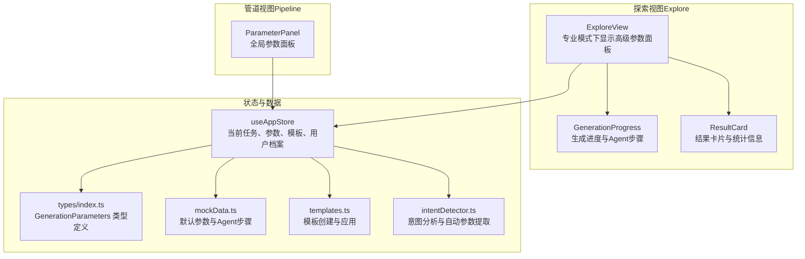
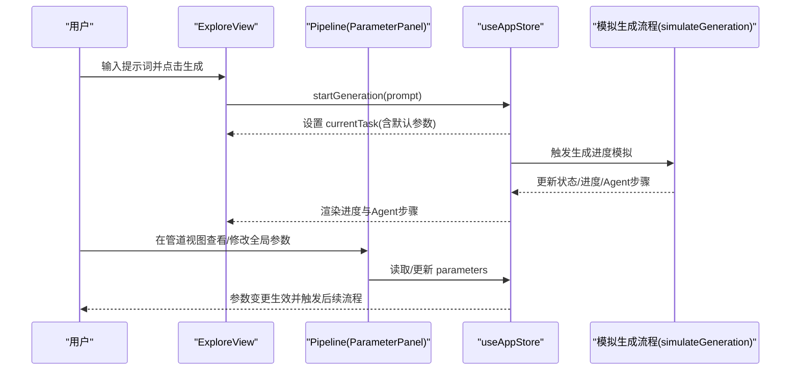
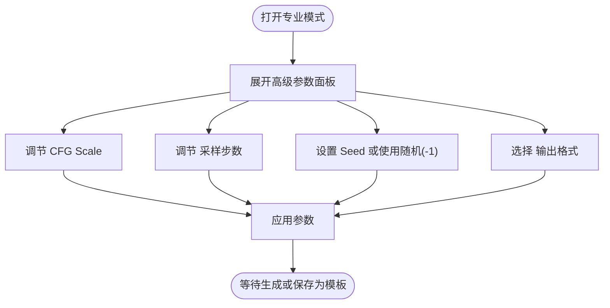
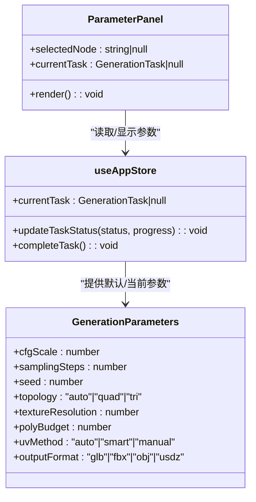
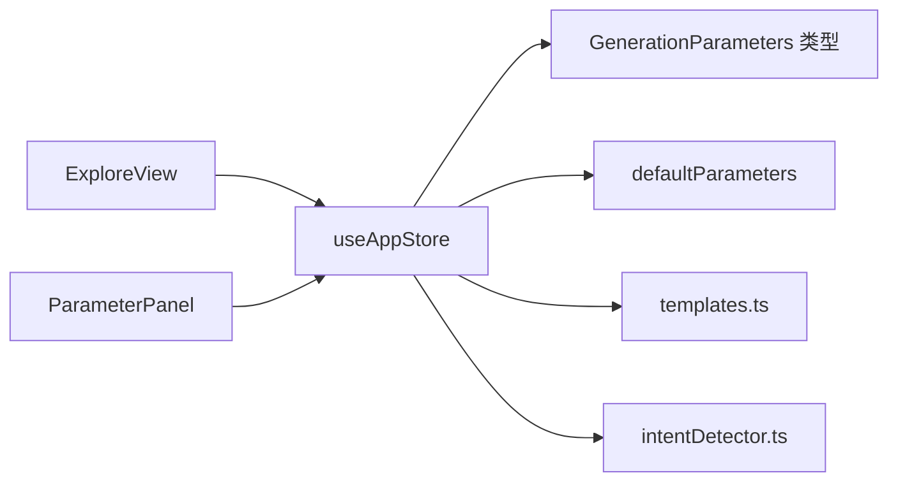

# 高级参数配置

<cite>
**本文引用的文件**
- [src/components/Pipeline/ParameterPanel.tsx](file://src/components/Pipeline/ParameterPanel.tsx)
- [src/components/Explore/ExploreView.tsx](file://src/components/Explore/ExploreView.tsx)
- [src/store/useAppStore.ts](file://src/store/useAppStore.ts)
- [src/types/index.ts](file://src/types/index.ts)
- [src/utils/mockData.ts](file://src/utils/mockData.ts)
- [src/utils/templates.ts](file://src/utils/templates.ts)
- [src/utils/intentDetector.ts](file://src/utils/intentDetector.ts)
- [src/components/Explore/GenerationProgress.tsx](file://src/components/Explore/GenerationProgress.tsx)
- [src/components/Explore/ResultCard.tsx](file://src/components/Explore/ResultCard.tsx)
</cite>

## 目录
1. [简介](#简介)
2. [项目结构](#项目结构)
3. [核心组件](#核心组件)
4. [架构总览](#架构总览)
5. [详细组件分析](#详细组件分析)
6. [依赖关系分析](#依赖关系分析)
7. [性能考量](#性能考量)
8. [故障排查指南](#故障排查指南)
9. [结论](#结论)
10. [附录](#附录)

## 简介
本文件面向“高级参数配置”子系统，聚焦专业模式下的参数界面设计与实现原理，涵盖 CFG Scale 调节、采样步数设置、Seed 值管理与输出格式选择等关键参数。文档将解释各参数对 AI 生成质量的影响机制、推荐设置范围、参数验证规则、默认值与用户偏好持久化，并通过流程图与序列图展示参数在生成管线中的作用路径与性能影响。

## 项目结构
该功能横跨“探索视图（Explore）”与“管道视图（Pipeline）”两个入口，参数面板在两种模式下以不同形式呈现：
- 探索视图（Explore）：专业模式下提供可折叠的“高级参数”面板，包含 CFG Scale、采样步数、Seed、输出格式等。
- 管道视图（Pipeline）：全局参数面板集中展示 CFG Scale、采样步数、Seed、拓扑类型、贴图分辨率、面数预算、UV 展开方式、输出格式等。

图表来源
- [src/components/Explore/ExploreView.tsx:52-146](file://src/components/Explore/ExploreView.tsx#L52-L146)
- [src/components/Pipeline/ParameterPanel.tsx:54-213](file://src/components/Pipeline/ParameterPanel.tsx#L54-L213)
- [src/store/useAppStore.ts:114-136](file://src/store/useAppStore.ts#L114-L136)
- [src/types/index.ts:42-51](file://src/types/index.ts#L42-L51)
- [src/utils/mockData.ts:3-12](file://src/utils/mockData.ts#L3-L12)
- [src/utils/templates.ts:4-33](file://src/utils/templates.ts#L4-L33)
- [src/utils/intentDetector.ts:48-75](file://src/utils/intentDetector.ts#L48-L75)

章节来源
- [src/components/Explore/ExploreView.tsx:1-263](file://src/components/Explore/ExploreView.tsx#L1-L263)
- [src/components/Pipeline/ParameterPanel.tsx:1-214](file://src/components/Pipeline/ParameterPanel.tsx#L1-L214)
- [src/store/useAppStore.ts:1-496](file://src/store/useAppStore.ts#L1-L496)
- [src/types/index.ts:1-206](file://src/types/index.ts#L1-L206)
- [src/utils/mockData.ts:1-189](file://src/utils/mockData.ts#L1-L189)
- [src/utils/templates.ts:1-115](file://src/utils/templates.ts#L1-L115)
- [src/utils/intentDetector.ts:1-148](file://src/utils/intentDetector.ts#L1-L148)

## 核心组件
- 参数滑块与选择器组件：用于构建 CFG Scale、采样步数、拓扑类型、贴图分辨率、面数预算、UV 展开方式、输出格式等控件。
- 探索视图高级参数面板：在专业模式下提供可折叠的参数面板，支持 CFG Scale、采样步数、Seed、输出格式的交互。
- 管道视图全局参数面板：展示当前任务的全局参数，包含 Seed 的只读显示与随机按钮。
- 应用状态与默认参数：通过 Zustand store 管理当前任务、参数、模板与用户档案；默认参数来自 mockData。
- 类型系统：统一的 GenerationParameters 类型定义，确保参数结构与校验基础。
- 模板系统：支持从任务创建模板、应用模板参数，便于复用与快速生成。
- 意图分析：根据提示词自动提取参数建议，辅助用户进行专业参数配置。

章节来源
- [src/components/Pipeline/ParameterPanel.tsx:6-52](file://src/components/Pipeline/ParameterPanel.tsx#L6-L52)
- [src/components/Explore/ExploreView.tsx:15-20](file://src/components/Explore/ExploreView.tsx#L15-L20)
- [src/store/useAppStore.ts:114-136](file://src/store/useAppStore.ts#L114-L136)
- [src/types/index.ts:42-51](file://src/types/index.ts#L42-L51)
- [src/utils/mockData.ts:3-12](file://src/utils/mockData.ts#L3-L12)
- [src/utils/templates.ts:4-33](file://src/utils/templates.ts#L4-L33)
- [src/utils/intentDetector.ts:48-75](file://src/utils/intentDetector.ts#L48-L75)

## 架构总览
参数配置贯穿“输入—状态—生成—结果”全链路，专业模式通过 ExploreView 的高级参数面板与 Pipeline 的全局参数面板提供精细控制，Zustand store 统一承载参数与任务状态，类型系统保证结构一致性，模板与意图分析提升易用性与效率。

图表来源
- [src/components/Explore/ExploreView.tsx:52-66](file://src/components/Explore/ExploreView.tsx#L52-L66)
- [src/store/useAppStore.ts:121-136](file://src/store/useAppStore.ts#L121-L136)
- [src/store/useAppStore.ts:410-495](file://src/store/useAppStore.ts#L410-L495)
- [src/components/Pipeline/ParameterPanel.tsx:54-213](file://src/components/Pipeline/ParameterPanel.tsx#L54-L213)

## 详细组件分析

### 探索视图高级参数面板（专业模式）
- 可折叠面板：仅在专业视图模式开启，包含 CFG Scale、采样步数、Seed、输出格式四个参数。
- 交互行为：
  - CFG Scale：范围 1–20，步进 0.5，数值随拖动实时更新。
  - 采样步数：范围 10–100，步进 1，数值随拖动实时更新。
  - Seed：数字输入框，-1 表示随机；输入变化后更新状态。
  - 输出格式：四选一按钮组（glb/fbx/obj/usdz），点击切换。
- 默认值：来源于默认参数对象，未显式传入时采用默认值。
- 与生成流程的关系：参数变更不会立即触发重新生成，但会作为后续生成或模板应用的基础。

图表来源
- [src/components/Explore/ExploreView.tsx:52-146](file://src/components/Explore/ExploreView.tsx#L52-L146)

章节来源
- [src/components/Explore/ExploreView.tsx:15-20](file://src/components/Explore/ExploreView.tsx#L15-L20)
- [src/components/Explore/ExploreView.tsx:52-146](file://src/components/Explore/ExploreView.tsx#L52-L146)

### 管道视图全局参数面板
- 展示当前任务的全局参数，包含 CFG Scale、采样步数、Seed、拓扑类型、贴图分辨率、面数预算、UV 展开方式、输出格式。
- Seed 显示为只读数字输入框，右侧提供“洗牌”按钮用于随机化 Seed。
- 参数来源：从当前任务的 parameters 字段读取，若为空则回退到默认参数。
- 与节点详情联动：当选择某个节点时，面板顶部显示节点名称；否则显示“全局参数”。

图表来源
- [src/components/Pipeline/ParameterPanel.tsx:54-213](file://src/components/Pipeline/ParameterPanel.tsx#L54-L213)
- [src/types/index.ts:42-51](file://src/types/index.ts#L42-L51)
- [src/store/useAppStore.ts:118-172](file://src/store/useAppStore.ts#L118-L172)

章节来源
- [src/components/Pipeline/ParameterPanel.tsx:54-213](file://src/components/Pipeline/ParameterPanel.tsx#L54-L213)
- [src/types/index.ts:42-51](file://src/types/index.ts#L42-L51)

### 参数类型与默认值
- 类型定义：GenerationParameters 明确定义了所有参数字段及其取值范围与枚举类型。
- 默认值：defaultParameters 提供初始默认值，用于首次生成或缺失参数时的兜底。
- 与模板集成：模板系统可保存一组参数，用于快速生成或作为新任务的起点。

章节来源
- [src/types/index.ts:42-51](file://src/types/index.ts#L42-L51)
- [src/utils/mockData.ts:3-12](file://src/utils/mockData.ts#L3-L12)
- [src/utils/templates.ts:4-33](file://src/utils/templates.ts#L4-L33)

### 参数验证规则与用户偏好
- 验证规则（基于现有实现）：
  - 滑块范围：CFG Scale 1–20，步进 0.5；采样步数 10–100，步进 1。
  - Seed：允许整数输入，-1 表示随机；未输入时按默认值处理。
  - 输出格式：限定为 glb/fbx/obj/usdz 四种之一。
  - 拓扑类型：auto/quad/tri；UV 展开方式：auto/smart/manual；贴图分辨率：512/1024/2048/4096；面数预算：1000–100000 步进 1000。
- 用户偏好与持久化：
  - 用户档案存储于 localStorage，包含使用次数、等级、已解锁特性、默认视图模式等。
  - 模板列表同样持久化，支持保存/删除/更新模板。
  - 等级提升逻辑与“高级参数”功能解锁相关联。

章节来源
- [src/components/Explore/ExploreView.tsx:83-108](file://src/components/Explore/ExploreView.tsx#L83-L108)
- [src/components/Pipeline/ParameterPanel.tsx:144-207](file://src/components/Pipeline/ParameterPanel.tsx#L144-L207)
- [src/store/useAppStore.ts:20-51](file://src/store/useAppStore.ts#L20-L51)
- [src/store/useAppStore.ts:191-229](file://src/store/useAppStore.ts#L191-L229)

### 参数与生成算法的深层关联与性能影响
- CFG Scale（指导强度）：
  - 影响：提高 CFG Scale 使生成更贴近提示词，但也可能引入伪影或过度锐化；过低则可能导致漂离提示。
  - 性能：较高 CFG Scale 通常与更多采样步数配合，增加计算时间。
- 采样步数（采样迭代）：
  - 影响：步数越多，细节越稳定，伪影减少；但收益边际递减。
  - 性能：线性增加生成时间与资源占用。
- Seed（随机种子）：
  - 影响：固定 Seed 可复现实验结果；-1 表示随机，适合探索多样性。
  - 性能：对性能影响极小，主要影响结果可重复性。
- 输出格式：
  - 影响：不同格式在兼容性、体积与工具链支持上差异较大；如 FBX 更利于动画/工程文件，GLB 便于 Web 传输。
  - 性能：导出阶段的编解码与压缩开销不同，FBX/USDZ 可能更重。

章节来源
- [src/components/Explore/ExploreView.tsx:77-140](file://src/components/Explore/ExploreView.tsx#L77-L140)
- [src/components/Pipeline/ParameterPanel.tsx:144-207](file://src/components/Pipeline/ParameterPanel.tsx#L144-L207)

### 实际使用示例与调优策略
- 示例一：游戏资产（低面数）
  - 目标：移动端友好，低面数、紧凑贴图。
  - 推荐：CFG Scale 7.5 左右，采样步数 30–40，拓扑 tri，贴图分辨率 1024，面数预算 5000，输出格式 GLB。
  - 策略：强调拓扑与预算，降低贴图分辨率以平衡体积与性能。
- 示例二：影视级高品质
  - 目标：高精度、高贴图分辨率、完整材质链。
  - 推荐：CFG Scale 12 左右，采样步数 80–100，拓扑 quad，贴图分辨率 4096，UV 展开 smart，面数预算 50000，输出格式 FBX。
  - 策略：优先细节与贴图质量，适当提高步数与拓扑质量。
- 示例三：3D 打印优化
  - 目标：水密网格、简化拓扑、便于切片。
  - 推荐：CFG Scale 9 左右，采样步数 50，拓扑 tri，贴图分辨率 2048，面数预算 20000，输出格式 OBJ。
  - 策略：强调拓扑与网格质量，避免复杂 UV 与高分辨率贴图。

章节来源
- [src/utils/templates.ts:46-104](file://src/utils/templates.ts#L46-L104)

## 依赖关系分析
- 组件依赖：
  - ExploreView 依赖 useAppStore 获取/设置参数与任务状态。
  - ParameterPanel 依赖 useAppStore 读取当前任务参数并渲染。
  - 模板系统依赖 useAppStore 的模板列表与持久化订阅。
- 类型与默认值：
  - GenerationParameters 类型定义约束参数结构。
  - defaultParameters 提供默认值，保障初始化一致性。
- 意图分析：
  - intentDetector 提供关键词匹配与自动参数提取，辅助用户快速进入专业参数配置。

图表来源
- [src/components/Explore/ExploreView.tsx:12-24](file://src/components/Explore/ExploreView.tsx#L12-L24)
- [src/components/Pipeline/ParameterPanel.tsx:54-57](file://src/components/Pipeline/ParameterPanel.tsx#L54-L57)
- [src/store/useAppStore.ts:118-136](file://src/store/useAppStore.ts#L118-L136)
- [src/types/index.ts:42-51](file://src/types/index.ts#L42-L51)
- [src/utils/mockData.ts:3-12](file://src/utils/mockData.ts#L3-L12)
- [src/utils/templates.ts:4-33](file://src/utils/templates.ts#L4-L33)
- [src/utils/intentDetector.ts:48-75](file://src/utils/intentDetector.ts#L48-L75)

章节来源
- [src/components/Explore/ExploreView.tsx:1-263](file://src/components/Explore/ExploreView.tsx#L1-L263)
- [src/components/Pipeline/ParameterPanel.tsx:1-214](file://src/components/Pipeline/ParameterPanel.tsx#L1-L214)
- [src/store/useAppStore.ts:1-496](file://src/store/useAppStore.ts#L1-L496)
- [src/types/index.ts:1-206](file://src/types/index.ts#L1-L206)
- [src/utils/mockData.ts:1-189](file://src/utils/mockData.ts#L1-L189)
- [src/utils/templates.ts:1-115](file://src/utils/templates.ts#L1-L115)
- [src/utils/intentDetector.ts:1-148](file://src/utils/intentDetector.ts#L1-L148)

## 性能考量
- 采样步数与 CFG Scale 是主要性能瓶颈，建议：
  - 先以较低步数快速迭代，再逐步提高至目标质量。
  - CFG Scale 与步数需协同调整，过高易导致收敛困难与资源浪费。
- 贴图分辨率与面数预算直接影响导出体积与工具链处理时间，建议：
  - 以目标平台（Web/移动端/桌面）为依据选择贴图分辨率与拓扑类型。
  - 使用面数预算限制生成规模，避免过度消耗资源。
- Seed 的随机性有助于探索多样结果，但不改变生成算法复杂度。

## 故障排查指南
- 参数未生效：
  - 检查是否处于专业模式（ExploreView）或管道视图（ParameterPanel）。
  - 确认参数是否被后续生成流程覆盖（例如模板应用或自动参数提取）。
- 生成卡顿或超时：
  - 降低采样步数或 CFG Scale，或选择较低贴图分辨率与面数预算。
  - 检查设备性能与浏览器资源占用情况。
- 结果不符合预期：
  - 调整 CFG Scale 与采样步数，结合提示词关键词优化描述。
  - 尝试不同输出格式以适配下游工具链。
- 种子无法复现：
  - 确认 Seed 是否为固定值而非 -1（随机）。
  - 检查是否在生成过程中被其他参数覆盖。

章节来源
- [src/components/Explore/ExploreView.tsx:52-66](file://src/components/Explore/ExploreView.tsx#L52-L66)
- [src/components/Pipeline/ParameterPanel.tsx:144-161](file://src/components/Pipeline/ParameterPanel.tsx#L144-L161)
- [src/store/useAppStore.ts:121-136](file://src/store/useAppStore.ts#L121-L136)

## 结论
高级参数配置系统通过 ExploreView 与 Pipeline 的双入口设计，为不同用户层级提供了从易用到专业的参数控制能力。结合默认参数、模板与意图分析，用户可在保证生成质量的同时，灵活平衡性能与产出。建议在实际使用中遵循“先粗后细”的调优策略，并根据目标平台与工具链选择合适的参数组合。

## 附录
- 关键参数速查表
  - CFG Scale：1–20，步进 0.5；默认 7.5
  - 采样步数：10–100，步进 1；默认 50
  - Seed：整数；-1 表示随机；默认 42
  - 拓扑类型：auto/quad/tri；默认 auto
  - 贴图分辨率：512/1024/2048/4096；默认 2048
  - 面数预算：1000–100000，步进 1000；默认 30000
  - UV 展开方式：auto/smart/manual；默认 auto
  - 输出格式：glb/fbx/obj/usdz；默认 glb

章节来源
- [src/components/Explore/ExploreView.tsx:83-140](file://src/components/Explore/ExploreView.tsx#L83-L140)
- [src/components/Pipeline/ParameterPanel.tsx:144-207](file://src/components/Pipeline/ParameterPanel.tsx#L144-L207)
- [src/utils/mockData.ts:3-12](file://src/utils/mockData.ts#L3-L12)