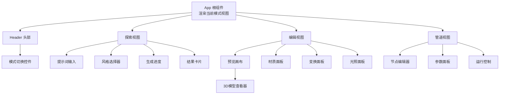
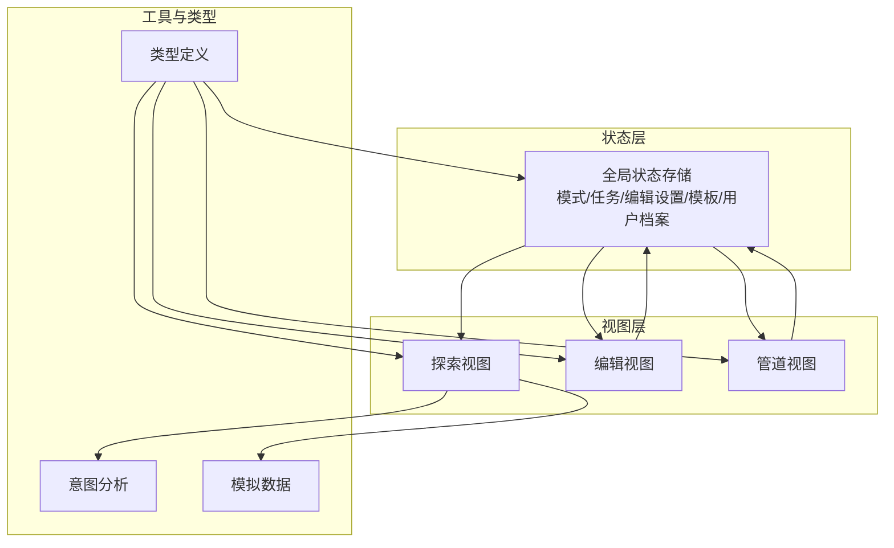
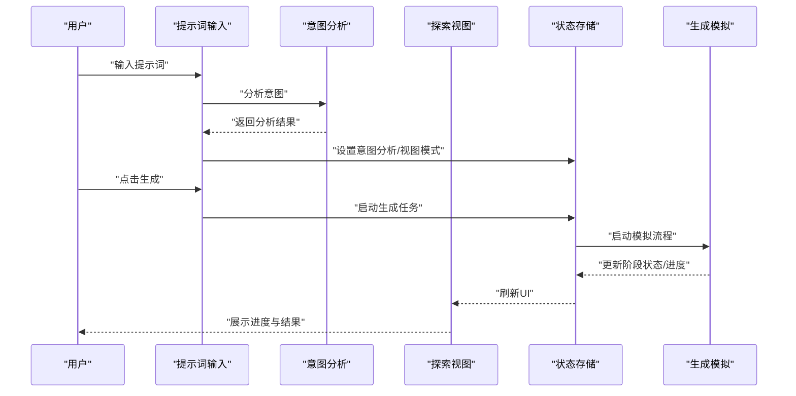
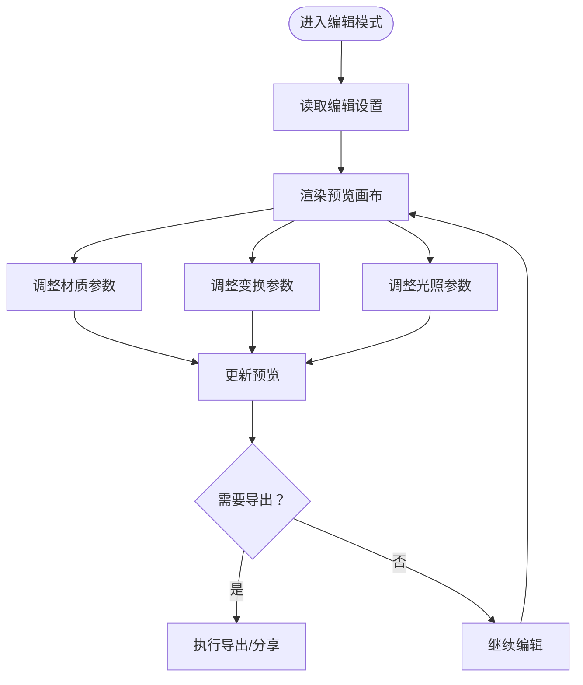
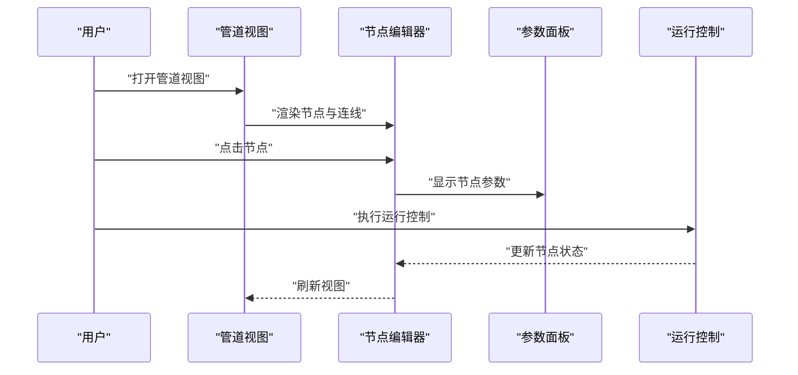
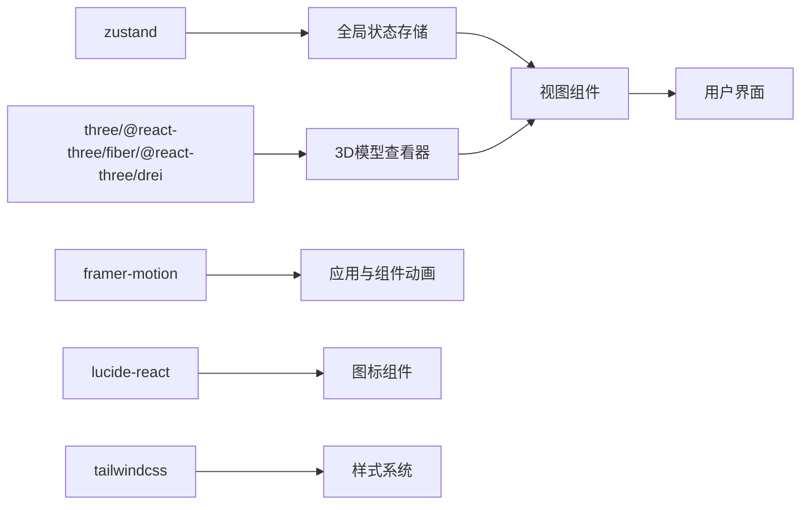

# 核心功能

<cite>
**本文引用的文件**
- [src/App.tsx](file://src/App.tsx)
- [src/store/useAppStore.ts](file://src/store/useAppStore.ts)
- [src/types/index.ts](file://src/types/index.ts)
- [src/components/Layout/ModeSwitch.tsx](file://src/components/Layout/ModeSwitch.tsx)
- [src/components/Explore/ExploreView.tsx](file://src/components/Explore/ExploreView.tsx)
- [src/components/Explore/PromptInput.tsx](file://src/components/Explore/PromptInput.tsx)
- [src/components/Explore/StyleSelector.tsx](file://src/components/Explore/StyleSelector.tsx)
- [src/components/Edit/EditView.tsx](file://src/components/Edit/EditView.tsx)
- [src/components/Edit/PreviewCanvas.tsx](file://src/components/Edit/PreviewCanvas.tsx)
- [src/components/Pipeline/PipelineView.tsx](file://src/components/Pipeline/PipelineView.tsx)
- [src/components/Pipeline/NodeEditor.tsx](file://src/components/Pipeline/NodeEditor.tsx)
- [src/components/Shared/ModelViewer.tsx](file://src/components/Shared/ModelViewer.tsx)
- [src/utils/intentDetector.ts](file://src/utils/intentDetector.ts)
- [src/utils/mockData.ts](file://src/utils/mockData.ts)
- [package.json](file://package.json)
</cite>

## 目录
1. [简介](#简介)
2. [项目结构](#项目结构)
3. [核心组件](#核心组件)
4. [架构总览](#架构总览)
5. [详细组件分析](#详细组件分析)
6. [依赖分析](#依赖分析)
7. [性能考虑](#性能考虑)
8. [故障排查指南](#故障排查指南)
9. [结论](#结论)
10. [附录](#附录)

## 简介
本文件面向3D模型代理平台的核心功能，系统性梳理三大功能模式：探索模式（AI生成）、编辑模式（3D模型编辑）与管道模式（高级定制）。文档从设计理念、用户工作流、核心组件与数据流等维度进行深入解析，并结合可视化图表帮助不同背景的读者快速理解与上手。

## 项目结构
项目采用以功能域划分的组织方式，核心入口在应用根组件中根据当前模式动态渲染对应视图；状态管理集中于全局存储；类型定义统一在类型模块中；各模式下的子组件按职责拆分，配合共享组件实现复用。

**图表来源**
- [src/App.tsx:10-32](file://src/App.tsx#L10-L32)
- [src/components/Layout/ModeSwitch.tsx:18-81](file://src/components/Layout/ModeSwitch.tsx#L18-L81)
- [src/components/Explore/ExploreView.tsx:11-262](file://src/components/Explore/ExploreView.tsx#L11-L262)
- [src/components/Edit/EditView.tsx:9-158](file://src/components/Edit/EditView.tsx#L9-L158)
- [src/components/Pipeline/PipelineView.tsx:9-167](file://src/components/Pipeline/PipelineView.tsx#L9-L167)

**章节来源**
- [src/App.tsx:10-32](file://src/App.tsx#L10-L32)
- [src/components/Layout/ModeSwitch.tsx:18-81](file://src/components/Layout/ModeSwitch.tsx#L18-L81)

## 核心组件
- 应用根组件：依据当前模式渲染对应视图，负责顶层布局与背景粒子效果。
- 全局状态存储：统一管理模式、生成任务、编辑设置、模板、用户等级与通知等。
- 类型系统：定义模式、生成任务、编辑设置、Agent步骤、参数与用户档案等核心数据结构。
- 模式切换控件：支持按使用次数解锁不同模式，提供交互反馈与提示。
- 探索视图：包含提示词输入、风格选择、生成进度与结果卡片，支持专业模式下显示Agent步骤与技术细节。
- 编辑视图：提供材质、变换、光照等实时编辑能力，支持简单/专业两种视图模式。
- 管道视图：以线性或节点图形式展示Agent流程，支持参数配置与运行控制。
- 3D模型查看器：基于Three.js与React Three Fiber实现可交互的3D预览。

**章节来源**
- [src/store/useAppStore.ts:50-98](file://src/store/useAppStore.ts#L50-L98)
- [src/types/index.ts:1-160](file://src/types/index.ts#L1-L160)
- [src/components/Layout/ModeSwitch.tsx:8-12](file://src/components/Layout/ModeSwitch.tsx#L8-L12)
- [src/components/Explore/ExploreView.tsx:11-262](file://src/components/Explore/ExploreView.tsx#L11-L262)
- [src/components/Edit/EditView.tsx:9-158](file://src/components/Edit/EditView.tsx#L9-L158)
- [src/components/Pipeline/PipelineView.tsx:9-167](file://src/components/Pipeline/PipelineView.tsx#L9-L167)
- [src/components/Shared/ModelViewer.tsx:136-155](file://src/components/Shared/ModelViewer.tsx#L136-L155)

## 架构总览
平台采用“模式即视图”的架构：通过全局状态驱动模式切换，每个模式内部自洽地管理其子组件与数据流。状态持久化通过本地存储实现，用户等级与功能解锁贯穿多个组件。

**图表来源**
- [src/store/useAppStore.ts:100-325](file://src/store/useAppStore.ts#L100-L325)
- [src/types/index.ts:1-160](file://src/types/index.ts#L1-L160)
- [src/utils/intentDetector.ts:77-147](file://src/utils/intentDetector.ts#L77-L147)
- [src/utils/mockData.ts:3-189](file://src/utils/mockData.ts#L3-L189)

## 详细组件分析

### 探索模式（AI生成）
设计理念：以“自然语言描述”为核心入口，结合风格预设与高级参数，驱动多阶段Agent流程生成3D模型。专业模式下提供Agent步骤与技术细节，帮助用户理解生成过程与产物质量。

- 用户工作流
  1) 输入提示词，触发意图分析与智能建议。
  2) 选择风格预设或进入专业模式配置高级参数。
  3) 启动生成，观察进度与Agent步骤。
  4) 查看结果卡片与技术详情（专业模式）。

- 关键组件
  - 提示词输入：支持回车提交、智能建议、首次访问引导与意图分析。
  - 风格选择器：提供多种风格预设供快速选择。
  - 生成进度：展示阶段进度与Agent步骤状态。
  - 结果卡片：呈现模型缩略图、下载与分享操作。

- 数据流与状态
  - 全局状态维护当前任务、任务历史、进度与Agent步骤。
  - 意图分析根据关键词与用户等级推断建议模式与视图模式，并计算置信度。
  - 生成流程通过模拟函数推进状态机，更新任务状态与步骤进度。

**图表来源**
- [src/components/Explore/PromptInput.tsx:8-160](file://src/components/Explore/PromptInput.tsx#L8-L160)
- [src/utils/intentDetector.ts:77-147](file://src/utils/intentDetector.ts#L77-L147)
- [src/store/useAppStore.ts:107-122](file://src/store/useAppStore.ts#L107-L122)
- [src/store/useAppStore.ts:327-367](file://src/store/useAppStore.ts#L327-L367)

**章节来源**
- [src/components/Explore/ExploreView.tsx:11-262](file://src/components/Explore/ExploreView.tsx#L11-L262)
- [src/components/Explore/PromptInput.tsx:8-160](file://src/components/Explore/PromptInput.tsx#L8-L160)
- [src/components/Explore/StyleSelector.tsx:11-60](file://src/components/Explore/StyleSelector.tsx#L11-L60)
- [src/store/useAppStore.ts:107-158](file://src/store/useAppStore.ts#L107-L158)
- [src/utils/intentDetector.ts:77-147](file://src/utils/intentDetector.ts#L77-L147)

### 编辑模式（3D模型编辑）
设计理念：提供实时材质、变换与光照编辑能力，支持简单/专业双视图模式，满足从新手到专家的不同需求。预览画布基于Three.js实现可交互3D场景。

- 用户工作流
  1) 在预览画布中查看当前模型。
  2) 在右侧面板调整材质（基础/专业）、变换（缩放、旋转）与光照。
  3) 实时预览修改效果，导出所需格式。

- 关键组件
  - 预览画布：承载3D模型查看器，提供缩放、旋转、重置等控制。
  - 材质面板：基础颜色与专业材质参数（金属度、粗糙度、自发光、法线强度）。
  - 变换面板：缩放与旋转控制。
  - 光照面板：多种光照预设与背景色设置。
  - 动作栏：导出、分享与跳转到管道视图（专家级别）。

- 数据流与状态
  - 编辑设置通过全局状态统一管理，修改即刻反映到预览画布。
  - 专业模式下加载完整的材质与光照参数面板。

**图表来源**
- [src/components/Edit/EditView.tsx:9-158](file://src/components/Edit/EditView.tsx#L9-L158)
- [src/components/Edit/PreviewCanvas.tsx:5-53](file://src/components/Edit/PreviewCanvas.tsx#L5-L53)
- [src/components/Shared/ModelViewer.tsx:136-155](file://src/components/Shared/ModelViewer.tsx#L136-L155)
- [src/store/useAppStore.ts:160-163](file://src/store/useAppStore.ts#L160-L163)

**章节来源**
- [src/components/Edit/EditView.tsx:9-158](file://src/components/Edit/EditView.tsx#L9-L158)
- [src/components/Edit/PreviewCanvas.tsx:5-53](file://src/components/Edit/PreviewCanvas.tsx#L5-L53)
- [src/components/Shared/ModelViewer.tsx:136-155](file://src/components/Shared/ModelViewer.tsx#L136-L155)
- [src/store/useAppStore.ts:160-163](file://src/store/useAppStore.ts#L160-L163)

### 管道模式（高级定制）
设计理念：以可视化节点图展示Agent流程，支持参数配置与运行控制，适合专家用户进行精细化定制与调试。

- 用户工作流
  1) 进入管道视图，查看当前任务的Agent步骤（线性或节点图）。
  2) 选择节点查看/编辑参数，连接/断开节点关系。
  3) 执行运行控制，观察步骤状态变化。

- 关键组件
  - 节点编辑器：绘制节点连线，根据状态显示不同颜色与动画。
  - 参数面板：针对选中节点显示与编辑参数。
  - 运行控制：启动/暂停/重置流程。

- 数据流与状态
  - 节点位置与连线通过SVG绘制，状态驱动颜色与光效。
  - 选中节点后联动参数面板，便于参数级联编辑。

**图表来源**
- [src/components/Pipeline/PipelineView.tsx:9-167](file://src/components/Pipeline/PipelineView.tsx#L9-L167)
- [src/components/Pipeline/NodeEditor.tsx:9-198](file://src/components/Pipeline/NodeEditor.tsx#L9-L198)

**章节来源**
- [src/components/Pipeline/PipelineView.tsx:9-167](file://src/components/Pipeline/PipelineView.tsx#L9-L167)
- [src/components/Pipeline/NodeEditor.tsx:9-198](file://src/components/Pipeline/NodeEditor.tsx#L9-L198)

## 依赖分析
- 状态管理：使用轻量状态库管理全局状态，避免跨层级传递复杂逻辑。
- 3D渲染：基于Three.js与React Three Fiber实现高性能3D渲染与交互。
- 动画与过渡：使用流畅动画库实现模式切换与面板展开收起。
- 图标与样式：统一图标库与Tailwind CSS实现一致的视觉风格。

**图表来源**
- [package.json:11-21](file://package.json#L11-L21)
- [src/components/Shared/ModelViewer.tsx:136-155](file://src/components/Shared/ModelViewer.tsx#L136-L155)
- [src/App.tsx:10-32](file://src/App.tsx#L10-L32)

**章节来源**
- [package.json:11-21](file://package.json#L11-L21)

## 性能考虑
- 渲染性能
  - 使用WebGL渲染3D场景，合理控制几何体复杂度与贴图分辨率。
  - 预览画布启用抗锯齿与透明背景，兼顾观感与性能。
- 状态更新
  - 全局状态按需更新，避免不必要的重渲染。
  - 使用记忆化与浅比较减少重复计算。
- 交互体验
  - 动画与过渡采用硬件加速，保证流畅度。
  - 面板展开/收起使用渐变与位移动画，降低卡顿感。

## 故障排查指南
- 生成任务未开始
  - 检查提示词是否为空或处于生成中状态。
  - 确认意图分析是否正确返回，必要时调整关键词。
- 生成进度停滞
  - 检查模拟流程是否正常推进，确认状态机推进逻辑。
  - 查看Agent步骤状态，定位阻塞环节。
- 编辑无响应
  - 确认编辑设置是否正确更新，检查全局状态写入。
  - 预览画布是否正常渲染，检查3D场景初始化。
- 管道视图空白
  - 确认当前任务是否存在Agent步骤，若无则先进行一次生成。
  - 检查节点坐标与连线映射，确保SVG绘制参数有效。

**章节来源**
- [src/store/useAppStore.ts:107-158](file://src/store/useAppStore.ts#L107-L158)
- [src/store/useAppStore.ts:327-367](file://src/store/useAppStore.ts#L327-L367)
- [src/components/Shared/ModelViewer.tsx:136-155](file://src/components/Shared/ModelViewer.tsx#L136-L155)
- [src/components/Pipeline/NodeEditor.tsx:18-77](file://src/components/Pipeline/NodeEditor.tsx#L18-L77)

## 结论
该平台围绕“探索—编辑—管道”三大模式构建了完整的3D模型生产链路：从自然语言到高质量模型，从实时编辑到流程定制，覆盖不同技能层级用户的需求。通过清晰的状态管理、模块化的组件设计与可视化的流程展示，平台在易用性与专业性之间取得良好平衡。

## 附录
- 实际使用示例
  - 探索模式：输入“可爱的3D小猫”，选择风格“概念设计”，在专业模式下微调CFG Scale与采样步数，启动生成并查看结果。
  - 编辑模式：在简单模式下快速更换基础颜色，在专业模式下精细调节金属度与粗糙度，实时预览效果并导出GLB。
  - 管道模式：在专家模式下查看Agent步骤，调整UV展开与拓扑优化参数，执行运行控制观察流程状态。
- 最佳实践
  - 新手优先使用简单模式，逐步过渡到专业模式。
  - 生成前明确风格与输出格式，利用智能建议提升效率。
  - 编辑阶段保持参数一致性，避免过度修改导致资源浪费。
  - 管道模式下建议先保存模板，便于复用与迭代。