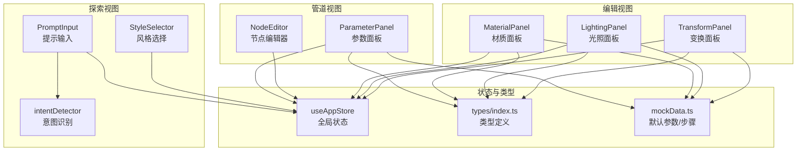
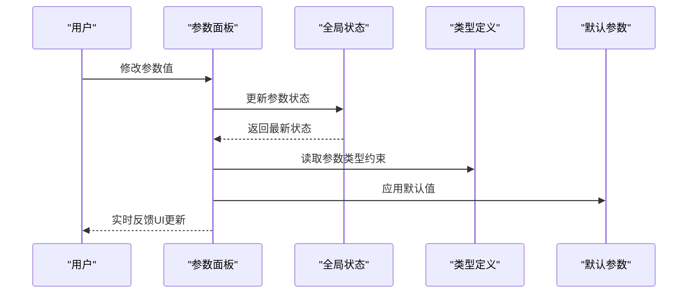
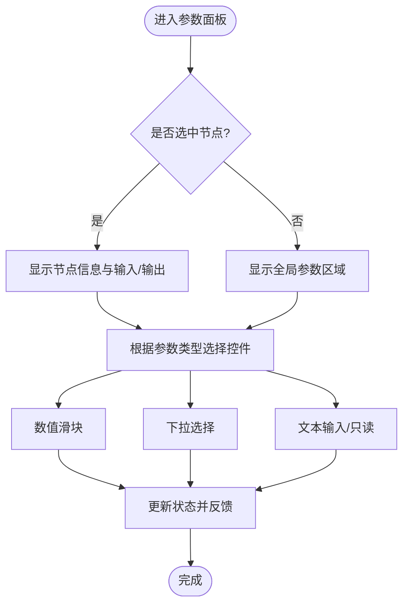
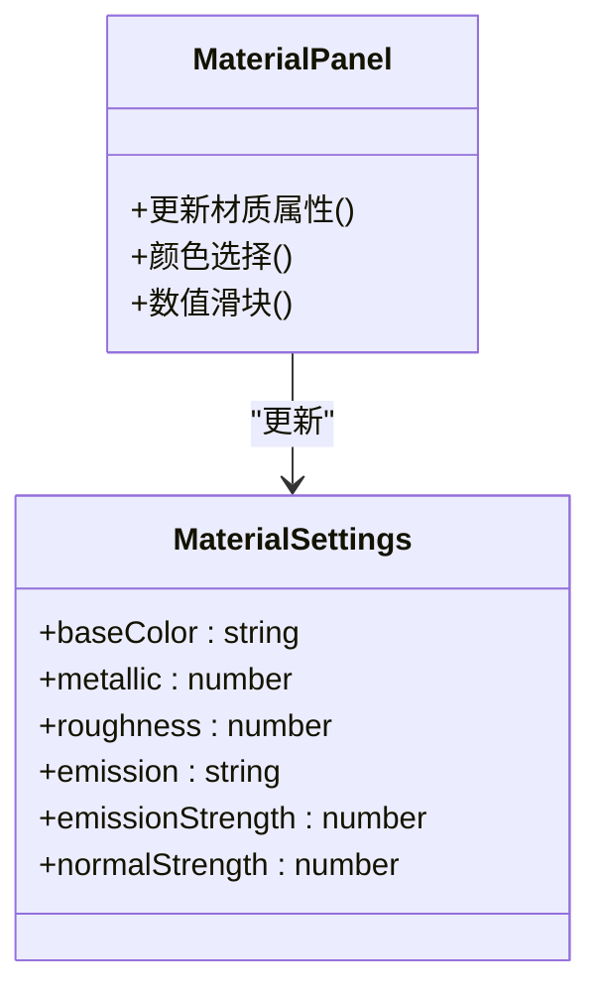
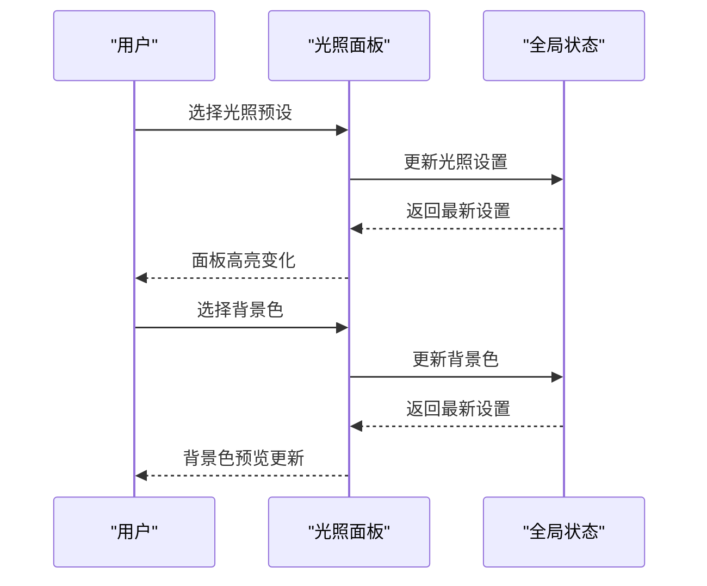
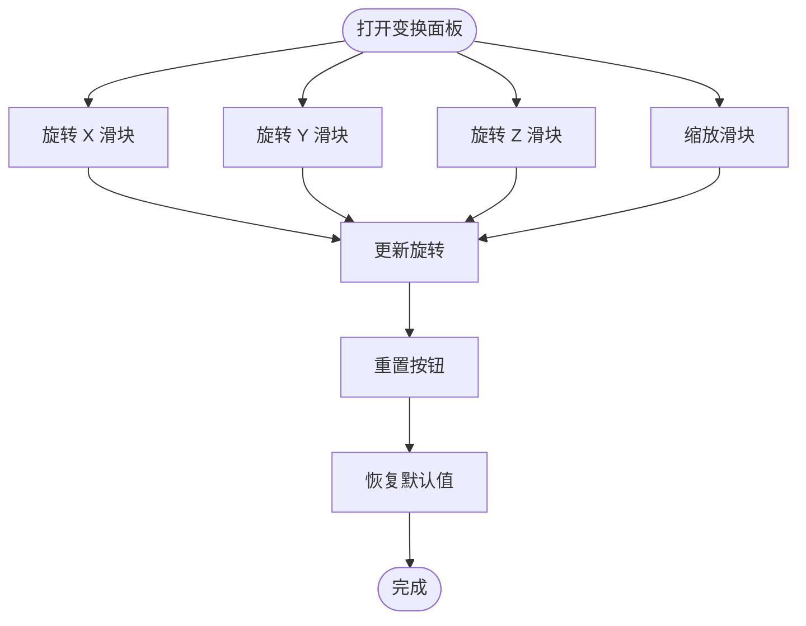
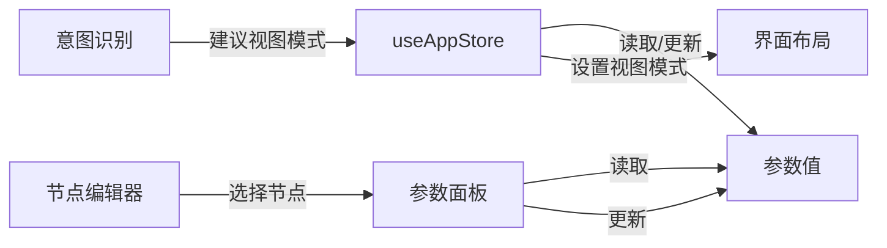
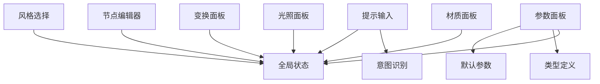

# 参数面板

<cite>
**本文引用的文件**
- [ParameterPanel.tsx](file://src/components/Pipeline/ParameterPanel.tsx)
- [index.ts](file://src/types/index.ts)
- [useAppStore.ts](file://src/store/useAppStore.ts)
- [mockData.ts](file://src/utils/mockData.ts)
- [MaterialPanel.tsx](file://src/components/Edit/MaterialPanel.tsx)
- [LightingPanel.tsx](file://src/components/Edit/LightingPanel.tsx)
- [TransformPanel.tsx](file://src/components/Edit/TransformPanel.tsx)
- [NodeEditor.tsx](file://src/components/Pipeline/NodeEditor.tsx)
- [PromptInput.tsx](file://src/components/Explore/PromptInput.tsx)
- [StyleSelector.tsx](file://src/components/Explore/StyleSelector.tsx)
- [intentDetector.ts](file://src/utils/intentDetector.ts)
</cite>

## 目录
1. [简介](#简介)
2. [项目结构](#项目结构)
3. [核心组件](#核心组件)
4. [架构总览](#架构总览)
5. [详细组件分析](#详细组件分析)
6. [依赖关系分析](#依赖关系分析)
7. [性能考量](#性能考量)
8. [故障排查指南](#故障排查指南)
9. [结论](#结论)
10. [附录](#附录)

## 简介
本文件围绕“参数面板”进行系统化技术文档编写，重点覆盖：
- 动态参数表单生成机制：如何根据 Agent 步骤类型自动匹配参数配置、输入控件的智能选择与验证规则应用
- 参数面板交互设计：参数修改的实时反馈、默认值处理与参数重置功能
- 输入控件实现：文本输入、数值调节、下拉选择、开关切换、颜色选择、文件上传等
- 状态管理与数据绑定：全局状态驱动的参数联动、视图模式适配
- 最佳实践：复杂参数的组织方式与用户体验优化
- 视图模式适配：在不同视图模式下的参数呈现策略

## 项目结构
参数面板主要分布在以下模块：
- 管道视图中的参数面板：负责展示与编辑当前选中节点或全局参数
- 编辑视图中的材质、光照、变换面板：提供更精细的参数控制
- 类型定义与默认参数：统一约束参数结构与默认值
- 状态管理：集中管理任务、参数、视图模式与用户偏好
- 智能提示与意图识别：为参数面板提供上下文感知的建议与默认值

图表来源
- [ParameterPanel.tsx:54-213](file://src/components/Pipeline/ParameterPanel.tsx#L54-L213)
- [NodeEditor.tsx:9-198](file://src/components/Pipeline/NodeEditor.tsx#L9-L198)
- [MaterialPanel.tsx:71-208](file://src/components/Edit/MaterialPanel.tsx#L71-L208)
- [LightingPanel.tsx:14-77](file://src/components/Edit/LightingPanel.tsx#L14-L77)
- [TransformPanel.tsx:29-101](file://src/components/Edit/TransformPanel.tsx#L29-L101)
- [useAppStore.ts:114-394](file://src/store/useAppStore.ts#L114-L394)
- [index.ts:42-64](file://src/types/index.ts#L42-L64)
- [mockData.ts:3-27](file://src/utils/mockData.ts#L3-L27)
- [PromptInput.tsx:8-160](file://src/components/Explore/PromptInput.tsx#L8-L160)
- [StyleSelector.tsx:11-60](file://src/components/Explore/StyleSelector.tsx#L11-L60)
- [intentDetector.ts:77-147](file://src/utils/intentDetector.ts#L77-L147)

章节来源
- [ParameterPanel.tsx:54-213](file://src/components/Pipeline/ParameterPanel.tsx#L54-L213)
- [useAppStore.ts:114-394](file://src/store/useAppStore.ts#L114-L394)
- [index.ts:42-64](file://src/types/index.ts#L42-L64)
- [mockData.ts:3-27](file://src/utils/mockData.ts#L3-L27)

## 核心组件
- 参数面板（管道视图）：根据当前选中节点或全局任务显示对应参数，支持滑块、下拉选择等控件，并提供节点状态与进度可视化
- 材质面板（编辑视图）：提供颜色选择、数值滑块、发光强度等材质参数的实时调整
- 光照面板（编辑视图）：提供光照预设与背景色选择
- 变换面板（编辑视图）：提供旋转与缩放的数值滑块及重置功能
- 全局状态与类型：统一管理任务参数、视图模式、用户偏好与默认值

章节来源
- [ParameterPanel.tsx:54-213](file://src/components/Pipeline/ParameterPanel.tsx#L54-L213)
- [MaterialPanel.tsx:71-208](file://src/components/Edit/MaterialPanel.tsx#L71-L208)
- [LightingPanel.tsx:14-77](file://src/components/Edit/LightingPanel.tsx#L14-L77)
- [TransformPanel.tsx:29-101](file://src/components/Edit/TransformPanel.tsx#L29-L101)
- [useAppStore.ts:114-394](file://src/store/useAppStore.ts#L114-L394)
- [index.ts:42-64](file://src/types/index.ts#L42-L64)

## 架构总览
参数面板的架构以“状态驱动 + 类型约束 + 视图模式适配”为核心：
- 状态驱动：通过全局状态管理当前任务、参数、节点选择与视图模式
- 类型约束：使用强类型定义确保参数结构一致，便于动态渲染与默认值填充
- 视图模式适配：根据用户级别与意图识别结果，自动推荐专业/简单视图模式

图表来源
- [ParameterPanel.tsx:54-213](file://src/components/Pipeline/ParameterPanel.tsx#L54-L213)
- [useAppStore.ts:114-394](file://src/store/useAppStore.ts#L114-L394)
- [index.ts:42-64](file://src/types/index.ts#L42-L64)
- [mockData.ts:3-27](file://src/utils/mockData.ts#L3-L27)

## 详细组件分析

### 参数面板（管道视图）
- 动态参数表单生成机制
  - 节点级参数：当存在选中节点时，显示该节点的名称、状态、进度、Agent 类型、耗时、连接数以及输入/输出键值对
  - 全局参数：当未选中节点时，显示全局参数区域，包含 CFG Scale、采样步数、Seed、拓扑类型、贴图分辨率、面数预算、UV 展开方式、输出格式等
- 输入控件智能选择
  - 数值滑块：用于连续范围参数（如 CFG Scale、采样步数、面数预算），支持最小值、最大值、步长与百分比进度条
  - 下拉选择：用于离散枚举参数（如拓扑类型、贴图分辨率、UV 展开方式、输出格式）
  - 文本输入：用于只读 Seed 显示与可读写文本字段（当前示例中 Seed 为只读）
- 验证规则与默认值
  - 默认值来自默认参数集合；滑块控件在渲染时应用默认值
  - 当前实现未显式添加输入校验逻辑，建议在实际业务中增加范围校验与必填项提示
- 交互设计
  - 实时反馈：滑块与下拉框变更后立即触发状态更新，UI 即时反映
  - 参数重置：当前全局参数区未提供一键重置按钮，可在后续版本中增加“重置为默认值”的操作

图表来源
- [ParameterPanel.tsx:54-213](file://src/components/Pipeline/ParameterPanel.tsx#L54-L213)

章节来源
- [ParameterPanel.tsx:54-213](file://src/components/Pipeline/ParameterPanel.tsx#L54-L213)
- [mockData.ts:3-27](file://src/utils/mockData.ts#L3-L27)
- [index.ts:42-64](file://src/types/index.ts#L42-L64)

### 材质面板（编辑视图）
- 控件类型
  - 颜色选择：基础色与自发光色，支持十六进制输入与颜色预览
  - 数值滑块：金属度、粗糙度、自发光强度、法线贴图强度，支持小数步长与动态阴影效果
- 交互设计
  - 实时反馈：滑块与颜色选择变更后即时更新材质设置
  - 展开/收起：面板支持折叠，提升空间利用率
- 默认值与范围
  - 默认值来源于默认编辑设置；滑块范围与步长在组件内定义

图表来源
- [MaterialPanel.tsx:71-208](file://src/components/Edit/MaterialPanel.tsx#L71-L208)
- [index.ts:84-91](file://src/types/index.ts#L84-L91)
- [mockData.ts:14-27](file://src/utils/mockData.ts#L14-L27)

章节来源
- [MaterialPanel.tsx:71-208](file://src/components/Edit/MaterialPanel.tsx#L71-L208)
- [index.ts:84-91](file://src/types/index.ts#L84-L91)
- [mockData.ts:14-27](file://src/utils/mockData.ts#L14-L27)

### 光照面板（编辑视图）
- 控件类型
  - 预设按钮：提供四种光照预设（影棚、室外、戏剧、中性），点击即切换
  - 颜色选择：背景色选择
- 交互设计
  - 预设高亮：当前选中预设具有高亮边框与阴影
  - 实时反馈：切换预设或背景色后即时生效

图表来源
- [LightingPanel.tsx:14-77](file://src/components/Edit/LightingPanel.tsx#L14-L77)
- [useAppStore.ts:174-177](file://src/store/useAppStore.ts#L174-L177)

章节来源
- [LightingPanel.tsx:14-77](file://src/components/Edit/LightingPanel.tsx#L14-L77)
- [useAppStore.ts:174-177](file://src/store/useAppStore.ts#L174-L177)

### 变换面板（编辑视图）
- 控件类型
  - 数值滑块：X/Y/Z 旋转角度与缩放比例
  - 重置按钮：一键恢复到默认旋转与缩放
- 交互设计
  - 实时反馈：滑块变更即时更新旋转与缩放
  - 参数重置：点击重置按钮恢复默认值

图表来源
- [TransformPanel.tsx:29-101](file://src/components/Edit/TransformPanel.tsx#L29-L101)
- [mockData.ts:14-27](file://src/utils/mockData.ts#L14-L27)

章节来源
- [TransformPanel.tsx:29-101](file://src/components/Edit/TransformPanel.tsx#L29-L101)
- [mockData.ts:14-27](file://src/utils/mockData.ts#L14-L27)

### 参数状态管理与数据绑定
- 全局状态
  - 参数存储于当前任务对象中，随任务生命周期更新
  - 通过状态钩子读取与更新参数，保证组件间共享同一份数据
- 数据绑定
  - 参数面板通过状态读取当前参数值，控件变更触发状态更新
  - 节点编辑器与参数面板联动：节点选择变化影响参数面板内容
- 视图模式适配
  - 根据用户级别与意图识别结果，自动推荐专业/简单视图模式
  - 探索视图提供风格预设与智能建议，编辑视图提供精细化参数控制

图表来源
- [useAppStore.ts:114-394](file://src/store/useAppStore.ts#L114-L394)
- [ParameterPanel.tsx:54-213](file://src/components/Pipeline/ParameterPanel.tsx#L54-L213)
- [NodeEditor.tsx:9-198](file://src/components/Pipeline/NodeEditor.tsx#L9-L198)
- [PromptInput.tsx:8-160](file://src/components/Explore/PromptInput.tsx#L8-L160)
- [intentDetector.ts:77-147](file://src/utils/intentDetector.ts#L77-L147)

章节来源
- [useAppStore.ts:114-394](file://src/store/useAppStore.ts#L114-L394)
- [ParameterPanel.tsx:54-213](file://src/components/Pipeline/ParameterPanel.tsx#L54-L213)
- [NodeEditor.tsx:9-198](file://src/components/Pipeline/NodeEditor.tsx#L9-L198)
- [PromptInput.tsx:8-160](file://src/components/Explore/PromptInput.tsx#L8-L160)
- [intentDetector.ts:77-147](file://src/utils/intentDetector.ts#L77-L147)

## 依赖关系分析
- 参数面板依赖全局状态与类型定义，确保参数结构一致与默认值可用
- 编辑面板依赖全局状态更新材质、光照与变换设置
- 节点编辑器与参数面板通过节点选择建立耦合，实现参数内容的动态切换
- 意图识别与风格选择为参数面板提供上下文感知的建议与默认值

图表来源
- [ParameterPanel.tsx:54-213](file://src/components/Pipeline/ParameterPanel.tsx#L54-L213)
- [MaterialPanel.tsx:71-208](file://src/components/Edit/MaterialPanel.tsx#L71-L208)
- [LightingPanel.tsx:14-77](file://src/components/Edit/LightingPanel.tsx#L14-L77)
- [TransformPanel.tsx:29-101](file://src/components/Edit/TransformPanel.tsx#L29-L101)
- [NodeEditor.tsx:9-198](file://src/components/Pipeline/NodeEditor.tsx#L9-L198)
- [PromptInput.tsx:8-160](file://src/components/Explore/PromptInput.tsx#L8-L160)
- [StyleSelector.tsx:11-60](file://src/components/Explore/StyleSelector.tsx#L11-L60)
- [intentDetector.ts:77-147](file://src/utils/intentDetector.ts#L77-L147)
- [useAppStore.ts:114-394](file://src/store/useAppStore.ts#L114-L394)
- [index.ts:42-64](file://src/types/index.ts#L42-L64)
- [mockData.ts:3-27](file://src/utils/mockData.ts#L3-L27)

章节来源
- [ParameterPanel.tsx:54-213](file://src/components/Pipeline/ParameterPanel.tsx#L54-L213)
- [MaterialPanel.tsx:71-208](file://src/components/Edit/MaterialPanel.tsx#L71-L208)
- [LightingPanel.tsx:14-77](file://src/components/Edit/LightingPanel.tsx#L14-L77)
- [TransformPanel.tsx:29-101](file://src/components/Edit/TransformPanel.tsx#L29-L101)
- [NodeEditor.tsx:9-198](file://src/components/Pipeline/NodeEditor.tsx#L9-L198)
- [PromptInput.tsx:8-160](file://src/components/Explore/PromptInput.tsx#L8-L160)
- [StyleSelector.tsx:11-60](file://src/components/Explore/StyleSelector.tsx#L11-L60)
- [intentDetector.ts:77-147](file://src/utils/intentDetector.ts#L77-L147)
- [useAppStore.ts:114-394](file://src/store/useAppStore.ts#L114-L394)
- [index.ts:42-64](file://src/types/index.ts#L42-L64)
- [mockData.ts:3-27](file://src/utils/mockData.ts#L3-L27)

## 性能考量
- 渲染优化
  - 使用动画库进行面板展开/收起与数值滑块的渐变过渡，避免频繁重排
  - 滑块进度条采用内联样式计算百分比，减少额外计算开销
- 状态更新
  - 通过状态钩子集中管理参数更新，避免重复渲染
  - 在编辑面板中，分组更新材质属性，减少不必要的状态拆分
- 视图模式切换
  - 基于用户级别与意图识别结果自动切换视图模式，降低用户决策成本

## 故障排查指南
- 参数未更新
  - 检查控件是否正确绑定状态更新函数
  - 确认全局状态中参数字段名与类型定义一致
- 滑块范围异常
  - 核对最小值、最大值与步长设置，确保符合业务范围
- 下拉选项不显示
  - 确认选项数组非空且值与当前参数值匹配
- 视图模式未生效
  - 检查意图识别返回的视图模式与当前用户级别是否一致
  - 确认视图模式设置函数被正确调用

章节来源
- [ParameterPanel.tsx:54-213](file://src/components/Pipeline/ParameterPanel.tsx#L54-L213)
- [MaterialPanel.tsx:71-208](file://src/components/Edit/MaterialPanel.tsx#L71-L208)
- [LightingPanel.tsx:14-77](file://src/components/Edit/LightingPanel.tsx#L14-L77)
- [TransformPanel.tsx:29-101](file://src/components/Edit/TransformPanel.tsx#L29-L101)
- [useAppStore.ts:114-394](file://src/store/useAppStore.ts#L114-L394)
- [intentDetector.ts:77-147](file://src/utils/intentDetector.ts#L77-L147)

## 结论
参数面板通过“状态驱动 + 类型约束 + 视图模式适配”的架构，实现了从探索到编辑再到管道视图的参数控制闭环。当前实现提供了直观的滑块与下拉控件，具备良好的实时反馈能力；建议在后续版本中补充参数校验、一键重置与更丰富的输入控件（如文件上传、开关切换），以进一步提升复杂参数的组织能力与用户体验。

## 附录
- 参数类型与默认值参考
  - 全局参数类型与默认值定义见类型文件与默认参数集合
- 视图模式与用户级别
  - 意图识别根据关键词与用户级别推断视图模式，支持自动切换与建议提示

章节来源
- [index.ts:42-64](file://src/types/index.ts#L42-L64)
- [mockData.ts:3-27](file://src/utils/mockData.ts#L3-L27)
- [intentDetector.ts:77-147](file://src/utils/intentDetector.ts#L77-L147)