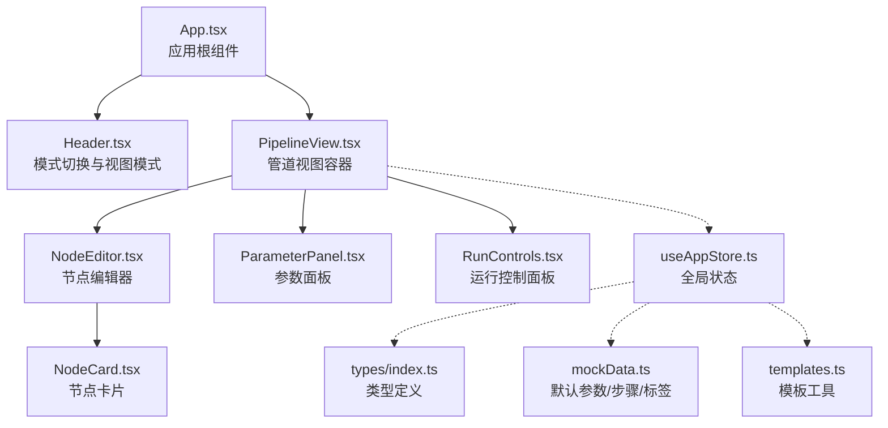
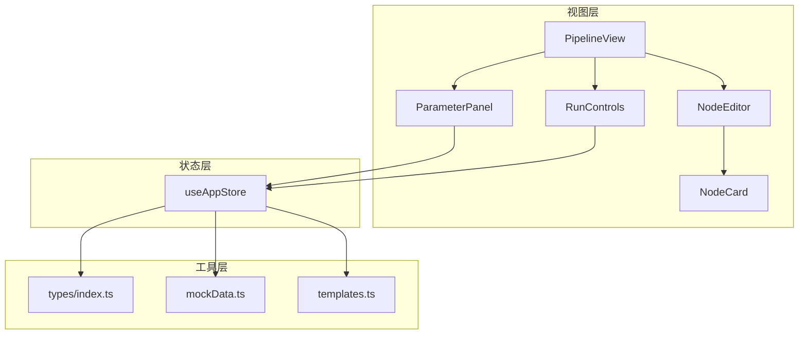
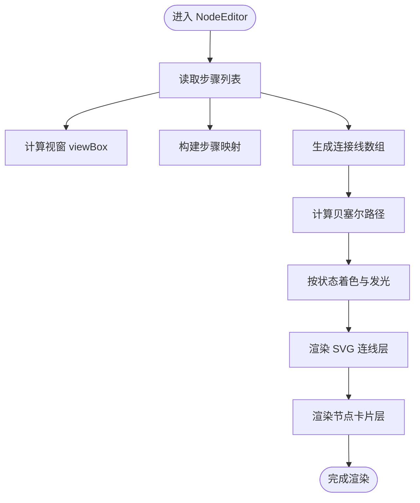
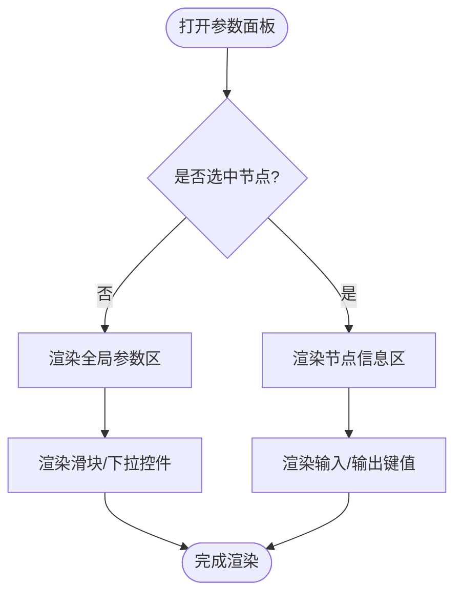
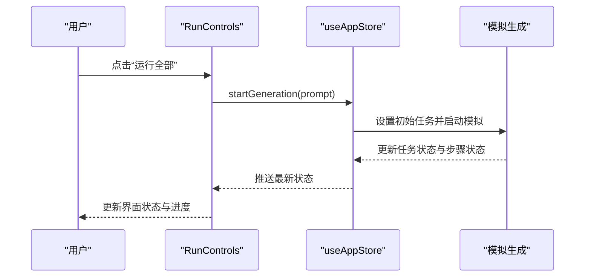
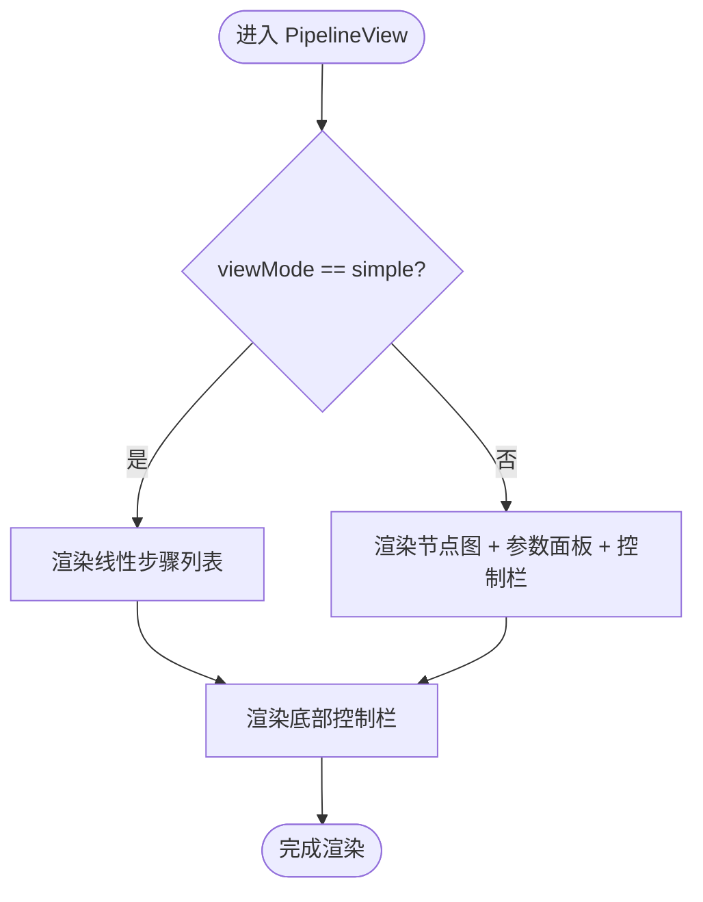
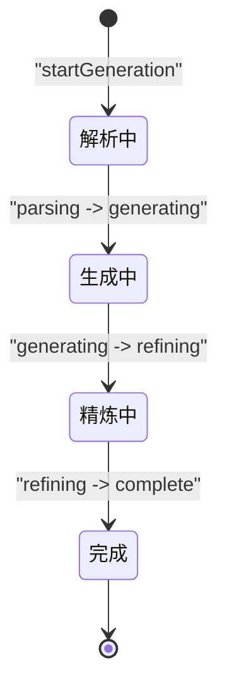
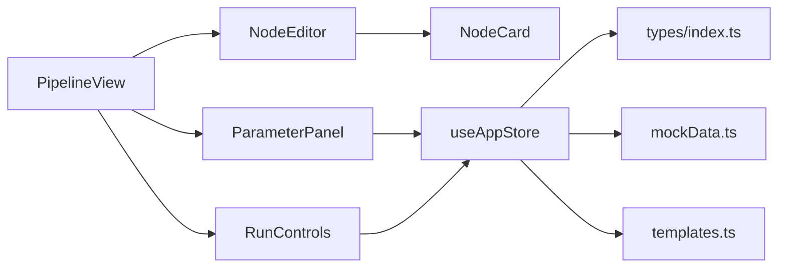

# 管道模式（高级定制）

<cite>
**本文引用的文件列表**
- [App.tsx](file://src/App.tsx)
- [Header.tsx](file://src/components/Layout/Header.tsx)
- [PipelineView.tsx](file://src/components/Pipeline/PipelineView.tsx)
- [NodeEditor.tsx](file://src/components/Pipeline/NodeEditor.tsx)
- [NodeCard.tsx](file://src/components/Pipeline/NodeCard.tsx)
- [ParameterPanel.tsx](file://src/components/Pipeline/ParameterPanel.tsx)
- [RunControls.tsx](file://src/components/Pipeline/RunControls.tsx)
- [useAppStore.ts](file://src/store/useAppStore.ts)
- [mockData.ts](file://src/utils/mockData.ts)
- [templates.ts](file://src/utils/templates.ts)
- [index.ts](file://src/types/index.ts)
</cite>

## 目录
1. [简介](#简介)
2. [项目结构](#项目结构)
3. [核心组件](#核心组件)
4. [架构总览](#架构总览)
5. [组件详解](#组件详解)
6. [依赖关系分析](#依赖关系分析)
7. [性能考量](#性能考量)
8. [故障排查指南](#故障排查指南)
9. [结论](#结论)
10. [附录](#附录)

## 简介
本文件系统性阐述“管道模式”的可视化编辑与参数配置能力，覆盖以下主题：
- 可视化节点编辑器：Agent步骤的添加、删除、重新排列与连接关系
- 节点卡片交互：步骤信息显示、状态指示与参数配置入口
- 参数面板动态表单：不同参数类型的输入控件与验证规则
- 运行控制面板：流程执行、暂停、重置与调试模式
- 管道定制最佳实践：复杂生成流程设计与性能优化策略
- 专业特性与高级用户场景：模板保存、导出中间产物、Blender集成等

## 项目结构
管道模式位于 Pipeline 子目录，采用“视图容器 + 组件拆分 + 全局状态”的组织方式：
- 视图容器：PipelineView 负责布局与模式切换（简洁/专业）
- 编辑器层：NodeEditor 渲染节点与连线，支持缩放与自适应视窗
- 节点卡片：NodeCard 展示步骤状态、进度与类型标识
- 参数面板：ParameterPanel 动态生成节点/全局参数表单
- 控制面板：RunControls 提供运行、单步、停止、导出等操作
- 全局状态：useAppStore 管理任务、选中节点、视图模式、用户等级等
- 类型定义：types/index.ts 定义任务、步骤、参数、Agent类型等核心数据结构



图表来源
- [App.tsx:10-32](file://src/App.tsx#L10-L32)
- [Header.tsx:30-61](file://src/components/Layout/Header.tsx#L30-L61)
- [PipelineView.tsx:87-167](file://src/components/Pipeline/PipelineView.tsx#L87-L167)
- [NodeEditor.tsx:9-198](file://src/components/Pipeline/NodeEditor.tsx#L9-L198)
- [NodeCard.tsx:13-92](file://src/components/Pipeline/NodeCard.tsx#L13-L92)
- [ParameterPanel.tsx:54-213](file://src/components/Pipeline/ParameterPanel.tsx#L54-L213)
- [RunControls.tsx:6-92](file://src/components/Pipeline/RunControls.tsx#L6-L92)
- [useAppStore.ts:100-367](file://src/store/useAppStore.ts#L100-L367)
- [mockData.ts:74-188](file://src/utils/mockData.ts#L74-L188)
- [templates.ts:4-43](file://src/utils/templates.ts#L4-L43)
- [index.ts:13-82](file://src/types/index.ts#L13-L82)

章节来源
- [App.tsx:10-32](file://src/App.tsx#L10-L32)
- [Header.tsx:30-61](file://src/components/Layout/Header.tsx#L30-L61)
- [PipelineView.tsx:9-167](file://src/components/Pipeline/PipelineView.tsx#L9-L167)

## 核心组件
- 管道视图容器（PipelineView）：根据视图模式（简单/专业）渲染线性步骤或节点图，并提供底部运行控制面板
- 节点编辑器（NodeEditor）：基于步骤位置与连接关系绘制贝塞尔连线，支持缩放与自适应视窗；点击节点触发选中
- 节点卡片（NodeCard）：展示步骤名称、状态点、进度条、类型标签与耗时；选中态带高亮边框
- 参数面板（ParameterPanel）：按节点/全局两种模式渲染参数表单，包含滑块、下拉选择、只读数值与随机种子等
- 运行控制面板（RunControls）：提供“运行全部”“单步执行”“停止”“保存为模板”“导出中间产物”“在Blender中打开”等操作
- 全局状态（useAppStore）：管理当前任务、选中节点、视图模式、用户等级、模板集合与模拟生成流程
- 类型定义（types/index.ts）：统一的任务、步骤、参数、Agent类型与模板结构
- 工具函数（mockData.ts、templates.ts）：默认参数、Agent步骤、类型标签与模板创建/应用

章节来源
- [PipelineView.tsx:9-167](file://src/components/Pipeline/PipelineView.tsx#L9-L167)
- [NodeEditor.tsx:9-198](file://src/components/Pipeline/NodeEditor.tsx#L9-L198)
- [NodeCard.tsx:13-92](file://src/components/Pipeline/NodeCard.tsx#L13-L92)
- [ParameterPanel.tsx:54-213](file://src/components/Pipeline/ParameterPanel.tsx#L54-L213)
- [RunControls.tsx:6-92](file://src/components/Pipeline/RunControls.tsx#L6-L92)
- [useAppStore.ts:100-367](file://src/store/useAppStore.ts#L100-L367)
- [index.ts:13-82](file://src/types/index.ts#L13-L82)
- [mockData.ts:74-188](file://src/utils/mockData.ts#L74-L188)
- [templates.ts:4-43](file://src/utils/templates.ts#L4-L43)

## 架构总览
管道模式采用“视图容器 + 多子组件 + 全局状态”的分层架构：
- 视图容器负责布局与模式切换，内部组合编辑器、参数面板与控制面板
- 编辑器负责节点与连线渲染，依赖步骤数据与类型标签
- 参数面板根据选中节点或全局参数动态生成表单控件
- 控制面板驱动任务生命周期与外部集成
- 全局状态集中管理任务、用户等级、模板与模拟流程



图表来源
- [PipelineView.tsx:87-167](file://src/components/Pipeline/PipelineView.tsx#L87-L167)
- [NodeEditor.tsx:9-198](file://src/components/Pipeline/NodeEditor.tsx#L9-L198)
- [NodeCard.tsx:13-92](file://src/components/Pipeline/NodeCard.tsx#L13-L92)
- [ParameterPanel.tsx:54-213](file://src/components/Pipeline/ParameterPanel.tsx#L54-L213)
- [RunControls.tsx:6-92](file://src/components/Pipeline/RunControls.tsx#L6-L92)
- [useAppStore.ts:100-367](file://src/store/useAppStore.ts#L100-L367)
- [index.ts:13-82](file://src/types/index.ts#L13-L82)
- [mockData.ts:74-188](file://src/utils/mockData.ts#L74-L188)
- [templates.ts:4-43](file://src/utils/templates.ts#L4-L43)

## 组件详解

### 节点编辑器（NodeEditor）
- 自适应视窗与缩放：通过步骤坐标计算最小包围盒，设置SVG视窗，支持节点缩放与内边距
- 连接线生成：遍历每个步骤及其目标节点，计算贝塞尔曲线路径，按起止状态着色与发光效果
- 交互行为：点击节点触发选中，选中态节点带有高亮边框与阴影
- 动画与视觉：节点入场动画、连线流动动画、状态指示颜色与光晕



图表来源
- [NodeEditor.tsx:18-77](file://src/components/Pipeline/NodeEditor.tsx#L18-L77)
- [NodeEditor.tsx:134-172](file://src/components/Pipeline/NodeEditor.tsx#L134-L172)
- [NodeEditor.tsx:176-194](file://src/components/Pipeline/NodeEditor.tsx#L176-L194)

章节来源
- [NodeEditor.tsx:9-198](file://src/components/Pipeline/NodeEditor.tsx#L9-L198)

### 节点卡片（NodeCard）
- 信息展示：名称、状态点、进度条、类型标签、耗时
- 选中态样式：高亮边框、阴影与布局动画
- 类型配色：依据类型标签颜色设置左侧强调条与进度条颜色
- 状态指示：完成（绿色）、运行中（蓝色脉冲）、错误（红色）、等待（灰色）

```mermaid
classDiagram
class NodeCard {
+props.step : AgentStep
+props.isSelected : boolean
+props.onClick() : void
+render()
}
class AgentStep {
+string id
+string name
+AgentType type
+status : "pending"|"running"|"complete"|"error"
+number progress
+number duration?
+Record~string,any~ inputs
+Record~string,any~ outputs
+position : {x,y}
+string[] connections
}
NodeCard --> AgentStep : "接收并展示"
```

图表来源
- [NodeCard.tsx:13-92](file://src/components/Pipeline/NodeCard.tsx#L13-L92)
- [index.ts:53-64](file://src/types/index.ts#L53-L64)

章节来源
- [NodeCard.tsx:13-92](file://src/components/Pipeline/NodeCard.tsx#L13-L92)

### 参数面板（ParameterPanel）
- 节点参数区：展示当前选中节点的状态、进度、类型、耗时、连接数量与输入输出键值
- 全局参数区：包含 CFG Scale、采样步数、Seed（只读+随机按钮）、拓扑类型、贴图分辨率、面数预算、UV展开方式、输出格式等
- 动态表单控件：滑块（带百分比背景）、下拉选择（带箭头图标）、只读数值与按钮
- 交互：当前未实现参数变更回调，仅用于展示与占位



图表来源
- [ParameterPanel.tsx:54-213](file://src/components/Pipeline/ParameterPanel.tsx#L54-L213)
- [mockData.ts:3-12](file://src/utils/mockData.ts#L3-L12)

章节来源
- [ParameterPanel.tsx:54-213](file://src/components/Pipeline/ParameterPanel.tsx#L54-L213)

### 运行控制面板（RunControls）
- 主要按钮：“运行全部”（禁用运行中）、“单步执行”、“停止”
- 状态显示：运行中显示当前步骤名与整体进度；完成后显示完成状态；空闲显示就绪提示
- 专家功能：保存为模板（弹窗输入名称）、导出中间产物、在Blender中打开
- 用户等级：仅专家用户可见“保存为模板”按钮



图表来源
- [RunControls.tsx:6-92](file://src/components/Pipeline/RunControls.tsx#L6-L92)
- [useAppStore.ts:107-122](file://src/store/useAppStore.ts#L107-L122)
- [useAppStore.ts:327-367](file://src/store/useAppStore.ts#L327-L367)

章节来源
- [RunControls.tsx:6-92](file://src/components/Pipeline/RunControls.tsx#L6-L92)
- [useAppStore.ts:100-367](file://src/store/useAppStore.ts#L100-L367)

### 管道视图容器（PipelineView）
- 简洁模式：线性步骤列表，显示状态图标与文字描述
- 专业模式：节点图 + 参数面板 + 底部控制栏，支持网格背景与空状态提示
- 视图模式切换：由 Header 中的视图模式切换按钮控制



图表来源
- [PipelineView.tsx:9-167](file://src/components/Pipeline/PipelineView.tsx#L9-L167)
- [Header.tsx:30-61](file://src/components/Layout/Header.tsx#L30-L61)

章节来源
- [PipelineView.tsx:9-167](file://src/components/Pipeline/PipelineView.tsx#L9-L167)

### 全局状态与模拟流程（useAppStore）
- 任务管理：创建任务、更新状态、完成任务并写入历史
- 视图模式：记录用户偏好并持久化
- 用户等级：根据使用次数升级，解锁专家功能
- 模板管理：本地存储模板集合，支持增删改查
- 模拟生成：按阶段推进任务状态与步骤状态，驱动UI更新



图表来源
- [useAppStore.ts:107-122](file://src/store/useAppStore.ts#L107-L122)
- [useAppStore.ts:327-367](file://src/store/useAppStore.ts#L327-L367)

章节来源
- [useAppStore.ts:100-367](file://src/store/useAppStore.ts#L100-L367)

## 依赖关系分析
- 组件耦合
  - PipelineView 依赖 NodeEditor、ParameterPanel、RunControls
  - NodeEditor 依赖 NodeCard、类型标签与步骤数据
  - ParameterPanel 依赖全局状态与类型定义
  - RunControls 依赖全局状态与模板工具
- 数据流
  - useAppStore 提供 currentTask、selectedNode、viewMode、userProfile 等数据
  - NodeEditor/NodeCard/ParameterPanel/RunControls 均通过 useAppStore 访问与更新状态
- 外部依赖
  - framer-motion 用于动画
  - lucide-react 图标库
  - localStorage 持久化用户配置与模板



图表来源
- [PipelineView.tsx:87-167](file://src/components/Pipeline/PipelineView.tsx#L87-L167)
- [NodeEditor.tsx:9-198](file://src/components/Pipeline/NodeEditor.tsx#L9-L198)
- [NodeCard.tsx:13-92](file://src/components/Pipeline/NodeCard.tsx#L13-L92)
- [ParameterPanel.tsx:54-213](file://src/components/Pipeline/ParameterPanel.tsx#L54-L213)
- [RunControls.tsx:6-92](file://src/components/Pipeline/RunControls.tsx#L6-L92)
- [useAppStore.ts:100-367](file://src/store/useAppStore.ts#L100-L367)
- [index.ts:13-82](file://src/types/index.ts#L13-L82)
- [mockData.ts:74-188](file://src/utils/mockData.ts#L74-L188)
- [templates.ts:4-43](file://src/utils/templates.ts#L4-L43)

章节来源
- [useAppStore.ts:100-367](file://src/store/useAppStore.ts#L100-L367)

## 性能考量
- 渲染优化
  - NodeEditor 使用 useMemo 缓存视窗与连接线计算，避免重复渲染
  - 节点卡片使用入场动画但延迟逐项触发，减少首屏压力
- 动画与视觉
  - 连线使用 CSS 动画与 drop-shadow，避免昂贵的 JS 动画
  - 状态指示采用纯色与透明度，降低重绘成本
- 数据结构
  - 步骤映射 Map 用于 O(1) 查找目标节点，提升连线生成效率
- 交互体验
  - 简洁模式下线性列表更轻量，适合新手与快速浏览
  - 专业模式下节点图支持缩放与自适应视窗，适合深度定制

[本节为通用性能建议，不直接分析具体文件]

## 故障排查指南
- 节点连线异常
  - 检查步骤 connections 是否存在无效 ID；确认 stepMap 能正确解析目标节点
  - 确认位置坐标与缩放比例一致，避免连线偏移
- 状态显示不更新
  - 确认模拟生成流程是否正确推进 currentTask 的 status 与 agentSteps
  - 检查 RunControls 的状态读取逻辑是否匹配当前任务状态
- 参数面板空白
  - 确认 selectedNode 是否正确设置；若为空则显示全局参数区
  - 检查 currentTask.parameters 是否存在
- 专家功能不可见
  - 确认 userProfile.level 是否为 expert；仅专家用户可见“保存为模板”

章节来源
- [NodeEditor.tsx:39-77](file://src/components/Pipeline/NodeEditor.tsx#L39-L77)
- [useAppStore.ts:327-367](file://src/store/useAppStore.ts#L327-L367)
- [RunControls.tsx:6-92](file://src/components/Pipeline/RunControls.tsx#L6-L92)
- [ParameterPanel.tsx:54-213](file://src/components/Pipeline/ParameterPanel.tsx#L54-L213)

## 结论
管道模式以“可视化节点图 + 动态参数表单 + 运行控制面板”为核心，结合全局状态与类型系统，提供了从新手到专家的完整工作流。通过简洁/专业双模式适配不同用户需求，配合模板与导出能力，满足复杂生成流程的定制与复用。建议在实际工程中进一步完善参数变更回调、节点拖拽与连线编辑、以及更丰富的验证规则与调试面板，以提升可扩展性与易用性。

[本节为总结性内容，不直接分析具体文件]

## 附录

### 管道定制最佳实践
- 设计思路
  - 明确 Agent 类型与职责边界，确保连接方向合理
  - 将全局参数与节点参数分离，避免参数污染
  - 为关键节点设置明确的输入/输出规范，便于调试与复用
- 性能优化
  - 使用缓存与懒渲染，减少不必要的重绘
  - 合理设置连线样式与动画，避免过度视觉效果影响性能
  - 在专业模式下启用缩放与自适应视窗，提升大图可操作性
- 可靠性保障
  - 为每个步骤设置超时与错误处理，防止卡死
  - 提供“重置”与“回滚”能力，便于调试与恢复
- 可扩展性
  - 通过模板系统沉淀常用流程，支持团队协作
  - 对外提供导出接口，便于与外部工具链（如 Blender）集成

[本节为通用指导，不直接分析具体文件]