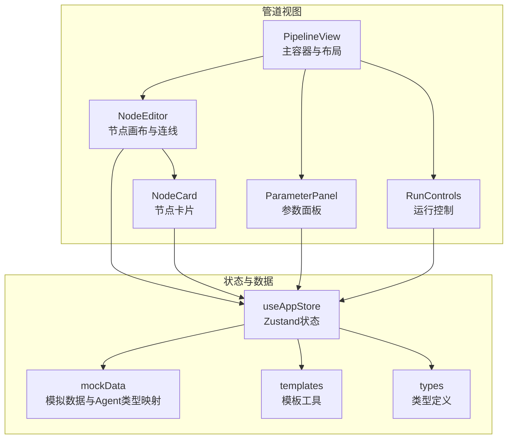
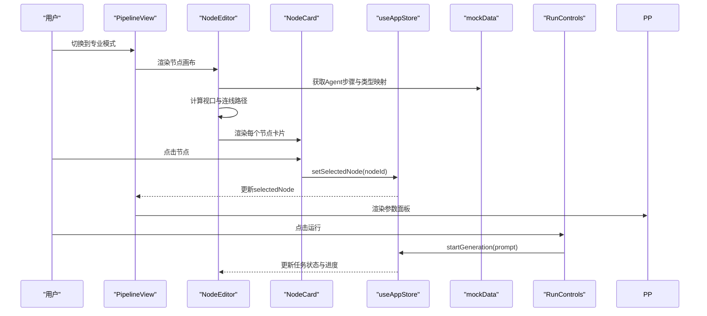
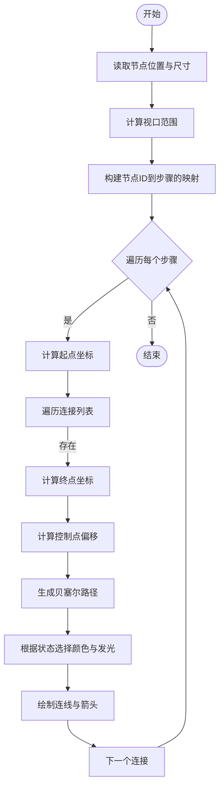
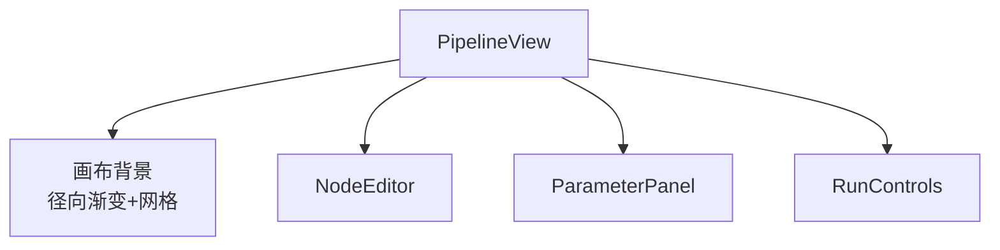
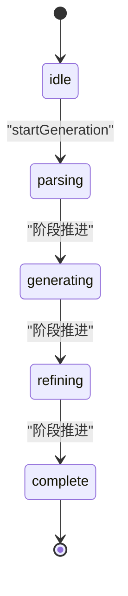
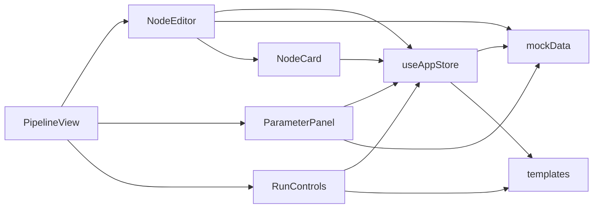

# 节点编辑器

<cite>
**本文档引用的文件**
- [NodeEditor.tsx](file://src/components/Pipeline/NodeEditor.tsx)
- [NodeCard.tsx](file://src/components/Pipeline/NodeCard.tsx)
- [PipelineView.tsx](file://src/components/Pipeline/PipelineView.tsx)
- [ParameterPanel.tsx](file://src/components/Pipeline/ParameterPanel.tsx)
- [RunControls.tsx](file://src/components/Pipeline/RunControls.tsx)
- [useAppStore.ts](file://src/store/useAppStore.ts)
- [mockData.ts](file://src/utils/mockData.ts)
- [index.ts](file://src/types/index.ts)
- [ModeSwitch.tsx](file://src/components/Layout/ModeSwitch.tsx)
- [templates.ts](file://src/utils/templates.ts)
</cite>

## 目录
1. [简介](#简介)
2. [项目结构](#项目结构)
3. [核心组件](#核心组件)
4. [架构总览](#架构总览)
5. [详细组件分析](#详细组件分析)
6. [依赖关系分析](#依赖关系分析)
7. [性能考量](#性能考量)
8. [故障排除指南](#故障排除指南)
9. [结论](#结论)
10. [附录](#附录)

## 简介
本文件面向“节点编辑器”的使用者与开发者，系统性阐述其核心功能与实现细节，包括：
- Agent 步骤的可视化编辑与连线关系管理
- 节点卡片的设计理念与交互反馈
- 节点的创建、删除、重排与连接机制
- 连线绘制算法与状态验证规则
- 响应式布局与网格对齐
- 专业模式下的高级编辑能力与性能优化建议
- 复杂流程设计模式与用户体验优化策略

## 项目结构
节点编辑器位于管道（Pipeline）子系统内，采用分层组织：
- 视图层：PipelineView、NodeEditor、NodeCard、ParameterPanel、RunControls
- 状态层：useAppStore（Zustand）
- 类型定义：types/index.ts
- 数据与工具：mockData.ts、templates.ts
- 模式切换：ModeSwitch（用于切换简单/专业视图）



图表来源
- [PipelineView.tsx:87-167](file://src/components/Pipeline/PipelineView.tsx#L87-L167)
- [NodeEditor.tsx:9-198](file://src/components/Pipeline/NodeEditor.tsx#L9-L198)
- [NodeCard.tsx:13-92](file://src/components/Pipeline/NodeCard.tsx#L13-L92)
- [ParameterPanel.tsx:54-213](file://src/components/Pipeline/ParameterPanel.tsx#L54-L213)
- [RunControls.tsx:6-92](file://src/components/Pipeline/RunControls.tsx#L6-L92)
- [useAppStore.ts:114-394](file://src/store/useAppStore.ts#L114-L394)
- [mockData.ts:74-188](file://src/utils/mockData.ts#L74-L188)
- [templates.ts:4-33](file://src/utils/templates.ts#L4-L33)
- [index.ts:53-82](file://src/types/index.ts#L53-L82)

章节来源
- [PipelineView.tsx:1-168](file://src/components/Pipeline/PipelineView.tsx#L1-L168)
- [NodeEditor.tsx:1-199](file://src/components/Pipeline/NodeEditor.tsx#L1-L199)
- [NodeCard.tsx:1-93](file://src/components/Pipeline/NodeCard.tsx#L1-L93)
- [ParameterPanel.tsx:1-214](file://src/components/Pipeline/ParameterPanel.tsx#L1-L214)
- [RunControls.tsx:1-93](file://src/components/Pipeline/RunControls.tsx#L1-L93)
- [useAppStore.ts:1-451](file://src/store/useAppStore.ts#L1-L451)
- [mockData.ts:1-189](file://src/utils/mockData.ts#L1-L189)
- [index.ts:1-206](file://src/types/index.ts#L1-L206)
- [ModeSwitch.tsx:1-82](file://src/components/Layout/ModeSwitch.tsx#L1-L82)
- [templates.ts:1-115](file://src/utils/templates.ts#L1-L115)

## 核心组件
- NodeEditor：负责节点画布、连线绘制、缩放与视口计算、运行态动画效果
- NodeCard：节点卡片UI，包含步骤信息、状态指示、进度条、类型标签与选中反馈
- PipelineView：专业模式下主容器，包含画布背景网格、参数面板与运行控制
- ParameterPanel：节点/全局参数面板，展示与编辑参数
- RunControls：运行控制条，支持一键运行、单步执行、停止、导出等
- useAppStore：集中管理任务、节点选择、视图模式、用户等级与模板等状态
- mockData：提供默认参数、Agent类型映射与示例Agent步骤
- types：定义AgentStep、GenerationTask、GenerationParameters等类型

章节来源
- [NodeEditor.tsx:9-198](file://src/components/Pipeline/NodeEditor.tsx#L9-L198)
- [NodeCard.tsx:13-92](file://src/components/Pipeline/NodeCard.tsx#L13-L92)
- [PipelineView.tsx:87-167](file://src/components/Pipeline/PipelineView.tsx#L87-L167)
- [ParameterPanel.tsx:54-213](file://src/components/Pipeline/ParameterPanel.tsx#L54-L213)
- [RunControls.tsx:6-92](file://src/components/Pipeline/RunControls.tsx#L6-L92)
- [useAppStore.ts:114-394](file://src/store/useAppStore.ts#L114-L394)
- [mockData.ts:74-188](file://src/utils/mockData.ts#L74-L188)
- [index.ts:53-82](file://src/types/index.ts#L53-L82)

## 架构总览
节点编辑器采用“视图-状态-数据”三层架构：
- 视图层：通过React组件渲染节点与连线，使用Framer Motion实现过渡与动画
- 状态层：Zustand集中管理任务、节点选择、视图模式与用户偏好
- 数据层：mockData提供初始Agent步骤与类型映射；templates提供模板创建与应用



图表来源
- [PipelineView.tsx:87-167](file://src/components/Pipeline/PipelineView.tsx#L87-L167)
- [NodeEditor.tsx:9-198](file://src/components/Pipeline/NodeEditor.tsx#L9-L198)
- [NodeCard.tsx:13-92](file://src/components/Pipeline/NodeCard.tsx#L13-L92)
- [useAppStore.ts:114-172](file://src/store/useAppStore.ts#L114-L172)
- [mockData.ts:74-188](file://src/utils/mockData.ts#L74-L188)
- [RunControls.tsx:6-92](file://src/components/Pipeline/RunControls.tsx#L6-L92)

## 详细组件分析

### NodeEditor 组件
职责与特性：
- 计算视口：根据节点位置动态计算SVG viewBox，确保所有节点可见
- 缩放与内边距：通过比例因子与固定内边距适配不同屏幕尺寸
- 连线生成：基于节点的connections字段生成贝塞尔曲线路径，支持运行态动画与状态着色
- 动画与阴影：节点卡片使用Framer Motion入场动画与选中高亮
- 网格背景：在专业模式下叠加网格背景，辅助对齐与布局

连线绘制算法要点：
- 起点与终点：从源节点右侧中心到目标节点左侧中心
- 控制点偏移：沿x轴方向按距离的百分比限制最大偏移，保证曲线平滑
- 状态颜色：根据起止节点状态决定连线颜色与发光效果
- 运行态：当任一端处于运行态时，使用虚线与流动动画



图表来源
- [NodeEditor.tsx:38-77](file://src/components/Pipeline/NodeEditor.tsx#L38-L77)
- [NodeEditor.tsx:134-172](file://src/components/Pipeline/NodeEditor.tsx#L134-L172)

章节来源
- [NodeEditor.tsx:9-198](file://src/components/Pipeline/NodeEditor.tsx#L9-L198)

### NodeCard 组件
设计理念：
- 步骤信息显示：名称、类型标签、持续时间
- 状态指示器：彩色圆点与脉冲动画，配合进度条
- 交互反馈：悬停放大、点击缩放、选中高亮边框与阴影
- 颜色体系：依据Agent类型映射颜色，统一视觉语言

```mermaid
classDiagram
class NodeCard {
+props.step : AgentStep
+props.isSelected : boolean
+props.onClick() : void
+render()
}
class AgentStep {
+string id
+string name
+string type
+string status
+number progress
+number duration
+Record~string,any~ inputs
+Record~string,any~ outputs
+position : {x,y}
+string[] connections
}
NodeCard --> AgentStep : "接收并渲染"
```

图表来源
- [NodeCard.tsx:13-92](file://src/components/Pipeline/NodeCard.tsx#L13-L92)
- [index.ts:53-64](file://src/types/index.ts#L53-L64)

章节来源
- [NodeCard.tsx:13-92](file://src/components/Pipeline/NodeCard.tsx#L13-L92)
- [mockData.ts:178-188](file://src/utils/mockData.ts#L178-L188)

### PipelineView 组件
专业模式布局：
- 画布区域：70%，包含径向渐变背景与40×40网格背景
- 参数面板：30%，展示节点/全局参数与输入输出摘要
- 底部运行控制：包含一键运行、单步执行、停止、导出等
- 空状态：当没有Agent步骤时显示引导文案与图标



图表来源
- [PipelineView.tsx:87-167](file://src/components/Pipeline/PipelineView.tsx#L87-L167)

章节来源
- [PipelineView.tsx:1-168](file://src/components/Pipeline/PipelineView.tsx#L1-L168)

### ParameterPanel 组件
功能：
- 节点详情：展示状态、进度、类型、耗时、连接数量
- 输入输出：以键值对形式展示输入数据
- 全局参数：CFG Scale、采样步数、Seed、拓扑类型、贴图分辨率、面数预算、UV展开方式、输出格式等

章节来源
- [ParameterPanel.tsx:54-213](file://src/components/Pipeline/ParameterPanel.tsx#L54-L213)
- [mockData.ts:3-12](file://src/utils/mockData.ts#L3-L12)

### RunControls 组件
功能：
- 运行控制：一键运行、单步执行、停止
- 状态指示：执行中/完成/就绪状态与当前步骤名与进度
- 专家功能：保存为模板、导出中间产物、在外部工具中打开

章节来源
- [RunControls.tsx:6-92](file://src/components/Pipeline/RunControls.tsx#L6-L92)
- [useAppStore.ts:114-172](file://src/store/useAppStore.ts#L114-L172)
- [templates.ts:4-33](file://src/utils/templates.ts#L4-L33)

### useAppStore 状态管理
关键状态与方法：
- currentTask：当前生成任务，包含参数与Agent步骤
- selectedNode：当前选中的节点ID
- startGeneration：启动生成流程，模拟阶段推进
- completeTask：标记任务完成并更新历史
- viewMode：simple/professional视图模式
- userProfile：用户等级与功能解锁，影响界面可用性



图表来源
- [useAppStore.ts:410-450](file://src/store/useAppStore.ts#L410-L450)

章节来源
- [useAppStore.ts:114-394](file://src/store/useAppStore.ts#L114-L394)
- [index.ts:13-26](file://src/types/index.ts#L13-L26)

### mockData 与类型定义
- 默认参数与编辑设置：提供初始生成参数与编辑设置
- Agent类型映射：将Agent类型映射为中文标签与颜色
- 示例Agent步骤：提供完整的管线步骤序列与连接关系
- 类型定义：AgentStep、GenerationTask、GenerationParameters等

章节来源
- [mockData.ts:3-188](file://src/utils/mockData.ts#L3-L188)
- [index.ts:53-82](file://src/types/index.ts#L53-L82)

## 依赖关系分析
- NodeEditor 依赖：
  - useAppStore：读取任务与节点选择
  - mockData：获取Agent步骤与类型映射
  - NodeCard：渲染节点卡片
- NodeCard 依赖：
  - useAppStore：触发节点选择
  - mockData：类型标签与颜色
- PipelineView 依赖：
  - NodeEditor、ParameterPanel、RunControls
  - useAppStore：视图模式与任务状态
- ParameterPanel 依赖：
  - useAppStore：当前任务与选中节点
  - mockData：类型映射
- RunControls 依赖：
  - useAppStore：任务状态与用户等级
  - templates：保存为模板
- useAppStore 依赖：
  - mockData：默认参数与步骤
  - templates：模板持久化



图表来源
- [NodeEditor.tsx:9-11](file://src/components/Pipeline/NodeEditor.tsx#L9-L11)
- [NodeCard.tsx:2-4](file://src/components/Pipeline/NodeCard.tsx#L2-L4)
- [PipelineView.tsx:3-6](file://src/components/Pipeline/PipelineView.tsx#L3-L6)
- [ParameterPanel.tsx:3-4](file://src/components/Pipeline/ParameterPanel.tsx#L3-L4)
- [RunControls.tsx:2-3](file://src/components/Pipeline/RunControls.tsx#L2-L3)
- [useAppStore.ts:18-19](file://src/store/useAppStore.ts#L18-L19)
- [templates.ts:1-1](file://src/utils/templates.ts#L1-L1)

章节来源
- [NodeEditor.tsx:1-11](file://src/components/Pipeline/NodeEditor.tsx#L1-L11)
- [NodeCard.tsx:1-5](file://src/components/Pipeline/NodeCard.tsx#L1-L5)
- [PipelineView.tsx:1-7](file://src/components/Pipeline/PipelineView.tsx#L1-L7)
- [ParameterPanel.tsx:1-5](file://src/components/Pipeline/ParameterPanel.tsx#L1-L5)
- [RunControls.tsx:1-4](file://src/components/Pipeline/RunControls.tsx#L1-L4)
- [useAppStore.ts:1-19](file://src/store/useAppStore.ts#L1-L19)
- [templates.ts:1-1](file://src/utils/templates.ts#L1-L1)

## 性能考量
- 连线绘制复杂度：O(N + E)，其中N为节点数，E为连接数；通过Memo化减少重复计算
- 视口计算：仅在步骤列表变化时重新计算，避免频繁重排
- 动画开销：节点入场与参数面板切换使用轻量动画，避免过度重绘
- 状态更新：使用Zustand局部状态更新，减少无关组件重渲染
- 建议：
  - 大规模节点时可考虑虚拟滚动或分页渲染
  - 连线路径缓存与增量更新
  - 使用requestAnimationFrame优化动画帧率

[本节为通用性能建议，不直接分析具体文件]

## 故障排除指南
- 节点连线异常
  - 检查AgentStep的connections是否指向有效ID
  - 确认stepMap映射正确，避免空目标导致跳过
- 节点未选中
  - 确认selectedNode与节点ID一致
  - 检查点击事件是否被父元素阻止
- 专业模式不可用
  - 用户等级需达到专家级别，且任务状态允许
- 运行按钮禁用
  - 当前任务处于运行态时会禁用“运行全部”，等待任务完成或停止后再试

章节来源
- [NodeEditor.tsx:32-36](file://src/components/Pipeline/NodeEditor.tsx#L32-L36)
- [NodeEditor.tsx:57-62](file://src/components/Pipeline/NodeEditor.tsx#L57-L62)
- [useAppStore.ts:179-180](file://src/store/useAppStore.ts#L179-L180)
- [RunControls.tsx:22-29](file://src/components/Pipeline/RunControls.tsx#L22-L29)

## 结论
节点编辑器通过清晰的分层架构与类型安全的数据模型，实现了Agent步骤的可视化编辑、连线关系管理与参数配置。其专业模式下的网格背景、状态着色与运行态动画提升了复杂流程的可读性与交互体验。结合模板系统与用户等级机制，编辑器既满足新手的易用性，也为专家提供了强大的高级功能。

[本节为总结性内容，不直接分析具体文件]

## 附录

### 节点创建、删除、重排与连接机制
- 创建：通过模拟数据初始化Agent步骤，或由上层逻辑注入新的步骤
- 删除：在专业模式下可扩展删除节点与断开连接
- 重排：节点位置由position字段控制，可通过拖拽更新（当前仓库未实现拖拽逻辑）
- 连接：通过connections数组维护有向边，连线生成基于该结构

章节来源
- [mockData.ts:74-176](file://src/utils/mockData.ts#L74-L176)
- [index.ts:53-64](file://src/types/index.ts#L53-L64)
- [NodeEditor.tsx:57-74](file://src/components/Pipeline/NodeEditor.tsx#L57-L74)

### 响应式布局与网格对齐
- 响应式：容器自适应高度与宽度，视口随节点动态扩展
- 网格对齐：专业模式下提供40×40像素网格背景，辅助节点对齐与布局一致性

章节来源
- [NodeEditor.tsx:18-29](file://src/components/Pipeline/NodeEditor.tsx#L18-L29)
- [PipelineView.tsx:110-117](file://src/components/Pipeline/PipelineView.tsx#L110-L117)

### 专业模式下的高级编辑功能
- 专家功能：保存为模板、导出中间产物、在外部工具中打开
- 模板系统：从任务创建模板，支持标签提取与模板应用

章节来源
- [RunControls.tsx:66-89](file://src/components/Pipeline/RunControls.tsx#L66-L89)
- [templates.ts:4-33](file://src/utils/templates.ts#L4-L33)
- [useAppStore.ts:214-228](file://src/store/useAppStore.ts#L214-L228)

### 最佳实践与用户体验优化
- 设计模式
  - 将连线生成与节点渲染解耦，便于扩展与测试
  - 使用类型安全的数据模型，减少运行时错误
- 用户体验
  - 提供明确的状态指示与进度反馈
  - 在空状态下给出引导信息
  - 保持界面一致性与色彩语义化

[本节为通用最佳实践建议，不直接分析具体文件]