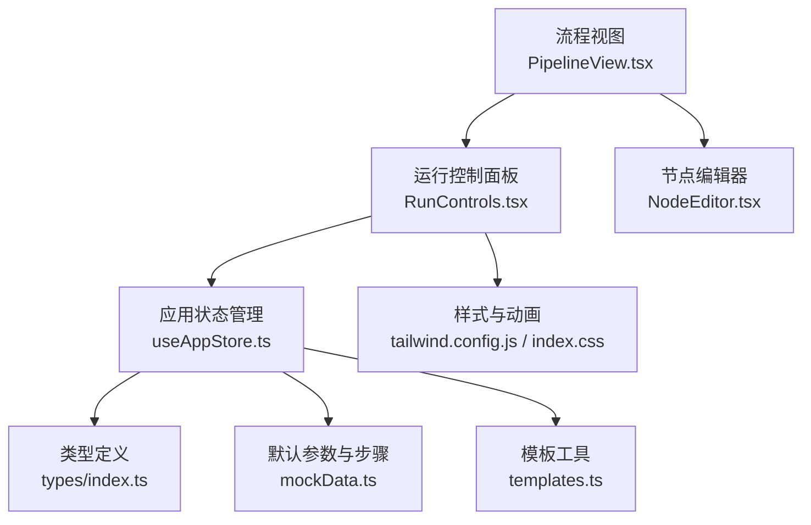
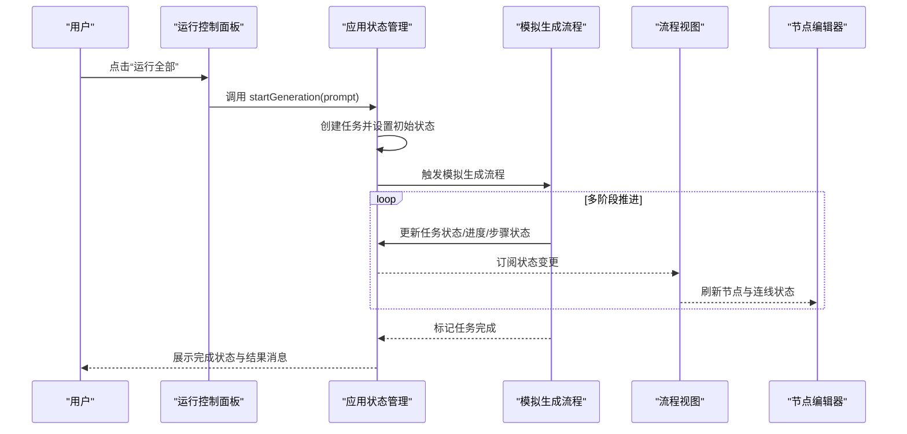
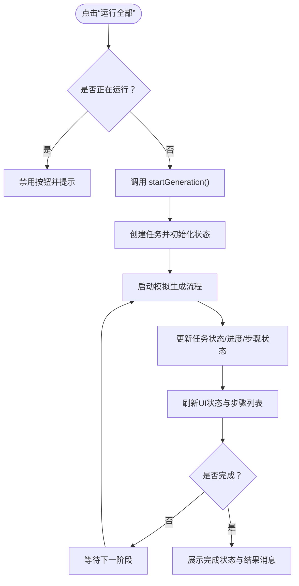
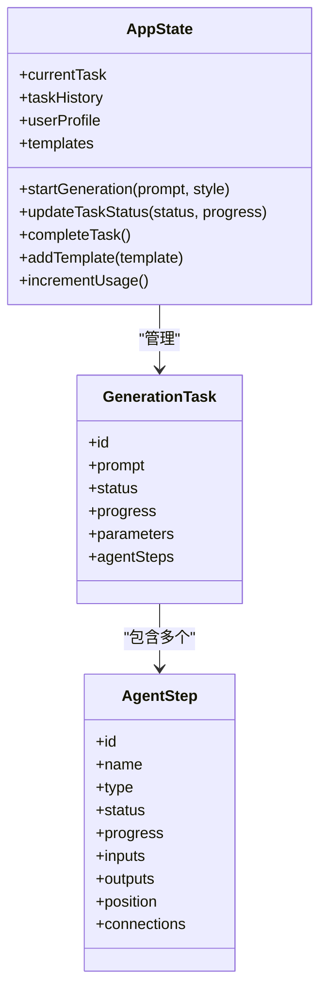
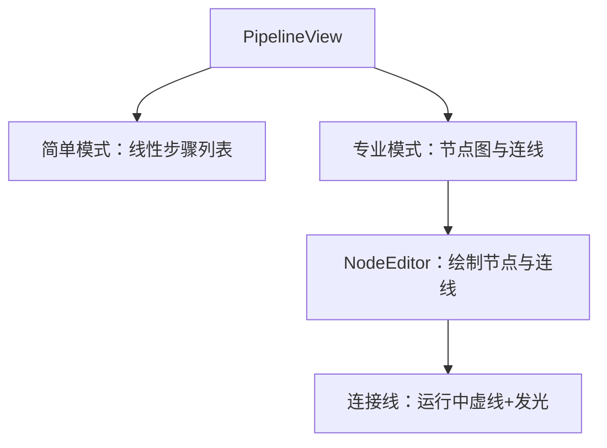
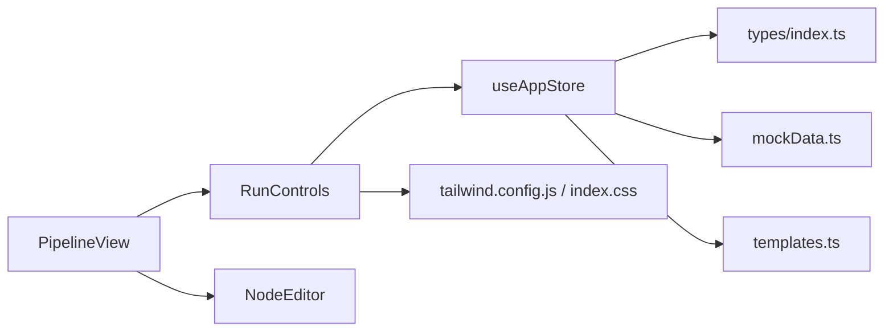

# 运行控制

<cite>
**本文引用的文件**
- [RunControls.tsx](file://src/components/Pipeline/RunControls.tsx)
- [useAppStore.ts](file://src/store/useAppStore.ts)
- [PipelineView.tsx](file://src/components/Pipeline/PipelineView.tsx)
- [NodeEditor.tsx](file://src/components/Pipeline/NodeEditor.tsx)
- [index.ts](file://src/types/index.ts)
- [mockData.ts](file://src/utils/mockData.ts)
- [templates.ts](file://src/utils/templates.ts)
- [tailwind.config.js](file://tailwind.config.js)
- [index.css](file://src/index.css)
</cite>

## 目录
1. [简介](#简介)
2. [项目结构](#项目结构)
3. [核心组件](#核心组件)
4. [架构总览](#架构总览)
5. [详细组件分析](#详细组件分析)
6. [依赖关系分析](#依赖关系分析)
7. [性能考量](#性能考量)
8. [故障排查指南](#故障排查指南)
9. [结论](#结论)
10. [附录](#附录)

## 简介
本文件围绕“运行控制面板”进行深入文档化，涵盖流程执行控制机制（开始执行、暂停/恢复、重置/清理、调试模式）、运行状态的可视化反馈（进度显示、状态指示器、错误处理）、权限与安全（参数验证与流程检查）、交互设计（按钮状态管理、动画反馈、用户提示）、最佳实践（长时间执行优化与中断处理），以及在不同使用场景下的适应性设计与用户体验考虑。目标是帮助开发者与非技术用户都能清晰理解并高效使用运行控制功能。

## 项目结构
运行控制功能主要由以下模块协同实现：
- 控制面板组件：负责按钮交互、状态展示与导出操作
- 应用状态管理：集中管理任务生命周期、进度与步骤状态
- 流程视图：根据视图模式（简单/专业）渲染节点图或线性步骤列表，并集成运行控制
- 类型定义：统一的任务状态、步骤类型与用户级别等类型
- 工具函数：模拟生成流程、模板创建与默认参数

图表来源
- [RunControls.tsx:1-93](file://src/components/Pipeline/RunControls.tsx#L1-L93)
- [useAppStore.ts:114-496](file://src/store/useAppStore.ts#L114-L496)
- [PipelineView.tsx:1-168](file://src/components/Pipeline/PipelineView.tsx#L1-L168)
- [NodeEditor.tsx:143-198](file://src/components/Pipeline/NodeEditor.tsx#L143-L198)
- [index.ts:1-206](file://src/types/index.ts#L1-L206)
- [mockData.ts:1-189](file://src/utils/mockData.ts#L1-L189)
- [templates.ts:1-115](file://src/utils/templates.ts#L1-L115)
- [tailwind.config.js:1-43](file://tailwind.config.js#L1-L43)
- [index.css:37-63](file://src/index.css#L37-L63)

章节来源
- [RunControls.tsx:1-93](file://src/components/Pipeline/RunControls.tsx#L1-L93)
- [useAppStore.ts:114-496](file://src/store/useAppStore.ts#L114-L496)
- [PipelineView.tsx:1-168](file://src/components/Pipeline/PipelineView.tsx#L1-L168)

## 核心组件
- 运行控制面板（RunControls）
  - 提供“运行全部”“单步执行”“停止”等控制按钮
  - 展示当前执行状态、步骤名称与整体进度百分比
  - 在专家级别用户可见“保存为模板”等高级功能
- 应用状态管理（useAppStore）
  - 维护当前任务、历史任务、用户资料与模板
  - 提供启动生成、更新状态、完成任务等方法
  - 内置模拟生成流程，驱动任务状态推进与步骤状态变化
- 流程视图（PipelineView）
  - 简单模式：线性步骤列表，展示每个步骤的状态与进度
  - 专业模式：节点图与连线，运行时连接线呈现动态效果
- 类型定义（types/index.ts）
  - 定义任务状态、步骤类型、用户级别、对话消息等核心类型
- 工具函数
  - 默认参数与步骤模板（mockData.ts）
  - 从任务创建模板（templates.ts）

章节来源
- [RunControls.tsx:6-92](file://src/components/Pipeline/RunControls.tsx#L6-L92)
- [useAppStore.ts:53-172](file://src/store/useAppStore.ts#L53-L172)
- [PipelineView.tsx:9-84](file://src/components/Pipeline/PipelineView.tsx#L9-L84)
- [index.ts:13-64](file://src/types/index.ts#L13-L64)
- [mockData.ts:74-176](file://src/utils/mockData.ts#L74-L176)
- [templates.ts:3-22](file://src/utils/templates.ts#L3-L22)

## 架构总览
运行控制的执行流从“运行全部”按钮触发，进入状态管理，通过模拟生成流程逐步推进任务状态与步骤状态，同时更新UI反馈；在不同视图模式下，节点图与线性步骤列表同步反映当前状态。

图表来源
- [RunControls.tsx:21-29](file://src/components/Pipeline/RunControls.tsx#L21-L29)
- [useAppStore.ts:121-136](file://src/store/useAppStore.ts#L121-L136)
- [useAppStore.ts:410-495](file://src/store/useAppStore.ts#L410-L495)
- [PipelineView.tsx:9-84](file://src/components/Pipeline/PipelineView.tsx#L9-L84)
- [NodeEditor.tsx:143-198](file://src/components/Pipeline/NodeEditor.tsx#L143-L198)

## 详细组件分析

### 运行控制面板（RunControls）
- 功能职责
  - 开始执行：当未处于运行状态时启用，调用状态管理启动生成
  - 单步执行：占位按钮，预留扩展
  - 停止：仅在运行中可用，预留扩展
  - 状态展示：执行中显示当前步骤名称与整体进度百分比；完成后显示完成指示；无任务时显示就绪提示
  - 导出与分享：保存为模板（专家级别）、导出中间产物、在外部工具中打开
- 交互设计
  - 按钮禁用态与悬停态：通过CSS类与内联样式区分可用/不可用状态
  - 动画反馈：首次渲染使用淡入与位移动画，执行中使用脉冲动画与旋转动画
  - 用户提示：通过颜色与图标传达状态含义（蓝色脉冲表示运行中，绿色表示完成）

图表来源
- [RunControls.tsx:21-29](file://src/components/Pipeline/RunControls.tsx#L21-L29)
- [useAppStore.ts:121-136](file://src/store/useAppStore.ts#L121-L136)
- [useAppStore.ts:410-495](file://src/store/useAppStore.ts#L410-L495)

章节来源
- [RunControls.tsx:6-92](file://src/components/Pipeline/RunControls.tsx#L6-L92)
- [tailwind.config.js:39-43](file://tailwind.config.js#L39-L43)
- [index.css:37-63](file://src/index.css#L37-L63)

### 应用状态管理（useAppStore）
- 任务生命周期
  - startGeneration：创建任务对象，设置初始状态为“解析”，并启动模拟生成
  - updateTaskStatus：更新任务状态与进度
  - completeTask：标记任务完成，填充结果信息，并加入历史记录
- 模拟生成流程（simulateGeneration）
  - 分阶段推进：解析→生成→精修→完成
  - 步骤状态映射：按阶段索引更新步骤状态与进度
  - 对话消息：在聊天会话中推送进度消息与最终结果消息
- 用户与模板
  - 用户级别与特性解锁：基于使用次数自动升级
  - 模板保存：从任务创建模板并持久化

图表来源
- [useAppStore.ts:53-172](file://src/store/useAppStore.ts#L53-L172)
- [index.ts:13-64](file://src/types/index.ts#L13-L64)

章节来源
- [useAppStore.ts:114-496](file://src/store/useAppStore.ts#L114-L496)
- [index.ts:13-64](file://src/types/index.ts#L13-L64)

### 流程视图（PipelineView）
- 简单模式（线性步骤）
  - 渲染每个步骤的状态图标与文字，运行中步骤带有旋转动画
  - 使用颜色与背景强调当前状态
- 专业模式（节点图）
  - 节点编辑器绘制节点与连线，运行中连线呈现虚线与发光效果
  - 画布背景网格增强空间感

图表来源
- [PipelineView.tsx:14-84](file://src/components/Pipeline/PipelineView.tsx#L14-L84)
- [PipelineView.tsx:87-167](file://src/components/Pipeline/PipelineView.tsx#L87-L167)
- [NodeEditor.tsx:143-198](file://src/components/Pipeline/NodeEditor.tsx#L143-L198)

章节来源
- [PipelineView.tsx:1-168](file://src/components/Pipeline/PipelineView.tsx#L1-L168)
- [NodeEditor.tsx:143-198](file://src/components/Pipeline/NodeEditor.tsx#L143-L198)

### 类型与数据模型
- 任务状态（GenerationStatus）：空闲、解析、生成、精修、完成、错误
- 步骤类型（AgentType）：意图解析、概念生成、结构生成、细节精修、拓扑优化、UV展开、材质生成、质量检查、格式转换
- 用户级别（UserLevel）：初级、中级、专家
- 任务与步骤结构：包含状态、进度、输入输出、位置与连接等字段

章节来源
- [index.ts:3](file://src/types/index.ts#L3)
- [index.ts:66-76](file://src/types/index.ts#L66-L76)
- [index.ts:101](file://src/types/index.ts#L101)
- [index.ts:13-64](file://src/types/index.ts#L13-L64)

### 权限管理与安全考虑
- 执行前参数验证与流程检查
  - 当前实现未显式进行参数校验，但可通过在启动前对任务参数进行校验与必要检查来增强安全性
- 特性解锁与专家功能
  - 专家级别用户可使用“保存为模板”等高级功能，避免普通用户误操作
- 模板安全
  - 模板创建时仅复制必要字段，避免敏感信息泄露

章节来源
- [RunControls.tsx:66-80](file://src/components/Pipeline/RunControls.tsx#L66-L80)
- [templates.ts:3-22](file://src/utils/templates.ts#L3-L22)

### 交互设计与动画反馈
- 按钮状态管理
  - 运行中禁用“运行全部”，启用“停止”；完成或空闲时恢复按钮可用
- 动画反馈
  - 首次渲染：淡入与上移
  - 运行中：脉冲与旋转动画
  - 节点连线：运行中采用虚线与发光效果
- 用户提示
  - 状态指示器：颜色与图标传达当前状态
  - 文字提示：完成、就绪、执行中等

章节来源
- [RunControls.tsx:21-40](file://src/components/Pipeline/RunControls.tsx#L21-L40)
- [RunControls.tsx:45-61](file://src/components/Pipeline/RunControls.tsx#L45-L61)
- [NodeEditor.tsx:143-198](file://src/components/Pipeline/NodeEditor.tsx#L143-L198)
- [tailwind.config.js:39-43](file://tailwind.config.js#L39-L43)

## 依赖关系分析
- 组件耦合
  - RunControls 依赖 useAppStore 的任务状态与启动方法
  - PipelineView 依赖 RunControls 并根据视图模式渲染不同布局
  - NodeEditor 依赖当前任务的步骤状态以更新连线样式
- 数据流向
  - 用户操作 → RunControls → useAppStore → 模拟生成流程 → 更新任务与步骤状态 → 视图层响应
- 外部依赖
  - Zustand 作为状态管理库
  - Framer Motion 用于动画
  - Tailwind CSS 与自定义动画类提供视觉反馈

图表来源
- [RunControls.tsx:1-93](file://src/components/Pipeline/RunControls.tsx#L1-L93)
- [useAppStore.ts:114-496](file://src/store/useAppStore.ts#L114-L496)
- [PipelineView.tsx:1-168](file://src/components/Pipeline/PipelineView.tsx#L1-L168)
- [NodeEditor.tsx:143-198](file://src/components/Pipeline/NodeEditor.tsx#L143-L198)
- [index.ts:1-206](file://src/types/index.ts#L1-L206)
- [mockData.ts:1-189](file://src/utils/mockData.ts#L1-L189)
- [templates.ts:1-115](file://src/utils/templates.ts#L1-L115)
- [tailwind.config.js:1-43](file://tailwind.config.js#L1-L43)
- [index.css:37-63](file://src/index.css#L37-L63)

章节来源
- [useAppStore.ts:114-496](file://src/store/useAppStore.ts#L114-L496)
- [RunControls.tsx:1-93](file://src/components/Pipeline/RunControls.tsx#L1-L93)
- [PipelineView.tsx:1-168](file://src/components/Pipeline/PipelineView.tsx#L1-L168)

## 性能考量
- 模拟生成流程
  - 使用定时器分阶段推进，避免阻塞主线程
  - 通过批量更新任务状态减少不必要的渲染
- 视图渲染
  - 使用动画库进行轻量动画，避免复杂计算
  - 在专业模式下，节点与连线的渲染应避免频繁重排
- 长时间执行优化
  - 可引入节流/防抖策略更新进度
  - 将耗时步骤拆分为更细粒度的阶段，提升可观测性
- 中断处理
  - 建议在模拟流程中支持取消逻辑，清理定时器与订阅
  - 在真实后端执行时，需提供中断请求与回滚机制

[本节为通用性能指导，不直接分析具体文件]

## 故障排查指南
- 无法点击“运行全部”
  - 检查当前任务状态是否为运行中；若处于运行中则按钮被禁用
  - 确认状态管理中的任务对象已正确创建
- 进度不更新
  - 检查模拟生成流程是否正常推进各阶段
  - 确认任务状态与进度映射表是否正确
- 节点连线无动态效果
  - 检查运行中条件与连线样式类是否生效
- 完成后未显示结果消息
  - 确认完成阶段的消息推送逻辑是否执行
- 专家功能不可见
  - 检查用户级别与特性解锁逻辑

章节来源
- [RunControls.tsx:21-29](file://src/components/Pipeline/RunControls.tsx#L21-L29)
- [useAppStore.ts:410-495](file://src/store/useAppStore.ts#L410-L495)
- [NodeEditor.tsx:143-198](file://src/components/Pipeline/NodeEditor.tsx#L143-L198)

## 结论
运行控制面板通过简洁直观的按钮与丰富的状态反馈，实现了从开始执行到完成的完整流程闭环。结合状态管理与视图渲染，系统在不同使用场景下提供了良好的用户体验。建议在未来版本中增强参数校验、中断处理与错误恢复能力，并进一步细化单步执行与调试模式，以满足更复杂的创作需求。

[本节为总结性内容，不直接分析具体文件]

## 附录
- 最佳实践清单
  - 参数验证：在启动前对任务参数进行校验
  - 错误处理：捕获异常并提供用户友好的错误提示
  - 中断处理：支持取消与回滚，清理资源
  - 长时间执行：拆分阶段、提供进度与剩余时间估算
  - 用户体验：保持按钮状态一致性、提供明确的视觉反馈与提示

[本节为通用指导，不直接分析具体文件]