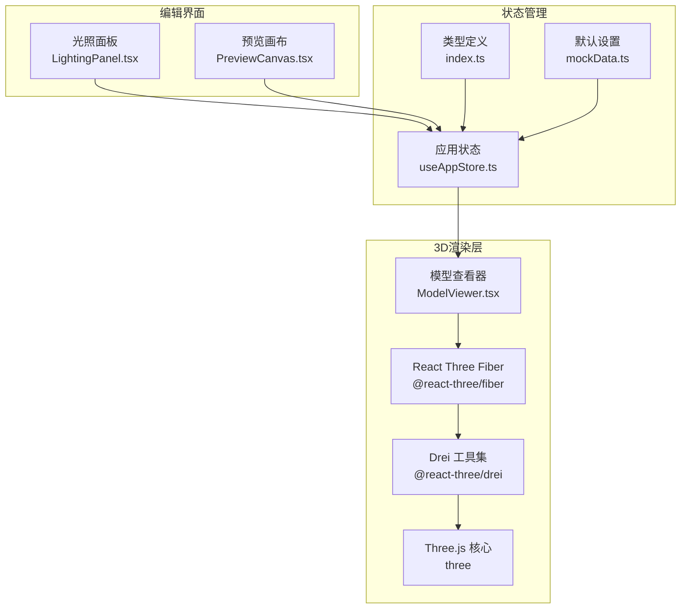
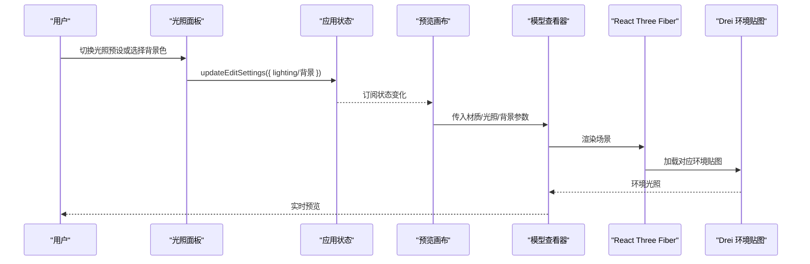
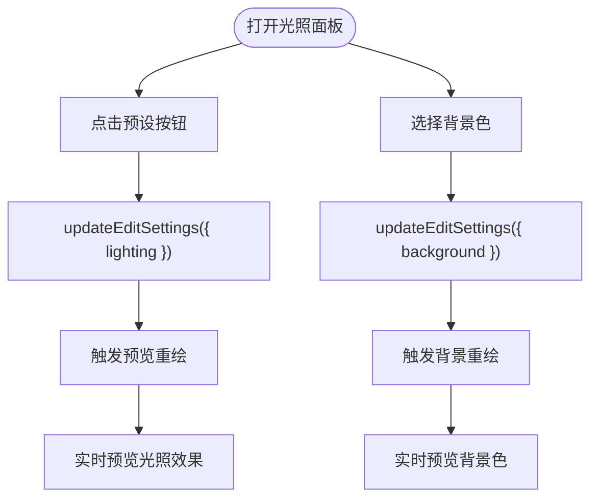
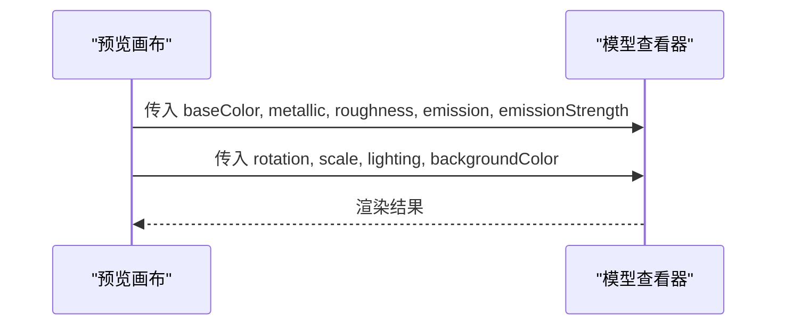
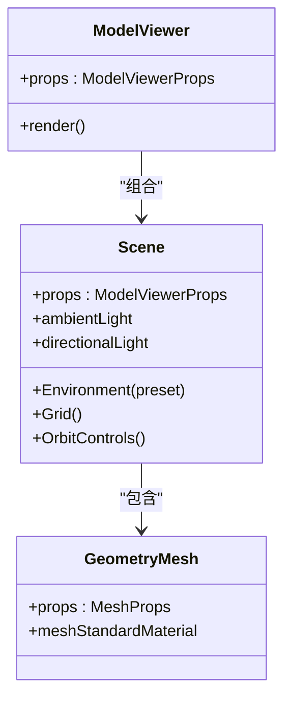
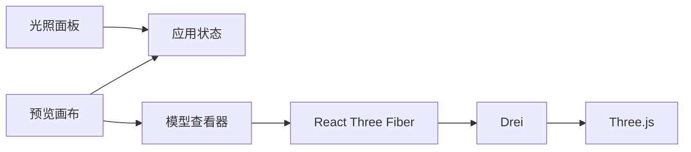

# 光照面板

<cite>
**本文引用的文件列表**
- [LightingPanel.tsx](file://src/components/Edit/LightingPanel.tsx)
- [ModelViewer.tsx](file://src/components/Shared/ModelViewer.tsx)
- [PreviewCanvas.tsx](file://src/components/Edit/PreviewCanvas.tsx)
- [useAppStore.ts](file://src/store/useAppStore.ts)
- [index.ts](file://src/types/index.ts)
- [mockData.ts](file://src/utils/mockData.ts)
- [package.json](file://package.json)
</cite>

## 目录
1. [简介](#简介)
2. [项目结构](#项目结构)
3. [核心组件](#核心组件)
4. [架构总览](#架构总览)
5. [详细组件分析](#详细组件分析)
6. [依赖分析](#依赖分析)
7. [性能考量](#性能考量)
8. [故障排查指南](#故障排查指南)
9. [结论](#结论)
10. [附录](#附录)

## 简介
本文件面向“光照面板”的完整技术文档，聚焦于3D场景光照系统的实现与使用体验。当前仓库中的光照系统以“预设环境光照”为主，通过预设的环境贴图（如影棚、户外、夜晚、公寓）驱动场景的整体光照氛围；同时支持背景色选择与基础材质发光参数联动，为用户提供直观的光照预览与实时切换能力。本文将从系统架构、数据流、组件关系、渲染管线影响、可视化反馈机制、性能优化策略以及最佳实践等方面进行系统化阐述。

## 项目结构
与光照面板直接相关的文件组织如下：
- 编辑视图中的光照面板组件负责用户交互与状态变更
- 预览画布将编辑态的光照与材质参数传递给3D渲染器
- 3D渲染器基于Three.js与React Three Fiber/Drei实现，使用环境贴图与基础光源
- 应用状态管理集中于Zustand Store，统一维护光照、材质、背景等编辑设置
- 类型定义与默认值在类型与工具模块中集中声明

图表来源
- [LightingPanel.tsx:1-78](file://src/components/Edit/LightingPanel.tsx#L1-L78)
- [PreviewCanvas.tsx:1-54](file://src/components/Edit/PreviewCanvas.tsx#L1-L54)
- [ModelViewer.tsx:1-156](file://src/components/Shared/ModelViewer.tsx#L1-L156)
- [useAppStore.ts:1-496](file://src/store/useAppStore.ts#L1-L496)
- [index.ts:93-99](file://src/types/index.ts#L93-L99)
- [mockData.ts:14-27](file://src/utils/mockData.ts#L14-L27)
- [package.json:11-21](file://package.json#L11-L21)

章节来源
- [LightingPanel.tsx:1-78](file://src/components/Edit/LightingPanel.tsx#L1-L78)
- [PreviewCanvas.tsx:1-54](file://src/components/Edit/PreviewCanvas.tsx#L1-L54)
- [ModelViewer.tsx:1-156](file://src/components/Shared/ModelViewer.tsx#L1-L156)
- [useAppStore.ts:1-496](file://src/store/useAppStore.ts#L1-L496)
- [index.ts:93-99](file://src/types/index.ts#L93-L99)
- [mockData.ts:14-27](file://src/utils/mockData.ts#L14-L27)
- [package.json:11-21](file://package.json#L11-L21)

## 核心组件
- 光照面板（LightingPanel）
  - 提供四种光照预设：影棚、户外、戏剧、中性
  - 支持背景色选择与实时预览
  - 使用动画折叠面板提升交互体验
- 预览画布（PreviewCanvas）
  - 将编辑态的光照、材质、旋转、缩放、背景等参数传入3D渲染器
- 模型查看器（ModelViewer）
  - 基于Three.js与Drei，使用环境贴图驱动全局光照
  - 内置基础环境光与方向光，支持网格辅助线与轨道控制器
- 应用状态（useAppStore）
  - 维护EditSettings（包含光照、背景、材质等），提供更新方法
- 类型与默认值（types/index.ts、utils/mockData.ts）
  - 定义EditSettings结构与默认光照预设值

章节来源
- [LightingPanel.tsx:14-78](file://src/components/Edit/LightingPanel.tsx#L14-L78)
- [PreviewCanvas.tsx:5-25](file://src/components/Edit/PreviewCanvas.tsx#L5-L25)
- [ModelViewer.tsx:82-126](file://src/components/Shared/ModelViewer.tsx#L82-L126)
- [useAppStore.ts:66-77](file://src/store/useAppStore.ts#L66-L77)
- [index.ts:93-99](file://src/types/index.ts#L93-L99)
- [mockData.ts:14-27](file://src/utils/mockData.ts#L14-L27)

## 架构总览
光照系统采用“UI交互 -> 状态管理 -> 渲染器”的分层架构：
- UI层：光照面板与预览画布
- 状态层：Zustand Store集中管理EditSettings
- 渲染层：ModelViewer通过Three.js/Drei加载环境贴图，结合基础光源渲染

图表来源
- [LightingPanel.tsx:14-78](file://src/components/Edit/LightingPanel.tsx#L14-L78)
- [PreviewCanvas.tsx:12-24](file://src/components/Edit/PreviewCanvas.tsx#L12-L24)
- [ModelViewer.tsx:82-126](file://src/components/Shared/ModelViewer.tsx#L82-L126)
- [useAppStore.ts:174-177](file://src/store/useAppStore.ts#L174-L177)

## 详细组件分析

### 光照面板（LightingPanel）
- 功能要点
  - 四种光照预设：影棚（studio）、户外（outdoor）、戏剧（dramatic）、中性（neutral）
  - 背景色选择器，支持十六进制输入与实时显示
  - 折叠面板与动画过渡，提升可用性
- 数据绑定
  - 通过useAppStore读取与更新editSettings.lighting与background
- 可视化反馈
  - 当前选中预设高亮，按钮悬停与点击态有明确反馈
- 交互流程
  - 点击预设按钮 -> 更新状态 -> 触发渲染器重绘 -> 实时预览

图表来源
- [LightingPanel.tsx:14-78](file://src/components/Edit/LightingPanel.tsx#L14-L78)
- [useAppStore.ts:174-177](file://src/store/useAppStore.ts#L174-L177)

章节来源
- [LightingPanel.tsx:14-78](file://src/components/Edit/LightingPanel.tsx#L14-L78)
- [useAppStore.ts:174-177](file://src/store/useAppStore.ts#L174-L177)

### 预览画布（PreviewCanvas）
- 参数透传
  - 将EditSettings中的材质参数（基底色、金属度、粗糙度、自发光颜色与强度）、旋转、缩放、光照预设、背景色传递给ModelViewer
- 场景信息覆盖层
  - 显示面数、输出格式、纹理分辨率等信息
- 控件区
  - 提供缩放、复位、最大化等交互入口（当前未绑定具体逻辑）

图表来源
- [PreviewCanvas.tsx:12-24](file://src/components/Edit/PreviewCanvas.tsx#L12-L24)
- [ModelViewer.tsx:136-153](file://src/components/Shared/ModelViewer.tsx#L136-L153)

章节来源
- [PreviewCanvas.tsx:5-54](file://src/components/Edit/PreviewCanvas.tsx#L5-L54)
- [ModelViewer.tsx:136-153](file://src/components/Shared/ModelViewer.tsx#L136-L153)

### 模型查看器（ModelViewer）
- 光照与环境
  - 环境光：固定强度
  - 方向光：固定位置与强度
  - 环境贴图：根据预设映射到Drei的preset（studio/outdoor/dramatic/neutral）
- 材质参数
  - meshStandardMaterial：基底色、金属度、粗糙度、自发光颜色与强度
- 辅助与交互
  - 网格辅助线、轨道控制器、相机参数（不同尺寸下略有差异）
- 性能与兼容性
  - 开启抗锯齿与透明背景，适合预览场景

图表来源
- [ModelViewer.tsx:82-126](file://src/components/Shared/ModelViewer.tsx#L82-L126)
- [ModelViewer.tsx:32-80](file://src/components/Shared/ModelViewer.tsx#L32-L80)

章节来源
- [ModelViewer.tsx:25-30](file://src/components/Shared/ModelViewer.tsx#L25-L30)
- [ModelViewer.tsx:95-96](file://src/components/Shared/ModelViewer.tsx#L95-L96)
- [ModelViewer.tsx:98-102](file://src/components/Shared/ModelViewer.tsx#L98-L102)
- [ModelViewer.tsx:71-77](file://src/components/Shared/ModelViewer.tsx#L71-L77)

### 应用状态与类型定义
- EditSettings
  - 包含材质设置、旋转、缩放、光照预设、背景色
- 默认设置
  - 默认光照为“影棚”，默认背景为深色系
- 状态更新
  - 通过updateEditSettings合并更新，确保局部修改不影响其他字段

章节来源
- [index.ts:93-99](file://src/types/index.ts#L93-L99)
- [mockData.ts:14-27](file://src/utils/mockData.ts#L14-L27)
- [useAppStore.ts:174-177](file://src/store/useAppStore.ts#L174-L177)

## 依赖分析
- 外部依赖
  - @react-three/fiber：3D渲染核心
  - @react-three/drei：环境贴图、网格、控制器等工具
  - three：底层图形库
  - framer-motion：UI动画
  - lucide-react：图标
  - clsx：类名拼接
- 内部依赖
  - LightingPanel依赖useAppStore更新EditSettings
  - PreviewCanvas依赖EditSettings并将参数传入ModelViewer
  - ModelViewer依赖Drei的Environment/Grid/OrbitControls

图表来源
- [LightingPanel.tsx:1-6](file://src/components/Edit/LightingPanel.tsx#L1-L6)
- [PreviewCanvas.tsx:1-3](file://src/components/Edit/PreviewCanvas.tsx#L1-L3)
- [ModelViewer.tsx:1-4](file://src/components/Shared/ModelViewer.tsx#L1-L4)
- [package.json:11-21](file://package.json#L11-L21)

章节来源
- [package.json:11-21](file://package.json#L11-L21)
- [LightingPanel.tsx:1-6](file://src/components/Edit/LightingPanel.tsx#L1-L6)
- [PreviewCanvas.tsx:1-3](file://src/components/Edit/PreviewCanvas.tsx#L1-L3)
- [ModelViewer.tsx:1-4](file://src/components/Shared/ModelViewer.tsx#L1-L4)

## 性能考量
- 当前实现
  - 环境贴图加载与基础光源组合，满足预览场景的实时性
  - 开启抗锯齿与透明背景，保证视觉质量
- 优化建议
  - 环境贴图缓存：避免重复加载相同preset
  - 材质批处理：减少几何体与材质切换
  - 分辨率自适应：根据设备能力动态调整纹理分辨率
  - 光源数量控制：在复杂场景中限制动态光源数量
  - 后期处理：可选加入色调映射与FXAA等优化
- 注意事项
  - 预览模式与生产模式的渲染参数应分离
  - 大模型场景建议使用LOD与剔除策略

## 故障排查指南
- 光照不生效
  - 检查EditSettings.lighting是否正确更新
  - 确认ModelViewer已接收新参数并触发重绘
- 背景色异常
  - 确认背景色输入为合法十六进制值
  - 检查Canvas背景样式是否被覆盖
- 预览卡顿
  - 关闭不必要的网格与控制器
  - 减少复杂几何体或降低纹理分辨率
- 环境贴图加载失败
  - 确认Drei版本与preset名称匹配
  - 检查网络与资源路径

章节来源
- [useAppStore.ts:174-177](file://src/store/useAppStore.ts#L174-L177)
- [ModelViewer.tsx:136-153](file://src/components/Shared/ModelViewer.tsx#L136-L153)

## 结论
当前光照面板以“环境贴图+基础光源”的轻量方案实现了直观的光照预览与实时切换。通过Zustand集中管理EditSettings，配合Three.js/Drei的高效渲染，用户可在编辑阶段快速评估不同光照氛围对材质表现的影响。未来可扩展为更丰富的光源类型（点光源、聚光灯、IES等）与烘焙光照、阴影设置、光照衰减等高级特性，以满足更高阶的创作需求。

## 附录

### 光照参数与材质属性对照
- 光照预设
  - 影棚（studio）：柔和均匀
  - 户外（outdoor）：自然日光
  - 戏剧（dramatic）：强对比高光
  - 中性（neutral）：无偏色灯光
- 材质属性
  - 基底色、金属度、粗糙度、自发光颜色与强度
- 背景色
  - 十六进制输入，实时预览

章节来源
- [LightingPanel.tsx:7-12](file://src/components/Edit/LightingPanel.tsx#L7-L12)
- [ModelViewer.tsx:71-77](file://src/components/Shared/ModelViewer.tsx#L71-L77)
- [PreviewCanvas.tsx:12-21](file://src/components/Edit/PreviewCanvas.tsx#L12-L21)