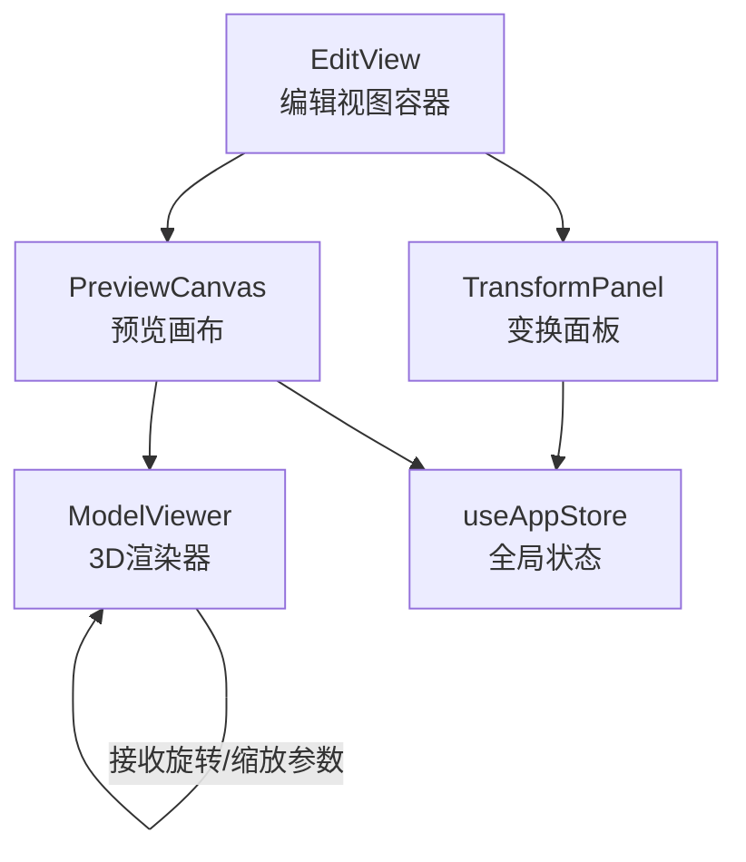
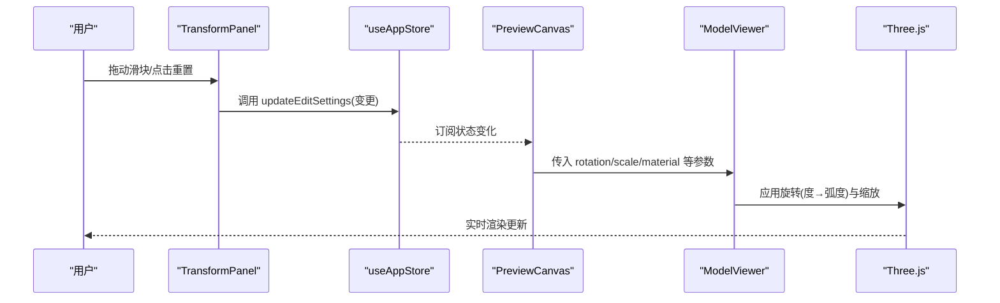
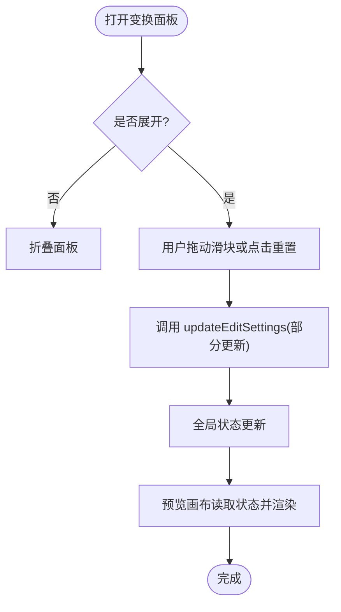
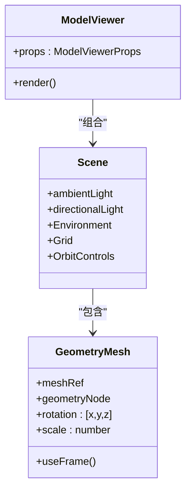
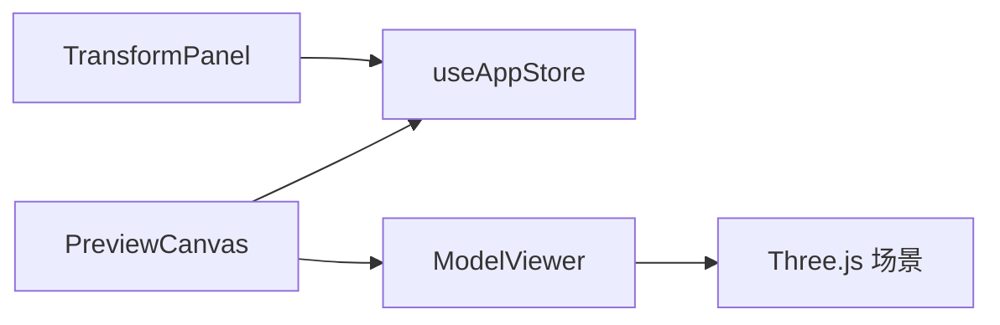

# 变换面板

<cite>
**本文引用的文件**
- [TransformPanel.tsx](file://src/components/Edit/TransformPanel.tsx)
- [EditView.tsx](file://src/components/Edit/EditView.tsx)
- [PreviewCanvas.tsx](file://src/components/Edit/PreviewCanvas.tsx)
- [ModelViewer.tsx](file://src/components/Shared/ModelViewer.tsx)
- [useAppStore.ts](file://src/store/useAppStore.ts)
- [index.ts](file://src/types/index.ts)
- [mockData.ts](file://src/utils/mockData.ts)
</cite>

## 目录
1. [简介](#简介)
2. [项目结构](#项目结构)
3. [核心组件](#核心组件)
4. [架构总览](#架构总览)
5. [详细组件分析](#详细组件分析)
6. [依赖关系分析](#依赖关系分析)
7. [性能考量](#性能考量)
8. [故障排查指南](#故障排查指南)
9. [结论](#结论)
10. [附录](#附录)

## 简介
本文件聚焦“变换面板”的实现与使用，系统性阐述几何变换功能（位置、旋转、缩放）的交互设计、状态管理、与3D模型数据结构的同步机制，并结合仓库中的Three.js集成方式，说明世界坐标与局部坐标的取舍与转换思路。同时给出最佳实践建议，帮助用户高效完成批量变换、对齐与对称编辑等任务。

## 项目结构
变换面板位于编辑模式下的UI层，通过全局状态驱动3D预览视图的实时更新。其关键路径如下：
- 编辑视图容器负责布局与模式切换（简单/专业）
- 变换面板提供数值输入与滑块控件
- 预览画布将编辑设置传递给3D渲染器
- 3D渲染器基于Three.js应用变换参数

图表来源
- [EditView.tsx:1-159](file://src/components/Edit/EditView.tsx#L1-L159)
- [TransformPanel.tsx:1-102](file://src/components/Edit/TransformPanel.tsx#L1-L102)
- [PreviewCanvas.tsx:1-54](file://src/components/Edit/PreviewCanvas.tsx#L1-L54)
- [ModelViewer.tsx:1-156](file://src/components/Shared/ModelViewer.tsx#L1-L156)
- [useAppStore.ts:1-496](file://src/store/useAppStore.ts#L1-L496)

章节来源
- [EditView.tsx:1-159](file://src/components/Edit/EditView.tsx#L1-L159)
- [TransformPanel.tsx:1-102](file://src/components/Edit/TransformPanel.tsx#L1-L102)
- [PreviewCanvas.tsx:1-54](file://src/components/Edit/PreviewCanvas.tsx#L1-L54)
- [ModelViewer.tsx:1-156](file://src/components/Shared/ModelViewer.tsx#L1-L156)
- [useAppStore.ts:1-496](file://src/store/useAppStore.ts#L1-L496)

## 核心组件
- 变换面板（TransformPanel）：提供旋转三轴与缩放的滑块控件，支持重置为默认值。
- 编辑视图（EditView）：在简单/专业两种视图模式下组织控制面板；在简单模式下提供基础变换控件。
- 预览画布（PreviewCanvas）：承载3D视图，将当前编辑设置传递给3D渲染器。
- 3D渲染器（ModelViewer）：基于Three.js应用旋转（度数到弧度转换）与缩放，渲染网格与环境。
- 全局状态（useAppStore）：集中管理编辑设置（含旋转、缩放），并提供更新方法。
- 类型定义（types/index.ts）：定义EditSettings结构，明确旋转与缩放字段。
- 默认数据（mockData.ts）：提供初始编辑设置，包含旋转与缩放的默认值。

章节来源
- [TransformPanel.tsx:1-102](file://src/components/Edit/TransformPanel.tsx#L1-L102)
- [EditView.tsx:1-159](file://src/components/Edit/EditView.tsx#L1-L159)
- [PreviewCanvas.tsx:1-54](file://src/components/Edit/PreviewCanvas.tsx#L1-L54)
- [ModelViewer.tsx:1-156](file://src/components/Shared/ModelViewer.tsx#L1-L156)
- [useAppStore.ts:1-496](file://src/store/useAppStore.ts#L1-L496)
- [index.ts:93-99](file://src/types/index.ts#L93-L99)
- [mockData.ts:14-27](file://src/utils/mockData.ts#L14-L27)

## 架构总览
变换面板与3D渲染器之间的数据流遵循单向数据流：用户在面板修改参数 → 更新全局状态 → 预览画布读取状态并传入渲染器 → Three.js根据参数更新网格姿态。

图表来源
- [TransformPanel.tsx:29-38](file://src/components/Edit/TransformPanel.tsx#L29-L38)
- [useAppStore.ts:174-177](file://src/store/useAppStore.ts#L174-L177)
- [PreviewCanvas.tsx:12-24](file://src/components/Edit/PreviewCanvas.tsx#L12-L24)
- [ModelViewer.tsx:64-79](file://src/components/Shared/ModelViewer.tsx#L64-L79)

## 详细组件分析

### 变换面板（TransformPanel）
- 控件构成
  - 三个旋转滑块：X/Y/Z轴，范围[-180, 180]，步进1度
  - 一个缩放滑块：范围[0.1, 3]，步进0.1
  - 重置按钮：将旋转归零、缩放设为1
- 数据绑定
  - 读取全局状态中的旋转与缩放
  - 通过updateEditSettings进行部分更新
- 动效与交互
  - 支持折叠/展开
  - 滑块值实时显示
  - 重置按钮一键恢复默认

图表来源
- [TransformPanel.tsx:29-98](file://src/components/Edit/TransformPanel.tsx#L29-L98)
- [useAppStore.ts:174-177](file://src/store/useAppStore.ts#L174-L177)

章节来源
- [TransformPanel.tsx:1-102](file://src/components/Edit/TransformPanel.tsx#L1-L102)

### 编辑视图（EditView）
- 视图模式
  - 简单模式：仅提供基础颜色与旋转Y、缩放滑块
  - 专业模式：加载材料、变换、光照三个面板
- 与变换面板的关系
  - 专业模式直接引入TransformPanel
  - 简单模式内联基础变换控件，逻辑与TransformPanel一致

章节来源
- [EditView.tsx:1-159](file://src/components/Edit/EditView.tsx#L1-L159)

### 预览画布（PreviewCanvas）
- 将当前编辑设置透传给3D渲染器
- 关键参数：baseColor、metallic、roughness、emission、emissionStrength、rotation、scale、lighting、background、geometry等
- 作为3D视图容器，承载网格与环境

章节来源
- [PreviewCanvas.tsx:1-54](file://src/components/Edit/PreviewCanvas.tsx#L1-L54)

### 3D渲染器（ModelViewer）
- 旋转处理
  - 将度数转换为弧度后应用到mesh.rotation
  - 支持自动旋转（autoRotate）用于演示
- 缩放处理
  - 直接应用mesh.scale
- 环境与网格
  - 环境贴图与网格辅助线可选
  - 支持多种几何体（盒、球、环面、圆柱、圆锥、环面结）

图表来源
- [ModelViewer.tsx:136-156](file://src/components/Shared/ModelViewer.tsx#L136-L156)
- [ModelViewer.tsx:82-126](file://src/components/Shared/ModelViewer.tsx#L82-L126)
- [ModelViewer.tsx:32-80](file://src/components/Shared/ModelViewer.tsx#L32-L80)

章节来源
- [ModelViewer.tsx:1-156](file://src/components/Shared/ModelViewer.tsx#L1-L156)

### 全局状态与类型定义
- 状态结构
  - EditSettings包含material、rotation、scale、lighting、background等
  - rotation为{x: number, y: number, z: number}
  - scale为number
- 更新策略
  - updateEditSettings以部分对象合并的方式更新
  - 订阅机制确保视图层响应式刷新

章节来源
- [index.ts:93-99](file://src/types/index.ts#L93-L99)
- [useAppStore.ts:174-177](file://src/store/useAppStore.ts#L174-L177)
- [mockData.ts:14-27](file://src/utils/mockData.ts#L14-L27)

## 依赖关系分析
- 组件耦合
  - TransformPanel依赖useAppStore进行读写
  - PreviewCanvas依赖useAppStore读取当前设置
  - ModelViewer不直接依赖状态，而是由上层传参
- 数据流向
  - 用户交互 → TransformPanel → useAppStore → PreviewCanvas → ModelViewer → Three.js
- 外部依赖
  - Zustand（状态管理）
  - Framer Motion（面板展开动画）
  - Three.js + @react-three/fiber/@react-three/drei（3D渲染）

图表来源
- [TransformPanel.tsx:1-102](file://src/components/Edit/TransformPanel.tsx#L1-L102)
- [PreviewCanvas.tsx:1-54](file://src/components/Edit/PreviewCanvas.tsx#L1-L54)
- [ModelViewer.tsx:1-156](file://src/components/Shared/ModelViewer.tsx#L1-L156)
- [useAppStore.ts:1-496](file://src/store/useAppStore.ts#L1-L496)

章节来源
- [TransformPanel.tsx:1-102](file://src/components/Edit/TransformPanel.tsx#L1-L102)
- [PreviewCanvas.tsx:1-54](file://src/components/Edit/PreviewCanvas.tsx#L1-L54)
- [ModelViewer.tsx:1-156](file://src/components/Shared/ModelViewer.tsx#L1-L156)
- [useAppStore.ts:1-496](file://src/store/useAppStore.ts#L1-L496)

## 性能考量
- 渲染性能
  - 使用React.memo包装ModelViewer，避免不必要的重渲染
  - useFrame仅在需要时更新（如autoRotate）
- 状态更新
  - updateEditSettings采用浅合并，减少深层拷贝开销
  - 订阅机制按需触发视图更新
- 交互体验
  - 滑块步进与范围合理设置，避免频繁微小更新导致抖动

章节来源
- [ModelViewer.tsx:136-156](file://src/components/Shared/ModelViewer.tsx#L136-L156)
- [useAppStore.ts:174-177](file://src/store/useAppStore.ts#L174-L177)

## 故障排查指南
- 变换无效
  - 检查是否在正确视图模式下使用TransformPanel（专业模式）
  - 确认updateEditSettings被调用且参数有效
- 旋转异常
  - 确认度数到弧度转换已在渲染端执行
  - 检查是否存在其他外部控制器覆盖rotation
- 缩放异常
  - 确认scale范围与步进设置符合预期
  - 检查是否存在负值或零值导致不可见
- 面板不显示
  - 检查面板折叠状态与动画过渡
  - 确认useAppStore中editSettings存在且非空

章节来源
- [TransformPanel.tsx:29-98](file://src/components/Edit/TransformPanel.tsx#L29-L98)
- [ModelViewer.tsx:64-79](file://src/components/Shared/ModelViewer.tsx#L64-L79)
- [useAppStore.ts:174-177](file://src/store/useAppStore.ts#L174-L177)

## 结论
变换面板通过简洁直观的滑块与重置按钮，实现了对旋转与缩放的精确控制，并与3D渲染器形成清晰的单向数据流。配合全局状态管理与响应式更新，用户可在编辑视图中即时看到变换效果。未来可扩展方向包括：增加位置（Position）控件、坐标系选择（世界/局部）、变换约束与增量调整、批量变换与对齐/对称工具，以及更丰富的数学表达（欧拉角/四元数/变换矩阵）以满足高级用户需求。

## 附录

### 数学原理与坐标系说明
- 旋转
  - 当前实现使用欧拉角（XYZ顺序），以度为单位输入，在渲染端转换为弧度应用
  - Three.js默认使用弧度，因此存在从度到弧度的转换步骤
- 缩放
  - 使用统一标量缩放，直接应用于mesh.scale
- 坐标系
  - 仓库未提供显式的“世界/局部”切换开关；当前为局部坐标系（相对父节点）
  - 若需世界坐标系，可在Three.js层面通过父节点变换矩阵进行转换
- 四元数与变换矩阵
  - Three.js内部使用四元数与变换矩阵进行旋转与复合变换
  - 如需更高精度或避免万向节锁，可在渲染层使用四元数接口

章节来源
- [ModelViewer.tsx:23-23](file://src/components/Shared/ModelViewer.tsx#L23-L23)
- [ModelViewer.tsx:64-79](file://src/components/Shared/ModelViewer.tsx#L64-L79)

### 交互设计要点
- 数值输入框
  - 提供滑块与数值显示，便于快速调整与精确输入
- 滑块控件
  - 合理设置min/max/step，保证用户体验与精度平衡
- 重置按钮
  - 快速回到默认状态，提升可回溯性
- 展开/收起
  - 通过动画折叠面板，节省空间并保持界面整洁

章节来源
- [TransformPanel.tsx:6-27](file://src/components/Edit/TransformPanel.tsx#L6-L27)
- [TransformPanel.tsx:29-98](file://src/components/Edit/TransformPanel.tsx#L29-L98)

### 最佳实践
- 批量变换
  - 在专业模式下先调整缩放，再调整旋转，最后调整位置，以获得稳定视觉效果
- 对齐工具
  - 利用网格与环境辅助线进行对齐；必要时在Three.js层面计算包围盒中心进行对齐
- 对称编辑
  - 通过镜像几何体或对称约束（如镜像工具）实现对称编辑；当前仓库未提供专用对称工具
- 变换约束与增量调整
  - 可在面板层增加“步进增量”与“约束轴”选项，提升精确度与效率

[本节为通用指导，不直接分析具体文件]