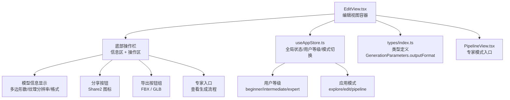
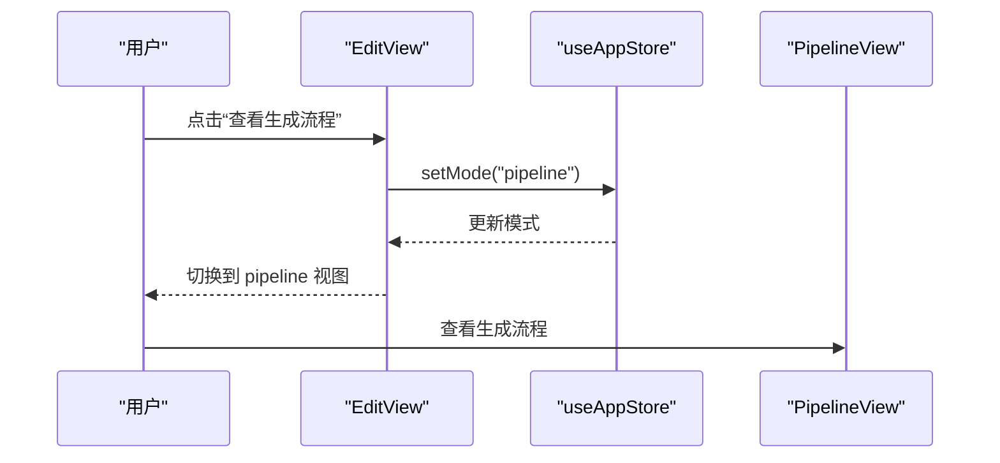
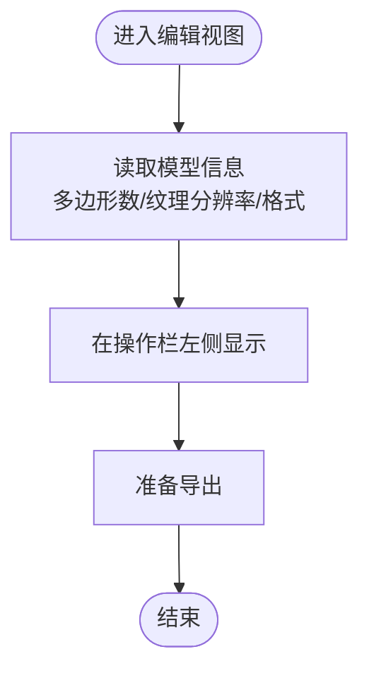
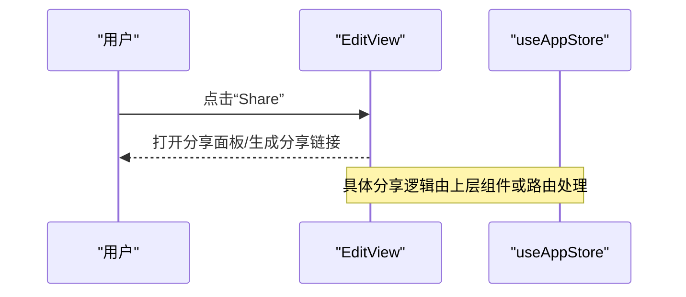
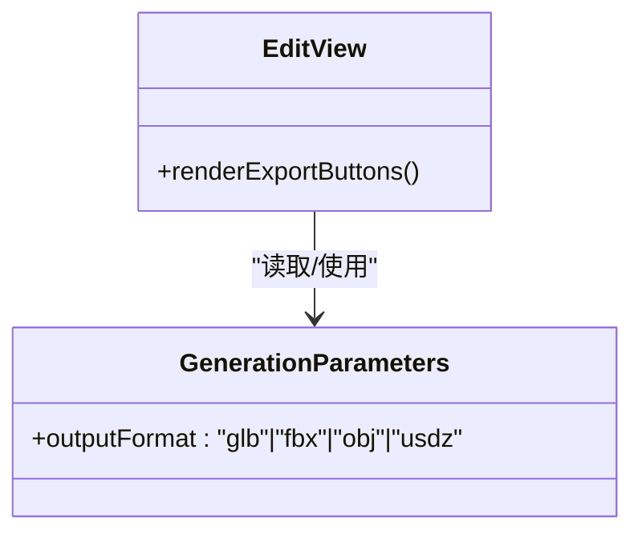
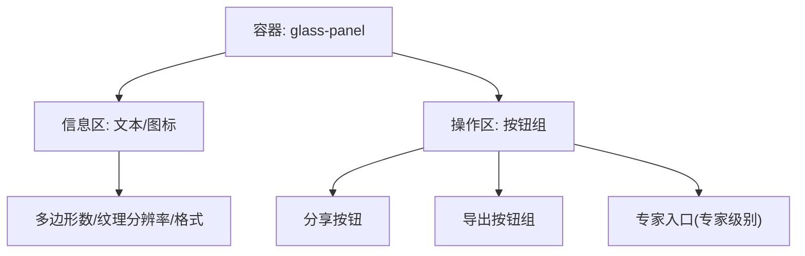
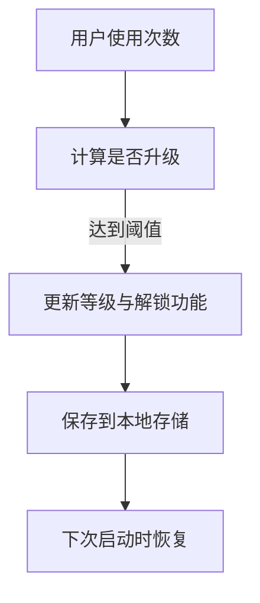
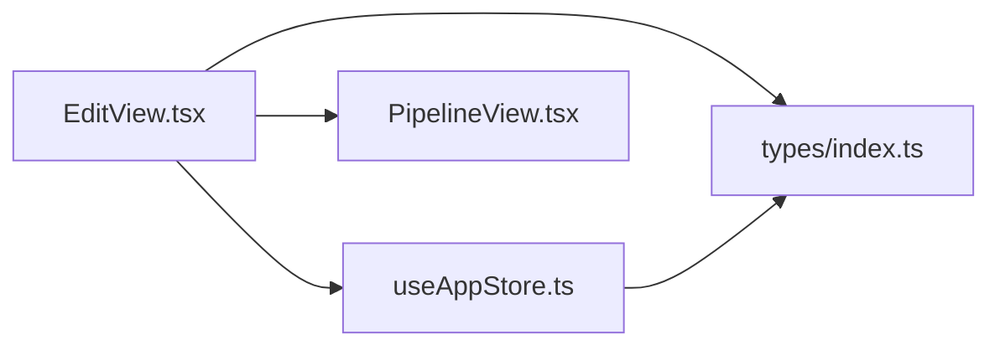

# 操作栏

<cite>
**本文引用的文件**
- [EditView.tsx](file://src/components/Edit/EditView.tsx)
- [useAppStore.ts](file://src/store/useAppStore.ts)
- [index.ts](file://src/types/index.ts)
- [PipelineView.tsx](file://src/components/Pipeline/PipelineView.tsx)
- [mockData.ts](file://src/utils/mockData.ts)
- [Header.tsx](file://src/components/Layout/Header.tsx)
- [index.css](file://src/index.css)
</cite>

## 目录
1. [简介](#简介)
2. [项目结构](#项目结构)
3. [核心组件](#核心组件)
4. [架构总览](#架构总览)
5. [详细组件分析](#详细组件分析)
6. [依赖关系分析](#依赖关系分析)
7. [性能考量](#性能考量)
8. [故障排查指南](#故障排查指南)
9. [结论](#结论)
10. [附录](#附录)

## 简介
本文件聚焦“编辑模式底部操作栏”的设计与功能，涵盖以下方面：
- 模型信息显示（多边形数量、纹理分辨率、当前格式）
- 分享功能（按钮入口与交互行为）
- 导出选项（GLB、FBX 等格式支持与适用场景）
- 高级功能入口（专家模式下的“查看生成流程”）
- 响应式设计与不同屏幕尺寸适配
- 操作流程最佳实践（导出前检查、格式选择、质量设置）
- 与用户权限系统的集成（用户等级与功能解锁）

## 项目结构
操作栏位于编辑视图的底部区域，采用“信息区 + 操作区”的布局，配合全局状态管理与权限控制，实现简洁而强大的导出与分享能力。

图表来源
- [EditView.tsx:116-155](file://src/components/Edit/EditView.tsx#L116-L155)
- [useAppStore.ts:54-112](file://src/store/useAppStore.ts#L54-L112)
- [index.ts:50](file://src/types/index.ts#L50)
- [PipelineView.tsx:9-12](file://src/components/Pipeline/PipelineView.tsx#L9-L12)

章节来源
- [EditView.tsx:116-155](file://src/components/Edit/EditView.tsx#L116-L155)
- [useAppStore.ts:54-112](file://src/store/useAppStore.ts#L54-L112)
- [index.ts:50](file://src/types/index.ts#L50)

## 核心组件
- 底部操作栏容器：负责布局与动画过渡，承载信息区与操作区。
- 模型信息显示：展示当前模型的多边形数量、纹理分辨率与导出格式。
- 分享按钮：触发分享流程（具体实现由上层逻辑或路由处理）。
- 导出按钮组：包含 FBX 与 GLB 两种导出选项，GLB 采用强调样式。
- 专家入口：当用户等级为 expert 时显示“查看生成流程”，点击后切换至 pipeline 视图。

章节来源
- [EditView.tsx:116-155](file://src/components/Edit/EditView.tsx#L116-L155)

## 架构总览
操作栏通过全局状态管理器读取用户等级与当前视图模式，并根据权限动态渲染专家入口；导出按钮与分享按钮作为交互入口，配合类型系统中的输出格式枚举，确保导出参数的一致性。

图表来源
- [EditView.tsx:145-153](file://src/components/Edit/EditView.tsx#L145-L153)
- [useAppStore.ts:114-116](file://src/store/useAppStore.ts#L114-L116)
- [PipelineView.tsx:9-12](file://src/components/Pipeline/PipelineView.tsx#L9-L12)

## 详细组件分析

### 模型信息显示
- 多边形数量：用于评估模型复杂度与性能影响。
- 纹理分辨率：反映贴图质量与文件体积权衡。
- 当前格式：标识当前导出格式（例如 GLB），便于用户确认导出目标。

图表来源
- [EditView.tsx:123-129](file://src/components/Edit/EditView.tsx#L123-L129)

章节来源
- [EditView.tsx:123-129](file://src/components/Edit/EditView.tsx#L123-L129)

### 分享功能
- 按钮图标：使用分享图标，文本为“Share”。
- 行为说明：点击后触发分享流程（具体实现由上层路由或对话系统处理）。该按钮在权限与功能解锁层面不涉及额外限制，仅作为入口。

图表来源
- [EditView.tsx:133-136](file://src/components/Edit/EditView.tsx#L133-L136)

章节来源
- [EditView.tsx:133-136](file://src/components/Edit/EditView.tsx#L133-L136)

### 导出选项与格式支持
- 支持格式：GLB、FBX、OBJ、USDZ（由类型定义提供）。
- 默认格式：生成参数默认输出格式为 GLB。
- 适用场景：
  - GLB：Web 优先、嵌入式纹理、通用性强，适合网页/移动端分发。
  - FBX：传统工业标准，广泛用于游戏引擎与动画管线。
  - OBJ：纯几何与纹理路径分离，便于手动编辑与跨平台兼容。
  - USDZ：苹果生态（AR Quick Look）首选，适合 iOS 设备展示。

图表来源
- [index.ts:50](file://src/types/index.ts#L50)
- [EditView.tsx:137-144](file://src/components/Edit/EditView.tsx#L137-L144)

章节来源
- [index.ts:50](file://src/types/index.ts#L50)
- [EditView.tsx:137-144](file://src/components/Edit/EditView.tsx#L137-L144)
- [mockData.ts:3-12](file://src/utils/mockData.ts#L3-L12)

### 专家模式高级功能入口
- 条件渲染：仅当用户等级为 expert 时显示“查看生成流程”按钮。
- 功能入口：点击后切换至 pipeline 视图，展示生成流程的节点与步骤。
- 与权限系统集成：用户等级与功能解锁由全局状态管理维护。

图表来源
- [EditView.tsx:145-153](file://src/components/Edit/EditView.tsx#L145-L153)
- [useAppStore.ts:114-116](file://src/store/useAppStore.ts#L114-L116)
- [PipelineView.tsx:9-12](file://src/components/Pipeline/PipelineView.tsx#L9-L12)

章节来源
- [EditView.tsx:145-153](file://src/components/Edit/EditView.tsx#L145-L153)
- [useAppStore.ts:185-293](file://src/store/useAppStore.ts#L185-L293)
- [PipelineView.tsx:9-12](file://src/components/Pipeline/PipelineView.tsx#L9-L12)

### 响应式设计与屏幕适配
- 布局：操作栏采用 Flex 布局，左右分区清晰，间距与内边距在小屏与大屏下保持一致。
- 组件样式：使用 Tailwind 类名统一风格，容器具备毛玻璃背景与边框，保证在深色主题下可读性。
- 屏幕尺寸适配：通过相对宽度与弹性布局，在桌面端与移动设备上均能良好显示。

图表来源
- [EditView.tsx:116-155](file://src/components/Edit/EditView.tsx#L116-L155)
- [index.css:38-46](file://src/index.css#L38-L46)

章节来源
- [EditView.tsx:116-155](file://src/components/Edit/EditView.tsx#L116-L155)
- [index.css:38-46](file://src/index.css#L38-L46)

### 操作流程最佳实践
- 导出前检查
  - 确认模型复杂度与纹理分辨率，避免过大文件导致传输与加载问题。
  - 根据目标平台选择合适格式：Web/移动端优先 GLB；游戏/动画管线优先 FBX；需要手动编辑选 OBJ。
- 格式选择
  - 默认 GLB，满足大多数分发场景；若需与第三方工具链对接，选择 FBX/OBJ/USDZ。
- 质量设置
  - 在生成阶段通过参数控制拓扑、纹理分辨率与多边形预算，导出时保持一致设置以避免重复转换。

章节来源
- [index.ts:42-51](file://src/types/index.ts#L42-L51)
- [mockData.ts:3-12](file://src/utils/mockData.ts#L3-L12)

### 与用户权限系统的集成
- 用户等级：beginner、intermediate、expert，决定功能可见性与可用性。
- 功能解锁：随着使用次数增加自动解锁，专家级别解锁“查看生成流程”等高级功能。
- 状态持久化：用户等级与功能列表保存在本地存储，重启后仍生效。

图表来源
- [useAppStore.ts:191-229](file://src/store/useAppStore.ts#L191-L229)
- [useAppStore.ts:397-408](file://src/store/useAppStore.ts#L397-L408)

章节来源
- [useAppStore.ts:185-293](file://src/store/useAppStore.ts#L185-L293)
- [Header.tsx:4-8](file://src/components/Layout/Header.tsx#L4-L8)

## 依赖关系分析
- EditView 依赖全局状态管理器以读取用户等级与应用模式，并据此渲染专家入口。
- 导出格式枚举来自类型定义，保证导出参数一致性。
- PipelineView 作为专家模式入口，与 EditView 通过模式切换协同工作。

图表来源
- [EditView.tsx:10-11](file://src/components/Edit/EditView.tsx#L10-L11)
- [useAppStore.ts:54-112](file://src/store/useAppStore.ts#L54-L112)
- [index.ts:50](file://src/types/index.ts#L50)
- [PipelineView.tsx:9-12](file://src/components/Pipeline/PipelineView.tsx#L9-L12)

章节来源
- [EditView.tsx:10-11](file://src/components/Edit/EditView.tsx#L10-L11)
- [useAppStore.ts:54-112](file://src/store/useAppStore.ts#L54-L112)
- [index.ts:50](file://src/types/index.ts#L50)
- [PipelineView.tsx:9-12](file://src/components/Pipeline/PipelineView.tsx#L9-L12)

## 性能考量
- 操作栏为轻量 UI 组件，渲染成本极低，不会对整体性能造成负担。
- 导出流程的性能取决于模型复杂度与纹理大小，应在导出前进行合理控制。
- 专家模式下的流程视图在专业模式下采用节点图，注意避免一次性渲染过多节点导致卡顿。

## 故障排查指南
- 专家入口不可见
  - 检查用户等级是否为 expert；可通过使用计数与解锁逻辑确认。
- 导出按钮无响应
  - 确认当前任务已完成且存在结果数据；检查导出格式是否正确。
- 分享按钮无响应
  - 确认上层路由或对话系统已实现分享逻辑；检查是否有权限限制。

章节来源
- [useAppStore.ts:191-229](file://src/store/useAppStore.ts#L191-L229)
- [EditView.tsx:133-144](file://src/components/Edit/EditView.tsx#L133-L144)

## 结论
编辑模式底部操作栏以简洁直观的方式提供了模型信息展示、分享与导出能力，并通过专家入口连接到生成流程视图。结合全局状态管理与用户权限系统，实现了从基础到高级的完整工作流。建议在实际使用中遵循导出前检查与格式选择的最佳实践，以获得更优的用户体验与输出质量。

## 附录
- 关键实现位置
  - 操作栏布局与按钮：[EditView.tsx:116-155](file://src/components/Edit/EditView.tsx#L116-L155)
  - 用户等级与功能解锁：[useAppStore.ts:185-293](file://src/store/useAppStore.ts#L185-L293)
  - 导出格式枚举：[index.ts:50](file://src/types/index.ts#L50)
  - 专家模式入口：[PipelineView.tsx:9-12](file://src/components/Pipeline/PipelineView.tsx#L9-L12)
  - 默认导出格式：[mockData.ts:3-12](file://src/utils/mockData.ts#L3-L12)
  - 毛玻璃样式类：[index.css:38-46](file://src/index.css#L38-L46)