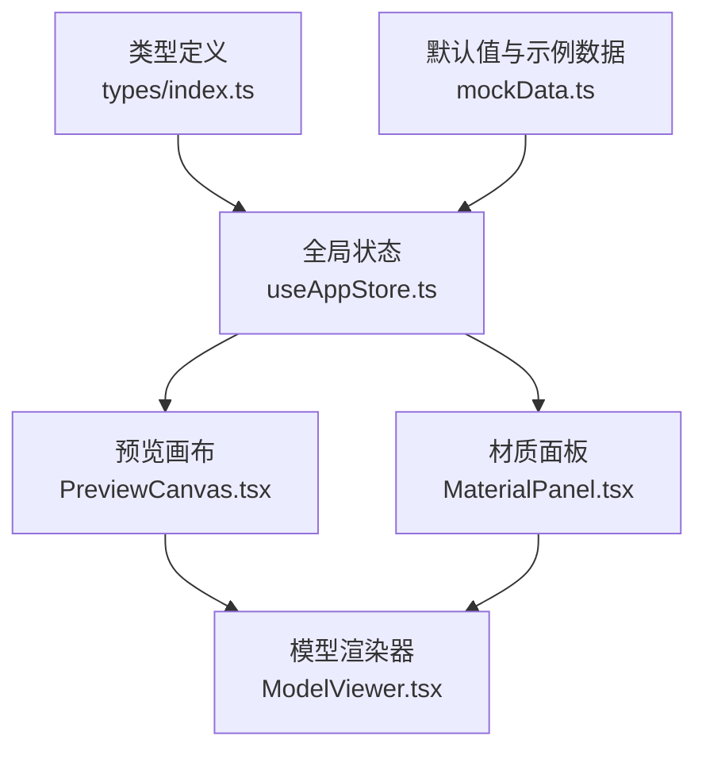
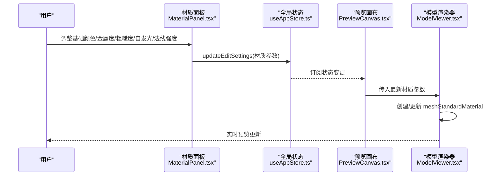
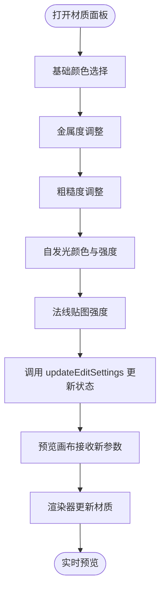
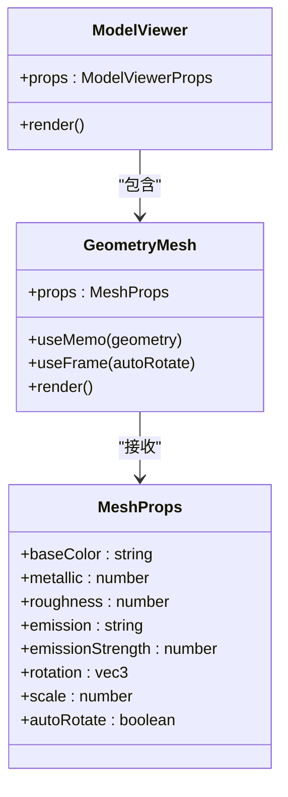
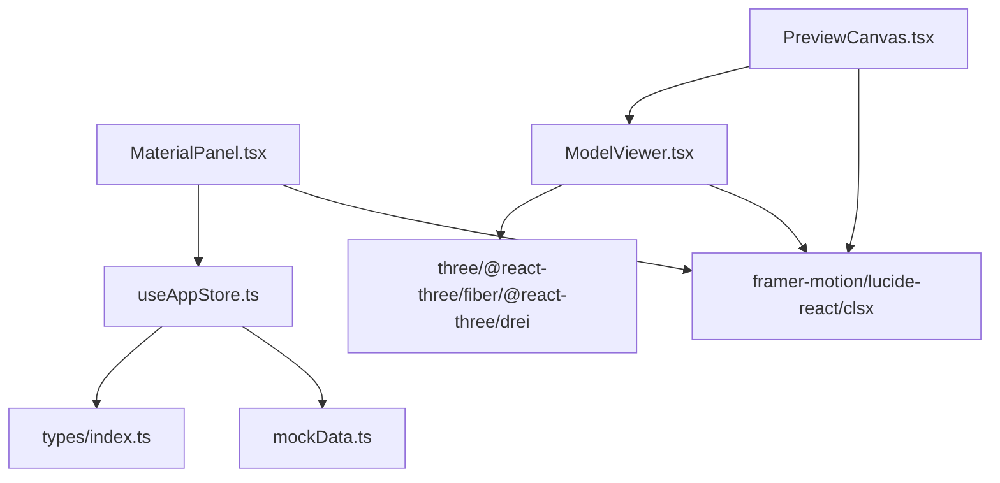

# 材质面板

<cite>
**本文引用的文件**
- [MaterialPanel.tsx](file://src/components/Edit/MaterialPanel.tsx)
- [ModelViewer.tsx](file://src/components/Shared/ModelViewer.tsx)
- [PreviewCanvas.tsx](file://src/components/Edit/PreviewCanvas.tsx)
- [EditView.tsx](file://src/components/Edit/EditView.tsx)
- [useAppStore.ts](file://src/store/useAppStore.ts)
- [index.ts](file://src/types/index.ts)
- [mockData.ts](file://src/utils/mockData.ts)
- [package.json](file://package.json)
</cite>

## 目录
1. [简介](#简介)
2. [项目结构](#项目结构)
3. [核心组件](#核心组件)
4. [架构总览](#架构总览)
5. [详细组件分析](#详细组件分析)
6. [依赖关系分析](#依赖关系分析)
7. [性能考量](#性能考量)
8. [故障排查指南](#故障排查指南)
9. [结论](#结论)
10. [附录](#附录)

## 简介
本文件全面介绍材质面板的功能与实现，涵盖基础颜色、金属度、粗糙度、自发光（发射）以及法线贴图强度等材质属性的调整；解释材质系统的架构（基于PBR材质模型）、纹理映射与着色器配置；阐述材质预览机制与实时更新效果；说明材质面板与Three.js材质系统的集成方式（材质对象的创建、修改与销毁）；提供材质编辑工作流程与最佳实践（材质组合、纹理优化与性能考虑）；并解释材质面板在专业模式下的完整功能与使用场景。

## 项目结构
材质系统围绕“状态管理 + 预览渲染 + 控制面板”三层协作：
- 状态层：通过全局状态存储材质参数与视图设置
- 渲染层：基于Three.js与React Three Fiber进行材质渲染
- 控制层：材质面板提供交互控件，驱动状态变更并触发实时预览

图表来源
- [useAppStore.ts:65-77](file://src/store/useAppStore.ts#L65-L77)
- [MaterialPanel.tsx:71-80](file://src/components/Edit/MaterialPanel.tsx#L71-L80)
- [PreviewCanvas.tsx:5-25](file://src/components/Edit/PreviewCanvas.tsx#L5-L25)
- [ModelViewer.tsx:64-79](file://src/components/Shared/ModelViewer.tsx#L64-L79)
- [index.ts:84-99](file://src/types/index.ts#L84-L99)
- [mockData.ts:14-27](file://src/utils/mockData.ts#L14-L27)

章节来源
- [useAppStore.ts:65-77](file://src/store/useAppStore.ts#L65-L77)
- [MaterialPanel.tsx:71-80](file://src/components/Edit/MaterialPanel.tsx#L71-L80)
- [PreviewCanvas.tsx:5-25](file://src/components/Edit/PreviewCanvas.tsx#L5-L25)
- [ModelViewer.tsx:64-79](file://src/components/Shared/ModelViewer.tsx#L64-L79)
- [index.ts:84-99](file://src/types/index.ts#L84-L99)
- [mockData.ts:14-27](file://src/utils/mockData.ts#L14-L27)

## 核心组件
- 材质面板（MaterialPanel）：提供基础颜色、金属度、粗糙度、自发光颜色与强度、法线贴图强度的交互控件，并支持折叠展开
- 模型渲染器（ModelViewer）：封装Three.js场景，使用标准材质（meshStandardMaterial）渲染几何体，接收材质参数并实时更新
- 预览画布（PreviewCanvas）：承载渲染器，将全局状态中的材质参数传递给渲染器
- 全局状态（useAppStore）：集中管理材质设置、变换、光照与背景等编辑参数
- 类型定义（types/index.ts）：定义材质设置的数据结构与取值范围
- 默认值（mockData.ts）：提供初始材质参数与风格预设

章节来源
- [MaterialPanel.tsx:71-208](file://src/components/Edit/MaterialPanel.tsx#L71-L208)
- [ModelViewer.tsx:32-80](file://src/components/Shared/ModelViewer.tsx#L32-L80)
- [PreviewCanvas.tsx:5-25](file://src/components/Edit/PreviewCanvas.tsx#L5-L25)
- [useAppStore.ts:65-77](file://src/store/useAppStore.ts#L65-L77)
- [index.ts:84-99](file://src/types/index.ts#L84-L99)
- [mockData.ts:14-27](file://src/utils/mockData.ts#L14-L27)

## 架构总览
材质系统采用“状态驱动渲染”的架构：
- 用户在材质面板调整参数
- 全局状态被更新
- 预览画布订阅状态变化并重新渲染
- 渲染器根据材质参数创建或更新Three.js材质对象

图表来源
- [MaterialPanel.tsx:76-80](file://src/components/Edit/MaterialPanel.tsx#L76-L80)
- [useAppStore.ts:174-177](file://src/store/useAppStore.ts#L174-L177)
- [PreviewCanvas.tsx:12-24](file://src/components/Edit/PreviewCanvas.tsx#L12-L24)
- [ModelViewer.tsx:71-77](file://src/components/Shared/ModelViewer.tsx#L71-L77)

## 详细组件分析

### 材质面板（MaterialPanel）
- 功能要点
  - 基础颜色：支持十六进制颜色选择器与颜色值显示
  - 金属度：0~1范围滑块，步进0.01
  - 粗糙度：0~1范围滑块，步进0.01
  - 自发光：颜色选择器 + 强度滑块（0~5，步进0.1）
  - 法线贴图强度：0~2范围滑块，步进0.01
  - 支持折叠展开，使用动画过渡
- 数据流
  - 通过全局状态的updateEditSettings更新材质字段
  - 更新后由预览画布与渲染器自动刷新

图表来源
- [MaterialPanel.tsx:120-201](file://src/components/Edit/MaterialPanel.tsx#L120-L201)
- [useAppStore.ts:174-177](file://src/store/useAppStore.ts#L174-L177)
- [PreviewCanvas.tsx:12-24](file://src/components/Edit/PreviewCanvas.tsx#L12-L24)
- [ModelViewer.tsx:71-77](file://src/components/Shared/ModelViewer.tsx#L71-L77)

章节来源
- [MaterialPanel.tsx:71-208](file://src/components/Edit/MaterialPanel.tsx#L71-L208)

### 模型渲染器（ModelViewer）
- 功能要点
  - 使用meshStandardMaterial承载PBR材质属性
  - 支持多种几何体（盒体、球体、环面、圆柱、圆锥、三叶结）
  - 支持自动旋转、网格显示、环境光与方向光
  - 将自发光颜色与强度映射为THREE.Color与emissiveIntensity
- 关键点
  - 材质属性直接从父组件传入，无需手动创建材质对象
  - 渲染器内部使用useMemo缓存几何体节点，useFrame处理自动旋转

图表来源
- [ModelViewer.tsx:6-21](file://src/components/Shared/ModelViewer.tsx#L6-L21)
- [ModelViewer.tsx:32-80](file://src/components/Shared/ModelViewer.tsx#L32-L80)
- [ModelViewer.tsx:82-126](file://src/components/Shared/ModelViewer.tsx#L82-L126)

章节来源
- [ModelViewer.tsx:32-80](file://src/components/Shared/ModelViewer.tsx#L32-L80)

### 预览画布（PreviewCanvas）
- 功能要点
  - 承载Canvas与Suspense加载占位
  - 将全局状态中的材质参数传递给ModelViewer
  - 提供视角控制按钮（缩放、旋转、复位、最大化）
- 数据绑定
  - 读取editSettings.material与editSettings.rotation/scale/lighting/background

章节来源
- [PreviewCanvas.tsx:5-25](file://src/components/Edit/PreviewCanvas.tsx#L5-L25)

### 全局状态（useAppStore）
- 功能要点
  - 维护editSettings：包含material、rotation、scale、lighting、background
  - 提供updateEditSettings用于部分更新
  - 默认材质参数来源于mockData.ts
- 与材质面板的协作
  - 材质面板通过updateEditSettings更新material字段
  - 预览画布与渲染器订阅状态变化，实现无感知刷新

章节来源
- [useAppStore.ts:65-77](file://src/store/useAppStore.ts#L65-L77)
- [useAppStore.ts:174-177](file://src/store/useAppStore.ts#L174-L177)
- [mockData.ts:14-27](file://src/utils/mockData.ts#L14-L27)

### 类型定义（types/index.ts）
- MaterialSettings：定义基础颜色、金属度、粗糙度、自发光颜色、自发光强度、法线贴图强度
- EditSettings：包含MaterialSettings与其他编辑参数
- 作用：约束状态结构，确保材质参数的类型安全与可维护性

章节来源
- [index.ts:84-99](file://src/types/index.ts#L84-L99)

## 依赖关系分析
- 外部依赖
  - three、@react-three/fiber、@react-three/drei：Three.js与React Three Fiber生态
  - framer-motion：UI动画与过渡
  - lucide-react：图标库
  - clsx：条件类名拼接
- 内部依赖
  - MaterialPanel依赖useAppStore与自定义滑条组件
  - PreviewCanvas依赖ModelViewer与useAppStore
  - ModelViewer依赖THREE与@react-three/drei

图表来源
- [MaterialPanel.tsx:1-6](file://src/components/Edit/MaterialPanel.tsx#L1-L6)
- [PreviewCanvas.tsx:1-3](file://src/components/Edit/PreviewCanvas.tsx#L1-L3)
- [ModelViewer.tsx:1-4](file://src/components/Shared/ModelViewer.tsx#L1-L4)
- [useAppStore.ts:1-18](file://src/store/useAppStore.ts#L1-L18)
- [index.ts:1-17](file://src/types/index.ts#L1-L17)
- [mockData.ts:1-12](file://src/utils/mockData.ts#L1-L12)
- [package.json:11-22](file://package.json#L11-L22)

章节来源
- [package.json:11-22](file://package.json#L11-L22)

## 性能考量
- 几何体缓存：ModelViewer使用useMemo缓存几何体节点，避免重复创建
- 材质更新：材质参数通过属性传递，渲染器内部按需更新材质属性
- 动画与交互：滑块与颜色选择器均为轻量级DOM控件，不会阻塞渲染
- 纹理与分辨率：当前示例纹理分辨率为2048x2048，若需更高分辨率应考虑内存占用与GPU性能
- 自动旋转：仅在启用autoRotate时执行useFrame逻辑，避免不必要的帧循环

章节来源
- [ModelViewer.tsx:51-60](file://src/components/Shared/ModelViewer.tsx#L51-L60)
- [ModelViewer.tsx:45-49](file://src/components/Shared/ModelViewer.tsx#L45-L49)

## 故障排查指南
- 颜色值无效
  - 确认基础颜色为合法十六进制字符串
  - 若输入非法值，Three.js材质可能无法正确解析
- 金属度/粗糙度超出范围
  - 请确保值在[0,1]范围内
  - 超出范围可能导致材质视觉异常
- 自发光颜色不生效
  - 检查emission是否为有效颜色值
  - emissionStrength需大于0才可见
- 法线贴图强度过高
  - 建议从0.5开始逐步增加，避免过度夸张的表面细节
- 预览不更新
  - 确认useAppStore.updateEditSettings已被调用
  - 确认PreviewCanvas正确接收并传递材质参数
- 环境光照与材质表现不符
  - 切换lighting预设（studio/outdoor/dramatic/neutral）观察差异
  - 调整环境光强度或方向光强度以改善材质反射

章节来源
- [MaterialPanel.tsx:146-201](file://src/components/Edit/MaterialPanel.tsx#L146-L201)
- [ModelViewer.tsx:25-30](file://src/components/Shared/ModelViewer.tsx#L25-L30)
- [PreviewCanvas.tsx:12-24](file://src/components/Edit/PreviewCanvas.tsx#L12-L24)

## 结论
材质面板通过简洁直观的控件与全局状态驱动的实时预览，实现了对PBR材质属性的高效编辑。其与Three.js材质系统的无缝集成使得用户能够在专业模式下精细调节基础颜色、金属度、粗糙度、自发光与法线贴图强度，从而获得高质量的材质表现。配合默认参数与光照预设，用户可在不同风格间快速切换并优化最终效果。

## 附录

### 专业模式下的完整功能与使用场景
- 专业模式（viewMode='professional'）提供完整的材质、变换与光照面板
- 使用场景
  - 产品展示：调整金属度与粗糙度模拟真实材料
  - 角色建模：通过自发光与法线贴图增强细节
  - 场景构建：结合光照预设与背景色营造氛围
- 与生成流程联动
  - 在专家级别可进入管道视图，查看材质生成步骤与参数链路

章节来源
- [EditView.tsx:105-112](file://src/components/Edit/EditView.tsx#L105-L112)
- [useAppStore.ts:187-189](file://src/store/useAppStore.ts#L187-L189)

### 材质编辑工作流程与最佳实践
- 工作流程
  - 选择风格与基础形状
  - 调整基础颜色与金属度/粗糙度
  - 添加自发光以突出特定区域
  - 增强法线贴图以提升表面细节
  - 切换光照预设验证材质表现
- 最佳实践
  - 从较低的法线强度开始，逐步增加
  - 保持金属度与粗糙度的平衡，避免极端值
  - 使用自发光时注意强度与颜色搭配
  - 在不同光照环境下对比材质效果
  - 导出前确认纹理分辨率与格式要求

章节来源
- [EditView.tsx:105-112](file://src/components/Edit/EditView.tsx#L105-L112)
- [mockData.ts:29-72](file://src/utils/mockData.ts#L29-L72)